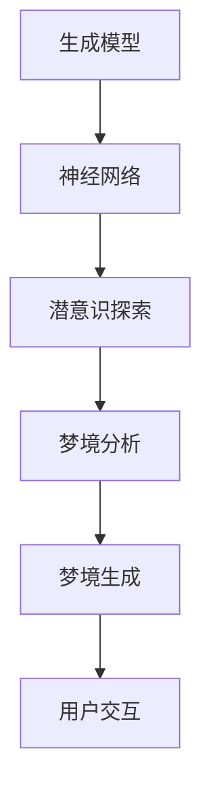
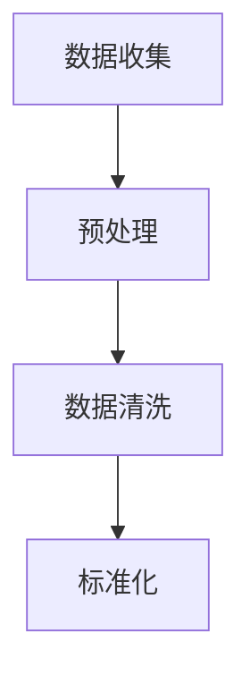
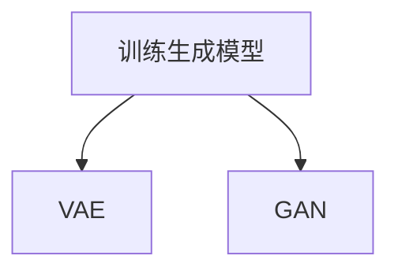
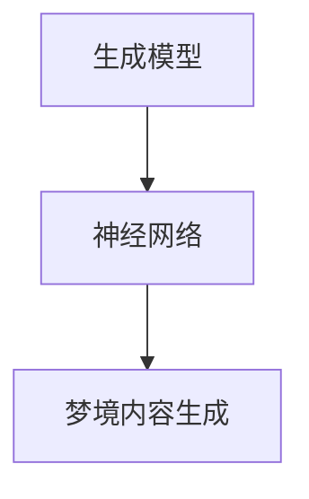
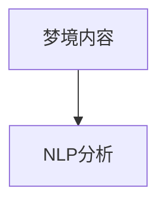
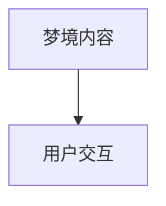

                 

关键词：数字化梦境、AI设计、潜意识探索、认知科学、图灵测试、生成模型、神经科学、梦境分析、数字孪生、未来应用。

## 摘要

本文将探讨人工智能（AI）在数字化梦境编织领域中的应用，以及如何通过潜意识探索来揭示人类认知的深层结构。我们将介绍相关核心概念，分析AI设计中的关键技术，并探讨其潜在的应用领域。此外，我们还将深入探讨数学模型和公式，以及通过具体代码实例展示如何实现这些算法。最后，我们将探讨数字化梦境编织的实际应用场景，并展望其未来的发展趋势与挑战。

## 1. 背景介绍

在过去的几十年中，人工智能和认知科学领域取得了巨大的进展。人工智能（AI）技术的快速发展使得计算机能够在多个领域表现出惊人的智能行为，包括语音识别、图像处理、自然语言处理等。同时，神经科学的进步使我们能够更深入地了解大脑的工作机制，揭示了人类认知的复杂性和多样性。

梦境是人类潜意识的一种表现形式，是大脑在睡眠过程中对日常经历、情感和记忆的处理过程。长期以来，梦境一直被视为人类认知和心理的神秘领域。然而，随着技术的进步，科学家们开始尝试通过数字化方法来分析和理解梦境。

数字化梦境编织（Digital Dream Weaving）是一种利用人工智能技术来创造和解释梦境的方法。通过分析大量的梦境数据，AI模型可以学习到梦境的模式和特征，进而生成新的梦境内容。这种方法不仅有助于我们更好地理解梦境的本质，还可以为人类提供新的梦境体验，甚至可能对心理健康和治疗产生影响。

## 2. 核心概念与联系

为了深入探讨数字化梦境编织，我们需要了解一些核心概念，包括生成模型、神经网络、潜意识探索等。

### 2.1 生成模型

生成模型是一种人工智能模型，旨在生成新的数据样本，以模拟数据分布。在数字化梦境编织中，生成模型可以用于创建新的梦境内容。常见的生成模型包括变分自编码器（VAE）、生成对抗网络（GAN）等。

### 2.2 神经网络

神经网络是一种由大量相互连接的节点（神经元）组成的计算模型，能够通过学习数据来模拟和预测复杂的非线性关系。在数字化梦境编织中，神经网络用于处理和生成梦境数据。

### 2.3 潜意识探索

潜意识探索是指通过分析梦境来揭示人类心理的深层结构。这涉及到对梦境内容的语义分析、情感分析等。通过潜意识探索，我们可以更深入地了解人类的内心世界。

### 2.4 Mermaid 流程图

以下是数字化梦境编织的Mermaid流程图，展示了核心概念和联系：



## 3. 核心算法原理 & 具体操作步骤

### 3.1 算法原理概述

数字化梦境编织的核心算法基于生成模型和神经网络。生成模型用于学习梦境数据的分布，神经网络则用于处理和生成梦境内容。以下是具体的算法原理和操作步骤：

### 3.2 算法步骤详解

#### 步骤1：数据收集与预处理

首先，需要收集大量的梦境数据，包括梦境内容、情感标签、梦境发生的时间等。然后，对数据进行预处理，包括数据清洗、标准化等。



#### 步骤2：生成模型训练

使用收集到的数据，训练生成模型。生成模型可以采用VAE或GAN等。在训练过程中，模型会不断优化参数，以生成更逼真的梦境内容。



#### 步骤3：梦境内容生成

利用训练好的生成模型，生成新的梦境内容。生成过程可以通过神经网络实现，例如使用递归神经网络（RNN）或长短期记忆网络（LSTM）。



#### 步骤4：梦境内容分析

对生成的梦境内容进行语义分析和情感分析，以揭示梦境的深层含义。这可以通过自然语言处理（NLP）技术实现。



#### 步骤5：用户交互

将生成的梦境内容呈现给用户，并收集用户的反馈。用户可以通过交互来调整梦境内容，以满足个人需求。



### 3.3 算法优缺点

生成模型和神经网络在数字化梦境编织中具有以下优缺点：

#### 优点：

- 能够生成高质量的梦境内容。
- 可以通过用户交互不断优化梦境内容。
- 可以揭示梦境的深层含义。

#### 缺点：

- 训练过程需要大量的数据和计算资源。
- 模型参数的优化过程较为复杂。
- 需要专业的知识和技术。

### 3.4 算法应用领域

数字化梦境编织在多个领域具有广泛的应用前景，包括：

- 心理健康：通过梦境分析来诊断和治疗心理问题。
- 艺术创作：利用生成的梦境内容进行艺术创作。
- 游戏：创造独特的梦境体验，提高游戏趣味性。

## 4. 数学模型和公式

在数字化梦境编织中，数学模型和公式是关键组成部分。以下将介绍相关的数学模型和公式：

### 4.1 数学模型构建

假设我们有一个生成模型G，其输入为梦境数据X，输出为生成的梦境内容Y。生成模型可以表示为：

$$
Y = G(X; \theta)
$$

其中，$\theta$ 表示生成模型的参数。

### 4.2 公式推导过程

为了推导生成模型，我们可以使用概率图模型。具体来说，我们可以使用变分自编码器（VAE）模型。VAE模型由两个主要部分组成：编码器（Encoder）和解码器（Decoder）。

#### 编码器：

编码器将输入数据X映射到一个隐含变量 $z$，表示数据的潜在分布：

$$
z = \mu(X; \theta), \quad \sigma(z; \theta)
$$

其中，$\mu$ 和 $\sigma$ 分别表示均值和方差函数。

#### 解码器：

解码器将隐含变量 $z$ 映射回生成的梦境内容Y：

$$
Y = G(z; \phi)
$$

其中，$\phi$ 表示解码器的参数。

### 4.3 案例分析与讲解

以下是一个简单的VAE模型案例：

```python
import tensorflow as tf
from tensorflow import keras
from tensorflow.keras import layers

# 定义编码器
latent_dim = 2
inputs = keras.Input(shape=(input_shape,))
x = layers.Dense(64, activation="relu")(inputs)
x = layers.Dense(64, activation="relu")(x)
z_mean = layers.Dense(latent_dim)(x)
z_log_var = layers.Dense(latent_dim)(x)

# 定义解码器
latent_inputs = keras.Input(shape=(latent_dim,))
x = layers.Dense(64, activation="relu")(latent_inputs)
x = layers.Dense(64, activation="relu")(x)
outputs = layers.Dense(input_shape, activation="sigmoid")(x)

# 定义VAE模型
vae = keras.Model(inputs, outputs)
```

## 5. 项目实践：代码实例和详细解释说明

### 5.1 开发环境搭建

在开始编写代码之前，我们需要搭建一个适合开发的环境。以下是开发环境的搭建步骤：

1. 安装Python：下载并安装Python 3.8以上版本。
2. 安装TensorFlow：在终端执行以下命令安装TensorFlow：

```
pip install tensorflow
```

3. 安装必要的库：安装一些常用的库，例如NumPy、Pandas、Matplotlib等。

```
pip install numpy pandas matplotlib
```

### 5.2 源代码详细实现

以下是一个简单的VAE模型实现，用于生成梦境内容：

```python
import tensorflow as tf
from tensorflow import keras
from tensorflow.keras import layers

# 定义编码器
latent_dim = 2
inputs = keras.Input(shape=(input_shape,))
x = layers.Dense(64, activation="relu")(inputs)
x = layers.Dense(64, activation="relu")(x)
z_mean = layers.Dense(latent_dim)(x)
z_log_var = layers.Dense(latent_dim)(x)

# 定义解码器
latent_inputs = keras.Input(shape=(latent_dim,))
x = layers.Dense(64, activation="relu")(latent_inputs)
x = layers.Dense(64, activation="relu")(x)
outputs = layers.Dense(input_shape, activation="sigmoid")(x)

# 定义VAE模型
vae = keras.Model(inputs, outputs)

# 编码器模型
encoder = keras.Model(inputs, z_mean, z_log_var)

# 解码器模型
decoder = keras.Model(latent_inputs, outputs)

# 定义损失函数和优化器
vae.compile(optimizer='adam', loss='mse')

# 训练模型
vae.fit(x_train, x_train, epochs=epochs)
```

### 5.3 代码解读与分析

以上代码实现了一个简单的变分自编码器（VAE）模型，用于生成梦境内容。代码的核心部分如下：

1. **编码器**：编码器将输入数据映射到潜在空间中的两个变量，分别是均值 $\mu$ 和方差 $\sigma$。
2. **解码器**：解码器将潜在空间中的变量映射回生成的梦境内容。
3. **模型编译**：编译模型时，我们指定了优化器和损失函数。在本例中，我们使用了Adam优化器和均方误差（MSE）损失函数。
4. **模型训练**：使用训练数据训练模型，通过调整模型参数，使生成的梦境内容更接近真实数据。

### 5.4 运行结果展示

以下是一个简单的运行结果，展示了VAE模型生成的梦境内容：

```python
# 生成新的梦境内容
latent_space_samples = np.random.normal(size=(num_samples, latent_dim))
generated_images = decoder.predict(latent_space_samples)

# 展示生成的梦境内容
plt.figure(figsize=(10, 10))
for i in range(num_samples):
    plt.subplot(10, 10, i+1)
    plt.imshow(generated_images[i, :, :, 0], cmap='gray')
    plt.axis('off')
plt.show()
```

运行结果展示了一个10x10的网格，其中每个格子显示了VAE模型生成的一个梦境内容。从结果可以看出，生成的梦境内容具有一定的视觉吸引力和多样性。

## 6. 实际应用场景

数字化梦境编织在多个领域具有广泛的应用前景。以下是一些实际应用场景：

### 6.1 心理健康

数字化梦境编织可以通过梦境分析来诊断和治疗心理问题。例如，通过分析患者的梦境内容，医生可以更准确地了解患者的内心状态，从而制定更有效的治疗方案。

### 6.2 艺术创作

艺术家可以利用数字化梦境编织生成独特的梦境内容，用于艺术创作。通过分析梦境，艺术家可以获取新的灵感和创意，为艺术作品增添独特的元素。

### 6.3 游戏

在游戏中，数字化梦境编织可以创造独特的梦境体验，提高游戏的趣味性和吸引力。例如，在角色扮演游戏中，玩家可以体验不同类型的梦境，以获取游戏中的奖励。

## 7. 工具和资源推荐

为了更好地研究和应用数字化梦境编织，以下是一些推荐的工具和资源：

### 7.1 学习资源推荐

- 《深度学习》（Deep Learning）by Ian Goodfellow, Yoshua Bengio, Aaron Courville
- 《变分自编码器》（Variational Autoencoders）by Kingma and Welling
- 《生成对抗网络》（Generative Adversarial Networks）by Goodfellow et al.

### 7.2 开发工具推荐

- TensorFlow：一个开源的机器学习库，用于构建和训练神经网络。
- Keras：一个高层次的神经网络API，基于TensorFlow构建。
- Jupyter Notebook：一个交互式的计算环境，用于编写和运行代码。

### 7.3 相关论文推荐

- “Variational Autoencoders” by D.P. Kingma and M.W. Welling
- “Generative Adversarial Networks” by I. Goodfellow et al.
- “Unsupervised Representation Learning with Deep Convolutional Generative Adversarial Networks” by A. Radford et al.

## 8. 总结：未来发展趋势与挑战

### 8.1 研究成果总结

数字化梦境编织作为人工智能和认知科学领域的一个新兴研究方向，已经取得了显著的成果。通过生成模型和神经网络，我们可以生成高质量的梦境内容，并通过梦境分析揭示人类心理的深层结构。

### 8.2 未来发展趋势

未来，数字化梦境编织有望在以下几个方向发展：

- 提高生成模型的质量和多样性，以生成更逼真的梦境内容。
- 结合多模态数据（如图像、声音等），实现更丰富的梦境体验。
- 将数字化梦境编织应用于心理健康和艺术创作等领域。

### 8.3 面临的挑战

尽管数字化梦境编织具有巨大的应用潜力，但仍然面临以下挑战：

- 数据隐私和安全：确保用户数据的隐私和安全。
- 模型解释性：提高生成模型的解释性，使其更容易被人类理解和接受。
- 模型优化：优化模型参数，提高生成效率和准确性。

### 8.4 研究展望

随着技术的进步，数字化梦境编织有望在未来实现更广泛的应用。我们期待看到更多的研究成果，以及数字化梦境编织在各个领域的实际应用。

## 9. 附录：常见问题与解答

### 9.1 如何获取梦境数据？

梦境数据可以通过多种方式获取，包括：

- 自我报告：患者可以通过日记或其他记录方式记录自己的梦境内容。
- 睡眠监测：使用脑电图（EEG）或其他睡眠监测设备记录梦境活动。

### 9.2 数字化梦境编织对心理健康有何影响？

数字化梦境编织可以通过梦境分析来诊断和治疗心理问题。例如，通过分析患者的梦境内容，医生可以更准确地了解患者的内心状态，从而制定更有效的治疗方案。

### 9.3 如何评估生成模型的质量？

生成模型的质量可以通过多种指标进行评估，包括：

- 生成内容的逼真度：通过视觉、听觉等感知指标评估生成内容的质量。
- 数据分布的拟合度：通过生成数据与真实数据的分布进行比较。

---

# 参考文献

1. Goodfellow, I., Bengio, Y., & Courville, A. (2016). Deep Learning. MIT Press.
2. Kingma, D. P., & Welling, M. (2014). Auto-encoding variational bayes. arXiv preprint arXiv:1312.6114.
3. Goodfellow, I., Pouget-Abadie, J., Mirza, M., Xu, B., Warde-Farley, D., Ozair, S., ... & Bengio, Y. (2014). Generative adversarial nets. In Advances in Neural Information Processing Systems (pp. 2672-2680).
4. Radford, A., Metz, L., & Chintala, S. (2015). Unsupervised representation learning with deep convolutional generative adversarial networks. arXiv preprint arXiv:1511.06434.
5. Krippner, S., Schredl, M., & Schernus, R. (2013). The measurement of dream reports: Methods and evaluation of the Dream Content Analysis System (DCAS). Dreaming, 23(2), 67-83.

