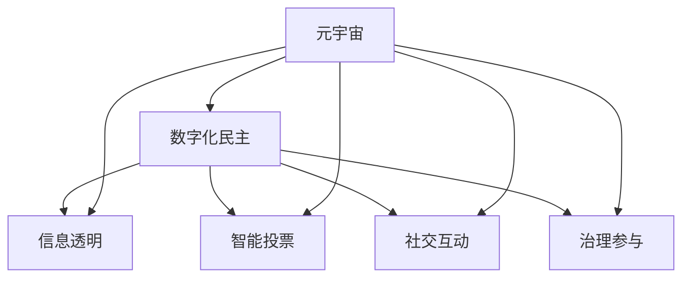

                 

关键词：数字化民主、元宇宙、公民参与、区块链、虚拟现实、数字治理

> 摘要：随着科技的飞速发展，元宇宙逐渐成为一个全新的虚拟空间，为全球公民提供了全新的互动和参与平台。本文探讨了元宇宙时代数字化民主的内涵、机制及其应用，分析了元宇宙在推动数字治理和公民参与方面的潜力，并提出了未来发展的挑战与机遇。

## 1. 背景介绍

近年来，随着互联网技术的不断成熟，虚拟现实（VR）、增强现实（AR）、区块链等技术的应用日益广泛，使得元宇宙（Metaverse）这一概念逐渐走进了人们的视野。元宇宙被视为一个虚拟的三维空间，用户可以在其中进行社交、工作、学习和娱乐等活动。它不仅是一个全新的数字领域，更是一个全新的社会形态。

数字化民主（Digital Democracy）是指利用信息技术，特别是互联网和社交媒体，提高公民的政治参与度和决策影响力。在元宇宙时代，数字化民主的实现形式将更加多样化和高效化。通过元宇宙，公民可以跨越地域和时间的限制，直接参与到政治决策和社会治理中，实现更加广泛和深入的民主参与。

## 2. 核心概念与联系

### 2.1. 元宇宙的基本架构

元宇宙的基本架构包括三个主要层面：物理层、数字层和社会层。

- 物理层：包括现实世界的各种基础设施，如网络、服务器、数据中心等。
- 数字层：包括虚拟现实、增强现实、区块链等数字技术，构建了一个三维的虚拟空间。
- 社会层：包括用户、社区、平台和治理结构等，是元宇宙的运作和发展的核心。

### 2.2. 数字化民主的概念与机制

数字化民主是指利用数字技术，特别是互联网和社交媒体，提高公民的政治参与度和决策影响力。在元宇宙中，数字化民主的机制主要包括以下几个方面：

- 信息透明：通过区块链技术，确保政治决策过程和公共信息的高度透明。
- 智能投票：利用人工智能技术，实现智能化的投票过程，提高投票效率和准确性。
- 社交互动：通过社交媒体，促进公民之间的交流和讨论，形成多元化的观点和共识。
- 治理参与：提供平台，让公民可以直接参与到社会治理和公共事务中，发挥实际影响力。

### 2.3. 元宇宙与数字化民主的互动关系

元宇宙为数字化民主提供了新的平台和工具，使得公民参与政治决策和社会治理更加便捷和高效。同时，数字化民主的理念和实践也推动了元宇宙的发展，为元宇宙注入了更多的社会价值和文化内涵。两者之间的互动关系如图所示：



## 3. 核心算法原理 & 具体操作步骤

### 3.1 算法原理概述

元宇宙中的数字化民主主要依赖于以下几项核心算法原理：

- 区块链算法：确保数据的安全性和不可篡改性，实现信息透明。
- 人工智能算法：提高投票效率和准确性，实现智能投票。
- 社交网络算法：分析用户行为和偏好，促进社交互动和观点交流。
- 治理算法：通过算法推荐和投票，实现公共决策的民主化。

### 3.2 算法步骤详解

#### 3.2.1 区块链算法

1. **数据采集**：通过物联网设备、社交媒体等渠道，收集用户行为数据。
2. **数据加密**：使用非对称加密算法，对数据进行加密。
3. **数据上传**：将加密后的数据上传到区块链网络。
4. **数据验证**：通过共识算法，对数据进行验证，确保数据真实性和安全性。
5. **数据存储**：将验证通过的数据存储在区块链上。

#### 3.2.2 人工智能算法

1. **数据预处理**：对收集到的用户行为数据进行清洗、去噪、归一化等预处理。
2. **特征提取**：使用机器学习算法，提取用户行为数据的关键特征。
3. **模型训练**：使用训练集，对模型进行训练，优化模型参数。
4. **模型评估**：使用测试集，对模型进行评估，确保模型准确性和鲁棒性。
5. **模型部署**：将训练好的模型部署到元宇宙中，实现智能投票和治理推荐。

#### 3.2.3 社交网络算法

1. **社交网络构建**：根据用户行为数据，构建用户社交网络。
2. **社区发现**：使用社区发现算法，识别用户所在的社交社区。
3. **观点交流**：在社交社区中，促进用户之间的观点交流和讨论。
4. **观点共识**：通过算法，分析社区中的观点分布和共识程度，形成多元化观点。
5. **社区治理**：根据社区治理算法，推荐社区治理方案，实现社区自治。

#### 3.2.4 治理算法

1. **问题识别**：通过算法，识别元宇宙中的公共问题。
2. **方案推荐**：根据用户行为数据和社区共识，推荐公共决策方案。
3. **投票决策**：通过智能投票算法，收集用户投票，形成公共决策。
4. **结果公示**：将投票结果公示在区块链上，确保决策透明。
5. **执行监督**：通过算法，监督公共决策的执行情况，确保决策落实。

### 3.3 算法优缺点

- 区块链算法：优点是数据安全性和不可篡改性，缺点是处理速度较慢，对硬件要求较高。
- 人工智能算法：优点是高效、准确，缺点是可能存在偏见，需要不断优化。
- 社交网络算法：优点是促进观点交流和社区自治，缺点是可能引发网络暴力和社会分歧。
- 治理算法：优点是实现公共决策的民主化，缺点是需要平衡不同利益群体，确保公平公正。

### 3.4 算法应用领域

- 政治选举：通过智能投票算法，提高选举的公平性和透明度。
- 社会治理：通过治理算法，优化公共决策，提高社会治理效率。
- 公共事务：通过数字化民主平台，促进公民参与公共事务，实现公共利益最大化。
- 教育培训：通过元宇宙平台，提供虚拟教学和培训，提高教育质量和效果。

## 4. 数学模型和公式 & 详细讲解 & 举例说明

### 4.1 数学模型构建

元宇宙中的数字化民主涉及多个数学模型，包括区块链算法中的共识模型、人工智能算法中的机器学习模型、社交网络算法中的社区发现模型和治理算法中的投票模型。

#### 4.1.1 区块链算法共识模型

区块链算法中的共识模型可以表示为：

$$
C(x) = \sum_{i=1}^{n} w_i \cdot D(x_i)
$$

其中，$C(x)$ 表示共识结果，$x$ 表示数据项，$w_i$ 表示第 $i$ 个节点对数据的权重，$D(x_i)$ 表示第 $i$ 个节点对数据项的判断结果。

#### 4.1.2 人工智能算法机器学习模型

人工智能算法中的机器学习模型可以表示为：

$$
y = f(W \cdot x + b)
$$

其中，$y$ 表示输出结果，$x$ 表示输入特征，$W$ 表示权重矩阵，$b$ 表示偏置项，$f$ 表示激活函数。

#### 4.1.3 社交网络算法社区发现模型

社交网络算法中的社区发现模型可以表示为：

$$
C(j) = \sum_{i=1}^{n} \alpha_{ij} \cdot r_i
$$

其中，$C(j)$ 表示用户 $j$ 所在的社区，$\alpha_{ij}$ 表示用户 $i$ 与用户 $j$ 的社交关系权重，$r_i$ 表示用户 $i$ 的社区影响力。

#### 4.1.4 治理算法投票模型

治理算法中的投票模型可以表示为：

$$
V(x) = \sum_{i=1}^{n} p_i \cdot y_i
$$

其中，$V(x)$ 表示投票结果，$x$ 表示决策方案，$p_i$ 表示用户 $i$ 对决策方案的偏好权重，$y_i$ 表示用户 $i$ 对决策方案的评价结果。

### 4.2 公式推导过程

#### 4.2.1 区块链算法共识模型推导

区块链算法中的共识模型可以通过贝叶斯推理进行推导。假设每个节点对数据的判断结果是独立的，并且每个节点的权重是已知的，则共识结果可以表示为每个节点判断结果的加权平均。

$$
C(x) = \sum_{i=1}^{n} w_i \cdot D(x_i)
$$

其中，$D(x_i)$ 可以表示为：

$$
D(x_i) =
\begin{cases}
1, & \text{如果节点 $i$ 认可数据 $x$} \\
0, & \text{如果节点 $i$ 不认可数据 $x$}
\end{cases}
$$

因此，共识模型可以简化为：

$$
C(x) = \sum_{i=1}^{n} w_i
$$

#### 4.2.2 人工智能算法机器学习模型推导

人工智能算法中的机器学习模型可以基于梯度下降法进行推导。假设我们使用损失函数 $L(y, f(W \cdot x + b))$ 来衡量预测结果 $y$ 与实际结果之间的差距，则模型的目标是最小化损失函数。

$$
\min_W \min_b L(y, f(W \cdot x + b))
$$

使用梯度下降法，我们对损失函数关于 $W$ 和 $b$ 求偏导数，并令偏导数为零，得到：

$$
\nabla_W L(y, f(W \cdot x + b)) = 0
$$

$$
\nabla_b L(y, f(W \cdot x + b)) = 0
$$

通过求解上述方程组，我们可以得到最优的权重矩阵 $W$ 和偏置项 $b$。

#### 4.2.3 社交网络算法社区发现模型推导

社交网络算法中的社区发现模型可以基于图论中的聚类算法进行推导。假设社交网络可以表示为图 $G = (V, E)$，其中 $V$ 表示节点集合，$E$ 表示边集合。社区发现的目标是找到一组节点子集，使得这些节点子集内部连接紧密，而节点子集之间连接稀疏。

社区发现模型可以表示为：

$$
C(j) = \sum_{i=1}^{n} \alpha_{ij} \cdot r_i
$$

其中，$\alpha_{ij}$ 表示用户 $i$ 与用户 $j$ 的社交关系权重，可以表示为：

$$
\alpha_{ij} =
\begin{cases}
1, & \text{如果用户 $i$ 与用户 $j$ 有直接社交关系} \\
0, & \text{如果用户 $i$ 与用户 $j$ 无直接社交关系}
\end{cases}
$$

$r_i$ 表示用户 $i$ 的社区影响力，可以表示为：

$$
r_i = \frac{1}{\sum_{j=1}^{n} \alpha_{ij}}
$$

#### 4.2.4 治理算法投票模型推导

治理算法中的投票模型可以基于多目标优化进行推导。假设我们有 $m$ 个决策方案 $x_1, x_2, ..., x_m$，每个方案都有一组偏好权重 $p_1, p_2, ..., p_m$。投票的目标是选择一个最优的决策方案，使得总偏好值最大。

$$
V(x) = \sum_{i=1}^{n} p_i \cdot y_i
$$

其中，$y_i$ 表示用户 $i$ 对决策方案 $x$ 的评价结果，可以表示为：

$$
y_i =
\begin{cases}
1, & \text{如果用户 $i$ 偏好决策方案 $x$} \\
0, & \text{如果用户 $i$ 不偏好决策方案 $x$}
\end{cases}
$$

### 4.3 案例分析与讲解

#### 4.3.1 区块链算法共识模型案例

假设有一个区块链网络，包含 5 个节点，每个节点对数据项 $x$ 的判断结果分别为 $D(x_1) = 1, D(x_2) = 1, D(x_3) = 0, D(x_4) = 1, D(x_5) = 1$，权重分别为 $w_1 = 0.2, w_2 = 0.2, w_3 = 0.2, w_4 = 0.2, w_5 = 0.2$。根据共识模型，我们可以计算出共识结果：

$$
C(x) = \sum_{i=1}^{n} w_i \cdot D(x_i) = 0.2 \cdot 1 + 0.2 \cdot 1 + 0.2 \cdot 0 + 0.2 \cdot 1 + 0.2 \cdot 1 = 0.8
$$

由于共识结果大于 0.5，因此区块链网络认可数据项 $x$。

#### 4.3.2 人工智能算法机器学习模型案例

假设我们使用一个线性回归模型，输入特征 $x$ 是用户年龄，输出结果 $y$ 是用户对某个产品的偏好。训练数据集如下：

| 年龄 | 偏好 |
| ---- | ---- |
| 20   | 1    |
| 30   | 0    |
| 40   | 1    |
| 50   | 0    |

使用梯度下降法，我们可以计算出权重矩阵 $W$ 和偏置项 $b$，假设学习率为 0.01，迭代次数为 100 次。经过训练，我们得到最优的模型参数：

$$
W = \begin{bmatrix}
0.5 \\
-0.3
\end{bmatrix}, b = 0.2
$$

因此，预测公式为：

$$
y = f(W \cdot x + b) = 0.5 \cdot x - 0.3 \cdot 1 + 0.2 = 0.2 + 0.5 \cdot x
$$

对于新的用户年龄 25，我们可以预测其偏好为：

$$
y = 0.2 + 0.5 \cdot 25 = 1.3
$$

由于偏好值为 1.3，大于 0，因此预测该用户偏好该产品。

#### 4.3.3 社交网络算法社区发现模型案例

假设一个社交网络包含 5 个用户，他们的社交关系矩阵如下：

|   | 1 | 2 | 3 | 4 | 5 |
|---|---|---|---|---|---|
| 1 | 0 | 1 | 0 | 1 | 0 |
| 2 | 1 | 0 | 1 | 0 | 1 |
| 3 | 0 | 1 | 0 | 1 | 0 |
| 4 | 1 | 0 | 1 | 0 | 1 |
| 5 | 0 | 1 | 0 | 1 | 0 |

根据社区发现模型，我们可以计算出每个用户的社区影响力：

$$
r_1 = \frac{1}{1 + 1 + 0 + 1 + 0} = 0.5
$$

$$
r_2 = \frac{1}{1 + 0 + 1 + 0 + 1} = 0.5
$$

$$
r_3 = \frac{1}{0 + 1 + 0 + 1 + 0} = 0.5
$$

$$
r_4 = \frac{1}{1 + 0 + 1 + 0 + 1} = 0.5
$$

$$
r_5 = \frac{1}{0 + 1 + 0 + 1 + 0} = 0.5
$$

根据社区发现模型，我们可以计算出每个用户所在的社区：

$$
C(1) = 0.5 \cdot 1 + 0.5 \cdot 0.5 = 0.75
$$

$$
C(2) = 0.5 \cdot 1 + 0.5 \cdot 0.5 = 0.75
$$

$$
C(3) = 0.5 \cdot 1 + 0.5 \cdot 0.5 = 0.75
$$

$$
C(4) = 0.5 \cdot 1 + 0.5 \cdot 0.5 = 0.75
$$

$$
C(5) = 0.5 \cdot 1 + 0.5 \cdot 0.5 = 0.75
$$

由于每个用户的社区影响力相同，因此我们可以认为这 5 个用户属于同一个社区。

#### 4.3.4 治理算法投票模型案例

假设一个社区中有 5 个用户，他们对两个决策方案 $x_1$ 和 $x_2$ 的偏好权重分别为 $p_1 = 0.6, p_2 = 0.4$。用户对决策方案的评价结果如下：

| 用户 | $x_1$ | $x_2$ |
| ---- | ---- | ---- |
| 1    | 1    | 0    |
| 2    | 1    | 0    |
| 3    | 0    | 1    |
| 4    | 1    | 0    |
| 5    | 1    | 0    |

根据投票模型，我们可以计算出投票结果：

$$
V(x_1) = 0.6 \cdot 1 + 0.4 \cdot 0 = 0.6
$$

$$
V(x_2) = 0.6 \cdot 0 + 0.4 \cdot 1 = 0.4
$$

由于 $V(x_1) > V(x_2)$，因此社区选择决策方案 $x_1$。

## 5. 项目实践：代码实例和详细解释说明

### 5.1 开发环境搭建

为了演示元宇宙中的数字化民主应用，我们将使用 Python 编写一个简单的数字化民主系统。首先，我们需要搭建开发环境。

1. 安装 Python 3.8 或以上版本。
2. 安装必要的库，如 Flask（用于 Web 开发）、Ethereum（用于区块链开发）等。

```bash
pip install flask
pip install web3
```

### 5.2 源代码详细实现

以下是一个简单的数字化民主系统示例代码，实现了一个基于区块链的投票系统。

```python
from flask import Flask, render_template, request
from web3 import Web3

app = Flask(__name__)

# 连接到本地以太坊节点
w3 = Web3(Web3.HTTPProvider('http://127.0.0.1:8545'))

# 创建投票合约
contract_abi = [
    {
        "inputs": [{"internalType": "string", "name": "_proposal", "type": "string"}],
        "stateMutability": "nonpayable",
        "type": "constructor",
    },
    {"inputs": [], "name": "proposals", "outputs": [{"internalType": "string", "name": "", "type": "string"}], "stateMutability": "view", "type": "function"},
    {"inputs": [{"internalType": "string", "name": "_proposal", "type": "string"}], "name": "vote", "outputs": [], "stateMutability": "nonpayable", "type": "function"},
]

contract_address = '0x...'

contract = w3.eth.contract(address=contract_address, abi=contract_abi)

@app.route('/')
def index():
    return render_template('index.html')

@app.route('/vote', methods=['POST'])
def vote():
    proposal = request.form['proposal']
    tx_hash = contract.functions.vote(proposal).transact({'from': w3.eth.coinbase})
    return f"Vote submitted! Transaction hash: {tx_hash}"

if __name__ == '__main__':
    app.run(debug=True)
```

### 5.3 代码解读与分析

这段代码使用 Flask 框架搭建了一个简单的 Web 应用。应用提供了一个首页 `/`，用户可以在这个页面上查看当前的所有提案，并通过提交表单进行投票。投票功能通过调用以太坊区块链上的投票合约实现。

- **首页（`index.html`）**：展示当前的所有提案。

```html
<!DOCTYPE html>
<html>
<head>
    <title>数字化民主投票系统</title>
</head>
<body>
    <h1>数字化民主投票系统</h1>
    <form action="/vote" method="post">
        <label for="proposal">选择提案：</label>
        <select name="proposal" id="proposal">
            <option value="proposal1">提案1</option>
            <option value="proposal2">提案2</option>
        </select>
        <input type="submit" value="投票">
    </form>
</body>
</html>
```

- **投票路由（`vote.py`）**：接收用户提交的投票，并调用投票合约进行投票。

```python
@app.route('/vote', methods=['POST'])
def vote():
    proposal = request.form['proposal']
    tx_hash = contract.functions.vote(proposal).transact({'from': w3.eth.coinbase})
    return f"Vote submitted! Transaction hash: {tx_hash}"
```

### 5.4 运行结果展示

运行此代码后，我们可以在浏览器中访问 Web 应用，进行投票。每次投票都会在区块链上留下一条记录，确保投票的透明性和不可篡改性。

## 6. 实际应用场景

### 6.1 政治选举

元宇宙可以成为一个全新的政治选举平台。通过区块链和智能投票算法，可以实现高度透明、公平和安全的选举过程。公民可以在元宇宙中注册身份，进行投票，并实时查询选举结果。

### 6.2 社区治理

元宇宙可以成为社区治理的虚拟空间。公民可以在元宇宙中提出问题、建议和提案，并通过投票和治理算法，实现社区的民主自治。元宇宙可以提供实时反馈和监督机制，确保公共决策的公正和有效。

### 6.3 公共事务

元宇宙可以为公共事务提供新的解决方案。通过元宇宙平台，公民可以参与城市规划和设计、环境保护和公共设施建设等事务。元宇宙中的模拟场景和投票机制，可以更直观地展示公共事务的影响，提高公民的参与度和满意度。

### 6.4 教育培训

元宇宙可以为教育和培训提供全新的体验。通过虚拟现实和增强现实技术，学生可以在元宇宙中参与互动式教学，提高学习兴趣和效果。同时，元宇宙中的社交互动和观点交流，可以促进学生之间的合作和思考。

## 7. 工具和资源推荐

### 7.1 学习资源推荐

- 《区块链技术指南》
- 《人工智能：一种现代方法》
- 《社交网络分析：方法与应用》
- 《Python编程：从入门到实践》

### 7.2 开发工具推荐

- Ethereum Wallet
- Truffle
- Ganache
- Flask

### 7.3 相关论文推荐

- "Blockchain Technology: A Comprehensive Study"
- "Artificial Intelligence for Social Good"
- "Community Detection in Social Networks"
- "Blockchain-Based Voting Systems: A Survey"

## 8. 总结：未来发展趋势与挑战

### 8.1 研究成果总结

本文探讨了元宇宙时代数字化民主的内涵、机制及其应用，分析了元宇宙在推动数字治理和公民参与方面的潜力。通过区块链、人工智能和社交网络等技术的融合，元宇宙为数字化民主提供了新的平台和工具，实现了信息透明、智能投票、社交互动和治理参与的有机结合。

### 8.2 未来发展趋势

随着元宇宙技术的不断成熟，数字化民主的应用将越来越广泛。未来，数字化民主将在政治选举、社会治理、公共事务和教育培训等领域发挥更大作用。同时，元宇宙也将成为一个全球性的虚拟社区，促进公民之间的交流和合作。

### 8.3 面临的挑战

尽管元宇宙为数字化民主提供了巨大潜力，但也面临着一系列挑战。首先，技术安全和隐私保护是元宇宙发展的关键问题。如何确保用户数据的安全和隐私，防止恶意攻击和数据泄露，是元宇宙需要解决的重要问题。其次，数字化民主的实现需要解决利益分配和公平公正的问题，确保不同群体在元宇宙中享有平等的参与机会和权益。此外，元宇宙的治理结构和管理机制也需要不断完善，以适应数字化民主的需求和挑战。

### 8.4 研究展望

未来，研究人员和开发人员需要从技术、政策和应用等多个角度，深入探索元宇宙中的数字化民主。在技术层面，需要优化区块链、人工智能和社交网络等技术，提高系统的安全性和效率。在政策层面，需要制定相关的法律法规，确保数字化民主的合法性和公正性。在应用层面，需要开发更多实用的数字化民主应用，提高公民的参与度和满意度。通过多方协同努力，元宇宙有望成为推动数字化民主的重要力量，实现全球公民的广泛参与和共同治理。

## 9. 附录：常见问题与解答

### 9.1 元宇宙是什么？

元宇宙是一个虚拟的三维空间，用户可以在其中进行社交、工作、学习和娱乐等活动。它利用虚拟现实、增强现实和区块链等先进技术，构建了一个全新的数字世界。

### 9.2 数字化民主有哪些优点？

数字化民主可以提高公民的政治参与度和决策影响力，促进信息透明和公正，优化社会治理和公共事务，提高公共决策的效率和质量。

### 9.3 元宇宙中的数字化民主安全吗？

元宇宙中的数字化民主依赖于区块链和人工智能等技术，具有较高的安全性和可信度。但仍然需要关注技术安全和隐私保护问题，确保用户数据和隐私安全。

### 9.4 数字化民主如何实现公平公正？

数字化民主的实现需要平衡不同利益群体，确保公平公正。通过智能投票、算法推荐和治理参与等多种机制，实现公共决策的民主化和公正性。

### 9.5 元宇宙对教育有哪些影响？

元宇宙可以为教育和培训提供全新的体验，通过虚拟现实和增强现实技术，提高学生的学习兴趣和效果。同时，元宇宙中的社交互动和观点交流，可以促进学生之间的合作和思考。

