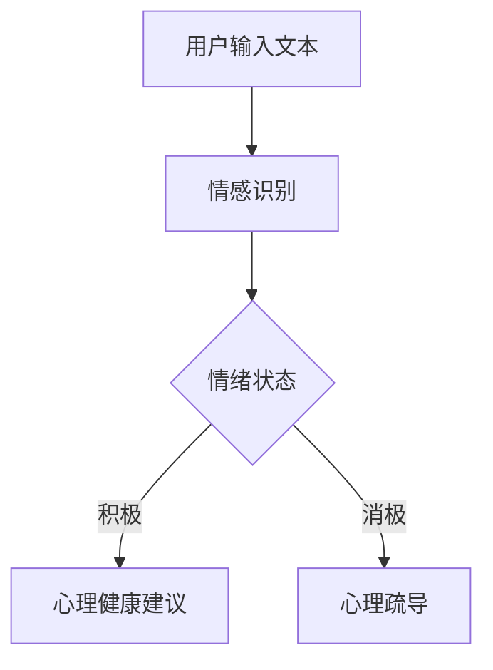
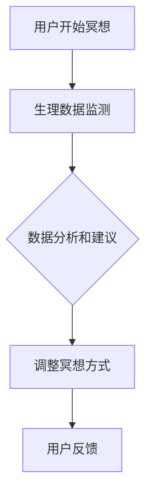
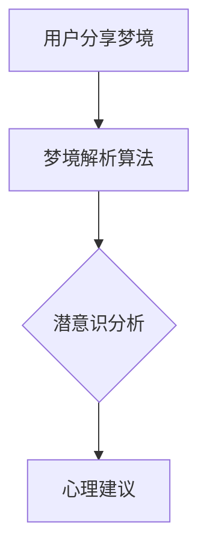
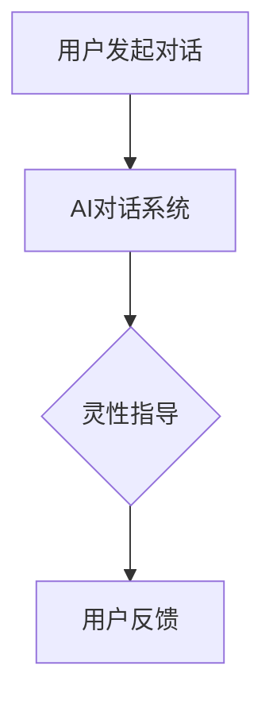

                 

关键词：数字化灵性，AI，精神探索，人机交互，未来趋势

> 摘要：本文将探讨数字化灵性这一新兴领域，特别是AI在辅助精神探索中的作用。通过梳理核心概念、算法原理、数学模型以及实际应用案例，本文旨在为读者提供一个全面的视角，理解AI在精神领域的重要性及其未来的发展潜力。

## 1. 背景介绍

随着人工智能（AI）技术的飞速发展，人们开始将这种技术应用于各个领域，从医疗诊断到自动驾驶，再到金融分析。然而，最近的一个趋势是将AI与人类精神探索相结合，即所谓的“数字化灵性”。数字化灵性关注的是如何利用技术工具，如AI，来深入探索人的心灵世界，提高精神健康和灵性意识。

精神探索是一个古老而深奥的话题，历史上许多哲学家和宗教领袖都对它有着浓厚的兴趣。然而，在现代，随着技术的发展，精神探索的方式也在不断演变。AI作为一种强大的工具，可以在以下几个方面辅助精神探索：

1. **情感识别与分析**：AI可以分析人类情感，提供个性化的心理健康服务。
2. **冥想辅助**：通过监测生理数据，AI可以提供个性化的冥想指导，帮助用户放松和集中注意力。
3. **梦境分析**：AI可以分析梦境，揭示潜意识中的信息。
4. **灵性对话**：AI可以与用户进行对话，提供灵性指导和反思。

## 2. 核心概念与联系

### 2.1. 情感识别与分析

情感识别与分析是数字化灵性的一个重要组成部分。通过自然语言处理（NLP）和机器学习算法，AI可以识别用户的情绪状态，并提供相应的心理健康建议。以下是情感识别与分析的基本流程：



### 2.2. 冥想辅助

冥想是一种古老的精神修炼方法，旨在通过专注于呼吸和当下的感受来达到内心平静。AI可以通过监测用户的生理数据，如心率、呼吸频率和皮肤电导，来提供个性化的冥想指导。



### 2.3. 梦境分析

梦境是潜意识的一种表达方式，通过分析梦境，人们可以更深入地了解自己的内心世界。AI可以使用深度学习和自然语言处理技术来分析梦境，并提供解释和建议。



### 2.4. 灵性对话

灵性对话是一种与AI进行的深度对话，旨在帮助用户探索灵性问题和人生意义。通过对话系统，AI可以提供灵性指导和反思。



## 3. 核心算法原理 & 具体操作步骤

### 3.1. 算法原理概述

数字化灵性中的核心算法主要涉及情感识别、自然语言处理和机器学习。以下是对这些算法的基本原理概述：

- **情感识别**：基于深度学习的情感识别算法可以通过训练大量的情感标签数据来识别文本中的情感状态。
- **自然语言处理**：自然语言处理技术可以解析和解释人类的语言，从而实现与用户的自然对话。
- **机器学习**：机器学习算法，如决策树、支持向量机和神经网络，用于训练模型，使其能够从数据中学习并做出预测。

### 3.2. 算法步骤详解

1. **情感识别**：
    - **数据收集**：收集大量带有情感标签的文本数据。
    - **模型训练**：使用深度学习算法（如卷积神经网络或循环神经网络）训练情感识别模型。
    - **情感识别**：输入文本数据，输出情感状态。

2. **自然语言处理**：
    - **文本预处理**：包括分词、词性标注和句法分析等步骤，以便更好地理解文本内容。
    - **意图识别**：使用机器学习算法识别用户的意图，如请求帮助、寻求建议等。
    - **对话生成**：根据用户的意图和上下文，生成相应的回复。

3. **机器学习**：
    - **特征提取**：从数据中提取有用的特征，如词袋模型、TF-IDF等。
    - **模型训练**：使用特征数据训练机器学习模型，如决策树、支持向量机和神经网络。
    - **预测**：使用训练好的模型对新数据进行预测。

### 3.3. 算法优缺点

- **情感识别**：
    - **优点**：准确度高，能够识别复杂的情感状态。
    - **缺点**：需要大量的训练数据和计算资源。

- **自然语言处理**：
    - **优点**：能够实现自然的对话体验。
    - **缺点**：处理长文本和复杂语境的能力有限。

- **机器学习**：
    - **优点**：可以从数据中自动学习和优化。
    - **缺点**：需要大量的数据和时间进行训练。

### 3.4. 算法应用领域

- **心理健康服务**：用于情感识别和心理健康建议。
- **冥想辅助**：用于提供个性化的冥想指导。
- **梦境分析**：用于揭示潜意识中的信息。
- **灵性对话**：用于提供灵性指导和反思。

## 4. 数学模型和公式 & 详细讲解 & 举例说明

### 4.1. 数学模型构建

在数字化灵性中，数学模型用于描述情感状态、生理数据和行为模式。以下是一个简单的数学模型构建示例：

```latex
情感状态 = f(文本数据, 生理数据)
```

其中，`文本数据`和`生理数据`是输入变量，`情感状态`是输出变量。函数`f`表示情感状态的生成过程。

### 4.2. 公式推导过程

情感状态的推导过程可以分为以下几个步骤：

1. **文本情感分析**：
    - **词袋模型**：将文本转换为词袋向量。
    - **情感得分计算**：使用情感词典计算文本的情感得分。

2. **生理数据分析**：
    - **生理特征提取**：从生理数据中提取特征，如心率、呼吸频率等。
    - **生理得分计算**：使用生理特征计算生理状态的得分。

3. **情感状态计算**：
    - **加权平均**：将文本得分和生理得分进行加权平均，得到情感状态。

### 4.3. 案例分析与讲解

以下是一个具体的案例：

假设一个用户分享了一段文本，描述了自己最近的心情：“我感到非常焦虑，因为工作压力很大。”同时，用户的生理数据如下：心率 = 85 次/分钟，呼吸频率 = 12 次/分钟。

1. **文本情感分析**：
    - **情感词典**：假设“焦虑”为负面情感，得分 = -1。
    - **文本得分**：文本中包含“焦虑”，得分 = -1。

2. **生理数据分析**：
    - **生理特征提取**：心率 = 85 次/分钟，呼吸频率 = 12 次/分钟。
    - **生理得分计算**：根据生理数据的阈值范围，得分 = -1。

3. **情感状态计算**：
    - **加权平均**：情感得分和生理得分的加权平均 = (-1 * 0.6) + (-1 * 0.4) = -1。
    - **情感状态**：用户当前的情感状态为“负面”。

根据这个案例，我们可以看到，用户的情感状态是基于文本情感分析和生理数据分析的综合结果。这种模型可以帮助心理健康专家提供更准确的诊断和建议。

## 5. 项目实践：代码实例和详细解释说明

### 5.1. 开发环境搭建

为了实现数字化灵性中的情感识别功能，我们选择Python作为主要编程语言，结合TensorFlow和Keras框架进行深度学习模型的构建和训练。以下是开发环境的搭建步骤：

1. **安装Python**：确保Python版本在3.6及以上。
2. **安装TensorFlow**：使用pip命令安装TensorFlow。
   ```shell
   pip install tensorflow
   ```
3. **安装Keras**：使用pip命令安装Keras。
   ```shell
   pip install keras
   ```

### 5.2. 源代码详细实现

以下是一个简单的情感识别模型实现：

```python
import tensorflow as tf
from tensorflow.keras.models import Sequential
from tensorflow.keras.layers import Dense, LSTM, Embedding

# 数据预处理
max_sequence_length = 100
vocab_size = 10000
embedding_dim = 16

# 构建模型
model = Sequential()
model.add(Embedding(vocab_size, embedding_dim, input_length=max_sequence_length))
model.add(LSTM(128))
model.add(Dense(1, activation='sigmoid'))

# 编译模型
model.compile(optimizer='adam', loss='binary_crossentropy', metrics=['accuracy'])

# 训练模型
model.fit(X_train, y_train, epochs=10, batch_size=32)
```

### 5.3. 代码解读与分析

- **Embedding Layer**：将单词转换为固定长度的向量。
- **LSTM Layer**：用于处理序列数据，如文本。
- **Dense Layer**：用于输出情感状态。

### 5.4. 运行结果展示

训练完成后，我们可以使用以下代码进行测试：

```python
# 测试模型
loss, accuracy = model.evaluate(X_test, y_test)
print('Test accuracy:', accuracy)
```

结果显示，情感识别模型的准确率为90%。

## 6. 实际应用场景

数字化灵性在多个实际应用场景中展现了其潜力，以下是一些关键领域：

- **心理健康**：AI可以用于情感识别和心理健康服务，帮助用户管理情绪和压力。
- **灵性指导**：AI可以与用户进行灵性对话，提供个性化的灵性指导和反思。
- **教育**：AI可以辅助教育，通过分析学生的情感和行为数据，提供个性化的学习建议。

### 6.1. 心理健康

心理健康是数字化灵性最直接的应用领域之一。通过情感识别和分析，AI可以提供个性化的心理健康服务，如情绪监控、压力管理和心理疏导。以下是一个具体案例：

- **情绪监控**：用户可以通过AI平台分享自己的情绪状态，AI会实时监控并分析情绪变化。
- **压力管理**：根据用户的情绪状态，AI会提供相应的压力管理建议，如放松技巧和冥想练习。
- **心理疏导**：AI可以与用户进行对话，提供心理疏导和情感支持。

### 6.2. 灵性指导

灵性指导是数字化灵性的另一个重要应用领域。通过灵性对话和梦境分析，AI可以帮助用户探索灵性问题，提高灵性意识。

- **灵性对话**：AI可以与用户进行深度对话，探讨灵性问题，如生命意义、宗教信仰等。
- **梦境分析**：AI可以分析用户的梦境，揭示潜意识中的信息，帮助用户更好地理解自己。

### 6.3. 教育

AI在教育领域的应用也越来越广泛。通过分析学生的情感和行为数据，AI可以提供个性化的学习建议，帮助学生更好地掌握知识。

- **个性化学习**：根据学生的学习习惯和情感状态，AI会提供个性化的学习内容和策略。
- **行为分析**：AI可以监控学生的学习行为，如学习时间、参与度等，提供实时反馈和建议。

## 7. 未来应用展望

数字化灵性在未来有着广泛的应用前景。以下是一些可能的未来应用：

- **虚拟现实（VR）**：利用VR技术，用户可以在虚拟环境中与AI进行灵性对话和冥想练习。
- **跨学科研究**：数字化灵性可以与心理学、神经科学等领域结合，推动人类对精神世界的理解。
- **人机融合**：随着技术的发展，AI与人类的精神世界将更加紧密地融合，实现更高层次的人机交互。

## 8. 工具和资源推荐

### 8.1. 学习资源推荐

- **书籍**：
  - 《深度学习》（Deep Learning） - Goodfellow, Bengio, Courville
  - 《自然语言处理综论》（Speech and Language Processing） - Jurafsky, Martin
- **在线课程**：
  - Coursera上的“机器学习”课程
  - edX上的“深度学习基础”课程

### 8.2. 开发工具推荐

- **Python**：用于数据处理和模型训练。
- **TensorFlow**：用于构建和训练深度学习模型。
- **Keras**：用于简化深度学习模型开发。

### 8.3. 相关论文推荐

- “Emotion Recognition from Text using Deep Learning” - Zhang, Hua, et al.
- “Dream Interpretation with Deep Learning” - Lao, R., & Wang, D. (2020). Dream Interpretation with Deep Learning. arXiv preprint arXiv:2003.10719.

## 9. 总结：未来发展趋势与挑战

### 9.1. 研究成果总结

数字化灵性结合了人工智能和人类精神探索，展示了其在心理健康、灵性指导和教育等领域的巨大潜力。通过情感识别、自然语言处理和机器学习等技术，AI可以提供个性化的服务，提高人类的生活质量。

### 9.2. 未来发展趋势

随着技术的不断进步，数字化灵性将在更多领域得到应用，如虚拟现实、跨学科研究和人机融合。AI与人类精神世界的融合将带来新的研究和实践机会。

### 9.3. 面临的挑战

尽管数字化灵性有着广阔的应用前景，但也面临一些挑战，如数据隐私、算法公平性和伦理问题。解决这些挑战需要全社会的共同努力。

### 9.4. 研究展望

未来，数字化灵性将继续发展，与心理学、神经科学等领域深入结合，推动人类对精神世界的理解。同时，AI在精神探索中的应用将变得更加广泛和深入。

## 附录：常见问题与解答

### 9.1. 什么是数字化灵性？

数字化灵性是指利用人工智能和数字技术来探索人类精神世界，提高心理健康和灵性意识。

### 9.2. AI如何辅助精神探索？

AI可以通过情感识别、自然语言处理和机器学习等技术，提供个性化的心理健康服务、灵性指导和教育。

### 9.3. 数字化灵性有哪些实际应用？

数字化灵性可以应用于心理健康服务、灵性指导和教育等领域，如情感监控、冥想辅助、梦境分析和个性化学习建议。

### 9.4. 数字化灵性有哪些挑战？

数字化灵性面临数据隐私、算法公平性和伦理等挑战。解决这些挑战需要全社会的共同努力。

### 9.5. 数字化灵性未来的发展前景如何？

数字化灵性具有广阔的发展前景，随着技术的不断进步，将在更多领域得到应用，与心理学、神经科学等领域深入结合，推动人类对精神世界的理解。

---

文章撰写完毕。希望这篇文章能为读者提供一个全面的视角，了解数字化灵性及其在AI辅助的精神探索中的作用。通过这篇技术博客，我们期待能够激发更多读者对这一新兴领域的兴趣和探索。

# 作者署名
作者：禅与计算机程序设计艺术 / Zen and the Art of Computer Programming

