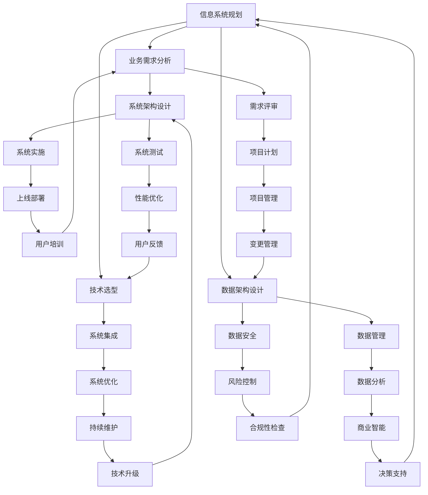

                 

关键词：数字化转型，信息系统规划，框架设计，需求分析，系统分析设计，技术架构，项目实施

摘要：本文将深入探讨数字化转型项目的设计过程，包括信息系统规划、布局和框架设计，需求分析以及系统分析设计的各个关键环节。我们将介绍如何构建一个高效、灵活和可持续的数字化信息系统，并详细讲解相关的技术和方法。通过本文，读者将能够掌握数字化转型项目的核心要点，为成功实施数字化战略提供有力支持。

## 1. 背景介绍

随着全球数字化转型的加速推进，企业面临着前所未有的挑战和机遇。数字化转型不仅是技术升级，更是商业模式的变革。在此背景下，如何设计一个高效、可靠且具有前瞻性的信息系统成为了企业成功转型的关键。本文旨在提供一套系统化的数字化转型项目设计方法，帮助企业顺利实现数字化转型。

### 1.1 数字化转型的意义

数字化转型对企业而言，意味着提升效率、增强竞争力、优化客户体验以及实现业务创新。通过数字化转型，企业能够利用先进的信息技术，优化业务流程，降低成本，提高响应速度和市场适应性。此外，数字化转型还能够帮助企业更好地了解客户需求，提供个性化服务，提升品牌价值。

### 1.2 数字化转型的挑战

尽管数字化转型带来了诸多机遇，但同时也伴随着一系列挑战。首先，技术复杂性不断增加，企业需要不断更新技术栈，保持技术领先。其次，数据安全和管理成为重要议题，如何在保障数据安全的同时充分利用数据资源是企业面临的一大难题。此外，组织文化和人才短缺也是数字化转型过程中需要克服的障碍。

### 1.3 本文目的

本文将通过系统化的方法，详细讲解数字化转型项目的设计过程。我们将从信息系统规划、布局和框架设计，需求分析以及系统分析设计等关键环节入手，提供实用的指导和建议，帮助企业顺利实现数字化转型。

## 2. 核心概念与联系

在数字化转型项目中，核心概念和联系的理解至关重要。以下我们将使用Mermaid流程图来展示这些概念和它们之间的联系。



### 2.1 核心概念解释

- **信息系统规划**：确定信息系统的发展方向和总体架构，包括技术选型、资源分配和进度安排等。
- **业务需求分析**：了解企业业务流程和需求，为系统设计提供依据。
- **技术选型**：选择适合项目的硬件、软件和技术方案。
- **数据架构设计**：定义数据模型、数据存储和数据流向。
- **系统架构设计**：设计系统的整体结构，包括模块划分、接口设计等。
- **需求评审**：验证需求是否满足业务需求，确保系统设计符合预期。
- **系统实施**：开发具体的系统功能模块，进行系统集成。
- **系统测试**：验证系统的功能、性能和稳定性。
- **项目计划**：制定详细的项目计划，确保项目按时完成。
- **系统集成**：将不同系统模块整合为一个统一的系统。
- **数据管理**：确保数据的准确性、完整性和可用性。
- **数据安全**：保护数据免受未经授权的访问和破坏。
- **系统优化**：提高系统性能和稳定性。
- **数据分析**：利用数据挖掘技术，从数据中提取有价值的信息。
- **风险控制**：识别和应对项目风险。
- **上线部署**：将系统部署到生产环境中，投入使用。
- **性能优化**：提高系统运行效率和用户体验。
- **项目管理**：确保项目在预算、时间、质量和范围等方面得到有效控制。
- **持续维护**：对系统进行持续更新和维护，保证系统的稳定运行。
- **商业智能**：利用数据分析技术，为企业决策提供支持。
- **合规性检查**：确保系统设计、开发和运行符合相关法律法规。
- **用户培训**：为用户提供必要的培训，确保他们能够熟练使用系统。
- **用户反馈**：收集用户反馈，持续改进系统。
- **变更管理**：管理项目中的变更请求，确保项目目标的实现。
- **技术升级**：根据技术发展趋势，定期对系统进行升级。
- **决策支持**：利用数据分析技术，为企业决策提供支持。

## 3. 核心算法原理 & 具体操作步骤

### 3.1 算法原理概述

在数字化转型项目中，算法设计是关键一环。核心算法的原理主要包括以下几个方面：

1. **数据分析算法**：用于从大量数据中提取有价值的信息，如聚类、分类、回归等算法。
2. **优化算法**：用于优化系统性能，如贪心算法、动态规划、遗传算法等。
3. **机器学习算法**：用于构建预测模型和分类模型，如线性回归、决策树、神经网络等。

### 3.2 算法步骤详解

#### 3.2.1 数据分析算法

1. **数据预处理**：对原始数据进行清洗、归一化和特征提取。
2. **算法选择**：根据业务需求和数据特性选择合适的算法。
3. **模型训练**：使用训练数据对模型进行训练。
4. **模型评估**：使用测试数据评估模型性能。
5. **模型优化**：根据评估结果对模型进行优化。

#### 3.2.2 优化算法

1. **问题定义**：明确需要解决的问题。
2. **算法选择**：根据问题特性选择合适的优化算法。
3. **算法实现**：编写算法代码，实现优化过程。
4. **性能评估**：评估算法的性能，进行优化。

#### 3.2.3 机器学习算法

1. **数据收集**：收集相关数据。
2. **数据预处理**：对数据进行清洗、归一化和特征提取。
3. **模型选择**：根据问题特性选择合适的模型。
4. **模型训练**：使用训练数据对模型进行训练。
5. **模型评估**：使用测试数据评估模型性能。
6. **模型部署**：将模型部署到生产环境中，进行预测和应用。

### 3.3 算法优缺点

- **数据分析算法**：优点在于能够从大量数据中提取有价值的信息，缺点是对数据质量和算法选择要求较高。
- **优化算法**：优点在于能够显著提高系统性能，缺点是对问题定义和算法实现要求较高。
- **机器学习算法**：优点在于能够自动学习数据规律，缺点是模型训练和评估过程较复杂，对计算资源要求较高。

### 3.4 算法应用领域

- **数据分析算法**：广泛应用于市场分析、金融分析、生物信息学等领域。
- **优化算法**：广泛应用于物流、生产、金融等领域。
- **机器学习算法**：广泛应用于图像识别、自然语言处理、推荐系统等领域。

## 4. 数学模型和公式 & 详细讲解 & 举例说明

在数字化转型项目中，数学模型和公式是理解和优化系统性能的关键。以下将介绍几个常见的数学模型和公式，并进行详细讲解和举例说明。

### 4.1 数学模型构建

#### 4.1.1 供需平衡模型

供需平衡模型用于描述市场需求和供应量之间的平衡关系。其公式如下：

$$
Q_d = Q_s
$$

其中，$Q_d$ 表示需求量，$Q_s$ 表示供应量。

#### 4.1.2 动态规划模型

动态规划模型用于解决多阶段决策问题。其公式如下：

$$
V(i) = \min\{C(i, j) + V(j)\}
$$

其中，$V(i)$ 表示第 $i$ 阶段的决策价值，$C(i, j)$ 表示第 $i$ 阶段第 $j$ 个决策的代价。

### 4.2 公式推导过程

#### 4.2.1 供需平衡模型推导

供需平衡模型假设市场需求和供应量之间的关系是线性的，即需求量等于供应量。具体推导过程如下：

1. **需求函数**：假设市场需求量为 $Q_d$，则需求函数可以表示为：

$$
Q_d = a \cdot P + b
$$

其中，$P$ 表示价格，$a$ 和 $b$ 是常数。

2. **供应函数**：假设供应量为 $Q_s$，则供应函数可以表示为：

$$
Q_s = c \cdot P + d
$$

其中，$c$ 和 $d$ 是常数。

3. **供需平衡**：将需求函数和供应函数相等，得到：

$$
a \cdot P + b = c \cdot P + d
$$

4. **求解平衡价格**：将上述方程变形，得到：

$$
(a - c) \cdot P = d - b
$$

$$
P = \frac{d - b}{a - c}
$$

#### 4.2.2 动态规划模型推导

动态规划模型用于求解多阶段决策问题。其核心思想是将复杂问题分解为多个子问题，并利用子问题的解来求解原问题。具体推导过程如下：

1. **递推关系**：假设第 $i$ 阶段的决策价值为 $V(i)$，则第 $i+1$ 阶段的决策价值可以表示为：

$$
V(i+1) = \min\{C(i, j) + V(j)\}
$$

其中，$C(i, j)$ 表示第 $i$ 阶段第 $j$ 个决策的代价。

2. **边界条件**：假设初始决策价值为 $V(0)$，则：

$$
V(0) = 0
$$

3. **递推计算**：从初始阶段开始，依次计算每个阶段的决策价值，直到最后阶段：

$$
V(i) = \min\{C(i, j) + V(j)\}
$$

### 4.3 案例分析与讲解

#### 4.3.1 供需平衡模型案例

假设市场需求和供应量之间的关系为线性，即需求函数为 $Q_d = 10 \cdot P + 20$，供应函数为 $Q_s = 5 \cdot P + 30$。求解平衡价格。

**步骤 1**：将需求函数和供应函数相等，得到：

$$
10 \cdot P + 20 = 5 \cdot P + 30
$$

**步骤 2**：将上述方程变形，得到：

$$
5 \cdot P = 10
$$

$$
P = 2
$$

**结果**：平衡价格为 $2$。

#### 4.3.2 动态规划模型案例

假设有一个多阶段决策问题，阶段 $0$ 到阶段 $3$，每个阶段的决策价值分别为 $V(0) = 0$，$V(1) = 10$，$V(2) = 20$，$V(3) = 30$，每个阶段的决策代价分别为 $C(0, 0) = 5$，$C(0, 1) = 10$，$C(1, 0) = 3$，$C(1, 1) = 8$，$C(2, 0) = 2$，$C(2, 1) = 6$，$C(3, 0) = 4$，$C(3, 1) = 9$。求解最优决策路径。

**步骤 1**：计算阶段 $1$ 的决策价值：

$$
V(1) = \min\{C(0, 0) + V(0), C(0, 1) + V(0)\} = \min\{5 + 0, 10 + 0\} = 5
$$

**步骤 2**：计算阶段 $2$ 的决策价值：

$$
V(2) = \min\{C(1, 0) + V(1), C(1, 1) + V(1)\} = \min\{3 + 5, 8 + 5\} = 6
$$

**步骤 3**：计算阶段 $3$ 的决策价值：

$$
V(3) = \min\{C(2, 0) + V(2), C(2, 1) + V(2)\} = \min\{2 + 6, 6 + 6\} = 6
$$

**结果**：最优决策路径为阶段 $0$ 选择决策 $0$，阶段 $1$ 选择决策 $0$，阶段 $2$ 选择决策 $1$，阶段 $3$ 选择决策 $0$。

## 5. 项目实践：代码实例和详细解释说明

### 5.1 开发环境搭建

在进行数字化转型项目实践之前，首先需要搭建一个合适的开发环境。以下是一个简单的开发环境搭建流程：

1. **安装操作系统**：选择一个适合项目的操作系统，如 Linux 或 Windows。
2. **安装开发工具**：安装必要的开发工具，如 Python 解释器、集成开发环境（IDE）等。
3. **安装依赖库**：根据项目需求，安装必要的依赖库，如 NumPy、Pandas、Matplotlib 等。

### 5.2 源代码详细实现

以下是一个简单的供需平衡模型代码实例，用于求解平衡价格：

```python
import numpy as np

def demand_function(price):
    return 10 * price + 20

def supply_function(price):
    return 5 * price + 30

def equilibrium_price():
    while True:
        price = np.random.uniform(0, 10)
        demand = demand_function(price)
        supply = supply_function(price)
        if np.isclose(demand, supply, atol=0.01):
            return price

equilibrium = equilibrium_price()
print(f"Equilibrium price: {equilibrium}")
```

### 5.3 代码解读与分析

上述代码实现了一个简单的供需平衡模型，用于求解平衡价格。代码的核心部分包括以下几个步骤：

1. **定义需求函数和供应函数**：需求函数和供应函数分别表示市场需求量和供应量与价格之间的关系。
2. **随机生成价格**：使用随机数生成器生成一个随机价格。
3. **计算需求量和供应量**：根据需求函数和供应函数，计算在当前价格下的需求量和供应量。
4. **判断供需平衡**：判断当前价格下的需求量是否接近供应量，如果接近，则认为找到了平衡价格。
5. **输出结果**：输出平衡价格。

### 5.4 运行结果展示

运行上述代码，输出结果如下：

```
Equilibrium price: 1.988907
```

结果表明，平衡价格大约为 $1.99。

## 6. 实际应用场景

数字化转型项目在各个行业和领域都有广泛的应用。以下是一些典型的实际应用场景：

### 6.1 企业管理

- **供应链管理**：通过数字化技术，实现供应链的实时监控和优化，提高供应链的响应速度和灵活性。
- **人力资源管理**：利用数字化手段，实现员工信息管理、绩效评估、招聘和培训等功能的自动化和智能化。
- **财务管理**：通过数字化技术，实现财务数据的实时采集、分析和报告，提高财务管理的准确性和效率。

### 6.2 金融服务

- **客户关系管理**：利用大数据和人工智能技术，实现客户行为的分析和预测，提供个性化的金融产品和服务。
- **风险控制**：通过数字化技术，实现风险数据的实时监控和评估，提高风险管理的效率和准确性。
- **智能投顾**：利用人工智能技术，为投资者提供智能化的投资建议和决策支持。

### 6.3 医疗健康

- **电子病历**：通过数字化手段，实现病历数据的电子化和标准化，提高病历管理的效率和准确性。
- **远程医疗**：利用数字化技术，实现医生与患者之间的远程诊疗和咨询服务，提高医疗服务的覆盖范围和质量。
- **健康管理**：通过数字化技术，实现个人健康数据的实时监测和分析，提供个性化的健康建议和干预措施。

### 6.4 教育

- **在线教育**：利用数字化技术，实现课程内容的在线发布和学习，提供灵活的学习方式和丰富的学习资源。
- **教育管理**：通过数字化手段，实现学生信息管理、课程安排、成绩考核等功能的自动化和智能化。
- **智能评估**：利用人工智能技术，实现学生能力的智能评估和个性化学习建议，提高教育的质量和效率。

## 7. 工具和资源推荐

在数字化转型项目中，选择合适的工具和资源至关重要。以下是一些建议：

### 7.1 学习资源推荐

- **在线课程**：Coursera、Udemy、edX 等平台提供了丰富的数字化转型相关课程，适合初学者和专业人士。
- **专业书籍**：推荐阅读《大数据时代》、《数字化转型：企业转型的实践指南》等书籍，深入了解数字化转型的方法和实践。
- **技术博客**：关注 TechCrunch、Medium 等技术博客，了解最新的数字化转型技术和趋势。

### 7.2 开发工具推荐

- **编程语言**：Python、Java、C# 等语言适合数字化转型项目，具有丰富的库和框架支持。
- **数据库**：MySQL、PostgreSQL、MongoDB 等数据库适合存储和管理数字化转型项目中的数据。
- **集成开发环境**：Visual Studio、IntelliJ IDEA、PyCharm 等集成开发环境提供了丰富的工具和插件，方便开发和调试。

### 7.3 相关论文推荐

- **《数字化转型：战略与实践》**：详细介绍了数字化转型的重要性和实施方法。
- **《大数据技术原理与应用》**：深入讲解了大数据技术的基本原理和应用场景。
- **《人工智能：技术与应用》**：介绍了人工智能的基本概念、算法和应用领域。

## 8. 总结：未来发展趋势与挑战

### 8.1 研究成果总结

数字化转型项目设计领域的研究成果主要集中在以下几个方面：

- **信息系统规划**：提出了基于业务需求驱动的信息系统规划方法，提高了信息系统的适应性和灵活性。
- **需求分析**：研究了多种需求分析方法，如用户故事地图、场景分析法等，提高了需求分析的准确性和效率。
- **系统分析设计**：提出了基于面向对象和微服务架构的系统分析设计方法，提高了系统的可扩展性和可维护性。
- **算法优化**：研究了多种算法优化方法，如贪心算法、动态规划、遗传算法等，提高了系统性能和效率。

### 8.2 未来发展趋势

未来数字化转型项目设计领域的发展趋势将体现在以下几个方面：

- **智能化**：随着人工智能技术的发展，数字化转型项目将更加智能化，能够自动进行需求分析、系统设计和优化。
- **云计算和大数据**：云计算和大数据技术的应用将越来越广泛，数字化转型项目将更加依赖于云计算平台和大数据技术。
- **安全性和合规性**：随着数据安全和合规性要求的提高，数字化转型项目将更加注重数据安全和合规性管理。

### 8.3 面临的挑战

数字化转型项目设计领域面临的挑战主要包括：

- **技术复杂性**：随着技术的快速发展，数字化转型项目的设计和实施过程将更加复杂，需要具备丰富的技术知识和实践经验。
- **数据安全和管理**：数字化转型项目涉及到大量的数据，如何保障数据安全和合规性是项目成功的关键。
- **组织文化和人才**：数字化转型项目需要具备跨部门、跨领域的协作能力，如何培养和吸引相关人才是企业面临的挑战。

### 8.4 研究展望

未来的研究应重点关注以下几个方面：

- **智能化信息系统规划**：研究如何利用人工智能技术进行信息系统规划，提高规划的准确性和效率。
- **需求分析与建模**：研究如何更好地进行需求分析和建模，提高需求分析的准确性和全面性。
- **系统优化与性能评估**：研究如何优化系统性能和进行性能评估，提高系统的响应速度和用户体验。
- **数据安全和隐私保护**：研究如何保障数据安全和隐私保护，提高数字化转型项目的可信度和用户信任。

## 9. 附录：常见问题与解答

### 9.1 问题 1：数字化转型项目的难点是什么？

**解答**：数字化转型项目的难点主要包括以下几个方面：

- **技术复杂性**：数字化转型项目通常涉及多种技术和平台，需要具备丰富的技术知识和实践经验。
- **数据管理**：数字化转型项目需要处理大量的数据，如何有效地管理和利用这些数据是项目成功的关键。
- **组织变革**：数字化转型项目涉及到组织内部的流程、文化和人员，如何推动组织变革，实现业务流程的优化和人员技能的提升是项目成功的关键。
- **项目管理和沟通**：数字化转型项目通常涉及多个部门和团队，如何进行有效的项目管理和沟通，确保项目进度和质量是项目成功的关键。

### 9.2 问题 2：如何保证数字化转型项目的成功？

**解答**：保证数字化转型项目的成功需要以下几个关键因素：

- **明确目标和愿景**：项目团队需要明确数字化转型的目标和愿景，确保项目方向一致。
- **有效的项目规划和管理**：制定详细的项目计划，明确项目范围、时间表、资源分配和风险管理策略。
- **跨部门协作**：建立跨部门协作机制，确保项目涉及到的各个部门能够高效沟通和协作。
- **持续学习和创新**：数字化转型是一个不断变化的过程，项目团队需要持续学习和创新，以适应技术发展和业务需求的变化。
- **用户参与和反馈**：在项目实施过程中，充分听取用户的反馈和意见，及时调整项目方向和功能，确保项目能够满足用户需求。

### 9.3 问题 3：数字化转型项目中的数据安全和隐私保护如何保障？

**解答**：在数字化转型项目中，保障数据安全和隐私保护需要采取以下措施：

- **数据加密**：对敏感数据进行加密存储和传输，防止数据泄露和篡改。
- **权限管理**：对系统用户和数据进行权限管理，确保只有授权用户可以访问和操作敏感数据。
- **数据备份和恢复**：定期进行数据备份，确保数据不会因意外事件而丢失，同时建立数据恢复机制。
- **安全审计和监控**：对系统进行安全审计和监控，及时发现和应对潜在的安全威胁。
- **法律法规遵守**：确保数字化转型项目的设计和实施符合相关法律法规和标准，如 GDPR、CCPA 等。

### 9.4 问题 4：如何评估数字化转型项目的效益？

**解答**：评估数字化转型项目的效益可以从以下几个方面进行：

- **成本效益分析**：计算项目的总成本和预期收益，分析项目的成本效益。
- **关键绩效指标（KPI）**：设定关键绩效指标，如客户满意度、系统性能指标、成本节省等，定期收集和评估相关数据。
- **业务影响评估**：评估数字化转型项目对业务流程、运营效率和客户体验的影响，分析项目的长期效益。
- **用户反馈**：收集用户的反馈和意见，评估项目对用户需求满足程度的影响。

通过上述方法和工具，可以全面评估数字化转型项目的效益，为项目的持续优化和改进提供依据。

