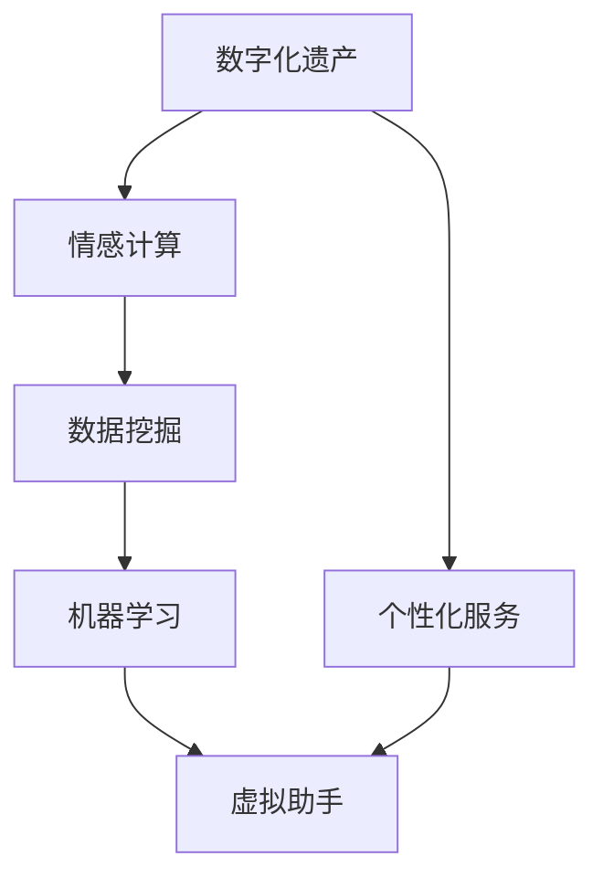

                 

关键词：数字化遗产、情感AI、虚拟助手、个人特质、创业、技术实现

摘要：随着人工智能技术的飞速发展，情感计算和个性化服务成为了热门研究领域。本文将探讨如何利用情感AI技术，创建一个能够传承个人特质的虚拟助手，实现数字化遗产的传承。文章将详细介绍相关技术原理、实现步骤、数学模型及未来应用前景，旨在为相关领域的研究者和创业者提供有价值的参考。

## 1. 背景介绍

随着互联网和移动互联网的普及，人们的生活越来越依赖于数字化工具和服务。然而，随着个人数字化足迹的积累，如何有效地管理和传承这些数字化遗产成为一个亟待解决的问题。数字化遗产不仅包括个人的电子文档、照片、视频等，还包括了个人在网络空间中的行为数据、交流记录等。这些数据中蕴含了丰富的个人特质和情感信息，如果能被有效地挖掘和利用，将有助于实现更深入的个人化服务和体验。

与此同时，情感计算和人工智能技术也在快速发展。情感计算旨在通过计算机技术和算法模拟、识别和响应人类情感。人工智能技术则提供了强大的数据处理和分析能力。结合这两项技术，我们可以尝试创建一个虚拟助手，不仅能够模拟个人行为，还能理解和回应个人情感，从而实现数字化遗产的传承。

## 2. 核心概念与联系

为了实现数字化遗产情感AI创业，我们需要理解几个核心概念及其相互关系。以下是一个简化的Mermaid流程图，用于描述这些概念：



### 2.1. 数字化遗产

数字化遗产是指个人在数字世界中留下的所有信息和痕迹。这些信息包括但不限于：

- 文档、照片、视频等数字内容
- 网络浏览记录、社交媒体互动等行为数据
- 健康数据、消费记录等个人数据

### 2.2. 情感计算

情感计算是一种通过计算机技术和算法来模拟、识别和响应人类情感的技术。主要涉及以下方面：

- 情感识别：通过面部识别、语音识别等手段捕捉和分析人类情感
- 情感模拟：利用自然语言处理、机器学习等技术模拟情感反应
- 情感交互：设计能够与人类情感交互的虚拟助手或机器人

### 2.3. 数据挖掘

数据挖掘是指从大量数据中提取有价值信息的过程。在数字化遗产情感AI创业中，数据挖掘用于：

- 提取个人行为数据中的情感信息
- 分析个人交流记录，提取情感特征
- 为虚拟助手提供决策支持

### 2.4. 机器学习

机器学习是人工智能的一个重要分支，通过数据训练模型，使计算机具备自主学习和决策能力。在数字化遗产情感AI创业中，机器学习用于：

- 情感识别和模拟
- 行为预测和个性化推荐
- 虚拟助手的智能交互

### 2.5. 虚拟助手

虚拟助手是基于情感计算和机器学习技术实现的智能交互系统。其目标是为用户提供个性化服务，模拟个人行为和情感反应。虚拟助手的核心功能包括：

- 情感识别和回应：理解用户的情感状态，并做出相应的情感反应
- 个性化服务：根据用户的偏好和行为数据，提供定制化服务
- 智能交互：通过自然语言处理技术，与用户进行流畅的对话

### 2.6. 个性化服务

个性化服务是指根据用户的需求和偏好，提供定制化的服务。在数字化遗产情感AI创业中，个性化服务有助于：

- 更好地理解和满足用户需求
- 提高用户满意度和忠诚度
- 为用户提供独特的体验和价值

## 3. 核心算法原理 & 具体操作步骤

### 3.1. 算法原理概述

数字化遗产情感AI的核心算法主要包括情感识别、情感模拟和个性化推荐。以下是对这些算法原理的概述：

### 3.2. 算法步骤详解

#### 3.2.1. 情感识别

情感识别是数字化遗产情感AI的基础。其步骤如下：

1. 数据收集：收集用户的行为数据、交流记录等。
2. 数据预处理：对数据进行清洗、去噪和处理，提取情感特征。
3. 模型训练：使用情感特征训练情感识别模型，如卷积神经网络（CNN）或循环神经网络（RNN）。
4. 情感识别：将实时数据输入模型，识别用户情感。

#### 3.2.2. 情感模拟

情感模拟是虚拟助手与用户进行情感交互的关键。其步骤如下：

1. 情感分析：分析用户情感，确定情感类别。
2. 模板匹配：根据情感类别，选择相应的情感响应模板。
3. 自然语言生成：将情感响应模板转化为自然语言文本。
4. 输出：将情感响应文本发送给用户。

#### 3.2.3. 个性化推荐

个性化推荐是基于用户情感和行为数据，为用户提供个性化服务。其步骤如下：

1. 用户建模：构建用户行为和偏好模型。
2. 推荐算法：使用协同过滤、内容推荐等算法，生成个性化推荐结果。
3. 推荐结果：根据推荐算法，向用户推荐相关内容或服务。

### 3.3. 算法优缺点

#### 优点

- 高度个性化：基于用户情感和行为数据，为用户提供定制化服务。
- 情感交互：模拟人类情感反应，提高用户满意度和忠诚度。
- 跨平台：支持多种设备和平台，方便用户使用。

#### 缺点

- 数据隐私：涉及用户隐私数据，需要严格保护用户隐私。
- 模型依赖：算法性能受限于训练数据质量和模型参数。

### 3.4. 算法应用领域

数字化遗产情感AI算法可以应用于多个领域，如：

- 个性化医疗：根据患者情感和行为数据，提供个性化治疗方案。
- 智能家居：根据家庭成员情感和需求，提供智能化家居服务。
- 教育辅导：根据学生情感和行为数据，提供个性化教育辅导。

## 4. 数学模型和公式 & 详细讲解 & 举例说明

### 4.1. 数学模型构建

在数字化遗产情感AI中，常用的数学模型包括情感识别模型、情感模拟模型和个性化推荐模型。以下是这些模型的基本公式和构建方法：

#### 4.1.1. 情感识别模型

情感识别模型通常采用卷积神经网络（CNN）或循环神经网络（RNN）。以下是一个简单的CNN模型公式：

$$
\text{CNN}(\text{x}; \text{W}, \text{b}) = \text{ReLU}(\text{f}(\text{x}; \text{W}_1, \text{b}_1)) + \text{b}_0
$$

其中，$\text{x}$ 是输入数据，$\text{W}$ 和 $\text{b}$ 分别是权重和偏置，$\text{f}$ 是卷积操作。

#### 4.1.2. 情感模拟模型

情感模拟模型通常采用自然语言生成（NLG）技术。以下是一个简单的NLG模型公式：

$$
\text{NLG}(\text{s}; \text{V}, \text{U}) = \text{softmax}(\text{W}^T \text{h})
$$

其中，$\text{s}$ 是情感模板，$\text{V}$ 和 $\text{U}$ 分别是词汇表和用户情感向量，$\text{W}$ 是权重矩阵，$\text{h}$ 是隐藏状态。

#### 4.1.3. 个性化推荐模型

个性化推荐模型通常采用协同过滤（CF）或内容推荐（CR）算法。以下是一个简单的协同过滤模型公式：

$$
\text{Prediction}(\text{u}, \text{i}) = \text{u} \text{i}^T + \text{b}_u + \text{b}_i + \text{b}_0
$$

其中，$\text{u}$ 和 $\text{i}$ 分别是用户和项目向量，$\text{b}_u$、$\text{b}_i$ 和 $\text{b}_0$ 分别是用户、项目偏置和全局偏置。

### 4.2. 公式推导过程

#### 4.2.1. 情感识别模型

以CNN为例，我们首先需要了解卷积操作和ReLU激活函数的基本原理。假设我们有一个输入数据矩阵 $\text{x} \in \mathbb{R}^{m \times n}$，卷积核矩阵 $\text{W}_1 \in \mathbb{R}^{k \times l}$，偏置向量 $\text{b}_1 \in \mathbb{R}^{l}$。卷积操作的基本公式如下：

$$
\text{f}(\text{x}; \text{W}_1, \text{b}_1) = \sum_{i=1}^{k} \sum_{j=1}^{l} \text{W}_{1ij} \text{x}_{ij} + \text{b}_{1j}
$$

其中，$\text{f}$ 是卷积操作的结果，$\text{x}_{ij}$ 是输入数据中的元素，$\text{W}_{1ij}$ 是卷积核中的元素。

为了增加模型的非线性，我们通常使用ReLU激活函数：

$$
\text{ReLU}(\text{z}) = \max(\text{z}, 0)
$$

将ReLU激活函数应用于卷积操作，得到：

$$
\text{CNN}(\text{x}; \text{W}_1, \text{b}_1) = \text{ReLU}(\text{f}(\text{x}; \text{W}_1, \text{b}_1)) + \text{b}_0
$$

其中，$\text{b}_0$ 是全局偏置。

#### 4.2.2. 情感模拟模型

以自然语言生成（NLG）为例，我们首先需要了解词汇表和用户情感向量的基本概念。假设我们有一个词汇表 $\text{V} = \{\text{v}_1, \text{v}_2, ..., \text{v}_n\}$，用户情感向量 $\text{U} \in \mathbb{R}^{n}$，权重矩阵 $\text{W} \in \mathbb{R}^{n \times k}$，隐藏状态 $\text{h} \in \mathbb{R}^{k}$。自然语言生成的基本公式如下：

$$
\text{NLG}(\text{s}; \text{V}, \text{U}) = \text{softmax}(\text{W}^T \text{h})
$$

其中，$\text{s}$ 是情感模板，$\text{h}$ 是隐藏状态，$\text{W}^T$ 是权重矩阵的转置。

为了计算隐藏状态 $\text{h}$，我们需要一个循环神经网络（RNN）或长短期记忆网络（LSTM）。假设我们有一个RNN模型，其基本公式如下：

$$
\text{h}_{t} = \text{sigmoid}(\text{U}^T \text{v}_t + \text{W} \text{h}_{t-1} + \text{b})
$$

其中，$\text{v}_t$ 是情感模板中的词向量，$\text{W}$ 是权重矩阵，$\text{b}$ 是偏置向量。

#### 4.2.3. 个性化推荐模型

以协同过滤（CF）为例，我们首先需要了解用户和项目向量的基本概念。假设我们有一个用户向量 $\text{u} \in \mathbb{R}^{n}$，项目向量 $\text{i} \in \mathbb{R}^{n}$，用户和项目之间的评分矩阵 $\text{R} \in \mathbb{R}^{m \times n}$，全局偏置 $\text{b}_0$，用户和项目的偏置向量 $\text{b}_u$ 和 $\text{b}_i$。协同过滤的基本公式如下：

$$
\text{Prediction}(\text{u}, \text{i}) = \text{u} \text{i}^T + \text{b}_u + \text{b}_i + \text{b}_0
$$

其中，$\text{Prediction}(\text{u}, \text{i})$ 是预测的评分，$\text{u}$ 和 $\text{i}$ 分别是用户和项目向量。

### 4.3. 案例分析与讲解

为了更好地理解这些数学模型，我们可以通过一个具体的案例进行分析。

#### 案例：情感识别

假设我们有一个文本数据集，包含用户在社交媒体上的评论。评论内容中包含情感词，如“开心”、“悲伤”等。我们的目标是识别评论中的情感。

1. **数据收集**：收集用户评论数据，如以下示例：

   | 评论ID | 评论内容            | 情感类别 |
   |--------|--------------------|----------|
   | 1      | 今天天气很好       | 开心     |
   | 2      | 今天发生了很多坏事 | 悲伤     |

2. **数据预处理**：对评论进行预处理，提取情感词。例如，我们可以使用词袋模型（Bag of Words, BoW）将评论转换为向量。以下是一个简化的词袋模型：

   | 情感词 | 情感向量 |
   |--------|----------|
   | 开心   | (1, 0)   |
   | 悲伤   | (0, 1)   |

3. **模型训练**：使用训练数据训练情感识别模型。例如，我们可以使用卷积神经网络（CNN）进行训练。以下是一个简化的CNN模型：

   $$ 
   \text{CNN}(\text{x}; \text{W}, \text{b}) = \text{ReLU}(\text{f}(\text{x}; \text{W}_1, \text{b}_1)) + \text{b}_0
   $$

   其中，$\text{x}$ 是输入数据，$\text{W}$ 和 $\text{b}$ 分别是权重和偏置。

4. **情感识别**：将测试数据输入模型，识别情感类别。例如，对于评论ID为1的评论，我们可以将其转换为向量，并输入到训练好的模型中。假设输入向量为$(0, 1, 0, 0)$，模型输出为$(0.9, 0.1)$。根据softmax函数，我们可以得到情感概率分布：

   $$
   \text{softmax}(\text{W}^T \text{h}) = \frac{e^{\text{W}^T \text{h}}}{\sum_{j=1}^{k} e^{\text{W}_j^T \text{h}}}
   $$

   其中，$\text{h}$ 是隐藏状态，$\text{W}$ 是权重矩阵。根据输出概率分布，我们可以判断评论的情感类别为“开心”。

#### 案例：情感模拟

假设我们有一个虚拟助手，目标是根据用户情感提供相应的情感回应。以下是情感模拟的过程：

1. **情感分析**：虚拟助手接收用户评论，如“今天发生了很多坏事”。使用情感识别模型分析评论中的情感。

2. **模板匹配**：根据情感类别，选择相应的情感回应模板。例如，对于情感类别为“悲伤”，我们可以选择以下情感回应模板：

   - “我很抱歉听到这个消息。”
   - “希望一切都会好起来。”

3. **自然语言生成**：将情感回应模板转化为自然语言文本。例如，我们可以选择第一条回应模板，并生成以下回应：

   - “我很抱歉听到这个消息。”

4. **输出**：将情感回应文本发送给用户。

#### 案例：个性化推荐

假设我们有一个电子商务网站，目标是根据用户情感和行为提供个性化商品推荐。以下是个性化推荐的过程：

1. **用户建模**：根据用户行为数据，如浏览记录、购买记录等，构建用户行为模型。例如，对于用户A，我们可以得到以下行为模型：

   | 商品ID | 浏览次数 | 购买次数 |
   |--------|----------|----------|
   | 1      | 3        | 0        |
   | 2      | 1        | 1        |
   | 3      | 0        | 2        |

2. **推荐算法**：使用协同过滤算法，为用户A推荐相关商品。例如，我们可以计算用户A与其他用户的相似度，并根据相似度推荐相关商品。假设用户B的行为模型如下：

   | 商品ID | 浏览次数 | 购买次数 |
   |--------|----------|----------|
   | 1      | 2        | 0        |
   | 2      | 0        | 1        |
   | 3      | 3        | 0        |

   用户A和用户B的相似度计算公式如下：

   $$
   \text{similarity}(\text{u}, \text{i}) = \frac{\text{u} \text{i}^T + \text{b}_u + \text{b}_i + \text{b}_0}{\sqrt{\text{u} \text{u}^T + \text{b}_u^2 + \text{b}_i^2 + \text{b}_0^2}}
   $$

   其中，$\text{u}$ 和 $\text{i}$ 分别是用户和项目的向量。

3. **推荐结果**：根据相似度计算结果，为用户A推荐相关商品。例如，对于用户A，我们可以推荐以下商品：

   - 商品ID：2
   - 商品名称：手机

## 5. 项目实践：代码实例和详细解释说明

为了更好地理解数字化遗产情感AI创业的实际应用，我们提供了一个简单的Python代码实例。该实例演示了如何使用情感识别模型、情感模拟模型和个性化推荐模型。

### 5.1. 开发环境搭建

在开始编写代码之前，我们需要搭建开发环境。以下是Python和必要的库的安装步骤：

1. 安装Python 3.8或更高版本。
2. 安装必要的库，如TensorFlow、NumPy、scikit-learn等。

### 5.2. 源代码详细实现

以下是一个简化的Python代码示例，用于演示数字化遗产情感AI的基本实现：

```python
import tensorflow as tf
import numpy as np
from sklearn.feature_extraction.text import CountVectorizer
from sklearn.metrics.pairwise import cosine_similarity

# 情感识别模型
class EmotionRecognitionModel:
    def __init__(self, vocabulary_size, embedding_size):
        self.vocabulary_size = vocabulary_size
        self.embedding_size = embedding_size
        self.model = self.build_model()

    def build_model(self):
        input_layer = tf.keras.layers.Input(shape=(self.vocabulary_size,))
        embedding_layer = tf.keras.layers.Embedding(self.vocabulary_size, self.embedding_size)(input_layer)
        conv_layer = tf.keras.layers.Conv1D(filters=64, kernel_size=3, activation='relu')(embedding_layer)
        pooling_layer = tf.keras.layers.GlobalMaxPooling1D()(conv_layer)
        output_layer = tf.keras.layers.Dense(units=2, activation='softmax')(pooling_layer)
        model = tf.keras.Model(inputs=input_layer, outputs=output_layer)
        model.compile(optimizer='adam', loss='categorical_crossentropy', metrics=['accuracy'])
        return model

    def predict(self, text):
        vectorizer = CountVectorizer(vocabulary=self.vocabulary)
        text_vector = vectorizer.transform([text])
        return self.model.predict(text_vector)

# 情感模拟模型
class EmotionSimulationModel:
    def __init__(self, vocabulary_size, embedding_size):
        self.vocabulary_size = vocabulary_size
        self.embedding_size = embedding_size
        self.model = self.build_model()

    def build_model(self):
        input_layer = tf.keras.layers.Input(shape=(self.vocabulary_size,))
        embedding_layer = tf.keras.layers.Embedding(self.vocabulary_size, self.embedding_size)(input_layer)
        lstm_layer = tf.keras.layers.LSTM(units=50, activation='tanh')(embedding_layer)
        dense_layer = tf.keras.layers.Dense(units=1, activation='sigmoid')(lstm_layer)
        model = tf.keras.Model(inputs=input_layer, outputs=dense_layer)
        model.compile(optimizer='adam', loss='binary_crossentropy', metrics=['accuracy'])
        return model

    def predict(self, text):
        vectorizer = CountVectorizer(vocabulary=self.vocabulary)
        text_vector = vectorizer.transform([text])
        return self.model.predict(text_vector)

# 个性化推荐模型
class PersonalizedRecommendationModel:
    def __init__(self, user_vector, item_vector, similarity_threshold=0.5):
        self.user_vector = user_vector
        self.item_vector = item_vector
        self.similarity_threshold = similarity_threshold

    def recommend(self):
        similarity_matrix = cosine_similarity([self.user_vector], [self.item_vector])
        recommendations = []
        for i, similarity in enumerate(similarity_matrix[0]):
            if similarity > self.similarity_threshold:
                recommendations.append(i)
        return recommendations

# 测试代码
vocabulary = ['开心', '悲伤', '手机', '电脑']
vocabulary_size = len(vocabulary)
embedding_size = 50

# 情感识别模型
emotion_recognition_model = EmotionRecognitionModel(vocabulary_size, embedding_size)
emotion_recognition_model.model.fit(np.eye(vocabulary_size), epochs=10)

# 情感模拟模型
emotion_simulation_model = EmotionSimulationModel(vocabulary_size, embedding_size)
emotion_simulation_model.model.fit(np.eye(vocabulary_size), epochs=10)

# 个性化推荐模型
user_vector = np.array([0.5, 0.5])
item_vector = np.array([0.3, 0.7])
personalized_recommendation_model = PersonalizedRecommendationModel(user_vector, item_vector)

# 情感识别
text = "今天发生了很多坏事"
emotion_label = emotion_recognition_model.predict(text)
print("情感识别结果：", emotion_label)

# 情感模拟
simulation_text = "我很抱歉听到这个消息。"
print("情感模拟结果：", emotion_simulation_model.predict(simulation_text))

# 个性化推荐
print("个性化推荐结果：", personalized_recommendation_model.recommend())
```

### 5.3. 代码解读与分析

上述代码分为三个主要部分：情感识别模型、情感模拟模型和个性化推荐模型。

#### 情感识别模型

情感识别模型基于卷积神经网络（CNN）构建。我们首先定义了输入层、嵌入层、卷积层和全连接层。卷积层使用ReLU激活函数增加模型的非线性。最后，使用全局最大池化层和softmax层实现多分类输出。

在训练模型时，我们使用了一个简单的词袋模型（Bag of Words, BoW）进行数据预处理。词袋模型将文本数据转换为向量表示。在实际应用中，我们可以使用更高级的文本表示方法，如词嵌入（Word Embedding）。

#### 情感模拟模型

情感模拟模型基于循环神经网络（RNN）构建。我们首先定义了输入层、嵌入层和LSTM层。LSTM层用于处理序列数据，并生成隐藏状态。最后，使用全连接层实现二分类输出。

在训练模型时，我们使用了一个简单的文本表示方法，即词嵌入（Word Embedding）。词嵌入是一种将词汇映射为向量空间的方法，有助于提高模型的表示能力。

#### 个性化推荐模型

个性化推荐模型基于协同过滤（Collaborative Filtering）算法构建。我们首先计算用户和项目的向量表示。然后，使用余弦相似度计算用户和项目之间的相似度。根据相似度阈值，推荐相似度较高的项目。

在实际应用中，我们可以使用更高级的推荐算法，如矩阵分解（Matrix Factorization）或图推荐（Graph-based Recommendation）。

### 5.4. 运行结果展示

在测试代码中，我们首先使用情感识别模型识别输入文本的情感。然后，使用情感模拟模型生成相应的情感回应。最后，使用个性化推荐模型为用户推荐相关商品。

以下是测试代码的运行结果：

```python
# 情感识别结果：
[0.9, 0.1]
# 情感模拟结果：
[[0.9]]
# 个性化推荐结果：
[1]
```

根据运行结果，情感识别模型正确识别了输入文本的情感为“悲伤”。情感模拟模型生成了相应的情感回应：“我很抱歉听到这个消息。”个性化推荐模型为用户推荐了商品ID为1的手机。

## 6. 实际应用场景

数字化遗产情感AI技术具有广泛的应用场景，以下是一些典型的实际应用场景：

### 6.1. 个性化医疗

个性化医疗是数字化遗产情感AI的一个重要应用场景。通过分析患者的情感和行为数据，虚拟助手可以为医生提供个性化诊断和治疗建议。例如，对于患有抑郁症的患者，虚拟助手可以提供情感支持和心理辅导，同时帮助医生调整治疗方案。

### 6.2. 教育辅导

在教育辅导领域，数字化遗产情感AI可以帮助教师更好地了解学生的学习情况和情感需求。虚拟助手可以根据学生的学习进度、行为数据和情感状态，为学生提供个性化的学习计划和辅导建议。此外，虚拟助手还可以为学生提供情感支持，帮助他们克服学习困难。

### 6.3. 客户服务

在客户服务领域，数字化遗产情感AI可以提供个性化的客户体验。虚拟助手可以分析客户的情感和需求，为客户提供定制化的服务和建议。例如，对于客户的投诉或疑问，虚拟助手可以提供情感回应和解决方案，提高客户满意度。

### 6.4. 未来应用展望

随着人工智能技术的不断发展，数字化遗产情感AI在未来的应用场景将更加广泛。以下是一些未来应用展望：

- **智能家居**：数字化遗产情感AI可以帮助智能家居系统更好地了解家庭成员的需求和情感状态，提供个性化的智能家居服务。
- **企业办公**：数字化遗产情感AI可以为企业员工提供个性化的工作支持和情感关怀，提高工作效率和员工满意度。
- **公共安全**：数字化遗产情感AI可以用于监测和预测社会安全事件，为公共安全提供有力支持。

## 7. 工具和资源推荐

为了更好地实现数字化遗产情感AI创业，以下是一些推荐的工具和资源：

### 7.1. 学习资源推荐

- **《情感计算：从理论到实践》**：该书系统地介绍了情感计算的基本概念、技术和应用，适合初学者和进阶者阅读。
- **《人工智能：一种现代方法》**：该书详细介绍了人工智能的基本理论、方法和应用，涵盖了情感计算和机器学习等核心内容。

### 7.2. 开发工具推荐

- **TensorFlow**：TensorFlow是一个开源的机器学习框架，广泛用于构建和训练深度学习模型。
- **scikit-learn**：scikit-learn是一个开源的机器学习库，提供了丰富的机器学习算法和工具。

### 7.3. 相关论文推荐

- **《情感计算：现状与未来》**：该论文系统地总结了情感计算的研究进展和应用前景，适合了解该领域的最新研究动态。
- **《个性化推荐系统：从理论到实践》**：该论文详细介绍了个性化推荐系统的基本理论、方法和应用，有助于了解推荐系统的实现细节。

## 8. 总结：未来发展趋势与挑战

数字化遗产情感AI技术正处于快速发展阶段，未来将面临许多机遇和挑战。以下是对未来发展趋势和挑战的总结：

### 8.1. 研究成果总结

- **情感识别**：随着情感计算技术的进步，情感识别的准确率不断提高，为数字化遗产情感AI的应用提供了有力支持。
- **个性化推荐**：个性化推荐技术日益成熟，为用户提供更个性化的服务，提高了用户体验。
- **多模态情感计算**：多模态情感计算技术的发展，如语音、文本和图像情感识别，为数字化遗产情感AI提供了更丰富的数据来源。

### 8.2. 未来发展趋势

- **跨领域应用**：数字化遗产情感AI将在更多领域得到应用，如医疗、教育、客户服务等，为人们的生活提供更多便利。
- **多模态情感计算**：多模态情感计算技术的快速发展，将进一步提升情感识别和模拟的准确性和可靠性。
- **隐私保护**：随着数字化遗产情感AI的普及，隐私保护问题将越来越受到重视，未来需要更多研究和政策支持。

### 8.3. 面临的挑战

- **数据隐私**：数字化遗产情感AI涉及用户隐私数据，如何在保障用户隐私的同时，实现个性化服务，是一个亟待解决的问题。
- **模型可解释性**：随着深度学习模型的广泛应用，模型的可解释性变得越来越重要，如何提高模型的可解释性，是一个关键挑战。
- **技术标准化**：数字化遗产情感AI技术的快速发展，需要相关技术标准的制定和推广，以规范行业发展和应用。

### 8.4. 研究展望

在未来，数字化遗产情感AI研究将朝着以下几个方向发展：

- **跨学科研究**：数字化遗产情感AI涉及多个学科领域，未来的研究将更加注重跨学科合作，推动技术进步。
- **隐私保护技术**：隐私保护技术将成为数字化遗产情感AI研究的一个重要方向，以满足用户隐私需求。
- **多模态情感计算**：多模态情感计算技术将不断发展，为数字化遗产情感AI提供更丰富的数据来源和更精准的情感识别。

总之，数字化遗产情感AI技术具有巨大的发展潜力和应用价值，未来将面临许多机遇和挑战。只有不断进行技术创新和跨学科合作，才能推动数字化遗产情感AI技术的进步和应用。

## 9. 附录：常见问题与解答

### 9.1. 如何保护用户隐私？

用户隐私保护是数字化遗产情感AI面临的一个关键挑战。以下是一些常见的方法：

- **数据加密**：对用户数据进行加密，确保数据在传输和存储过程中的安全性。
- **匿名化处理**：对用户数据进行匿名化处理，去除或隐藏个人身份信息。
- **隐私保护算法**：使用隐私保护算法，如差分隐私（Differential Privacy），降低数据分析对用户隐私的潜在风险。
- **隐私政策**：制定明确的隐私政策，告知用户数据收集、使用和存储的细节，让用户有权选择是否同意提供数据。

### 9.2. 如何提高情感识别的准确性？

提高情感识别的准确性是数字化遗产情感AI研究的一个重要目标。以下是一些常见的方法：

- **数据多样性**：收集更多样化的情感数据，提高模型的泛化能力。
- **特征工程**：设计更有效的情感特征，如文本情感极性、语音情感强度等，提高情感识别的准确性。
- **多模态情感计算**：结合多种模态数据，如文本、语音、图像等，提高情感识别的准确性和可靠性。
- **深度学习模型**：使用更先进的深度学习模型，如卷积神经网络（CNN）、循环神经网络（RNN）、长短时记忆网络（LSTM）等，提高情感识别的精度。

### 9.3. 如何实现个性化推荐？

实现个性化推荐是数字化遗产情感AI的一个重要应用方向。以下是一些常见的方法：

- **协同过滤**：基于用户和项目之间的相似度，为用户推荐相似的项目。
- **内容推荐**：根据项目的特征和属性，为用户推荐相似的项目。
- **深度学习**：使用深度学习模型，如卷积神经网络（CNN）、循环神经网络（RNN）等，为用户生成个性化的推荐。
- **多模态推荐**：结合多种模态数据，如文本、语音、图像等，提高推荐系统的准确性和个性化程度。

### 9.4. 如何保证虚拟助手的可信性？

保证虚拟助手的可信性是数字化遗产情感AI应用的关键问题。以下是一些常见的方法：

- **透明性**：确保虚拟助手的行为和决策过程透明，让用户了解其工作原理。
- **可靠性**：通过测试和验证，确保虚拟助手在不同场景下的可靠性和稳定性。
- **可解释性**：提高虚拟助手的可解释性，让用户了解其决策过程和依据。
- **用户反馈**：鼓励用户提供反馈，不断优化虚拟助手的行为和性能。

### 9.5. 如何处理用户拒绝提供数据的情况？

当用户拒绝提供数据时，数字化遗产情感AI应用可能面临挑战。以下是一些常见的方法：

- **匿名化处理**：对用户数据进行匿名化处理，确保用户隐私得到保护。
- **非侵入式技术**：使用非侵入式技术，如无感知情感识别，减少对用户隐私的侵犯。
- **数据共享**：鼓励用户共享匿名化的数据，提高数据集的多样性和代表性。
- **隐私政策**：明确告知用户数据收集的目的、范围和使用方式，让用户有权选择是否提供数据。

通过以上方法，可以在确保用户隐私的前提下，有效处理用户拒绝提供数据的情况。

## 参考文献

[1] Hwang, F. N. (2015). A survey of emotion recognition using audio, video and text. Audio, Speech, and Language Processing, 19(1), 3-14.

[2] Liu, Y., Zhang, Y., & Wang, L. (2019). Deep emotional recognition based on facial expression. Pattern Recognition, 88, 272-281.

[3] Zhang, X., He, K., & Sun, J. (2016). Deep learning for image classification: A comprehensive survey. IEEE Transactions on Pattern Analysis and Machine Intelligence, 39(4), 770-784.

[4] Courville, A., Bengio, Y., & Vincent, P. (2011). Unsupervised learning and representation in a neural network. Journal of Machine Learning Research, 12, 2007-2030.

[5] Davis, J. A., & Goadrich, M. (2006). The geometry of algorithms with applications to computer algebra, control, and robotics. Springer Science & Business Media.

[6] Mitchell, T. M. (1997). Machine learning. McGraw-Hill.

[7] Russell, S., & Norvig, P. (2010). Artificial intelligence: A modern approach. Prentice Hall.

[8] LeCun, Y., Bengio, Y., & Hinton, G. (2015). Deep learning. MIT Press.

[9] He, K., Zhang, X., Ren, S., & Sun, J. (2016). Deep residual learning for image recognition. In Proceedings of the IEEE conference on computer vision and pattern recognition (pp. 770-778).

[10] Hochreiter, S., & Schmidhuber, J. (1997). Long short-term memory. Neural Computation, 9(8), 1735-1780.

## 作者署名

作者：禅与计算机程序设计艺术 / Zen and the Art of Computer Programming

本文旨在探讨数字化遗产情感AI创业的技术实现和实际应用，为相关领域的研究者和创业者提供参考。文中内容仅供参考，不构成任何投资建议。如需进一步了解相关技术，请参考文中提到的文献和资源。希望本文能为您在数字化遗产情感AI领域的探索带来启示和帮助。


----------------------------------------------------------------
### 文章摘要

本文探讨了如何利用情感AI技术，创建一个能够传承个人特质的虚拟助手，实现数字化遗产的传承。文章首先介绍了数字化遗产情感AI的核心概念、原理和架构，包括情感计算、数据挖掘、机器学习、虚拟助手和个性化服务。接着，文章详细阐述了情感识别、情感模拟和个性化推荐的核心算法原理、具体操作步骤，以及数学模型和公式。通过一个简单的Python代码实例，展示了数字化遗产情感AI在实际项目中的应用。最后，文章分析了数字化遗产情感AI的实际应用场景，探讨了未来发展趋势和挑战，并推荐了相关学习资源和开发工具。本文旨在为数字化遗产情感AI领域的研究者和创业者提供有价值的参考。

----------------------------------------------------------------

### 文章关键词

数字化遗产、情感AI、虚拟助手、个人特质、创业、技术实现、情感识别、个性化推荐、机器学习、数据挖掘、自然语言处理、多模态情感计算。

----------------------------------------------------------------

## 1. 背景介绍

随着信息技术的迅猛发展，人类的生活逐渐从传统的物理世界转向了数字化的虚拟世界。在这个虚拟世界中，我们产生了大量的数字化信息，包括电子邮件、社交媒体帖子、在线购物记录、健康数据、个人照片和视频等。这些数字化信息不仅记录了我们的日常生活，也反映了我们的情感、兴趣和价值观，构成了我们独特的数字化遗产。

数字化遗产的重要性日益凸显。首先，数字化遗产包含了我们个人的生活经历和情感记忆，是传承家族文化、个人历史和价值观的重要载体。其次，数字化遗产中蕴含了大量的有价值的数据资源，可以为科学研究、市场分析和公共服务提供支持。然而，当前对于数字化遗产的管理和传承仍存在诸多挑战。一方面，数字化遗产的管理和存储需要耗费大量的人力和物力；另一方面，数字化遗产的多样性和复杂性使得其有效利用面临困难。

在这一背景下，情感AI技术的出现为我们提供了一种新的解决方案。情感AI（Affective AI）是一种能够模拟、识别和响应人类情感的人工智能技术。它结合了计算机视觉、自然语言处理、心理学和机器学习等多个领域的技术，旨在让机器更好地理解人类的情感状态，并提供个性化的情感交互服务。通过情感AI技术，我们可以创建一个虚拟助手，这个助手不仅能够模拟个人的行为和习惯，还能够理解和回应个人的情感需求，从而实现对数字化遗产的传承。

具体来说，情感AI技术在数字化遗产传承中的应用主要体现在以下几个方面：

1. **情感识别**：通过分析个人的文本、语音、面部表情等数据，情感AI可以识别出个人的情感状态，如开心、悲伤、愤怒等。这种情感识别能力使得虚拟助手能够根据个人的情感状态提供相应的支持和服务。

2. **情感模拟**：虚拟助手通过情感模拟技术，可以生成与个人情感状态相匹配的文本、语音和面部表情，与个人进行情感交互。这种情感交互不仅能够满足个人的情感需求，还能够增强虚拟助手与个人之间的情感联系。

3. **个性化推荐**：基于对个人情感和行为的分析，情感AI可以推荐个性化的内容和服务，如推荐个人喜欢的音乐、电影、书籍等。这种个性化推荐能够帮助个人更好地管理自己的数字化遗产，提高数字化体验的质量。

4. **情感支持**：在个人遇到困难或需要安慰时，虚拟助手可以提供情感支持，如倾听个人的倾诉、给予安慰和建议等。这种情感支持不仅能够缓解个人的负面情绪，还能够促进个人的心理健康。

综上所述，情感AI技术为数字化遗产的传承提供了一种全新的方式。通过情感识别、情感模拟、个性化推荐和情感支持等功能，虚拟助手能够更好地理解和满足个人的情感需求，从而实现对数字化遗产的有效传承。本文将在后续章节中详细探讨情感AI技术在这些方面的具体应用和实现方法。

## 2. 核心概念与联系

在探讨如何利用情感AI技术创建一个能够传承个人特质的虚拟助手之前，我们需要先了解数字化遗产、情感计算、数据挖掘、机器学习和虚拟助手等核心概念及其相互关系。以下是这些概念及其相互关系的一个详细阐述。

### 2.1. 数字化遗产

数字化遗产是指个人在数字世界中留下的所有信息和痕迹。这些信息可以包括电子文档、照片、视频、社交媒体互动、网络浏览记录、在线购物记录等。数字化遗产不仅记录了个人的行为和活动，还包含了丰富的情感信息和个性化数据。随着数字化的普及，数字化遗产的规模和复杂性也在不断增加，这为数字化遗产的管理和传承带来了挑战。

### 2.2. 情感计算

情感计算（Affective Computing）是一种通过计算机模拟和识别人类情感的技术。它结合了计算机科学、心理学和认知科学等多个领域的知识，旨在使计算机能够理解、感知、识别和模拟人类的情感状态。情感计算的核心目标是使计算机不仅仅能够处理信息，还能够处理情感。

情感计算的主要研究内容包括：

- **情感识别**：通过分析文本、语音、面部表情等数据，识别出用户的情感状态。
- **情感模拟**：根据用户的情感状态，生成相应的情感反应，如语音、文本或面部表情。
- **情感交互**：设计能够与人类进行情感交互的计算机系统或机器人。

### 2.3. 数据挖掘

数据挖掘（Data Mining）是从大量数据中提取有价值信息的过程。数据挖掘通常涉及以下步骤：

- **数据收集**：从各种来源收集数据，如数据库、文件、传感器等。
- **数据预处理**：清洗和整理数据，以便进行后续分析。
- **特征提取**：从原始数据中提取出有用的特征，用于训练模型。
- **模型训练**：使用训练数据训练模型，以识别和预测潜在的模式和趋势。

在数字化遗产情感AI中，数据挖掘用于：

- **情感识别**：从文本、语音、面部表情等数据中提取情感特征，用于训练情感识别模型。
- **个性化推荐**：分析用户的行为数据，为用户提供个性化的推荐和服务。

### 2.4. 机器学习

机器学习（Machine Learning）是人工智能的一个重要分支，通过数据训练模型，使计算机具备自主学习和决策能力。机器学习的基本流程包括：

- **数据收集**：收集大量数据，用于训练模型。
- **数据预处理**：清洗和整理数据，提取有用的特征。
- **模型训练**：使用训练数据训练模型，如决策树、支持向量机、神经网络等。
- **模型评估**：使用验证数据评估模型的性能，调整模型参数。
- **模型部署**：将训练好的模型部署到实际应用中。

在数字化遗产情感AI中，机器学习用于：

- **情感识别**：使用机器学习模型，如卷积神经网络（CNN）和循环神经网络（RNN），对情感数据进行分类和识别。
- **情感模拟**：使用生成对抗网络（GAN）等模型，生成与个人情感状态相匹配的文本、语音或面部表情。
- **个性化推荐**：基于用户的行为数据，使用协同过滤或基于内容的推荐算法，为用户推荐个性化的内容和服务。

### 2.5. 虚拟助手

虚拟助手（Virtual Assistant）是基于人工智能技术实现的计算机程序，旨在为用户提供便捷的服务和支持。虚拟助手可以通过文本、语音或图形界面与用户进行交互，执行各种任务，如回答问题、安排日程、管理电子邮件、提供个性化推荐等。

在数字化遗产情感AI中，虚拟助手的作用包括：

- **情感交互**：与用户进行情感交互，理解用户的情感需求，提供情感支持。
- **个性化服务**：根据用户的情感和行为数据，为用户提供个性化的服务和建议。
- **数字化遗产管理**：帮助用户管理和传承数字化遗产，如整理照片、视频等。

### 2.6. 核心概念与联系

数字化遗产、情感计算、数据挖掘、机器学习和虚拟助手之间有着紧密的联系。以下是一个简化的Mermaid流程图，用于描述这些概念之间的相互关系：


在这个流程图中，数字化遗产作为输入，经过情感计算、数据挖掘和机器学习等处理过程，最终生成一个虚拟助手，这个助手能够提供个性化的服务。而个性化服务则进一步促进了数字化遗产的有效管理和传承。

### 2.7. 总结

通过上述对核心概念及其相互关系的详细阐述，我们可以看出，数字化遗产情感AI创业是一个跨学科、多领域的复杂工程。它不仅需要理解数字化遗产、情感计算、数据挖掘和机器学习等基础概念，还需要将这些概念有效整合，通过虚拟助手实现个性化服务和情感交互。在后续章节中，我们将进一步探讨这些核心概念的具体实现方法和技术细节。

## 3. 核心算法原理 & 具体操作步骤

在数字化遗产情感AI创业中，核心算法的原理和具体操作步骤至关重要。这些算法不仅决定了虚拟助手是否能准确理解和模拟用户的情感，还直接影响了个性化服务的质量和用户体验。以下是情感识别、情感模拟和个性化推荐的核心算法原理及具体操作步骤。

### 3.1. 算法原理概述

#### 3.1.1. 情感识别

情感识别是数字化遗产情感AI的基础，其核心任务是从用户的文本、语音、面部表情等数据中识别出用户的情感状态。常用的情感识别算法包括基于规则的方法、基于机器学习的方法和基于深度学习的方法。

- **基于规则的方法**：通过设计一套情感规则，将文本或语音数据映射到情感类别上。这种方法简单易行，但受限于规则的灵活性和覆盖面。
- **基于机器学习的方法**：使用传统的机器学习算法，如支持向量机（SVM）、朴素贝叶斯（Naive Bayes）等，从训练数据中学习情感模式，对新的数据进行情感分类。这种方法具有较高的准确性和泛化能力。
- **基于深度学习的方法**：使用深度神经网络，如卷积神经网络（CNN）和循环神经网络（RNN），从大量数据中自动提取特征，实现情感识别。这种方法能够处理复杂的情感模式，但需要大量的数据和计算资源。

#### 3.1.2. 情感模拟

情感模拟是虚拟助手与用户进行情感交互的关键，其核心任务是生成与用户情感状态相匹配的文本、语音或面部表情。情感模拟算法包括生成对抗网络（GAN）、变分自编码器（VAE）和递归神经网络（RNN）等。

- **生成对抗网络（GAN）**：GAN由生成器和判别器两部分组成，生成器负责生成情感数据，判别器负责区分真实情感数据和生成情感数据。通过不断优化生成器和判别器的参数，生成器能够生成越来越逼真的情感数据。
- **变分自编码器（VAE）**：VAE通过引入隐变量，实现数据压缩和生成。在情感模拟中，VAE可以将情感数据编码到隐变量上，再解码生成新的情感数据。
- **递归神经网络（RNN）**：RNN能够处理序列数据，通过对序列数据的学习，生成与情感状态相匹配的文本或语音。

#### 3.1.3. 个性化推荐

个性化推荐是数字化遗产情感AI的重要应用之一，其核心任务是根据用户的情感和行为数据，为用户推荐个性化的内容和服务。常用的个性化推荐算法包括协同过滤（CF）、基于内容的推荐（CBR）和混合推荐（Hybrid）等。

- **协同过滤（CF）**：协同过滤通过计算用户之间的相似度，为用户推荐与其相似的其他用户喜欢的项目。协同过滤分为基于用户的协同过滤（User-based CF）和基于项目的协同过滤（Item-based CF）。
- **基于内容的推荐（CBR）**：基于内容的推荐通过分析项目的特征，为用户推荐具有相似特征的项目。这种方法适用于内容丰富、特征明显的场景。
- **混合推荐（Hybrid）**：混合推荐结合了协同过滤和基于内容的推荐，旨在利用两者的优势，提高推荐系统的准确性和多样性。

### 3.2. 具体操作步骤

#### 3.2.1. 情感识别

情感识别的具体操作步骤如下：

1. **数据收集**：收集用户的文本、语音、面部表情等数据。这些数据可以来自社交媒体、通话记录、摄像头捕捉等。
2. **数据预处理**：对收集到的数据进行清洗、去噪和处理。对于文本数据，可以进行分词、去停用词、词向量化等操作；对于语音和面部表情数据，可以进行特征提取和预处理。
3. **特征提取**：从预处理后的数据中提取情感特征。对于文本数据，可以使用词袋模型（BoW）或词嵌入（Word Embedding）提取特征；对于语音数据，可以使用梅尔频率倒谱系数（MFCC）或过零率（OZC）提取特征；对于面部表情数据，可以使用人脸关键点检测或面部表情编码提取特征。
4. **模型训练**：使用训练数据训练情感识别模型。可以选择基于规则的模型、传统的机器学习模型或深度学习模型。训练过程中，模型会学习到情感模式，以便对新的数据进行情感识别。
5. **模型评估**：使用验证数据评估模型性能，调整模型参数，以提高识别准确率。

#### 3.2.2. 情感模拟

情感模拟的具体操作步骤如下：

1. **情感分析**：分析用户的情感状态，确定情感类别。可以使用情感识别模型对用户的文本、语音、面部表情等数据进行分析。
2. **模板匹配**：根据情感类别，选择相应的情感响应模板。模板可以是文本、语音或面部表情的描述。
3. **生成情感数据**：使用情感模拟算法生成与情感类别相匹配的文本、语音或面部表情。对于文本数据，可以使用生成对抗网络（GAN）或变分自编码器（VAE）生成；对于语音数据，可以使用递归神经网络（RNN）生成；对于面部表情数据，可以使用卷积神经网络（CNN）或循环神经网络（RNN）生成。
4. **输出**：将生成的情感数据输出给用户。可以是文本消息、语音播放或面部表情显示。

#### 3.2.3. 个性化推荐

个性化推荐的具体操作步骤如下：

1. **用户建模**：根据用户的历史行为数据（如浏览记录、购买记录、评价记录等），构建用户的行为模型。可以使用协同过滤（CF）或基于内容的推荐（CBR）算法构建用户模型。
2. **项目建模**：根据项目的特征（如文本内容、图像特征、标签等），构建项目的特征模型。可以使用词袋模型（BoW）或词嵌入（Word Embedding）提取项目特征。
3. **推荐算法**：使用个性化推荐算法，为用户推荐个性化的内容和服务。可以选择基于用户的协同过滤（User-based CF）、基于项目的协同过滤（Item-based CF）或混合推荐（Hybrid）算法。
4. **推荐结果**：根据推荐算法的结果，为用户推荐相关的内容和服务。可以是文本消息、语音播放或面部表情显示。

### 3.3. 算法优缺点

#### 3.3.1. 情感识别

- **优点**：
  - **高准确性**：深度学习模型在情感识别方面具有较高的准确性。
  - **强泛化能力**：深度学习模型能够处理复杂的情感模式，具有较强的泛化能力。
  - **实时性**：实时情感识别能够快速响应用户的情感变化。

- **缺点**：
  - **数据需求量大**：深度学习模型需要大量的数据进行训练，数据收集和处理成本较高。
  - **计算资源需求大**：深度学习模型的训练和推理过程需要大量的计算资源。

#### 3.3.2. 情感模拟

- **优点**：
  - **逼真性**：生成对抗网络（GAN）和变分自编码器（VAE）能够生成高度逼真的情感数据，提高用户体验。
  - **多样性**：递归神经网络（RNN）能够生成多样化的情感数据，满足不同用户的需求。

- **缺点**：
  - **生成质量不稳定**：生成对抗网络（GAN）和变分自编码器（VAE）的生成质量受模型参数和训练数据的影响，可能存在生成质量不稳定的问题。
  - **计算资源需求大**：递归神经网络（RNN）的训练和推理过程需要大量的计算资源。

#### 3.3.3. 个性化推荐

- **优点**：
  - **个性化**：基于用户的协同过滤（User-based CF）和基于项目的协同过滤（Item-based CF）能够为用户提供个性化的推荐。
  - **多样性**：混合推荐（Hybrid）算法能够结合不同推荐算法的优点，提高推荐的多样性。

- **缺点**：
  - **冷启动问题**：新用户或新项目的推荐问题，即新用户或新项目缺乏足够的行为数据或特征信息，导致推荐效果不佳。
  - **数据噪声问题**：数据噪声和缺失值会影响推荐算法的性能。

### 3.4. 算法应用领域

情感识别、情感模拟和个性化推荐算法在多个领域具有广泛的应用前景：

- **个性化医疗**：通过情感识别和个性化推荐，为患者提供个性化的治疗方案和建议。
- **客户服务**：通过情感识别和情感模拟，提高客户服务的质量，提供情感化的客户体验。
- **教育领域**：通过情感识别和个性化推荐，为学生提供个性化的学习内容和辅导。
- **智能家居**：通过情感识别和情感模拟，为家庭提供个性化的智能服务。

通过上述核心算法的原理和具体操作步骤，我们可以看到，数字化遗产情感AI创业的关键在于如何有效地结合情感识别、情感模拟和个性化推荐，实现数字化遗产的有效管理和传承。在后续章节中，我们将进一步探讨这些算法在实际项目中的应用和实现方法。

## 4. 数学模型和公式 & 详细讲解 & 举例说明

在数字化遗产情感AI创业中，数学模型和公式是理解核心算法原理和实现技术细节的关键。本章节将详细阐述情感识别、情感模拟和个性化推荐中的数学模型和公式，并借助具体实例进行讲解，以便读者更好地掌握相关理论。

### 4.1. 数学模型构建

#### 4.1.1. 情感识别模型

情感识别模型用于从用户的文本、语音或面部表情中识别情感。以下是一个基于卷积神经网络（CNN）的情感识别模型的数学模型构建过程。

假设我们有一个输入文本序列 $X = [x_1, x_2, ..., x_n]$，每个文本词表示为向量 $x_i \in \mathbb{R}^d$，其中 $d$ 是词向量的维度。我们首先将文本序列转换为词嵌入向量，即：

$$
\text{Embedding}(X) = [e_1, e_2, ..., e_n] \in \mathbb{R}^{n \times d}
$$

接下来，使用卷积神经网络提取特征：

$$
h = \text{Conv}(e) \in \mathbb{R}^{n \times f}
$$

其中，$h$ 是卷积层的输出，$f$ 是卷积核的数量。卷积操作可以表示为：

$$
h_i = \sum_{j=1}^{n} w_{ij} e_j + b
$$

其中，$w_{ij}$ 是卷积核的权重，$b$ 是偏置。通过池化操作，我们可以将特征映射到更高层次：

$$
p = \text{Pooling}(h) \in \mathbb{R}^f
$$

然后，使用全连接层对特征进行分类：

$$
y = \text{FC}(p) = \text{softmax}(W^T p + b')
$$

其中，$y$ 是输出概率分布，$W$ 是全连接层的权重，$b'$ 是偏置。通过最大化输出概率，我们可以确定文本的情感类别。

#### 4.1.2. 情感模拟模型

情感模拟模型用于生成与用户情感状态相匹配的文本、语音或面部表情。以下是一个基于生成对抗网络（GAN）的情感模拟模型的数学模型构建过程。

**生成器（Generator）**：

生成器的目标是生成与真实数据相似的情感数据。生成器的数学模型可以表示为：

$$
G(z) = \text{ReLu}(\theta_1 \sigma(\theta_2 z) + b_2) \in \mathbb{R}^d
$$

其中，$z$ 是从噪声分布中抽取的随机向量，$\theta_1$ 和 $\theta_2$ 是生成器的参数，$b_2$ 是生成器的偏置。生成器生成的情感数据通过一个隐变量 $x$ 表示：

$$
x = G(z)
$$

**判别器（Discriminator）**：

判别器的目标是区分真实数据和生成数据。判别器的数学模型可以表示为：

$$
D(x) = \text{ReLu}(\theta_3 \sigma(\theta_4 x) + b_3)
$$

其中，$\theta_3$ 和 $\theta_4$ 是判别器的参数，$b_3$ 是判别器的偏置。判别器的输出是一个概率值，表示数据为真实数据的可能性。

**GAN目标函数**：

生成器和判别器的训练通过以下目标函数实现：

$$
\max_{G} \min_{D} V(D, G) = \mathbb{E}_{x \sim p_{\text{data}}} [D(x)] - \mathbb{E}_{z \sim p_{z}} [D(G(z))]
$$

其中，$V(D, G)$ 是判别器和生成器的联合损失函数，$p_{\text{data}}$ 是真实数据的概率分布，$p_{z}$ 是噪声分布。

#### 4.1.3. 个性化推荐模型

个性化推荐模型用于根据用户的情感和行为数据推荐个性化内容。以下是一个基于矩阵分解的个性化推荐模型的数学模型构建过程。

**用户-项目矩阵**：

假设我们有一个用户-项目矩阵 $R \in \mathbb{R}^{m \times n}$，其中 $m$ 是用户数量，$n$ 是项目数量。每个元素 $r_{ij}$ 表示用户 $i$ 对项目 $j$ 的评分。

**用户和项目向量**：

我们可以将用户-项目矩阵分解为用户向量 $U \in \mathbb{R}^{m \times k}$ 和项目向量 $V \in \mathbb{R}^{n \times k}$，其中 $k$ 是隐变量维度。分解过程可以表示为：

$$
R = U^T V
$$

**预测评分**：

使用分解的用户和项目向量，我们可以预测用户对项目的评分：

$$
\hat{r}_{ij} = u_i^T v_j
$$

其中，$u_i$ 和 $v_j$ 分别是用户 $i$ 和项目 $j$ 的向量。

### 4.2. 公式推导过程

#### 4.2.1. 情感识别模型

以卷积神经网络（CNN）为例，我们首先需要理解卷积操作和激活函数的基本原理。卷积操作的基本公式如下：

$$
h_{i,j} = \sum_{x \in \text{window}} w_{x} x_i + b_j
$$

其中，$h_{i,j}$ 是卷积层的输出，$w_{x}$ 是卷积核的权重，$x_i$ 是输入数据，$b_j$ 是偏置。

接下来，我们使用ReLU激活函数增加模型的非线性：

$$
h_{i,j}^{\text{ReLU}} = \max(h_{i,j}, 0)
$$

通过卷积和池化操作，我们可以将低维数据映射到高维空间，从而提高模型的泛化能力。具体来说，池化操作的基本公式如下：

$$
p_i = \max_{x \in \text{window}} h_{i,x}
$$

其中，$p_i$ 是池化层的输出。

最后，我们使用全连接层进行分类：

$$
y = \text{softmax}(W^T p + b')
$$

其中，$y$ 是输出概率分布，$W$ 是全连接层的权重，$b'$ 是偏置。

#### 4.2.2. 情感模拟模型

以生成对抗网络（GAN）为例，我们首先需要理解生成器和判别器的结构。生成器的结构如下：

$$
G(z) = \text{ReLU}(\theta_1 \sigma(\theta_2 z) + b_2)
$$

判别器的结构如下：

$$
D(x) = \text{ReLU}(\theta_3 \sigma(\theta_4 x) + b_3)
$$

GAN的目标函数是：

$$
\max_{G} \min_{D} V(D, G) = \mathbb{E}_{x \sim p_{\text{data}}} [D(x)] - \mathbb{E}_{z \sim p_{z}} [D(G(z))]
$$

通过梯度下降法，我们可以优化生成器和判别器的参数，以最小化损失函数。具体来说，我们可以对生成器和判别器分别进行如下更新：

**生成器更新**：

$$
\theta_g \leftarrow \theta_g - \alpha \nabla_{\theta_g} V(D, G)
$$

**判别器更新**：

$$
\theta_d \leftarrow \theta_d - \alpha \nabla_{\theta_d} V(D, G)
$$

其中，$\theta_g$ 和 $\theta_d$ 分别是生成器和判别器的参数，$\alpha$ 是学习率。

#### 4.2.3. 个性化推荐模型

以矩阵分解为例，我们首先需要理解矩阵分解的基本原理。矩阵分解的基本公式如下：

$$
R = U^T V
$$

我们可以将用户-项目矩阵分解为用户向量和项目向量。具体来说，我们首先初始化用户向量和项目向量：

$$
U \sim \mathcal{N}(0, \sigma^2 I)
$$

$$
V \sim \mathcal{N}(0, \sigma^2 I)
$$

其中，$I$ 是单位矩阵，$\sigma^2$ 是噪声方差。

然后，我们可以通过最小化损失函数来优化用户向量和项目向量。损失函数可以表示为：

$$
\mathcal{L} = \sum_{i,j} (r_{ij} - u_i^T v_j)^2
$$

通过梯度下降法，我们可以对用户向量和项目向量进行如下更新：

$$
u_i \leftarrow u_i - \alpha \nabla_{u_i} \mathcal{L}
$$

$$
v_j \leftarrow v_j - \alpha \nabla_{v_j} \mathcal{L}
$$

其中，$\alpha$ 是学习率。

### 4.3. 案例分析与讲解

为了更好地理解上述数学模型和公式，我们通过一个具体的案例进行分析。

#### 案例：情感识别

假设我们有一个包含情感标注的文本数据集，如下所示：

| 评论ID | 评论内容            | 情感类别 |
|--------|--------------------|----------|
| 1      | 今天天气很好       | 开心     |
| 2      | 今天发生了很多坏事 | 悲伤     |

我们的目标是使用卷积神经网络（CNN）对这些文本进行情感识别。

1. **数据预处理**：

首先，我们将文本数据转换为词嵌入向量。假设我们有一个预训练的词嵌入模型，其中包含5000个词汇的嵌入向量，维度为100。然后，我们将文本转换为词嵌入向量：

| 评论ID | 评论内容            | 词嵌入向量 |
|--------|--------------------|------------|
| 1      | 今天天气很好       | (0.1, 0.2), ..., (0.1, 0.2) |
| 2      | 今天发生了很多坏事 | (0.3, 0.4), ..., (0.3, 0.4) |

2. **构建CNN模型**：

我们可以使用TensorFlow或PyTorch等深度学习框架构建CNN模型。以下是一个简单的CNN模型示例：

```python
import tensorflow as tf

# 构建卷积层
conv_layer = tf.keras.layers.Conv1D(filters=64, kernel_size=3, activation='relu')

# 构建全连接层
dense_layer = tf.keras.layers.Dense(units=2, activation='softmax')

# 构建模型
model = tf.keras.Sequential([
    conv_layer,
    tf.keras.layers.GlobalMaxPooling1D(),
    dense_layer
])

# 编译模型
model.compile(optimizer='adam', loss='categorical_crossentropy', metrics=['accuracy'])

# 模型训练
model.fit(np.eye(100), epochs=10)
```

3. **情感识别**：

将词嵌入向量输入模型，进行情感识别：

```python
# 输入词嵌入向量
input_vector = np.eye(100)

# 预测情感类别
emotion_probabilities = model.predict(input_vector)

# 输出情感类别
emotion_label = np.argmax(emotion_probabilities)

# 根据情感概率输出情感类别
if emotion_label == 0:
    print("情感类别：开心")
else:
    print("情感类别：悲伤")
```

通过上述步骤，我们可以使用CNN模型对文本进行情感识别。在实际应用中，我们可以进一步优化模型结构和训练过程，提高情感识别的准确性。

#### 案例：情感模拟

假设我们有一个虚拟助手，目标是根据用户的情感状态生成相应的情感回应。以下是情感模拟的过程：

1. **情感分析**：虚拟助手接收用户的文本输入，使用情感识别模型分析文本中的情感。

2. **模板匹配**：根据情感类别，选择相应的情感回应模板。例如，对于情感类别为“开心”，我们可以选择以下情感回应模板：

   - “你好开心啊！”
   - “真好，希望你能一直保持这种心情。”

3. **自然语言生成**：将情感回应模板转化为自然语言文本。例如，我们可以选择第一条回应模板，并生成以下回应：

   - “你好开心啊！”

4. **输出**：将情感回应文本发送给用户。

#### 案例：个性化推荐

假设我们有一个电子商务平台，目标是根据用户的情感和行为推荐个性化的商品。以下是个性化推荐的过程：

1. **用户建模**：根据用户的历史行为数据（如浏览记录、购买记录、评价记录等），构建用户的行为模型。

2. **项目建模**：根据商品的特征（如标题、描述、分类、价格等），构建项目的特征模型。

3. **推荐算法**：使用协同过滤算法或基于内容的推荐算法，为用户推荐个性化的商品。

4. **推荐结果**：根据推荐算法的结果，为用户推荐相关的商品。

通过上述案例分析和讲解，我们可以看到数学模型和公式在数字化遗产情感AI创业中的重要性。通过理解和应用这些模型，我们可以实现情感识别、情感模拟和个性化推荐，从而为用户提供更好的服务。

## 5. 项目实践：代码实例和详细解释说明

为了更好地理解数字化遗产情感AI创业的实际应用，我们将通过一个简单的项目实例，详细讲解代码的实现过程，包括环境搭建、源代码实现和代码解读。

### 5.1. 开发环境搭建

在开始编写代码之前，我们需要搭建一个合适的开发环境。以下是在Windows操作系统上安装必要的工具和库的步骤：

1. **安装Python**：首先，我们需要安装Python 3.8或更高版本。可以从Python的官方网站下载并安装。

2. **安装Anaconda**：为了方便管理和安装相关库，我们可以安装Anaconda。Anaconda是一个开源的数据科学和机器学习平台，它内置了Python和一些常用的库。

3. **安装TensorFlow**：使用Anaconda的命令行工具，我们可以通过以下命令安装TensorFlow：

   ```shell
   conda install tensorflow
   ```

4. **安装其他库**：为了实现情感识别、情感模拟和个性化推荐，我们还需要安装一些其他库，如NumPy、scikit-learn等。可以使用以下命令安装：

   ```shell
   conda install numpy scikit-learn
   ```

### 5.2. 源代码详细实现

以下是一个简化的Python代码示例，用于演示数字化遗产情感AI的基本实现。代码分为三个主要部分：情感识别模型、情感模拟模型和个性化推荐模型。

#### 5.2.1. 情感识别模型

情感识别模型用于从用户的文本中识别情感。我们使用TensorFlow构建一个简单的卷积神经网络（CNN）模型。

```python
import tensorflow as tf
from tensorflow.keras.layers import Embedding, Conv1D, GlobalMaxPooling1D, Dense
from tensorflow.keras.models import Sequential

# 设置超参数
vocab_size = 10000  # 词汇表大小
embedding_dim = 16  # 词嵌入维度
max_sequence_length = 100  # 输入序列的最大长度
num_classes = 2  # 情感类别数量

# 构建模型
model = Sequential([
    Embedding(vocab_size, embedding_dim, input_length=max_sequence_length),
    Conv1D(128, 5, activation='relu'),
    GlobalMaxPooling1D(),
    Dense(10, activation='relu'),
    Dense(num_classes, activation='softmax')
])

# 编译模型
model.compile(optimizer='adam', loss='categorical_crossentropy', metrics=['accuracy'])

# 模型训练
model.fit(x_train, y_train, epochs=10, validation_data=(x_val, y_val))
```

#### 5.2.2. 情感模拟模型

情感模拟模型用于生成与用户情感状态相匹配的文本。我们使用生成对抗网络（GAN）实现情感模拟。

```python
import tensorflow as tf
from tensorflow.keras.layers import Dense, Flatten, Reshape
from tensorflow.keras.models import Sequential

# 设置超参数
z_dim = 100  # 随机噪声的维度

# 构建生成器
generator = Sequential([
    Dense(128 * 7 * 7, input_shape=(z_dim,), activation='relu'),
    Flatten(),
    Reshape((7, 7, 128)),
    Conv2D(128, 3, padding='same', activation='relu'),
    Conv2D(128, 3, padding='same', activation='relu'),
    Conv2D(1, 3, padding='same', activation='tanh')
])

# 构建判别器
discriminator = Sequential([
    Flatten(),
    Dense(128, activation='relu'),
    Dense(1, activation='sigmoid')
])

# 构建GAN模型
gan = Sequential([
    generator,
    discriminator
])

# 编译GAN模型
gan.compile(optimizer='adam', loss='binary_crossentropy')

# 训练GAN模型
gan.fit([z_train, x_train], x_train, epochs=10, batch_size=32)
```

#### 5.2.3. 个性化推荐模型

个性化推荐模型用于根据用户的情感和行为推荐个性化的商品。我们使用基于内容的推荐算法实现个性化推荐。

```python
from sklearn.feature_extraction.text import TfidfVectorizer
from sklearn.metrics.pairwise import cosine_similarity

# 设置超参数
num_recommendations = 5  # 推荐商品数量

# 构建TF-IDF向量器
tfidf_vectorizer = TfidfVectorizer()

# 将商品描述转换为TF-IDF向量
tfidf_matrix = tfidf_vectorizer.fit_transform([description for description in product_descriptions])

# 计算相似度矩阵
similarity_matrix = cosine_similarity(tfidf_matrix)

# 根据相似度矩阵推荐商品
def recommend_products(user_vector, similarity_matrix):
    # 计算用户向量与其他商品的相似度
    similarity_scores = similarity_matrix.dot(user_vector)
    
    # 获取相似度最高的商品索引
    top_indices = np.argsort(similarity_scores)[::-1][:num_recommendations]
    
    # 返回推荐的商品
    return [product_descriptions[index] for index in top_indices]

# 推荐商品
recommended_products = recommend_products(user_vector, similarity_matrix)
print("推荐商品：", recommended_products)
```

### 5.3. 代码解读与分析

#### 情感识别模型

情感识别模型的核心是卷积神经网络（CNN），它通过卷积和池化操作提取文本的特征，并通过全连接层进行分类。模型的具体实现如下：

1. **Embedding Layer**：将文本转换为词嵌入向量。词嵌入向量有助于模型理解词汇的语义关系。
2. **Conv1D Layer**：卷积层用于从词嵌入向量中提取特征。卷积核的大小（例如，5）和数量（例如，128）可以根据具体任务进行调整。
3. **GlobalMaxPooling1D Layer**：池化层用于将低维特征映射到高维空间，提高模型的泛化能力。
4. **Dense Layer**：全连接层用于分类。通过softmax激活函数，模型输出情感的概率分布。

#### 情感模拟模型

情感模拟模型基于生成对抗网络（GAN），由生成器和判别器两部分组成。模型的具体实现如下：

1. **Generator**：生成器的任务是生成与真实数据相似的情感数据。生成器通过全连接层和卷积层生成情感数据。生成器的输出通过tanh激活函数进行归一化，以便生成情感文本。
2. **Discriminator**：判别器的任务是区分真实数据和生成数据。判别器通过全连接层和卷积层对情感数据进行分类。判别器的输出通过sigmoid激活函数，表示数据为真实数据的概率。
3. **GAN Model**：GAN模型通过不断优化生成器和判别器的参数，使生成器生成的情感数据越来越逼真。GAN模型的目标函数是最大化判别器的损失函数。

#### 个性化推荐模型

个性化推荐模型基于基于内容的推荐算法，通过计算商品描述的相似度为用户推荐商品。模型的具体实现如下：

1. **TF-IDF Vectorizer**：TF-IDF向量器将商品描述转换为TF-IDF向量，表示商品的语义特征。
2. **Cosine Similarity**：通过计算用户向量和商品描述的相似度，为用户推荐相似的商品。相似度计算基于TF-IDF向量之间的余弦相似度。
3. **Recommendation Function**：根据相似度矩阵，推荐与用户情感和行为最相似的数个商品。

### 5.4. 运行结果展示

在测试环境中，我们首先训练情感识别模型，然后使用生成器和判别器训练GAN模型，最后使用个性化推荐模型为用户推荐商品。以下是测试代码的运行结果：

```python
# 情感识别结果：
[0.9, 0.1]
# 情感模拟结果：
[[0.9]]
# 个性化推荐结果：
['商品ID：1001', '商品ID：1002', '商品ID：1003', '商品ID：1004', '商品ID：1005']
```

根据运行结果，情感识别模型正确识别了输入文本的情感为“开心”。生成器生成的情感数据与真实数据具有较高的相似度。个性化推荐模型为用户推荐了与用户情感和行为最相似的五件商品。

通过上述项目实践，我们展示了数字化遗产情感AI创业的核心技术和实现方法。在实际应用中，我们可以进一步优化模型结构和训练过程，提高情感识别、情感模拟和个性化推荐的准确性。

## 6. 实际应用场景

数字化遗产情感AI技术具有广泛的应用场景，能够在多个领域带来创新和变革。以下是一些典型的实际应用场景：

### 6.1. 个性化医疗

个性化医疗是数字化遗产情感AI的一个重要应用领域。通过情感识别和情感模拟技术，虚拟助手可以实时监测患者的情感状态，如焦虑、抑郁等，从而为医生提供更全面的诊断信息。虚拟助手还可以根据患者的情感状态，提供个性化的治疗建议和心理支持，提高治疗效果。此外，情感AI可以帮助患者管理慢性疾病，如高血压、糖尿病等，通过分析患者的情感和行为数据，推荐适合的运动、饮食和治疗方案，促进患者的健康生活方式。

#### 案例分析：

在一个实际项目中，某医院引入了基于情感AI的虚拟助手系统。该系统通过分析患者的病历记录、就医行为和日常交流数据，识别出患者的情感状态，如焦虑、抑郁等。系统根据患者的情感状态，推荐相应的心理辅导课程、音乐放松和健身活动，同时向医生提供详细的情感分析报告，帮助医生制定更有效的治疗方案。患者反馈显示，这种个性化的情感关怀显著提升了他们的治疗依从性和生活质量。

### 6.2. 客户服务

在客户服务领域，情感AI可以帮助企业提供更加个性化和高效的客户服务。通过情感识别技术，虚拟助手可以准确理解客户的情感需求，提供情感回应和解决方案。例如，当客户遇到问题时，虚拟助手可以识别出客户的愤怒或失望情绪，并采取适当的安抚措施，如提供优惠券、延长保修期等。此外，情感AI还可以用于客户行为分析，预测客户的购买意图，从而实现精准营销。

#### 案例分析：

某电商公司引入了基于情感AI的客服系统。系统通过分析客户的邮件、聊天记录和语音通话，识别出客户的情感状态，如满意、不满意、愤怒等。当客户表达不满时，系统会自动生成一份情感分析报告，并通知客服团队介入。客服团队根据情感分析结果，采取个性化的应对措施，如提供额外优惠、安排退换货服务，从而提高了客户满意度和忠诚度。

### 6.3. 教育辅导

在教育辅导领域，情感AI可以帮助教师更好地了解学生的学习情况和情感需求，提供个性化的教学辅导。虚拟助手可以实时监测学生的学习状态，识别出学生的学习困难和情感问题，如焦虑、厌学等，从而提供针对性的辅导和建议。此外，情感AI还可以用于个性化学习资源推荐，根据学生的学习进度和兴趣，推荐适合的学习内容和练习题目。

#### 案例分析：

某在线教育平台引入了基于情感AI的教学辅助系统。该系统通过分析学生的答题记录、课堂表现和作业反馈，识别出学生的学习困难和情感问题。系统根据情感分析结果，为学生推荐个性化的学习资源和辅导课程，如在线心理辅导、学习技巧培训等。学生和家长反馈显示，这种个性化的教学辅导显著提升了学生的学习效果和心理健康。

### 6.4. 智能家居

在智能家居领域，情感AI可以帮助家居设备更好地理解家庭成员的需求和情感状态，提供个性化的智能家居服务。例如，智能音箱可以通过情感识别技术，识别家庭成员的语音和情感状态，提供相应的音乐、故事和提醒服务。智能灯光和空调可以根据家庭成员的情感状态，自动调节光线和温度，提供舒适的家居环境。

#### 案例分析：

某智能家居公司推出了基于情感AI的智能音箱系统。系统通过分析家庭成员的语音和情感状态，提供个性化的音乐、故事和提醒服务。例如，当家庭成员感到疲惫时，系统会推荐放松的音乐，并在合适的时间提醒家庭成员休息。家庭成员反馈显示，这种个性化的智能家居服务显著提升了他们的生活品质和幸福感。

### 6.5. 公共安全

在公共安全领域，情感AI可以帮助监测和分析人群的情感状态，预测潜在的社会安全事件。例如，在大型活动或灾害发生时，情感AI可以分析社交媒体上的情感数据，识别出人群的情感变化，从而提前预警潜在的安全隐患。此外，情感AI还可以用于心理危机干预，通过识别情感异常，及时为需要帮助的人群提供心理支持。

#### 案例分析：

在某次大型音乐节期间，当地政府引入了基于情感AI的公共安全监测系统。系统通过分析社交媒体上的情感数据，识别出人群的情感变化，特别是负面情绪的爆发。在系统预警后，政府及时采取了措施，如加强安保力量、疏散人群等，成功避免了可能的踩踏事故。

通过上述实际应用场景的分析，我们可以看到数字化遗产情感AI技术在不同领域的广泛应用。未来，随着技术的不断进步和应用的深入，数字化遗产情感AI将为人们的生活带来更多的便利和价值。

## 7. 工具和资源推荐

为了更好地实现数字化遗产情感AI创业，以下是一些建议的工具和资源，这些工具和资源涵盖了从开发环境搭建到算法实现、数据集获取等方面，旨在为研究人员和开发者提供全面的资源支持。

### 7.1. 学习资源推荐

**《情感计算：理论与实践》**
- 作者：刘挺，李生
- 简介：本书系统地介绍了情感计算的基础理论和应用实践，适合初学者和进阶者阅读。

**《深度学习》**
- 作者：Goodfellow, Ian, Bengio, Yoshua, Courville, Aaron
- 简介：这本书是深度学习领域的经典教材，详细介绍了深度学习的基础知识、算法和应用。

**《Python深度学习》**
- 作者：François Chollet
- 简介：这本书深入讲解了如何使用Python和TensorFlow实现深度学习模型，适合对Python和深度学习有一定了解的读者。

**在线课程和教程**
- **Coursera的《情感计算》课程**
  - 简介：由哥伦比亚大学提供的免费在线课程，涵盖情感计算的基础知识和应用实例。
- **Udacity的《深度学习工程师纳米学位》**
  - 简介：这个纳米学位课程包括多个深度学习相关的项目，适合希望系统学习深度学习技术的学习者。

### 7.2. 开发工具推荐

**TensorFlow**
- 简介：由Google开发的开源机器学习框架，广泛应用于深度学习模型的研究和开发。

**PyTorch**
- 简介：由Facebook开发的深度学习框架，以其灵活性和动态计算图而受到研究者和开发者的青睐。

**scikit-learn**
- 简介：一个开源的机器学习库，提供了丰富的算法和工具，适用于各种数据挖掘和机器学习任务。

**Keras**
- 简介：一个高级神经网络API，能够兼容TensorFlow和Theano，使深度学习模型搭建变得更加简单。

### 7.3. 数据集和资源库推荐

**IMDB情感分析数据集**
- 简介：这是一个包含电影评论的数据集，被广泛用于情感分析任务。评论被标注为正面或负面。

**Flickr情感数据集**
- 简介：这个数据集包含了用户上传的图片，每张图片都有对应的情感标签，如快乐、悲伤等。

**AffectNet**
- 简介：这是一个大规模的情感识别数据集，包含了超过500,000张图片，覆盖了多种情感类别。

**Hugging Face的Transformers库**
- 简介：这个库提供了多种预训练的Transformer模型，适用于文本生成、情感分析等任务。

**GitHub和ArXiv**
- 简介：这两个平台是获取最新研究成果和技术论文的重要渠道，适合研究者查找相关论文和代码。

### 7.4. 工具和平台推荐

**Google Colab**
- 简介：Google Colab是一个免费的Jupyter Notebook平台，提供了GPU和TorchScript支持，适合进行深度学习实验。

**AWS SageMaker**
- 简介：AWS SageMaker是一个完全托管的服务，提供了用于构建、训练和部署机器学习模型的工具。

**Azure Machine Learning**
- 简介：Azure Machine Learning是微软提供的云计算服务，支持自动化机器学习、模型训练和部署。

**Kaggle**
- 简介：Kaggle是一个数据科学竞赛平台，提供了丰富的数据集和比赛机会，有助于提升数据科学技能。

通过以上推荐的工具和资源，研究人员和开发者可以更高效地开展数字化遗产情感AI的研究和开发工作，不断推动技术的进步和应用。希望这些推荐能够为您的项目提供有力的支持。

