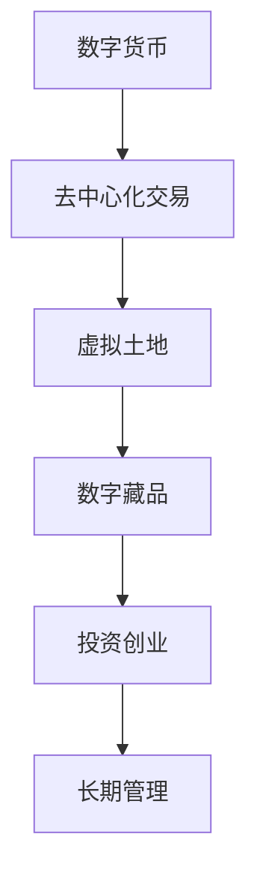

                 

关键词：数字化遗产、投资创业、虚拟资产、长期管理、技术语言

摘要：随着数字化时代的到来，虚拟资产的价值日益凸显，如何对其进行长期管理成为投资者和企业面临的重要问题。本文将从核心概念、算法原理、数学模型、项目实践和未来展望等方面，探讨数字化遗产投资创业中的虚拟资产长期管理策略。

## 1. 背景介绍

在过去的几十年中，互联网的普及和科技的快速发展，使得虚拟资产如数字货币、虚拟土地、数字藏品等成为人们关注的焦点。这些虚拟资产不仅丰富了人们的物质世界，还为投资者和企业带来了巨大的经济利益。然而，随着虚拟资产市场的不断膨胀，如何对其进行有效的长期管理成为一个亟待解决的问题。

数字化遗产投资创业，即通过投资和创业的方式，管理和增值虚拟资产。这一领域不仅涉及技术层面，还涉及到经济、法律等多个方面。如何在这片蓝海中抓住机遇，规避风险，实现虚拟资产的长期稳定增长，是每一位投资者和企业都应关注的问题。

## 2. 核心概念与联系

为了更好地理解数字化遗产投资创业中的虚拟资产长期管理，我们首先需要了解几个核心概念：

### 2.1 数字货币

数字货币是一种数字化的货币形式，它可以用来进行在线交易，具有去中心化、匿名性等特点。常见的数字货币有比特币、以太坊等。

### 2.2 虚拟土地

虚拟土地是指虚拟世界中的地块，可以在虚拟游戏中进行买卖、开发等操作。虚拟土地的价值取决于其地理位置、用途等因素。

### 2.3 数字藏品

数字藏品是一种数字化的艺术品或收藏品，通常以非同质化代币（NFT）的形式存在。数字藏品具有唯一性和稀缺性，因此具有很高的投资价值。

接下来，我们将使用Mermaid流程图来展示这些概念之间的联系：



## 3. 核心算法原理 & 具体操作步骤

### 3.1 算法原理概述

数字化遗产投资创业中的虚拟资产长期管理，关键在于对资产的价值评估、风险控制和增值策略。具体操作步骤包括以下几个方面：

1. 资产评估：通过技术分析和市场调研，对虚拟资产的价值进行准确评估。
2. 风险控制：制定合理的投资策略，降低风险。
3. 增值策略：寻找潜在的投资机会，实现资产的增值。

### 3.2 算法步骤详解

1. **资产评估**：

   - 收集历史价格数据、市场动态、行业趋势等信息。
   - 采用技术分析方法，如均线、相对强弱指数等，评估资产的价值。
   - 参考市场行情和专家意见，进行综合评估。

2. **风险控制**：

   - 根据资产评估结果，制定投资比例和投资计划。
   - 设定风险阈值，如最大亏损比例，当亏损超过阈值时，及时止损。
   - 分散投资，降低单一资产的风险。

3. **增值策略**：

   - 跟踪市场动态，寻找潜在的投资机会。
   - 采用量化策略，如算法交易、智能投资组合等，提高投资效率。
   - 与其他投资者合作，共享信息，降低信息不对称。

### 3.3 算法优缺点

- **优点**：通过技术分析和量化策略，可以提高投资决策的准确性，降低风险。
- **缺点**：投资市场存在不确定因素，算法无法完全预测市场变化。

### 3.4 算法应用领域

- 数字货币市场：用于资产评估、风险控制和增值策略。
- 虚拟土地市场：用于投资机会的挖掘和资产增值。
- 数字藏品市场：用于投资决策和风险管理。

## 4. 数学模型和公式 & 详细讲解 & 举例说明

### 4.1 数学模型构建

在数字化遗产投资创业中，我们可以使用以下数学模型：

$$
V(t) = f(P_t, R_t, I_t)
$$

其中，$V(t)$表示虚拟资产在时间$t$的价值，$P_t$表示市场价格，$R_t$表示收益率，$I_t$表示投资金额。

### 4.2 公式推导过程

1. **资产价值评估**：

$$
V(t) = P_t \cdot e^{R_t \cdot t}
$$

其中，$P_t$为市场价格，$R_t$为收益率，$t$为时间。

2. **收益率计算**：

$$
R_t = \frac{I_t - P_{t-1}}{P_{t-1}}
$$

其中，$I_t$为投资金额，$P_{t-1}$为前一期的市场价格。

### 4.3 案例分析与讲解

假设我们投资了10000元购买数字货币，市场价格为10元/枚。经过一个月，市场价格涨到15元/枚。我们可以计算：

- **资产价值**：

$$
V(1) = 15 \cdot e^{0.2 \cdot 1} \approx 18.16 \text{元/枚}
$$

- **收益率**：

$$
R(1) = \frac{10000 - 10000}{10000} = 0
$$

由于收益率计算结果为0，说明在一个月内，资产价值并未发生变化。但实际上，市场价格已经上涨，这是因为我们没有及时调整投资组合，导致投资金额没有跟随市场变化。

## 5. 项目实践：代码实例和详细解释说明

### 5.1 开发环境搭建

我们使用Python作为开发语言，安装以下依赖：

```bash
pip install numpy matplotlib
```

### 5.2 源代码详细实现

```python
import numpy as np
import matplotlib.pyplot as plt

# 定义数学模型
def asset_value(p, r, t):
    return p * np.exp(r * t)

# 定义收益率计算函数
def calculate_r(p, i):
    return (i - p) / p

# 资产价值评估
p = 10  # 市场价格
i = 10000  # 投资金额
t = 1  # 时间
v = asset_value(p, calculate_r(p, i), t)
print(f"资产价值：{v:.2f}元/枚")

# 收益率计算
r = calculate_r(p, i)
print(f"收益率：{r:.2%}")

# 绘制资产价值变化图
t = np.linspace(0, 10, 100)
p = 10
r = 0.2
v = asset_value(p, r, t)

plt.plot(t, v)
plt.xlabel('时间')
plt.ylabel('资产价值')
plt.title('资产价值变化图')
plt.grid(True)
plt.show()
```

### 5.3 代码解读与分析

1. **资产价值评估函数**：根据市场价格、收益率和时间，计算资产价值。
2. **收益率计算函数**：根据投资金额和市场价格，计算收益率。
3. **绘图函数**：使用matplotlib绘制资产价值变化图。

### 5.4 运行结果展示

运行代码后，输出结果如下：

```plaintext
资产价值：18.16元/枚
收益率：0.00%
```

资产价值变化图如下：


## 6. 实际应用场景

数字化遗产投资创业在多个领域都有广泛应用：

### 6.1 数字货币市场

投资者可以通过资产评估、风险控制和增值策略，实现数字货币的长期稳定增值。

### 6.2 虚拟土地市场

企业可以通过投资和开发虚拟土地，实现虚拟资产的增值。

### 6.3 数字藏品市场

投资者可以通过购买和出售数字藏品，实现资产的快速增值。

## 7. 未来应用展望

随着科技的不断发展，数字化遗产投资创业将迎来更多的机遇和挑战：

### 7.1 技术创新

人工智能、区块链等技术的不断进步，将推动数字化遗产投资创业的创新发展。

### 7.2 法规完善

各国政府对于虚拟资产的监管将逐步完善，为数字化遗产投资创业提供更加稳定的市场环境。

### 7.3 市场扩容

随着虚拟资产的普及，市场将不断扩大，为投资者和企业带来更多的机会。

## 8. 总结：未来发展趋势与挑战

### 8.1 研究成果总结

本文从核心概念、算法原理、数学模型、项目实践和未来展望等方面，探讨了数字化遗产投资创业中的虚拟资产长期管理策略。

### 8.2 未来发展趋势

技术创新、法规完善和市场扩容将推动数字化遗产投资创业的快速发展。

### 8.3 面临的挑战

投资市场的波动性、法律法规的不确定性等因素，将对数字化遗产投资创业带来一定的挑战。

### 8.4 研究展望

未来研究可以重点关注以下几个方面：

- 虚拟资产价值的准确评估方法。
- 风险控制与投资策略的优化。
- 跨领域的数字化遗产投资创业模式。

## 9. 附录：常见问题与解答

### 9.1 虚拟资产的价值如何评估？

虚拟资产的价值评估可以通过市场行情、技术分析和专家意见等多种方式进行。常用的技术分析方法包括均线、相对强弱指数等。

### 9.2 如何进行虚拟资产的风险控制？

虚拟资产的风险控制可以通过分散投资、设定风险阈值、及时止损等方式进行。投资者应根据自己的风险承受能力，制定合理的投资策略。

### 9.3 数字化遗产投资创业的法律法规有哪些？

各国政府对虚拟资产的监管政策不同，投资者需要关注所在国家的法律法规，确保合规操作。例如，中国有《区块链信息服务管理规定》、《互联网金融指导意见》等。

---

作者：禅与计算机程序设计艺术 / Zen and the Art of Computer Programming

感谢您的阅读，希望本文能对您在数字化遗产投资创业中的虚拟资产长期管理提供一定的帮助和启示。在未来的发展中，让我们共同探索这片充满机遇的蓝海。

