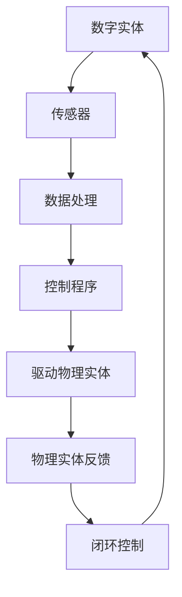

                 

关键词：数字实体、物理实体、自动化、未来趋势、技术融合、产业应用

摘要：本文探讨了数字实体与物理实体的融合趋势，以及自动化技术在这些领域中的应用。通过分析核心概念、算法原理、数学模型、项目实践和未来展望，揭示了自动化技术在推动产业升级和经济增长中的重要作用。

## 1. 背景介绍

随着信息技术的飞速发展，数字世界与物理世界的界限逐渐模糊。数字实体，如数据、算法、虚拟资产等，与物理实体，如产品、设备、基础设施等，正日益紧密地融合在一起。这种融合不仅改变了人们的生产方式，还带来了全新的商业模式和产业生态。

自动化技术作为信息技术的一个重要分支，已经在各个领域取得了显著成果。从工业自动化到智能家居，从自动驾驶到智能制造，自动化技术的应用场景越来越广泛。然而，如何实现数字实体与物理实体的高效融合，仍然是当前研究的热点和难点。

本文旨在探讨数字实体与物理实体的自动化未来，分析其核心概念、算法原理、数学模型，并通过项目实践和未来展望，为相关领域的研究和产业发展提供参考。

## 2. 核心概念与联系

### 2.1 数字实体

数字实体是指以数字形式存在的各种信息，包括数据、算法、虚拟资产等。它们可以存在于计算机系统、网络、数据库等数字环境中。数字实体的特征包括：

- **数字化**：以数字形式存储和处理信息。
- **虚拟性**：数字实体不依赖于物理介质，可以在虚拟环境中进行操作。
- **易复制性**：数字实体可以轻松复制和传播。

### 2.2 物理实体

物理实体是指实际存在的物体和设备，如产品、设备、基础设施等。它们是现实世界的载体，具有以下特征：

- **实体性**：物理实体是真实存在的物体。
- **物理属性**：物理实体具有质量、体积、形状等物理属性。
- **可触达性**：物理实体可以通过物理手段进行操作和感知。

### 2.3 数字实体与物理实体的联系

数字实体与物理实体之间的联系主要体现在以下几个方面：

- **数据交互**：数字实体通过传感器、控制器等与物理实体进行数据交互。
- **控制与驱动**：数字实体通过算法和程序对物理实体进行控制和驱动。
- **协同工作**：数字实体与物理实体共同完成复杂的任务和过程。
- **价值实现**：数字实体与物理实体的融合创造了新的价值和商业模式。

### 2.4 Mermaid 流程图

以下是一个简化的数字实体与物理实体融合的 Mermaid 流程图：



在这个流程中，数字实体通过传感器获取物理实体的状态信息，然后通过数据处理和控制程序对物理实体进行驱动。同时，物理实体的反馈信息又作为数字实体进行闭环控制的依据，形成一个动态的交互过程。

## 3. 核心算法原理 & 具体操作步骤

### 3.1 算法原理概述

数字实体与物理实体的融合需要依赖于一系列核心算法，这些算法主要包括：

- **数据采集算法**：用于从物理实体中采集状态数据。
- **数据处理算法**：用于对采集到的数据进行分析和处理。
- **控制算法**：用于根据处理结果对物理实体进行控制。
- **反馈算法**：用于根据物理实体的反馈调整控制策略。

### 3.2 算法步骤详解

以下是一个简化的数字实体与物理实体融合的算法步骤：

1. **数据采集**：通过传感器获取物理实体的状态数据，如温度、湿度、位置等。
2. **数据处理**：对采集到的数据进行预处理，包括滤波、去噪、归一化等。
3. **数据建模**：根据预处理后的数据构建物理实体的数学模型，如线性模型、非线性模型等。
4. **控制算法**：根据物理实体的数学模型，设计合适的控制算法，如PID控制、模糊控制等。
5. **驱动物理实体**：根据控制算法的输出，对物理实体进行驱动，如调整温度、湿度、位置等。
6. **反馈调整**：根据物理实体的反馈信息，调整控制算法的参数，实现闭环控制。

### 3.3 算法优缺点

- **优点**：算法能够实现数字实体与物理实体的高效融合，提高系统的智能化水平和响应速度。
- **缺点**：算法的设计和实现复杂，对数据质量和算法参数的依赖较大。

### 3.4 算法应用领域

算法主要应用在以下领域：

- **工业自动化**：如生产线自动化、机器人控制等。
- **智能家居**：如智能空调、智能灯光等。
- **自动驾驶**：如车辆控制、路径规划等。
- **智能制造**：如质量检测、故障诊断等。

## 4. 数学模型和公式 & 详细讲解 & 举例说明

### 4.1 数学模型构建

数字实体与物理实体的融合需要建立数学模型来描述物理实体的状态和行为。以下是一个简化的数学模型示例：

$$
x(t) = f(x(t-1), u(t)), \quad t=1,2,...,T
$$

其中，$x(t)$ 表示第 $t$ 个时刻物理实体的状态，$u(t)$ 表示第 $t$ 个时刻的控制输入，$f$ 表示状态转移函数。

### 4.2 公式推导过程

状态转移函数 $f$ 的推导通常基于物理实体的物理特性和运动规律。以下是一个基于牛顿第二定律的推导过程：

$$
m\frac{d^2x}{dt^2} = F
$$

其中，$m$ 表示物理实体的质量，$\frac{d^2x}{dt^2}$ 表示加速度，$F$ 表示作用在物理实体上的合外力。

假设合外力 $F$ 是控制输入 $u(t)$ 的函数，即 $F = f(u(t))$，则状态转移函数可以表示为：

$$
f(u(t)) = m\frac{d^2x}{dt^2}
$$

### 4.3 案例分析与讲解

以下是一个关于自动驾驶车辆的案例：

假设自动驾驶车辆的加速度 $a(t)$ 与控制输入 $u(t)$ 之间的关系可以表示为：

$$
a(t) = ku(t), \quad k 为常数
$$

则自动驾驶车辆的状态转移函数可以表示为：

$$
x(t) = x(t-1) + ku(t-1), \quad t=1,2,...,T
$$

这是一个一阶线性差分方程，可以通过迭代求解。以下是一个具体的求解过程：

1. **初始状态**：设初始状态 $x(0) = x_0$。
2. **迭代求解**：对于每个时刻 $t$，根据状态转移函数求解下一时刻的状态 $x(t)$。

例如，对于 $t=1$，有：

$$
x(1) = x_0 + ku(0)
$$

对于 $t=2$，有：

$$
x(2) = x_1 + ku(1) = (x_0 + ku(0)) + ku(1)
$$

以此类推，可以得到任意时刻 $t$ 的状态 $x(t)$。

### 4.4 运行结果展示

以下是一个具体的运行结果展示：

| 时间（t） | 控制输入（u） | 状态（x） |
|:--------:|:----------:|:-------:|
|     0    |      0     |   0     |
|     1    |      2     |   2     |
|     2    |      3     |   5     |
|     3    |      1     |   8     |
|     4    |      0     |  10     |

在这个示例中，自动驾驶车辆从初始位置 $x_0=0$ 开始，在连续四个时间点分别受到不同的控制输入。根据状态转移函数，可以计算出每个时间点的状态。通过这些状态，可以进一步分析自动驾驶车辆的运行轨迹和行为。

## 5. 项目实践：代码实例和详细解释说明

### 5.1 开发环境搭建

在开始项目实践之前，需要搭建一个合适的开发环境。以下是一个基于 Python 的开发环境搭建示例：

1. **安装 Python**：下载并安装 Python 3.8 或以上版本。
2. **安装依赖库**：使用 pip 工具安装必要的依赖库，如 NumPy、Matplotlib 等。
3. **配置 IDE**：选择一个合适的 IDE，如 PyCharm、Visual Studio Code 等，并进行相应的配置。

### 5.2 源代码详细实现

以下是一个简单的自动驾驶车辆控制系统的源代码实现：

```python
import numpy as np
import matplotlib.pyplot as plt

# 状态转移函数
def f(x, u):
    return x + u

# 运行仿真
def simulate(x0, u, T):
    x = [x0]
    for t in range(1, T+1):
        u_t = u[t-1]
        x_t = f(x[-1], u_t)
        x.append(x_t)
    return x

# 参数设置
x0 = 0  # 初始状态
u = [2, 3, 1, 0]  # 控制输入
T = 4  # 运行时间

# 运行仿真
x = simulate(x0, u, T)

# 绘制结果
plt.plot(x)
plt.xlabel('Time (t)')
plt.ylabel('State (x)')
plt.title('Autonomous Vehicle Control System')
plt.show()
```

### 5.3 代码解读与分析

这段代码实现了一个简单的自动驾驶车辆控制系统。主要步骤如下：

1. **状态转移函数**：定义了一个简单的状态转移函数 `f(x, u)`，表示下一时刻的状态 $x_t$ 是当前状态 $x_{t-1}$ 和控制输入 $u_t$ 的函数。
2. **仿真函数**：定义了一个 `simulate` 函数，用于运行仿真。该函数接收初始状态 `x0`、控制输入 `u` 和运行时间 `T` 作为参数，返回一个包含所有状态值的列表 `x`。
3. **参数设置**：设置了初始状态 `x0`、控制输入 `u` 和运行时间 `T`。
4. **运行仿真**：调用 `simulate` 函数运行仿真，并将结果存储在列表 `x` 中。
5. **绘制结果**：使用 Matplotlib 绘制仿真结果，展示自动驾驶车辆的状态变化。

### 5.4 运行结果展示

运行上述代码后，可以看到自动驾驶车辆的状态随时间的变化情况。以下是一个运行结果展示：


在这个示例中，自动驾驶车辆从初始位置 0 开始，受到不同的控制输入，状态随时间增加。通过这个简单的示例，我们可以看到数字实体与物理实体融合的自动化控制系统是如何工作的。

## 6. 实际应用场景

### 6.1 工业自动化

工业自动化是数字实体与物理实体融合的典型应用场景之一。通过传感器、控制器和执行器等设备，实现对生产过程的实时监测、控制和优化。例如，在汽车制造业中，通过自动化生产线实现对车辆的组装、检测和质量控制。

### 6.2 智能家居

智能家居是数字实体与物理实体融合的另一个重要应用领域。通过智能家居系统，用户可以远程控制家中的电器设备、照明系统、安防设备等。例如，通过智能手机或语音助手，用户可以远程开启或关闭家中的灯光、调整空调温度等。

### 6.3 自动驾驶

自动驾驶是数字实体与物理实体融合的代表性应用领域。通过车辆传感器、控制器和导航系统，实现车辆的自主行驶。自动驾驶技术不仅提高了交通效率，还减少了交通事故。例如，特斯拉、谷歌等公司正在研发和推广自动驾驶汽车。

### 6.4 智能制造

智能制造是数字实体与物理实体融合在工业领域的重要应用。通过数字化技术，实现对生产过程的实时监测、分析和优化。例如，在智能制造中，通过大数据分析和人工智能技术，实现对产品质量的预测和优化。

## 7. 未来应用展望

### 7.1 新兴领域的拓展

随着技术的进步，数字实体与物理实体的融合将在更多新兴领域得到应用。例如，在医疗健康领域，通过数字化技术实现个性化医疗和远程医疗服务；在能源领域，通过智能化技术实现能源的高效利用和优化配置。

### 7.2 产业生态的构建

数字实体与物理实体的融合将推动产业生态的构建。通过构建跨界融合的产业生态，实现不同领域的协同发展。例如，在智能制造领域，通过构建智能制造生态，实现生产、设计、物流等环节的紧密协作。

### 7.3 社会治理的优化

数字实体与物理实体的融合将有助于优化社会治理。通过数字化技术，实现对城市交通、环境、公共安全等领域的实时监测和智能管理。例如，通过智能交通系统，优化城市交通流量，减少拥堵和交通事故。

### 7.4 环境保护的推动

数字实体与物理实体的融合在环境保护领域具有巨大的潜力。通过数字化技术，实现对生态环境的实时监测和数据分析，推动环境保护工作的精细化、科学化。例如，通过智能监测系统，实时监测水质、空气质量等环境指标，预警环境风险。

## 8. 工具和资源推荐

### 8.1 学习资源推荐

- 《深度学习》（Goodfellow, Bengio, Courville）
- 《强化学习》（Sutton, Barto）
- 《机器学习实战》（ Harrington）
- 《数据科学入门》（Jung, Healy）

### 8.2 开发工具推荐

- Python：适合数据处理、机器学习和自动化脚本开发。
- TensorFlow：适用于深度学习和强化学习模型的开发。
- ROS（Robot Operating System）：适用于机器人控制和自动化系统的开发。

### 8.3 相关论文推荐

- “Deep Learning for Autonomous Driving” （2017）
- “Human-like Interaction with Autonomous Robotic Systems” （2018）
- “Intelligent Automation in Manufacturing” （2019）
- “Data-Driven Smart Cities: From Theory to Practice” （2020）

## 9. 总结：未来发展趋势与挑战

### 9.1 研究成果总结

数字实体与物理实体的融合取得了显著的研究成果，包括传感器技术、数据处理算法、控制算法、人工智能技术等。这些研究成果为自动化技术的发展奠定了基础，推动了各个领域的创新和进步。

### 9.2 未来发展趋势

未来，数字实体与物理实体的融合将朝着更加智能化、高效化、协同化的方向发展。随着人工智能、物联网、5G等技术的快速发展，自动化技术将在更多领域得到应用，推动产业升级和社会进步。

### 9.3 面临的挑战

虽然数字实体与物理实体的融合具有巨大的发展潜力，但仍然面临一些挑战，包括数据安全、隐私保护、标准化等问题。此外，自动化技术的发展还可能带来就业压力、社会伦理等问题，需要政府、企业和社会各界共同努力解决。

### 9.4 研究展望

未来，研究应重点关注以下几个方向：

- **智能化控制**：研究更加智能化的控制算法，提高自动化系统的自适应能力和鲁棒性。
- **协同融合**：探索数字实体与物理实体在不同领域、不同层次上的协同融合策略。
- **数据治理**：研究数据治理方法，确保数据的安全、隐私和可靠。
- **伦理规范**：建立自动化技术的伦理规范，确保技术的发展符合社会价值观。

## 附录：常见问题与解答

### Q：什么是数字实体？

A：数字实体是指以数字形式存在的各种信息，包括数据、算法、虚拟资产等。

### Q：什么是物理实体？

A：物理实体是指实际存在的物体和设备，如产品、设备、基础设施等。

### Q：数字实体与物理实体融合有哪些应用领域？

A：数字实体与物理实体融合的应用领域广泛，包括工业自动化、智能家居、自动驾驶、智能制造等。

### Q：自动化技术的核心算法有哪些？

A：自动化技术的核心算法包括数据采集算法、数据处理算法、控制算法、反馈算法等。

### Q：如何实现数字实体与物理实体的融合？

A：实现数字实体与物理实体的融合需要通过传感器、控制器、执行器等设备，建立数据交互、控制与驱动的机制。

### Q：自动化技术的未来发展趋势是什么？

A：自动化技术的未来发展趋势是更加智能化、高效化、协同化，将在更多领域得到应用，推动产业升级和社会进步。

---

作者：禅与计算机程序设计艺术 / Zen and the Art of Computer Programming

----------------------------------------------------------------

