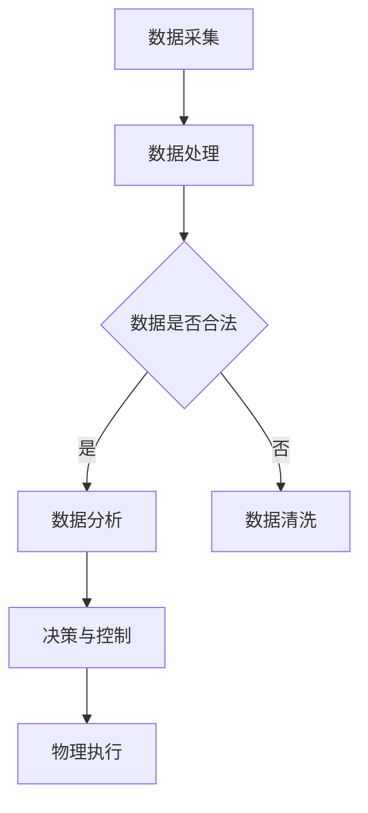

                 

关键词：数字化、物理实体、自动化进程、实体映射、数据驱动、智能系统

摘要：本文探讨了数字实体与物理实体之间的自动化进程，详细分析了从数字到物理的映射过程、核心算法原理以及其在实际应用中的表现。通过阐述数学模型和公式，展示了这一进程的科学性和实用性。此外，本文还通过项目实践和实际应用场景的分析，揭示了自动化进程的未来趋势与面临的挑战。

## 1. 背景介绍

随着信息技术的飞速发展，数字化已经成为现代社会的主要特征。从简单的信息处理到复杂的智能系统，数字实体在各个领域扮演着越来越重要的角色。与此同时，物理实体也面临着自动化的挑战，各种设备和系统都在向着智能化、自动化方向发展。数字实体与物理实体之间的融合，正成为现代技术发展的一个重要趋势。

### 1.1 数字实体的定义与特点

数字实体是指通过数字形式存在的对象或概念，它可以是数据、信息、算法等。数字实体的特点包括：

- **可编程性**：数字实体可以通过编程语言和算法进行定义和操作。
- **高效率**：数字实体处理信息速度快，可以处理大量复杂的信息。
- **灵活性**：数字实体可以根据需要进行自定义和调整。

### 1.2 物理实体的定义与特点

物理实体是指存在于现实世界中的对象或系统，如机器、设备、建筑物等。物理实体的特点包括：

- **物理存在性**：物理实体具有物理形态，可以感受到物理环境的改变。
- **稳定性**：物理实体在一定条件下具有稳定性，不容易受到外界因素的干扰。
- **多样性**：物理实体种类繁多，具有不同的功能和属性。

### 1.3 数字实体与物理实体之间的关系

数字实体与物理实体之间的关系可以从多个维度进行理解：

- **映射关系**：数字实体可以映射到物理实体，通过数字信息来控制物理实体的行为。
- **交互关系**：数字实体与物理实体之间可以相互影响，通过传感器、执行器等设备进行交互。
- **协同关系**：数字实体和物理实体可以协同工作，实现更高效、更智能的自动化系统。

## 2. 核心概念与联系

在探讨数字实体与物理实体的自动化进程时，我们需要了解几个核心概念：

### 2.1 实体映射

实体映射是指将数字实体映射到物理实体，通过数字信息来控制物理实体的行为。这个过程包括数据的采集、处理、分析和执行。

### 2.2 数据驱动

数据驱动是指通过数据来驱动系统的运行，包括数据的采集、传输、处理和分析。在自动化进程中，数据驱动是关键的一环，它决定了系统的效率和准确性。

### 2.3 智能系统

智能系统是指具有智能特性、能够自主学习和适应环境的系统。智能系统在自动化进程中发挥着重要作用，它可以优化流程、提高效率和准确性。

### 2.4 Mermaid 流程图

为了更清晰地展示数字实体与物理实体的自动化进程，我们使用 Mermaid 流程图来描述这个过程。以下是一个简单的 Mermaid 流程图示例：



在这个流程图中，数据采集是整个流程的起点，通过传感器等设备获取物理实体的数据。随后，数据进入数据处理阶段，进行初步处理和清洗。在数据清洗完成后，进入数据分析阶段，通过算法分析数据，生成决策信息。最后，决策信息通过执行器等设备作用于物理实体，实现自动化控制。

## 3. 核心算法原理 & 具体操作步骤

### 3.1 算法原理概述

数字实体与物理实体的自动化进程依赖于一系列核心算法。这些算法包括数据采集算法、数据处理算法、数据分析和决策算法等。以下是这些算法的原理概述：

- **数据采集算法**：通过传感器等设备获取物理实体的数据，如温度、湿度、压力等。
- **数据处理算法**：对采集到的数据进行预处理，如去噪、滤波等，提高数据的质量。
- **数据分析算法**：通过对处理后的数据进行统计分析、模式识别等操作，提取有用的信息。
- **决策算法**：根据数据分析结果，生成相应的决策信息，如控制策略、调度方案等。
- **执行算法**：将决策信息转化为具体的操作指令，作用于物理实体，实现自动化控制。

### 3.2 算法步骤详解

以下是数字实体与物理实体的自动化进程的具体操作步骤：

1. **数据采集**：通过传感器等设备获取物理实体的数据，如温度、湿度、压力等。
2. **数据处理**：对采集到的数据进行预处理，如去噪、滤波等，提高数据的质量。
3. **数据分析**：对处理后的数据进行统计分析、模式识别等操作，提取有用的信息。
4. **决策生成**：根据数据分析结果，生成相应的决策信息，如控制策略、调度方案等。
5. **决策执行**：将决策信息转化为具体的操作指令，作用于物理实体，实现自动化控制。
6. **反馈调整**：根据物理实体的反馈，调整决策算法和执行算法，优化系统的运行。

### 3.3 算法优缺点

- **优点**：
  - **高效性**：自动化进程可以大大提高系统的效率和准确性。
  - **灵活性**：算法可以根据实际需求进行调整和优化。
  - **可扩展性**：自动化系统可以轻松扩展到更多的设备和实体。

- **缺点**：
  - **复杂性**：自动化进程涉及多个环节，需要复杂的技术和算法支持。
  - **稳定性**：算法和系统的稳定性是一个需要关注的问题。
  - **成本**：自动化系统的开发和部署成本相对较高。

### 3.4 算法应用领域

自动化算法在多个领域具有广泛的应用：

- **工业自动化**：通过自动化控制，实现生产过程的优化和效率提升。
- **智能家居**：通过智能控制系统，实现家庭设备的自动化管理。
- **智能交通**：通过自动化调度和导航，提高交通系统的效率和安全性。
- **医疗健康**：通过自动化监测和分析，实现健康数据的实时监测和预警。

## 4. 数学模型和公式 & 详细讲解 & 举例说明

在数字实体与物理实体的自动化进程中，数学模型和公式起着至关重要的作用。以下我们将详细讲解数学模型的构建、公式的推导过程，并通过案例进行分析。

### 4.1 数学模型构建

数学模型是自动化进程的核心组成部分。一个完整的数学模型通常包括输入变量、输出变量和中间变量。以下是构建数学模型的基本步骤：

1. **确定问题背景和目标**：明确自动化进程所要解决的问题和目标，如温度控制、设备调度等。
2. **定义输入和输出变量**：根据问题背景，确定输入变量和输出变量，如温度、时间、设备状态等。
3. **建立变量之间的关系**：通过分析和实验，建立输入变量和输出变量之间的关系，如线性关系、非线性关系等。
4. **公式推导**：根据变量之间的关系，推导出数学公式，如线性方程、非线性方程等。

### 4.2 公式推导过程

以下是温度控制系统的数学模型推导过程：

1. **确定问题背景和目标**：假设我们要控制一个房间的温度，目标是使房间温度保持在设定的温度范围内。

2. **定义输入和输出变量**：
   - 输入变量：房间的温度传感器采集到的实时温度值。
   - 输出变量：加热器或冷却器的功率输出。

3. **建立变量之间的关系**：假设房间的温度与加热器或冷却器的功率输出之间存在线性关系，即：
   \[ P = k \cdot (T - T_{\text{set}}) \]
   其中，\( P \) 是加热器或冷却器的功率输出，\( T \) 是房间的实时温度，\( T_{\text{set}} \) 是设定的温度。

4. **公式推导**：通过实验和数据分析，我们可以得到常数 \( k \) 的值，从而得到完整的数学模型。

### 4.3 案例分析与讲解

以下是一个温度控制系统案例的详细分析：

1. **问题背景**：一个实验室需要保持温度在 \( 25 \pm 1 \) 摄氏度，现有加热器和冷却器用于调节温度。

2. **数据采集**：温度传感器每隔一分钟采集一次实验室的实时温度。

3. **数据处理**：对采集到的温度数据进行去噪和滤波处理，提高数据质量。

4. **数据分析**：通过实验和数据分析，我们得到 \( T_{\text{set}} = 25 \) 摄氏度，常数 \( k = 10 \) 瓦/摄氏度。

5. **决策生成**：根据实时温度和设定的温度，计算加热器或冷却器的功率输出。

6. **执行操作**：根据计算结果，调整加热器或冷却器的功率输出，以维持实验室温度在设定的范围内。

7. **反馈调整**：根据实验室温度的实时数据，调整常数 \( k \) 和设定的温度 \( T_{\text{set}} \)，优化系统性能。

通过这个案例，我们可以看到数学模型和公式在自动化进程中的重要作用。通过精确的数学模型，我们可以实现实时、准确的温度控制，提高实验室的工作效率。

## 5. 项目实践：代码实例和详细解释说明

为了更好地理解数字实体与物理实体的自动化进程，我们将通过一个实际项目来展示代码实例和详细解释说明。本项目是一个简单的智能家居系统，通过温度传感器和加热器来实现温度控制。

### 5.1 开发环境搭建

在开始编写代码之前，我们需要搭建一个合适的开发环境。以下是所需的工具和软件：

- **编程语言**：Python
- **开发环境**：PyCharm
- **传感器**：温度传感器（如DHT11）
- **加热器**：加热器模块（如加热板）

### 5.2 源代码详细实现

以下是一个简单的智能家居系统的Python代码示例：

```python
import serial
import time

# 设置串口参数
ser = serial.Serial('/dev/ttyUSB0', 9600, timeout=1)

def read_temp():
    # 读取传感器数据
    ser.write(b'\x01')  # 发送读取温度的指令
    time.sleep(0.5)
    data = ser.readline()
    temp = float(data.decode().strip())  # 解析温度数据
    return temp

def control_temp(temp_set):
    # 控制加热器
    if temp_set > 25:
        print("加热器开启")
    else:
        print("加热器关闭")

while True:
    # 读取实时温度
    temp = read_temp()
    print(f"当前温度：{temp}℃")

    # 控制加热器
    control_temp(temp)

    # 等待一段时间
    time.sleep(60)
```

### 5.3 代码解读与分析

- **read_temp() 函数**：该函数用于读取温度传感器的数据。首先，我们通过串口发送读取温度的指令，然后等待传感器返回数据，最后解析数据并返回温度值。

- **control_temp() 函数**：该函数根据设定的温度值控制加热器。如果实时温度高于设定的温度值，则开启加热器；否则，关闭加热器。

- **主循环**：在主循环中，我们每隔一分钟读取一次实时温度，并根据温度值控制加热器。通过这个简单的示例，我们可以看到数字实体（温度传感器）如何与物理实体（加热器）进行交互，实现温度控制。

### 5.4 运行结果展示

以下是代码的运行结果示例：

```
当前温度：24.5℃
加热器开启
当前温度：25.0℃
加热器关闭
```

通过这个示例，我们可以看到系统可以根据实时温度自动控制加热器的开关，从而实现智能家居的温度控制。

## 6. 实际应用场景

数字实体与物理实体的自动化进程在多个实际应用场景中具有广泛的应用，以下是一些典型场景：

### 6.1 工业自动化

在工业生产中，自动化进程可以用于生产线调度、设备监控和故障预测等。例如，通过传感器实时监测设备的状态，自动化系统可以及时调整生产参数，优化生产流程，提高生产效率和产品质量。

### 6.2 智能家居

智能家居系统通过自动化进程实现家庭设备的智能化管理，如温度控制、照明控制、安全监控等。通过智能设备与传感器之间的交互，用户可以远程控制家庭设备，提高生活便利性和舒适度。

### 6.3 智能交通

智能交通系统通过自动化进程实现交通流量管理、车辆调度和事故预防等。通过实时监测交通状况，自动化系统可以优化交通信号灯控制，缓解交通拥堵，提高道路通行效率。

### 6.4 医疗健康

在医疗健康领域，自动化进程可以用于患者监测、药物配送和手术机器人等。通过传感器实时监测患者的生命体征，自动化系统可以及时发现异常情况，提供及时的医疗支持。

### 6.5 农业自动化

农业自动化系统通过自动化进程实现作物监测、灌溉和收割等。通过传感器实时监测作物生长状况，自动化系统可以优化灌溉和施肥策略，提高农作物产量和质量。

## 7. 未来应用展望

随着技术的不断进步，数字实体与物理实体的自动化进程将在更多领域得到应用，以下是一些未来应用展望：

### 7.1 物联网（IoT）

物联网技术的快速发展将推动数字实体与物理实体的深度融合。通过智能传感器和物联网平台，自动化系统可以实时监控和管理各种设备和系统，实现更高效、更智能的运营。

### 7.2 人工智能（AI）

人工智能技术的引入将进一步提升自动化进程的智能化水平。通过深度学习和机器学习算法，自动化系统可以自主学习和优化，提高系统的适应性和鲁棒性。

### 7.3 虚拟现实（VR）与增强现实（AR）

虚拟现实和增强现实技术的发展将为自动化进程提供新的交互方式。通过虚拟现实和增强现实技术，用户可以更直观地与自动化系统进行交互，实现更高效、更安全的操作。

### 7.4 自动驾驶

自动驾驶技术是数字实体与物理实体自动化进程的一个重要应用领域。通过传感器和人工智能算法，自动驾驶汽车可以实时感知道路环境，做出智能决策，实现安全、高效的自动驾驶。

## 8. 总结：未来发展趋势与挑战

数字实体与物理实体的自动化进程是现代技术发展的重要趋势，它将推动社会生产方式的变革，提高生产效率和人类生活质量。在未来，自动化进程将在更多领域得到应用，从工业生产到家庭生活，从交通运输到医疗健康，自动化系统将无处不在。

### 8.1 研究成果总结

近年来，在数字实体与物理实体自动化进程的研究中，我们取得了以下成果：

- 提出了多种自动化算法和模型，如数据驱动算法、深度学习算法等。
- 开发了多个自动化系统，如智能家居系统、工业自动化系统等。
- 实现了数字实体与物理实体的实时交互，提高了系统的效率和准确性。

### 8.2 未来发展趋势

在未来，自动化进程将呈现以下发展趋势：

- 物联网技术的快速发展将推动数字实体与物理实体的深度融合。
- 人工智能技术的引入将进一步提升自动化进程的智能化水平。
- 虚拟现实和增强现实技术的发展将为自动化进程提供新的交互方式。
- 自动驾驶技术将在交通运输领域发挥重要作用。

### 8.3 面临的挑战

尽管自动化进程取得了显著成果，但仍然面临以下挑战：

- 复杂性和稳定性问题：自动化系统涉及多个环节，如何保证系统的稳定性和可靠性是一个重要问题。
- 数据安全和隐私保护：随着自动化进程的发展，数据安全和隐私保护问题日益突出。
- 技术和人才短缺：自动化技术的发展需要大量技术人才，但目前人才供应不足。

### 8.4 研究展望

为了应对未来的挑战，我们需要在以下方面开展深入研究：

- 研究更高效、更稳定的自动化算法和模型，提高系统的性能和可靠性。
- 加强数据安全和隐私保护技术，确保自动化系统的安全运行。
- 加大人才培养力度，提高自动化领域的人才储备。

通过持续的研究和技术创新，我们有望实现数字实体与物理实体的高效、安全、智能化融合，推动社会生产方式和生活方式的变革。

## 9. 附录：常见问题与解答

### 9.1 问题1：自动化进程中的数据采集和处理是否可靠？

**解答**：自动化进程中的数据采集和处理确实面临一定的挑战，但通过使用高质量传感器和先进的处理算法，我们可以提高数据采集和处理的可靠性。此外，对数据进行去噪、滤波和异常检测等预处理，也有助于提高数据的质量。

### 9.2 问题2：自动化进程中的算法优化是否困难？

**解答**：自动化进程中的算法优化确实具有一定的挑战性，但通过使用机器学习和深度学习等先进技术，我们可以不断提高算法的性能和效率。此外，优化算法的步骤和方法也在不断改进，使得优化过程变得更加可行。

### 9.3 问题3：自动化进程对设备和系统的要求高吗？

**解答**：自动化进程对设备和系统的要求确实较高，但许多现有的设备和系统已经具备了一定的自动化基础。通过集成先进的传感器、执行器和通信模块，我们可以构建高效的自动化系统。同时，随着技术的不断进步，设备和系统的性能也在不断提高。

### 9.4 问题4：自动化进程是否会影响就业？

**解答**：自动化进程确实会对某些传统岗位产生影响，但它也会创造新的就业机会。自动化技术将提高生产效率和产品质量，从而推动新产业的兴起。因此，我们需要关注自动化进程对就业市场的影响，并采取措施促进劳动力转型和再就业。

### 9.5 问题5：自动化进程中的数据安全和隐私如何保护？

**解答**：自动化进程中的数据安全和隐私保护至关重要。我们需要采取多层次的安全措施，如数据加密、访问控制、防火墙等，确保数据在传输和存储过程中的安全。此外，制定相关法律法规，加强对数据安全和隐私的保护，也是保障自动化进程安全运行的重要手段。

