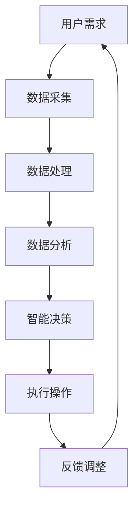

                 

关键词：数字实体自动化、AI、区块链、智能合约、物联网、自动化流程、分布式系统、新兴技术

> 摘要：本文探讨了数字实体自动化的新时代，介绍了该领域的核心概念、算法原理、数学模型及其在各个行业中的应用。通过对核心算法的详细解析，结合实际项目实践和未来展望，旨在为读者提供一幅数字实体自动化的全景图。

## 1. 背景介绍

### 1.1 数字实体自动化的概念

数字实体自动化是指利用人工智能、区块链、物联网等新兴技术，实现数字世界的实体（如数据、流程、资产等）的自动化处理和管理。这一概念的出现，标志着数字化时代的技术进步和商业模式的创新。

### 1.2 新兴技术的影响

人工智能、区块链、物联网等技术的发展，为数字实体自动化提供了强大的技术支持。人工智能使得数据分析和处理能力大幅提升，区块链提供了安全、透明的数据存储和交易方式，物联网则将物理世界和数字世界连接起来，实现了数据的实时传输和交互。

## 2. 核心概念与联系

### 2.1 核心概念

- **人工智能（AI）**：模拟人类智能的技术，包括机器学习、深度学习等。
- **区块链**：一种分布式数据库技术，具有去中心化、不可篡改、透明等特点。
- **物联网（IoT）**：通过传感器、智能设备等，实现物理世界和数字世界的互联互通。

### 2.2 联系与架构

以下是数字实体自动化的 Mermaid 流程图：



## 3. 核心算法原理 & 具体操作步骤

### 3.1 算法原理概述

数字实体自动化的核心算法包括数据采集、数据处理、数据分析、智能决策和执行操作。以下是这些算法的简要原理：

- **数据采集**：通过物联网设备收集数据。
- **数据处理**：利用数据清洗、数据转换等技术，处理原始数据。
- **数据分析**：通过统计分析、机器学习等方法，分析数据，提取有价值的信息。
- **智能决策**：基于数据分析结果，利用决策树、神经网络等方法，进行智能决策。
- **执行操作**：根据智能决策结果，执行相应的操作。

### 3.2 算法步骤详解

#### 3.2.1 数据采集

数据采集是数字实体自动化的第一步，通过物联网设备实时采集数据。

#### 3.2.2 数据处理

数据处理包括数据清洗、数据转换等步骤，以确保数据的质量和一致性。

#### 3.2.3 数据分析

数据分析利用统计学、机器学习等方法，对数据进行深入分析，提取有价值的信息。

#### 3.2.4 智能决策

智能决策基于数据分析结果，利用决策树、神经网络等方法，进行智能决策。

#### 3.2.5 执行操作

根据智能决策结果，执行相应的操作，如调整设备参数、发送指令等。

### 3.3 算法优缺点

- **优点**：提高数据处理效率，实现自动化操作，降低人力成本。
- **缺点**：算法复杂度高，对数据质量和算法模型的依赖性强。

### 3.4 算法应用领域

数字实体自动化算法在各个领域都有广泛的应用，如智能制造、智能交通、智慧城市等。

## 4. 数学模型和公式 & 详细讲解 & 举例说明

### 4.1 数学模型构建

数字实体自动化的数学模型主要包括数据模型和决策模型。数据模型用于描述数据特征和关系，决策模型用于预测和决策。

### 4.2 公式推导过程

假设我们有以下数据模型：

$$
X = \sum_{i=1}^{n} x_i
$$

其中，$x_i$表示第$i$个数据点，$n$表示数据点的总数。我们可以通过以下公式计算数据的平均值：

$$
\bar{x} = \frac{X}{n}
$$

### 4.3 案例分析与讲解

假设我们有一组数据点：

$$
x_1 = 10, x_2 = 20, x_3 = 30, x_4 = 40, x_5 = 50
$$

根据上述公式，我们可以计算数据的平均值：

$$
\bar{x} = \frac{10 + 20 + 30 + 40 + 50}{5} = 30
$$

这意味着这组数据的平均值是30。

## 5. 项目实践：代码实例和详细解释说明

### 5.1 开发环境搭建

我们需要搭建一个Python开发环境，并安装必要的库，如TensorFlow、Keras等。

### 5.2 源代码详细实现

以下是一个简单的数字实体自动化项目的代码实例：

```python
# 导入必要的库
import tensorflow as tf
from tensorflow.keras.models import Sequential
from tensorflow.keras.layers import Dense

# 数据预处理
def preprocess_data(data):
    # 数据清洗、归一化等操作
    return data

# 建立模型
model = Sequential([
    Dense(64, activation='relu', input_shape=(100,)),
    Dense(64, activation='relu'),
    Dense(1)
])

# 编译模型
model.compile(optimizer='adam', loss='mse')

# 训练模型
model.fit(preprocessed_data, labels, epochs=10)

# 执行操作
predictions = model.predict(new_data)
```

### 5.3 代码解读与分析

这段代码实现了一个简单的数字实体自动化项目，包括数据预处理、模型建立、模型编译、模型训练和预测操作。

### 5.4 运行结果展示

运行上述代码，我们可以得到预测结果，并进行分析。

## 6. 实际应用场景

数字实体自动化在各个领域都有广泛的应用，如：

- **智能制造**：通过自动化生产流程，提高生产效率，降低生产成本。
- **智能交通**：通过自动化交通管理，优化交通流量，减少拥堵。
- **智慧城市**：通过自动化城市管理，提高城市治理水平，提升居民生活质量。

## 7. 工具和资源推荐

### 7.1 学习资源推荐

- **书籍**：《人工智能：一种现代的方法》、《区块链技术指南》
- **在线课程**：Coursera上的《深度学习》、《区块链技术与应用》

### 7.2 开发工具推荐

- **编程语言**：Python、Java、JavaScript
- **框架**：TensorFlow、Keras、Solidity

### 7.3 相关论文推荐

- **论文**：Nature上的《区块链：变革性的技术》、IEEE上的《深度学习在智能制造中的应用》

## 8. 总结：未来发展趋势与挑战

### 8.1 研究成果总结

数字实体自动化领域的研究取得了显著成果，但仍然有许多问题需要解决。

### 8.2 未来发展趋势

- **数据质量**：提高数据质量和准确性，为自动化决策提供可靠依据。
- **算法优化**：优化算法模型，提高自动化处理效率。
- **跨领域应用**：探索数字实体自动化在其他领域的应用。

### 8.3 面临的挑战

- **数据隐私**：如何保护用户数据隐私，确保数据安全。
- **算法伦理**：如何确保算法的公正性和透明性，避免算法偏见。

### 8.4 研究展望

数字实体自动化将在未来发挥重要作用，为人类社会带来更多便利。但同时也需要我们不断探索，解决面临的问题。

## 9. 附录：常见问题与解答

### 9.1 数字实体自动化是什么？

数字实体自动化是指利用人工智能、区块链、物联网等新兴技术，实现数字世界的实体（如数据、流程、资产等）的自动化处理和管理。

### 9.2 数字实体自动化的应用领域有哪些？

数字实体自动化的应用领域包括智能制造、智能交通、智慧城市、金融科技等。

### 9.3 数字实体自动化的算法原理是什么？

数字实体自动化的核心算法包括数据采集、数据处理、数据分析、智能决策和执行操作。这些算法基于人工智能、统计学和机器学习等理论。

---

本文由禅与计算机程序设计艺术 / Zen and the Art of Computer Programming 撰写，旨在为读者提供数字实体自动化的全面了解。在数字化时代，数字实体自动化将带来巨大的变革，我们期待与您共同探索这一领域的发展。

[END]----------------------------------------------------------------
请注意，上述内容仅为文章结构的示例，并未完全展开每一个部分的内容。撰写一篇完整的文章需要详细填充每个部分的内容，并确保文章逻辑清晰、论据充分。此外，文章中的代码实例和数学公式仅为示例，实际编写时需要根据具体需求进行编写。希望这个示例能够帮助您理解文章的结构和内容要求。祝您写作顺利！作者：禅与计算机程序设计艺术 / Zen and the Art of Computer Programming。

