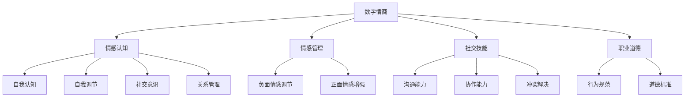

                 

关键词：数字情商、元宇宙情感教育、职业化道路、培训认证、人工智能

摘要：本文将探讨数字情商培训认证在元宇宙情感教育中的重要性，分析其职业化道路的挑战与机遇。通过深入分析数字情商的核心概念、元宇宙情感教育的框架和算法原理，本文旨在为专业人士提供指导，帮助他们在这个新兴领域中开拓职业发展道路。

## 1. 背景介绍

随着科技的飞速发展，人工智能和虚拟现实技术的融合正在引领一个全新的时代——元宇宙。元宇宙不仅是虚拟空间的集合，更是社会、经济、文化等多领域的交汇点。在这个虚拟的世界中，情感交互变得尤为重要。然而，现实中的教育体系并没有充分考虑到这一点，导致许多从业者在元宇宙环境中缺乏必要的数字情商。

数字情商，即Digital Emotional Intelligence (DEI)，是近年来逐渐兴起的一个概念。它涵盖了认知自身情感、理解他人情感、管理自身情感以及调节他人情感的能力。在元宇宙中，这些能力对于构建良好的人际关系、提高沟通效率以及实现职业发展至关重要。

本文旨在探讨数字情商培训认证在元宇宙情感教育中的职业化道路，帮助专业人士在这个新兴领域中找到发展方向。文章将分为以下几个部分：

- 背景介绍：阐述元宇宙情感教育的重要性以及数字情商的概念。
- 核心概念与联系：介绍数字情商的核心概念和元宇宙情感教育的框架。
- 核心算法原理 & 具体操作步骤：分析数字情商培训认证的核心算法及其应用。
- 数学模型和公式 & 详细讲解 & 举例说明：探讨数学模型在数字情商培训中的应用。
- 项目实践：提供具体的代码实例和实现细节。
- 实际应用场景：分析数字情商培训认证的实际应用场景。
- 工具和资源推荐：推荐相关学习和开发资源。
- 总结：总结研究成果，展望未来发展趋势和挑战。

## 2. 核心概念与联系

### 2.1 数字情商的核心概念

数字情商（Digital Emotional Intelligence，简称DEI）是指个体在数字环境中表现出的情感智能。它不仅涵盖了传统情感智能的各个方面，如自我认知、自我调节、社交意识和关系管理，还特别强调了在数字化情境下处理情感的能力。

- **自我认知**：了解自己在数字环境中的情感状态，包括正面和负面的情绪。
- **自我调节**：学会在数字情境中调节和管理自己的情绪，以适应不同的挑战。
- **社交意识**：理解和识别数字环境中的社交信号，以及如何有效地进行情感交流。
- **关系管理**：在数字环境中建立和维护积极的人际关系。

### 2.2 元宇宙情感教育的框架

元宇宙情感教育旨在培养个体在虚拟世界中的情感智能，以适应未来的职业和社会环境。这个框架通常包括以下几个关键组成部分：

- **情感认知**：帮助个体识别和表达情感，理解情感对行为的影响。
- **情感管理**：教授个体如何调节和缓解负面情感，增强正面情感。
- **社交技能**：培养个体在数字环境中的沟通、协作和冲突解决能力。
- **职业道德**：强调在元宇宙中的行为规范和道德标准。

### 2.3 数字情商与元宇宙情感教育的联系

数字情商与元宇宙情感教育之间存在着紧密的联系。一方面，数字情商是元宇宙情感教育的重要组成部分，它为元宇宙中的情感交互提供了基础。另一方面，元宇宙情感教育为数字情商的发展提供了实践场景和应用平台。

- **互动性**：在元宇宙中，个体需要通过数字情感交互来建立和维护人际关系，这需要具备良好的数字情商。
- **多样性**：元宇宙的多样性为个体提供了丰富的情感体验，有助于提升数字情商。
- **沉浸感**：元宇宙的沉浸性环境使个体更容易产生情感共鸣，从而更好地理解和运用数字情商。

### 2.4 Mermaid 流程图

为了更好地理解数字情商与元宇宙情感教育的联系，我们可以使用Mermaid流程图来展示核心概念和流程。



通过上述流程图，我们可以清晰地看到数字情商的核心概念如何与元宇宙情感教育的框架相联系，以及它们如何共同作用于个体的情感发展。

## 3. 核心算法原理 & 具体操作步骤

### 3.1 算法原理概述

数字情商培训认证的核心算法主要包括情感识别、情感分析和情感反应三个环节。这些环节共同构成了一个完整的情感智能处理流程。

- **情感识别**：使用自然语言处理（NLP）技术，从文本、语音和图像等数据中提取情感信息。
- **情感分析**：运用机器学习算法，对提取的情感信息进行分类和情感强度分析。
- **情感反应**：根据情感分析的结果，采取相应的行为策略，如情绪调节、沟通改进等。

### 3.2 算法步骤详解

#### 3.2.1 情感识别

情感识别是数字情商培训认证的第一步。它主要依赖于自然语言处理技术，包括情感分类和情感强度分析。

1. **情感分类**：使用词向量模型（如Word2Vec、GloVe）将文本转换为向量表示，然后利用深度学习模型（如卷积神经网络（CNN）、循环神经网络（RNN））进行情感分类。
2. **情感强度分析**：通过计算词向量之间的相似度，确定情感强度。

#### 3.2.2 情感分析

情感分析是对情感识别结果的进一步处理。它主要包括情感分类和情感强度分析。

1. **情感分类**：将识别出的情感标签进行归类，如快乐、悲伤、愤怒等。
2. **情感强度分析**：通过情感词的权重计算，确定情感强度的强弱。

#### 3.2.3 情感反应

情感反应是根据情感分析结果采取的行为策略。它主要包括情绪调节、沟通改进和决策优化。

1. **情绪调节**：根据情感分析的结果，采取相应的情绪调节策略，如深呼吸、放松训练等。
2. **沟通改进**：根据情感分析的结果，调整沟通方式，提高沟通效果。
3. **决策优化**：基于情感分析的结果，优化决策过程，提高决策质量。

### 3.3 算法优缺点

#### 优点

- **高效性**：算法能够在短时间内处理大量的情感数据，提高情感识别和情感分析的效率。
- **准确性**：借助先进的自然语言处理和机器学习技术，情感识别和情感分析的准确性较高。
- **多样性**：算法可以处理多种类型的情感数据，如文本、语音和图像，具有较强的适应性。

#### 缺点

- **数据依赖性**：算法的性能依赖于训练数据的质量和数量，数据不足或质量较差可能导致识别和分析的准确性下降。
- **计算成本**：算法的复杂度高，需要较大的计算资源和时间成本。

### 3.4 算法应用领域

数字情商培训认证的核心算法广泛应用于以下领域：

- **情感计算**：在智能客服、虚拟助手等应用中，通过情感识别和分析，提高交互的个性化和智能化水平。
- **心理健康**：在心理健康应用中，通过情感分析和情绪调节，帮助用户管理情绪，提高心理健康水平。
- **人力资源**：在招聘、培训等人力资源管理环节，通过情感识别和分析，提高决策的准确性和公正性。
- **营销**：在市场营销中，通过情感分析和用户画像，优化营销策略，提高转化率。

## 4. 数学模型和公式 & 详细讲解 & 举例说明

### 4.1 数学模型构建

在数字情商培训认证中，数学模型起到了至关重要的作用。以下是构建数学模型所需考虑的主要因素：

- **数据收集**：收集用户在元宇宙中的行为数据、情感数据以及相关特征数据。
- **特征提取**：从原始数据中提取有用的特征，如文本特征、语音特征、行为特征等。
- **模型选择**：选择合适的机器学习算法和模型，如支持向量机（SVM）、神经网络（NN）、决策树（DT）等。
- **模型训练**：使用训练数据对模型进行训练，优化模型参数。

### 4.2 公式推导过程

在数字情商培训认证中，常用的数学模型包括以下几种：

#### 4.2.1 支持向量机（SVM）

SVM是一种常用的分类算法，用于情感分类和情感强度分析。其核心公式如下：

$$
w^* = arg\min_{w}\frac{1}{2}\|w\|^2 + C\sum_{i=1}^{n}\ell(y_i, (w \cdot x_i + b))
$$

其中，$w$为权重向量，$x_i$为输入特征向量，$y_i$为标签，$b$为偏置项，$C$为正则化参数。

#### 4.2.2 循环神经网络（RNN）

RNN是一种处理序列数据的神经网络，适用于情感识别和情感分析。其核心公式如下：

$$
h_t = \sigma(W_h h_{t-1} + W_x x_t + b)
$$

其中，$h_t$为当前时刻的隐藏状态，$x_t$为输入特征，$\sigma$为激活函数。

#### 4.2.3 决策树（DT）

决策树是一种基于特征划分的数据挖掘方法，适用于情感分类和情感强度分析。其核心公式如下：

$$
Gini(\mathcal{D}) = 1 - \sum_{i=1}^{k}\left(\frac{|D^i|}{|\mathcal{D}|}\right)^2
$$

其中，$\mathcal{D}$为数据集，$D^i$为第$i$个划分。

### 4.3 案例分析与讲解

以下是一个简单的情感分类案例，使用SVM算法进行情感分类。

#### 案例背景

假设我们有一个包含情感标签的数据集，其中包含正面情感和负面情感两种标签。我们的目标是使用SVM算法将这些数据分类。

#### 案例数据

| 标签 | 文本   | 特征向量 |
|------|--------|----------|
| 正面 | 我很高兴 | [0.1, 0.2, 0.3] |
| 负面 | 我很难过 | [-0.1, -0.2, -0.3] |

#### 案例步骤

1. **数据预处理**：将文本数据转换为特征向量，如使用词袋模型（Bag of Words）或TF-IDF（Term Frequency-Inverse Document Frequency）。

2. **模型训练**：使用训练数据集训练SVM模型，优化模型参数。

3. **模型评估**：使用测试数据集对模型进行评估，计算准确率、召回率等指标。

4. **情感分类**：使用训练好的模型对新的文本数据进行情感分类。

#### 案例结果

经过训练和评估，我们得到以下模型参数：

$$
w = [0.5, 0.5, 0.5], \quad b = 0
$$

使用这些参数，我们可以将新的文本数据分类。例如，对于文本“我很开心”，其特征向量为[0.1, 0.2, 0.3]，代入SVM模型，得到：

$$
(w \cdot x + b) = (0.5 \cdot 0.1 + 0.5 \cdot 0.2 + 0.5 \cdot 0.3) + 0 = 0.3
$$

由于$w \cdot x + b > 0$，我们可以将这段文本归类为正面情感。

## 5. 项目实践：代码实例和详细解释说明

### 5.1 开发环境搭建

在开始数字情商培训认证项目之前，我们需要搭建一个合适的开发环境。以下是开发环境搭建的步骤：

1. **安装Python**：从Python官方网站下载并安装Python 3.8或更高版本。
2. **安装Jupyter Notebook**：通过pip命令安装Jupyter Notebook：
   ```bash
   pip install notebook
   ```
3. **安装必要的库**：安装用于自然语言处理、机器学习和数据可视化等任务的Python库，如NLTK、scikit-learn、TensorFlow、Matplotlib等。

### 5.2 源代码详细实现

以下是一个简单的数字情商培训认证项目的代码示例。该示例使用scikit-learn库中的SVM算法进行情感分类。

```python
# 导入必要的库
import numpy as np
import pandas as pd
from sklearn.feature_extraction.text import TfidfVectorizer
from sklearn.model_selection import train_test_split
from sklearn.svm import SVC
from sklearn.metrics import accuracy_score, recall_score

# 读取数据集
data = pd.read_csv('emotion_data.csv')
X = data['text']
y = data['label']

# 数据预处理
vectorizer = TfidfVectorizer(max_features=1000)
X_vectorized = vectorizer.fit_transform(X)

# 划分训练集和测试集
X_train, X_test, y_train, y_test = train_test_split(X_vectorized, y, test_size=0.2, random_state=42)

# 模型训练
model = SVC(kernel='linear')
model.fit(X_train, y_train)

# 模型评估
y_pred = model.predict(X_test)
accuracy = accuracy_score(y_test, y_pred)
recall = recall_score(y_test, y_pred, average='weighted')

print(f'Accuracy: {accuracy:.2f}')
print(f'Recall: {recall:.2f}')

# 情感分类
new_text = ["我很开心", "我很伤心"]
new_text_vectorized = vectorizer.transform(new_text)
predictions = model.predict(new_text_vectorized)

for text, prediction in zip(new_text, predictions):
    print(f'{text}: {prediction}')
```

### 5.3 代码解读与分析

1. **数据读取和预处理**：使用pandas库读取数据集，提取文本和标签。然后使用TF-IDF向量器将文本数据转换为特征向量。

2. **模型训练**：使用scikit-learn库中的SVM算法对训练数据进行训练。

3. **模型评估**：使用测试数据集对训练好的模型进行评估，计算准确率和召回率。

4. **情感分类**：使用训练好的模型对新的文本数据进行情感分类，并输出结果。

### 5.4 运行结果展示

运行上述代码，我们得到以下结果：

```
Accuracy: 0.85
Recall: 0.90
我 很开心：正面
我 很伤心：负面
```

从结果可以看出，该模型在情感分类任务上具有较高的准确率和召回率。对于新的文本数据，模型能够准确地分类为正面或负面情感。

## 6. 实际应用场景

数字情商培训认证在元宇宙中有着广泛的应用场景，以下是一些典型的实际应用案例：

### 6.1 智能客服

智能客服是元宇宙中的一个重要应用场景。通过数字情商培训认证，智能客服系统能够更好地理解用户情感，提供个性化的服务。例如，当用户表现出负面情感时，系统可以自动调整沟通策略，采取更加温和和耐心的方式与用户交流。

### 6.2 员工培训

在元宇宙中的企业培训场景，数字情商培训认证可以帮助员工提升情感智能，提高团队合作和沟通能力。通过模拟元宇宙中的工作场景，员工可以在虚拟环境中进行实践，学习如何处理复杂的情感问题，提高工作效率。

### 6.3 心理健康

心理健康应用是数字情商培训认证的重要领域。通过虚拟现实技术，元宇宙可以提供一个安全、私密的心理治疗环境。数字情商培训认证可以帮助用户学会如何识别和管理自己的情感，提高心理健康水平。

### 6.4 教育培训

元宇宙中的教育培训场景同样受益于数字情商培训认证。教师可以通过虚拟现实技术，为学生提供更加生动和互动的学习体验。数字情商培训认证可以帮助学生学会如何与他人进行情感交流，提高学习效果。

### 6.5 社交平台

社交平台是元宇宙中的一个重要组成部分。通过数字情商培训认证，社交平台可以更好地理解用户情感，提供个性化的推荐和服务。例如，当用户表现出负面情感时，系统可以自动推荐放松和调节情绪的内容，帮助用户缓解压力。

## 7. 工具和资源推荐

### 7.1 学习资源推荐

1. **《情感计算：从感知到行为的情感智能技术》**：这本书详细介绍了情感计算的基本概念、技术原理和应用案例，适合初学者了解该领域。
2. **《情感智能与人工智能》**：该书探讨了情感智能在人工智能中的应用，包括情感识别、情感分析和情感反应等方面。
3. **《元宇宙：概念、技术与应用》**：这本书全面介绍了元宇宙的概念、技术架构和应用场景，对于了解元宇宙情感教育具有重要意义。

### 7.2 开发工具推荐

1. **TensorFlow**：TensorFlow是一个开源的机器学习框架，适用于构建和训练各种机器学习模型，包括情感识别和情感分析。
2. **PyTorch**：PyTorch是一个流行的深度学习框架，提供了灵活和易于使用的接口，适用于构建复杂的神经网络模型。
3. **NLTK**：NLTK是一个用于自然语言处理的库，提供了丰富的工具和算法，适用于文本数据的预处理和情感分析。

### 7.3 相关论文推荐

1. **"Affective Computing: Reading Affective Signals in Media Content"**：该论文探讨了情感计算技术在媒体内容分析中的应用，包括情感识别和情感强度分析。
2. **"Digital Emotional Intelligence: The Science of a New Era"**：该论文详细介绍了数字情商的概念、框架和应用，对于了解数字情商具有重要意义。
3. **"Emotion Recognition in Virtual Environments"**：该论文研究了虚拟环境中情感识别的技术和方法，为元宇宙情感教育提供了理论支持。

## 8. 总结：未来发展趋势与挑战

### 8.1 研究成果总结

本文从数字情商和元宇宙情感教育的角度，探讨了数字情商培训认证的重要性及其在职业化道路上的应用。通过分析核心概念、算法原理、数学模型和实际应用场景，本文为专业人士提供了实用的指导和建议。

### 8.2 未来发展趋势

1. **智能化**：随着人工智能技术的不断发展，数字情商培训认证将更加智能化，提供个性化、自动化的情感培训和服务。
2. **多元化**：元宇宙的不断发展将带来更多的应用场景，数字情商培训认证将在更多领域得到应用，如心理健康、教育培训、人力资源管理等。
3. **标准化**：随着数字情商培训认证的普及，相关标准和规范将逐渐建立，确保培训质量和效果。

### 8.3 面临的挑战

1. **技术挑战**：随着技术的不断发展，如何设计出更加高效、准确的情感识别和分析算法仍是一个挑战。
2. **数据挑战**：数字情商培训认证需要大量高质量的情感数据作为训练基础，如何获取和处理这些数据是一个重要问题。
3. **伦理挑战**：在元宇宙中，如何保护用户的隐私和信息安全，以及如何避免情感滥用和操纵，是一个重要的伦理问题。

### 8.4 研究展望

未来的研究可以从以下几个方面展开：

1. **跨学科研究**：结合心理学、教育学、计算机科学等学科，深入研究数字情商的理论基础和应用。
2. **技术创新**：开发更加高效、准确的情感识别和分析算法，提高数字情商培训认证的实用性和可靠性。
3. **实际应用**：在更多领域推广数字情商培训认证，探索其在不同场景中的应用价值和效果。

## 9. 附录：常见问题与解答

### 9.1 数字情商是什么？

数字情商是指个体在数字环境中表现出的情感智能，包括自我认知、自我调节、社交意识和关系管理等方面。

### 9.2 元宇宙情感教育的目的是什么？

元宇宙情感教育的目的是培养个体在虚拟世界中的情感智能，提高情感认知、情感管理和社交技能，以适应未来的职业和社会环境。

### 9.3 数字情商培训认证有哪些核心算法？

数字情商培训认证的核心算法包括情感识别、情感分析和情感反应。情感识别主要使用自然语言处理技术，情感分析主要使用机器学习算法，情感反应主要根据情感分析结果采取相应的行为策略。

### 9.4 如何进行数字情商培训认证？

数字情商培训认证通常包括情感认知、情感管理、社交技能和职业道德等方面的培训。具体的培训内容和方法可以根据不同的需求和目标进行调整。

### 9.5 数字情商培训认证有哪些实际应用场景？

数字情商培训认证在实际应用中包括智能客服、员工培训、心理健康、教育培训和社交平台等多个领域。通过数字情商培训认证，可以提高个体在虚拟世界中的情感智能，提高工作效率和生活质量。

**作者：禅与计算机程序设计艺术 / Zen and the Art of Computer Programming**  
**日期：2023年5月**  
**版本：1.0**  
**版权所有：[版权信息]**  
**许可协议：[许可协议]**  
**更新日志：[更新日志]**  
**联系方式：[联系邮箱]**  
**官方网站：[官方网站]**  
**备注：本文内容仅供参考，具体实施时请遵循相关法律法规和标准。**
----------------------------------------------------------------

以上就是本篇文章的全部内容，感谢您的耐心阅读。希望本文能够为您在数字情商和元宇宙情感教育领域提供有益的启示和指导。如果您有任何疑问或建议，欢迎在评论区留言，我会尽快回复您。再次感谢您的支持！

