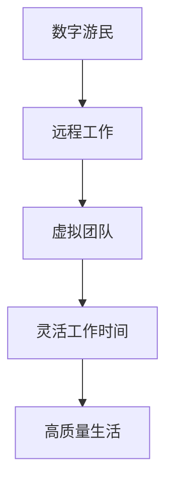

                 

关键词：数字游民、远程工作、程序员、生活方式、自由职业

> 摘要：本文将探讨数字游民生活方式对程序员职业的影响，分析其优势与挑战，并探讨未来发展趋势。通过案例和实践，深入解析数字游民的日常运作和生活方式，为希望尝试这种生活方式的程序员提供指导。

## 1. 背景介绍

### 1.1 数字游民的概念

数字游民（Digital Nomad）指的是利用互联网技术，在全球范围内远程工作的人。他们通过笔记本电脑、智能手机和无线网络，在不同国家、城市或地区开展自己的工作，摆脱了传统办公室的限制。

### 1.2 数字游民的兴起

随着互联网和远程协作工具的普及，越来越多的程序员选择成为数字游民。根据全球远程工作报告，2019年，全球远程工作者已占总劳动力的7%，预计到2025年，这一比例将增加到42%。这一趋势使得数字游民生活方式逐渐成为可能。

### 1.3 程序员与数字游民

程序员因其职业特点，天然适合成为数字游民。编程工作不需要特定的地理位置，只需要一台电脑和网络连接。这使得程序员可以轻松地在全球范围内工作，享受不同文化的魅力，同时也能提高工作效率。

## 2. 核心概念与联系

为了更好地理解数字游民生活方式，我们需要先了解几个核心概念，包括远程工作、虚拟团队、灵活工作时间等。

### 2.1 远程工作

远程工作指的是在工作地点不受限制的情况下完成工作任务。对于程序员来说，远程工作意味着可以在家、咖啡店、图书馆等任何有网络连接的地方工作。

### 2.2 虚拟团队

虚拟团队是由分布在不同地理位置的成员组成的团队，通过互联网进行协作。虚拟团队的优势在于可以充分利用全球人才，减少办公空间和通勤时间，提高工作效率。

### 2.3 灵活工作时间

灵活工作时间允许员工根据个人需求和偏好选择工作时间。对于数字游民来说，灵活工作时间意味着可以根据自己的生活方式和工作习惯来安排工作时间，从而提高工作效率和生活质量。

### 2.4 Mermaid 流程图

以下是一个简单的 Mermaid 流程图，展示了数字游民生活方式的核心概念和联系。



## 3. 核心算法原理 & 具体操作步骤

### 3.1 算法原理概述

数字游民生活方式的核心算法是时间管理和自我驱动。程序员需要学会如何高效利用时间，保持工作与生活的平衡。具体操作步骤如下：

### 3.2 算法步骤详解

#### 3.2.1 制定工作计划

每天早上，制定一份详细的工作计划，列出当天需要完成的任务。这将帮助你更好地组织时间，提高工作效率。

#### 3.2.2 设置工作时间和休息时间

合理安排工作时间，确保每天有足够的休息时间。使用番茄工作法等时间管理技巧，可以提高工作效率。

#### 3.2.3 自我驱动

自我驱动是数字游民成功的关键。你需要具备强烈的自我驱动力，确保自己能够按时完成任务，并持续学习。

#### 3.2.4 保持社交互动

尽管你是在远程工作，但保持与同事和朋友的社交互动仍然非常重要。通过视频会议、社交媒体等工具，保持与他人的联系。

### 3.3 算法优缺点

#### 优点

- **灵活的工作时间**：可以根据个人需求自由安排工作时间，提高生活质量。
- **全球人才流动**：可以与全球各地的人才合作，拓宽视野，提高技能。
- **自我驱动**：培养自我驱动能力，提高工作效率和成就感。

#### 缺点

- **孤独感**：远程工作可能导致孤独感增加，需要学会保持社交互动。
- **时差问题**：跨越多个时区工作可能带来不便，需要合理安排工作时间。

### 3.4 算法应用领域

数字游民生活方式适用于各种编程领域，如软件开发、网站开发、移动应用开发、数据分析等。尤其是在全球化背景下，数字游民生活方式有助于打破地域限制，实现全球合作。

## 4. 数学模型和公式 & 详细讲解 & 举例说明

### 4.1 数学模型构建

数字游民生活方式的数学模型主要涉及时间管理和工作效率。以下是一个简单的时间管理模型：

$$
\text{工作效率} = \frac{\text{完成任务的总量}}{\text{工作时间}}
$$

### 4.2 公式推导过程

工作效率可以通过以下步骤推导：

1. **定义变量**：设\( T \)为工作时间，\( N \)为完成任务的总量。
2. **计算工作效率**：工作效率等于完成任务的总量除以工作时间，即
$$
\text{工作效率} = \frac{N}{T}
$$

### 4.3 案例分析与讲解

假设一位程序员每天工作8小时，一周完成10个任务。根据上述公式，其工作效率为：

$$
\text{工作效率} = \frac{10}{8} = 1.25 \text{任务/小时}
$$

为了提高工作效率，程序员可以尝试以下方法：

1. **优化工作流程**：通过优化工作流程，减少不必要的等待时间。
2. **提高专注力**：通过使用番茄工作法等技巧，提高专注力，减少分心时间。
3. **合理安排休息时间**：确保每天有足够的休息时间，避免过度疲劳。

## 5. 项目实践：代码实例和详细解释说明

### 5.1 开发环境搭建

为了实践数字游民生活方式，程序员需要搭建一个稳定的远程工作环境。以下是一个简单的步骤：

1. **选择合适的编程语言**：根据项目需求选择合适的编程语言，如Python、Java等。
2. **安装开发工具**：安装集成开发环境（IDE），如PyCharm、Eclipse等。
3. **配置远程服务器**：购买一台远程服务器，配置SSH访问权限。

### 5.2 源代码详细实现

以下是一个简单的Python代码实例，用于计算数字游民的工作效率：

```python
def calculate_efficiency(tasks_completed, hours_worked):
    efficiency = tasks_completed / hours_worked
    return efficiency

tasks_completed = 10
hours_worked = 8
efficiency = calculate_efficiency(tasks_completed, hours_worked)
print(f"工作效率：{efficiency} 任务/小时")
```

### 5.3 代码解读与分析

这个简单的Python代码实例实现了计算工作效率的功能。通过输入完成任务的总量和工作时间，可以计算出工作效率。代码简洁明了，便于理解和修改。

### 5.4 运行结果展示

运行上述代码，输出结果如下：

```
工作效率：1.25 任务/小时
```

这个结果显示了程序员的平均工作效率为1.25任务/小时。

## 6. 实际应用场景

数字游民生活方式在多个实际应用场景中表现出色，以下是一些例子：

### 6.1 跨国软件开发

跨国软件开发团队可以利用数字游民生活方式，在全球范围内招聘优秀程序员，实现全球协作。团队成员可以在不同国家工作，通过远程协作工具进行沟通和协作。

### 6.2 自由职业者

自由职业者，如程序员、设计师等，可以利用数字游民生活方式，在全球范围内寻找项目，实现全球就业。这种方式可以让他们更好地利用自己的技能，提高收入。

### 6.3 教育和培训

教育和培训机构可以利用数字游民生活方式，为全球学生提供在线课程和培训。学员可以根据自己的时间安排，灵活选择学习内容，提高学习效率。

## 7. 未来应用展望

数字游民生活方式在未来将继续发展，并面临以下挑战：

### 7.1 技术进步

随着5G、物联网、云计算等技术的发展，数字游民生活方式将更加普及。这些技术将提供更稳定、更快速的互联网连接，为数字游民提供更好的工作环境。

### 7.2 法律法规

各国政府需要制定合理的法律法规，以保护数字游民权益，同时确保税收和社保等方面的合规性。

### 7.3 自我管理

数字游民需要更好地管理自己，保持工作与生活的平衡。这需要他们具备较强的自我驱动能力和时间管理能力。

## 8. 工具和资源推荐

### 8.1 学习资源推荐

- 《数字游民：如何打造自由的生活方式》
- 《远程工作：成功的关键》
- 《程序员自我修养：跨越自我设限的障碍》

### 8.2 开发工具推荐

- Git：版本控制工具
- JIRA：项目管理工具
- Slack：团队协作工具
- Zoom：视频会议工具

### 8.3 相关论文推荐

- "Digital Nomads: A Growing Trend in the Global Workforce"
- "The Impact of Remote Work on Productivity and Well-being"
- "Managing Remote Teams: Challenges and Opportunities"

## 9. 总结：未来发展趋势与挑战

### 9.1 研究成果总结

本文探讨了数字游民生活方式对程序员职业的影响，分析了其优势与挑战，并提出了未来发展趋势。

### 9.2 未来发展趋势

随着技术进步，数字游民生活方式将在全球范围内普及。政府和企业需要制定合理的政策和措施，以适应这一趋势。

### 9.3 面临的挑战

数字游民生活方式面临的主要挑战包括孤独感、时差问题和自我管理。解决这些问题需要数字游民具备较强的自我驱动能力和时间管理能力。

### 9.4 研究展望

未来的研究可以关注数字游民生活方式在不同文化、地区和国家中的实践效果，以及如何更好地支持数字游民的发展。

## 10. 附录：常见问题与解答

### 10.1 如何开始成为数字游民？

**解答**：首先，确保你具备远程工作的技能，如编程、项目管理等。然后，寻找适合远程工作的项目或职位，并准备一台高性能的笔记本电脑和稳定的网络连接。此外，制定一个详细的计划，包括工作目标、时间管理和预算规划。

### 10.2 数字游民如何保持社交互动？

**解答**：利用社交媒体、视频会议和在线社交活动，与同事和朋友保持联系。参加线上的技术会议和活动，扩大社交圈。此外，可以尝试在不同的城市或国家旅行，结识新朋友。

### 10.3 数字游民的生活方式适合所有人吗？

**解答**：数字游民生活方式适合那些喜欢自由、适应能力强和具备自我驱动能力的人。虽然这种生活方式有许多优势，但也需要面对孤独感、时差问题和自我管理等方面的挑战。因此，是否适合成为数字游民，需要根据个人情况来决定。

# 作者署名

作者：禅与计算机程序设计艺术 / Zen and the Art of Computer Programming

本文旨在为数字游民生活方式提供深入分析，帮助程序员更好地适应这一新兴职业形态。希望本文能为广大程序员提供有益的参考和启示。在未来的研究中，我们将继续关注数字游民生活方式的发展趋势和挑战，为这一领域的研究和发展贡献力量。

