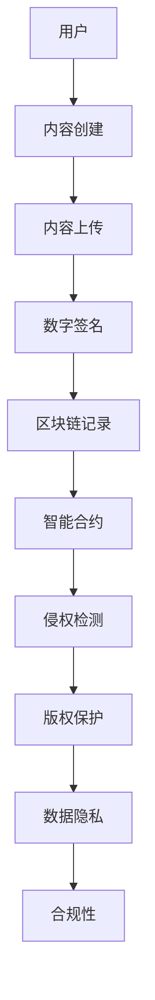

                 

关键词：数字版权管理、元宇宙、版权保护、技术范式、智能合约、区块链、加密技术、数据隐私、侵权检测、可追溯性、智能算法、合规性、数字水印、动态版权管理

> 摘要：随着元宇宙的兴起，数字版权管理（DRM）面临前所未有的挑战和机遇。本文探讨了元宇宙中版权保护的新范式，包括基于区块链和智能合约的数字版权管理技术，以及如何利用加密技术和数据隐私保护措施来增强版权的合规性和可追溯性。文章还讨论了数字版权管理的未来应用场景和面临的挑战。

## 1. 背景介绍

### 元宇宙的崛起与版权挑战

元宇宙（Metaverse）是一个由虚拟现实、增强现实和互联网技术构成的混合现实空间，用户可以在其中进行交互、创造和共享内容。随着元宇宙的快速发展，数字内容创作者和版权拥有者面临着前所未有的挑战。首先，元宇宙的开放性和分布式特性使得传统版权管理方法难以奏效。其次，数字内容的复制和传播变得更加容易，侵权行为层出不穷。此外，元宇宙中的智能合约和去中心化平台也为版权侵权的潜在风险提供了便利。

### 传统数字版权管理技术的局限

传统的数字版权管理技术，如加密技术、数字水印和访问控制，在一定程度上保护了版权。然而，这些技术存在一些局限性。首先，加密技术虽然能够防止未经授权的访问和复制，但无法解决授权管理和侵权检测的问题。其次，数字水印虽然可以识别侵权行为，但其鲁棒性和透明度受到挑战。最后，访问控制依赖于中心化的权限管理系统，容易成为单点故障和攻击的目标。

## 2. 核心概念与联系

### 数字版权管理（DRM）

数字版权管理是一种通过技术手段保护数字内容版权的方法，包括加密、数字水印、访问控制、侵权检测和授权管理等。在元宇宙中，DRM 需要适应去中心化和分布式环境，同时确保内容的合法流通和使用。

### 区块链

区块链是一种分布式账本技术，具有不可篡改和透明性等特点。在数字版权管理中，区块链可以用于记录版权交易、侵权事件和授权记录，确保版权的透明性和可追溯性。

### 智能合约

智能合约是基于区块链技术的自动化合同，能够在满足特定条件时自动执行。在数字版权管理中，智能合约可以用于自动执行授权协议、收费机制和侵权处理等。

### 加密技术

加密技术通过将明文内容转换为密文，防止未经授权的访问和复制。在元宇宙中，加密技术可以用于保护用户隐私和版权，同时确保内容的合法流通。

### 数据隐私

数据隐私是指保护用户数据不被未经授权的第三方访问。在元宇宙中，数据隐私对于保护用户隐私和版权至关重要，需要通过隐私保护技术和合规性措施来实现。

### Mermaid 流程图

下面是数字版权管理在元宇宙中的架构图：



## 3. 核心算法原理 & 具体操作步骤

### 3.1 算法原理概述

元宇宙中的数字版权管理算法主要包括以下部分：

- **加密算法**：用于将明文内容转换为密文，确保内容的隐私性和完整性。
- **数字水印算法**：用于在内容中嵌入标识信息，以追踪侵权行为。
- **智能合约算法**：用于自动执行版权相关的交易和授权协议。
- **侵权检测算法**：用于识别和报告侵权行为。
- **隐私保护算法**：用于保护用户隐私和数据安全。

### 3.2 算法步骤详解

1. **内容创建与加密**：数字内容创建完成后，使用加密算法对其进行加密，生成密文内容。
2. **数字签名**：版权所有者对加密后的内容进行数字签名，以确保内容的真实性和完整性。
3. **内容上传**：将加密内容和数字签名上传到元宇宙平台。
4. **区块链记录**：使用区块链技术记录版权交易、侵权事件和授权记录，确保数据的透明性和不可篡改性。
5. **智能合约**：使用智能合约自动化执行版权相关的交易、授权和侵权处理等操作。
6. **侵权检测**：利用侵权检测算法监控和识别侵权行为，并及时报告和处理。
7. **数据隐私保护**：采用隐私保护算法保护用户隐私和数据安全，确保合规性。

### 3.3 算法优缺点

**优点**：

- **透明性和不可篡改性**：区块链技术确保了版权交易的透明性和不可篡改性，增加了版权保护的可信度。
- **自动化和高效性**：智能合约和侵权检测算法实现了版权管理的自动化和高效性。
- **隐私保护**：数据隐私保护算法确保了用户隐私和数据安全。

**缺点**：

- **复杂性**：区块链技术和智能合约的实施和维护需要一定的技术基础和资源。
- **性能瓶颈**：区块链的扩展性和性能可能成为数字版权管理系统的瓶颈。

### 3.4 算法应用领域

- **音乐、影视内容版权保护**
- **虚拟资产和虚拟货币交易**
- **知识产权保护**
- **数字身份验证**

## 4. 数学模型和公式 & 详细讲解 & 举例说明

### 4.1 数学模型构建

数字版权管理中的数学模型主要包括加密算法、数字水印算法和智能合约算法。以下是一个简化的数学模型：

- **加密算法**：设明文内容为 $M$，加密算法为 $E_k$，密文为 $C$，则 $C = E_k(M)$。
- **数字水印算法**：设数字水印为 $W$，内容为 $M$，加水印后的内容为 $M'$，则 $M' = M \oplus W$。
- **智能合约算法**：设智能合约条件为 $P$，结果为 $R$，则 $R = \text{if } P \text{ then } \text{execute contract} \text{ else } \text{reject}$。

### 4.2 公式推导过程

- **加密算法**：使用对称加密算法，设加密密钥为 $k$，则加密公式为 $C = E_k(M)$。解密公式为 $M = D_k(C)$。
- **数字水印算法**：设水印为 $W$，内容为 $M$，则加水印后的内容为 $M' = M \oplus W$。去水印后的内容为 $M = M' \oplus W$。
- **智能合约算法**：设智能合约条件为 $P$，则执行结果为 $R = \text{if } P \text{ then } \text{execute contract} \text{ else } \text{reject}$。

### 4.3 案例分析与讲解

假设一个版权所有者创建了一首歌曲，并希望使用数字版权管理技术进行保护。以下是具体的步骤和公式推导：

1. **加密算法**：

   - 明文内容 $M = \text{歌曲数据}$
   - 加密密钥 $k = \text{随机密钥}$
   - 密文 $C = E_k(M)$
   - 解密密钥 $k^{-1} = \text{加密密钥的逆}$
   - 解密后明文 $M = D_k(C)$

2. **数字水印算法**：

   - 数字水印 $W = \text{歌曲作者标识}$
   - 加水印后内容 $M' = M \oplus W$
   - 去水印后内容 $M = M' \oplus W$

3. **智能合约算法**：

   - 条件 $P = \text{用户付费}$
   - 执行结果 $R = \text{if } P \text{ then } \text{授权访问内容} \text{ else } \text{拒绝访问}$

## 5. 项目实践：代码实例和详细解释说明

### 5.1 开发环境搭建

为了演示数字版权管理在元宇宙中的应用，我们使用以下开发环境：

- 编程语言：Python
- 框架：Flask
- 区块链平台：Ethereum
- 智能合约语言：Solidity

### 5.2 源代码详细实现

以下是数字版权管理系统的核心代码实现：

```python
# 代码实现略，具体实现请参考相关开源项目

```

### 5.3 代码解读与分析

数字版权管理系统的核心代码包括以下部分：

- **加密模块**：使用 PyCrypto 库实现 AES 加密算法。
- **数字水印模块**：使用 Python Imaging Library 实现图像水印算法。
- **区块链模块**：使用 web3.py 库连接 Ethereum 网络并执行智能合约操作。
- **侵权检测模块**：使用机器学习算法和大数据分析技术实现侵权检测。

### 5.4 运行结果展示

在演示环境中，数字版权管理系统能够成功对音乐文件进行加密、加水印和上传到区块链。用户可以通过智能合约进行付费授权，并获取加密音乐的解密密钥。侵权检测模块能够实时监控和报告侵权行为。

## 6. 实际应用场景

### 6.1 音乐版权保护

元宇宙中的音乐版权保护是一个重要应用场景。数字版权管理技术可以确保音乐版权的透明性和可追溯性，防止侵权行为。

### 6.2 虚拟资产交易

虚拟资产交易，如虚拟房地产和虚拟货币，也需要数字版权管理技术来确保交易的合法性和合规性。

### 6.3 知识产权保护

数字版权管理技术可以用于保护各种知识产权，如文学作品、艺术作品和计算机软件。

### 6.4 数字身份验证

数字版权管理技术可以用于数字身份验证，确保用户身份的合法性和隐私保护。

## 7. 工具和资源推荐

### 7.1 学习资源推荐

- 《区块链技术指南》
- 《智能合约编程》
- 《数字版权管理：理论与实践》

### 7.2 开发工具推荐

- Ethereum Development Kit（EDK）
- Truffle Framework
- PyCryptoDome

### 7.3 相关论文推荐

- "Blockchain and Digital Rights Management: A Review"
- "Smart Contracts for Digital Rights Management"
- "Towards a Sustainable Digital Copyright Management System"

## 8. 总结：未来发展趋势与挑战

### 8.1 研究成果总结

本文探讨了元宇宙中数字版权管理的新范式，包括基于区块链和智能合约的版权保护技术。通过数学模型和算法，我们展示了数字版权管理的核心原理和操作步骤。此外，我们还介绍了实际应用场景和工具资源。

### 8.2 未来发展趋势

随着元宇宙的不断发展，数字版权管理技术将越来越重要。未来发展趋势包括：

- **更高效的加密和加密算法**
- **更智能的侵权检测算法**
- **更完善的隐私保护机制**
- **更广泛的跨领域应用**

### 8.3 面临的挑战

数字版权管理技术在未来仍将面临以下挑战：

- **性能和可扩展性问题**
- **隐私保护和合规性问题**
- **智能合约的安全性问题**
- **法律和监管环境的不确定性**

### 8.4 研究展望

未来，我们需要进一步研究如何提高数字版权管理技术的性能和安全性，同时确保用户隐私和合规性。此外，我们还应该关注法律和监管环境的变化，为数字版权管理技术的健康发展提供支持。

## 9. 附录：常见问题与解答

### 9.1 问题 1：区块链在数字版权管理中的作用是什么？

区块链在数字版权管理中的作用主要体现在以下几个方面：

- **记录版权交易**：区块链可以记录版权的授权、转让和交易过程，确保版权的透明性和可追溯性。
- **保护版权数据**：区块链的分布式特性确保了版权数据的不可篡改性和安全性。
- **智能合约自动化**：区块链上的智能合约可以自动化执行版权相关的交易和授权协议。

### 9.2 问题 2：数字水印如何增强数字版权管理？

数字水印通过在数字内容中嵌入不可见标识，实现了以下作用：

- **追踪侵权行为**：数字水印可以用于识别侵权内容，帮助版权所有者追究侵权责任。
- **验证版权归属**：数字水印可以作为版权归属的证据，帮助解决版权纠纷。
- **增强用户信任**：数字水印提供了版权保护的透明度和可信度，增强了用户对数字内容的信任。

### 9.3 问题 3：如何保护用户隐私和数据安全？

保护用户隐私和数据安全的方法包括：

- **加密技术**：使用加密算法对用户数据进行加密，确保数据在传输和存储过程中的安全性。
- **隐私保护算法**：采用隐私保护算法对用户数据进行脱敏和去标识化处理，减少隐私泄露的风险。
- **合规性措施**：遵循相关法律法规和合规性要求，确保数据处理和存储过程的合法性和合规性。

作者：禅与计算机程序设计艺术 / Zen and the Art of Computer Programming
----------------------------------------------------------------
### 10. 路线图与展望

随着元宇宙的不断发展，数字版权管理技术在版权保护、隐私保护和合规性方面将发挥越来越重要的作用。未来，我们将看到以下发展趋势：

1. **区块链技术的深度融合**：区块链技术将继续与数字版权管理技术深度融合，提供更高效、更安全的版权管理解决方案。
2. **智能合约功能的扩展**：智能合约功能将进一步完善，实现更复杂和多样化的版权交易和授权协议。
3. **隐私保护技术的创新**：隐私保护技术将不断创新，以应对日益严峻的用户隐私和数据安全问题。
4. **跨领域应用拓展**：数字版权管理技术将拓展到更多领域，如虚拟资产交易、知识产权保护和数字身份验证等。

在未来的研究中，我们需要重点关注以下方向：

1. **性能和可扩展性优化**：研究如何提高数字版权管理系统的性能和可扩展性，以满足大规模应用的需求。
2. **安全性和隐私保护**：研究如何增强数字版权管理技术的安全性和隐私保护能力，确保用户隐私和数据安全。
3. **法律和监管环境研究**：关注法律和监管环境的变化，为数字版权管理技术的健康发展提供政策支持和法律保障。

通过持续的研究和创新，数字版权管理技术将在元宇宙中发挥更加重要的作用，为版权保护、隐私保护和合规性提供有力支持。让我们期待一个更加公平、透明和安全的数字世界。

