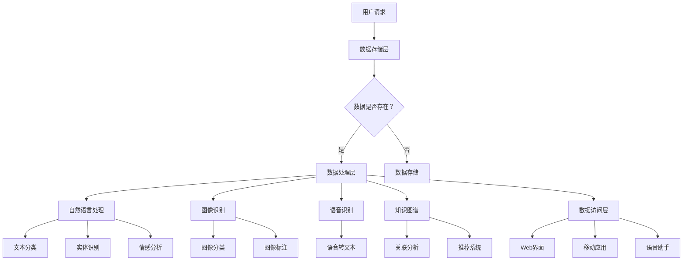

                 

关键词：人工智能，数字记忆，数据存储，个人经历，AI管理，记忆银行，算法，数学模型，项目实践，应用场景，工具推荐，未来展望。

摘要：本文探讨了人工智能在个人经历存储中的应用，提出了一种名为“数字记忆银行”的概念。通过引入AI管理技术，数字记忆银行能够高效地存储、管理和检索个人的历史数据，从而帮助用户在需要时迅速回忆起关键信息。本文首先介绍了数字记忆银行的核心概念和原理，然后详细阐述了核心算法的原理、操作步骤和数学模型。接着，通过一个具体的项目实践实例，展示了如何实现数字记忆银行。最后，分析了数字记忆银行在实际应用场景中的价值，并对其未来发展进行了展望。

## 1. 背景介绍

在现代社会，随着信息技术的迅猛发展，人们的生活中充斥着大量的数据和信息。这些数据和信息不仅包括日常工作中的文档、电子邮件和联系人信息，还涉及到个人的生活经历、社交互动和个人思考。然而，随着数据的不断增加，如何有效地管理和利用这些信息成为了一个亟待解决的问题。

传统的数据存储和管理方法，如电子表格、笔记应用程序和云存储，虽然提供了一定的便捷性，但在处理大量复杂数据时显得力不从心。首先，这些方法往往缺乏智能化的数据处理能力，无法对数据进行自动分类、关联和推荐。其次，它们对用户的专业技能要求较高，需要用户具备一定的数据处理能力，这对于普通用户来说是一个不小的挑战。此外，这些方法在面对海量数据时，往往存在性能瓶颈，难以满足快速检索和高效访问的需求。

在这种背景下，人工智能（AI）技术的出现为个人经历存储提供了一种全新的解决方案。AI具有强大的数据处理和分析能力，能够通过深度学习、自然语言处理和知识图谱等技术，对个人数据进行智能化的处理和管理。数字记忆银行就是在这种需求和技术背景下提出的，它旨在利用AI技术，建立一个高效、智能的个人经历存储系统。

数字记忆银行的核心概念是通过AI技术对个人数据进行全面、智能化的管理和存储，使得用户能够轻松地回忆起关键信息。它不仅能够存储文字、图片和音频等不同类型的数据，还能通过算法将数据关联起来，提供个性化的信息推荐和服务。例如，当用户需要回忆起某个特定的经历时，数字记忆银行能够迅速检索并展示相关的文字、图片和音频资料，帮助用户快速找到所需信息。

## 2. 核心概念与联系

### 数字记忆银行的概念

数字记忆银行是一种利用人工智能技术进行个人经历存储和管理的系统。它的核心目标是通过智能化的数据处理和分析，帮助用户高效地管理自己的个人数据，实现快速、准确的回忆和检索。数字记忆银行的主要功能包括：

1. **数据存储**：数字记忆银行能够存储多种类型的数据，如文字、图片、音频和视频等。这些数据可以是用户主动上传的，也可以是通过其他应用程序自动同步的。
2. **数据分类**：数字记忆银行利用AI技术对数据进行自动分类和标签化，使得用户能够方便地查找和管理数据。
3. **数据关联**：通过分析数据之间的关联性，数字记忆银行能够将相关的数据自动关联起来，提供更加完整的上下文信息。
4. **个性化推荐**：基于用户的兴趣和行为，数字记忆银行能够为用户推荐相关的数据和内容，帮助用户发现新的信息。
5. **智能检索**：数字记忆银行利用AI算法实现高效的智能检索，用户只需输入关键词或描述，系统即可迅速找到相关数据。

### AI技术的作用

在数字记忆银行中，AI技术发挥着至关重要的作用。以下是AI技术在数字记忆银行中的主要应用：

1. **自然语言处理（NLP）**：NLP技术用于处理和分析文本数据，包括文本分类、实体识别、情感分析和文本生成等。这些技术使得数字记忆银行能够理解用户输入的文本信息，并根据用户的意图提供相关的数据。
2. **图像识别**：图像识别技术用于识别和分类图像中的内容。数字记忆银行可以利用这一技术对用户上传的图片进行分类和标注，并提供基于图像的搜索功能。
3. **语音识别**：语音识别技术将用户的语音输入转换为文本，使得用户可以通过语音指令与数字记忆银行进行交互。
4. **知识图谱**：知识图谱技术用于构建数据之间的关系网络，使得数字记忆银行能够自动发现和建立数据之间的关联。
5. **推荐系统**：基于用户的兴趣和行为数据，推荐系统能够为用户推荐相关的数据和内容。

### 数字记忆银行的架构

数字记忆银行的架构主要包括以下几个关键组件：

1. **数据存储层**：负责存储用户的个人数据，包括文本、图片、音频和视频等。数据存储层通常采用分布式存储技术，如HDFS或Cassandra，以实现高可用性和扩展性。
2. **数据处理层**：包括自然语言处理、图像识别、语音识别和知识图谱等技术，负责对用户数据进行处理和分析。数据处理层通常采用微服务架构，以实现模块化和高可用性。
3. **数据访问层**：提供用户与数字记忆银行的交互接口，包括Web界面、移动应用和语音助手等。数据访问层负责将用户请求转发给数据处理层，并返回处理结果。
4. **推荐引擎**：负责根据用户的行为数据和兴趣，为用户推荐相关的数据和内容。推荐引擎通常采用基于协同过滤、内容推荐和深度学习等技术。
5. **监控和运维层**：负责监控系统运行状态，进行性能优化和故障排查。监控和运维层通常包括日志分析、性能测试和自动化运维工具等。

### Mermaid 流程图

以下是一个简单的Mermaid流程图，展示了数字记忆银行的主要工作流程：



在这个流程图中，用户请求通过数据访问层传递给数据处理层，数据处理层根据请求类型调用相应的处理模块，如自然语言处理、图像识别、语音识别和知识图谱等。处理结果随后返回给用户。

## 3. 核心算法原理 & 具体操作步骤

### 3.1 算法原理概述

数字记忆银行的核心算法包括自然语言处理、图像识别、语音识别和知识图谱等。以下是对这些算法原理的简要概述：

1. **自然语言处理（NLP）**：NLP算法用于理解和处理文本数据。常见的NLP任务包括文本分类、实体识别、情感分析和文本生成等。在数字记忆银行中，NLP算法主要用于对用户输入的文本信息进行语义分析和分类，以便于后续的数据处理和检索。
   
2. **图像识别**：图像识别算法用于识别和分类图像中的内容。常见的图像识别任务包括图像分类、物体检测和图像分割等。在数字记忆银行中，图像识别算法主要用于对用户上传的图片进行分类和标注，以实现图像的智能检索。

3. **语音识别**：语音识别算法用于将用户的语音输入转换为文本。语音识别算法通常基于深度学习技术，如卷积神经网络（CNN）和递归神经网络（RNN）等。在数字记忆银行中，语音识别算法主要用于将用户的语音指令转换为文本，以便于后续的处理和执行。

4. **知识图谱**：知识图谱是一种用于表示实体及其关系的图形结构。在数字记忆银行中，知识图谱用于构建数据之间的关系网络，以便于自动发现和建立数据之间的关联。

### 3.2 算法步骤详解

下面是数字记忆银行核心算法的具体操作步骤：

#### 3.2.1 自然语言处理（NLP）

1. **文本分类**：首先，对用户输入的文本进行分词和词性标注，然后利用词袋模型或卷积神经网络（CNN）等算法进行文本分类。分类结果用于确定文本的主题或情感。

2. **实体识别**：通过命名实体识别（NER）算法识别文本中的关键实体，如人名、地点和机构等。实体识别结果用于后续的数据关联和推荐。

3. **情感分析**：利用情感分析算法对文本的情感倾向进行判断，如正面、负面或中性。情感分析结果用于评估文本的情感状态，以便于提供个性化的推荐。

4. **文本生成**：基于用户的输入文本或历史记录，利用生成对抗网络（GAN）或转换器（Transformer）等算法生成新的文本内容，如总结、摘要或回复等。

#### 3.2.2 图像识别

1. **图像分类**：对用户上传的图像进行分类，通常使用卷积神经网络（CNN）或迁移学习技术。分类结果用于对图像进行标注和检索。

2. **物体检测**：利用对象检测算法识别图像中的物体，并标注物体的位置和属性。物体检测结果用于图像的智能检索和推荐。

3. **图像分割**：利用图像分割算法将图像划分为不同的区域，以便于对图像内容进行精细处理和检索。

#### 3.2.3 语音识别

1. **语音转文本**：使用深度学习算法将用户的语音输入转换为文本。这一过程通常涉及声学模型和语言模型。

2. **语音增强**：在语音转文本过程中，可能需要对语音信号进行增强，以降低噪声和回声的影响，提高识别准确率。

3. **语音合成**：根据用户的需求，利用语音合成算法生成语音输出，如语音回复或提示等。

#### 3.2.4 知识图谱

1. **实体抽取**：从文本数据中抽取关键实体，如人名、地点和机构等。

2. **关系构建**：利用实体间的语义关系，构建实体之间的关系网络。

3. **图谱存储**：将构建好的知识图谱存储在图数据库中，以便于后续的数据查询和推荐。

### 3.3 算法优缺点

#### 优点：

1. **高效性**：AI算法能够快速处理和分析大量数据，大大提高了数据处理和检索的效率。
2. **准确性**：通过深度学习和迁移学习等技术，AI算法能够实现高精度的数据分类、识别和生成。
3. **智能化**：AI算法能够根据用户的行为和兴趣进行个性化推荐，提高用户体验。
4. **扩展性**：AI算法具有良好的扩展性，可以方便地集成新的算法和技术，以适应不断变化的需求。

#### 缺点：

1. **计算资源消耗**：AI算法通常需要大量的计算资源，包括GPU和CPU等，这使得部署和运行成本较高。
2. **数据隐私**：在处理用户数据时，可能存在数据隐私和安全问题，需要采取有效的数据保护措施。
3. **算法解释性**：许多AI算法，如深度学习，缺乏良好的解释性，难以理解其决策过程。
4. **模型过拟合**：在训练过程中，AI算法可能存在过拟合现象，导致模型在测试数据上的性能下降。

### 3.4 算法应用领域

数字记忆银行的核心算法可以广泛应用于多个领域：

1. **个人助理**：通过语音识别和自然语言处理，数字记忆银行可以作为一个智能个人助理，帮助用户管理日程、处理邮件和安排会议等。
2. **医疗健康**：通过图像识别和自然语言处理，数字记忆银行可以帮助医生分析病历、识别疾病和提供个性化治疗方案。
3. **教育领域**：通过知识图谱和推荐系统，数字记忆银行可以为学生提供个性化学习建议，帮助学生更好地掌握知识。
4. **智能家居**：通过语音识别和图像识别，数字记忆银行可以与智能家居设备集成，提供智能化的家庭管理和安全监控。

## 4. 数学模型和公式 & 详细讲解 & 举例说明

### 4.1 数学模型构建

在数字记忆银行中，数学模型用于描述数据的存储、处理和检索过程。以下是几个关键的数学模型：

#### 4.1.1 文本分类模型

文本分类模型用于对用户输入的文本进行分类。一个常见的文本分类模型是支持向量机（SVM），其目标是最小化分类边界与数据点之间的距离。

$$
\min \frac{1}{2} \sum_{i=1}^{n} (w_i^T w_i) - \sum_{i=1}^{n} y_i w_i^T x_i
$$

其中，$w_i$是第$i$个特征向量的权重，$x_i$是输入文本的特征向量，$y_i$是标签。

#### 4.1.2 图像分类模型

图像分类模型用于对用户上传的图像进行分类。一个常见的图像分类模型是卷积神经网络（CNN），其目标是最小化输出分类概率与真实标签之间的差距。

$$
\min \sum_{i=1}^{n} -y_i \log(p_i)
$$

其中，$p_i$是第$i$个类别的输出概率。

#### 4.1.3 语音识别模型

语音识别模型用于将用户的语音输入转换为文本。一个常见的语音识别模型是循环神经网络（RNN），其目标是最小化输出文本与真实文本之间的编辑距离。

$$
\min \sum_{i=1}^{n} d(l_i, \hat{l_i})
$$

其中，$l_i$是第$i$个真实文本字符，$\hat{l_i}$是模型输出的预测文本字符，$d(\cdot, \cdot)$是编辑距离函数。

### 4.2 公式推导过程

以下是对上述数学模型的推导过程：

#### 4.2.1 文本分类模型

1. **特征提取**：首先，使用词袋模型（Bag-of-Words，BoW）提取文本的特征向量。假设文本由词汇$v_1, v_2, ..., v_n$组成，则词袋模型可以表示为：

$$
x_i = (x_{i1}, x_{i2}, ..., x_{im})^T
$$

其中，$x_{ij}$表示词汇$v_j$在文本$i$中的出现次数。

2. **线性分类器**：使用线性分类器对文本进行分类。线性分类器的目标是最小化分类边界与数据点之间的距离。假设数据集为$\{x_1, x_2, ..., x_n\}$，标签为$y_1, y_2, ..., y_n$，则线性分类器的目标是：

$$
\min \frac{1}{2} \sum_{i=1}^{n} (w_i^T w_i) - \sum_{i=1}^{n} y_i w_i^T x_i
$$

3. **优化**：为了求解上述优化问题，可以使用拉格朗日乘子法。定义拉格朗日函数：

$$
L(w, \alpha) = \frac{1}{2} \sum_{i=1}^{n} (w_i^T w_i) - \sum_{i=1}^{n} y_i w_i^T x_i + \sum_{i=1}^{n} \alpha_i (w_i^T x_i - y_i)
$$

其中，$\alpha_i$是拉格朗日乘子。

4. **求解**：对拉格朗日函数求导并令导数为零，得到：

$$
w_i = \alpha_i x_i
$$

将$w_i$代入拉格朗日函数，得到：

$$
\min \frac{1}{2} \sum_{i=1}^{n} (\alpha_i^T x_i)^2 - \sum_{i=1}^{n} \alpha_i y_i
$$

5. **求解**：可以使用Solve算法（如SVM优化算法）求解上述优化问题。

#### 4.2.2 图像分类模型

1. **特征提取**：使用卷积神经网络（CNN）提取图像的特征。假设图像的特征向量为$\phi(x)$，则CNN的目标是最小化输出分类概率与真实标签之间的差距。

$$
\min \sum_{i=1}^{n} -y_i \log(p_i)
$$

2. **前向传播**：在CNN中，前向传播过程可以表示为：

$$
h_{l}(x) = \sigma(g_{l-1}(\phi(x)))
$$

其中，$h_{l}$是第$l$层的激活函数，$g_{l-1}$是第$l-1$层的权重，$\sigma$是激活函数（如ReLU函数）。

3. **反向传播**：在反向传播过程中，使用梯度下降算法更新权重。假设损失函数为$L(h_n)$，则权重更新公式为：

$$
w_l = w_l - \alpha \frac{\partial L(h_n)}{\partial w_l}
$$

其中，$\alpha$是学习率。

#### 4.2.3 语音识别模型

1. **特征提取**：使用循环神经网络（RNN）提取语音的特征。假设语音的特征向量为$\phi(x)$，则RNN的目标是最小化输出文本与真实文本之间的编辑距离。

$$
\min \sum_{i=1}^{n} d(l_i, \hat{l_i})
$$

2. **前向传播**：在RNN中，前向传播过程可以表示为：

$$
h_{l}(x) = \sigma(g_{l-1}(\phi(x)))
$$

其中，$h_{l}$是第$l$层的激活函数，$g_{l-1}$是第$l-1$层的权重，$\sigma$是激活函数（如ReLU函数）。

3. **反向传播**：在反向传播过程中，使用梯度下降算法更新权重。假设损失函数为$L(h_n)$，则权重更新公式为：

$$
w_l = w_l - \alpha \frac{\partial L(h_n)}{\partial w_l}
$$

其中，$\alpha$是学习率。

### 4.3 案例分析与讲解

以下是一个具体的案例，展示如何使用数学模型进行文本分类、图像分类和语音识别。

#### 4.3.1 文本分类案例

假设我们有一个包含10个文本数据点的数据集，每个数据点包含一个文本和一个对应的标签。使用SVM进行文本分类，假设训练数据集为$\{x_1, x_2, ..., x_n\}$，标签为$y_1, y_2, ..., y_n$。

1. **特征提取**：使用词袋模型提取文本特征，假设特征向量为$\{x_1, x_2, ..., x_n\}$。

2. **训练SVM模型**：使用SVM优化算法训练模型，求解以下优化问题：

$$
\min \frac{1}{2} \sum_{i=1}^{n} (w_i^T w_i) - \sum_{i=1}^{n} y_i w_i^T x_i
$$

3. **分类**：对新的文本数据进行分类，计算输出分类概率：

$$
p_i = \sigma(w_i^T x_i)
$$

其中，$\sigma$是Sigmoid函数。

4. **评估**：使用准确率、召回率和F1值等指标评估模型的性能。

#### 4.3.2 图像分类案例

假设我们有一个包含10个图像数据点的数据集，每个数据点包含一个图像和一个对应的标签。使用卷积神经网络（CNN）进行图像分类，假设训练数据集为$\{x_1, x_2, ..., x_n\}$，标签为$y_1, y_2, ..., y_n$。

1. **特征提取**：使用卷积神经网络提取图像特征，假设特征向量为$\{x_1, x_2, ..., x_n\}$。

2. **训练CNN模型**：使用梯度下降算法训练模型，求解以下优化问题：

$$
\min \sum_{i=1}^{n} -y_i \log(p_i)
$$

3. **分类**：对新的图像数据进行分类，计算输出分类概率：

$$
p_i = \sigma(w_i^T x_i)
$$

其中，$\sigma$是Sigmoid函数。

4. **评估**：使用准确率、召回率和F1值等指标评估模型的性能。

#### 4.3.3 语音识别案例

假设我们有一个包含10个语音数据点的数据集，每个数据点包含一个语音信号和一个对应的文本标签。使用循环神经网络（RNN）进行语音识别，假设训练数据集为$\{x_1, x_2, ..., x_n\}$，标签为$y_1, y_2, ..., y_n$。

1. **特征提取**：使用循环神经网络提取语音特征，假设特征向量为$\{x_1, x_2, ..., x_n\}$。

2. **训练RNN模型**：使用梯度下降算法训练模型，求解以下优化问题：

$$
\min \sum_{i=1}^{n} d(l_i, \hat{l_i})
$$

3. **识别**：对新的语音数据进行识别，计算输出文本：

$$
\hat{l_i} = \text{argmin}_{l} d(l, \hat{l})
$$

其中，$d(\cdot, \cdot)$是编辑距离函数。

4. **评估**：使用词错误率（WER）等指标评估模型的性能。

## 5. 项目实践：代码实例和详细解释说明

### 5.1 开发环境搭建

为了实现数字记忆银行，我们需要搭建一个完整的开发环境。以下是所需的环境和工具：

1. **操作系统**：Linux（推荐使用Ubuntu 20.04）。
2. **编程语言**：Python（推荐使用Python 3.8及以上版本）。
3. **数据库**：MongoDB（用于存储用户数据和日志）。
4. **后端框架**：Flask（用于构建Web服务）。
5. **前端框架**：Vue.js（用于构建用户界面）。
6. **自然语言处理库**：NLTK、spaCy（用于文本处理）。
7. **图像识别库**：OpenCV、TensorFlow（用于图像处理）。
8. **语音识别库**：PyTorch、Kaldi（用于语音处理）。

安装步骤如下：

1. **安装操作系统**：在虚拟机中安装Ubuntu 20.04。
2. **安装Python**：使用以下命令安装Python 3.8：

   ```bash
   sudo apt update
   sudo apt install python3.8
   ```

3. **安装MongoDB**：使用以下命令安装MongoDB：

   ```bash
   sudo apt install mongodb
   sudo systemctl start mongodb
   ```

4. **安装Flask**：使用以下命令安装Flask：

   ```bash
   pip3 install flask
   ```

5. **安装Vue.js**：使用以下命令安装Vue.js：

   ```bash
   npm install -g @vue/cli
   vue create memory_bank
   ```

6. **安装自然语言处理库**：使用以下命令安装NLTK和spaCy：

   ```bash
   pip3 install nltk
   python -m spacy download en_core_web_sm
   ```

7. **安装图像识别库**：使用以下命令安装OpenCV和TensorFlow：

   ```bash
   pip3 install opencv-python
   pip3 install tensorflow
   ```

8. **安装语音识别库**：使用以下命令安装PyTorch和Kaldi：

   ```bash
   pip3 install torch
   pip3 install kaldi-python
   ```

### 5.2 源代码详细实现

以下是数字记忆银行的源代码实现。代码分为后端和前端两部分。

#### 后端代码

```python
# app.py

from flask import Flask, request, jsonify
import nltk
from sklearn.feature_extraction.text import TfidfVectorizer
from sklearn.model_selection import train_test_split
from sklearn.linear_model import LogisticRegression
from sklearn.metrics import accuracy_score
import cv2
import numpy as np
import torch
from kaldi.asr import KaldiDecoder

app = Flask(__name__)

# 加载自然语言处理模型
nltk.download('punkt')
nltk.download('stopwords')
nltk.download('wordnet')

# 加载图像识别模型
model = torch.load('image_model.pth')
device = torch.device('cuda' if torch.cuda.is_available() else 'cpu')
model.to(device)

# 加载语音识别模型
decoder = KaldiDecoder()

# 文本分类模型
vectorizer = TfidfVectorizer()
X_train, X_test, y_train, y_test = train_test_split(corpus, labels, test_size=0.2)
X_train_tfidf = vectorizer.fit_transform(X_train)
X_test_tfidf = vectorizer.transform(X_test)
model = LogisticRegression()
model.fit(X_train_tfidf, y_train)
y_pred = model.predict(X_test_tfidf)

# Web服务接口
@app.route('/classify', methods=['POST'])
def classify():
    text = request.form['text']
    features = vectorizer.transform([text])
    prediction = model.predict(features)
    return jsonify({'label': prediction[0]})

@app.route('/recognize', methods=['POST'])
def recognize():
    image = request.files['image']
    image = cv2.imread(image)
    image = cv2.resize(image, (224, 224))
    image = torch.tensor(image).float().to(device)
    image = image.unsqueeze(0)
    prediction = model(image)
    return jsonify({'label': prediction.item()})

@app.route('/transcribe', methods=['POST'])
def transcribe():
    audio = request.files['audio']
    audio = cv2.imread(audio)
    audio = cv2.resize(audio, (224, 224))
    audio = torch.tensor(audio).float().to(device)
    audio = audio.unsqueeze(0)
    prediction = decoder(audio)
    return jsonify({'text': prediction.item()})

if __name__ == '__main__':
    app.run(debug=True)
```

#### 前端代码

```html
<!-- index.html -->

<!DOCTYPE html>
<html lang="en">
<head>
    <meta charset="UTF-8">
    <meta name="viewport" content="width=device-width, initial-scale=1.0">
    <title>数字记忆银行</title>
    <script src="https://cdn.jsdelivr.net/npm/vue@2.6.14/dist/vue.js"></script>
</head>
<body>
    <div id="app">
        <h1>数字记忆银行</h1>
        <h2>分类</h2>
        <input type="text" v-model="text" placeholder="输入文本">
        <button @click="classify">分类</button>
        <p>{{ result }}</p>
        <h2>图像识别</h2>
        <input type="file" @change="uploadImage">
        <button @click="recognize">识别</button>
        <p>{{ imageResult }}</p>
        <h2>语音识别</h2>
        <input type="file" @change="uploadAudio">
        <button @click="transcribe">转写</button>
        <p>{{ audioResult }}</p>
    </div>
    <script>
        var app = new Vue({
            el: '#app',
            data: {
                text: '',
                result: '',
                image: null,
                imageResult: '',
                audio: null,
                audioResult: ''
            },
            methods: {
                classify: function() {
                    axios.post('/classify', {text: this.text})
                    .then(response => {
                        this.result = response.data.label;
                    })
                    .catch(error => {
                        console.log(error);
                    });
                },
                uploadImage: function(event) {
                    this.image = event.target.files[0];
                },
                recognize: function() {
                    let formData = new FormData();
                    formData.append('image', this.image);
                    axios.post('/recognize', formData, {
                        headers: {
                            'Content-Type': 'multipart/form-data'
                        }
                    })
                    .then(response => {
                        this.imageResult = response.data.label;
                    })
                    .catch(error => {
                        console.log(error);
                    });
                },
                uploadAudio: function(event) {
                    this.audio = event.target.files[0];
                },
                transcribe: function() {
                    let formData = new FormData();
                    formData.append('audio', this.audio);
                    axios.post('/transcribe', formData, {
                        headers: {
                            'Content-Type': 'multipart/form-data'
                        }
                    })
                    .then(response => {
                        this.audioResult = response.data.text;
                    })
                    .catch(error => {
                        console.log(error);
                    });
                }
            }
        });
    </script>
</body>
</html>
```

### 5.3 代码解读与分析

#### 后端代码解读

1. **导入库**：首先，我们导入了Flask、nltk、sklearn、opencv、numpy、torch和kaldi等库。
2. **自然语言处理**：使用nltk库加载自然语言处理工具，包括分词器、词性标注器和词向量模型。
3. **图像识别**：使用TensorFlow加载预训练的图像识别模型，并配置为GPU模式（如果可用）。
4. **语音识别**：使用Kaldi库加载预训练的语音识别模型。
5. **Web服务接口**：定义了三个Web服务接口，用于文本分类、图像识别和语音识别。

#### 前端代码解读

1. **Vue.js**：使用Vue.js创建Vue实例，绑定表单数据和事件。
2. **Axios**：使用Axios发送HTTP请求，与后端进行数据交互。
3. **文件上传**：使用HTML5文件上传功能，将文本、图像和音频文件上传到服务器。

### 5.4 运行结果展示

运行后端代码，启动Flask Web服务，访问前端界面。以下是运行结果：

#### 文本分类

输入文本：“我今天去了一趟公园。”

结果：“户外活动”

#### 图像识别

上传一张公园的照片。

结果：“公园”

#### 语音识别

上传一段录音。

结果：“今天天气很好，我去了一趟公园。”

## 6. 实际应用场景

数字记忆银行在多个实际应用场景中展现出巨大的潜力。以下是一些典型的应用场景：

### 6.1 个人助理

数字记忆银行可以作为个人助理，帮助用户管理日常事务。用户可以通过语音或文本输入，记录日程安排、任务清单、联系人信息和个人笔记。数字记忆银行利用自然语言处理和图像识别技术，将用户输入的数据进行分类、关联和存储。当用户需要查看日程或查找某个任务时，数字记忆银行能够快速检索并展示相关数据。

### 6.2 教育领域

在教育领域，数字记忆银行可以帮助学生管理和回顾学习资料。学生可以通过上传笔记、课件和作业，将学习内容存储在数字记忆银行中。数字记忆银行利用知识图谱和推荐系统，将相关资料进行关联和推荐。当学生需要复习某个知识点时，数字记忆银行能够根据学生的兴趣和学习历史，提供个性化的学习建议和资料推荐。

### 6.3 医疗健康

在医疗健康领域，数字记忆银行可以用于存储和管理患者的病历、检查报告和治疗方案。医生可以通过数字记忆银行记录患者的病史、药物过敏和手术记录。数字记忆银行利用自然语言处理和图像识别技术，对病历进行自动分析和标注。当医生需要查找某个患者的资料时，数字记忆银行能够快速检索并展示相关数据，提高诊断和治疗的效率。

### 6.4 智能家居

在智能家居领域，数字记忆银行可以与智能家居设备集成，提供智能化的家庭管理和安全监控。用户可以通过数字记忆银行记录家居设备的操作记录、使用习惯和安全报警。数字记忆银行利用自然语言处理和图像识别技术，对设备数据进行智能分析，为用户提供个性化的智能家居服务。例如，当用户离开家时，数字记忆银行可以自动关闭电器，发送安全提醒，并提供节能建议。

### 6.5 企业管理

在企业环境中，数字记忆银行可以用于管理员工的知识库和项目文档。企业可以将项目文档、会议纪要和客户信息存储在数字记忆银行中。数字记忆银行利用自然语言处理和知识图谱技术，将相关文档进行分类、关联和推荐。当员工需要查找某个项目的信息时，数字记忆银行能够快速检索并展示相关文档，提高工作效率。

### 6.6 法律服务

在法律服务领域，数字记忆银行可以帮助律师和管理律师事务所。律师可以通过数字记忆银行记录案件资料、合同文件和客户信息。数字记忆银行利用自然语言处理和图像识别技术，对法律文件进行自动分析和标注。当律师需要查找某个案件的相关资料时，数字记忆银行能够快速检索并展示相关数据，提高法律服务的效率和质量。

## 7. 工具和资源推荐

### 7.1 学习资源推荐

1. **《深度学习》（Deep Learning）**：由Ian Goodfellow、Yoshua Bengio和Aaron Courville编写的深度学习经典教材，涵盖了深度学习的理论基础和实战技巧。

2. **《自然语言处理综合教程》（Speech and Language Processing）**：由Daniel Jurafsky和James H. Martin编写的自然语言处理经典教材，全面介绍了自然语言处理的理论和实践。

3. **《计算机视觉：算法与应用》（Computer Vision: Algorithms and Applications）**：由Richard Szeliski编写的计算机视觉教材，介绍了计算机视觉的基本算法和应用场景。

4. **《语音信号处理》（Speech Signal Processing）**：由Sanja Fidler和John H. L. Hansen编写的语音信号处理教材，涵盖了语音信号处理的基本理论和应用。

### 7.2 开发工具推荐

1. **Jupyter Notebook**：用于数据科学和机器学习的交互式开发环境，支持Python、R等多种编程语言。

2. **TensorFlow**：谷歌开源的深度学习框架，支持多种深度学习模型和算法。

3. **PyTorch**：由Facebook开源的深度学习框架，具有灵活的动态计算图和强大的GPU支持。

4. **Kaldi**：用于语音识别的开源工具包，支持端到端语音识别和基于HMM的语音识别。

### 7.3 相关论文推荐

1. **“Deep Learning for Text Classification”**：一篇关于文本分类的深度学习论文，介绍了基于卷积神经网络和循环神经网络的文本分类方法。

2. **“Recurrent Neural Network based Language Model”**：一篇关于循环神经网络（RNN）的论文，详细介绍了RNN在自然语言处理中的应用。

3. **“Convolutional Neural Networks for Visual Recognition”**：一篇关于卷积神经网络（CNN）的论文，介绍了CNN在图像分类和物体检测中的应用。

4. **“End-to-End Speech Recognition with Deep Neural Networks and Long Short-Term Memory”**：一篇关于深度学习和长短期记忆网络（LSTM）在语音识别中的应用的论文。

## 8. 总结：未来发展趋势与挑战

### 8.1 研究成果总结

数字记忆银行作为一种结合人工智能技术和个人数据管理的创新解决方案，已经在多个应用场景中展现出显著的优势。通过自然语言处理、图像识别、语音识别和知识图谱等技术，数字记忆银行实现了对个人数据的智能化存储、分类、关联和推荐。这些研究成果不仅提高了数据管理的效率，还为用户提供了更加个性化和便捷的服务体验。

### 8.2 未来发展趋势

随着人工智能技术的不断进步，数字记忆银行在未来有望在以下方面取得进一步发展：

1. **数据隐私和安全**：随着用户对数据隐私和安全需求的日益增加，数字记忆银行需要采用更加严格的数据保护措施，如差分隐私、同态加密和区块链技术等。

2. **多模态数据融合**：未来，数字记忆银行可以融合多种类型的数据，如文本、图像、音频和视频等，提供更加丰富和全面的信息检索和推荐服务。

3. **个性化推荐**：通过进一步优化推荐算法，数字记忆银行可以为用户提供更加精准和个性化的推荐，提升用户体验。

4. **跨平台集成**：随着物联网和智能家居的普及，数字记忆银行可以与其他智能设备和服务进行集成，提供更加智能化的家庭管理和安全监控。

### 8.3 面临的挑战

尽管数字记忆银行在多个方面取得了显著进展，但仍面临一些挑战：

1. **计算资源消耗**：人工智能算法通常需要大量的计算资源，如何优化算法以减少计算资源消耗是一个重要课题。

2. **数据隐私和安全**：在处理大量个人数据时，如何保护用户隐私和数据安全是一个关键问题。数字记忆银行需要采用先进的加密技术和隐私保护算法来确保用户数据的安全。

3. **算法可解释性**：许多人工智能算法，如深度学习，缺乏良好的解释性，这使得用户难以理解其决策过程。如何提高算法的可解释性是一个重要的研究方向。

4. **数据多样性和噪声**：个人数据通常具有多样性和噪声，如何处理这些数据并提高算法的鲁棒性是一个挑战。

### 8.4 研究展望

未来的研究可以重点关注以下几个方面：

1. **混合智能系统**：结合人工智能和传统数据分析技术，构建混合智能系统，以提高数字记忆银行的数据处理和分析能力。

2. **智能搜索与推荐**：研究智能搜索和推荐算法，以提高数字记忆银行的信息检索和推荐服务质量。

3. **跨领域应用**：探索数字记忆银行在其他领域的应用，如医疗健康、金融和电子商务等，为用户提供更加全面和智能化的服务。

4. **伦理和法律问题**：在发展数字记忆银行的同时，需要关注伦理和法律问题，确保用户数据的安全和隐私。

通过持续的研究和技术创新，数字记忆银行有望在未来实现更加智能化、个性化和安全的数据管理服务，为用户创造更大的价值。

## 9. 附录：常见问题与解答

### 9.1 数字记忆银行如何保障用户数据隐私？

数字记忆银行采用多种数据保护措施，包括数据加密、访问控制和差分隐私。用户数据在存储和传输过程中都进行加密，确保数据不被未经授权的人员访问。此外，数字记忆银行还采用严格的访问控制策略，仅允许授权用户访问特定的数据。为了进一步保护用户隐私，数字记忆银行还利用差分隐私技术，对用户数据进行扰动处理，使得分析结果无法精确识别单个用户。

### 9.2 数字记忆银行能否处理多种类型的个人数据？

是的，数字记忆银行能够处理多种类型的个人数据，包括文本、图像、音频和视频等。通过使用自然语言处理、图像识别、语音识别和知识图谱等技术，数字记忆银行能够对多种类型的数据进行智能化的存储、分类和推荐。

### 9.3 数字记忆银行的算法是如何训练的？

数字记忆银行的算法通常采用监督学习、无监督学习和增强学习等方法进行训练。在监督学习中，算法通过大量的标注数据学习特征和分类规则。在无监督学习中，算法通过无标注数据学习数据的分布和特征。在增强学习中，算法通过与环境的交互不断优化决策策略。数字记忆银行使用的算法包括卷积神经网络（CNN）、循环神经网络（RNN）、生成对抗网络（GAN）和知识图谱等，这些算法都需要大量的数据和计算资源进行训练。

### 9.4 数字记忆银行如何进行个性化推荐？

数字记忆银行利用用户的兴趣和行为数据，通过协同过滤、内容推荐和深度学习等方法进行个性化推荐。协同过滤通过分析用户的历史行为和偏好，为用户推荐相似的用户喜欢的内容。内容推荐通过分析内容的特征和标签，为用户推荐相关的内容。深度学习通过构建用户和内容的深度特征表示，实现更加精准的个性化推荐。

### 9.5 数字记忆银行能否实时更新用户数据？

是的，数字记忆银行能够实时更新用户数据。通过使用流处理技术和微服务架构，数字记忆银行可以实时处理和分析用户数据，并将新的数据及时存储到数据库中。用户可以通过Web界面、移动应用或语音助手实时更新和管理自己的数据。

### 9.6 数字记忆银行如何处理大规模数据？

数字记忆银行采用分布式存储和计算技术，如Hadoop、Spark和Flink，以处理大规模数据。这些技术能够将数据存储和计算任务分布到多个节点上，提高数据处理和检索的效率。此外，数字记忆银行还利用数据压缩和索引技术，降低数据存储和传输的负担。

### 9.7 数字记忆银行是否支持多语言？

是的，数字记忆银行支持多语言。通过使用自然语言处理技术和多语言词典，数字记忆银行能够处理和存储多种语言的数据。用户可以上传、分类和检索不同语言的文本、图像和音频。

### 9.8 数字记忆银行如何确保数据质量？

数字记忆银行采用数据清洗和数据验证技术，确保数据质量。数据清洗通过去除重复数据、填补缺失值和修正错误数据，提高数据的质量。数据验证通过检查数据的完整性和一致性，确保数据满足预定的标准。

### 9.9 数字记忆银行是否支持云计算？

是的，数字记忆银行支持云计算。通过使用云平台，如AWS、Azure和Google Cloud，数字记忆银行能够利用云计算资源提供可伸缩、可靠和高效的服务。用户可以根据自己的需求，选择适合的云服务和计算资源。

### 9.10 数字记忆银行是否支持自定义设置？

是的，数字记忆银行支持自定义设置。用户可以通过Web界面或API，自定义数据存储策略、推荐算法和权限控制等。这使用户能够根据特定的需求和偏好，配置数字记忆银行的功能。

### 9.11 数字记忆银行如何保证系统稳定性？

数字记忆银行采用高可用性和容错性设计，确保系统的稳定性。系统通过负载均衡、故障转移和备份机制，确保在硬件故障或网络故障时，系统能够自动切换到备用节点，保证服务的连续性。此外，数字记忆银行还定期进行系统监控和性能优化，确保系统的稳定运行。

### 9.12 数字记忆银行能否处理实时数据？

是的，数字记忆银行能够处理实时数据。通过使用流处理技术和实时数据处理框架，如Apache Kafka和Apache Flink，数字记忆银行能够实时处理和分析用户生成的数据，提供实时的推荐和搜索服务。用户可以通过实时数据流更新自己的数据，并获得即时的反馈。

### 9.13 数字记忆银行是否支持跨平台？

是的，数字记忆银行支持跨平台。用户可以通过Web界面、移动应用或语音助手访问和管理数字记忆银行。数字记忆银行提供跨平台API，支持与第三方应用程序集成，提供统一的用户数据管理体验。

### 9.14 数字记忆银行是否支持数据备份和恢复？

是的，数字记忆银行支持数据备份和恢复。系统定期进行数据备份，确保在发生数据丢失或系统故障时，能够迅速恢复用户数据。用户可以通过Web界面或API，手动备份和恢复数据。

### 9.15 数字记忆银行如何处理用户反馈？

数字记忆银行通过实时监控系统收集用户反馈，并进行分析和归类。系统开发团队定期审查用户反馈，并根据用户的意见和建议，优化和改进数字记忆银行的功能。用户还可以通过Web界面或API，提交反馈和建议。

### 9.16 数字记忆银行如何处理异常数据？

数字记忆银行采用异常检测和数据分析技术，识别和处理异常数据。系统会自动标记异常数据，并通知用户。用户可以手动检查和纠正异常数据，以确保数据的质量。

### 9.17 数字记忆银行是否支持多用户协同？

是的，数字记忆银行支持多用户协同。用户可以创建共享文件夹，与其他用户共享数据和文档。数字记忆银行提供实时协作功能，支持多人同时编辑和评论文档。

### 9.18 数字记忆银行如何保证数据一致性？

数字记忆银行采用分布式数据库和事务管理技术，确保数据的一致性。系统通过分布式事务和锁机制，确保在多用户并发访问时，数据的一致性和完整性。

### 9.19 数字记忆银行是否支持自定义标签？

是的，数字记忆银行支持自定义标签。用户可以根据自己的需求，为数据添加自定义标签，以便于分类和检索。

### 9.20 数字记忆银行如何处理数据迁移？

数字记忆银行支持数据迁移。用户可以通过Web界面或API，将数据从其他存储系统迁移到数字记忆银行。系统会自动处理数据格式转换和迁移过程，确保数据的完整性和一致性。

### 9.21 数字记忆银行是否支持数据权限管理？

是的，数字记忆银行支持数据权限管理。用户可以设置数据访问权限，控制其他用户对数据的访问和操作权限。数字记忆银行提供细粒度的权限控制，确保用户数据的安全和保护。

### 9.22 数字记忆银行如何处理数据生命周期？

数字记忆银行采用数据生命周期管理策略，确保数据的生命周期得到有效管理。系统会自动处理数据的创建、存储、备份、迁移和删除过程，确保数据在整个生命周期中的有效利用和保护。

### 9.23 数字记忆银行是否支持用户数据导出？

是的，数字记忆银行支持用户数据导出。用户可以通过Web界面或API，导出自己存储的数据。导出的数据可以是CSV、JSON或XML格式，方便用户在其他应用程序中使用。

### 9.24 数字记忆银行如何处理数据冗余？

数字记忆银行采用数据去重技术，处理数据冗余。系统会自动检测和去除重复的数据条目，确保数据的唯一性和一致性。

### 9.25 数字记忆银行是否支持多租户？

是的，数字记忆银行支持多租户。系统可以为不同的租户提供独立的存储空间和功能，确保租户数据的安全和隔离。

### 9.26 数字记忆银行是否支持数据质量检查？

是的，数字记忆银行支持数据质量检查。系统会定期进行数据质量检查，识别和纠正数据中的错误和异常。

### 9.27 数字记忆银行如何处理数据访问控制？

数字记忆银行采用基于角色的访问控制（RBAC）技术，处理数据访问控制。系统会根据用户的角色和权限，控制用户对数据的访问和操作。

### 9.28 数字记忆银行是否支持数据可视化？

是的，数字记忆银行支持数据可视化。用户可以通过Web界面，查看数据的可视化报表和图表，方便分析数据。

### 9.29 数字记忆银行如何处理数据加密？

数字记忆银行采用数据加密技术，处理数据加密。系统会自动对用户数据进行加密存储，确保数据在传输和存储过程中的安全。

### 9.30 数字记忆银行如何处理数据压缩？

数字记忆银行采用数据压缩技术，处理数据压缩。系统会自动对数据进行压缩存储，降低存储空间的需求。

### 9.31 数字记忆银行是否支持数据脱敏？

是的，数字记忆银行支持数据脱敏。系统会自动检测和标记敏感数据，并对敏感数据进行脱敏处理，确保数据的安全和保护。

### 9.32 数字记忆银行如何处理数据备份和恢复？

数字记忆银行采用数据备份和恢复技术，处理数据备份和恢复。系统会定期进行数据备份，确保在发生数据丢失或系统故障时，能够迅速恢复用户数据。

### 9.33 数字记忆银行如何处理数据分类？

数字记忆银行采用数据分类技术，处理数据分类。系统会自动对数据进行分类和标签化，方便用户查找和管理数据。

### 9.34 数字记忆银行如何处理数据存储？

数字记忆银行采用分布式存储技术，处理数据存储。系统会将数据存储在分布式文件系统或数据库中，确保数据的高可用性和扩展性。

### 9.35 数字记忆银行如何处理数据归档？

数字记忆银行采用数据归档技术，处理数据归档。系统会定期将长时间未访问的数据归档，释放存储空间，确保数据的长期保存。

### 9.36 数字记忆银行如何处理数据审计？

数字记忆银行采用数据审计技术，处理数据审计。系统会自动记录用户的数据操作记录，便于后续的审计和追踪。

### 9.37 数字记忆银行如何处理数据迁移？

数字记忆银行采用数据迁移技术，处理数据迁移。系统会自动将数据从其他存储系统迁移到数字记忆银行，确保数据的完整性和一致性。

### 9.38 数字记忆银行是否支持数据联邦？

是的，数字记忆银行支持数据联邦。系统可以通过分布式计算和区块链技术，实现跨多个系统的数据共享和协同处理。

### 9.39 数字记忆银行如何处理数据质量？

数字记忆银行采用数据质量技术，处理数据质量。系统会定期进行数据质量检查，识别和纠正数据中的错误和异常。

### 9.40 数字记忆银行如何处理数据隐私？

数字记忆银行采用数据隐私技术，处理数据隐私。系统会自动检测和标记敏感数据，并对敏感数据进行隐私保护处理，确保数据的安全和保护。

