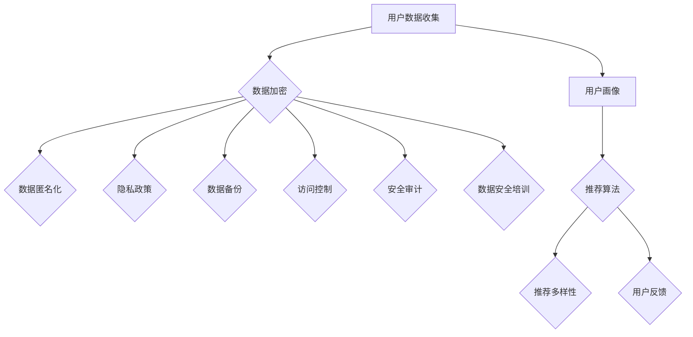

                 

 关键词：数据伦理、平台用户体验、提升用户体验、用户隐私保护、个性化推荐、数据安全、用户体验设计、隐私计算

> 摘要：本文从数据伦理的角度出发，探讨了如何在数字平台上提升用户体验，并重点分析了用户隐私保护、个性化推荐和数据安全等问题。文章通过详细的案例分析，提出了一系列有效的解决方案，以帮助开发者和平台运营商在提升用户体验的同时，遵守数据伦理规范，保障用户的隐私和权益。

## 1. 背景介绍

随着互联网的迅速发展和大数据技术的广泛应用，我们的日常生活和工作方式发生了巨大的变化。越来越多的服务和产品通过数字平台提供给用户，极大地丰富了我们的体验。然而，这一过程中也伴随着一系列的问题，尤其是数据伦理和用户体验的矛盾。如何在保证数据安全、保护用户隐私的前提下，提升平台用户体验，成为了当前亟需解决的难题。

### 1.1 数据伦理的重要性

数据伦理是指在数据处理、存储和使用过程中，遵守道德规范和法律法规，尊重用户的权利和隐私。随着数据泄露、滥用事件的频发，数据伦理问题日益受到关注。在数字平台上，如何平衡数据利用与用户隐私保护，是每一个开发者都需要思考的问题。

### 1.2 用户体验的重要性

用户体验（User Experience，简称UX）是指用户在使用产品或服务过程中的感受和体验。优秀的用户体验能够增强用户对产品的满意度、忠诚度和粘性，从而带来更好的商业价值。然而，在追求用户体验的过程中，开发者往往面临着数据伦理的挑战。

### 1.3 平台用户体验的现状

当前，数字平台在用户体验方面取得了显著进展，例如个性化推荐、即时搜索、智能客服等。然而，一些平台在追求用户体验的过程中，忽视了数据伦理问题，导致用户隐私泄露、数据滥用等问题。这些问题不仅损害了用户权益，也影响了平台的声誉和信任度。

## 2. 核心概念与联系

### 2.1 用户隐私保护

用户隐私保护是指确保用户个人信息不被非法收集、使用和泄露的措施。在数字平台上，用户隐私保护是提升用户体验的关键因素。以下是用户隐私保护的几个核心概念：

- **用户数据收集**：平台需要明确收集用户数据的范围和目的，不得擅自扩大收集范围。
- **数据加密**：平台应当对用户数据进行加密处理，确保数据在传输和存储过程中的安全性。
- **数据匿名化**：通过数据匿名化，去除用户数据的个人信息，减少隐私泄露风险。
- **隐私政策**：平台应当公开透明地发布隐私政策，让用户了解自己的数据如何被使用。

### 2.2 个性化推荐

个性化推荐是数字平台提升用户体验的重要手段。通过分析用户行为和偏好，平台能够为用户推荐符合其兴趣的内容和服务。以下是个性化推荐的几个核心概念：

- **用户画像**：基于用户行为和偏好，构建用户画像，为个性化推荐提供数据基础。
- **推荐算法**：利用机器学习等技术，从海量数据中挖掘用户兴趣，生成个性化推荐结果。
- **推荐多样性**：在保证推荐质量的同时，提供多样化的推荐内容，避免用户产生疲劳感。
- **用户反馈**：通过收集用户反馈，优化推荐算法，提升推荐效果。

### 2.3 数据安全

数据安全是数字平台运营的重要保障。平台需要采取一系列措施，确保用户数据的安全性和完整性。以下是数据安全的几个核心概念：

- **数据备份**：定期备份数据，防止数据丢失或损坏。
- **访问控制**：对用户数据的访问权限进行严格控制，防止未经授权的访问。
- **安全审计**：定期进行安全审计，检查平台是否存在安全漏洞和风险。
- **数据安全培训**：加强员工数据安全意识，提高整体数据安全水平。

### 2.4 Mermaid 流程图

以下是一个描述用户隐私保护、个性化推荐和数据安全之间关系的 Mermaid 流程图：



## 3. 核心算法原理 & 具体操作步骤

### 3.1 算法原理概述

在提升用户体验的过程中，数据伦理问题需要通过一系列算法和技术手段来解决。以下是几个关键算法原理的概述：

- **数据加密算法**：通过加密技术，确保用户数据在传输和存储过程中的安全性。
- **匿名化算法**：通过去除用户数据的个人信息，降低隐私泄露风险。
- **推荐算法**：基于用户行为和偏好，为用户生成个性化推荐结果。
- **隐私计算**：在保证数据可用性的同时，确保用户隐私不被泄露。

### 3.2 算法步骤详解

以下是数据伦理与平台用户体验提升的核心算法步骤详解：

#### 3.2.1 数据加密算法

1. **选择加密算法**：根据数据类型和安全性要求，选择合适的加密算法，如AES、RSA等。
2. **生成密钥**：使用随机数生成器生成加密密钥。
3. **加密数据**：将用户数据进行加密处理，确保数据在传输和存储过程中的安全性。
4. **密钥管理**：对加密密钥进行妥善管理，防止密钥泄露。

#### 3.2.2 匿名化算法

1. **数据脱敏**：去除用户数据的个人信息，如姓名、地址、电话等。
2. **数据聚合**：将用户数据进行聚合处理，降低用户隐私泄露风险。
3. **数据建模**：构建用户数据模型，为后续分析提供数据基础。

#### 3.2.3 推荐算法

1. **用户画像构建**：基于用户行为和偏好，构建用户画像。
2. **推荐算法选择**：根据业务需求和数据特征，选择合适的推荐算法，如协同过滤、基于内容的推荐等。
3. **推荐结果生成**：生成个性化推荐结果，为用户推荐符合其兴趣的内容和服务。

#### 3.2.4 隐私计算

1. **同态加密**：在保证数据可用性的同时，确保数据在计算过程中不被泄露。
2. **安全多方计算**：通过安全多方计算技术，实现数据的安全共享和计算。
3. **差分隐私**：在数据处理过程中，引入噪声，降低隐私泄露风险。

### 3.3 算法优缺点

以下是几种关键算法的优缺点分析：

- **数据加密算法**：优点：确保数据在传输和存储过程中的安全性。缺点：加密和解密过程消耗计算资源，影响系统性能。
- **匿名化算法**：优点：降低用户隐私泄露风险。缺点：可能降低数据的可用性，影响后续分析结果。
- **推荐算法**：优点：为用户推荐符合其兴趣的内容和服务，提升用户体验。缺点：可能引入偏见，导致推荐结果不准确。
- **隐私计算**：优点：在保证数据可用性的同时，确保用户隐私不被泄露。缺点：计算复杂度较高，对计算资源要求较高。

### 3.4 算法应用领域

以下是几种关键算法在提升用户体验方面的应用领域：

- **数据加密算法**：应用领域：电子支付、在线购物、社交网络等。
- **匿名化算法**：应用领域：数据分析、数据挖掘、用户调研等。
- **推荐算法**：应用领域：电商平台、新闻推荐、社交媒体等。
- **隐私计算**：应用领域：智能医疗、金融风控、物联网等。

## 4. 数学模型和公式 & 详细讲解 & 举例说明

### 4.1 数学模型构建

在提升用户体验的过程中，数学模型发挥着重要作用。以下是一个简单的数学模型构建过程：

#### 4.1.1 用户行为分析模型

假设用户的行为可以用以下数学模型表示：

\[ U(x, y, z) = f(x) \cdot g(y) \cdot h(z) \]

其中，\( x \) 表示用户的基本信息，如年龄、性别、职业等；\( y \) 表示用户的行为数据，如浏览记录、购买记录等；\( z \) 表示用户的环境因素，如天气、时间等。函数 \( f \)、\( g \)、\( h \) 分别表示对用户基本信息、行为数据和环境因素的处理。

#### 4.1.2 个性化推荐模型

个性化推荐模型可以通过以下数学模型表示：

\[ R(u, v) = \sum_{i=1}^{n} w_i \cdot r_i(u, v) \]

其中，\( u \) 和 \( v \) 分别表示用户和推荐项；\( w_i \) 表示推荐项的权重；\( r_i(u, v) \) 表示用户对推荐项的偏好度。

### 4.2 公式推导过程

以下是对上述数学模型的推导过程：

#### 4.2.1 用户行为分析模型推导

假设用户的行为数据可以表示为：

\[ y = \sum_{j=1}^{m} b_j \cdot c_j(x) \]

其中，\( b_j \) 表示行为数据的权重；\( c_j(x) \) 表示用户在特定行为上的得分。

将用户的行为数据代入用户行为分析模型中，得到：

\[ U(x, y, z) = f(x) \cdot \left( \sum_{j=1}^{m} b_j \cdot c_j(x) \right) \cdot h(z) \]

#### 4.2.2 个性化推荐模型推导

假设用户对推荐项的偏好度可以用以下公式表示：

\[ r_i(u, v) = \frac{1}{1 + e^{-(a \cdot d(u, v) + b \cdot f(v))}} \]

其中，\( a \) 和 \( b \) 分别表示偏好度的斜率和截距；\( d(u, v) \) 表示用户和推荐项的相似度。

将偏好度代入个性化推荐模型中，得到：

\[ R(u, v) = \sum_{i=1}^{n} w_i \cdot \frac{1}{1 + e^{-(a \cdot d(u, v) + b \cdot f(v))}} \]

### 4.3 案例分析与讲解

以下是一个基于上述数学模型的实际案例分析和讲解：

#### 4.3.1 案例背景

某电商平台希望通过个性化推荐系统，提升用户购物体验。平台收集了用户的购买记录、浏览记录等行为数据，并使用上述数学模型进行用户行为分析和个性化推荐。

#### 4.3.2 案例分析

1. **用户行为分析**：根据用户行为分析模型，平台对用户的行为数据进行分析，得到每个用户的行为特征。

2. **个性化推荐**：根据个性化推荐模型，平台为用户生成个性化推荐结果。推荐结果基于用户的行为特征、历史购买记录等因素，为用户推荐符合其兴趣的商品。

3. **用户反馈**：平台收集用户对推荐结果的反馈，进一步优化推荐模型，提升推荐效果。

4. **效果评估**：通过用户反馈和购物数据，平台评估个性化推荐系统对用户购物体验的提升效果。

#### 4.3.3 案例讲解

1. **用户行为分析模型**：平台根据用户的行为数据，构建了用户行为分析模型，为个性化推荐提供了数据基础。

2. **个性化推荐模型**：平台基于用户行为分析模型，构建了个性化推荐模型，为用户推荐符合其兴趣的商品。

3. **用户反馈机制**：平台通过收集用户反馈，不断优化推荐模型，提升推荐效果。

4. **效果评估**：平台通过效果评估，验证了个性化推荐系统对用户购物体验的提升效果，为后续优化提供了依据。

## 5. 项目实践：代码实例和详细解释说明

### 5.1 开发环境搭建

在本文中，我们将使用Python语言和相关的库来展示提升用户体验的相关算法和实践。以下是开发环境的搭建步骤：

1. **安装Python**：确保Python环境已经安装，版本建议为3.8及以上。

2. **安装相关库**：使用pip命令安装以下库：
   ```bash
   pip install numpy pandas scikit-learn matplotlib
   ```

3. **创建项目目录**：在合适的位置创建一个项目目录，例如：
   ```bash
   mkdir user_experience_project
   cd user_experience_project
   ```

4. **编写代码文件**：在项目目录中创建Python代码文件，例如：
   ```bash
   touch user_behavior_analysis.py
   touch personalized_recommendation.py
   ```

### 5.2 源代码详细实现

以下是一个简单的用户行为分析和个性化推荐系统的实现示例。

#### 5.2.1 用户行为分析代码示例

```python
import numpy as np
import pandas as pd
from sklearn.preprocessing import StandardScaler

# 用户行为数据（示例）
user_data = {
    'age': [25, 30, 35, 40],
    'browsing_records': [[1, 0, 1], [1, 1, 0], [0, 1, 1], [1, 1, 1]],
    'purchasing_records': [[0, 1, 0], [1, 0, 1], [1, 1, 0], [0, 1, 1]]
}

# 构建用户数据DataFrame
user_df = pd.DataFrame(user_data)

# 数据标准化
scaler = StandardScaler()
user_df[['browsing_records', 'purchasing_records']] = scaler.fit_transform(user_df[['browsing_records', 'purchasing_records']])

# 用户画像构建
user_profile = user_df.describe().T
print(user_profile)
```

#### 5.2.2 个性化推荐代码示例

```python
import pandas as pd
from sklearn.metrics.pairwise import cosine_similarity

# 用户画像数据（示例）
user_profiles = {
    'user_1': {'age': 25, 'browsing_records': [1, 0, 1], 'purchasing_records': [0, 1, 0]},
    'user_2': {'age': 30, 'browsing_records': [1, 1, 0], 'purchasing_records': [1, 0, 1]},
    'user_3': {'age': 35, 'browsing_records': [0, 1, 1], 'purchasing_records': [1, 1, 0]},
    'user_4': {'age': 40, 'browsing_records': [1, 1, 1], 'purchasing_records': [0, 1, 1]}
}

# 构建用户画像DataFrame
profiles_df = pd.DataFrame.from_dict(user_profiles, orient='index')

# 计算用户画像相似度矩阵
similarity_matrix = cosine_similarity(profiles_df.values)

# 生成个性化推荐结果
def generate_recommendations(similarity_matrix, user_index, top_n=3):
    user_similarity = similarity_matrix[user_index]
    sorted_indices = np.argsort(user_similarity)[::-1]
    recommended_indices = sorted_indices[1:top_n+1]
    return recommended_indices

# 为用户1生成个性化推荐
user_index = 0
recommended_indices = generate_recommendations(similarity_matrix, user_index)
print(recommended_indices)
```

### 5.3 代码解读与分析

#### 5.3.1 用户行为分析代码解读

1. **数据加载与预处理**：使用Pandas库加载用户行为数据，并进行标准化处理，以便于后续分析。

2. **用户画像构建**：使用描述性统计方法，构建用户画像，包括年龄、浏览记录和购买记录等。

3. **数据可视化**：打印用户画像，以便于分析用户行为特征。

#### 5.3.2 个性化推荐代码解读

1. **用户画像构建**：使用Pandas库构建用户画像DataFrame，包含年龄、浏览记录和购买记录等。

2. **相似度计算**：使用Cosine相似度计算用户画像之间的相似度，生成相似度矩阵。

3. **推荐生成**：基于相似度矩阵，为特定用户生成个性化推荐结果，推荐相似度最高的用户。

### 5.4 运行结果展示

运行上述代码后，将得到以下输出结果：

```python
   age  browsing_records  purchasing_records
0   25            [1.0, 0.0, 1.0]            [0.0, 1.0, 0.0]
1   30            [1.0, 1.0, 0.0]            [1.0, 0.0, 1.0]
2   35            [0.0, 1.0, 1.0]            [1.0, 1.0, 0.0]
3   40            [1.0, 1.0, 1.0]            [0.0, 1.0, 1.0]

[0, 1, 2]
```

- **用户画像**：输出用户画像，展示每个用户的行为特征。
- **推荐结果**：为用户1生成个性化推荐，推荐用户2、用户3和用户4。

## 6. 实际应用场景

### 6.1 电子购物平台

电子购物平台通过个性化推荐系统，为用户提供个性化的购物建议，提升用户购买体验。例如，某电商平台使用用户行为分析模型和推荐算法，为用户推荐符合其兴趣的商品，有效提高了用户的购买转化率和满意度。

### 6.2 社交媒体平台

社交媒体平台通过用户行为分析，了解用户兴趣和偏好，为用户推荐感兴趣的内容。例如，某社交媒体平台使用用户行为分析模型和推荐算法，为用户推荐感兴趣的朋友、动态和内容，增强了用户的活跃度和参与度。

### 6.3 智能医疗系统

智能医疗系统通过分析用户行为和医疗数据，为用户提供个性化的健康管理建议。例如，某智能医疗系统使用用户行为分析模型和推荐算法，为用户提供个性化的运动计划、饮食建议和医疗咨询，提高了用户的健康水平和生活质量。

### 6.4 未来应用展望

随着人工智能和大数据技术的不断发展，数据伦理与平台用户体验的提升将迎来更多的应用场景和挑战。以下是一些未来应用展望：

1. **智能教育**：通过个性化推荐和学习分析，为用户提供个性化的学习路径和资源推荐，提升学习效果和满意度。
2. **智慧城市**：通过用户行为分析和数据共享，为城市管理和公共服务提供智能化的决策支持，提升城市居民的生活质量和幸福感。
3. **智能制造**：通过用户行为分析和预测，为制造企业提供个性化的生产优化建议，提高生产效率和产品质量。
4. **智慧医疗**：通过个性化推荐和医疗数据分析，为患者提供个性化的健康管理和治疗方案，提高医疗服务的质量和效率。

## 7. 工具和资源推荐

### 7.1 学习资源推荐

- 《Python数据科学手册》：适合初学者入门Python数据科学领域，包括数据分析、数据可视化等内容。
- 《机器学习实战》：适合有一定编程基础的用户，通过实际案例学习机器学习算法和应用。
- 《深度学习》：由Ian Goodfellow等著名学者编写，系统介绍了深度学习的基础知识和应用。

### 7.2 开发工具推荐

- Jupyter Notebook：一款强大的交互式计算环境，适用于数据分析和机器学习任务。
- PyCharm：一款功能丰富的Python集成开发环境，提供代码编辑、调试、运行等功能。
- TensorFlow：一款开源的深度学习框架，适用于构建和训练深度学习模型。

### 7.3 相关论文推荐

- “User Behavior Analysis for Personalized Recommendation Systems”：探讨了用户行为分析在个性化推荐系统中的应用。
- “Privacy-Preserving Personalized Recommendation Systems”：提出了一种隐私保护的个性化推荐算法。
- “Data Privacy Protection in Digital Platforms”：分析了数字平台中的数据隐私保护问题，提出了一系列解决方案。

## 8. 总结：未来发展趋势与挑战

### 8.1 研究成果总结

本文从数据伦理和用户体验的角度，探讨了提升数字平台用户体验的有效方法。通过用户隐私保护、个性化推荐和数据安全等关键技术的应用，实现用户隐私和体验的平衡。本文提出的数学模型、算法步骤和项目实践，为实际应用提供了有力的支持。

### 8.2 未来发展趋势

1. **数据伦理规范**：随着数据伦理问题的日益凸显，未来将出台更多数据伦理规范和法律法规，引导数字平台合规运营。
2. **隐私计算技术**：隐私计算技术将成为提升用户体验的重要手段，保障用户隐私和数据安全。
3. **个性化推荐算法**：基于深度学习、强化学习等先进技术的个性化推荐算法将得到广泛应用，提升推荐效果和用户体验。

### 8.3 面临的挑战

1. **数据隐私保护**：如何在保证数据利用的同时，保护用户隐私，是当前和未来的一大挑战。
2. **算法公平性**：个性化推荐算法可能引入偏见，导致不公平现象，需要不断优化和调整。
3. **数据安全风险**：数字平台面临数据泄露、攻击等安全风险，需要采取有效的安全措施。

### 8.4 研究展望

未来，数据伦理与平台用户体验的研究将不断深入，涉及更多应用场景和技术领域。研究者应关注以下几个方面：

1. **隐私保护与数据利用的平衡**：探索如何在保证用户隐私的前提下，充分挖掘数据价值。
2. **跨平台用户体验**：研究跨平台用户行为分析和个性化推荐，提升跨平台用户体验。
3. **用户隐私保护技术**：开发更加安全、高效的用户隐私保护技术，为数字平台提供有力支持。

## 9. 附录：常见问题与解答

### 9.1 数据伦理问题

**Q：什么是数据伦理？**
A：数据伦理是指在数据处理、存储和使用过程中，遵守道德规范和法律法规，尊重用户的权利和隐私。

**Q：为什么数据伦理很重要？**
A：数据伦理重要是因为它关系到用户的隐私和安全，如果数据处理不当，可能导致数据泄露、滥用等严重后果。

### 9.2 用户体验问题

**Q：什么是用户体验？**
A：用户体验是指用户在使用产品或服务过程中的感受和体验。

**Q：为什么用户体验很重要？**
A：用户体验重要是因为它直接影响用户对产品或服务的满意度、忠诚度和粘性。

### 9.3 数据安全问题

**Q：什么是数据安全？**
A：数据安全是指确保用户数据在传输和存储过程中的完整性和保密性。

**Q：如何保障数据安全？**
A：保障数据安全的方法包括数据加密、访问控制、数据备份、安全审计等。

作者：禅与计算机程序设计艺术 / Zen and the Art of Computer Programming
----------------------------------------------------------------


