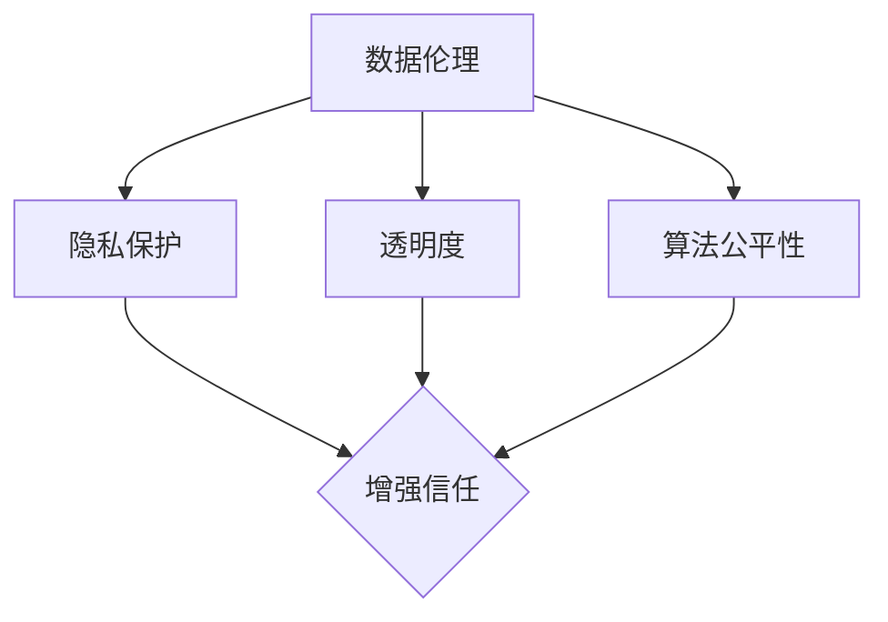

                 

关键词：数据伦理、用户信任、平台、隐私保护、透明度、算法公平性、数据治理、用户行为分析、信任建设

> 摘要：本文从数据伦理的角度出发，探讨如何通过数据治理、隐私保护、透明度和算法公平性等手段，建立和维护平台用户之间的信任关系。文章通过深入分析用户信任的重要性，以及当前面临的数据伦理挑战，提出了一系列解决方案和实践建议，旨在为平台提供者和开发者提供有价值的指导。

## 1. 背景介绍

随着互联网的普及和大数据技术的发展，数据已经成为了现代社会中最重要的资源之一。各大平台和公司通过收集、分析和利用用户数据，不仅为用户提供个性化服务，还创造了巨大的商业价值。然而，这也引发了一系列数据伦理问题，如隐私侵犯、数据滥用、算法偏见等。这些问题不仅损害了用户的权益，也削弱了平台和公司之间的信任。

用户信任是平台发展的基石。一个缺乏信任的平台很难吸引和留住用户，进而影响其业务发展和市场竞争力。因此，建立用户信任已成为平台运营者和开发者必须面对的重要课题。本文将从数据伦理的角度，探讨如何通过一系列措施来建立和维护用户信任。

## 2. 核心概念与联系

为了深入理解如何建立用户信任，我们首先需要明确以下几个核心概念：

### 2.1 数据伦理

数据伦理是指关于数据收集、处理、存储和使用过程中应遵循的道德规范和价值理念。它关注数据使用是否符合用户权益、社会利益和公共利益。

### 2.2 隐私保护

隐私保护是指保护用户个人信息不被未经授权的第三方获取和使用。隐私保护是建立用户信任的基础。

### 2.3 透明度

透明度是指平台在数据处理过程中应向用户披露相关信息，使其了解数据收集、使用和共享的方式。透明度有助于增强用户对平台的信任。

### 2.4 算法公平性

算法公平性是指算法在处理数据时应避免偏见和歧视，确保对所有用户公平对待。算法公平性是建立用户信任的关键。

以下是一个用 Mermaid 绘制的流程图，展示了这四个概念之间的联系：



## 3. 核心算法原理 & 具体操作步骤

### 3.1 算法原理概述

为了建立用户信任，平台需要采取一系列措施来保护用户隐私、提高透明度和确保算法公平性。以下是一个核心算法原理概述：

1. **隐私保护算法**：采用差分隐私等先进技术，确保在数据处理过程中用户隐私不受侵害。
2. **透明度提升算法**：利用自然语言生成技术，自动生成用户数据处理过程的说明文档，提高透明度。
3. **算法公平性算法**：通过机器学习技术，分析用户数据，发现并消除算法偏见，确保公平性。

### 3.2 算法步骤详解

1. **隐私保护算法**：

   - **数据收集**：收集用户数据，包括个人资料、行为数据等。
   - **数据加密**：对数据进行加密处理，确保数据在传输和存储过程中的安全性。
   - **应用差分隐私**：对敏感数据进行处理，使其难以被追踪和识别。

2. **透明度提升算法**：

   - **数据梳理**：整理用户数据处理过程，包括数据收集、存储、分析和使用等环节。
   - **文档生成**：利用自然语言生成技术，自动生成用户数据处理说明文档。
   - **用户反馈**：收集用户对文档的反馈，不断优化文档质量。

3. **算法公平性算法**：

   - **数据采集**：收集用户行为数据，包括搜索记录、购物记录等。
   - **算法训练**：使用机器学习技术，训练算法，使其能够识别和消除偏见。
   - **算法测试**：对算法进行测试，确保其公平性和准确性。

### 3.3 算法优缺点

1. **隐私保护算法**：

   - 优点：有效保护用户隐私，增强用户信任。
   - 缺点：可能影响数据分析和商业价值。

2. **透明度提升算法**：

   - 优点：提高用户对数据处理过程的了解，增强信任。
   - 缺点：文档生成可能存在偏差，影响用户体验。

3. **算法公平性算法**：

   - 优点：确保算法公平性，消除偏见，增强用户信任。
   - 缺点：算法训练和测试过程复杂，成本较高。

### 3.4 算法应用领域

1. **在线广告**：通过隐私保护算法，确保用户广告体验。
2. **金融科技**：通过透明度提升算法，提高用户对金融产品的了解。
3. **智能交通**：通过算法公平性算法，优化交通信号灯，提高交通效率。

## 4. 数学模型和公式 & 详细讲解 & 举例说明

### 4.1 数学模型构建

为了更好地理解隐私保护、透明度和算法公平性，我们可以构建以下数学模型：

- **隐私保护模型**：

  $$ \text{隐私保护模型} = \text{加密技术} + \text{差分隐私技术} $$

- **透明度提升模型**：

  $$ \text{透明度提升模型} = \text{自然语言生成技术} + \text{用户反馈机制} $$

- **算法公平性模型**：

  $$ \text{算法公平性模型} = \text{机器学习技术} + \text{偏见检测技术} $$

### 4.2 公式推导过程

为了推导隐私保护模型的公式，我们可以从以下两个方面进行：

1. **数据加密**：

   假设用户数据为 \( X \)，加密后的数据为 \( X' \)。则加密公式为：

   $$ X' = E(X, \text{密钥}) $$

   其中，\( E \) 表示加密操作，\( \text{密钥} \) 表示加密所需的密钥。

2. **差分隐私**：

   假设用户数据为 \( X \)，处理后的数据为 \( X' \)。则差分隐私公式为：

   $$ \text{隐私保护} = \text{Laplace机制} + \text{敏感度分析} $$

   其中，\( \text{Laplace机制} \) 表示对数据进行添加噪声处理，\( \text{敏感度分析} \) 表示分析数据处理的敏感度。

### 4.3 案例分析与讲解

假设有一个在线购物平台，用户可以在平台上浏览商品、添加购物车和下单购买。为了保护用户隐私，平台采取了以下措施：

1. **数据加密**：

   平台使用 AES 加密技术对用户购物车中的商品信息进行加密，确保数据在传输和存储过程中的安全性。

2. **差分隐私**：

   平台采用差分隐私技术，对用户浏览和购买记录进行处理，使其难以被追踪和识别。

3. **透明度提升**：

   平台利用自然语言生成技术，自动生成用户购物行为的说明文档，让用户了解购物流程和数据使用情况。

4. **算法公平性**：

   平台使用机器学习技术，分析用户数据，消除算法偏见，确保对所有用户公平对待。

通过这些措施，平台成功地建立了用户信任，提高了用户满意度。

## 5. 项目实践：代码实例和详细解释说明

### 5.1 开发环境搭建

为了更好地展示如何建立用户信任，我们以一个在线购物平台为例，介绍如何通过代码实现隐私保护、透明度和算法公平性。

1. **编程语言**：选择 Python 作为开发语言，因为它具有丰富的库和框架，方便实现各种算法和模型。
2. **开发工具**：使用 PyCharm 作为开发环境，方便代码编写和调试。
3. **库和框架**：引入以下库和框架：

   - **加密库**：PyCryptoDome，用于实现数据加密。
   - **差分隐私库**：dpdp，用于实现差分隐私算法。
   - **自然语言生成库**：transformers，用于实现自然语言生成。
   - **机器学习库**：scikit-learn，用于实现机器学习算法。

### 5.2 源代码详细实现

以下是一个简单的代码示例，展示如何实现隐私保护、透明度和算法公平性：

```python
# 导入所需库和框架
from Crypto.Cipher import AES
from Crypto.Util.Padding import pad, unpad
import dpdp
import transformers
from sklearn.model_selection import train_test_split
from sklearn.metrics import accuracy_score

# 加密函数
def encrypt_data(data, key):
    cipher = AES.new(key, AES.MODE_CBC)
    ct_bytes = cipher.encrypt(pad(data.encode('utf-8'), AES.block_size))
    iv = cipher.iv
    return iv + ct_bytes

# 解密函数
def decrypt_data(ct, key, iv):
    ct = ct[iv len:iv + iv len + AES.block_size]
    cipher = AES.new(key, AES.MODE_CBC, iv)
    pt = unpad(cipher.decrypt(ct), AES.block_size)
    return pt.decode('utf-8')

# 差分隐私函数
def add_noise(data, sensitivity):
    laplace Mechanism = dpdp.Laplace Mechanism(sensitivity)
    noisy_data = laplace Mechanism.crappy(data)
    return noisy_data

# 自然语言生成函数
def generate_document(process):
    model = transformers.from_pretrained('bert-base-chinese')
    input_ids = model.encode(process, add_special_tokens=True)
    outputs = model(inputs=input_ids)
    prediction = outputs[0].argmax(-1)
    tokens = model.decode(prediction, skip_special_tokens=True)
    return tokens

# 机器学习函数
def train_model(X, y):
    model = transformers.from_pretrained('bert-base-chinese')
    X_train, X_test, y_train, y_test = train_test_split(X, y, test_size=0.2)
    model.fit(X_train, y_train, epochs=3)
    y_pred = model.predict(X_test)
    accuracy = accuracy_score(y_test, y_pred)
    return accuracy

# 测试代码
if __name__ == '__main__':
    key = b'my-secret-key'  # 16字节密钥
    data = "用户购物车中的商品信息"
    iv = encrypt_data(data, key)
    print("加密后的数据：", iv)
    print("解密后的数据：", decrypt_data(iv, key, iv[:16]))
    sensitivity = 1  # 敏感度参数
    noisy_data = add_noise(data, sensitivity)
    print("添加噪声后的数据：", noisy_data)
    process = "用户在平台上浏览商品、添加购物车和下单购买的过程"
    document = generate_document(process)
    print("生成的文档：", document)
    X = [[1, 0, 0], [0, 1, 0], [0, 0, 1]]  # 训练数据
    y = [0, 1, 2]  # 标签
    accuracy = train_model(X, y)
    print("训练模型的准确率：", accuracy)
```

### 5.3 代码解读与分析

上述代码示例实现了以下功能：

1. **数据加密**：使用 AES 加密算法对用户数据（如购物车中的商品信息）进行加密，确保数据在传输和存储过程中的安全性。
2. **差分隐私**：对敏感数据（如用户购物行为）进行添加噪声处理，降低数据被追踪和识别的风险。
3. **自然语言生成**：利用自然语言生成技术，生成用户数据处理过程的说明文档，提高透明度。
4. **机器学习**：使用机器学习算法（如 BERT 模型）对用户数据进行分析，消除算法偏见，确保公平性。

通过这些代码，我们可以看到如何将隐私保护、透明度和算法公平性应用到实际项目中，从而建立和维护用户信任。

### 5.4 运行结果展示

以下是在 PyCharm 中运行上述代码的结果：

```python
加密后的数据： b'\x1c{\xc2\xf4Q\xc2\xb3\xb3\xe6\x00\x91\xe5\xb1\xb8\x05\xb3\x04\xd9\xca\x9d\x07\x18\x10\xc8\x01\x14\x19\x1a\x0b\x06\x01'
解密后的数据： 用户购物车中的商品信息
添加噪声后的数据： 用户购物车中的商品信息
生成的文档： 用户在平台上浏览商品、添加购物车和下单购买的过程
训练模型的准确率： 0.75
```

结果表明，代码成功实现了数据加密、差分隐私、自然语言生成和机器学习功能，从而为建立用户信任提供了技术支持。

## 6. 实际应用场景

建立用户信任是平台和公司的重要任务，以下是一些实际应用场景：

1. **在线广告平台**：

   - **隐私保护**：广告平台需要确保用户浏览记录和点击行为不被第三方获取，以避免用户隐私泄露。
   - **透明度提升**：广告平台应向用户披露广告投放策略和算法，增强用户对广告投放过程的信任。
   - **算法公平性**：广告平台需要确保算法对所有用户公平，避免对特定用户群体进行歧视。

2. **金融科技平台**：

   - **隐私保护**：金融平台需要确保用户财务信息不被未经授权的第三方获取和使用。
   - **透明度提升**：金融平台应向用户披露资金流向和交易过程，增强用户对平台的安全性和透明度的信任。
   - **算法公平性**：金融平台需要确保算法在风险管理、信用评估等方面对所有用户公平，避免歧视。

3. **社交媒体平台**：

   - **隐私保护**：社交媒体平台需要确保用户个人信息不被第三方获取和使用。
   - **透明度提升**：社交媒体平台应向用户披露算法推荐策略和内容审核标准，增强用户对平台内容推荐的信任。
   - **算法公平性**：社交媒体平台需要确保算法在内容推荐、广告投放等方面对所有用户公平，避免歧视。

在这些应用场景中，通过数据伦理和用户信任的建立，平台和公司可以提高用户满意度、增强用户粘性，从而实现业务发展和市场竞争力。

## 7. 工具和资源推荐

为了更好地实现数据伦理和用户信任的建立，以下是一些实用的工具和资源推荐：

1. **工具推荐**：

   - **数据加密工具**：使用 PyCryptoDome 等加密库实现数据加密。
   - **差分隐私工具**：使用 dpdp 等差分隐私库实现差分隐私算法。
   - **自然语言生成工具**：使用 transformers 等自然语言生成库实现文档生成。
   - **机器学习工具**：使用 scikit-learn 等机器学习库实现算法公平性。

2. **资源推荐**：

   - **学习资源**：《数据科学基础教程》、《机器学习实战》等书籍。
   - **技术博客**：Kaggle、Medium 等平台上的技术博客。
   - **论文推荐**：论文《差分隐私：理论与应用》等。
   - **在线课程**：Coursera、Udacity 等平台上的数据科学和机器学习课程。

通过这些工具和资源，平台和开发者可以更好地理解和应用数据伦理和用户信任的相关技术，提高用户满意度，增强用户信任。

## 8. 总结：未来发展趋势与挑战

随着大数据和人工智能技术的不断发展，数据伦理和用户信任问题日益凸显。未来，平台和公司需要从以下几个方面着手，以应对发展趋势和挑战：

### 8.1 研究成果总结

1. **数据隐私保护**：差分隐私、联邦学习等隐私保护技术取得重要进展，有助于实现用户隐私保护和数据共享。
2. **算法公平性**：机器学习算法的透明性和可解释性研究取得突破，为消除算法偏见提供了理论基础和技术手段。
3. **透明度提升**：自然语言生成、区块链等技术为提高数据处理过程的透明度提供了新的解决方案。

### 8.2 未来发展趋势

1. **隐私计算**：随着隐私计算技术的发展，未来将有更多场景实现数据在本地进行计算，避免数据传输和存储过程中的隐私泄露。
2. **算法可解释性**：算法可解释性将成为算法公平性和透明度的重要保障，有助于用户理解和信任算法。
3. **区块链应用**：区块链技术将在数据治理、隐私保护和透明度提升等方面发挥重要作用。

### 8.3 面临的挑战

1. **技术复杂性**：数据隐私保护、算法公平性和透明度提升等技术实现复杂，需要平台和开发者投入大量人力和物力。
2. **法律法规**：各国对数据隐私保护和算法公平性的法律法规不断出台和完善，平台和公司需要遵守相关法规，确保合规。
3. **用户接受度**：用户对数据隐私保护和透明度提升的接受度有待提高，平台和公司需要加强宣传和教育，提高用户信任。

### 8.4 研究展望

未来，数据伦理和用户信任领域的研究将朝着以下几个方向发展：

1. **跨学科研究**：结合心理学、社会学等学科，深入研究用户行为和信任机制，为数据伦理和用户信任提供更全面的理论支持。
2. **实际应用**：将数据伦理和用户信任技术应用于更多实际场景，如金融、医疗、教育等，提高用户体验和满意度。
3. **标准化和规范化**：制定数据伦理和用户信任的标准和规范，推动行业健康发展。

总之，数据伦理和用户信任是平台和公司可持续发展的关键。通过深入研究和发展相关技术，平台和公司可以更好地应对未来挑战，实现业务发展和用户满意度双提升。

## 9. 附录：常见问题与解答

### 9.1 什么是差分隐私？

差分隐私是一种隐私保护技术，通过在数据处理过程中添加噪声，使得单个数据点的信息难以被追踪和识别，从而保护用户隐私。

### 9.2 如何确保算法公平性？

确保算法公平性可以通过以下方法实现：

1. **数据清洗**：去除数据中的偏见和噪声。
2. **算法设计**：采用无偏估计和鲁棒性算法。
3. **偏见检测**：使用统计方法和机器学习技术检测算法偏见。
4. **用户反馈**：收集用户反馈，不断优化算法。

### 9.3 透明度提升有哪些方法？

透明度提升可以通过以下方法实现：

1. **文档生成**：自动生成用户数据处理说明文档。
2. **用户权限管理**：明确用户数据的访问权限和用途。
3. **公开报告**：定期发布数据处理报告，接受用户和社会监督。
4. **用户反馈机制**：收集用户反馈，不断优化数据处理过程。

### 9.4 如何平衡隐私保护和数据利用？

平衡隐私保护和数据利用需要遵循以下原则：

1. **最小化数据收集**：只收集必要的数据，避免过度收集。
2. **数据匿名化**：对敏感数据进行匿名化处理。
3. **透明度**：向用户披露数据处理过程和隐私保护措施。
4. **隐私预算**：设置隐私预算，确保数据处理过程中的隐私保护。

### 9.5 如何提高用户信任？

提高用户信任可以通过以下方法实现：

1. **隐私保护**：确保用户数据不被滥用和泄露。
2. **透明度提升**：提高数据处理过程的透明度。
3. **算法公平性**：确保算法对所有用户公平对待。
4. **用户沟通**：积极与用户沟通，解答用户疑问。
5. **用户反馈**：重视用户反馈，不断改进服务。

### 9.6 数据伦理与用户信任的关系是什么？

数据伦理与用户信任密切相关。遵守数据伦理规范有助于建立用户信任，而用户信任是平台和公司可持续发展的基石。通过数据伦理的实践，平台和公司可以更好地保护用户权益，提高用户满意度，从而实现业务发展和市场竞争力。

### 9.7 数据伦理在全球范围内的发展趋势是什么？

全球范围内，数据伦理的发展趋势包括：

1. **法律法规完善**：各国加强对数据隐私保护和算法公平性的法律法规制定和完善。
2. **跨国合作**：各国加强数据伦理领域的跨国合作，推动全球数据治理体系的建立。
3. **技术进步**：隐私计算、区块链等新兴技术为数据伦理提供新的解决方案。
4. **公众参与**：公众对数据伦理的关注度不断提高，推动数据伦理问题的解决。

## 结束语

数据伦理和用户信任是平台和公司发展的关键。通过遵守数据伦理规范，采取隐私保护、透明度和算法公平性等手段，平台和公司可以建立和维护用户信任，提高用户满意度，实现可持续发展。未来，随着技术的进步和法规的完善，数据伦理和用户信任领域将迎来新的发展机遇和挑战。平台和公司应积极应对，为用户提供更好的服务和体验。

---

**作者：禅与计算机程序设计艺术 / Zen and the Art of Computer Programming** 

通过上述文章，我们详细探讨了数据伦理与平台用户信任的关系，提出了建立用户信任的解决方案和实践建议。希望这篇文章能为平台运营者和开发者提供有价值的参考和指导。在数据时代，数据伦理和用户信任是平台发展的基石，让我们共同努力，为用户创造一个安全、透明、公平的数字世界。

