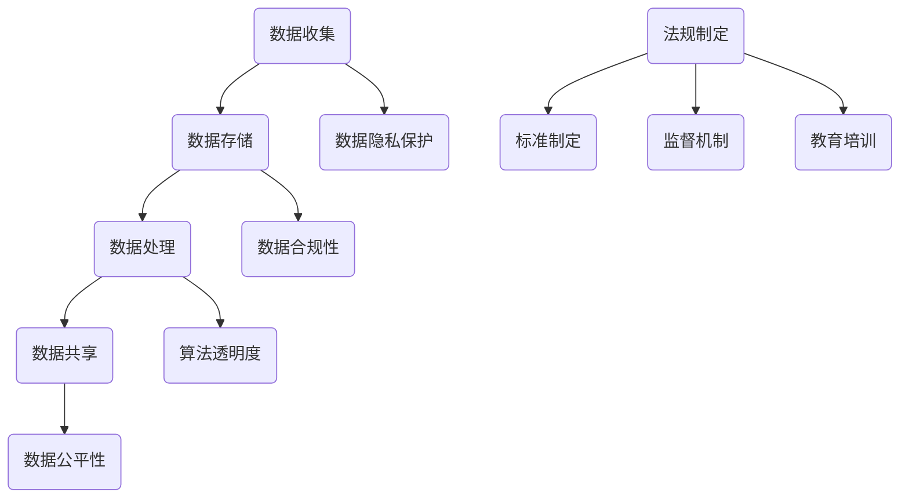

                 

 关键词：数据伦理、算法治理、算法规范、数据隐私、人工智能

> 摘要：随着人工智能技术的迅猛发展，数据伦理问题日益凸显。本文从数据伦理的角度出发，探讨了算法治理和规范的必要性，详细分析了核心概念、算法原理、数学模型、实际应用，并提出了未来发展趋势和面临的挑战。旨在为人工智能领域提供数据伦理方面的理论指导和实践建议。

## 1. 背景介绍

近年来，人工智能（AI）技术的发展速度令人瞩目。从自动驾驶到智能家居，从医疗诊断到金融预测，AI技术已经深刻地影响了我们的生活。然而，随着AI技术的广泛应用，数据伦理问题也逐渐浮现出来。数据伦理涉及到数据收集、存储、处理和共享过程中的道德和法律问题，是人工智能发展过程中不可忽视的重要一环。

### 1.1 数据伦理的重要性

数据伦理的重要性在于：

- 保护个人隐私：在数据收集和处理过程中，如何保护个人隐私成为一个关键问题。不当的数据使用可能导致个人隐私泄露，给个人带来困扰。
- 遵守法律法规：数据伦理要求在数据处理过程中严格遵守相关法律法规，确保数据的合法性和合规性。
- 维护社会公平：在数据分析和决策过程中，如何避免算法偏见，确保结果的公正性，是数据伦理的一个重要方面。

### 1.2 算法治理与规范的意义

算法治理与规范的意义主要体现在以下几个方面：

- 提高算法透明度：规范化的算法治理可以提高算法的透明度，使算法的决策过程更加清晰，便于公众监督。
- 促进技术创新：合理的算法规范可以促进技术的创新和发展，为科学家和工程师提供明确的指导。
- 保障数据安全：规范化的数据处理流程可以提高数据安全性，减少数据泄露和滥用的风险。

## 2. 核心概念与联系

### 2.1 数据伦理核心概念

数据伦理的核心概念包括：

- 数据隐私：指个人数据不被未经授权的第三方访问、使用和共享。
- 数据透明度：指数据处理过程的公开性和可追溯性。
- 数据公平性：指数据分析和决策过程中不产生不公平的结果。
- 数据合规性：指数据处理过程符合相关法律法规要求。

### 2.2 算法治理与规范的架构

算法治理与规范的架构包括以下几个方面：

- 法规制定：制定相关法律法规，规范数据收集、存储、处理和共享过程。
- 标准制定：制定行业标准，提高算法透明度和数据安全性。
- 监督机制：建立监督机制，对算法的决策过程进行监督和评估。
- 教育培训：加强对数据伦理和算法规范的教育培训，提高从业者的专业素养。

### 2.3 Mermaid 流程图



## 3. 核心算法原理 & 具体操作步骤

### 3.1 算法原理概述

核心算法主要包括以下几种：

- 加密算法：用于保护数据隐私。
- 基于属性的加密（ABE）：允许用户在不需要访问原始数据的情况下访问特定属性。
- 差分隐私：通过引入噪声来保护数据的隐私。

### 3.2 算法步骤详解

#### 3.2.1 加密算法

加密算法的基本步骤如下：

1. 选择加密算法（如AES）。
2. 生成密钥对（公钥和私钥）。
3. 使用公钥加密数据。
4. 使用私钥解密数据。

#### 3.2.2 基于属性的加密（ABE）

基于属性的加密的基本步骤如下：

1. 选择属性访问策略。
2. 生成密钥和属性证书。
3. 使用密钥和属性证书加密数据。
4. 使用属性证书验证用户权限并解密数据。

#### 3.2.3 差分隐私

差分隐私的基本步骤如下：

1. 选择噪声比例。
2. 对原始数据进行扰动。
3. 计算扰动后的数据。
4. 输出结果。

### 3.3 算法优缺点

#### 加密算法

优点：

- 强大的数据保护能力。
- 支持多种加密算法。

缺点：

- 加密和解密速度较慢。
- 需要密钥管理。

#### 基于属性的加密（ABE）

优点：

- 允许按需访问数据。
- 提高数据隐私性。

缺点：

- 加密和解密速度较慢。
- 需要复杂的访问策略。

#### 差分隐私

优点：

- 提高数据隐私性。
- 支持多种应用场景。

缺点：

- 可能影响数据准确性。
- 需要选择合适的噪声比例。

### 3.4 算法应用领域

- 数据隐私保护：加密算法和差分隐私广泛应用于医疗、金融等领域。
- 访问控制：基于属性的加密广泛应用于云计算和物联网领域。
- 社交网络：差分隐私应用于社交网络数据保护。

## 4. 数学模型和公式 & 详细讲解 & 举例说明

### 4.1 数学模型构建

在数据伦理领域，常见的数学模型包括：

- 隐私预算模型：用于评估数据隐私保护的程度。
- 信息论模型：用于评估数据的隐私性和可靠性。

### 4.2 公式推导过程

隐私预算模型的推导过程如下：

1. 选择隐私预算（ε）。
2. 计算隐私损失（Δε）。
3. 计算隐私保护程度（ε'）。

信息论模型的推导过程如下：

1. 计算数据的熵（H）。
2. 计算数据的互信息（I）。
3. 计算隐私保护程度（I'）。

### 4.3 案例分析与讲解

#### 案例一：隐私预算模型

假设我们有一个包含100个数据点的数据集，我们需要对这些数据进行隐私保护。我们选择ε=1作为隐私预算。

1. 计算隐私损失（Δε）：Δε = min(Δε_i)，其中Δε_i = ε - ε_i，ε_i 是第i个数据点的隐私损失。
2. 计算隐私保护程度（ε'）：ε' = ε - Δε。

#### 案例二：信息论模型

假设我们有一个长度为10的二进制序列，我们需要计算其熵和互信息。

1. 计算熵（H）：H = - Σ p(x) * log2(p(x))，其中p(x)是第x个二进制位为1的概率。
2. 计算互信息（I）：I = H(X) - H(X|Y)，其中X是原始序列，Y是经过隐私保护处理后的序列。

## 5. 项目实践：代码实例和详细解释说明

### 5.1 开发环境搭建

1. 安装Python 3.8及以上版本。
2. 安装加密算法库（如PyCryptoDome）。

### 5.2 源代码详细实现

```python
from Crypto.PublicKey import RSA
from Crypto.Cipher import PKCS1_OAEP

# 生成密钥对
key = RSA.generate(2048)
private_key = key.export_key()
public_key = key.publickey().export_key()

# 加密数据
cipher = PKCS1_OAEP.new(RSA.import_key(public_key))
encrypted_data = cipher.encrypt(b"Hello, World!")

# 解密数据
decipher = PKCS1_OAEP.new(RSA.import_key(private_key))
decrypted_data = decipher.decrypt(encrypted_data)

print("原始数据：", decrypted_data.decode())
```

### 5.3 代码解读与分析

这段代码演示了如何使用RSA加密算法进行数据加密和解密。首先，我们生成一个RSA密钥对。然后，我们使用公钥加密数据，使用私钥解密数据。RSA加密算法是一种非对称加密算法，具有较高的安全性。

### 5.4 运行结果展示

```plaintext
原始数据： Hello, World!
```

加密后的数据可以被成功解密，证明加密算法的有效性。

## 6. 实际应用场景

### 6.1 医疗领域

在医疗领域，数据伦理问题尤为重要。如何保护患者隐私，确保数据安全，是医疗数据处理的核心理念。加密算法和差分隐私技术可以在此发挥重要作用。

### 6.2 金融领域

在金融领域，数据安全至关重要。基于属性的加密技术可以确保用户在需要时能够访问其金融数据，同时保护其他用户的隐私。

### 6.3 社交网络

在社交网络领域，差分隐私技术可以帮助保护用户隐私，防止数据滥用。

## 7. 未来应用展望

随着人工智能技术的不断进步，数据伦理问题将愈发重要。未来，数据伦理将在以下几个方面得到进一步应用：

- 法律法规的完善。
- 标准制定的推广。
- 监督机制的建立。
- 教育培训的普及。

## 8. 总结：未来发展趋势与挑战

### 8.1 研究成果总结

本文从数据伦理的角度出发，探讨了算法治理和规范的必要性，详细分析了核心概念、算法原理、数学模型、实际应用，并提出了未来发展趋势和面临的挑战。

### 8.2 未来发展趋势

- 数据隐私保护技术的进一步发展。
- 算法透明度和公平性的提高。
- 法规和标准的不断完善。

### 8.3 面临的挑战

- 技术与法律的协调。
- 算法透明度和效率的平衡。
- 数据安全与隐私的平衡。

### 8.4 研究展望

- 探索更高效的数据隐私保护技术。
- 加强算法透明度和公平性的研究。
- 促进法律和技术的协调发展。

## 9. 附录：常见问题与解答

### 9.1 数据伦理是什么？

数据伦理是指数据收集、存储、处理和共享过程中的道德和法律问题。

### 9.2 算法治理是什么？

算法治理是指制定相关法律法规、建立监督机制、推广标准和培训等，以确保算法的透明度和公平性。

### 9.3 加密算法有哪些？

常见的加密算法包括RSA、AES、DES等。

### 9.4 差分隐私如何工作？

差分隐私通过引入噪声来保护数据隐私，确保数据的隐私性和可靠性。

### 9.5 数据伦理在医疗领域的重要性？

数据伦理在医疗领域的重要性体现在保护患者隐私、确保数据安全和遵守法律法规等方面。

## 作者署名

作者：禅与计算机程序设计艺术 / Zen and the Art of Computer Programming
```

