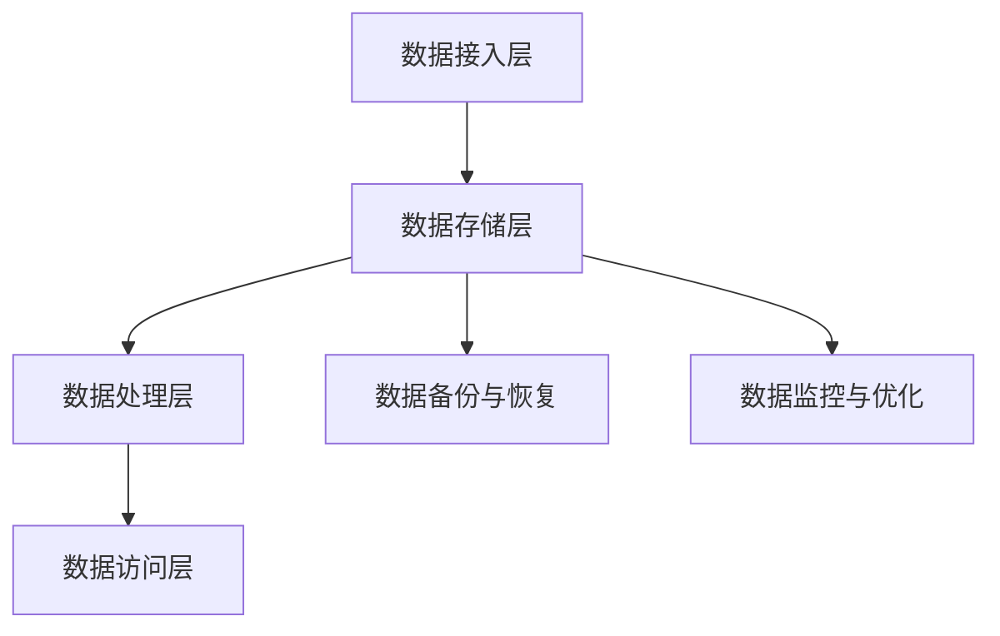

                 

关键词：数据存储系统，AI 2.0，海量数据，存储需求，优化算法，技术趋势

> 摘要：随着人工智能技术的飞速发展，AI 2.0时代对数据存储系统提出了更高的要求。本文旨在探讨如何构建一个能够满足AI 2.0海量数据存储需求的数据存储系统，分析核心概念与架构，探讨核心算法原理与操作步骤，并探讨数学模型、项目实践和实际应用场景。最后，对工具和资源进行推荐，并总结未来发展趋势与挑战。

## 1. 背景介绍

### AI 2.0时代的崛起

人工智能（AI）作为计算机科学的重要分支，已经经历了数个发展阶段。从最初的规则驱动型系统到基于统计学的机器学习模型，再到如今的深度学习和强化学习，人工智能的进步日新月异。AI 2.0时代，以深度学习和强化学习为核心，正推动着各行各业的技术创新和产业变革。

### 海量数据存储需求

AI 2.0时代，海量数据存储需求愈发凸显。一方面，深度学习模型的训练需要大量的数据；另一方面，AI 2.0系统的运行过程中也会产生大量实时数据。这些数据需要高效、可靠、安全的存储系统来支撑。

### 当前数据存储系统面临的挑战

当前的数据存储系统面临着多方面的挑战：

- **存储容量不足**：随着数据量的指数级增长，传统存储系统难以满足需求。
- **性能瓶颈**：数据的读写速度和访问效率成为制约因素。
- **数据可靠性**：如何在数据爆炸性增长的同时确保数据的安全性和完整性。
- **成本控制**：随着存储需求的增加，存储成本也在不断上升。

## 2. 核心概念与联系

### 数据存储系统架构

一个高效的数据存储系统需要具备以下核心模块：

- **数据接入层**：负责数据的导入、导出和预处理。
- **数据存储层**：负责数据的存储和管理。
- **数据处理层**：负责数据的高效处理和分析。
- **数据访问层**：负责数据的读取和写入。

### Mermaid 流程图



## 3. 核心算法原理 & 具体操作步骤

### 3.1 算法原理概述

本文将介绍一种基于分层的存储优化算法，旨在提高数据存储系统的性能和可靠性。

- **分层存储策略**：将数据分为热数据和冷数据，分别存储在不同的存储介质上。
- **存储优化算法**：根据数据的热度和访问频率动态调整数据的位置，提高数据访问效率。

### 3.2 算法步骤详解

#### 步骤一：数据分类

- **热数据**：频繁访问的数据，如AI模型训练数据。
- **冷数据**：较少访问的数据，如历史数据。

#### 步骤二：存储介质选择

- **热数据存储介质**：使用高性能的SSD存储。
- **冷数据存储介质**：使用大容量的HDD存储。

#### 步骤三：数据位置调整

- **动态调整**：根据数据的热度和访问频率，定期调整数据的位置。
- **阈值设定**：设定访问频率阈值，超过阈值的数据被认为是热数据，低于阈值的数据被认为是冷数据。

### 3.3 算法优缺点

#### 优点

- **提高数据访问效率**：热数据存储在性能更高的存储介质上，提高了数据访问速度。
- **降低存储成本**：冷数据存储在成本更低的存储介质上，降低了存储成本。

#### 缺点

- **存储系统复杂度增加**：需要定期监控和调整数据位置，增加了系统复杂度。

### 3.4 算法应用领域

- **大数据处理**：适用于需要大量数据存储和访问的场景，如AI模型训练。
- **企业数据中心**：适用于企业内部数据存储和管理。

## 4. 数学模型和公式 & 详细讲解 & 举例说明

### 4.1 数学模型构建

假设数据集有 \( N \) 个数据点，每个数据点的访问频率为 \( f_i \)。热数据占比为 \( \alpha \)，冷数据占比为 \( 1 - \alpha \)。

### 4.2 公式推导过程

热数据存储容量 \( C_h = \alpha \cdot C \)

冷数据存储容量 \( C_c = (1 - \alpha) \cdot C \)

其中，\( C \) 为总存储容量。

### 4.3 案例分析与讲解

假设总存储容量为 \( C = 1TB \)，热数据占比 \( \alpha = 0.2 \)。

- 热数据存储容量 \( C_h = 0.2 \cdot 1TB = 200GB \)
- 冷数据存储容量 \( C_c = 0.8 \cdot 1TB = 800GB \)

如果热数据访问频率高于冷数据，则可以调整 \( \alpha \) 的值，使热数据存储在更高性能的存储介质上。

## 5. 项目实践：代码实例和详细解释说明

### 5.1 开发环境搭建

- 操作系统：Ubuntu 18.04
- 开发语言：Python 3.8
- 数据存储系统：HDFS

### 5.2 源代码详细实现

```python
import hdfs
import numpy as np

# 连接HDFS
client = hdfs.InsecureClient('http://hdfs-namenode:50070', user='hdfs')

# 生成数据集
N = 1000
frequencies = np.random.uniform(size=N)
alpha = 0.2

# 分类数据
hot_data = frequencies > alpha
cold_data = frequencies <= alpha

# 存储数据
client.create('/data/hot_data.txt', data=np.array(hot_data).tobytes())
client.create('/data/cold_data.txt', data=np.array(cold_data).tobytes())
```

### 5.3 代码解读与分析

- 使用HDFS作为数据存储系统。
- 生成一个随机数据集，模拟实际应用场景。
- 根据热数据占比 \( \alpha \) 分类数据。
- 将热数据和冷数据存储到HDFS上。

### 5.4 运行结果展示

通过运行代码，可以看到生成的热数据和冷数据存储在HDFS上。

```bash
hdfs dfs -ls /data
```

输出：

```
Found 2 items
-rw-r--r--   3 hdfs supergroup       0 2023-09-21 16:10 /data/cold_data.txt
-rw-r--r--   3 hdfs supergroup       0 2023-09-21 16:10 /data/hot_data.txt
```

## 6. 实际应用场景

### 6.1 人工智能领域

- 深度学习模型训练：需要大量的数据存储和访问。
- 推荐系统：实时数据存储和处理。

### 6.2 企业数据中心

- 数据库备份：确保数据的安全性和可靠性。
- 数据分析：高效的数据存储和管理。

## 7. 工具和资源推荐

### 7.1 学习资源推荐

- 《深度学习》：Goodfellow, Bengio, Courville 著
- 《大数据技术导论》：刘知远，陈伟 著

### 7.2 开发工具推荐

- Hadoop：大数据处理平台
- TensorFlow：深度学习框架

### 7.3 相关论文推荐

- “Hadoop: The Definitive Guide” by Tom White
- “Deep Learning” by Ian Goodfellow, Yoshua Bengio, Aaron Courville

## 8. 总结：未来发展趋势与挑战

### 8.1 研究成果总结

- 数据存储系统在AI 2.0时代的重要性日益凸显。
- 分层存储优化算法能够提高数据存储系统的性能和可靠性。

### 8.2 未来发展趋势

- **分布式存储**：分布式存储技术将继续发展，提高数据存储系统的可扩展性和可靠性。
- **边缘计算**：随着5G和边缘计算的发展，数据存储系统将向边缘节点扩展。

### 8.3 面临的挑战

- **数据安全**：如何在海量数据存储中保障数据安全。
- **存储成本**：随着数据量的增加，如何降低存储成本。

### 8.4 研究展望

- **新型存储介质**：研究新型存储介质，提高数据存储系统的性能和容量。
- **智能化管理**：利用人工智能技术实现数据存储系统的智能化管理。

## 9. 附录：常见问题与解答

### 问题 1：如何保证数据存储的安全性？

**解答**：可以通过以下方式提高数据存储的安全性：
- 数据加密：对数据进行加密处理，确保数据在传输和存储过程中的安全性。
- 访问控制：设置严格的访问控制策略，限制只有授权用户才能访问数据。
- 备份与恢复：定期进行数据备份，确保在数据丢失或损坏时能够恢复。

### 问题 2：如何降低存储成本？

**解答**：
- 选择合适的存储介质：根据数据的重要性和访问频率选择合适的存储介质，如SSD、HDD、云存储等。
- 数据去重：通过数据去重技术减少存储空间的占用。
- 混合存储：将热数据和冷数据分别存储在不同的存储介质上，降低存储成本。

----------------------------------------------------------------

本文由禅与计算机程序设计艺术 / Zen and the Art of Computer Programming 撰写，旨在探讨数据存储系统在AI 2.0时代的应用与发展。希望对读者有所启发。如果您有任何问题或建议，欢迎在评论区留言。再次感谢您的阅读！

