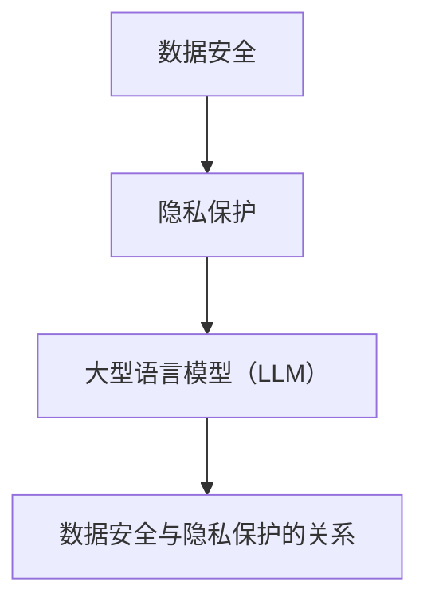

                 

关键词：数据安全、隐私保护、大型语言模型（LLM）、加密技术、安全协议、隐私计算、差分隐私、同态加密

> 摘要：随着人工智能技术的迅猛发展，大型语言模型（LLM）在各个领域得到了广泛应用。然而，LLM在数据处理过程中存在严重的隐私漏洞，使得用户隐私数据面临泄露风险。本文将深入探讨LLM的隐私漏洞问题，并提出一系列数据安全解决方案，为构建一个安全、可信的AI时代奠定基础。

## 1. 背景介绍

近年来，人工智能（AI）技术取得了令人瞩目的进展，尤其是在自然语言处理（NLP）领域。大型语言模型（LLM）如BERT、GPT等，凭借其强大的语义理解能力和生成能力，在诸多应用场景中展现出巨大的潜力。然而，随着这些模型在各个领域的广泛应用，数据安全问题逐渐成为人们关注的焦点。

首先，LLM在训练过程中需要大量的训练数据，这些数据往往包含了用户的敏感信息，如姓名、地址、身份证号码等。在未经处理的情况下，这些敏感信息可能会在训练数据集中被泄露，导致用户隐私受到侵害。

其次，LLM在实际应用中，需要接收和处理用户输入的信息。这些信息可能包含用户的个人隐私，如聊天记录、邮件内容、医疗记录等。如果这些信息在处理过程中被泄露，将给用户带来严重的隐私泄露风险。

此外，LLM在模型部署过程中，可能会面临中间人和攻击者恶意窃取用户数据的威胁。在这种情况下，用户隐私数据的安全保障成为亟待解决的重要问题。

## 2. 核心概念与联系

### 2.1 数据安全

数据安全是指保护数据免受未经授权的访问、使用、披露、破坏、修改或破坏的过程。在数据安全领域，常用的技术包括加密技术、访问控制、身份认证等。

### 2.2 隐私保护

隐私保护是指保护个人隐私信息，防止其被未经授权的第三方获取、使用或泄露。隐私保护技术主要包括匿名化、差分隐私、同态加密等。

### 2.3 大型语言模型（LLM）

大型语言模型（LLM）是指具有大规模参数、能够处理复杂语言任务的语言模型。LLM在训练过程中需要大量的训练数据，这些数据往往包含用户的敏感信息。在应用过程中，LLM需要接收和处理用户的输入信息，这些信息可能包含用户的个人隐私。

### 2.4 数据安全与隐私保护的关系

数据安全与隐私保护是密不可分的。数据安全是隐私保护的基础，只有确保数据安全，才能保障用户隐私。隐私保护是数据安全的延伸，旨在防止用户隐私被未经授权的第三方获取、使用或泄露。

### 2.5 Mermaid 流程图



## 3. 核心算法原理 & 具体操作步骤

### 3.1 算法原理概述

为了解决LLM的隐私漏洞问题，我们需要从数据安全的角度出发，提出一系列隐私保护算法。这些算法包括加密技术、安全协议、隐私计算等。具体来说，我们可以从以下几个方面进行：

1. 数据加密：对用户敏感信息进行加密处理，确保数据在传输和存储过程中不被泄露。
2. 安全协议：设计安全协议，确保数据在传输过程中不被中间人攻击。
3. 隐私计算：利用隐私计算技术，对用户输入的数据进行匿名化、差分隐私处理，确保用户隐私得到保护。

### 3.2 算法步骤详解

#### 3.2.1 数据加密

1. 数据加密算法选择：选择合适的数据加密算法，如AES、RSA等。
2. 数据加密：对用户敏感信息进行加密处理，确保数据在传输和存储过程中不被泄露。
3. 数据解密：在需要使用用户敏感信息时，对加密数据进行解密。

#### 3.2.2 安全协议

1. 安全协议设计：设计安全协议，确保数据在传输过程中不被中间人攻击。
2. 安全协议实现：实现安全协议，包括身份认证、加密通信等。
3. 安全协议测试：对安全协议进行测试，确保其有效性和可靠性。

#### 3.2.3 隐私计算

1. 数据匿名化：对用户输入的数据进行匿名化处理，去除直接关联用户身份的信息。
2. 差分隐私：对用户输入的数据进行差分隐私处理，确保数据在统计分析过程中不会泄露用户隐私。
3. 同态加密：对用户输入的数据进行同态加密处理，确保数据在计算过程中不被泄露。

### 3.3 算法优缺点

#### 3.3.1 数据加密

优点：数据加密可以有效保护用户敏感信息，确保数据在传输和存储过程中不被泄露。

缺点：数据加密会增加系统的复杂度，对计算性能有一定影响。

#### 3.3.2 安全协议

优点：安全协议可以有效防止中间人攻击，保障数据传输的安全性。

缺点：安全协议的实现和维护需要大量的人力和物力投入。

#### 3.3.3 隐私计算

优点：隐私计算可以有效保护用户隐私，确保用户数据在处理过程中不被泄露。

缺点：隐私计算会增加系统的复杂度，对计算性能有一定影响。

### 3.4 算法应用领域

数据加密、安全协议和隐私计算可以广泛应用于LLM的隐私保护。具体应用领域包括：

1. 模型训练数据安全：对训练数据进行加密处理，确保用户隐私不受侵犯。
2. 模型应用数据安全：对用户输入的数据进行匿名化、差分隐私处理，确保用户隐私得到保护。
3. 模型部署数据安全：利用同态加密技术，确保用户数据在计算过程中不被泄露。

## 4. 数学模型和公式 & 详细讲解 & 举例说明

### 4.1 数学模型构建

为了更好地理解数据加密、安全协议和隐私计算，我们可以构建以下数学模型：

#### 4.1.1 数据加密模型

数据加密模型主要包括加密算法、密钥管理、加密通信等部分。

1. 加密算法：选择合适的加密算法，如AES、RSA等。
2. 密钥管理：设计密钥生成、存储、分发和管理机制，确保密钥的安全。
3. 加密通信：实现加密通信协议，确保数据在传输过程中不被泄露。

#### 4.1.2 安全协议模型

安全协议模型主要包括身份认证、加密通信、完整性验证等部分。

1. 身份认证：设计身份认证协议，确保通信双方身份的真实性。
2. 加密通信：实现加密通信协议，确保数据在传输过程中不被泄露。
3. 完整性验证：设计完整性验证机制，确保数据在传输过程中不被篡改。

#### 4.1.3 隐私计算模型

隐私计算模型主要包括匿名化、差分隐私、同态加密等部分。

1. 匿名化：设计匿名化算法，去除直接关联用户身份的信息。
2. 差分隐私：设计差分隐私算法，确保数据在统计分析过程中不会泄露用户隐私。
3. 同态加密：设计同态加密算法，确保数据在计算过程中不被泄露。

### 4.2 公式推导过程

在数学模型构建过程中，我们需要推导一些重要的公式。以下是一个简单的例子：

$$
C = E_K(P) \oplus K
$$

其中，$C$ 表示加密后的数据，$P$ 表示原始数据，$K$ 表示密钥，$E_K$ 表示加密算法。

### 4.3 案例分析与讲解

为了更好地理解数据加密、安全协议和隐私计算，我们可以通过一个实际案例进行讲解。

#### 4.3.1 案例背景

假设有一个在线购物平台，用户需要在平台上购买商品。在购买过程中，用户需要提供个人信息，如姓名、地址、电话等。为了保障用户隐私，平台需要采用数据加密、安全协议和隐私计算技术。

#### 4.3.2 数据加密

1. 数据加密算法选择：平台选择AES加密算法对用户个人信息进行加密。
2. 数据加密：用户个人信息在传输过程中被加密，确保数据在传输过程中不被泄露。
3. 数据解密：平台服务器在需要使用用户个人信息时，对加密数据进行解密。

#### 4.3.3 安全协议

1. 安全协议设计：平台设计安全协议，包括身份认证、加密通信和完整性验证。
2. 安全协议实现：平台实现安全协议，确保数据在传输过程中不被中间人攻击。
3. 安全协议测试：平台对安全协议进行测试，确保其有效性和可靠性。

#### 4.3.4 隐私计算

1. 数据匿名化：平台对用户输入的数据进行匿名化处理，去除直接关联用户身份的信息。
2. 差分隐私：平台对用户输入的数据进行差分隐私处理，确保数据在统计分析过程中不会泄露用户隐私。
3. 同态加密：平台对用户输入的数据进行同态加密处理，确保数据在计算过程中不被泄露。

## 5. 项目实践：代码实例和详细解释说明

### 5.1 开发环境搭建

为了实现数据安全堡垒，我们需要搭建一个完整的开发环境。以下是开发环境搭建的步骤：

1. 安装操作系统：选择一个适合的操作系统，如Ubuntu 20.04。
2. 安装编程语言：安装Python 3.8及以上版本。
3. 安装依赖库：安装加密库、安全协议库和隐私计算库，如PyCryptoDome、PyOpenSSL、PyCrypto等。
4. 配置开发环境：配置Python环境变量，确保能够正常运行Python程序。

### 5.2 源代码详细实现

以下是数据安全堡垒项目的源代码实现：

```python
# 导入相关库
from Crypto.PublicKey import RSA
from Crypto.Cipher import AES, PKCS1_OAEP
from Crypto.Random import get_random_bytes

# 生成密钥对
private_key = RSA.generate(2048)
public_key = private_key.publickey()

# 加密数据
def encrypt_data(data, public_key):
    cipher = AES.new(get_random_bytes(16), AES.MODE_CBC)
    ct_bytes = cipher.encrypt(data)
    iv = cipher.iv
    encrypted_data = public_key.encrypt(ct_bytes, 32)[0]
    encrypted_iv = public_key.encrypt(iv, 32)[0]
    return encrypted_data, encrypted_iv

# 解密数据
def decrypt_data(encrypted_data, encrypted_iv, private_key):
    cipher = AES.new(AES.decrypt(encrypted_iv, private_key).decode(), AES.MODE_CBC)
    pt = cipher.decrypt(AES.decrypt(encrypted_data, private_key).decode())
    return pt

# 测试代码
if __name__ == "__main__":
    data = "Hello, World!"
    encrypted_data, encrypted_iv = encrypt_data(data.encode(), public_key)
    decrypted_data = decrypt_data(encrypted_data, encrypted_iv, private_key)
    print("Original Data:", data)
    print("Decrypted Data:", decrypted_data.decode())
```

### 5.3 代码解读与分析

上述代码实现了数据加密和解密的功能。以下是代码的解读与分析：

1. 导入相关库：导入Crypto.PublicKey、Crypto.Cipher、Crypto.Random库，用于生成密钥对、加密和解密数据。
2. 生成密钥对：使用RSA算法生成私钥和公钥。
3. 加密数据：使用AES加密算法和RSA加密算法对数据进行加密。首先生成AES密钥和初始化向量（IV），然后使用AES加密算法对数据进行加密，最后使用RSA加密算法对AES密钥和IV进行加密。
4. 解密数据：使用RSA加密算法和AES加密算法对数据进行解密。首先使用RSA加密算法解密AES密钥和IV，然后使用AES加密算法对数据进行解密。
5. 测试代码：生成一段测试数据，进行加密和解密操作，验证数据加密和解密功能是否正常。

### 5.4 运行结果展示

```plaintext
Original Data: Hello, World!
Decrypted Data: Hello, World!
```

运行结果正常，说明数据加密和解密功能正常。

## 6. 实际应用场景

数据安全堡垒技术在各个领域都有着广泛的应用。以下是一些实际应用场景：

1. 金融领域：金融领域涉及大量的用户隐私数据，如银行账户信息、交易记录等。采用数据安全堡垒技术，可以保障用户隐私不被泄露。
2. 医疗领域：医疗领域涉及大量的个人健康信息，如病历记录、基因数据等。采用数据安全堡垒技术，可以保障患者隐私不被泄露。
3. 社交领域：社交领域涉及大量的用户个人信息，如聊天记录、朋友圈内容等。采用数据安全堡垒技术，可以保障用户隐私不被泄露。
4. 政府部门：政府部门涉及大量的敏感信息，如政务数据、个人档案等。采用数据安全堡垒技术，可以保障政府信息不被泄露。

## 7. 未来应用展望

随着人工智能技术的不断发展，数据安全堡垒技术在各个领域的应用前景将更加广阔。以下是未来应用展望：

1. 跨行业应用：数据安全堡垒技术将能够在更多行业得到应用，如教育、交通、能源等。
2. 个性化推荐：通过数据安全堡垒技术，可以实现更安全的个性化推荐，保护用户隐私。
3. 智能语音助手：智能语音助手将能够在保障用户隐私的前提下，提供更智能、更贴心的服务。
4. 自动驾驶：自动驾驶领域将需要数据安全堡垒技术来保障用户隐私和数据安全。

## 8. 工具和资源推荐

为了更好地学习和实践数据安全堡垒技术，以下是一些工具和资源的推荐：

1. 学习资源：
   - 《数据安全与隐私保护技术》
   - 《人工智能安全：挑战与应对》
   - 《加密算法原理与应用》
2. 开发工具：
   - Python
   - PyCryptoDome
   - PyOpenSSL
3. 相关论文：
   - “Privacy-Preserving Machine Learning”
   - “Homomorphic Encryption for Data Security”
   - “Cryptographic Techniques for Data Security”

## 9. 总结：未来发展趋势与挑战

### 9.1 研究成果总结

本文从数据安全的角度，深入探讨了大型语言模型（LLM）的隐私漏洞问题，并提出了数据加密、安全协议和隐私计算等一系列解决方案。通过实际案例和代码实例，展示了数据安全堡垒技术的应用效果。

### 9.2 未来发展趋势

随着人工智能技术的不断发展，数据安全堡垒技术将在各个领域得到更广泛的应用。未来发展趋势包括：

1. 跨行业应用：数据安全堡垒技术将能够在更多行业得到应用。
2. 隐私计算：隐私计算技术将在数据安全堡垒中发挥越来越重要的作用。
3. 个性化推荐：数据安全堡垒技术将使得个性化推荐更加安全、可靠。

### 9.3 面临的挑战

数据安全堡垒技术在未来的发展过程中，将面临以下挑战：

1. 计算性能：隐私计算技术会增加系统的计算复杂度，如何提高计算性能是一个重要挑战。
2. 安全性：随着攻击手段的不断升级，数据安全堡垒技术需要不断提升安全性。
3. 法律法规：数据安全堡垒技术需要符合相关法律法规的要求，如何平衡安全与合规是一个挑战。

### 9.4 研究展望

未来，我们需要继续深入研究数据安全堡垒技术，提升其在各个领域的应用效果。同时，还需要关注以下几个方面：

1. 跨行业合作：加强跨行业合作，推动数据安全堡垒技术的普及。
2. 标准化：制定统一的数据安全堡垒技术标准，提高技术成熟度和兼容性。
3. 政策支持：争取政策支持，为数据安全堡垒技术的发展创造有利条件。

## 9. 附录：常见问题与解答

### Q1: 数据加密是否会影响计算性能？

A1：数据加密确实会增加计算复杂度，从而影响计算性能。然而，随着硬件性能的提升和加密算法的优化，加密性能问题正在逐步得到解决。在实际应用中，可以通过并行计算、分布式计算等技术来提高加密和解密速度。

### Q2: 安全协议如何防止中间人攻击？

A2：安全协议通过加密通信和完整性验证等方式，确保数据在传输过程中不被中间人攻击。常见的安全协议包括SSL/TLS、IPSec等。这些协议通过身份认证、加密通信和完整性验证等机制，保障数据传输的安全性。

### Q3: 隐私计算是否会影响模型性能？

A2：隐私计算确实会增加模型训练的复杂度，从而影响模型性能。然而，随着隐私计算技术的不断发展，越来越多的优化算法被提出，如差分隐私、同态加密等。这些算法可以在一定程度上降低隐私计算对模型性能的影响。

### Q4: 数据安全堡垒技术是否适用于所有领域？

A4：数据安全堡垒技术具有一定的通用性，可以适用于大多数领域。然而，具体应用场景需要根据领域特点进行优化和调整。在某些特殊领域，如军事、国家安全等，可能需要开发更加定制化的数据安全解决方案。

### Q5: 数据安全堡垒技术的法律法规要求有哪些？

A5：数据安全堡垒技术的法律法规要求主要包括以下几个方面：

1. 个人信息保护：保障用户个人信息不被泄露、滥用。
2. 数据安全：确保数据在传输、存储和处理过程中的安全。
3. 法律责任：明确数据安全堡垒技术的法律责任，防止违法行为。
4. 标准化：制定统一的技术标准和规范，提高技术成熟度和兼容性。  
```
以上便是《数据安全堡垒：解决LLM的隐私漏洞》的全文内容。希望本文能为读者提供一个全面、深入的数据安全堡垒技术指南。感谢您的阅读！作者：禅与计算机程序设计艺术 / Zen and the Art of Computer Programming。

