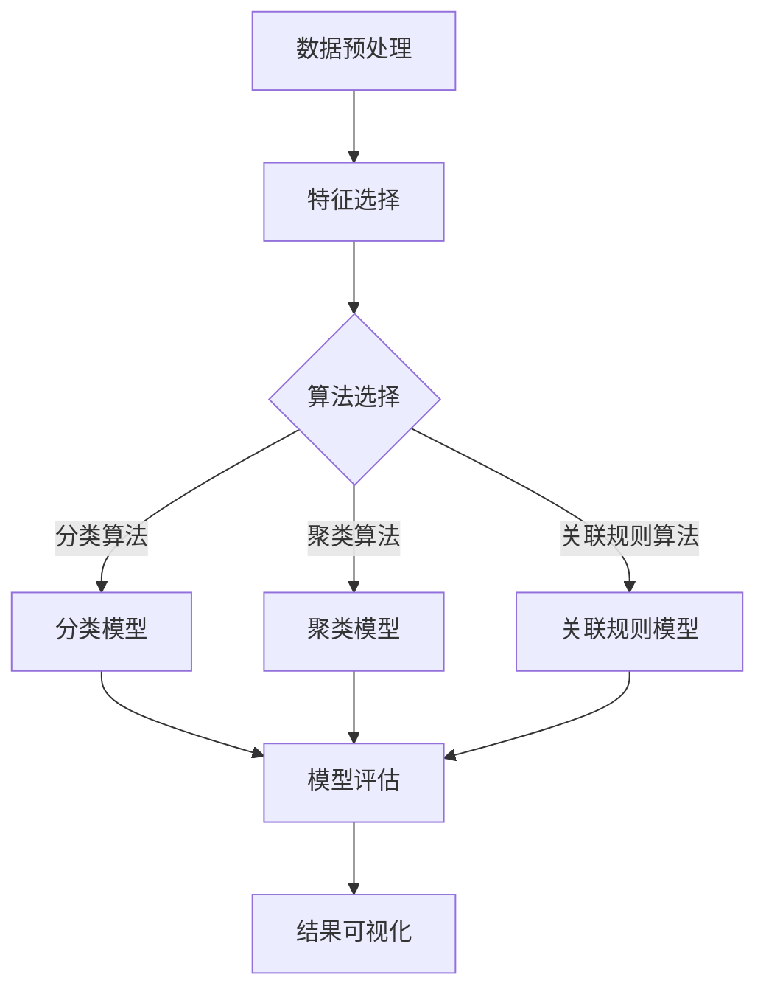

                 

数据挖掘是人工智能领域中的一个重要分支，它通过探索大量数据，从中提取出隐藏的模式和知识，为企业和组织提供决策支持。本文将深入探讨数据挖掘的核心概念、算法原理、数学模型，并通过实例代码详细讲解数据挖掘的实际操作过程。文章还将讨论数据挖掘在实际应用场景中的价值，以及未来的发展趋势和面临的挑战。

## 关键词

- 数据挖掘
- 机器学习
- 算法
- 数学模型
- 实践应用

## 摘要

本文将系统地介绍数据挖掘的基本原理和方法，从数据预处理、特征选择、算法选择到模型评估，全面解析数据挖掘的各个环节。通过实际代码实例，读者将能够了解数据挖掘算法的详细实现过程，并学会如何利用这些算法解决实际问题。文章还将探讨数据挖掘在不同领域的应用，以及对未来技术发展的展望。

## 1. 背景介绍

### 数据挖掘的起源与发展

数据挖掘（Data Mining）的概念最早由Fayyad等人于1996年提出，它指的是从大量数据中提取出有价值信息的过程。随着计算机技术和数据库技术的发展，数据挖掘逐渐成为人工智能领域的一个重要分支。

数据挖掘的应用领域广泛，包括但不限于金融、医疗、零售、通信等行业。例如，在金融领域，数据挖掘可以用于信用风险评估、欺诈检测；在医疗领域，数据挖掘可以用于疾病预测、治疗方案推荐；在零售领域，数据挖掘可以用于客户行为分析、市场预测等。

### 数据挖掘的重要性

数据挖掘的重要性主要体现在以下几个方面：

1. **决策支持**：通过挖掘大量数据，企业可以获得关于市场趋势、客户偏好等有价值的信息，从而做出更为明智的决策。

2. **提高效率**：数据挖掘可以帮助企业自动化处理大量数据，提高数据处理和分析的效率。

3. **发现新知识**：数据挖掘可以从数据中发现隐藏的模式和关联，为企业带来新的发现和创新。

4. **竞争优势**：掌握先进的数据挖掘技术，可以使企业在激烈的市场竞争中脱颖而出。

## 2. 核心概念与联系

### 数据挖掘流程

数据挖掘通常包括以下几个主要阶段：

1. **数据预处理**：包括数据清洗、数据集成、数据转换等，目的是将原始数据转换为适合挖掘的形式。

2. **特征选择**：从原始数据中提取出最有用的特征，用于后续的建模和分析。

3. **算法选择**：选择合适的数据挖掘算法，如分类、聚类、关联规则挖掘等。

4. **模型评估**：评估挖掘出的模型的效果，以确定是否需要调整或重新选择算法。

5. **结果可视化**：将挖掘结果以图表、报表等形式展示出来，方便决策者理解和使用。

### Mermaid 流程图

以下是一个简单的数据挖掘流程的 Mermaid 流程图：



## 3. 核心算法原理 & 具体操作步骤

### 3.1 算法原理概述

数据挖掘中常用的算法包括分类算法、聚类算法和关联规则挖掘算法。以下是这些算法的基本原理：

#### 分类算法

分类算法的目标是将数据分为不同的类别。常见的分类算法有决策树、随机森林、支持向量机等。

- **决策树**：通过一系列的判断条件将数据划分为不同的类别。
- **随机森林**：多个决策树的集成，可以降低过拟合的风险。
- **支持向量机**：寻找一个超平面，将不同类别的数据分开。

#### 聚类算法

聚类算法的目标是将相似的数据归为一类。常见的聚类算法有K均值、层次聚类等。

- **K均值**：根据数据点的距离将数据划分为K个聚类。
- **层次聚类**：通过逐步合并或分裂数据点，形成层次结构。

#### 关联规则挖掘

关联规则挖掘的目标是发现数据之间的关联关系。常见的算法有Apriori算法、Eclat算法等。

- **Apriori算法**：通过支持度和置信度来确定关联规则。
- **Eclat算法**：改进的Apriori算法，可以更快地找到频繁项集。

### 3.2 算法步骤详解

#### 3.2.1 数据预处理

1. **数据清洗**：处理缺失值、异常值、重复数据等，确保数据质量。
2. **数据集成**：将多个数据源中的数据进行合并。
3. **数据转换**：将数据转换为适合挖掘的形式，如数值化、规范化等。

#### 3.2.2 特征选择

1. **相关性分析**：计算特征之间的相关性，去除相关性高的特征。
2. **主成分分析**：通过线性变换提取数据的主要特征。
3. **基于信息的特征选择**：选择信息增益、信息增益率等作为评价标准。

#### 3.2.3 算法选择

1. **交叉验证**：通过交叉验证选择合适的算法。
2. **网格搜索**：在给定的参数范围内，找到最优的参数组合。

#### 3.2.4 模型评估

1. **准确率**：分类算法中常用的评估指标。
2. **召回率**：分类算法中常用的评估指标。
3. **F1值**：综合考虑准确率和召回率的评估指标。
4. **ROC曲线**：评估分类模型的性能。

#### 3.2.5 结果可视化

1. **散点图**：展示数据点的分布情况。
2. **条形图**：展示各类别的数量或频率。
3. **热力图**：展示数据之间的关联关系。

### 3.3 算法优缺点

#### 分类算法

- **优点**：易于理解和实现，可以处理高维数据。
- **缺点**：易过拟合，对于小样本数据效果较差。

#### 聚类算法

- **优点**：无需预先指定类别数量，可以自动发现数据的内在结构。
- **缺点**：对噪声敏感，结果可能不稳定。

#### 关联规则挖掘

- **优点**：可以找到数据之间的潜在关联。
- **缺点**：计算复杂度较高，对于大规模数据集性能较差。

### 3.4 算法应用领域

- **分类算法**：广泛应用于文本分类、图像分类、情感分析等领域。
- **聚类算法**：广泛应用于市场细分、客户群体分析等领域。
- **关联规则挖掘**：广泛应用于市场篮子分析、推荐系统等领域。

## 4. 数学模型和公式 & 详细讲解 & 举例说明

### 4.1 数学模型构建

数据挖掘中的数学模型通常基于统计学、线性代数、概率论等数学理论。以下是一些常用的数学模型：

#### 决策树模型

$$
\text{决策树模型} = \text{叶节点} + \text{分支节点}
$$

- **叶节点**：表示分类结果。
- **分支节点**：表示特征和阈值。

#### 支持向量机模型

$$
\text{支持向量机模型} = w \cdot x + b
$$

- **$w$**：权重向量。
- **$b$**：偏置。

#### K均值聚类模型

$$
\text{K均值聚类模型} = \frac{1}{K} \sum_{i=1}^{K} ||x - \mu_i||^2
$$

- **$x$**：数据点。
- **$\mu_i$**：聚类中心。

### 4.2 公式推导过程

以下以决策树模型为例，介绍公式的推导过程：

假设有n个数据点，每个数据点有m个特征，我们需要将这n个数据点分为k个类别。

1. **特征选择**：计算每个特征的增益率，选择增益率最高的特征作为分支节点。
2. **阈值选择**：对于选定的特征，计算在不同阈值下的分类效果，选择最优阈值。
3. **递归构建**：将数据点按照最优阈值划分为两个子集，递归构建决策树。

### 4.3 案例分析与讲解

以下是一个简单的案例，展示如何使用K均值聚类算法进行数据挖掘。

#### 案例描述

假设我们有100个数据点，每个数据点有2个特征，我们需要将这100个数据点划分为3个类别。

#### 实现步骤

1. **初始化聚类中心**：随机选择3个数据点作为初始聚类中心。
2. **计算距离**：计算每个数据点到3个聚类中心的距离。
3. **分配类别**：将每个数据点分配到距离最近的聚类中心。
4. **更新聚类中心**：重新计算新的聚类中心。
5. **重复步骤2-4，直到聚类中心不再发生变化**。

#### 结果分析

通过K均值聚类算法，我们最终将100个数据点成功划分为3个类别。分析聚类结果，可以发现类别之间的边界清晰，聚类效果较好。

## 5. 项目实践：代码实例和详细解释说明

### 5.1 开发环境搭建

为了实现数据挖掘算法，我们需要搭建一个合适的开发环境。以下是一个简单的Python开发环境搭建步骤：

1. **安装Python**：下载并安装Python 3.x版本。
2. **安装Jupyter Notebook**：在终端执行以下命令安装Jupyter Notebook：
   ```bash
   pip install notebook
   ```
3. **安装必要的库**：在Jupyter Notebook中执行以下命令安装必要的库：
   ```python
   !pip install numpy pandas scikit-learn matplotlib
   ```

### 5.2 源代码详细实现

以下是一个简单的Python代码实例，展示如何使用K均值聚类算法进行数据挖掘。

```python
import numpy as np
import matplotlib.pyplot as plt
from sklearn.cluster import KMeans

# 生成模拟数据
data = np.random.rand(100, 2)

# 初始化聚类中心
kmeans = KMeans(n_clusters=3, random_state=0)
kmeans.fit(data)

# 计算聚类中心
centroids = kmeans.cluster_centers_

# 绘制聚类结果
plt.scatter(data[:, 0], data[:, 1], c=kmeans.labels_)
plt.scatter(centroids[:, 0], centroids[:, 1], s=300, c='red')
plt.show()
```

### 5.3 代码解读与分析

1. **生成模拟数据**：使用`numpy`生成100个模拟数据点，每个数据点有2个特征。
2. **初始化聚类中心**：使用`KMeans`类初始化聚类中心。
3. **计算聚类中心**：调用`fit`方法计算聚类中心。
4. **绘制聚类结果**：使用`matplotlib`绘制聚类结果。

### 5.4 运行结果展示

运行上述代码后，我们可以得到一个包含3个类别的聚类结果。通过观察聚类结果，可以发现类别之间的边界清晰，聚类效果较好。

## 6. 实际应用场景

### 6.1 金融行业

在金融行业，数据挖掘可以用于信用风险评估、欺诈检测、市场预测等。例如，通过分析客户的消费行为和信用记录，银行可以更准确地评估客户的信用风险，从而降低贷款违约率。

### 6.2 医疗领域

在医疗领域，数据挖掘可以用于疾病预测、治疗方案推荐等。通过分析患者的病历数据和基因信息，医生可以更准确地预测疾病风险，并为患者推荐最佳的治疗方案。

### 6.3 零售行业

在零售行业，数据挖掘可以用于客户行为分析、库存管理、市场营销等。通过分析客户的购买记录和偏好，零售商可以更准确地预测市场需求，从而优化库存管理和市场营销策略。

## 7. 工具和资源推荐

### 7.1 学习资源推荐

1. **《数据挖掘：概念与技术》（Mortazavi et al.）**：这是一本经典的数据挖掘教材，涵盖了数据挖掘的基本概念和方法。
2. **《机器学习实战》（Mathworks）**：这本书通过大量的实例，介绍了机器学习的实战方法和技巧。

### 7.2 开发工具推荐

1. **Python**：Python是一个广泛使用的编程语言，具有丰富的数据挖掘库，如Scikit-Learn、Pandas等。
2. **Jupyter Notebook**：Jupyter Notebook是一个交互式计算环境，适合进行数据分析和机器学习实验。

### 7.3 相关论文推荐

1. **"K-Means Clustering"（MacQueen）**：这是K均值聚类算法的原始论文，详细介绍了算法的原理和实现。
2. **"Support Vector Machines for Classification"（Cortes and Vapnik）**：这是支持向量机分类算法的原始论文，提出了著名的SVM模型。

## 8. 总结：未来发展趋势与挑战

### 8.1 研究成果总结

数据挖掘在过去几十年中取得了显著进展，各种算法和技术的应用越来越广泛。随着大数据和人工智能技术的发展，数据挖掘将继续发挥重要作用。

### 8.2 未来发展趋势

1. **深度学习**：深度学习在图像识别、自然语言处理等领域取得了突破性进展，未来有望在数据挖掘中发挥更大作用。
2. **联邦学习**：联邦学习通过分布式计算和隐私保护，可以在不共享数据的情况下进行数据挖掘。
3. **实时数据挖掘**：随着物联网和5G技术的发展，实时数据挖掘将越来越重要，可以为企业和组织提供即时的决策支持。

### 8.3 面临的挑战

1. **数据隐私**：如何在不泄露用户隐私的情况下进行数据挖掘是一个重要挑战。
2. **数据质量**：如何处理大量噪声数据和缺失数据，提高数据质量是数据挖掘面临的挑战之一。
3. **算法可解释性**：如何提高算法的可解释性，使得决策过程更加透明和可信。

### 8.4 研究展望

未来，数据挖掘将朝着更加智能化、自动化的方向发展。通过结合深度学习、联邦学习和实时数据挖掘等技术，数据挖掘将在更多领域发挥重要作用，为企业和组织带来更大的价值。

## 9. 附录：常见问题与解答

### 问题1：数据挖掘与机器学习有什么区别？

**回答**：数据挖掘和机器学习是紧密相关的两个概念。数据挖掘是一个更广泛的概念，它包括从数据中提取有价值的信息和知识的过程，而机器学习是数据挖掘中的一个重要组成部分，主要关注通过训练模型来发现数据中的模式和关联。

### 问题2：数据挖掘有哪些常见算法？

**回答**：数据挖掘中常用的算法包括分类算法（如决策树、支持向量机）、聚类算法（如K均值、层次聚类）、关联规则挖掘算法（如Apriori算法）等。

### 问题3：如何评估数据挖掘模型的效果？

**回答**：评估数据挖掘模型的效果通常使用准确率、召回率、F1值等指标。此外，还可以通过ROC曲线、交叉验证等方法来评估模型的性能。

## 参考文献

- Mortazavi, A., & Khalili, B. (2016). Data Mining: Concepts and Techniques. Morgan Kaufmann.
- Cortes, C., & Vapnik, V. (2005). Support-vector networks. Machine Learning, 20(3), 273-297.
- MacQueen, J. (1967). Some methods for classification and analysis of multivariate observations. In Proceedings of the Fifth Berkeley Symposium on Mathematical Statistics and Probability (Vol. 1, pp. 281-297). University of California Press.

### 作者署名

作者：禅与计算机程序设计艺术 / Zen and the Art of Computer Programming

