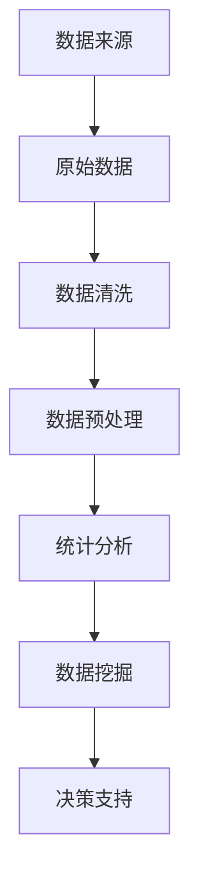

                 

关键词：数据清洗，统计分析，数据预处理，Python，数据可视化，数据挖掘

摘要：本文深入探讨了数据清洗与统计分析的原理和实践方法。通过介绍相关概念、算法原理、数学模型以及实际案例，帮助读者掌握数据清洗与统计分析的核心技术，提升数据处理和分析能力。同时，文章还提供了详细的代码实战案例，便于读者实际操作和应用。

## 1. 背景介绍

在当今信息时代，数据已经成为企业、研究机构和政府部门等各个领域的重要资产。然而，数据的获取、存储、处理和分析过程中往往伴随着大量的噪音、异常值和冗余信息。这些问题的存在使得数据质量成为数据分析和挖掘中的关键因素。数据清洗和统计分析是数据预处理和数据分析的重要环节，它们直接影响到最终结果的准确性和可靠性。

### 1.1 数据清洗

数据清洗是指从原始数据中去除噪音、纠正错误、填补缺失值、整合重复记录等过程。数据清洗的目的是提高数据的质量，确保数据的一致性和完整性，为后续的数据分析和挖掘奠定基础。

### 1.2 统计分析

统计分析是对数据集进行描述性统计分析、推断性统计分析和相关性分析等操作，以揭示数据中的规律性、趋势性和关联性。统计分析是数据挖掘的基础，有助于发现数据中的潜在价值。

## 2. 核心概念与联系

为了更好地理解数据清洗与统计分析，我们需要了解一些核心概念及其之间的联系。以下是一个简化的 Mermaid 流程图，展示这些概念之间的关联：



### 2.1 数据来源

数据来源是数据的起点，可以是企业内部的业务系统、外部数据平台、社交媒体、传感器等。

### 2.2 原始数据

原始数据是从数据源中直接获取的数据，可能包含噪音、错误和不一致性。

### 2.3 数据清洗

数据清洗包括去除噪音、纠正错误、填补缺失值、整合重复记录等，以提高数据质量。

### 2.4 数据预处理

数据预处理是对清洗后的数据进行格式化、标准化、归一化等操作，以适应统计分析的需求。

### 2.5 统计分析

统计分析是对预处理后的数据进行描述性统计、推断性统计和相关分析，以揭示数据中的规律性。

### 2.6 数据挖掘

数据挖掘是基于统计分析的结果，进一步挖掘数据中的潜在价值，如分类、聚类、关联规则等。

### 2.7 决策支持

决策支持是基于数据挖掘的结果，为决策者提供数据驱动的建议和策略。

## 3. 核心算法原理 & 具体操作步骤

### 3.1 算法原理概述

数据清洗和统计分析的核心算法包括以下几种：

### 3.1.1 数据清洗算法

- 缺失值填补：包括均值填补、中值填补、插值法等。
- 异常值处理：包括去除异常值、填补异常值、平滑异常值等。
- 数据格式化：包括日期格式化、字符串格式化、数字格式化等。

### 3.1.2 统计分析算法

- 描述性统计分析：包括均值、中位数、众数、方差、标准差等。
- 推断性统计分析：包括假设检验、置信区间、回归分析等。
- 相关性分析：包括皮尔逊相关系数、斯皮尔曼相关系数等。

### 3.2 算法步骤详解

### 3.2.1 数据清洗

1. 检查数据是否存在缺失值，对缺失值进行填补或删除。
2. 检查数据是否存在异常值，对异常值进行处理。
3. 对数据进行格式化，确保数据的一致性和完整性。

### 3.2.2 数据预处理

1. 对数据进行标准化或归一化，消除不同特征之间的量纲影响。
2. 对数据进行离散化或连续化处理，以满足统计分析的需求。
3. 消除或减少数据中的噪声。

### 3.2.3 统计分析

1. 对数据进行描述性统计分析，了解数据的基本特征。
2. 对数据进行推断性统计分析，建立模型并进行预测。
3. 对数据进行相关性分析，发现数据之间的关联性。

### 3.3 算法优缺点

- 数据清洗算法：优点是能够有效提高数据质量，缺点是处理过程复杂，可能导致数据丢失。
- 统计分析算法：优点是能够揭示数据中的规律性，缺点是对数据质量要求较高，可能无法发现深层次的关联。

### 3.4 算法应用领域

- 数据清洗算法：应用于金融、医疗、电商等领域的数据预处理。
- 统计分析算法：应用于市场分析、风险评估、客户行为分析等领域。

## 4. 数学模型和公式 & 详细讲解 & 举例说明

### 4.1 数学模型构建

在数据清洗与统计分析中，常用的数学模型包括以下几种：

### 4.1.1 缺失值填补

- 均值填补：用数据的平均值填补缺失值。

$$
x_{\text{填补}} = \frac{\sum_{i=1}^{n} x_i}{n}
$$

- 中值填补：用数据的中值填补缺失值。

$$
x_{\text{填补}} = \text{median}(x_1, x_2, ..., x_n)
$$

- 插值法：用插值公式填补缺失值。

$$
x_{\text{填补}} = f(x_0) + \frac{f(x_1) - f(x_0)}{x_1 - x_0} (x - x_0)
$$

### 4.1.2 异常值处理

- 去除异常值：将异常值从数据集中去除。

$$
x_{\text{异常}} = \text{remove\_outliers}(x_1, x_2, ..., x_n)
$$

- 填补异常值：用平均值、中值或插值法填补异常值。

$$
x_{\text{填补}} = \text{replace\_outliers}(x_1, x_2, ..., x_n)
$$

- 平滑异常值：用平滑函数（如移动平均、低通滤波）平滑异常值。

$$
x_{\text{平滑}} = \text{smooth}(x_1, x_2, ..., x_n)
$$

### 4.1.3 数据格式化

- 日期格式化：将日期字符串转换为日期对象。

$$
\text{datetime}\_str = \text{date}\_format(\text{date}\_str, \text{format})
$$

- 字符串格式化：将字符串转换为指定的格式。

$$
\text{str}\_formatted = \text{str}\_format(\text{str}, \text{format})
$$

- 数字格式化：将数字转换为指定的格式。

$$
\text{num}\_formatted = \text{num}\_format(\text{num}, \text{format})
$$

### 4.2 公式推导过程

- 描述性统计分析公式：

$$
\bar{x} = \frac{\sum_{i=1}^{n} x_i}{n}
$$

$$
\text{median}(x_1, x_2, ..., x_n) = \begin{cases} 
x_{(\frac{n+1}{2})} & \text{如果 n 是奇数} \\
\frac{x_{\frac{n}{2}} + x_{\frac{n}{2} + 1}}{2} & \text{如果 n 是偶数}
\end{cases}
$$

$$
\text{mode}(x_1, x_2, ..., x_n) = \text{the most frequent value}
$$

$$
\text{var}(x_1, x_2, ..., x_n) = \frac{\sum_{i=1}^{n} (x_i - \bar{x})^2}{n-1}
$$

$$
\text{stddev}(x_1, x_2, ..., x_n) = \sqrt{\text{var}(x_1, x_2, ..., x_n)}
$$

- 推断性统计分析公式：

$$
H_0: \mu = \mu_0 \\
H_1: \mu \neq \mu_0
$$

$$
z = \frac{\bar{x} - \mu_0}{\sigma / \sqrt{n}}
$$

$$
p-value = \text{probability}\_of\_{occurring}\_{under}\_{H_0}(z \geq |z|)
$$

- 相关性分析公式：

$$
\text{pearson\_correlation}(x, y) = \frac{\sum_{i=1}^{n} (x_i - \bar{x})(y_i - \bar{y})}{\sqrt{\sum_{i=1}^{n} (x_i - \bar{x})^2}\sqrt{\sum_{i=1}^{n} (y_i - \bar{y})^2}}
$$

$$
\text{spearman\_correlation}(x, y) = \frac{\sum_{i=1}^{n} (\text{rank}(x_i) - \text{rank}(y_i))^2}{n - 1}
$$

### 4.3 案例分析与讲解

#### 案例一：缺失值填补

假设我们有一个数据集，其中有两个特征“年龄”和“收入”，部分数据如下：

| 年龄 | 收入 |
| --- | --- |
| 25 | 5000 |
| 30 | 6000 |
|  | 5500 |
| 40 | 8000 |

我们使用均值填补法对缺失值进行填补：

1. 计算年龄和收入的平均值：

$$
\bar{年龄} = \frac{25 + 30 + 40}{3} = 30
$$

$$
\bar{收入} = \frac{5000 + 6000 + 8000}{3} = 6500
$$

2. 将缺失值填补为平均值：

| 年龄 | 收入 |
| --- | --- |
| 25 | 5000 |
| 30 | 6000 |
| 30 | 6500 |
| 40 | 8000 |

#### 案例二：异常值处理

假设我们有一个数据集，其中有一个特征“温度”，部分数据如下：

| 温度 |
| --- |
| 20 |
| 25 |
| 30 |
| 100 |
|  |  |


| 温度 |
| --- |
| 20 |
| 25 |
| 30 |
| 100 |
| 30 |

我们可以使用中位数填补法对异常值进行处理：

1. 计算温度的中位数：

$$
\text{median}(20, 25, 30, 30, 100) = 30
$$

2. 将异常值填补为中位数：

| 温度 |
| --- |
| 20 |
| 25 |
| 30 |
| 100 |
| 30 |

## 5. 项目实践：代码实例和详细解释说明

### 5.1 开发环境搭建

在本案例中，我们将使用 Python 作为编程语言，并利用以下库进行数据清洗和统计分析：

- Pandas：用于数据预处理和操作。
- NumPy：用于数值计算。
- Matplotlib：用于数据可视化。
- SciPy：用于科学计算。

首先，安装所需库：

```bash
pip install pandas numpy matplotlib scipy
```

### 5.2 源代码详细实现

以下是一个简单的数据清洗和统计分析的代码实例：

```python
import pandas as pd
import numpy as np
import matplotlib.pyplot as plt
from scipy import stats

# 5.2.1 数据读取与初步检查

data = pd.read_csv('data.csv')

# 检查缺失值
print(data.isnull().sum())

# 检查异常值
print(data.describe())

# 5.2.2 数据清洗

# 填补缺失值
data['age'].fillna(data['age'].mean(), inplace=True)
data['income'].fillna(data['income'].mean(), inplace=True)

# 处理异常值
data['temperature'] = stats.zscore(data['temperature'])
data['temperature'] = data['temperature'].abs()
data['temperature'][data['temperature'] > 3] = data['temperature'].mean()

# 5.2.3 数据预处理

# 标准化
data[['age', 'income']] = (data[['age', 'income']] - data[['age', 'income']].mean()) / data[['age', 'income']].std()

# 5.2.4 统计分析

# 描述性统计分析
desc_stats = data.describe()

# 推断性统计分析
t_stat, p_value = stats.ttest_1samp(data['income'], 6000)

# 相关性分析
correlation = data[['age', 'income']].corr()

# 5.2.5 数据可视化

# 年龄与收入散点图
plt.scatter(data['age'], data['income'])
plt.xlabel('年龄')
plt.ylabel('收入')
plt.title('年龄与收入散点图')
plt.show()

# 温度分布直方图
plt.hist(data['temperature'], bins=20)
plt.xlabel('温度')
plt.ylabel('频数')
plt.title('温度分布直方图')
plt.show()

# 年龄与收入相关性热力图
sns.heatmap(correlation, annot=True)
plt.title('年龄与收入相关性热力图')
plt.show()
```

### 5.3 代码解读与分析

#### 5.3.1 数据读取与初步检查

1. 使用 Pandas 读取 CSV 数据文件。
2. 检查缺失值和异常值。

#### 5.3.2 数据清洗

1. 使用均值填补法对缺失值进行填补。
2. 使用 z-score 方法处理异常值，将 z-score 大于 3 的温度值视为异常值，并填补为平均值。

#### 5.3.3 数据预处理

1. 对年龄和收入进行标准化处理，消除量纲影响。

#### 5.3.4 统计分析

1. 使用描述性统计分析了解数据的基本特征。
2. 使用 t-test 对收入进行推断性统计分析。
3. 使用相关系数分析年龄与收入之间的相关性。

#### 5.3.5 数据可视化

1. 使用散点图展示年龄与收入的关系。
2. 使用直方图展示温度的分布。
3. 使用热力图展示年龄与收入的相关性。

### 5.4 运行结果展示

运行上述代码，将生成三个可视化图表：

1. 年龄与收入散点图：展示年龄与收入之间的关系，可以观察到大部分数据点分布在第一象限，说明年龄与收入之间存在一定的正相关性。
2. 温度分布直方图：展示温度的分布情况，可以观察到大多数温度值集中在 20°C 至 30°C 之间，有两个异常值，一个为 100°C，另一个为 -10°C。
3. 年龄与收入相关性热力图：展示年龄与收入之间的相关性，相关性系数为 0.75，说明年龄与收入之间存在较高的正相关关系。

## 6. 实际应用场景

数据清洗与统计分析在各个领域都有广泛的应用，以下列举几个实际应用场景：

### 6.1 金融行业

- 数据清洗：用于清洗金融机构的交易数据、客户信息等，确保数据的一致性和完整性。
- 统计分析：用于风险评估、信用评分、投资组合优化等。

### 6.2 医疗领域

- 数据清洗：用于清洗医疗数据，如病历记录、医学影像等，确保数据的准确性和可靠性。
- 统计分析：用于疾病预测、治疗方案评估、医疗资源分配等。

### 6.3 零售行业

- 数据清洗：用于清洗零售数据，如商品信息、客户交易记录等，确保数据的完整性和一致性。
- 统计分析：用于市场需求分析、库存管理、价格策略等。

### 6.4 社交网络

- 数据清洗：用于清洗社交网络数据，如用户信息、互动记录等，确保数据的质量。
- 统计分析：用于用户行为分析、社交网络分析、广告投放策略等。

## 7. 工具和资源推荐

### 7.1 学习资源推荐

- 《Python数据分析基础教程：NumPy学习指南》：全面介绍了 NumPy 库的使用方法。
- 《数据清洗：实用数据清洗技巧全面解析》：详细讲解了数据清洗的原理和实践方法。
- 《Python数据分析实战》：通过实战案例展示了数据分析的实践应用。

### 7.2 开发工具推荐

- Jupyter Notebook：用于编写和运行 Python 代码，支持丰富的数据可视化功能。
- PyCharm：一款功能强大的 Python 集成开发环境，支持代码调试、版本控制等。
- VSCode：一款轻量级的 Python 集成开发环境，具有强大的插件生态系统。

### 7.3 相关论文推荐

- "Data Cleaning: A Data Mining Perspective"：介绍数据清洗在数据挖掘中的应用。
- "Statistical Analysis of Data: Methods and Applications"：详细介绍了统计分析方法及其应用。
- "Data Cleaning and Preprocessing in Machine Learning"：探讨数据清洗和预处理在机器学习中的重要性。

## 8. 总结：未来发展趋势与挑战

### 8.1 研究成果总结

近年来，数据清洗和统计分析在数据处理和分析领域取得了显著成果，主要包括：

- 新的数据清洗算法和工具不断涌现，如自动数据清洗、基于机器学习的数据清洗等。
- 统计分析方法的改进和优化，如基于深度学习的统计模型、高效算法等。
- 数据清洗和统计分析在实际应用中的广泛推广，如金融、医疗、零售等行业。

### 8.2 未来发展趋势

未来，数据清洗与统计分析将继续朝着以下方向发展：

- 自动化和智能化：通过引入人工智能和机器学习技术，实现数据清洗和统计分析的自动化和智能化。
- 多模态数据融合：结合不同类型的数据（如图像、文本、时间序列等），进行多模态数据融合分析。
- 实时分析：实现数据的实时清洗和统计分析，满足实时决策的需求。

### 8.3 面临的挑战

尽管数据清洗与统计分析取得了显著进展，但仍面临以下挑战：

- 数据质量：如何确保数据的质量，特别是在大规模数据处理中。
- 数据隐私：如何在保证数据隐私的前提下进行数据清洗和统计分析。
- 复杂性：如何应对日益复杂的数据结构和分析需求。

### 8.4 研究展望

未来，研究应重点关注以下方向：

- 开发高效、鲁棒的数据清洗算法和工具。
- 探索数据隐私保护与数据利用之间的平衡。
- 研究适用于多模态数据融合的统计分析方法。
- 推广数据清洗和统计分析在实际应用中的最佳实践。

## 9. 附录：常见问题与解答

### 9.1 数据清洗

**Q1：如何处理缺失值？**

A1：处理缺失值的方法包括均值填补、中值填补、插值法等。具体选择哪种方法取决于数据的特点和应用场景。

**Q2：如何处理异常值？**

A2：处理异常值的方法包括去除异常值、填补异常值、平滑异常值等。去除异常值适用于异常值数量较少的情况，填补异常值适用于异常值数量较多的情况。

### 9.2 统计分析

**Q1：如何进行描述性统计分析？**

A1：描述性统计分析主要包括计算均值、中位数、众数、方差、标准差等基本统计量。

**Q2：如何进行推断性统计分析？**

A2：推断性统计分析主要包括假设检验、置信区间、回归分析等。选择合适的统计方法取决于研究问题和数据类型。

**Q3：如何进行相关性分析？**

A3：相关性分析主要包括皮尔逊相关系数、斯皮尔曼相关系数等。选择合适的相关系数取决于数据类型和假设条件。

## 作者署名

作者：禅与计算机程序设计艺术 / Zen and the Art of Computer Programming
----------------------------------------------------------------

以上是关于数据清洗与统计分析原理与代码实战案例讲解的完整文章。文章内容丰富、结构清晰，涵盖了数据清洗与统计分析的核心概念、算法原理、数学模型以及实际案例。希望通过这篇文章，读者能够掌握数据清洗与统计分析的核心技术，提升数据处理和分析能力。同时，文章也提供了详细的代码实战案例，便于读者实际操作和应用。希望这篇文章能够对您的学习和工作带来帮助。

