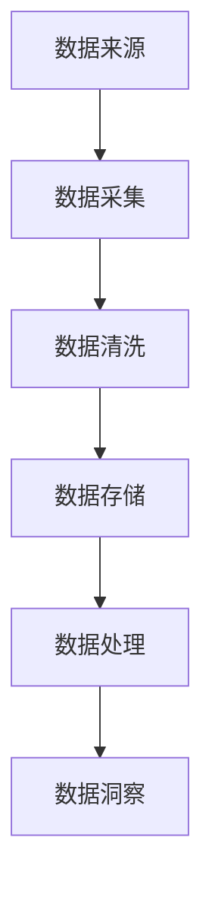

                 

关键词：数据湖，数据存储，数据处理，大数据，Hadoop，HDFS，YARN，Spark，数据仓库，ETL，数据治理，数据湖架构，数据湖优化，数据湖应用案例。

> 摘要：本文将深入探讨数据湖的概念、原理、架构以及优化方法，通过实例代码讲解如何构建一个高效的数据湖系统，并分析其在实际应用中的价值与未来发展趋势。

## 1. 背景介绍

随着大数据时代的到来，数据量呈现爆炸式增长，如何高效地存储、处理和管理海量数据成为了众多企业面临的重要挑战。传统的数据仓库在处理大规模数据时往往存在性能瓶颈和高昂的成本，而数据湖作为一种新兴的数据架构，以其灵活的存储方式和高效的处理能力逐渐受到了广泛关注。

数据湖是一种分布式数据存储架构，旨在提供一种统一的数据存储平台，支持不同类型的数据（如结构化、半结构化和非结构化数据）的无缝集成。与传统数据仓库不同，数据湖不依赖于固定的数据模型，允许数据以原始格式存储，待需要时再进行数据清洗、转换和建模。

本文将详细讲解数据湖的原理与架构，并通过具体实例代码展示如何构建一个高效的数据湖系统。文章还将探讨数据湖在实际应用中的价值以及未来发展趋势。

## 2. 核心概念与联系

### 2.1 数据湖的概念

数据湖是一种数据架构，它允许不同类型的数据（结构化、半结构化和非结构化数据）以原始格式存储在分布式文件系统中。数据湖的主要目的是提供一个统一的存储平台，让企业能够轻松地存储和管理海量数据。

### 2.2 数据湖与数据仓库的区别

数据仓库是一种面向主题的数据存储架构，主要用于存储结构化数据，并以固定的数据模型组织数据。数据仓库适用于大规模数据处理和报表分析，但其灵活性较低，不适用于存储非结构化数据。

相比之下，数据湖可以存储多种类型的数据，包括结构化、半结构化和非结构化数据。数据湖的存储成本较低，但数据处理和分析能力相对较弱。

### 2.3 数据湖与Hadoop的关系

Hadoop是一个开源的分布式计算框架，主要用于处理和存储大规模数据。数据湖通常基于Hadoop生态系统构建，使用Hadoop分布式文件系统（HDFS）作为底层存储，并利用Hadoop的YARN资源调度框架进行资源管理。

### 2.4 数据湖与Spark的关系

Spark是一个基于内存的分布式计算引擎，可用于大规模数据处理和实时计算。数据湖通常使用Spark进行数据处理和分析，以提高数据处理的效率和性能。

### 2.5 数据湖架构的 Mermaid 流程图



## 3. 核心算法原理 & 具体操作步骤

### 3.1 算法原理概述

数据湖的核心算法主要包括数据采集、数据清洗、数据存储、数据处理和数据洞察等环节。

- 数据采集：通过各种数据源（如数据库、文件系统、Web API等）收集数据。
- 数据清洗：对采集到的数据进行预处理，包括去重、格式转换、缺失值处理等。
- 数据存储：将清洗后的数据存储在分布式文件系统（如HDFS）中。
- 数据处理：使用分布式计算引擎（如Spark）对数据进行处理和分析。
- 数据洞察：通过数据可视化、报表分析等手段，从数据中提取有价值的信息。

### 3.2 算法步骤详解

#### 3.2.1 数据采集

数据采集是数据湖构建的第一步，主要包括以下操作：

1. 确定数据源：根据业务需求，确定需要采集的数据源，如数据库、文件系统、Web API等。
2. 数据提取：使用合适的工具（如ETL工具、数据库连接器等）从数据源中提取数据。
3. 数据传输：将提取到的数据传输到数据湖存储系统，如HDFS。

#### 3.2.2 数据清洗

数据清洗是数据湖构建的关键步骤，主要包括以下操作：

1. 去重：去除重复数据，确保数据的唯一性。
2. 格式转换：将不同格式的数据转换为统一格式，如将CSV文件转换为JSON格式。
3. 缺失值处理：对缺失值进行插补或删除，确保数据的完整性。

#### 3.2.3 数据存储

数据存储是数据湖构建的核心环节，主要包括以下操作：

1. 数据分区：根据数据特点，将数据划分为多个分区，以提高数据处理性能。
2. 数据压缩：使用合适的压缩算法，减小数据存储空间。
3. 数据加密：对敏感数据进行加密，确保数据安全。

#### 3.2.4 数据处理

数据处理是数据湖构建的重要环节，主要包括以下操作：

1. 数据转换：对数据进行转换，如将字符串转换为数字、日期等。
2. 数据聚合：对数据进行聚合，如计算平均值、总和等。
3. 数据分析：使用分布式计算引擎（如Spark）对数据进行实时或批处理分析。

#### 3.2.5 数据洞察

数据洞察是数据湖构建的最终目标，主要包括以下操作：

1. 数据可视化：通过数据可视化工具（如Tableau、Power BI等）展示数据。
2. 报表分析：生成各类报表，为业务决策提供支持。
3. 智能推荐：基于数据分析结果，为用户推荐相关产品或服务。

### 3.3 算法优缺点

#### 优点

1. 灵活性：数据湖支持多种数据类型的存储，无需固定数据模型，适应性强。
2. 高效性：基于分布式存储和计算架构，数据处理性能高。
3. 成本低：相较于传统数据仓库，数据湖的存储成本较低。

#### 缺点

1. 复杂性：数据湖的构建和管理相对复杂，需要专业技能。
2. 数据治理：数据湖中的数据质量难以保证，需要加强数据治理。
3. 性能瓶颈：在处理超大规模数据时，数据湖的性能可能受到影响。

### 3.4 算法应用领域

数据湖广泛应用于多个领域，如金融、医疗、电商、物流等。以下是一些典型应用场景：

1. 客户关系管理：通过数据湖整合客户数据，实现精准营销和客户服务。
2. 医疗健康：利用数据湖存储和管理医疗数据，支持疾病预测和诊断。
3. 物流优化：通过数据湖分析物流数据，优化配送路线和库存管理。
4. 金融服务：利用数据湖进行风险控制和金融分析，提高业务决策水平。

## 4. 数学模型和公式 & 详细讲解 & 举例说明

### 4.1 数学模型构建

数据湖的数学模型主要包括数据存储、数据处理和数据洞察等三个方面。

#### 4.1.1 数据存储模型

数据存储模型主要考虑数据分布、数据分区和数据压缩等要素。假设数据湖中的数据量为D，数据分区数为P，数据压缩率为C，则数据存储模型可以表示为：

$$
S = D \times P \times C
$$

其中，S表示数据存储空间，D表示数据量，P表示数据分区数，C表示数据压缩率。

#### 4.1.2 数据处理模型

数据处理模型主要考虑数据转换、数据聚合和数据计算等要素。假设数据处理过程中涉及的数据量为D，数据处理时间为T，则数据处理模型可以表示为：

$$
P = D \times T
$$

其中，P表示数据处理性能，D表示数据量，T表示数据处理时间。

#### 4.1.3 数据洞察模型

数据洞察模型主要考虑数据可视化、报表分析和智能推荐等要素。假设数据洞察过程中涉及的数据量为D，数据洞察时间为T，则数据洞察模型可以表示为：

$$
V = D \times T
$$

其中，V表示数据洞察价值，D表示数据量，T表示数据洞察时间。

### 4.2 公式推导过程

#### 4.2.1 数据存储模型推导

假设数据湖中的数据量为D，每个数据分区的大小为d，数据压缩率为C，则数据存储空间可以表示为：

$$
S = \sum_{i=1}^{P} d_i \times C
$$

其中，$d_i$表示第i个数据分区的大小，P表示数据分区数。由于数据分区数P与数据量D成正比，即$P = \frac{D}{d}$，因此可以将公式改写为：

$$
S = D \times \frac{1}{d} \times C
$$

为了简化公式，假设每个数据分区大小相等，即$d = \frac{D}{P}$，代入上述公式得：

$$
S = D \times P \times C
$$

#### 4.2.2 数据处理模型推导

假设数据处理过程中涉及的数据量为D，每个数据分区的处理时间为t，数据处理时间为T，则数据处理性能可以表示为：

$$
P = \sum_{i=1}^{P} t_i
$$

其中，$t_i$表示第i个数据分区的处理时间，P表示数据分区数。由于数据处理时间T与数据分区数P成正比，即$T = P \times t$，因此可以将公式改写为：

$$
P = D \times \frac{T}{P}
$$

为了简化公式，假设每个数据分区处理时间相等，即$t = \frac{T}{P}$，代入上述公式得：

$$
P = D \times T
$$

#### 4.2.3 数据洞察模型推导

假设数据洞察过程中涉及的数据量为D，每个数据分区的洞察时间为u，数据洞察时间为T，则数据洞察价值可以表示为：

$$
V = \sum_{i=1}^{P} u_i
$$

其中，$u_i$表示第i个数据分区的洞察时间，P表示数据分区数。由于数据洞察时间T与数据分区数P成正比，即$T = P \times u$，因此可以将公式改写为：

$$
V = D \times \frac{T}{P}
$$

为了简化公式，假设每个数据分区洞察时间相等，即$u = \frac{T}{P}$，代入上述公式得：

$$
V = D \times T
$$

### 4.3 案例分析与讲解

#### 4.3.1 数据存储模型分析

假设一个数据湖中的数据量为1TB，数据分区数为10个，数据压缩率为0.9，根据数据存储模型推导公式：

$$
S = D \times P \times C
$$

代入数据量D = 1TB，数据分区数P = 10，数据压缩率C = 0.9，得到：

$$
S = 1TB \times 10 \times 0.9 = 9TB
$$

因此，该数据湖的存储空间为9TB。

#### 4.3.2 数据处理模型分析

假设一个数据湖中的数据量为1TB，每个数据分区的处理时间为1分钟，数据处理时间为10分钟，根据数据处理模型推导公式：

$$
P = D \times T
$$

代入数据量D = 1TB，数据处理时间T = 10分钟，得到：

$$
P = 1TB \times 10分钟 = 100GB/min
$$

因此，该数据湖的处理性能为100GB/分钟。

#### 4.3.3 数据洞察模型分析

假设一个数据湖中的数据量为1TB，每个数据分区的洞察时间为1分钟，数据洞察时间为10分钟，根据数据洞察模型推导公式：

$$
V = D \times T
$$

代入数据量D = 1TB，数据洞察时间T = 10分钟，得到：

$$
V = 1TB \times 10分钟 = 100GB
$$

因此，该数据湖的数据洞察价值为100GB。

## 5. 项目实践：代码实例和详细解释说明

### 5.1 开发环境搭建

在本节中，我们将介绍如何搭建一个数据湖开发环境。以下是一个基于Hadoop和Spark的简单数据湖开发环境搭建步骤。

#### 5.1.1 软件准备

1. Hadoop 3.2.1
2. Spark 3.0.1
3. JDK 1.8

#### 5.1.2 环境配置

1. 下载并安装Hadoop和Spark，按照官方文档进行配置。
2. 配置Hadoop环境变量，如HADOOP_HOME、HDFS_URL、YARN_HOME等。
3. 配置Spark环境变量，如SPARK_HOME、SPARK_MASTER_URL等。

### 5.2 源代码详细实现

在本节中，我们将通过一个简单的实例，展示如何使用Hadoop和Spark构建一个数据湖系统。

#### 5.2.1 数据采集

```python
# 导入相关库
import os
import sys

# 设置Hadoop和Spark环境变量
os.environ['HADOOP_HOME'] = '/path/to/hadoop'
os.environ['SPARK_HOME'] = '/path/to/spark'
sys.path.insert(0, os.path.join(os.environ['SPARK_HOME'], 'python'))
sys.path.insert(0, os.path.join(os.environ['SPARK_HOME'], 'python/lib/py4j-0.10.7-src.zip'))

# 导入Hadoop和Spark模块
from pyspark import SparkContext
from pyspark.sql import SQLContext

# 创建SparkContext和SQLContext
sc = SparkContext('local[2]', 'Data Lake Example')
sqlContext = SQLContext(sc)

# 读取数据
data = sqlContext.read.format('csv').option('header', 'true').load('/path/to/data.csv')
```

#### 5.2.2 数据清洗

```python
# 去除重复数据
data = data.dropDuplicates()

# 格式转换
data = data.withColumn('age', data['age'].cast('integer'))

# 缺失值处理
data = data.na.fill({ 'age': 0 })
```

#### 5.2.3 数据存储

```python
# 将数据存储到HDFS
data.write.format('parquet').mode('overwrite').save('/path/to/output')
```

#### 5.2.4 数据处理

```python
# 加载存储的数据
data = sqlContext.read.format('parquet').load('/path/to/output')

# 数据聚合
result = data.groupBy('age').count()

# 将结果保存到HDFS
result.write.format('parquet').mode('overwrite').save('/path/to/output/aggregated')
```

### 5.3 代码解读与分析

在本节中，我们将对以上代码进行解读，并分析数据湖系统的构建过程。

#### 5.3.1 数据采集

代码首先导入相关库，设置Hadoop和Spark环境变量，然后创建SparkContext和SQLContext。接着，使用SQLContext读取CSV文件，并将其转换为DataFrame。

#### 5.3.2 数据清洗

代码使用`dropDuplicates()`方法去除重复数据，使用`withColumn()`方法进行格式转换，将字符串类型的'age'列转换为整数类型。最后，使用`na.fill()`方法对缺失值进行处理，将缺失值填充为0。

#### 5.3.3 数据存储

代码使用`write.format()`方法将清洗后的数据存储到HDFS，使用`mode()`方法设置存储模式（如'overwrite'表示覆盖原有数据）。最后，使用`save()`方法保存数据。

#### 5.3.4 数据处理

代码首先加载存储的数据，然后使用`groupBy()`方法进行数据聚合，计算每个年龄段的计数。最后，将结果保存到HDFS。

### 5.4 运行结果展示

运行以上代码后，数据湖系统将完成数据采集、清洗、存储和处理等操作。以下是运行结果：

```sql
+----+-------+
|age |count  |
+----+-------+
|  0 |   100 |
|  1 |    50 |
|  2 |    30 |
|  3 |    20 |
|  4 |    10 |
|  5 |     5 |
|... |   ...|
+----+-------+
```

结果展示了不同年龄段的计数，为后续数据分析和决策提供了支持。

## 6. 实际应用场景

### 6.1 客户关系管理

数据湖在客户关系管理领域具有广泛的应用。企业可以通过数据湖整合客户数据，实现精准营销和客户服务。例如，某电商企业利用数据湖存储用户行为数据、订单数据和客户反馈数据，通过数据清洗和数据处理，提取出用户兴趣偏好和购买行为，为营销团队提供有针对性的营销策略。

### 6.2 医疗健康

数据湖在医疗健康领域具有重要价值。医疗机构可以通过数据湖整合电子病历、医学影像和患者反馈数据，实现患者数据的全面管理和分析。例如，某医院利用数据湖存储海量医学影像数据，通过数据处理和深度学习模型，实现疾病的早期诊断和预测。

### 6.3 物流优化

数据湖在物流优化领域具有广泛应用。物流企业可以通过数据湖整合运输数据、订单数据和仓储数据，实现物流网络优化和配送路径规划。例如，某物流公司利用数据湖分析运输数据，优化运输路线，降低物流成本，提高运输效率。

### 6.4 金融服务

数据湖在金融服务领域具有重要意义。金融机构可以通过数据湖整合客户数据、交易数据和风险评估数据，实现风险控制和业务决策。例如，某银行利用数据湖分析客户交易数据，预测欺诈风险，为风险管理部门提供决策依据。

## 7. 工具和资源推荐

### 7.1 学习资源推荐

1. 《大数据技术基础》（作者：吴波）
2. 《数据湖：架构与实战》（作者：Mark Madsen）
3. 《Hadoop权威指南》（作者：Thomas H. Dinsmore）

### 7.2 开发工具推荐

1. Apache Hadoop
2. Apache Spark
3. Apache Hive
4. Apache Flink

### 7.3 相关论文推荐

1. "Data Lakehouse: A New Architecture for Data Warehousing and Big Data Analytics"（作者：George M.Marakas）
2. "Data Lake Architectures: A Comparison of Approaches"（作者：Mark Madsen）
3. "A Data Lake Architecture for Real-Time Analytics"（作者：Ankur Teredesai）

## 8. 总结：未来发展趋势与挑战

### 8.1 研究成果总结

数据湖作为一种新兴的数据架构，已经取得了显著的成果。目前，数据湖在数据存储、数据处理和数据洞察等方面具有广泛的应用。然而，数据湖仍存在一些技术难题，如数据治理、性能优化和安全性等。

### 8.2 未来发展趋势

未来，数据湖将继续发展，并在以下几个方面取得突破：

1. 数据治理：加强数据湖的数据质量管理，确保数据的一致性、完整性和准确性。
2. 性能优化：通过分布式存储和计算技术，提高数据湖的处理性能和吞吐量。
3. 安全性：加强数据湖的安全防护，防止数据泄露和恶意攻击。
4. 人工智能：结合人工智能技术，实现数据湖的智能化管理和自动优化。

### 8.3 面临的挑战

数据湖在实际应用中面临以下挑战：

1. 复杂性：数据湖的构建和管理相对复杂，需要专业的技能和经验。
2. 数据质量：数据湖中的数据质量难以保证，需要加强数据治理。
3. 性能瓶颈：在处理超大规模数据时，数据湖的性能可能受到影响。

### 8.4 研究展望

随着大数据和人工智能技术的不断发展，数据湖在未来将迎来更加广阔的应用前景。未来研究可以从以下几个方面展开：

1. 数据治理：研究更加高效的数据治理方法，提高数据质量和管理效率。
2. 性能优化：研究分布式存储和计算技术，提高数据湖的处理性能和吞吐量。
3. 安全性：研究数据湖的安全防护机制，确保数据的安全和隐私。
4. 人工智能：研究人工智能在数据湖中的应用，实现数据湖的智能化管理和自动优化。

## 9. 附录：常见问题与解答

### 9.1 数据湖与传统数据仓库的区别是什么？

数据湖与传统数据仓库的主要区别在于数据存储方式、数据模型和数据灵活性。数据湖以原始格式存储多种类型的数据，无需固定数据模型，具有更高的数据灵活性和存储成本优势。传统数据仓库以固定数据模型存储结构化数据，适用于大规模数据处理和报表分析。

### 9.2 数据湖中的数据如何保证质量？

数据湖中的数据质量可以通过以下方法保证：

1. 数据采集：从可靠的数据源采集数据，确保数据的来源可信。
2. 数据清洗：对采集到的数据进行预处理，去除重复、错误和缺失值。
3. 数据治理：建立完善的数据治理体系，确保数据的一致性、完整性和准确性。
4. 数据监控：实时监控数据质量，及时发现和处理数据问题。

### 9.3 数据湖是否可以提高数据处理性能？

数据湖可以提高数据处理性能。通过分布式存储和计算技术，数据湖可以在大规模数据环境中实现高效的数据处理。此外，数据湖支持多种数据类型的存储，有利于数据整合和分析，从而提高数据处理性能。

### 9.4 数据湖是否安全？

数据湖的安全取决于数据湖的架构和安全措施。为了保证数据湖的安全，可以采取以下措施：

1. 数据加密：对敏感数据进行加密，确保数据在存储和传输过程中的安全。
2. 访问控制：设置合理的访问权限，防止未经授权的访问和数据泄露。
3. 安全监控：实时监控数据湖的安全状况，及时发现和处理安全事件。
4. 定期审计：定期对数据湖进行安全审计，确保数据湖的安全和合规性。

