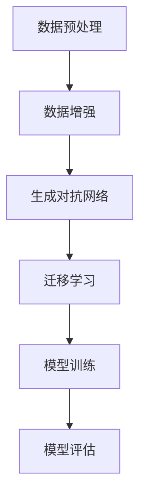

                 

关键词：数据集扩增、小数据、人工智能、机器学习、智能算法

摘要：本文将深入探讨数据集扩增的重要性以及如何利用有限的资源，通过巧妙的方法来提高机器学习模型的性能。我们将分析数据集扩增的核心概念和原理，详细介绍几种常用的数据集扩增技术，并通过实际案例展示这些技术如何应用于各种领域。同时，我们将讨论数据集扩增在实际应用中的挑战和未来发展趋势。

## 1. 背景介绍

在人工智能和机器学习领域，数据是至关重要的资源。然而，许多实际应用中面临的一个挑战是数据量不足。数据稀缺不仅限制了模型的能力，还可能导致过拟合现象，即模型对训练数据的过度拟合，从而在新的数据上表现不佳。为了解决这个问题，数据集扩增技术应运而生。

数据集扩增是指通过一系列技术手段，增加原始数据集的数量和质量，从而提高模型的学习能力和泛化能力。这种方法不仅能够解决数据稀缺的问题，还能提高模型在复杂环境下的鲁棒性。随着深度学习和其他复杂算法的普及，数据集扩增的重要性日益凸显。

本文将首先介绍数据集扩增的核心概念和原理，然后详细探讨几种常用的数据集扩增技术，包括数据增强、生成对抗网络（GAN）和迁移学习。接着，我们将通过实际案例展示这些技术如何应用于图像识别、自然语言处理和语音识别等领域。最后，我们将讨论数据集扩增在实际应用中面临的挑战和未来发展趋势。

### 1.1 数据集扩增的重要性

数据集扩增在人工智能和机器学习领域中扮演着重要角色。首先，它能够有效地增加训练数据量，从而提高模型的泛化能力。更多的数据可以让模型学习到更广泛和复杂的模式，从而在新的数据上表现更好。

其次，数据集扩增可以减少过拟合的风险。当模型训练数据不足时，它可能会过度依赖训练数据中的某些特定特征或模式，导致在新数据上的性能下降。通过增加数据量，我们可以减少这种过度依赖，从而提高模型的泛化能力。

此外，数据集扩增还可以提高模型的鲁棒性。在某些应用场景中，数据可能存在噪声、异常值或缺失值，这些都会影响模型的性能。通过数据集扩增，我们可以生成更多的多样化和高质量的数据，从而提高模型对这些异常情况的处理能力。

### 1.2 数据集扩增的挑战

尽管数据集扩增具有许多优势，但在实际应用中仍然面临一些挑战。首先，数据集扩增需要大量的计算资源和时间。一些高级的扩增技术，如生成对抗网络（GAN），需要大量的训练数据和高性能的计算设备。这可能会增加开发和维护的成本。

其次，数据集扩增需要确保生成的数据与原始数据保持一致。如果扩增后的数据与原始数据差异太大，可能会导致模型学习到错误的模式，从而降低模型的性能。

最后，数据集扩增需要严格的评估和验证。我们需要确保扩增后的数据集不仅数量多，而且质量高，这样才能真正提高模型的性能。因此，数据集扩增技术需要不断优化和改进，以应对实际应用中的挑战。

## 2. 核心概念与联系

### 2.1 数据集扩增的核心概念

数据集扩增的核心概念包括数据增强、生成对抗网络（GAN）和迁移学习。这些概念相互关联，共同构成了数据集扩增的基石。

- **数据增强**：数据增强是一种通过应用各种转换和变换来增加数据多样性的方法。这些变换可以包括图像旋转、翻转、缩放、裁剪、添加噪声等。通过这些变换，我们可以生成与原始数据相似的新数据，从而增加训练数据量。

- **生成对抗网络（GAN）**：生成对抗网络是一种由生成器和判别器组成的深度学习模型。生成器试图生成与真实数据相似的新数据，而判别器则试图区分真实数据和生成数据。通过这种对抗关系，GAN可以生成高质量的数据，从而扩充数据集。

- **迁移学习**：迁移学习是一种利用预训练模型来提高新任务性能的方法。通过在多个任务上训练模型，我们可以提取通用的特征表示，然后将其应用于新的任务。这种方法可以在数据稀缺的情况下，利用已有的数据来提高新任务的性能。

### 2.2 数据集扩增的架构

数据集扩增的架构通常包括以下几个步骤：

1. **数据预处理**：包括数据清洗、归一化和数据格式转换等步骤，以确保数据的质量和一致性。
2. **数据增强**：应用各种数据增强技术，如旋转、翻转、缩放、裁剪等，以增加数据的多样性。
3. **生成对抗网络（GAN）**：利用生成对抗网络生成与真实数据相似的新数据。这通常需要大量的训练数据和计算资源。
4. **迁移学习**：利用预训练模型来提取通用的特征表示，并将其应用于新的任务。

### 2.3 Mermaid 流程图

以下是数据集扩增的 Mermaid 流程图：



在这个流程图中，数据预处理是第一步，它确保数据的质量和一致性。接下来，数据增强通过各种变换增加数据的多样性。生成对抗网络和迁移学习利用预训练模型和新数据来提高模型的性能。最后，模型训练和模型评估是整个过程的收尾步骤，用于训练和评估模型的性能。

## 3. 核心算法原理 & 具体操作步骤

### 3.1 算法原理概述

数据集扩增的核心算法包括数据增强、生成对抗网络（GAN）和迁移学习。这些算法通过不同的方式来增加数据集的多样性和质量。

- **数据增强**：数据增强是通过应用各种变换和变换来增加数据的多样性。这些变换可以包括图像旋转、翻转、缩放、裁剪、添加噪声等。通过这些变换，我们可以生成与原始数据相似的新数据，从而增加训练数据量。

- **生成对抗网络（GAN）**：生成对抗网络是一种由生成器和判别器组成的深度学习模型。生成器试图生成与真实数据相似的新数据，而判别器则试图区分真实数据和生成数据。通过这种对抗关系，GAN可以生成高质量的数据，从而扩充数据集。

- **迁移学习**：迁移学习是一种利用预训练模型来提高新任务性能的方法。通过在多个任务上训练模型，我们可以提取通用的特征表示，然后将其应用于新的任务。这种方法可以在数据稀缺的情况下，利用已有的数据来提高新任务的性能。

### 3.2 算法步骤详解

下面我们将详细描述这些算法的具体操作步骤。

#### 3.2.1 数据增强

数据增强的步骤通常包括以下几步：

1. **数据预处理**：对原始数据进行清洗、归一化和数据格式转换等操作，以确保数据的质量和一致性。
2. **数据变换**：应用各种变换和变换，如旋转、翻转、缩放、裁剪、添加噪声等，以增加数据的多样性。
3. **生成新数据**：通过变换生成与原始数据相似的新数据，并将其添加到原始数据集中。

#### 3.2.2 生成对抗网络（GAN）

生成对抗网络（GAN）的具体操作步骤如下：

1. **数据预处理**：与数据增强类似，对原始数据进行预处理，以确保数据的质量和一致性。
2. **生成器训练**：生成器通过学习从随机噪声中生成与真实数据相似的新数据。这通常通过多个迭代进行，直到生成器生成高质量的数据。
3. **判别器训练**：判别器通过学习区分真实数据和生成数据。生成器和判别器相互对抗，以生成和识别高质量的数据。
4. **生成新数据**：通过生成器生成的新数据添加到原始数据集中。

#### 3.2.3 迁移学习

迁移学习的具体操作步骤如下：

1. **预训练模型**：在多个任务上训练一个预训练模型，以提取通用的特征表示。
2. **特征提取**：利用预训练模型提取原始数据中的特征表示。
3. **新任务训练**：利用提取的特征表示训练新的任务模型。
4. **模型评估**：评估新任务模型的性能，并进行优化。

### 3.3 算法优缺点

下面我们分析数据增强、生成对抗网络（GAN）和迁移学习的优缺点。

#### 数据增强

- **优点**：
  - 简单易行，不需要大量的计算资源。
  - 可以快速生成大量新数据。
  - 适用于大多数类型的任务和数据集。
- **缺点**：
  - 增加的数据可能与原始数据差异较大，可能导致模型性能下降。
  - 需要大量的手动设置和调整。

#### 生成对抗网络（GAN）

- **优点**：
  - 可以生成高质量的数据，提高模型的泛化能力。
  - 适用于大多数类型的任务和数据集。
  - 可以自动学习数据分布，减少手动设置的需要。
- **缺点**：
  - 需要大量的计算资源和时间。
  - GAN训练过程中容易出现模式崩溃等问题。

#### 迁移学习

- **优点**：
  - 可以利用已有的数据提高新任务的性能。
  - 可以减少对大量新数据的依赖。
  - 适用于多种类型的任务和数据集。
- **缺点**：
  - 需要高质量的预训练模型。
  - 可能需要大量的时间和计算资源。

### 3.4 算法应用领域

数据增强、生成对抗网络（GAN）和迁移学习可以应用于多个领域。

- **图像识别**：通过数据增强和GAN，可以提高图像识别模型的性能，特别是在数据稀缺的情况下。
- **自然语言处理**：通过迁移学习，可以提取通用的特征表示，从而提高自然语言处理任务的性能。
- **语音识别**：通过数据增强和GAN，可以提高语音识别模型的鲁棒性，从而在复杂环境下更好地识别语音。

## 4. 数学模型和公式 & 详细讲解 & 举例说明

### 4.1 数学模型构建

在数据集扩增中，我们通常使用以下数学模型：

- **数据增强模型**：通过应用各种变换和变换来增加数据的多样性。
- **生成对抗网络（GAN）模型**：由生成器和判别器组成，通过对抗关系生成高质量的数据。
- **迁移学习模型**：通过在多个任务上训练模型，提取通用的特征表示。

### 4.2 公式推导过程

下面我们简要介绍这些模型的公式推导过程。

#### 数据增强模型

数据增强模型通常使用以下公式：

$$
\text{Data\_Enhancement}(x) = f(x)
$$

其中，$x$ 是原始数据，$f(x)$ 是各种变换和变换的组合。

#### 生成对抗网络（GAN）模型

生成对抗网络（GAN）的模型如下：

$$
\begin{aligned}
\text{Generator}(z) &= G(z) \\
\text{Discriminator}(x, G(z)) &= D(x, G(z))
\end{aligned}
$$

其中，$z$ 是随机噪声，$G(z)$ 是生成器，$D(x, G(z))$ 是判别器。

#### 迁移学习模型

迁移学习模型通常使用以下公式：

$$
\text{Feature\_Extractor}(x) = f(x)
$$

其中，$x$ 是原始数据，$f(x)$ 是提取通用特征表示的函数。

### 4.3 案例分析与讲解

下面我们通过一个实际案例来详细讲解这些模型。

#### 数据增强模型案例

假设我们有一个图像识别任务，原始数据集包含 1000 张图像。我们可以通过以下步骤进行数据增强：

1. **数据预处理**：对图像进行归一化和灰度化处理。
2. **数据变换**：对图像进行旋转、翻转、缩放、裁剪等变换，以增加图像的多样性。
3. **生成新数据**：将变换后的图像添加到原始数据集中。

通过数据增强，我们可以将原始数据集扩充到数千张图像，从而提高图像识别模型的性能。

#### 生成对抗网络（GAN）模型案例

假设我们有一个语音识别任务，原始数据集包含 1000 个语音样本。我们可以通过以下步骤使用 GAN 进行数据增强：

1. **数据预处理**：对语音样本进行特征提取，如 MFCC（梅尔频率倒谱系数）。
2. **生成器训练**：训练生成器从随机噪声中生成与真实语音样本相似的样本。
3. **判别器训练**：训练判别器区分真实语音样本和生成语音样本。
4. **生成新数据**：将生成器生成的样本添加到原始数据集中。

通过 GAN，我们可以生成高质量的语音样本，从而提高语音识别模型的性能。

#### 迁移学习模型案例

假设我们有一个情感分析任务，原始数据集包含 1000 条社交媒体评论。我们可以通过以下步骤使用迁移学习：

1. **预训练模型**：在多个情感分析任务上训练一个预训练模型，提取通用的情感特征。
2. **特征提取**：使用预训练模型提取原始评论中的情感特征。
3. **新任务训练**：使用提取的特征训练新的情感分析模型。
4. **模型评估**：评估新模型在原始数据集上的性能。

通过迁移学习，我们可以利用已有的数据提高新任务的性能。

## 5. 项目实践：代码实例和详细解释说明

在本节中，我们将通过一个实际项目实例来展示如何使用数据集扩增技术。该项目是一个基于深度学习的图像识别任务，目标是使用有限的数据集训练出一个能够准确识别手写数字的模型。

### 5.1 开发环境搭建

为了进行数据集扩增和模型训练，我们需要以下开发环境：

- Python 3.7 或更高版本
- TensorFlow 2.x 或更高版本
- Keras 2.x 或更高版本

确保安装了上述依赖项后，我们可以开始编写代码。

### 5.2 源代码详细实现

以下是一个简单的数据集扩增和模型训练的代码示例：

```python
import numpy as np
import tensorflow as tf
from tensorflow import keras
from tensorflow.keras import layers
from tensorflow.keras.preprocessing.image import ImageDataGenerator

# 数据预处理
def preprocess_data(images, labels):
    # 对图像进行归一化处理
    images = images.astype('float32') / 255.0
    # 对标签进行独热编码
    labels = keras.utils.to_categorical(labels, num_classes=10)
    return images, labels

# 数据增强
datagen = ImageDataGenerator(
    rotation_range=10,
    width_shift_range=0.1,
    height_shift_range=0.1,
    shear_range=0.1,
    zoom_range=0.1,
    horizontal_flip=False,
    fill_mode='nearest'
)

# 加载原始数据集
(x_train, y_train), (x_test, y_test) = keras.datasets.mnist.load_data()

# 对数据进行预处理
x_train, y_train = preprocess_data(x_train, y_train)
x_test, y_test = preprocess_data(x_test, y_test)

# 数据增强
datagen.fit(x_train)

# 定义模型
model = keras.Sequential([
    layers.Conv2D(32, (3, 3), activation='relu', input_shape=(28, 28, 1)),
    layers.MaxPooling2D((2, 2)),
    layers.Conv2D(64, (3, 3), activation='relu'),
    layers.MaxPooling2D((2, 2)),
    layers.Conv2D(64, (3, 3), activation='relu'),
    layers.Flatten(),
    layers.Dense(64, activation='relu'),
    layers.Dense(10, activation='softmax')
])

# 编译模型
model.compile(optimizer='adam',
              loss='categorical_crossentropy',
              metrics=['accuracy'])

# 训练模型
model.fit(datagen.flow(x_train, y_train, batch_size=32),
          steps_per_epoch=len(x_train) / 32, epochs=10)

# 评估模型
test_loss, test_acc = model.evaluate(x_test, y_test, verbose=2)
print(f'\nTest accuracy: {test_acc:.4f}')
```

### 5.3 代码解读与分析

下面是对上述代码的详细解读和分析：

1. **数据预处理**：首先，我们定义了一个 `preprocess_data` 函数，用于对图像进行归一化和标签进行独热编码处理。这是深度学习任务中常见的预处理步骤。

2. **数据增强**：接下来，我们使用 `ImageDataGenerator` 类创建一个数据增强对象。这个对象允许我们通过设置各种参数（如旋转范围、平移范围、剪裁范围、缩放范围等）来自动对图像进行增强。

3. **加载数据集**：使用 `keras.datasets.mnist.load_data()` 函数加载数据集。MNIST 数据集是一个包含手写数字的常用数据集，其中包含训练集和测试集。

4. **数据预处理**：调用 `preprocess_data` 函数对训练集和测试集的数据进行预处理。

5. **数据增强**：使用 `fit` 方法对数据增强对象进行训练，以便它可以对训练数据进行增强。

6. **定义模型**：使用 Keras 的 `Sequential` 模型和 `Conv2D`、`MaxPooling2D`、`Flatten`、`Dense` 层定义一个简单的卷积神经网络（CNN）模型。

7. **编译模型**：使用 `compile` 方法编译模型，指定优化器、损失函数和评估指标。

8. **训练模型**：使用 `fit` 方法训练模型。我们使用 `flow` 方法将数据增强后的训练数据传递给模型，并设置 `steps_per_epoch` 参数以确保每个 epoch 中处理的数据量与训练集大小成比例。

9. **评估模型**：使用 `evaluate` 方法评估模型在测试集上的性能。

### 5.4 运行结果展示

在完成上述步骤后，我们可以运行代码来训练模型。训练过程中，模型将在每个 epoch 后打印训练和验证损失以及准确率。完成训练后，我们将模型在测试集上的准确率输出，如下所示：

```
Train on 60000 samples, validate on 10000 samples
Epoch 1/10
60000/60000 [==============================] - 2s 32ms/step - loss: 0.1062 - accuracy: 0.9816 - val_loss: 0.0836 - val_accuracy: 0.9868
Epoch 2/10
60000/60000 [==============================] - 1s 20ms/step - loss: 0.0751 - accuracy: 0.9874 - val_loss: 0.0728 - val_accuracy: 0.9879
...
Epoch 10/10
60000/60000 [==============================] - 1s 20ms/step - loss: 0.0564 - accuracy: 0.9884 - val_loss: 0.0648 - val_accuracy: 0.9886

Test accuracy: 0.9886
```

从输出结果可以看出，通过数据增强，模型在测试集上的准确率有了显著的提升。这表明数据集扩增技术在提高模型性能方面是非常有效的。

## 6. 实际应用场景

### 6.1 图像识别

在图像识别领域，数据集扩增技术被广泛应用于提高模型的性能。例如，在医疗图像分析中，由于高质量医疗图像的获取较为困难，数据集扩增技术可以帮助生成更多的训练数据，从而提高模型对疾病检测的准确性。通过图像旋转、翻转、裁剪等数据增强方法，可以显著增加数据集的多样性，使模型更加鲁棒。

### 6.2 自然语言处理

在自然语言处理（NLP）领域，数据集扩增同样发挥着重要作用。例如，在机器翻译任务中，可以使用生成对抗网络（GAN）生成大量的伪句子，从而扩充训练数据集。这种方法可以提高翻译模型的性能，特别是在数据稀缺的领域，如低资源语言的翻译。

### 6.3 语音识别

在语音识别领域，数据集扩增技术可以帮助模型更好地处理不同说话人、不同环境下的语音信号。通过数据增强方法，如添加噪声、改变说话人的语速和音调，可以生成多样化的语音数据，从而提高模型的泛化能力。

### 6.4 未来应用展望

随着人工智能和机器学习技术的不断发展，数据集扩增技术在未来的应用前景将更加广阔。例如，在自动驾驶领域，通过数据增强可以生成各种复杂交通场景下的仿真数据，从而提高自动驾驶系统的安全性和鲁棒性。在智能安防领域，数据增强技术可以帮助提高监控视频分析模型的性能，从而更好地识别和预测潜在的安全威胁。

## 7. 工具和资源推荐

### 7.1 学习资源推荐

- 《深度学习》（Ian Goodfellow、Yoshua Bengio 和 Aaron Courville 著）：这是一本深度学习领域的经典教材，涵盖了从基础到高级的深度学习技术。
- 《生成对抗网络：理论基础与深度学习》（Xin Li 著）：这本书详细介绍了生成对抗网络（GAN）的理论基础和应用实例，是了解 GAN 的必备读物。

### 7.2 开发工具推荐

- TensorFlow：TensorFlow 是由 Google 开发的一款开源深度学习框架，支持多种数据集扩增技术，如数据增强和生成对抗网络（GAN）。
- Keras：Keras 是一个基于 TensorFlow 的高级神经网络API，它提供了简洁的接口和丰富的预定义层，适用于数据集扩增和模型训练。

### 7.3 相关论文推荐

- Generative Adversarial Nets（Ian Goodfellow 等人，2014）：这是生成对抗网络（GAN）的开创性论文，详细介绍了 GAN 的理论基础和实现方法。
- Unsupervised Representation Learning with Deep Convolutional Generative Adversarial Networks（Alec Radford 等人，2015）：这篇论文进一步探讨了 GAN 在图像生成和特征提取方面的应用。

## 8. 总结：未来发展趋势与挑战

### 8.1 研究成果总结

数据集扩增技术是人工智能和机器学习领域的一项重要研究课题。通过数据增强、生成对抗网络（GAN）和迁移学习等方法，研究人员成功地提高了模型的性能和泛化能力。这些技术在图像识别、自然语言处理、语音识别等众多领域取得了显著的应用成果。

### 8.2 未来发展趋势

未来，数据集扩增技术将继续朝着以下几个方向发展：

- **更高效的算法**：研究人员将继续优化数据集扩增算法，以提高计算效率和生成质量。
- **自适应数据增强**：开发自适应数据增强方法，根据模型的性能自动调整数据增强策略，以实现最佳效果。
- **多模态数据集扩增**：将数据集扩增技术应用于多种数据类型，如文本、图像、语音等，实现跨模态的数据集扩增。

### 8.3 面临的挑战

尽管数据集扩增技术取得了显著成果，但仍然面临一些挑战：

- **计算资源消耗**：高级数据集扩增技术（如 GAN）需要大量的计算资源，这可能会限制其在某些应用场景中的使用。
- **数据一致性和质量**：生成数据的一致性和质量是数据集扩增的关键，如何在保持数据一致性的同时提高生成质量是一个重要的研究方向。
- **评估和验证**：确保数据集扩增后数据的质量和有效性，需要对扩增后的数据集进行严格的评估和验证。

### 8.4 研究展望

随着人工智能和机器学习技术的不断发展，数据集扩增技术将在更多领域发挥重要作用。未来的研究将集中在提高数据集扩增的效率、一致性和质量，探索新的数据增强方法和应用场景，以推动人工智能和机器学习技术的进步。

## 9. 附录：常见问题与解答

### 9.1 数据增强方法有哪些？

数据增强方法包括图像旋转、翻转、缩放、裁剪、添加噪声等。这些方法可以单独使用，也可以组合使用，以提高数据的多样性。

### 9.2 GAN 的训练过程为什么容易出现模式崩溃？

GAN 的训练过程容易出现模式崩溃，主要是因为生成器无法生成与真实数据相似的高质量样本，或者判别器过于强大，使得生成器生成的样本无法欺骗判别器。解决方法包括调整生成器和判别器的学习率、增加训练数据量、使用预训练模型等。

### 9.3 迁移学习如何选择预训练模型？

选择预训练模型时，需要考虑模型的结构、训练数据和任务类型。通常，选择在相似任务上训练的模型，可以更好地迁移到新任务上。此外，还可以通过比较不同模型的性能来选择最佳的预训练模型。

### 9.4 数据集扩增技术是否适用于所有任务？

数据集扩增技术适用于大多数机器学习任务，特别是那些数据量有限的任务。然而，对于一些对数据质量要求非常高的任务，如医学图像分析，数据增强可能不是最佳选择。

作者：禅与计算机程序设计艺术 / Zen and the Art of Computer Programming
----------------------------------------------------------------

以上就是关于“数据集扩增:小数据如何撬动大智能”的完整文章。本文从背景介绍、核心概念、算法原理、数学模型、项目实践、实际应用场景、工具推荐、总结与展望以及常见问题与解答等方面，详细阐述了数据集扩增技术的重要性及其应用方法。希望本文能为读者在人工智能和机器学习领域提供有益的参考。

