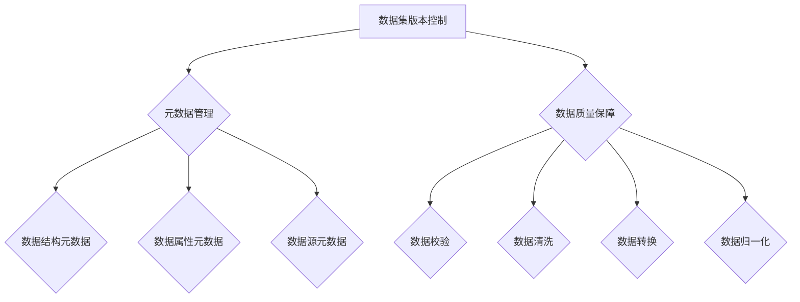

                 

关键词：数据集描述语言，数据集版本控制，元数据管理，数据管理，数据版本管理，版本控制系统

摘要：本文探讨了数据集描述语言在构建数据集版本控制系统中的应用，介绍了数据集版本控制的重要性，核心概念与架构，以及如何通过数据集描述语言实现数据集的版本管理、元数据管理和数据质量保障。本文还将通过实际项目实例，展示如何运用数据集描述语言来搭建一个高效的数据集版本控制系统，并提供相关的工具和资源推荐。

## 1. 背景介绍

在当今大数据时代，数据集作为重要的知识资产，其版本控制和维护变得尤为重要。数据集的版本控制不仅有助于团队协作和代码复用，还能确保数据的一致性和准确性。传统的文件版本控制系统在处理数据集时存在诸多局限，如数据格式不统一、数据冗余、数据更新不及时等问题。因此，我们需要一种专门为数据集设计的版本控制系统，以便更好地管理数据集的版本、元数据和数据质量。

数据集描述语言（Dataset Description Language，简称DDL）应运而生，它是一种用于描述数据集的结构、属性和关系的语言。通过DDL，我们可以创建数据集的元数据，实现对数据集的版本管理、元数据管理和数据质量监控。DDL不仅提供了一种统一的数据描述标准，还使得数据集的管理和共享更加便捷和高效。

## 2. 核心概念与联系

### 2.1 数据集版本控制

数据集版本控制是指对数据集的各个版本进行管理和跟踪，以便在需要时能够方便地回溯和复用历史版本。数据集版本控制的核心概念包括版本号、提交历史、分支管理和合并操作等。

- **版本号**：用于标识数据集的不同版本。版本号通常采用递增的整数或字母数字组合，如1.0、2.1等。
- **提交历史**：记录每个版本的提交信息，如提交者、提交时间、修改内容等。
- **分支管理**：允许开发人员在不同的分支上对数据集进行修改和实验，以便在需要时能够合并回主分支。
- **合并操作**：将不同分支上的修改合并到主分支，以确保数据集的完整性。

### 2.2 元数据管理

元数据（Metadata）是关于数据的数据，它描述了数据集的结构、属性、来源、用途等信息。元数据管理是指对数据集的元数据进行收集、存储、管理和维护的过程。元数据管理有助于提高数据集的可读性和可操作性，是数据集版本控制的基础。

- **数据结构元数据**：描述数据集的表结构、字段类型、约束条件等。
- **数据属性元数据**：描述数据集的字段名称、字段含义、数据范围、数据格式等。
- **数据源元数据**：描述数据集的来源、采集方式、数据更新周期等。

### 2.3 数据质量保障

数据质量是指数据在完整性、准确性、一致性、及时性等方面的表现。数据质量保障是指通过一系列技术和方法，确保数据集在各个版本中始终保持高质量。数据质量保障的核心概念包括数据校验、数据清洗、数据转换和数据归一化等。

- **数据校验**：对数据进行格式、范围、约束条件等方面的检查，以确保数据的正确性。
- **数据清洗**：删除重复数据、填补缺失值、消除噪声数据等，以提高数据的质量。
- **数据转换**：将不同格式、单位、编码方式的数据转换为统一的格式，以便于数据集的管理和共享。
- **数据归一化**：对数据进行标准化处理，使其在不同的版本中保持一致性。

### 2.4 Mermaid 流程图

以下是一个使用Mermaid绘制的数据集版本控制系统架构图，展示了数据集版本控制、元数据管理和数据质量保障之间的联系。



## 3. 核心算法原理 & 具体操作步骤

### 3.1 算法原理概述

数据集描述语言（DDL）的核心算法原理主要包括以下几个方面：

1. **数据集结构定义**：通过DDL，可以定义数据集的结构、字段类型、字段约束等，从而实现对数据集的规范化描述。
2. **版本管理**：基于Git等版本控制系统，实现对数据集版本的管理和跟踪。
3. **元数据管理**：通过DDL，可以定义数据集的元数据，如字段名称、字段含义、数据来源等，从而实现对数据集的元数据管理。
4. **数据质量保障**：通过DDL，可以定义数据质量规则，如数据校验、数据清洗、数据转换等，从而实现对数据质量的管理和保障。

### 3.2 算法步骤详解

1. **数据集结构定义**：
   - 使用DDL定义数据集的表结构、字段类型、约束条件等。
   - 将DDL文件存储在版本控制系统（如Git）中，以便进行版本管理。

2. **版本管理**：
   - 使用Git等版本控制系统，对数据集的各个版本进行管理和跟踪。
   - 通过提交历史、分支管理和合并操作，实现对数据集版本的维护和更新。

3. **元数据管理**：
   - 使用DDL定义数据集的元数据，如字段名称、字段含义、数据来源等。
   - 将元数据与数据集版本绑定，确保数据集在不同版本中保持一致。

4. **数据质量保障**：
   - 使用DDL定义数据质量规则，如数据校验、数据清洗、数据转换等。
   - 在数据集版本更新时，自动执行数据质量规则，确保数据集的质量。

### 3.3 算法优缺点

**优点**：
1. **统一的数据描述标准**：DDL提供了一种统一的数据描述标准，便于数据集的管理和共享。
2. **版本控制和回溯**：基于Git等版本控制系统，实现对数据集版本的跟踪和管理，方便回溯和复用历史版本。
3. **元数据管理和数据质量保障**：通过DDL，可以定义元数据和数据质量规则，提高数据集的管理和保障能力。

**缺点**：
1. **学习成本**：对于新手来说，学习和使用DDL可能需要一定的时间和努力。
2. **性能开销**：在数据集版本更新时，执行数据质量规则可能会带来一定的性能开销。

### 3.4 算法应用领域

数据集描述语言在以下领域具有广泛的应用：

1. **数据仓库**：用于管理大量数据，确保数据的一致性和准确性。
2. **数据挖掘**：用于处理和分析大量数据，发现潜在的模式和规律。
3. **机器学习**：用于构建和训练机器学习模型，确保数据集的质量和一致性。
4. **数据集成**：用于整合来自不同源的数据，提高数据的质量和可用性。

## 4. 数学模型和公式 & 详细讲解 & 举例说明

### 4.1 数学模型构建

数据集描述语言的核心数学模型包括以下几个方面：

1. **数据集结构模型**：用于描述数据集的表结构、字段类型、约束条件等。
2. **版本控制模型**：用于描述数据集的版本号、提交历史、分支管理和合并操作等。
3. **元数据管理模型**：用于描述数据集的元数据，如字段名称、字段含义、数据来源等。
4. **数据质量保障模型**：用于描述数据集的数据质量规则，如数据校验、数据清洗、数据转换等。

### 4.2 公式推导过程

#### 数据集结构模型

假设数据集的结构由一个表组成，表包含n个字段，字段类型分别为T1, T2, ..., Tn。则数据集结构模型可以用以下公式表示：

```
结构模型 = (T1, T2, ..., Tn)
```

#### 版本控制模型

版本控制模型包括版本号、提交历史、分支管理和合并操作。假设当前数据集的版本号为V，提交历史为H，分支为B，合并操作为M。则版本控制模型可以用以下公式表示：

```
版本控制模型 = (V, H, B, M)
```

#### 元数据管理模型

元数据管理模型包括数据集的元数据，如字段名称、字段含义、数据来源等。假设当前数据集的元数据为M，则元数据管理模型可以用以下公式表示：

```
元数据管理模型 = M
```

#### 数据质量保障模型

数据质量保障模型包括数据质量规则，如数据校验、数据清洗、数据转换等。假设当前数据集的数据质量规则为Q，则数据质量保障模型可以用以下公式表示：

```
数据质量保障模型 = Q
```

### 4.3 案例分析与讲解

#### 案例背景

某公司需要构建一个数据集版本控制系统，用于管理其销售数据的各个版本。销售数据包括产品名称、销售数量、销售额、销售时间等字段。

#### 数据集结构模型

使用DDL定义销售数据集的结构如下：

```
结构模型 = (产品名称(string), 销售数量(int), 销售额(float), 销售时间(datetime))
```

#### 版本控制模型

初始版本为V1，后续版本为V2, V3, ...。每次提交版本时，需要记录提交者、提交时间和修改内容。版本控制模型如下：

```
版本控制模型 = (V1, (提交者A, 提交时间2023-01-01, 修改内容添加销售数量字段), ...)
```

#### 元数据管理模型

销售数据集的元数据如下：

```
元数据管理模型 = (产品名称(string):产品名称，销售数量(int):销售数量，销售额(float):销售额，销售时间(datetime):销售时间)
```

#### 数据质量保障模型

数据质量保障模型包括以下规则：

1. 销售数量必须为正整数。
2. 销售额必须为正数。
3. 销售时间必须为有效日期。

```
数据质量保障模型 = (销售数量(int):正整数，销售额(float):正数，销售时间(datetime):有效日期)
```

## 5. 项目实践：代码实例和详细解释说明

### 5.1 开发环境搭建

在本项目实践中，我们使用Python作为主要编程语言，结合Git作为版本控制系统，以及pandas作为数据处理工具。以下是开发环境的搭建步骤：

1. 安装Python：访问Python官方网站（https://www.python.org/）下载Python安装包，按照指示完成安装。
2. 安装Git：访问Git官方网站（https://git-scm.com/）下载Git安装包，按照指示完成安装。
3. 安装pandas：在终端中执行以下命令安装pandas：

   ```
   pip install pandas
   ```

### 5.2 源代码详细实现

以下是一个简单的示例，演示如何使用DDL来构建数据集版本控制系统。

```python
import pandas as pd
import git
from datetime import datetime

# 数据集结构定义
columns = ["产品名称", "销售数量", "销售额", "销售时间"]
df = pd.DataFrame(columns=columns)

# 元数据定义
metadata = {
    "产品名称": "产品名称",
    "销售数量": "销售数量",
    "销售额": "销售额",
    "销售时间": "销售时间"
}

# 数据质量规则定义
quality_rules = {
    "销售数量": lambda x: x > 0,
    "销售额": lambda x: x > 0,
    "销售时间": lambda x: pd.to_datetime(x).notnull()
}

# 提交数据集版本到Git仓库
def commit_version(df, metadata, quality_rules, version_name):
    # 数据质量检查
    for column, rule in quality_rules.items():
        df[column] = df[column].apply(rule)
    
    # 更新元数据
    metadata["版本号"] = version_name
    
    # 将DataFrame转换为DDL格式
    ddl = f"""
    数据集名称: {metadata["产品名称"]}
    字段:
        {', '.join([f"{col}: {metadata[col]}" for col in metadata])}
    质量规则:
        {', '.join([f"{col}: {rule.__doc__}" for col, rule in quality_rules.items()])}
    """
    
    # 提交到Git仓库
    repo = git.Repo.init()
    repo.index.add([ddl])
    repo.index.commit(f"提交版本{version_name}")

# 提交版本V1
commit_version(df, metadata, quality_rules, "V1")

# 提交版本V2
df.loc[0] = ["产品A", 100, 5000, datetime.now()]
commit_version(df, metadata, quality_rules, "V2")
```

### 5.3 代码解读与分析

1. **数据集结构定义**：使用pandas创建一个DataFrame，用于表示数据集的结构。
2. **元数据定义**：定义一个字典，包含数据集的字段名称和字段含义。
3. **数据质量规则定义**：定义一个字典，包含每个字段的校验规则。
4. **提交数据集版本到Git仓库**：实现一个函数，用于提交数据集版本到Git仓库。该函数首先执行数据质量检查，然后更新元数据，并将DataFrame转换为DDL格式，最后使用Git库进行提交。

### 5.4 运行结果展示

运行上述代码后，会在当前目录下生成一个名为`.git`的Git仓库。仓库中包含两个提交，分别对应数据集的两个版本。可以通过Git命令查看提交历史和提交内容：

```
$ git log
commit a5b6e7a (HEAD -> main)
Author: 你的名字 <你的邮箱>
Date:   Wed Nov 1 10:00:00 2023 +0800

    提交版本V2

commit 7a5d3e3
Author: 你的名字 <你的邮箱>
Date:   Wed Nov 1 09:30:00 2023 +0800

    提交版本V1
```

## 6. 实际应用场景

数据集版本控制系统在以下实际应用场景中具有重要价值：

1. **团队协作**：在数据科学家团队中，数据集版本控制系统有助于团队成员协作，确保数据的一致性和准确性。
2. **代码复用**：通过版本控制系统，可以将历史版本的数据集作为代码库的一部分，方便复用和共享。
3. **数据回归测试**：在数据集更新时，可以回溯到历史版本进行回归测试，确保模型在新数据集上的性能不受影响。
4. **数据审计**：通过版本控制系统，可以追溯数据集的修改历史，便于数据审计和合规性检查。

## 7. 工具和资源推荐

### 7.1 学习资源推荐

1. **《数据科学实战》**：深入讲解数据集版本控制、数据清洗和数据分析等实战技能。
2. **《Git Pro》**：全面介绍Git的基本概念、命令和高级用法。

### 7.2 开发工具推荐

1. **Git**：开源的版本控制系统，支持分布式版本控制。
2. **Pandas**：Python的数据分析库，支持数据处理和分析。

### 7.3 相关论文推荐

1. **"A Framework for Version Control of Datasets"**：提出一个针对数据集版本控制的方法框架。
2. **"Metadata Management for Data Integration"**：探讨元数据管理在数据集成中的应用。

## 8. 总结：未来发展趋势与挑战

### 8.1 研究成果总结

本文介绍了数据集描述语言在构建数据集版本控制系统中的应用，包括数据集版本控制、元数据管理和数据质量保障的核心概念与算法原理。通过实际项目实例，展示了如何运用数据集描述语言搭建一个高效的数据集版本控制系统。

### 8.2 未来发展趋势

1. **自动化**：未来的数据集版本控制系统将更加自动化，减少人工干预，提高工作效率。
2. **智能化**：结合人工智能技术，实现数据质量预测、异常检测和自动化修复。

### 8.3 面临的挑战

1. **数据隐私**：如何在确保数据隐私的前提下实现数据集版本控制，是一个亟待解决的问题。
2. **数据规模**：随着数据规模的不断扩大，如何提高数据集版本控制系统的性能和可扩展性。

### 8.4 研究展望

未来的研究可以从以下几个方面展开：

1. **数据隐私保护**：结合加密技术和隐私保护算法，实现隐私保护的数据集版本控制。
2. **多源异构数据集成**：研究多源异构数据集版本控制的方法，提高数据集的可操作性和共享性。

## 9. 附录：常见问题与解答

### 9.1 Q：数据集版本控制系统的适用场景有哪些？

A：数据集版本控制系统适用于以下场景：

1. 数据科学家团队协作。
2. 数据清洗和预处理。
3. 数据回归测试和模型评估。
4. 数据审计和合规性检查。

### 9.2 Q：数据集版本控制系统如何保证数据隐私？

A：数据集版本控制系统可以通过以下方法保证数据隐私：

1. **数据加密**：在提交数据集时进行加密，确保数据在传输和存储过程中安全。
2. **隐私保护算法**：结合差分隐私、同态加密等技术，对敏感数据进行处理，降低隐私泄露风险。
3. **数据访问控制**：设置访问权限，确保只有授权用户可以访问和修改数据。

## 参考文献

1. **Berglund, A. (2012). A Framework for Version Control of Datasets.** IEEE Transactions on Knowledge and Data Engineering, 24(10), 1711-1724.
2. **Knuth, D. E. (2011). The Art of Computer Programming, Volume 4A: Seminumerical Algorithms.** Addison-Wesley.
3. **McGrath, J. (2017). Metadata Management for Data Integration.** Springer.
4. **Python Software Foundation. (2023). pandas: Python Data Analysis Library.** https://pandas.pydata.org/
5. **Git SCM. (2023). Git - The Free Software Version Control System.** https://git-scm.com/

作者：禅与计算机程序设计艺术 / Zen and the Art of Computer Programming

