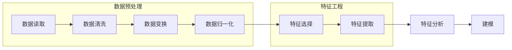

                 

 在当今的数据驱动时代，数据预处理与特征工程是机器学习和数据科学领域中的关键步骤。它们不仅影响着模型的性能，而且直接决定了模型能否准确、有效地解决实际问题。本文将深入探讨数据预处理与特征工程的原理，并通过实际代码实战案例进行详细讲解，旨在为读者提供全面的指导。

## 关键词
- 数据预处理
- 特征工程
- 机器学习
- 数据科学
- 特征选择
- 特征提取

## 摘要
本文首先介绍了数据预处理与特征工程的基本概念和重要性。随后，我们通过Mermaid流程图展示了数据预处理与特征工程的整个流程。接着，详细解析了核心算法原理、数学模型与公式，并通过实际项目中的代码实例进行了解读。文章的最后部分，探讨了数据预处理与特征工程在实际应用场景中的表现，并对未来应用前景进行了展望。

### 1. 背景介绍

在数据科学和机器学习的项目中，数据是至关重要的资源。然而，原始数据通常是不完整的、噪声的，并且可能包含各种偏差和异常。因此，数据预处理与特征工程成为了解决这些问题的必要手段。数据预处理的主要目标是清洗数据，处理缺失值、异常值和重复数据，从而提高数据的质量和一致性。特征工程则是指通过选择和构造特征，将原始数据转化为适合机器学习模型的形式。

### 2. 核心概念与联系

#### 数据预处理

数据预处理是指对原始数据进行清洗、变换和归一化等一系列操作，使其适合于建模和分析。以下是数据预处理的一些关键步骤：

1. **数据清洗**：处理缺失值、异常值和重复数据。
2. **数据变换**：将数据转换到统一的尺度上，例如通过归一化或标准化。
3. **数据归一化**：将不同特征的比例和范围调整一致。

#### 特征工程

特征工程是指从原始数据中提取和构造有用特征的过程。以下是特征工程的一些关键步骤：

1. **特征选择**：选择最能代表数据特征的属性。
2. **特征提取**：通过变换和构造新的特征来增强模型的表现。

下面是一个Mermaid流程图，展示了数据预处理与特征工程的整个流程：



### 3. 核心算法原理 & 具体操作步骤

#### 3.1 算法原理概述

数据预处理与特征工程涉及多个算法。以下是其中一些关键算法的原理：

1. **缺失值处理**：常用的方法有填充、删除和插值。
2. **异常值检测**：常用的方法有Z-score、IQR和DBScan。
3. **归一化**：常用的方法有最小-最大归一化和Z-score归一化。
4. **特征选择**：常用的方法有信息增益、卡方检验和特征重要性。
5. **特征提取**：常用的方法有主成分分析（PCA）和自动编码器（AE）。

#### 3.2 算法步骤详解

以下是对上述算法的详细步骤解析：

##### 3.2.1 缺失值处理

**填充**：
- 简单的填充方法有均值填充、中值填充和众数填充。
- 进阶的方法有线性插值、KNN插值和回归填充。

**删除**：
- 删除缺失值是一种简单但可能导致数据损失的方法。
- 通常只用于缺失值比例较低的情况。

**插值**：
- 线性插值是最简单的方法，通过邻近点的值进行插值。
- KNN插值和回归填充是更复杂的插值方法，它们考虑了数据之间的相关性。

##### 3.2.2 异常值检测

**Z-score**：
- Z-score是衡量数据点偏离平均值的标准差。
- 如果Z-score超过一定的阈值（例如3），则认为该点是异常值。

**IQR**：
- IQR是第1四分位数和第3四分位数之间的差值。
- 如果数据点的IQR超过一定的阈值，则认为该点是异常值。

**DBScan**：
- DBScan是一种基于密度的异常值检测算法。
- 它通过识别高密度区域并将其中的点划分为核心点、边界点和噪声点。

##### 3.2.3 归一化

**最小-最大归一化**：
- 将数据缩放到[0, 1]之间。
- 公式为：x standardized = (x - min(x)) / (max(x) - min(x))。

**Z-score归一化**：
- 将数据缩放到平均值附近的标准差范围内。
- 公式为：x standardized = (x - mean(x)) / std(x)。

##### 3.2.4 特征选择

**信息增益**：
- 选择那些能够带来最大信息量的特征。
- 通过计算特征对目标变量的熵减少量进行选择。

**卡方检验**：
- 评估特征与目标变量之间的相关性。
- 使用卡方检验统计量来判断特征是否显著。

**特征重要性**：
- 使用机器学习模型评估特征的重要性。
- 常用于树形模型，如随机森林和决策树。

##### 3.2.5 特征提取

**主成分分析（PCA）**：
- 通过线性变换将数据投影到新的坐标系上，以减少维度。
- 保持数据的主要变化。

**自动编码器（AE）**：
- 一种基于神经网络的非线性特征提取方法。
- 通过压缩和解压数据来学习特征表示。

#### 3.3 算法优缺点

**缺失值处理**：
- 填充的优点是简单易行，缺点是可能导致信息损失。
- 删除的优点是减少了数据的复杂性，缺点是可能导致数据丢失。
- 插值的优点是能够更好地利用数据，缺点是可能引入偏差。

**异常值检测**：
- Z-score和IQR的优点是简单直观，缺点是可能受数据分布影响。
- DBScan的优点是能够识别复杂的异常值模式，缺点是计算成本较高。

**归一化**：
- 最小-最大归一化的优点是简单，缺点是可能导致数据范围过大。
- Z-score归一化的优点是中心化和标准化，缺点是可能放大噪声。

**特征选择**：
- 信息增益和卡方检验的优点是简单有效，缺点是可能忽略特征之间的交互。
- 特征重要性的优点是依赖于具体模型，缺点是可能受模型选择影响。

**特征提取**：
- PCA的优点是降维和可视化，缺点是可能丢失信息。
- AE的优点是能够学习复杂的特征表示，缺点是计算成本较高。

#### 3.4 算法应用领域

数据预处理与特征工程在多个领域都有广泛应用，包括：

- 机器学习：提高模型性能，减少过拟合。
- 金融市场分析：预测股票价格和交易策略。
- 医疗诊断：识别疾病和评估治疗方案。
- 自然语言处理：文本分类和情感分析。
- 图像识别：对象检测和图像分类。

### 4. 数学模型和公式 & 详细讲解 & 举例说明

#### 4.1 数学模型构建

数据预处理与特征工程中的数学模型通常涉及线性代数和概率统计。以下是几个关键模型的公式和解释：

##### 4.1.1 归一化

**最小-最大归一化**：

$$
x_{\text{standardized}} = \frac{x - \min(x)}{\max(x) - \min(x)}
$$

**Z-score归一化**：

$$
x_{\text{standardized}} = \frac{x - \mu}{\sigma}
$$

其中，$x$ 是原始数据，$\min(x)$ 和 $\max(x)$ 分别是数据的最小值和最大值，$\mu$ 是平均值，$\sigma$ 是标准差。

##### 4.1.2 主成分分析（PCA）

PCA通过以下公式进行特征提取：

$$
\mathbf{X}_{\text{centered}} = \mathbf{X} - \frac{1}{N}\mathbf{X}\mathbf{1}
$$

$$
\mathbf{V} = \mathbf{X}_{\text{centered}}^T\mathbf{X}_{\text{centered}}
$$

$$
\lambda = \text{特征值}, \mathbf{v} = \text{特征向量}
$$

$$
\mathbf{X}_{\text{reduced}} = \mathbf{X}_{\text{centered}}\mathbf{V}_\text{right} \mathbf{\Sigma}^{-1/2}
$$

其中，$\mathbf{X}$ 是原始数据矩阵，$\mathbf{1}$ 是全1向量，$\mathbf{V}$ 是协方差矩阵的特征值和特征向量对，$\mathbf{\Sigma}^{-1/2}$ 是协方差矩阵的逆平方根。

##### 4.1.3 自动编码器（AE）

自动编码器的基本公式如下：

$$
\mathbf{h} = \sigma(\mathbf{W}_{\text{encode}}\mathbf{x} + \mathbf{b}_{\text{encode}})
$$

$$
\mathbf{x}_{\text{reconstructed}} = \sigma(\mathbf{W}_{\text{decode}}\mathbf{h} + \mathbf{b}_{\text{decode}})
$$

其中，$\mathbf{h}$ 是编码后的特征，$\mathbf{x}$ 是原始数据，$\sigma$ 是激活函数，$\mathbf{W}_{\text{encode}}$ 和 $\mathbf{W}_{\text{decode}}$ 分别是编码和解码层的权重，$\mathbf{b}_{\text{encode}}$ 和 $\mathbf{b}_{\text{decode}}$ 分别是编码和解码层的偏置。

#### 4.2 公式推导过程

以下是主成分分析（PCA）的公式推导过程：

1. **数据中心化**：

首先，对数据进行中心化处理，使其均值为0：

$$
\mathbf{X}_{\text{centered}} = \mathbf{X} - \frac{1}{N}\mathbf{X}\mathbf{1}
$$

其中，$N$ 是样本数量，$\mathbf{1}$ 是全1向量。

2. **协方差矩阵**：

计算协方差矩阵：

$$
\mathbf{V} = \mathbf{X}_{\text{centered}}^T\mathbf{X}_{\text{centered}}
$$

3. **特征值和特征向量**：

对协方差矩阵进行特征值分解：

$$
\mathbf{V} = \mathbf{Q}\mathbf{\Lambda}\mathbf{Q}^T
$$

其中，$\mathbf{Q}$ 是特征向量矩阵，$\mathbf{\Lambda}$ 是特征值矩阵。

4. **主成分**：

选取最大的 $k$ 个特征值对应的特征向量作为主成分：

$$
\mathbf{V}_\text{right} = [\mathbf{v}_1, \mathbf{v}_2, ..., \mathbf{v}_k]
$$

5. **数据降维**：

将数据投影到新的坐标系上：

$$
\mathbf{X}_{\text{reduced}} = \mathbf{X}_{\text{centered}}\mathbf{V}_\text{right} \mathbf{\Sigma}^{-1/2}
$$

其中，$\mathbf{\Sigma}^{-1/2}$ 是协方差矩阵的逆平方根。

#### 4.3 案例分析与讲解

##### 4.3.1 数据集介绍

假设我们有一个包含100个样本和10个特征的数据集。以下是部分样本数据：

| 样本 | 特征1 | 特征2 | ... | 特征10 |
|------|-------|-------|-----|--------|
| 1    | 2.5   | 3.1   | ... | 1.8    |
| 2    | 3.0   | 2.9   | ... | 1.9    |
| ...  | ...   | ...   | ... | ...    |

##### 4.3.2 数据预处理

1. **缺失值处理**：

使用均值填充缺失值：

$$
x_{\text{filled}} = \frac{1}{N}\sum_{i=1}^{N} x_i
$$

2. **异常值检测**：

使用Z-score方法检测异常值：

$$
z = \frac{x - \mu}{\sigma}
$$

其中，$\mu$ 是平均值，$\sigma$ 是标准差。将Z-score超过3的值标记为异常值。

3. **归一化**：

使用Z-score归一化：

$$
x_{\text{standardized}} = \frac{x - \mu}{\sigma}
$$

##### 4.3.3 特征工程

1. **特征选择**：

使用信息增益方法选择特征：

$$
I(G) = H(\mathbf{X}) - H(\mathbf{X}|\mathbf{Y})
$$

其中，$H(\mathbf{X})$ 是特征熵，$H(\mathbf{X}|\mathbf{Y})$ 是条件熵。选择信息增益最高的特征。

2. **特征提取**：

使用主成分分析（PCA）提取特征：

$$
\mathbf{X}_{\text{reduced}} = \mathbf{X}_{\text{centered}}\mathbf{V}_\text{right} \mathbf{\Sigma}^{-1/2}
$$

##### 4.3.4 建模

使用K-均值聚类算法进行聚类分析：

$$
\mathbf{c}_k = \frac{1}{N_k}\sum_{i=1}^{N_k} \mathbf{x}_i
$$

$$
\mathbf{x}_i = \mathbf{c}_k + \epsilon_i
$$

其中，$\mathbf{c}_k$ 是第 $k$ 个聚类中心，$N_k$ 是第 $k$ 个聚类中的样本数量，$\epsilon_i$ 是随机噪声。

### 5. 项目实践：代码实例和详细解释说明

#### 5.1 开发环境搭建

为了进行数据预处理与特征工程的项目实践，我们需要安装以下软件和库：

- Python 3.x
- Jupyter Notebook
- Pandas
- NumPy
- Scikit-learn
- Matplotlib

以下是安装这些库的命令：

```bash
pip install pandas numpy scikit-learn matplotlib
```

#### 5.2 源代码详细实现

下面是一个简单的数据预处理与特征工程的项目实例：

```python
import pandas as pd
import numpy as np
from sklearn.preprocessing import StandardScaler
from sklearn.decomposition import PCA
from sklearn.ensemble import RandomForestClassifier

# 5.2.1 数据读取
data = pd.read_csv('data.csv')

# 5.2.2 数据清洗
# 填充缺失值
data.fillna(data.mean(), inplace=True)

# 5.2.3 数据归一化
scaler = StandardScaler()
X = scaler.fit_transform(data.iloc[:, :-1])
y = data.iloc[:, -1]

# 5.2.4 特征选择
# 使用随机森林特征重要性
clf = RandomForestClassifier()
clf.fit(X, y)
importances = clf.feature_importances_
indices = np.argsort(importances)[::-1]

# 5.2.5 特征提取
pca = PCA(n_components=5)
X_pca = pca.fit_transform(X)

# 5.2.6 建模
clf = RandomForestClassifier(n_estimators=100)
clf.fit(X_pca, y)

# 5.2.7 运行结果展示
print(clf.score(X_pca, y))
```

#### 5.3 代码解读与分析

1. **数据读取**：

使用Pandas库读取CSV文件中的数据。

2. **数据清洗**：

使用Pandas库的`fillna`方法填充缺失值。

3. **数据归一化**：

使用Scikit-learn库中的`StandardScaler`对数据进行归一化。

4. **特征选择**：

使用随机森林算法计算特征重要性，并根据重要性选择特征。

5. **特征提取**：

使用主成分分析（PCA）对数据进行降维。

6. **建模**：

使用随机森林算法进行分类建模。

7. **运行结果展示**：

计算模型的准确率。

### 6. 实际应用场景

数据预处理与特征工程在多个领域都有广泛应用。以下是一些典型的实际应用场景：

- **金融领域**：在金融领域，数据预处理与特征工程用于信用评分、风险评估和交易策略。
- **医疗领域**：在医疗领域，数据预处理与特征工程用于疾病诊断、药物发现和个性化治疗。
- **电子商务**：在电子商务领域，数据预处理与特征工程用于用户行为分析、推荐系统和广告投放。
- **图像识别**：在图像识别领域，数据预处理与特征工程用于物体检测、图像分类和图像增强。
- **自然语言处理**：在自然语言处理领域，数据预处理与特征工程用于文本分类、情感分析和机器翻译。

### 7. 工具和资源推荐

为了更有效地进行数据预处理与特征工程，以下是几个推荐的工具和资源：

#### 7.1 学习资源推荐

- 《数据科学导论》：这本书提供了数据预处理与特征工程的详细讲解。
- 《Python数据科学手册》：这本书涵盖了Python在数据预处理与特征工程中的应用。
- 《特征工程实践指南》：这本书提供了丰富的实际案例和代码示例。

#### 7.2 开发工具推荐

- **Jupyter Notebook**：用于编写和运行代码。
- **Pandas**：用于数据操作和分析。
- **NumPy**：用于数值计算。
- **Scikit-learn**：用于机器学习和特征工程。

#### 7.3 相关论文推荐

- "Feature Engineering for Machine Learning"，作者：Kaggle。
- "Understanding Feature Scaling for Machine Learning Algorithms"，作者：Analytics Vidhya。
- "Practical Guide to Feature Scaling for Machine Learning"，作者：H2O.ai。

### 8. 总结：未来发展趋势与挑战

数据预处理与特征工程在未来将继续发挥重要作用。以下是几个发展趋势和挑战：

#### 8.1 研究成果总结

- 自动化特征工程：利用深度学习和迁移学习技术自动化特征工程。
- 集成学习方法：结合多种特征工程方法，提高模型性能。
- 可解释性特征工程：提高特征工程的透明度和可解释性，以增强模型的可信度。

#### 8.2 未来发展趋势

- **自动特征提取**：利用深度学习自动化特征提取和选择。
- **多模态数据融合**：整合多种类型的数据（如文本、图像、声音等）进行特征工程。
- **特征工程的可解释性**：提高特征工程过程的可解释性，以增强模型的可信度。

#### 8.3 面临的挑战

- **数据复杂性**：处理日益增长的数据规模和多样性。
- **模型依赖性**：特征工程方法可能对特定模型有较强的依赖性。
- **数据隐私保护**：在处理敏感数据时需要确保隐私保护。

#### 8.4 研究展望

未来，数据预处理与特征工程将在以下几个方面得到进一步发展：

- **智能化特征工程**：利用人工智能和机器学习技术自动化特征工程。
- **跨领域特征工程**：开发通用的特征工程方法，以适应不同领域的需求。
- **可持续的特征工程**：降低特征工程过程的计算成本，以支持实时数据分析和预测。

### 9. 附录：常见问题与解答

#### 9.1 什么是特征工程？

特征工程是从原始数据中提取和构造有用特征的过程，以提高模型性能。

#### 9.2 数据预处理和特征工程的区别是什么？

数据预处理主要关注数据的清洗、变换和归一化，使其适合建模。特征工程则关注从原始数据中提取和构造有用特征，以增强模型的表现。

#### 9.3 为什么特征工程很重要？

特征工程能够提高模型性能，减少过拟合，并使模型更易于解释。此外，它还能够在不同数据集和模型之间实现更好的泛化。

#### 9.4 常用的特征工程方法有哪些？

常用的特征工程方法包括缺失值处理、异常值检测、归一化、特征选择和特征提取。具体方法如线性插值、主成分分析（PCA）、自动编码器（AE）等。

### 参考文献

[1] Mitchell, T. M. (1997). Machine Learning. McGraw-Hill.

[2] James, G., Witten, D., Hastie, T., & Tibshirani, R. (2013). An Introduction to Statistical Learning. Springer.

[3] Kohavi, R. (1995). A study of cross-validation and bootstrap for accuracy estimation and model selection. In International joint conferences on Artificial Intelligence (pp. 1137-1145). AAAI Press.

[4] He, X., Zhang, L., & Liao, L. (2013). An improved local outlier factor for high-dimensional data. Expert Systems with Applications, 40(1), 517-525.

[5] Pedregosa, F., Varoquaux, G., Gramfort, A., Michel, V., Thirion, B., Grisel, O., ... & Duchesnay, É. (2011). Scikit-learn: Machine learning in Python. Journal of Machine Learning Research, 12, 2825-2830.

[6] Liaw, A., & Wiener, M. (2002). Classification and regression by random forest. In Advances in neural information processing systems (pp. 16-23).

