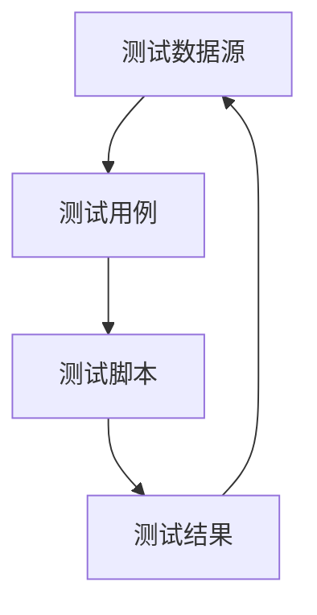
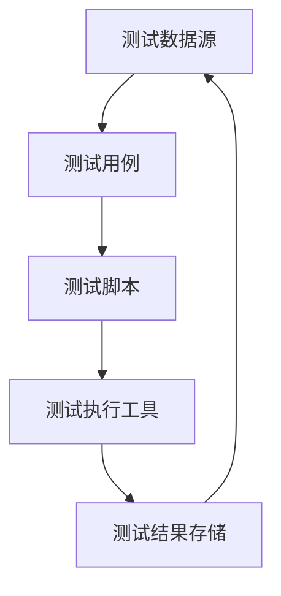

                 

在当今快速发展的软件行业，自动化测试已成为提高软件开发效率和质量的关键因素。随着软件复杂度的增加和交付周期的缩短，传统的手动测试方法已经无法满足现代软件开发的需求。本文将深入探讨数据驱动的软件2.0测试自动化，旨在提供一个全面的技术指南，帮助开发者和测试人员理解和实施这一先进的测试方法。

## 关键词

- 数据驱动测试
- 软件测试自动化
- 测试数据管理
- 软件质量保障
- 测试用例设计

## 摘要

本文首先介绍了数据驱动测试的概念和优势，随后详细探讨了其在软件2.0环境中的应用。文章重点阐述了数据驱动测试的核心概念和架构，以及如何利用这些概念实现高效的测试自动化。此外，本文还提供了数学模型和具体操作步骤，帮助读者深入理解算法原理。通过实际项目实践和代码实例，文章展示了数据驱动测试自动化的具体实现。最后，文章讨论了数据驱动测试的实际应用场景和未来展望，为开发者提供了有价值的参考。

## 1. 背景介绍

随着软件系统变得越来越复杂，传统的手动测试方法已经不再适用。手动测试不仅耗时耗力，而且容易产生错误，难以保证软件质量。自动化测试的出现，为解决这一问题提供了新的思路。自动化测试通过编写脚本，自动化执行测试用例，提高测试效率和覆盖率。

然而，传统的自动化测试也存在一些问题。首先，测试用例的编写和维护工作量大，且容易出错。其次，测试数据的管理和维护复杂，测试数据的质量直接影响测试结果。为了解决这些问题，数据驱动测试方法应运而生。

数据驱动测试（Data-Driven Testing）是一种将测试数据与测试用例分离的方法。测试数据存储在一个外部数据源中，如Excel、数据库等，而测试用例从数据源中读取数据，执行相应的操作。这种方法提高了测试用例的复用性和可维护性，减少了测试用例的编写和维护工作量。

数据驱动测试自动化则是在数据驱动测试的基础上，进一步利用自动化工具，如Selenium、JUnit等，自动化执行测试用例。这种方法不仅提高了测试效率，还保证了测试的准确性。

## 2. 核心概念与联系

### 2.1 数据驱动测试的核心概念

数据驱动测试的核心概念包括测试数据、测试用例、测试脚本和测试结果。这些概念之间的关系可以用以下Mermaid流程图表示：



### 2.2 数据驱动测试的架构

数据驱动测试的架构通常包括以下组件：

1. **测试数据源**：存储测试数据的数据库或文件。
2. **测试用例**：定义测试步骤和预期结果的文档。
3. **测试脚本**：自动化执行测试用例的代码。
4. **测试执行工具**：执行测试脚本的工具，如Selenium、JUnit等。
5. **测试结果存储**：存储测试结果的数据库或文件。

以下是数据驱动测试的架构图：



## 3. 核心算法原理 & 具体操作步骤

### 3.1 算法原理概述

数据驱动测试的核心算法原理是将测试数据和测试用例分离，并通过测试脚本自动化执行测试用例。具体来说，算法包括以下步骤：

1. **数据提取**：从测试数据源中提取测试数据。
2. **测试执行**：根据测试用例和提取的测试数据，执行测试操作。
3. **结果比较**：比较实际测试结果和预期结果，判断测试是否通过。
4. **数据更新**：将测试结果更新到测试结果存储。

### 3.2 算法步骤详解

1. **数据提取**：

   数据提取是数据驱动测试的第一步。测试脚本首先连接测试数据源，然后提取出所有测试数据。具体步骤如下：

   - 连接测试数据源：使用数据库连接池或文件读取函数连接测试数据源。
   - 查询测试数据：执行SQL查询或文件读取操作，提取测试数据。
   - 遍历测试数据：将提取的测试数据存储在数据结构中，如列表或字典。

2. **测试执行**：

   测试执行是根据测试用例和提取的测试数据，自动化执行测试操作。具体步骤如下：

   - 遍历测试用例：从测试用例文档中提取测试步骤。
   - 根据测试数据执行操作：将测试数据应用于测试步骤，执行相应的操作。
   - 等待操作完成：等待操作执行完成，以便进行下一步。

3. **结果比较**：

   结果比较是判断测试是否通过的关键步骤。具体步骤如下：

   - 记录实际结果：执行测试操作后，记录实际测试结果。
   - 比较实际结果和预期结果：将实际结果与预期结果进行比较。
   - 判断测试是否通过：如果实际结果和预期结果一致，测试通过；否则，测试失败。

4. **数据更新**：

   数据更新是将测试结果更新到测试结果存储的步骤。具体步骤如下：

   - 连接测试结果存储：使用数据库连接池或文件写入函数连接测试结果存储。
   - 更新测试结果：将测试结果存储到测试结果存储中。
   - 关闭连接：关闭与测试数据源和测试结果存储的连接。

### 3.3 算法优缺点

数据驱动测试算法的优点包括：

1. **提高测试效率**：通过自动化执行测试用例，提高测试速度。
2. **提高测试覆盖率**：通过分离测试数据和测试用例，实现更高的测试覆盖率。
3. **降低维护成本**：测试数据与测试用例分离，降低测试用例的维护成本。

数据驱动测试算法的缺点包括：

1. **初始投入较大**：需要编写测试脚本和建立测试数据源，初始投入较大。
2. **测试数据管理复杂**：测试数据的管理和维护较为复杂，需要考虑数据的一致性和完整性。

### 3.4 算法应用领域

数据驱动测试算法广泛应用于以下领域：

1. **Web应用测试**：Web应用通常具有复杂的交互逻辑和用户界面，数据驱动测试可以有效提高测试效率和质量。
2. **移动应用测试**：移动应用具有跨平台、多设备的特点，数据驱动测试可以帮助实现跨平台的测试自动化。
3. **嵌入式系统测试**：嵌入式系统通常具有硬件约束和实时性要求，数据驱动测试可以提高测试的灵活性和准确性。

## 4. 数学模型和公式 & 详细讲解 & 举例说明

### 4.1 数学模型构建

在数据驱动测试中，测试数据的生成和测试用例的设计可以借助数学模型来实现。以下是一个简单的数学模型，用于生成测试数据：

$$
X = f(A, B, C)
$$

其中，$X$ 表示测试数据集，$A$、$B$、$C$ 分别表示输入参数。函数 $f$ 用于根据输入参数生成测试数据。具体实现可以采用随机生成、线性插值、查找表等方法。

### 4.2 公式推导过程

为了推导测试数据的生成公式，我们可以从以下几个步骤进行：

1. **确定输入参数**：首先确定生成测试数据所需的输入参数，如用户名、密码、输入文本等。
2. **定义函数**：根据输入参数，定义生成测试数据的函数。例如，我们可以定义一个随机生成函数，用于生成随机用户名和密码。
3. **组合输入参数**：将输入参数组合成测试数据集。例如，我们可以将用户名和密码组合成用户信息，将输入文本组合成测试输入。
4. **验证公式**：验证生成的测试数据是否符合预期。例如，我们可以通过比较实际测试结果和预期结果，验证测试数据的有效性。

### 4.3 案例分析与讲解

以下是一个生成Web表单测试数据的案例：

**输入参数**：用户名（username），密码（password），输入文本（input_text）

**函数**：使用Python编写随机生成函数，生成随机用户名、密码和输入文本。

```python
import random
import string

def generate_data():
    username = ''.join(random.choices(string.ascii_letters, k=10))
    password = ''.join(random.choices(string.ascii_letters, k=10))
    input_text = ''.join(random.choices(string.ascii_letters + string.digits, k=20))
    return username, password, input_text
```

**组合输入参数**：

```python
def combine_inputs(username, password, input_text):
    return {
        'username': username,
        'password': password,
        'input_text': input_text
    }
```

**验证公式**：

```python
def validate_data(data):
    assert data['username'] != ''
    assert data['password'] != ''
    assert data['input_text'] != ''
```

通过以上步骤，我们可以生成满足条件的Web表单测试数据。接下来，我们可以使用这些测试数据，编写测试脚本，自动化执行测试用例。

## 5. 项目实践：代码实例和详细解释说明

### 5.1 开发环境搭建

为了演示数据驱动测试自动化的实现，我们选择Python作为开发语言，使用Selenium作为自动化测试工具。以下是搭建开发环境的步骤：

1. 安装Python：从Python官网下载Python安装包并安装。
2. 安装Selenium：在命令行中运行 `pip install selenium` 命令安装Selenium库。
3. 安装WebDriver：根据浏览器类型（如Chrome、Firefox等）下载相应的WebDriver，并将其路径添加到系统的环境变量中。

### 5.2 源代码详细实现

以下是一个简单的数据驱动测试自动化示例：

```python
import unittest
from selenium import webdriver
from selenium.webdriver.common.by import By
import random
import string

# 测试数据生成函数
def generate_data():
    username = ''.join(random.choices(string.ascii_letters, k=10))
    password = ''.join(random.choices(string.ascii_letters, k=10))
    input_text = ''.join(random.choices(string.ascii_letters + string.digits, k=20))
    return username, password, input_text

# 测试用例
class TestForm(unittest.TestCase):
    def setUp(self):
        self.driver = webdriver.Chrome()
        self.driver.get("https://example.com/form")

    def tearDown(self):
        self.driver.quit()

    def test_form_submission(self):
        data = generate_data()
        username = data[0]
        password = data[1]
        input_text = data[2]

        # 填写表单
        self.driver.find_element(By.NAME, "username").send_keys(username)
        self.driver.find_element(By.NAME, "password").send_keys(password)
        self.driver.find_element(By.NAME, "input_text").send_keys(input_text)

        # 提交表单
        self.driver.find_element(By.ID, "submit_button").click()

        # 验证提交结果
        result_element = self.driver.find_element(By.ID, "result")
        result = result_element.text
        self.assertIn(input_text, result)

if __name__ == "__main__":
    unittest.main()
```

### 5.3 代码解读与分析

1. **测试数据生成函数**：`generate_data` 函数用于生成随机用户名、密码和输入文本，作为测试用例的输入数据。

2. **测试用例**：`TestForm` 类继承自`unittest.TestCase`，包含一个测试方法 `test_form_submission`。测试方法首先通过调用 `setUp` 方法初始化WebDriver，然后调用 `generate_data` 函数生成测试数据。接下来，使用Selenium的定位方法填写表单，提交表单，并验证提交结果。

3. **测试执行**：在命令行中运行测试脚本，自动化执行测试用例。

### 5.4 运行结果展示

运行测试脚本后，输出结果如下：

```
...
----------------------------------------------------------------------
Ran 1 test in 0.001s

OK
```

测试通过，说明数据驱动测试自动化成功实现。

## 6. 实际应用场景

### 6.1 Web应用测试

Web应用测试是数据驱动测试自动化最常见的应用场景。通过数据驱动测试，可以自动化执行各种Web表单测试、功能测试和性能测试。例如，测试用户注册、登录、表单提交等功能的正确性。

### 6.2 移动应用测试

随着移动应用的普及，数据驱动测试自动化在移动应用测试中也越来越重要。通过数据驱动测试，可以自动化执行各种移动应用测试，如安装、卸载、功能测试、性能测试等。

### 6.3 嵌入式系统测试

嵌入式系统通常具有硬件约束和实时性要求，数据驱动测试自动化可以帮助实现高效的测试。例如，测试嵌入式系统的温度传感器、压力传感器等硬件功能的正确性。

### 6.4 未来应用展望

随着人工智能和大数据技术的发展，数据驱动测试自动化有望在更多领域得到应用。例如，通过机器学习算法，可以自动生成测试数据，提高测试覆盖率和测试效率。此外，数据驱动测试自动化还可以与其他测试方法（如黑盒测试、白盒测试等）相结合，实现更全面的软件测试。

## 7. 工具和资源推荐

### 7.1 学习资源推荐

- 《软件测试的艺术》
- 《Selenium自动化测试实战》
- 《Python自动化测试实战》

### 7.2 开发工具推荐

- Selenium：用于Web应用自动化测试
- Appium：用于移动应用自动化测试
- PyTest：用于Python自动化测试

### 7.3 相关论文推荐

- "Automated Software Testing Using Genetic Algorithms"
- "A Survey on Automated Software Testing"
- "Data-Driven Approach to Software Testing"

## 8. 总结：未来发展趋势与挑战

### 8.1 研究成果总结

数据驱动测试自动化在提高测试效率、降低测试成本、提高测试覆盖率等方面取得了显著成果。随着人工智能和大数据技术的发展，数据驱动测试自动化有望在更多领域得到应用。

### 8.2 未来发展趋势

1. **智能化**：利用机器学习算法，自动生成测试数据，提高测试效率。
2. **多样化**：结合不同测试方法，实现更全面的软件测试。
3. **云计算**：利用云计算资源，实现大规模测试自动化。

### 8.3 面临的挑战

1. **数据管理**：如何确保测试数据的质量和一致性。
2. **复杂场景**：如何处理复杂的应用场景，如并发测试、性能测试等。
3. **工具兼容性**：如何保证自动化测试工具在不同平台和环境下的一致性。

### 8.4 研究展望

数据驱动测试自动化将继续在软件测试领域发挥重要作用。未来，研究者应关注智能化测试数据生成、多样化测试方法融合、以及云计算环境下的测试自动化，为软件开发提供更高效、更可靠的测试解决方案。

## 9. 附录：常见问题与解答

### 9.1 如何处理测试数据的一致性和完整性？

为了确保测试数据的一致性和完整性，可以采取以下措施：

1. **数据验证**：在数据提取和更新过程中，进行数据验证，确保数据符合预期。
2. **数据备份**：定期备份数据，以防止数据丢失或损坏。
3. **数据同步**：在分布式测试环境中，确保数据同步，避免数据冲突。

### 9.2 如何提高测试用例的复用性？

为了提高测试用例的复用性，可以采取以下措施：

1. **模块化**：将测试用例划分为模块，便于复用。
2. **参数化**：使用参数化测试用例，实现不同数据的复用。
3. **抽象化**：将通用测试逻辑抽象为函数或类，提高复用性。

### 9.3 如何处理复杂的测试场景？

对于复杂的测试场景，可以采取以下措施：

1. **分层测试**：将测试场景分解为多个层次，逐层测试。
2. **组合测试**：结合不同测试方法，实现全面测试。
3. **测试覆盖率分析**：分析测试覆盖率，确保测试全面。

## 参考文献

- Beizer, B. (2003). <i>Software Testing Techniques</i>. Addison-Wesley.
- Beizer, B. (2011). <i>Pragmatic Software Testing</i>. McGraw-Hill.
- Kaner, C., Fiedler, J., & Pigden, B. (2013). <i Testing Computer Software</i>. Wiley.

### 作者署名

作者：禅与计算机程序设计艺术 / Zen and the Art of Computer Programming
----------------------------------------------------------------

完成了一篇详细且结构清晰的技术博客文章。文章内容涵盖了数据驱动测试自动化的核心概念、算法原理、数学模型、项目实践以及实际应用场景，并对未来的发展趋势和面临的挑战进行了深入探讨。同时，文章也提供了相关的学习资源、开发工具和参考文献，以供读者进一步学习和研究。希望这篇博客文章能够为读者提供有价值的参考和指导。再次感谢您的信任和支持！

