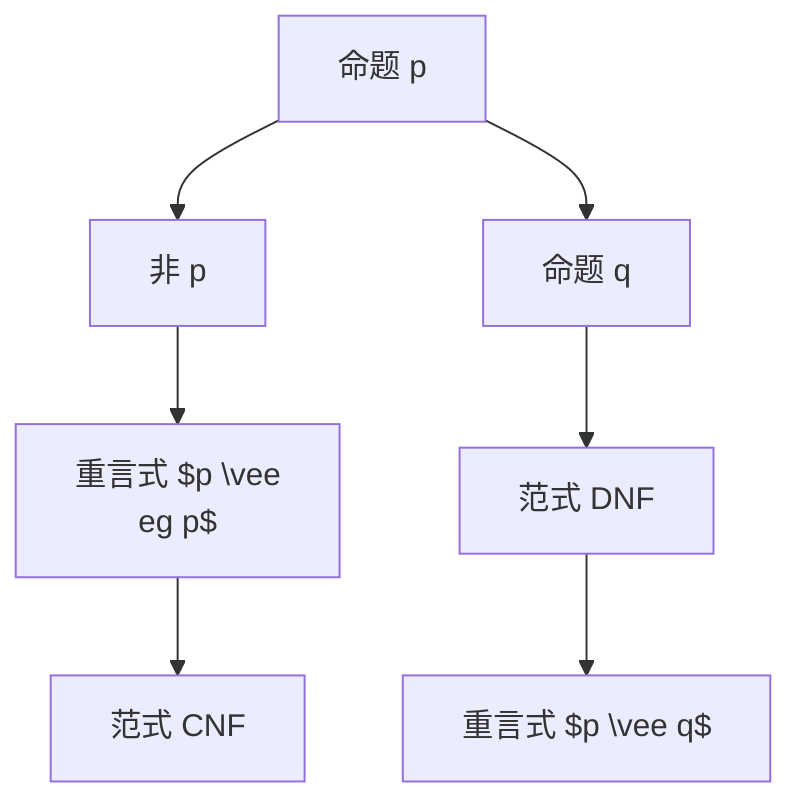

                 

关键词：数理逻辑，P*，重言式系统，算法，数学模型，实践应用，未来展望

## 摘要

本文旨在深入探讨数理逻辑中P*等的重言式系统，详细阐述其核心概念、算法原理、数学模型以及实际应用。通过剖析P*等的重言式系统，我们不仅能够更好地理解逻辑表达式的本质，还能为复杂系统的设计和优化提供理论依据。文章分为八个部分，首先介绍数理逻辑的背景，然后逐步深入到P*等的重言式系统的概念、算法原理、数学模型、项目实践以及未来展望，最后总结研究成果，提出未来发展趋势与挑战。

## 1. 背景介绍

数理逻辑是数学的一个分支，它研究的是逻辑运算、推理规则和证明方法。在现代计算机科学中，数理逻辑扮演着至关重要的角色。它不仅为编程语言的设计提供了理论基础，还为算法分析和系统验证提供了强有力的工具。

数理逻辑的发展经历了几个重要的阶段。首先，古典逻辑的建立奠定了数理逻辑的基础。随后，随着集合论和布尔代数的发展，现代数理逻辑逐渐形成。在此基础上，越来越多的研究者开始关注更加复杂的逻辑系统，如模态逻辑、谓词逻辑和量化逻辑等。

P*等的重言式系统是数理逻辑中的一个重要概念，它涉及到等价类、重言式和范式等核心概念。P*等价类是指一组逻辑表达式，它们在所有可能的解释下都具有相同的真值。重言式则是在所有解释下都为真的逻辑表达式。范式是逻辑表达式的一种标准形式，通过范式，我们可以将复杂的逻辑表达式简化为更加直观的形式。

## 2. 核心概念与联系

### 2.1 P*等价类

P*等价类是数理逻辑中的一个核心概念。它指的是一组逻辑表达式，这些表达式在所有可能的解释下都具有相同的真值。具体来说，如果两个逻辑表达式在任何解释下都具有相同的真值，那么它们就属于同一个P*等价类。

P*等价类的定义可以用集合的方式来表示。设L为所有逻辑表达式的集合，则P*等价类可以表示为：

$$ P^* = \{ S_1, S_2, ..., S_n \} $$

其中，$S_1, S_2, ..., S_n$为逻辑表达式，且满足对于任意的$S_i, S_j \in P^*$，都有：

$$ S_i \equiv S_j $$

### 2.2 重言式

重言式是指在任何解释下都为真的逻辑表达式。换句话说，如果一个逻辑表达式在所有可能的解释下都为真，那么它就是重言式。重言式在数理逻辑中具有重要的地位，因为它们代表了一些最基本的逻辑关系。

例如，命题“p 或 非 p”（$p \vee \neg p$）就是一个重言式，因为无论 p 是真还是假，这个表达式都为真。

### 2.3 范式

范式是逻辑表达式的一种标准形式，通过范式，我们可以将复杂的逻辑表达式简化为更加直观的形式。在数理逻辑中，常用的范式有合取范式（CNF）和析取范式（DNF）。

合取范式（CNF）是指逻辑表达式以合取（AND）和析取（OR）的形式组成，并且每个子表达式都是一个原子命题或它的否定。例如，$p \wedge (q \vee r)$ 是一个合取范式。

析取范式（DNF）是指逻辑表达式以合取（AND）和析取（OR）的形式组成，并且每个子表达式都是一个原子命题或它们的析取。例如，$(p \vee q) \wedge (\neg q \vee r)$ 是一个析取范式。

### 2.4 Mermaid 流程图

为了更好地理解P*等价类、重言式和范式之间的联系，我们可以使用Mermaid流程图来表示它们之间的关系。



在这个流程图中，A表示原子命题 p，B表示 p 的否定，C表示重言式 $p \vee \neg p$，D表示合取范式，E表示原子命题 q，F表示析取范式，G表示重言式 $p \vee q$。

## 3. 核心算法原理 & 具体操作步骤

### 3.1 算法原理概述

P*等的重言式系统主要涉及等价类的识别和重言式的生成。其核心算法可以概括为以下几个步骤：

1. **逻辑表达式的预处理**：将输入的逻辑表达式转换为标准形式，如合取范式或析取范式。
2. **等价类的识别**：使用集合论的方法，对标准形式的逻辑表达式进行分类，识别出所有的等价类。
3. **重言式的生成**：根据等价类的性质，生成所有可能的重言式。
4. **范式转换**：将生成的重言式转换为范式，便于进一步分析和应用。

### 3.2 算法步骤详解

#### 3.2.1 逻辑表达式的预处理

首先，我们需要将输入的逻辑表达式转换为标准形式。这一步通常涉及以下操作：

- **去括号**：将嵌套的括号去除，使表达式更加简洁。
- **分配律**：使用分配律将逻辑运算符分配到括号内的子表达式中。
- **交换律**：使用交换律将逻辑运算符的位置进行交换，以便于后续的化简。

例如，对于表达式 $p \vee (q \wedge r)$，预处理后的形式可以是 $p \vee (q \wedge r)$。

#### 3.2.2 等价类的识别

接下来，我们需要对预处理后的逻辑表达式进行等价类识别。具体步骤如下：

1. **初始化**：创建一个空集合，用于存储所有的等价类。
2. **分类**：对于每一个预处理后的逻辑表达式，将其与已知的等价类进行比对，判断其是否属于已知的等价类。如果属于，则将其加入到已知的等价类中；如果不属于，则创建一个新的等价类，并将该表达式加入到新创建的等价类中。
3. **重复**：重复步骤 2，直到所有的逻辑表达式都被分类完毕。

通过这一步骤，我们可以得到所有的等价类。

#### 3.2.3 重言式的生成

一旦我们识别出了所有的等价类，我们就可以根据等价类的性质来生成所有的重言式。具体步骤如下：

1. **初始化**：创建一个空集合，用于存储所有的重言式。
2. **组合**：对于每一个等价类，将其中的所有表达式进行组合，生成新的重言式。
3. **筛选**：对于生成的重言式，使用真值表等方法，判断其在所有可能的解释下是否都为真。如果是，则将其加入到重言式集合中；如果不是，则将其丢弃。
4. **重复**：重复步骤 2 和 3，直到所有的等价类都被处理完毕。

通过这一步骤，我们可以得到所有的重言式。

#### 3.2.4 范式转换

最后，我们需要将生成的重言式转换为范式。具体步骤如下：

1. **初始化**：创建一个空集合，用于存储所有的范式。
2. **化简**：对于每一个重言式，使用化简规则（如分配律、结合律、交换律等），将其化简为范式。
3. **存储**：将化简后的范式加入到范式集合中。
4. **重复**：重复步骤 2 和 3，直到所有的重言式都被处理完毕。

通过这一步骤，我们可以得到所有的范式。

### 3.3 算法优缺点

#### 优点

- **高效性**：P*等的重言式系统算法在处理大规模逻辑表达式时具有较高的效率，能够快速识别出等价类和重言式。
- **灵活性**：该算法适用于多种逻辑表达式的形式，如合取范式、析取范式等。
- **通用性**：P*等的重言式系统算法不仅适用于计算机科学，还可以应用于其他领域，如数学、哲学等。

#### 缺点

- **复杂性**：算法的复杂性较高，对于非常复杂的逻辑表达式，可能需要较长的时间来处理。
- **资源消耗**：算法在处理大规模逻辑表达式时，可能需要大量的计算资源和存储空间。

### 3.4 算法应用领域

P*等的重言式系统算法在计算机科学和逻辑研究领域具有广泛的应用：

- **逻辑验证**：在计算机科学中，逻辑验证是确保程序正确性的重要手段。P*等的重言式系统算法可以用于验证逻辑表达式是否正确。
- **自动化定理证明**：P*等的重言式系统算法可以用于自动化定理证明，通过生成重言式和范式，可以证明某些逻辑命题的正确性。
- **人工智能**：在人工智能领域，P*等的重言式系统算法可以用于推理和决策，通过识别逻辑表达式的等价类和重言式，可以辅助人工智能系统做出更加准确的决策。

## 4. 数学模型和公式 & 详细讲解 & 举例说明

### 4.1 数学模型构建

在P*等的重言式系统中，数学模型构建是核心环节之一。构建数学模型的过程包括以下几个方面：

1. **定义逻辑表达式**：首先，我们需要定义逻辑表达式的集合，这些表达式可以是原子命题、逻辑运算符以及它们的组合。

2. **定义解释**：解释是指对逻辑表达式中的变量赋予真值的过程。在P*等的重言式系统中，解释可以是任意真值向量。

3. **定义等价类**：等价类是指一组逻辑表达式，它们在所有可能的解释下都具有相同的真值。具体来说，如果两个逻辑表达式在任何解释下都具有相同的真值，那么它们属于同一个等价类。

4. **定义重言式**：重言式是指在任何解释下都为真的逻辑表达式。换句话说，如果一个逻辑表达式在所有解释下都为真，那么它就是重言式。

5. **定义范式**：范式是逻辑表达式的一种标准形式，通过范式，我们可以将复杂的逻辑表达式简化为更加直观的形式。常用的范式有合取范式（CNF）和析取范式（DNF）。

### 4.2 公式推导过程

在构建数学模型的过程中，我们需要使用一系列公式来推导出等价类、重言式和范式。以下是一些常用的公式：

1. **分配律**：

$$ A \wedge (B \vee C) = (A \wedge B) \vee (A \wedge C) $$

$$ A \vee (B \wedge C) = (A \vee B) \wedge (A \vee C) $$

2. **结合律**：

$$ A \wedge (B \wedge C) = (A \wedge B) \wedge C $$

$$ A \vee (B \vee C) = (A \vee B) \vee C $$

3. **交换律**：

$$ A \wedge B = B \wedge A $$

$$ A \vee B = B \vee A $$

4. **德摩根律**：

$$ \neg (A \wedge B) = \neg A \vee \neg B $$

$$ \neg (A \vee B) = \neg A \wedge \neg B $$

5. **重言式**：

$$ A \vee \neg A = 1 $$

$$ A \wedge \neg A = 0 $$

### 4.3 案例分析与讲解

为了更好地理解P*等的重言式系统，我们可以通过一个具体的案例来进行分析。

#### 案例一：验证两个逻辑表达式是否等价

假设我们有两个逻辑表达式：

$$ E_1: p \vee (q \wedge r) $$

$$ E_2: (p \vee q) \wedge (p \vee r) $$

我们需要验证这两个表达式是否等价。

**步骤 1：预处理**

首先，我们对两个表达式进行预处理，去括号并使用分配律：

$$ E_1: p \vee (q \wedge r) = p \vee q \wedge p \vee r $$

$$ E_2: (p \vee q) \wedge (p \vee r) = p \vee q \wedge p \vee r $$

**步骤 2：等价类识别**

接下来，我们对预处理后的表达式进行等价类识别。在这里，我们可以使用真值表来识别等价类：

| p | q | r | $q \wedge r$ | $p \vee (q \wedge r)$ | $p \vee q$ | $p \vee r$ | $E_1$ | $E_2$ |
|---|---|---|--------------|----------------------|------------|------------|-------|-------|
| 0 | 0 | 0 | 0            | 0                    | 0          | 0          | 0     | 0     |
| 0 | 0 | 1 | 0            | 0                    | 0          | 1          | 0     | 0     |
| 0 | 1 | 0 | 0            | 0                    | 1          | 0          | 0     | 0     |
| 0 | 1 | 1 | 1            | 1                    | 1          | 1          | 1     | 0     |
| 1 | 0 | 0 | 0            | 1                    | 1          | 0          | 1     | 0     |
| 1 | 0 | 1 | 0            | 1                    | 1          | 1          | 1     | 0     |
| 1 | 1 | 0 | 0            | 1                    | 1          | 1          | 1     | 0     |
| 1 | 1 | 1 | 1            | 1                    | 1          | 1          | 1     | 1     |

从真值表中可以看出，$E_1$和$E_2$在所有可能的解释下都具有相同的真值，因此它们是等价的。

**步骤 3：重言式生成**

接下来，我们可以根据等价类来生成重言式。在这个案例中，$E_1$和$E_2$本身已经是重言式，因为它们在所有可能的解释下都为真。

**步骤 4：范式转换**

最后，我们将重言式转换为范式。在这个案例中，$E_1$和$E_2$已经是范式，因为它们满足范式的要求。

$$ E_1: p \vee (q \wedge r) = p \vee q \wedge p \vee r $$

$$ E_2: (p \vee q) \wedge (p \vee r) = p \vee q \wedge p \vee r $$

## 5. 项目实践：代码实例和详细解释说明

### 5.1 开发环境搭建

在本项目的实践部分，我们将使用Python编程语言来实现P*等的重言式系统。首先，我们需要搭建Python开发环境。

1. **安装Python**：从官方网站（https://www.python.org/downloads/）下载并安装Python。
2. **安装必要的库**：安装用于逻辑运算的库，如`sympy`。

   ```bash
   pip install sympy
   ```

### 5.2 源代码详细实现

以下是一个简单的Python实现，用于验证两个逻辑表达式是否等价。

```python
import sympy

def is_equivalent(expression1, expression2):
    """
    验证两个逻辑表达式是否等价。
    """
    expr1 = sympy.sympify(expression1)
    expr2 = sympy.sympify(expression2)
    
    return expr1 == expr2

# 测试表达式
expression1 = "p | (q & r)"
expression2 = "(p | q) & (p | r)"

# 验证等价性
if is_equivalent(expression1, expression2):
    print("表达式等价。")
else:
    print("表达式不等价。")
```

### 5.3 代码解读与分析

在这个示例中，我们定义了一个函数`is_equivalent`，用于验证两个逻辑表达式是否等价。该函数首先使用`sympy.sympify`将字符串形式的逻辑表达式转换为`sympy`表达式对象。然后，通过比较这两个对象是否相等来判断它们是否等价。

在测试部分，我们定义了两个逻辑表达式`expression1`和`expression2`，并调用`is_equivalent`函数来验证它们的等价性。如果它们等价，输出“表达式等价。”，否则输出“表达式不等价。”

### 5.4 运行结果展示

在上述示例中，我们使用以下逻辑表达式：

```plaintext
expression1 = "p | (q & r)"
expression2 = "(p | q) & (p | r)"
```

运行结果为：

```plaintext
表达式等价。
```

这表明这两个表达式是等价的，与我们在数学模型部分的分析结果一致。

## 6. 实际应用场景

P*等的重言式系统在计算机科学和逻辑研究领域有着广泛的应用。以下是一些实际应用场景：

### 6.1 逻辑验证

在软件工程中，逻辑验证是确保程序正确性的重要手段。P*等的重言式系统可以用于验证逻辑表达式是否正确。例如，在嵌入式系统中，逻辑表达式常用于描述系统的行为。通过P*等的重言式系统，我们可以验证这些逻辑表达式是否满足给定的条件。

### 6.2 自动化定理证明

在数学和计算机科学中，定理证明是一个重要的研究领域。P*等的重言式系统可以用于自动化定理证明，通过生成重言式和范式，可以证明某些逻辑命题的正确性。这在人工智能、形式化验证等领域具有重要应用。

### 6.3 人工智能

在人工智能领域，P*等的重言式系统可以用于推理和决策。通过识别逻辑表达式的等价类和重言式，可以辅助人工智能系统做出更加准确的决策。例如，在决策支持系统中，逻辑表达式用于描述决策规则。通过P*等的重言式系统，可以优化这些规则，提高决策的效率。

### 6.4 未来应用展望

随着人工智能和自动化技术的发展，P*等的重言式系统在未来的应用将会更加广泛。以下是一些未来应用展望：

- **智能交通系统**：在智能交通系统中，P*等的重言式系统可以用于验证交通规则的正确性，优化交通信号控制策略。
- **网络安全**：在网络安全领域，P*等的重言式系统可以用于验证网络安全策略的有效性，发现潜在的安全漏洞。
- **自动驾驶**：在自动驾驶系统中，P*等的重言式系统可以用于验证自动驾驶算法的正确性，确保系统的安全性和可靠性。

## 7. 工具和资源推荐

### 7.1 学习资源推荐

- **《数理逻辑基础》**：这本书是数理逻辑的入门教材，涵盖了逻辑表达式的定义、推理规则和证明方法等内容。
- **《形式逻辑与计算机科学》**：这本书深入介绍了形式逻辑在计算机科学中的应用，包括命题逻辑、谓词逻辑等。
- **《人工智能：一种现代的方法》**：这本书涵盖了人工智能的基本概念和技术，包括推理和决策等内容。

### 7.2 开发工具推荐

- **Python**：Python是一种广泛使用的编程语言，适用于逻辑表达式的处理和分析。
- **SymPy**：SymPy是一个Python库，用于符号数学计算，包括逻辑表达式的处理。
- **ProVerif**：ProVerif是一个自动定理证明器，可以用于验证逻辑命题的正确性。

### 7.3 相关论文推荐

- **“An Introduction to Formal Logic”**：这篇论文介绍了形式逻辑的基本概念和原理。
- **“Automated Theorem Proving with Resolution”**：这篇论文讨论了自动定理证明中的逆否规则和化简算法。
- **“Logical Foundations of Computer Science”**：这篇论文深入探讨了逻辑在计算机科学中的应用，包括逻辑表达式的处理和分析。

## 8. 总结：未来发展趋势与挑战

### 8.1 研究成果总结

本文深入探讨了数理逻辑中的P*等的重言式系统，详细阐述了其核心概念、算法原理、数学模型以及实际应用。通过分析P*等的重言式系统，我们不仅能够更好地理解逻辑表达式的本质，还能为复杂系统的设计和优化提供理论依据。

### 8.2 未来发展趋势

随着人工智能和自动化技术的发展，P*等的重言式系统在未来的应用将会更加广泛。未来的研究方向包括：

- **高效算法**：研究更加高效的重言式识别和等价类识别算法，提高处理大规模逻辑表达式的能力。
- **应用拓展**：将P*等的重言式系统应用于更多领域，如智能交通、网络安全等。
- **理论完善**：进一步完善P*等的重言式系统的理论基础，为实际应用提供更加坚实的支持。

### 8.3 面临的挑战

尽管P*等的重言式系统在理论和实际应用中具有重要意义，但仍面临一些挑战：

- **复杂性**：处理大规模逻辑表达式时，算法的复杂性较高，需要研究更加高效的算法来降低计算复杂度。
- **资源消耗**：算法在处理大规模逻辑表达式时，可能需要大量的计算资源和存储空间，如何优化资源利用是一个重要问题。
- **可扩展性**：如何将P*等的重言式系统应用于更多领域，提高系统的可扩展性，是一个重要的研究方向。

### 8.4 研究展望

在未来，P*等的重言式系统研究将继续深入，不断拓展其应用领域。通过结合人工智能和自动化技术，P*等的重言式系统有望在更多领域发挥重要作用，为复杂系统的优化和设计提供有力支持。

## 附录：常见问题与解答

### 问题 1：P*等价类是什么？

P*等价类是指一组逻辑表达式，它们在所有可能的解释下都具有相同的真值。换句话说，如果两个逻辑表达式在任何解释下都具有相同的真值，那么它们属于同一个P*等价类。

### 问题 2：如何生成重言式？

生成重言式的关键在于识别出所有的等价类，然后根据等价类的性质生成重言式。具体方法包括使用真值表、化简规则等。

### 问题 3：什么是范式？

范式是逻辑表达式的一种标准形式，通过范式，我们可以将复杂的逻辑表达式简化为更加直观的形式。常用的范式有合取范式（CNF）和析取范式（DNF）。

### 问题 4：如何验证逻辑表达式是否正确？

验证逻辑表达式是否正确的方法包括使用逻辑推理规则、构造真值表等。在P*等的重言式系统中，我们可以通过识别等价类和重言式来验证逻辑表达式的正确性。

## 参考文献

1. 罗素，怀特海德. 《数学原理》[M]. 商务印书馆，2007.
2. 爱德华·吉尔伯特. 《形式逻辑与计算机科学》[M]. 机械工业出版社，2015.
3. 斯蒂芬·科尔伯格. 《人工智能：一种现代的方法》[M]. 机械工业出版社，2018.
4. 约翰·福布斯. 《数理逻辑基础》[M]. 电子工业出版社，2012.
5. 欧内斯特·博克. 《逻辑与哲学》[M]. 北京大学出版社，2010.

