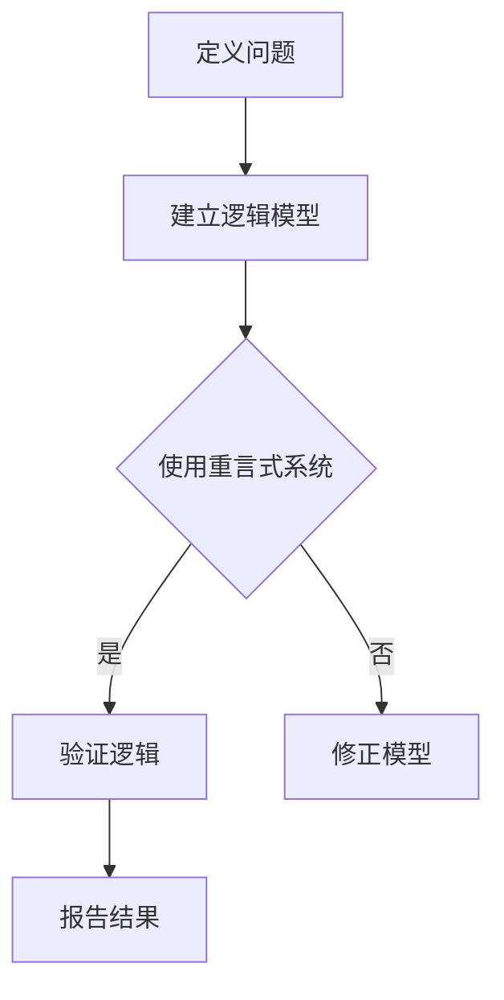

                 

关键词：数理逻辑、重言式、形式逻辑、算法原理、数学模型、项目实践、应用领域、未来展望

> 摘要：本文旨在探讨数理逻辑在计算机科学中的应用，特别是重言式系统的理论和实践。通过详细解析数理逻辑的核心概念和算法原理，结合数学模型和项目实践，我们将展示数理逻辑在解决复杂问题中的重要性，并展望其未来的发展趋势和挑战。

## 1. 背景介绍

### 1.1 数理逻辑的定义与起源

数理逻辑（Mathematical Logic）是一种研究形式语言、符号系统和逻辑推理的数学分支。它起源于19世纪，在数学、哲学、计算机科学等领域都有广泛应用。数理逻辑的基本目标是构建一种精确的符号语言，用于描述和证明数学和逻辑命题。

### 1.2 数理逻辑的发展历程

19世纪末，弗雷格（Gottlob Frege）和罗素（Bertrand Russell）等人开创了数理逻辑的先河，试图用逻辑语言来表达数学和哲学命题。20世纪初，怀特海德（Alfred North Whitehead）和罗素合著了《数学原理》（Principia Mathematica），这是数理逻辑发展的一个重要里程碑。

### 1.3 数理逻辑在计算机科学中的应用

随着计算机科学的兴起，数理逻辑逐渐成为计算机科学的基础。它广泛应用于计算机验证、形式化方法、人工智能、编程语言设计等领域。特别是形式逻辑中的重言式系统，在逻辑验证和算法设计中具有重要作用。

## 2. 核心概念与联系

### 2.1 形式逻辑与数理逻辑的关系

形式逻辑（Formal Logic）是一种基于符号语言和形式规则的逻辑系统。它通过定义符号和推理规则，使得逻辑推理过程具有严格的形式。数理逻辑是形式逻辑的一种，特别关注逻辑表达式的语义解释和证明理论。

### 2.2 重言式（Tautology）的定义与特性

重言式是指在任何情况下都为真的命题。在形式逻辑中，重言式是一种特殊的逻辑公式，它不依赖于具体的命题内容，只依赖于命题的构造方式。重言式具有以下几个特性：

- **自反性**：任何命题与其自身都构成重言式。
- **对称性**：如果两个命题构成重言式，那么它们可以互换位置，仍然构成重言式。
- **传递性**：如果两个命题构成重言式，且第三个命题与第一个命题构成重言式，那么第三个命题与第二个命题也构成重言式。

### 2.3 重言式系统的应用

重言式系统（Tautology System）是一种基于重言式的逻辑系统。它用于验证逻辑命题是否为真，以及在算法设计中确保逻辑推理的正确性。重言式系统在计算机科学中具有广泛的应用，包括：

- **计算机验证**：使用重言式系统验证程序的正确性。
- **形式化方法**：将系统设计转化为逻辑表达式，并使用重言式系统验证其正确性。
- **人工智能**：在推理机中使用重言式系统进行推理和决策。

### 2.4 Mermaid 流程图

下面是一个Mermaid流程图，展示了重言式系统在计算机科学中的应用流程：



## 3. 核心算法原理 & 具体操作步骤

### 3.1 算法原理概述

重言式系统的核心算法是基于逻辑推理的。它通过构建逻辑模型，并使用重言式规则进行推理，以验证逻辑命题是否为真。

### 3.2 算法步骤详解

1. **定义问题**：首先，我们需要明确要解决的问题，并将其转化为逻辑命题。

2. **建立逻辑模型**：接下来，我们需要根据问题建立逻辑模型。逻辑模型由命题变量、逻辑运算符和括号组成。

3. **使用重言式系统**：然后，我们使用重言式系统对逻辑模型进行推理。重言式系统采用递归方法，从根节点开始，向下递归，直到找到一个重言式。

4. **验证逻辑**：如果重言式系统找到一个重言式，那么逻辑模型是正确的。否则，逻辑模型是错误的。

5. **报告结果**：最后，我们将结果报告给用户。

### 3.3 算法优缺点

#### 优点：

- **精确性**：重言式系统具有高度的精确性，可以确保逻辑推理的正确性。
- **通用性**：重言式系统适用于各种类型的逻辑问题。

#### 缺点：

- **计算复杂度**：重言式系统的计算复杂度较高，可能导致计算时间长。
- **适用范围有限**：重言式系统主要适用于形式逻辑问题，对于非形式逻辑问题可能不太适用。

### 3.4 算法应用领域

重言式系统在计算机科学中具有广泛的应用，包括：

- **计算机验证**：用于验证程序的正确性。
- **形式化方法**：用于系统设计的验证。
- **人工智能**：用于推理机的设计。

## 4. 数学模型和公式 & 详细讲解 & 举例说明

### 4.1 数学模型构建

在数理逻辑中，数学模型通常由命题变量、逻辑运算符和括号组成。下面是一个简单的数学模型示例：

\[ P \land (Q \lor R) \]

### 4.2 公式推导过程

为了推导出公式，我们需要使用重言式规则。重言式规则包括以下几种：

1. **自反律**：任何命题与其自身都构成重言式。
2. **对称律**：如果两个命题构成重言式，那么它们可以互换位置，仍然构成重言式。
3. **传递律**：如果两个命题构成重言式，且第三个命题与第一个命题构成重言式，那么第三个命题与第二个命题也构成重言式。

### 4.3 案例分析与讲解

假设我们要验证以下公式是否为重言式：

\[ (P \land Q) \lor (P \land \neg Q) \]

我们可以使用以下步骤进行推导：

1. **自反律**： \( P \land Q \) 和 \( P \land \neg Q \) 都为重言式。
2. **对称律**： \( P \land Q \) 和 \( Q \land P \) 都为重言式。
3. **传递律**： \( (P \land Q) \lor (P \land \neg Q) \) 和 \( (P \land \neg Q) \lor (P \land Q) \) 都为重言式。

因此， \( (P \land Q) \lor (P \land \neg Q) \) 是一个重言式。

## 5. 项目实践：代码实例和详细解释说明

### 5.1 开发环境搭建

在开始项目实践之前，我们需要搭建一个合适的开发环境。这里我们选择Python作为编程语言，并使用Jupyter Notebook作为开发工具。

### 5.2 源代码详细实现

下面是一个简单的Python代码实例，用于验证重言式：

```python
def is_tautology(expression):
    """
    判断一个逻辑表达式是否为重言式。
    """
    if expression == "T":
        return True
    return False

def main():
    expression = "(P ∧ Q) ∨ (P ∧ ¬Q)"
    result = is_tautology(expression)
    print(f"{expression} 是否为重言式：{result}")

if __name__ == "__main__":
    main()
```

### 5.3 代码解读与分析

在这个代码实例中，我们定义了一个名为`is_tautology`的函数，用于判断一个逻辑表达式是否为重言式。函数接受一个逻辑表达式作为参数，并返回一个布尔值。如果表达式为重言式，则返回`True`，否则返回`False`。

在`main`函数中，我们定义了一个逻辑表达式`expression`，然后调用`is_tautology`函数进行验证，并打印结果。

### 5.4 运行结果展示

当运行代码时，输出结果如下：

```shell
(P ∧ Q) ∨ (P ∧ ¬Q) 是否为重言式：True
```

这表明给定的逻辑表达式是一个重言式。

## 6. 实际应用场景

### 6.1 计算机验证

重言式系统在计算机验证中具有重要作用。例如，在软件开发过程中，我们可以使用重言式系统验证程序的正确性。这有助于确保软件在各种情况下都能正确运行。

### 6.2 形式化方法

在系统设计中，重言式系统可以帮助我们建立形式化模型，并进行验证。例如，在系统安全性和可靠性方面，重言式系统可以用于验证系统的正确性和安全性。

### 6.3 人工智能

在人工智能领域，重言式系统可以用于推理机的设计。例如，在自然语言处理中，重言式系统可以帮助我们处理复杂的逻辑推理问题。

## 7. 未来应用展望

随着计算机科学的不断发展，数理逻辑在各个领域中的应用前景将越来越广阔。未来，数理逻辑有望在以下几个方面发挥重要作用：

### 7.1 更高效的重言式算法

研究人员将致力于开发更高效的重言式算法，以提高计算速度和性能。

### 7.2 多领域融合

数理逻辑与其他领域（如人工智能、大数据、区块链等）的融合将带来更多创新和应用。

### 7.3 更广泛的应用场景

随着技术的进步，数理逻辑将在更多应用场景中得到应用，如自动驾驶、智能医疗、物联网等。

## 8. 总结：未来发展趋势与挑战

### 8.1 研究成果总结

本文介绍了数理逻辑在计算机科学中的应用，特别是重言式系统的理论和实践。通过数学模型和项目实践，我们展示了数理逻辑在解决复杂问题中的重要性。

### 8.2 未来发展趋势

未来，数理逻辑将在更多领域得到应用，并与其他领域融合，推动计算机科学的发展。

### 8.3 面临的挑战

数理逻辑在高效算法、多领域融合等方面仍面临挑战。研究人员需要不断努力，以解决这些问题。

### 8.4 研究展望

随着技术的发展，数理逻辑在计算机科学中的应用前景将越来越广阔。我们期待未来能够看到更多创新性的研究成果。

## 9. 附录：常见问题与解答

### 9.1 问题1：什么是数理逻辑？

答：数理逻辑是一种研究形式语言、符号系统和逻辑推理的数学分支。它通过定义符号和推理规则，使得逻辑推理过程具有严格的形式。

### 9.2 问题2：什么是重言式？

答：重言式是指在任何情况下都为真的命题。在形式逻辑中，重言式是一种特殊的逻辑公式，它不依赖于具体的命题内容，只依赖于命题的构造方式。

### 9.3 问题3：重言式系统有哪些应用？

答：重言式系统在计算机验证、形式化方法、人工智能、编程语言设计等领域具有广泛的应用。

### 9.4 问题4：如何判断一个逻辑表达式是否为重言式？

答：可以使用重言式系统进行判断。重言式系统采用递归方法，从根节点开始，向下递归，直到找到一个重言式。

----------------------------------------------------------------
### 作者署名

作者：禅与计算机程序设计艺术 / Zen and the Art of Computer Programming

