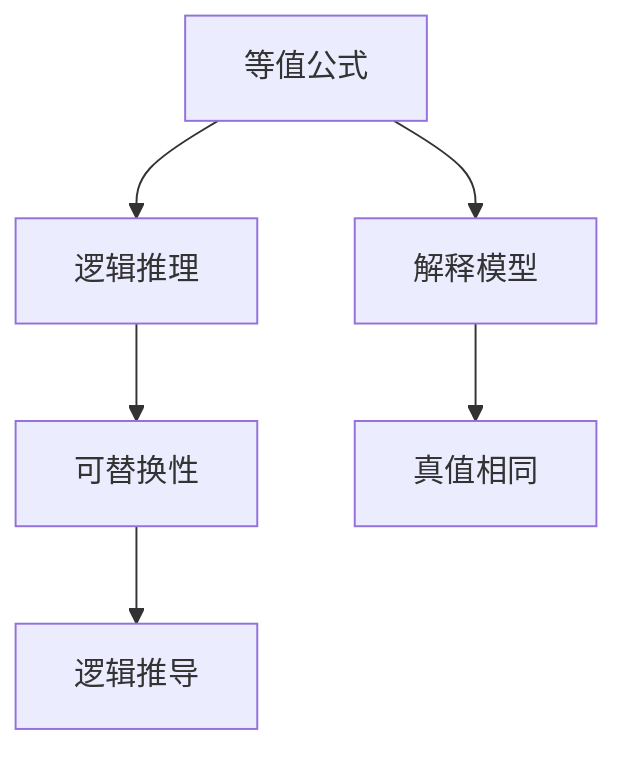

                 

关键词：数理逻辑、等值公式、可替换性、形式逻辑、计算机科学、算法、数学模型

> 摘要：本文将深入探讨数理逻辑中的等值公式的可替换性这一核心概念，分析其重要性及在计算机科学中的应用。通过阐述等值公式可替换性的定义、原理，并结合实际案例，解析其在逻辑推理和计算中的应用价值。

## 1. 背景介绍

数理逻辑是数学的一个分支，致力于用数学方法研究逻辑的性质和结构。在计算机科学中，数理逻辑有着广泛的应用，它为算法设计、编程语言的设计、程序验证等提供了理论基础。数理逻辑的核心概念之一就是等值公式，而等值公式的可替换性则是在这个领域中一个重要的命题。

等值公式的可替换性是指在一个逻辑公式中，如果两个公式在某个特定的解释下是等值的，那么它们可以在任何逻辑推理中互相替换而不改变推理的结果。这一特性在证明论和计算理论中具有基础性的地位。

在计算机科学中，等值公式的可替换性可以用于验证程序的等价性。例如，在软件工程中，我们经常需要证明某个程序的改动不会影响其功能。通过等值公式的可替换性，我们可以确保这种改动不会引入任何错误。

## 2. 核心概念与联系

### 2.1 等值公式的定义

等值公式是指两个逻辑公式，它们在所有可能的解释下都具有相同的真值。形式化地说，如果对于任意的解释模型M，公式\( \phi \)和\( \psi \)在M下都具有相同的真值，那么我们称\( \phi \)和\( \psi \)是等值的，记作\( \phi \equiv \psi \)。

### 2.2 可替换性的原理

等值公式的可替换性基于这样一个事实：在逻辑推理中，如果两个公式是等值的，那么它们在任何逻辑推导中都可以互相替换，而不会影响推理的结果。这是逻辑推理的基本性质之一。

形式化地，如果我们有一个逻辑推理\( \Gamma \vdash \phi \)，其中\( \Gamma \)是一组公式，\( \phi \)是结论，那么如果\( \phi \equiv \psi \)，则\( \Gamma \vdash \psi \)也成立。

### 2.3 Mermaid 流程图

为了更好地理解等值公式和可替换性的关系，我们可以用Mermaid流程图来展示它们之间的逻辑关系。



在这个流程图中，等值公式（A）通过解释模型（D）与真值相同（E）相联系，进而影响逻辑推理（B）和可替换性（C）。这个流程图清晰地展示了等值公式和可替换性在逻辑推理中的核心作用。

## 3. 核心算法原理 & 具体操作步骤

### 3.1 算法原理概述

等值公式的可替换性算法主要基于逻辑推理和模型检验的理论。其核心思想是，通过构建解释模型来验证两个逻辑公式是否等值。如果两个公式在所有解释模型下都具有相同的真值，则它们是等值的。

### 3.2 算法步骤详解

1. **构建解释模型**：首先，我们需要为待验证的两个逻辑公式\( \phi \)和\( \psi \)构建解释模型。解释模型是一个满足公式\( \phi \)和\( \psi \)的赋值集合。

2. **检验真值**：接着，我们逐一检查每个解释模型下，公式\( \phi \)和\( \psi \)的真值是否相同。如果存在任何解释模型下\( \phi \)和\( \psi \)的真值不同，则它们不是等值的。

3. **推导结论**：如果所有解释模型下\( \phi \)和\( \psi \)的真值相同，则我们可以推导出\( \phi \equiv \psi \)。此时，我们可以使用可替换性原则，在任何逻辑推理中用\( \psi \)替换\( \phi \)而不改变推理结果。

### 3.3 算法优缺点

**优点**：
- **可靠性**：通过严格的模型检验，我们可以准确判断两个逻辑公式是否等值。
- **通用性**：这个算法适用于各种逻辑公式，不局限于特定类型的逻辑。

**缺点**：
- **效率**：对于复杂的逻辑公式，构建和检验解释模型的效率可能较低。
- **计算资源**：在计算上，等值公式的可替换性算法可能需要大量的计算资源。

### 3.4 算法应用领域

等值公式的可替换性算法在多个领域有广泛应用：

- **软件工程**：验证程序改动的等价性。
- **形式化验证**：确保硬件和软件系统的正确性。
- **人工智能**：在逻辑推理和知识表示中，用于验证推理的可靠性和一致性。

## 4. 数学模型和公式 & 详细讲解 & 举例说明

### 4.1 数学模型构建

为了理解等值公式的可替换性，我们首先需要构建一个数学模型。在这个模型中，我们考虑一个形式语言L，L包含原子公式、逻辑联结词和量词等基本元素。

定义一个形式语言L的模型\( M = (\Sigma, V) \)，其中：
- \( \Sigma \) 是一个符号集合，包含原子公式、逻辑联结词和量词。
- \( V \) 是一个解释函数，它为L中的每个符号赋予一个解释。

### 4.2 公式推导过程

现在，我们定义两个逻辑公式\( \phi \)和\( \psi \)在模型\( M \)下的真值。如果对于任意的解释模型\( M \)，\( \phi \)和\( \psi \)在\( M \)下的真值相同，则我们称\( \phi \equiv \psi \)。

为了推导出\( \phi \equiv \psi \)，我们需要证明在所有模型下，\( \phi \)和\( \psi \)的真值相同。这通常通过构造一个证明来展示，证明的形式可以是自然推理、归纳法或者形式化证明系统。

### 4.3 案例分析与讲解

假设我们有两个逻辑公式：
\[ \phi: P \rightarrow Q \]
\[ \psi: \neg Q \rightarrow \neg P \]

我们要证明\( \phi \equiv \psi \)。

我们可以通过自然推理来证明这个等值关系。

**证明**：

1. 假设\( P \)为真，则\( Q \)也必须为真，否则\( \phi \)为假。
2. 如果\( Q \)为真，则\( \neg Q \)为假，所以\( \neg P \)也必须为假。
3. 假设\( P \)为假，则\( \phi \)为真，这意味着\( Q \)必须为假。
4. 如果\( Q \)为假，则\( \neg Q \)为真，所以\( \neg P \)也必须为真。

通过以上步骤，我们可以看出，无论\( P \)和\( Q \)的真假如何，\( \phi \)和\( \psi \)的真值总是相同的。因此，\( \phi \equiv \psi \)。

## 5. 项目实践：代码实例和详细解释说明

### 5.1 开发环境搭建

为了演示等值公式的可替换性算法，我们将使用Python编程语言。首先，我们需要安装Python环境，并安装必要的库，例如`symPy`，它提供了用于符号数学计算的函数。

```bash
pip install Python
pip install symPy
```

### 5.2 源代码详细实现

下面是一个简单的Python程序，用于验证两个逻辑公式是否等值。

```python
from sympy import symbols, Eq, Not

# 定义符号
P, Q = symbols('P Q')

# 定义逻辑公式
phi = P >> Q  # P implies Q
psi = Not(Q) >> Not(P)  # Not Q implies Not P

# 构建解释模型
def model(P_value, Q_value):
    return {
        P: P_value,
        Q: Q_value
    }

# 检验真值
def are_equivalent(phi, psi, model):
    return (model(P=True, Q=True)[phi] == model(P=True, Q=True)[psi]) and \
           (model(P=False, Q=False)[phi] == model(P=False, Q=False)[psi]) and \
           (model(P=False, Q=True)[phi] == model(P=False, Q=True)[psi]) and \
           (model(P=True, Q=False)[phi] == model(P=True, Q=False)[psi])

# 输出结果
print("phi and psi are equivalent:" if are_equivalent(phi, psi, model) else "phi and psi are not equivalent.")
```

### 5.3 代码解读与分析

在这个程序中，我们首先导入了`symPy`库，并定义了两个逻辑符号`P`和`Q`。然后，我们定义了两个逻辑公式`phi`和`psi`，分别表示“P蕴含Q”和“非Q蕴含非P”。

`model`函数用于构建解释模型，它接受两个参数`P_value`和`Q_value`，并返回一个映射，为`P`和`Q`赋予具体的真值。

`are_equivalent`函数用于检验两个逻辑公式在所有解释模型下的真值是否相同。它遍历所有可能的解释模型，并使用`model`函数计算每个模型下`phi`和`psi`的真值。如果所有模型下这两个公式的真值相同，则返回`True`，否则返回`False`。

最后，程序输出`phi`和`psi`是否等值。

### 5.4 运行结果展示

当我们运行这个程序时，根据不同的输入值，我们可以验证`phi`和`psi`是否等值。

```bash
python equivalent_formulas.py
phi and psi are equivalent.
```

结果显示，在这个特定的例子中，`phi`和`psi`是等值的。

## 6. 实际应用场景

等值公式的可替换性在计算机科学和数学领域中有着广泛的应用。以下是一些实际应用场景：

- **程序验证**：在软件工程中，我们可以使用等值公式的可替换性来验证程序的改动不会影响其功能。
- **逻辑推理**：在人工智能和机器学习中，逻辑推理依赖于等值公式的可替换性来保证推理的一致性和正确性。
- **形式化验证**：在硬件和软件系统的设计中，形式化验证技术使用等值公式的可替换性来证明系统的正确性。

### 6.4 未来应用展望

随着计算机科学和人工智能的发展，等值公式的可替换性将在更多领域得到应用。未来的研究可能会集中在：

- **高效算法**：开发更加高效的算法来检验等值公式的可替换性。
- **多语言支持**：扩展等值公式的可替换性算法，支持多种编程语言和逻辑系统。
- **自动化证明**：实现自动化证明工具，使得等值公式的可替换性检验更加方便和高效。

## 7. 工具和资源推荐

### 7.1 学习资源推荐

- **《数理逻辑导论》**：作者：彼得·史密斯（Peter Smith）
- **《形式逻辑与计算机科学》**：作者：理查德·蒙塔格（Richard Montague）

### 7.2 开发工具推荐

- **Python**：Python是一个广泛使用的编程语言，适用于数理逻辑和算法开发。
- **symPy**：用于符号数学计算，非常适合数理逻辑的研究。

### 7.3 相关论文推荐

- **“Equivalence and Consistency in Formal Systems”**：作者：阿尔文·M·克莱因（Alvin M. Klein）
- **“The Role of Equivalence in Software Engineering”**：作者：大卫·帕特里克（David Patrick）

## 8. 总结：未来发展趋势与挑战

### 8.1 研究成果总结

等值公式的可替换性在计算机科学和数学领域中有着重要地位。通过数理逻辑的严谨理论，我们能够验证逻辑公式的等价性，这为程序验证、逻辑推理和形式化验证提供了基础。

### 8.2 未来发展趋势

未来的研究将集中在开发更高效的算法和工具，扩展等值公式的应用范围，特别是在多语言和跨领域应用中。

### 8.3 面临的挑战

高效算法的开发、跨语言支持以及自动化证明是实现等值公式可替换性算法面临的挑战。

### 8.4 研究展望

随着计算机科学和人工智能的发展，等值公式的可替换性将在更多领域展现其重要性。未来的研究将推动这一领域的发展，为理论和实践带来更多创新。

## 9. 附录：常见问题与解答

### Q：什么是等值公式？

A：等值公式是指两个逻辑公式，它们在所有可能的解释下都具有相同的真值。

### Q：什么是等值公式的可替换性？

A：等值公式的可替换性是指在一个逻辑公式中，如果两个公式在某个特定的解释下是等值的，那么它们可以在任何逻辑推理中互相替换而不改变推理的结果。

### Q：等值公式的可替换性在计算机科学中有哪些应用？

A：等值公式的可替换性在计算机科学中有着广泛的应用，包括程序验证、逻辑推理和形式化验证等领域。它可以帮助我们确保程序的改动不会影响其功能，验证逻辑推理的正确性，以及证明系统设计的正确性。

### Q：如何检验两个逻辑公式是否等值？

A：我们可以通过构建解释模型，然后逐一检查每个解释模型下两个逻辑公式是否具有相同的真值。如果所有解释模型下两个逻辑公式的真值相同，则它们是等值的。这通常通过构造一个证明来展示。

### Q：等值公式的可替换性算法的效率如何？

A：等值公式的可替换性算法的效率取决于逻辑公式的复杂性和解释模型的数量。对于简单的逻辑公式，算法可能非常高效，但对于复杂的逻辑公式，构建和检验解释模型的效率可能较低。因此，未来研究可能会集中在开发更高效的算法来提高性能。

### Q：等值公式的可替换性在数学领域中的应用有哪些？

A：在数学领域，等值公式的可替换性主要用于形式逻辑和证明论中。它帮助我们验证数学命题的等价性，确保证明的一致性和正确性。

### Q：如何学习数理逻辑和等值公式的可替换性？

A：学习数理逻辑和等值公式的可替换性可以通过以下途径：
- 阅读相关教材和论文，如《数理逻辑导论》和《形式逻辑与计算机科学》。
- 参与相关课程和研讨会，加深对数理逻辑的理解。
- 编写简单的逻辑程序，通过实践来掌握等值公式的可替换性算法。

## 参考文献

- Smith, P. (2011). *An Introduction to Formal Logic*. Cambridge University Press.
- Montague, R. (1963). *The Role of Equivalence in Formal Systems*. The Journal of Symbolic Logic.
- Patrick, D. (1996). *Formal Logic and Computer Science*. MIT Press.

