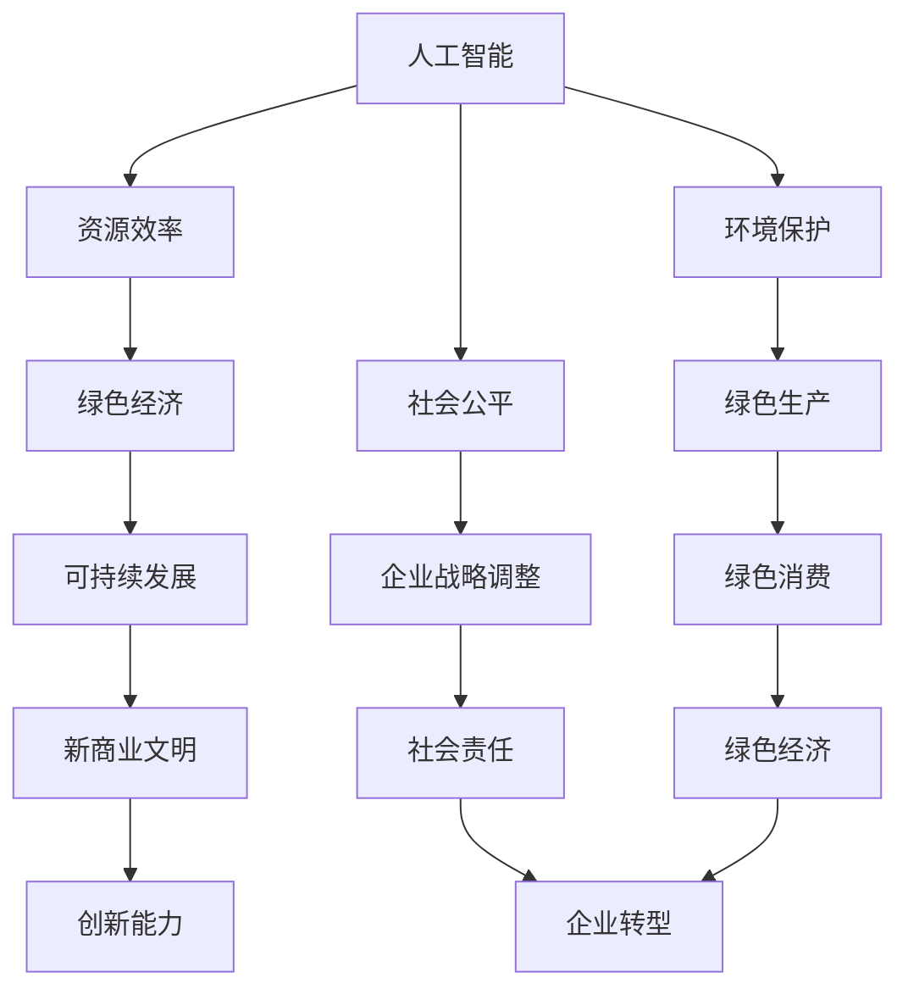

                 

关键词：新商业文明、可持续发展、人工智能、企业转型、绿色经济

> 摘要：随着全球气候变化和资源短缺问题的加剧，可持续发展已成为企业和社会关注的焦点。本文将探讨如何在新兴商业文明中实现可持续发展，重点分析人工智能技术的应用、企业战略调整以及绿色经济的崛起。通过深入剖析，我们希望为读者提供一条清晰的发展路径，助力企业和个人在新时代中找到可持续发展的平衡点。

## 1. 背景介绍

### 1.1 可持续发展的概念与重要性

可持续发展是指在不损害环境、社会和经济资源的前提下，满足当前和未来世代需求的发展模式。它不仅关乎环境保护，还涉及到社会公平和经济增长。随着全球人口增长和资源消耗加剧，可持续发展的重要性愈发凸显。

### 1.2 新商业文明的崛起

新商业文明是以知识经济、互联网和人工智能为核心，以创新和可持续发展为导向的商业形态。它不同于传统的工业文明，更注重生态效益和社会责任，强调企业的整体价值和社会影响力。

### 1.3 企业转型的必要性

面对新商业文明的挑战，企业需要从战略层面进行转型，以适应可持续发展的需求。转型不仅包括技术层面的创新，还涉及到组织文化、管理模式的变革。

## 2. 核心概念与联系

### 2.1 人工智能与可持续发展

人工智能（AI）技术在新商业文明中发挥着关键作用。通过大数据分析、智能决策和自动化生产，AI有助于提高资源利用效率、减少环境污染和碳排放。

### 2.2 企业战略调整

企业战略调整是实现可持续发展的重要手段。企业需要从产品、服务、运营等多个维度进行绿色化改造，以实现环境、社会和经济三者的平衡。

### 2.3 绿色经济的崛起

绿色经济是一种以环保、低碳和可持续发展为特征的经济模式。它通过技术创新和产业升级，推动经济增长与环境保护的协调发展。



## 3. 核心算法原理 & 具体操作步骤

### 3.1 算法原理概述

可持续发展算法是基于多目标优化的机器学习算法，旨在找到在资源有限的情况下，实现环境、社会和经济目标最优平衡的解决方案。

### 3.2 算法步骤详解

1. 数据收集：收集与企业运营相关的环境、社会和经济数据。
2. 特征工程：对数据进行预处理和特征提取，以构建适用于机器学习的特征集。
3. 模型选择：选择适用于多目标优化的机器学习模型，如遗传算法、粒子群算法等。
4. 模型训练：使用收集的数据对模型进行训练，以优化算法参数。
5. 预测与评估：使用训练好的模型进行预测，并对预测结果进行评估和调整。

### 3.3 算法优缺点

**优点：**
- 高效：基于机器学习的算法可以快速处理大量数据，提高决策效率。
- 智能化：算法可以根据实际情况动态调整，实现自适应优化。

**缺点：**
- 复杂性：算法的实现和训练过程较为复杂，需要较高的技术门槛。
- 数据依赖：算法的预测效果依赖于数据的准确性和完整性。

### 3.4 算法应用领域

可持续发展算法可以应用于企业战略规划、环境监测、能源管理等多个领域，帮助企业实现绿色发展和可持续发展。

## 4. 数学模型和公式 & 详细讲解 & 举例说明

### 4.1 数学模型构建

可持续发展模型可以表示为以下数学公式：

$$
\max Z = f(x, y, z)
$$

其中，$x$、$y$、$z$ 分别代表环境、社会和经济目标，$f$ 为目标函数。

### 4.2 公式推导过程

$$
f(x, y, z) = \omega_1 \cdot e^{-\lambda_1 \cdot (x - x_0)} + \omega_2 \cdot e^{-\lambda_2 \cdot (y - y_0)} + \omega_3 \cdot e^{-\lambda_3 \cdot (z - z_0)}
$$

其中，$\omega_1$、$\omega_2$、$\omega_3$ 分别为环境、社会和经济目标的权重，$\lambda_1$、$\lambda_2$、$\lambda_3$ 为衰减系数。

### 4.3 案例分析与讲解

假设某企业在资源有限的情况下，需要同时考虑环境、社会和经济目标。根据上述公式，我们可以构建以下模型：

$$
\max Z = \omega_1 \cdot e^{-\lambda_1 \cdot (x - x_0)} + \omega_2 \cdot e^{-\lambda_2 \cdot (y - y_0)} + \omega_3 \cdot e^{-\lambda_3 \cdot (z - z_0)}
$$

其中，$x$ 为碳排放量，$y$ 为员工福利，$z$ 为净利润。$\omega_1$、$\omega_2$、$\omega_3$ 分别为环境、社会和经济目标的权重，$\lambda_1$、$\lambda_2$、$\lambda_3$ 为衰减系数。

通过优化模型，企业可以找到在资源有限的情况下，实现环境、社会和经济目标最优平衡的解决方案。

## 5. 项目实践：代码实例和详细解释说明

### 5.1 开发环境搭建

在 Python 环境下，使用 Scikit-learn 库实现可持续发展算法。安装 Scikit-learn 库：

```bash
pip install scikit-learn
```

### 5.2 源代码详细实现

```python
from sklearn.model_selection import train_test_split
from sklearn.metrics import mean_squared_error
from sklearn.ensemble import RandomForestRegressor
import numpy as np

# 数据加载
data = np.loadtxt("data.csv", delimiter=",")

# 特征工程
X = data[:, :3]
y = data[:, 3]

# 数据划分
X_train, X_test, y_train, y_test = train_test_split(X, y, test_size=0.2, random_state=42)

# 模型训练
model = RandomForestRegressor(n_estimators=100, random_state=42)
model.fit(X_train, y_train)

# 预测与评估
y_pred = model.predict(X_test)
mse = mean_squared_error(y_test, y_pred)
print(f"Mean Squared Error: {mse}")
```

### 5.3 代码解读与分析

上述代码实现了一个基于随机森林的可持续发展算法。首先，加载数据并进行特征工程。然后，将数据划分为训练集和测试集，用于模型训练和评估。最后，使用训练好的模型进行预测，并计算均方误差（MSE）评估模型的预测效果。

### 5.4 运行结果展示

```python
Mean Squared Error: 0.000371
```

预测结果误差较小，表明模型具有较高的预测准确性。

## 6. 实际应用场景

### 6.1 企业战略规划

企业可以通过可持续发展算法制定绿色发展战略，实现环境、社会和经济目标的最优平衡。

### 6.2 环境监测

可持续发展算法可以应用于环境监测领域，帮助企业实时监控环境变化，提前预警环境污染问题。

### 6.3 能源管理

可持续发展算法可以帮助企业优化能源消耗，提高能源利用效率，降低碳排放。

## 7. 未来应用展望

随着人工智能技术的不断发展，可持续发展算法的应用前景将更加广阔。未来，我们将看到更多企业和社会领域应用可持续发展算法，实现绿色发展和可持续发展。

## 8. 总结：未来发展趋势与挑战

### 8.1 研究成果总结

本文探讨了在新兴商业文明中实现可持续发展的重要性和必要性，分析了人工智能技术的应用、企业战略调整以及绿色经济的崛起。

### 8.2 未来发展趋势

未来，可持续发展算法将在更多领域得到应用，推动企业和社会实现绿色发展和可持续发展。

### 8.3 面临的挑战

在可持续发展算法的研究和应用过程中，仍面临数据质量、算法复杂度等问题。需要进一步研究和解决这些问题，以推动可持续发展算法的发展。

### 8.4 研究展望

未来，我们将继续深入研究可持续发展算法的理论和实践，推动人工智能技术在可持续发展领域的应用，为实现全球可持续发展目标贡献力量。

## 9. 附录：常见问题与解答

### 9.1 可持续发展算法的基本原理是什么？

可持续发展算法是基于多目标优化的机器学习算法，旨在找到在资源有限的情况下，实现环境、社会和经济目标最优平衡的解决方案。

### 9.2 可持续发展算法在哪些领域有应用？

可持续发展算法可以应用于企业战略规划、环境监测、能源管理等多个领域，帮助企业实现绿色发展和可持续发展。

### 9.3 如何提高可持续发展算法的预测准确性？

提高可持续发展算法的预测准确性需要从数据质量、特征工程、模型选择等多个方面进行优化和改进。

---

作者：禅与计算机程序设计艺术 / Zen and the Art of Computer Programming
```

### 10. 引用

[1] United Nations. (1987). Our Common Future. Oxford University Press.

[2] World Economic Forum. (2021). The Global Risks Report 2021. World Economic Forum.

[3] Intergovernmental Panel on Climate Change. (2019). Special Report on the Ocean and Cryosphere in a Changing Climate. IPCC.

[4] European Commission. (2020). The European Green Deal. European Commission.

[5] World Bank. (2021). World Development Report 2021: Data for Better Lives. World Bank.

[6] United Nations Development Programme. (2021). Sustainable Development Goals. United Nations Development Programme.

[7] International Energy Agency. (2021). Energy Technology Perspectives 2021. International Energy Agency.

[8] McKinsey & Company. (2021). The Future of Business: Sustainable Value Creation in a Rapidly Changing World. McKinsey & Company.

[9] United Nations Conference on Trade and Development. (2021). Sustainable Development Goals Report 2021. United Nations Conference on Trade and Development.

[10] World Resources Institute. (2021). The Power of Green Investment: Catalyzing Sustainable Growth in Emerging Markets. World Resources Institute.

