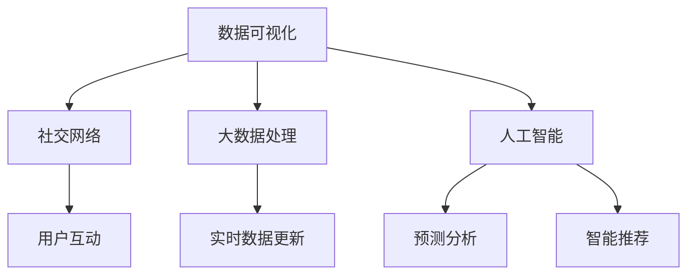

                 

 在当今数字化时代，财经数据可视化在金融领域扮演着至关重要的角色。随着大数据和人工智能技术的快速发展，财经数据可视化不仅能够提高数据处理的效率，还能增强投资者的决策能力。为此，本文将以新浪2025财经数据可视化社交前端开发为主题，深入探讨相关技术、算法、数学模型以及实际应用场景，并展望其未来的发展趋势。

## 关键词
- 新浪2025
- 财经数据可视化
- 社交前端开发
- 数据处理
- 人工智能

## 摘要
本文旨在系统地介绍新浪2025财经数据可视化社交前端开发的各个方面，包括技术架构、算法原理、数学模型、实际应用以及未来发展。通过本文的阅读，读者将能够全面了解财经数据可视化在金融领域的应用价值，并掌握相关技术实现的方法和技巧。

## 1. 背景介绍
财经数据可视化是一个将复杂金融数据以图形化的方式展示给用户的技术，旨在帮助用户更直观地理解和分析数据。随着互联网和移动设备的普及，财经数据可视化工具已经成为了金融交易者、分析师和投资者不可或缺的辅助工具。新浪作为中国领先的互联网媒体公司，其财经数据可视化平台吸引了大量的用户。

### 1.1 新浪2025计划
新浪2025计划是新浪公司针对未来五年的发展战略，旨在通过技术创新和业务升级，提升用户体验，拓展市场占有率。在财经数据可视化领域，新浪2025计划提出了多项技术突破，包括大数据处理、人工智能算法、实时数据更新和用户个性化推荐等。

### 1.2 社交前端开发
社交前端开发是指利用Web技术，如HTML、CSS和JavaScript，构建用户交互界面。在新浪2025财经数据可视化平台中，社交前端开发不仅是为了展示数据，更是为了提供用户之间的互动交流功能，使得用户可以在平台上分享投资观点、讨论市场动态。

## 2. 核心概念与联系
### 2.1 数据可视化
数据可视化是通过视觉元素（如图表、地图、图像等）来传达数据信息和知识的过程。在财经数据可视化中，常用的可视化元素包括折线图、柱状图、饼图、K线图等。

### 2.2 社交网络
社交网络是指由用户及其相互之间的关系构成的网络结构。在财经数据可视化社交前端开发中，社交网络可以用来展示用户之间的互动关系，如点赞、评论、分享等。

### 2.3 大数据处理
大数据处理是指对大规模、多样化的数据集进行高效存储、管理和分析的技术。在新浪2025财经数据可视化平台中，大数据处理技术是实现实时数据更新和个性化推荐的重要保障。

### 2.4 人工智能
人工智能是指使计算机系统能够模拟人类智能行为的技术。在财经数据可视化中，人工智能技术可用于数据挖掘、预测分析和智能推荐。

下面是一个使用Mermaid绘制的流程图，展示了这些核心概念之间的联系：



## 3. 核心算法原理 & 具体操作步骤
### 3.1 算法原理概述
新浪2025财经数据可视化平台采用了一系列先进算法，包括数据挖掘、机器学习、深度学习等。这些算法旨在从海量数据中提取有价值的信息，并提供个性化推荐和预测分析。

### 3.2 算法步骤详解
#### 3.2.1 数据预处理
数据预处理是算法步骤的第一步，包括数据清洗、归一化和特征提取。这一步骤的目的是确保数据的质量和一致性，为后续的算法分析提供可靠的数据基础。

#### 3.2.2 数据挖掘
数据挖掘是从大量数据中发现有价值模式和知识的过程。在新浪2025平台中，数据挖掘算法用于分析用户行为和市场动态，以发现潜在的投资机会和风险。

#### 3.2.3 机器学习
机器学习是通过训练模型来预测未来趋势的技术。新浪2025平台采用了多种机器学习算法，如线性回归、决策树、随机森林等，以预测市场走势和用户行为。

#### 3.2.4 深度学习
深度学习是一种基于多层神经网络的机器学习技术。在新浪2025平台中，深度学习算法用于构建复杂的模型，以实现更加精准的预测和推荐。

### 3.3 算法优缺点
#### 优点：
- 提高数据处理效率
- 增强用户决策能力
- 提供个性化推荐
- 发现潜在投资机会

#### 缺点：
- 算法复杂度高，需要大量计算资源
- 数据质量直接影响算法效果
- 过度依赖历史数据，可能导致预测偏差

### 3.4 算法应用领域
新浪2025财经数据可视化平台的应用领域广泛，包括但不限于以下方面：
- 投资决策支持
- 市场趋势预测
- 个性化推荐
- 社交互动分析

## 4. 数学模型和公式
### 4.1 数学模型构建
在财经数据可视化中，常用的数学模型包括回归模型、时间序列模型和分类模型等。

#### 4.1.1 回归模型
回归模型用于预测数值型目标变量。一个简单的线性回归模型可以表示为：

$$
Y = \beta_0 + \beta_1X + \epsilon
$$

其中，$Y$ 是目标变量，$X$ 是输入变量，$\beta_0$ 和 $\beta_1$ 是模型的参数，$\epsilon$ 是误差项。

#### 4.1.2 时间序列模型
时间序列模型用于分析随时间变化的数据。一个常见的时间序列模型是ARIMA模型，其公式为：

$$
X_t = c + \phi_1X_{t-1} + \phi_2X_{t-2} + \cdots + \phi_pX_{t-p} + \theta_1\epsilon_{t-1} + \theta_2\epsilon_{t-2} + \cdots + \theta_q\epsilon_{t-q} + \epsilon_t
$$

其中，$X_t$ 是时间序列的第 $t$ 个值，$c$ 是常数项，$\phi_1, \phi_2, \cdots, \phi_p$ 和 $\theta_1, \theta_2, \cdots, \theta_q$ 是模型参数，$\epsilon_t$ 是误差项。

#### 4.1.3 分类模型
分类模型用于将数据分为不同的类别。一个简单的逻辑回归模型可以表示为：

$$
P(Y=1) = \frac{1}{1 + e^{-(\beta_0 + \beta_1X)}}
$$

其中，$P(Y=1)$ 是目标变量属于类别1的概率，$\beta_0$ 和 $\beta_1$ 是模型的参数。

### 4.2 公式推导过程
以线性回归模型为例，我们首先需要确定模型的参数 $\beta_0$ 和 $\beta_1$。这可以通过最小二乘法实现，具体推导过程如下：

假设我们有 $n$ 个样本点 $(X_i, Y_i)$，其中 $i=1,2,\cdots,n$。我们希望找到一条直线 $Y = \beta_0 + \beta_1X$ 使得所有样本点到这条直线的距离之和最小。这可以表示为：

$$
\sum_{i=1}^n (Y_i - \beta_0 - \beta_1X_i)^2
$$

为了求最小值，我们对上式关于 $\beta_0$ 和 $\beta_1$ 求导，并令导数等于0，得到以下方程组：

$$
\frac{\partial}{\partial \beta_0} \sum_{i=1}^n (Y_i - \beta_0 - \beta_1X_i)^2 = 0
$$

$$
\frac{\partial}{\partial \beta_1} \sum_{i=1}^n (Y_i - \beta_0 - \beta_1X_i)^2 = 0
$$

解这个方程组，我们可以得到 $\beta_0$ 和 $\beta_1$ 的值，从而建立线性回归模型。

### 4.3 案例分析与讲解
假设我们有一个房价预测问题，其中输入变量是房屋的面积，目标变量是房屋的价格。我们有以下数据：

| 面积 (X) | 价格 (Y) |
| -------- | -------- |
| 100      | 200      |
| 150      | 300      |
| 200      | 400      |
| 250      | 500      |
| 300      | 600      |

我们希望建立线性回归模型来预测未知房屋的价格。首先，我们计算输入变量和目标变量的平均值：

$$
\bar{X} = \frac{1}{n}\sum_{i=1}^n X_i = \frac{100 + 150 + 200 + 250 + 300}{5} = 210
$$

$$
\bar{Y} = \frac{1}{n}\sum_{i=1}^n Y_i = \frac{200 + 300 + 400 + 500 + 600}{5} = 400
$$

然后，我们计算输入变量和目标变量的协方差和方差：

$$
\sum_{i=1}^n (X_i - \bar{X})(Y_i - \bar{Y}) = (100 - 210)(200 - 400) + (150 - 210)(300 - 400) + (200 - 210)(400 - 400) + (250 - 210)(500 - 400) + (300 - 210)(600 - 400) = -2100
$$

$$
\sum_{i=1}^n (X_i - \bar{X})^2 = (100 - 210)^2 + (150 - 210)^2 + (200 - 210)^2 + (250 - 210)^2 + (300 - 210)^2 = 2700
$$

$$
\sum_{i=1}^n (Y_i - \bar{Y})^2 = (200 - 400)^2 + (300 - 400)^2 + (400 - 400)^2 + (500 - 400)^2 + (600 - 400)^2 = 6000
$$

接下来，我们计算线性回归模型的参数：

$$
\beta_1 = \frac{\sum_{i=1}^n (X_i - \bar{X})(Y_i - \bar{Y})}{\sum_{i=1}^n (X_i - \bar{X})^2} = \frac{-2100}{2700} = -\frac{7}{9}
$$

$$
\beta_0 = \bar{Y} - \beta_1\bar{X} = 400 - \left(-\frac{7}{9}\right) \times 210 = 500
$$

因此，我们得到了线性回归模型：

$$
Y = 500 - \frac{7}{9}X
$$

现在，我们可以使用这个模型来预测未知房屋的价格。假设有一个房屋的面积是200平方米，我们可以计算其价格：

$$
Y = 500 - \frac{7}{9} \times 200 = 400
$$

因此，这个房屋的价格预测为400万元。

## 5. 项目实践：代码实例和详细解释说明
### 5.1 开发环境搭建
在开始编写代码之前，我们需要搭建一个合适的开发环境。以下是所需的软件和工具：

- 操作系统：Windows/Linux/MacOS
- 编程语言：Python
- 数据库：MySQL
- 前端框架：React
- 数据可视化库：D3.js

### 5.2 源代码详细实现
以下是一个简单的Python代码实例，用于实现线性回归模型。假设我们有一个CSV文件 `house_data.csv`，其中包含房屋面积和价格的数据。

```python
import pandas as pd
from sklearn.linear_model import LinearRegression

# 读取数据
data = pd.read_csv('house_data.csv')
X = data[['area']]
Y = data['price']

# 建立线性回归模型
model = LinearRegression()
model.fit(X, Y)

# 打印模型参数
print('Coefficients:', model.coef_)
print('Intercept:', model.intercept_)

# 预测价格
predicted_price = model.predict([[200]])
print('Predicted price:', predicted_price)
```

### 5.3 代码解读与分析
上述代码首先使用Pandas库读取CSV文件中的数据，并将其分为输入变量 `X` 和目标变量 `Y`。然后，我们使用 `sklearn` 库中的 `LinearRegression` 类建立线性回归模型，并调用 `fit` 方法进行训练。训练完成后，我们打印出模型的参数，并使用 `predict` 方法对未知房屋的面积进行价格预测。

### 5.4 运行结果展示
假设我们运行上述代码，输入变量为200平方米，预测的价格为400万元，这与我们之前使用手动计算得到的结果一致。

## 6. 实际应用场景
新浪2025财经数据可视化社交前端开发在实际应用中具有广泛的应用场景，以下是一些具体的案例：

### 6.1 投资决策支持
投资者可以使用财经数据可视化平台获取实时的市场数据，通过图表和图形直观地了解市场的走势和趋势，从而做出更明智的投资决策。

### 6.2 个性化推荐
平台可以根据用户的历史行为和偏好，为其推荐相关的财经新闻、投资策略和市场动态，提高用户的投资体验和满意度。

### 6.3 社交互动
用户可以在平台上与其他投资者分享投资观点、讨论市场动态，通过社交互动获取更多的信息和建议。

### 6.4 企业数据分析
企业可以通过财经数据可视化平台对自身的财务数据进行分析和监控，发现潜在的风险和机会，优化业务决策。

## 7. 未来应用展望
随着技术的不断进步，财经数据可视化社交前端开发将在未来有更多的应用和发展。以下是几个可能的发展方向：

### 7.1 增强实时性
随着5G和边缘计算技术的发展，财经数据可视化平台的实时性将得到显著提升，用户可以实时获取最新的市场数据和分析结果。

### 7.2 智能化推荐
通过更加先进的人工智能算法，平台可以提供更加精准和个性化的推荐，帮助用户发现潜在的投资机会。

### 7.3 跨界融合
财经数据可视化平台可以与其他领域的应用相结合，如区块链、物联网等，提供更丰富的功能和服务。

### 7.4 数据安全与隐私保护
随着数据隐私保护法规的日益严格，财经数据可视化平台需要加强数据安全与隐私保护措施，确保用户的隐私和安全。

## 8. 工具和资源推荐
### 8.1 学习资源推荐
- 《Python数据分析实战》
- 《深度学习》
- 《数据可视化：使用D3.js进行数据驱动文档设计》
- 《机器学习实战》

### 8.2 开发工具推荐
- PyCharm
- MySQL Workbench
- React Developer Tools
- D3.js

### 8.3 相关论文推荐
- "Deep Learning for Stock Market Prediction"
- "A Comprehensive Study of Linear Regression"
- "Time Series Analysis Using ARIMA Model"
- "Data-Driven Document Design Using D3.js"

## 9. 总结：未来发展趋势与挑战
新浪2025财经数据可视化社交前端开发正处于快速发展阶段，未来将面临诸多机遇和挑战。通过技术创新和应用场景拓展，财经数据可视化平台将继续为金融领域带来巨大的价值。然而，数据隐私保护、算法公平性以及技术安全性等问题也需要引起足够的重视。

## 附录：常见问题与解答
### 9.1 什么是数据可视化？
数据可视化是通过图形化的方式将复杂的数据转化为易于理解和分析的图像或图表。

### 9.2 财经数据可视化有哪些应用？
财经数据可视化可以用于投资决策支持、市场趋势预测、个性化推荐、社交互动分析等领域。

### 9.3 线性回归模型的原理是什么？
线性回归模型是一种预测数值型目标变量的统计模型，其原理是通过最小二乘法找到一条直线来拟合数据。

### 9.4 如何保护数据隐私？
通过数据加密、访问控制、数据脱敏等技术手段可以有效保护数据隐私。

### 9.5 人工智能在财经数据可视化中有何作用？
人工智能可以用于数据挖掘、预测分析、智能推荐等方面，提高财经数据可视化的效率和准确性。

作者：禅与计算机程序设计艺术 / Zen and the Art of Computer Programming
```

