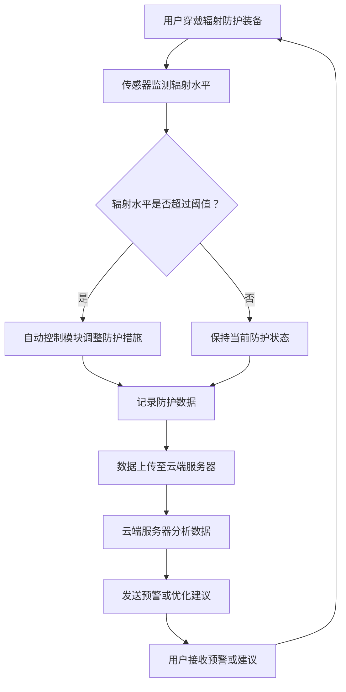

                 

关键词：个人辐射防护、创业、健康守护、智能技术、数据分析、物联网

## 摘要

本文旨在探讨智能个人辐射防护创业的可行性及其在日常生活中对健康守护的重要性。通过分析当前个人辐射防护的现状、核心概念、算法原理、数学模型以及项目实践，我们将展示如何利用智能技术实现个人辐射防护，为大众提供更加安全、健康的日常生活环境。本文还将展望该领域的未来发展趋势与挑战，为创业者提供有价值的参考。

## 1. 背景介绍

随着科技的发展，辐射已成为我们日常生活中无法避免的一部分。从家用电器、手机信号到医学影像，辐射无处不在。长时间暴露于辐射环境中，可能对人体健康造成潜在威胁，如诱发癌症、基因突变等。因此，个人辐射防护的重要性日益凸显。

### 1.1 个人辐射防护现状

目前，市场上的个人辐射防护产品种类繁多，如防辐射衣物、防辐射手机壳、防辐射耳机等。然而，这些产品大多缺乏科学依据，效果参差不齐，且价格昂贵。此外，个人辐射防护市场还面临着技术门槛高、研发投入大等问题，导致产品普及率较低。

### 1.2 智能技术在个人辐射防护中的应用

随着人工智能、物联网等技术的发展，智能个人辐射防护产品逐渐成为可能。通过传感器、数据分析等技术，智能个人辐射防护产品能够实时监测辐射水平，并根据监测结果自动调整防护措施，提高防护效果。

## 2. 核心概念与联系

为了构建智能个人辐射防护系统，我们需要理解以下几个核心概念：

### 2.1 辐射监测传感器

辐射监测传感器是智能个人辐射防护系统的核心组件，用于实时监测环境中的辐射水平。常见的辐射监测传感器有放射性探测器、电子计数器等。

### 2.2 数据分析算法

数据分析算法用于处理辐射监测传感器采集到的数据，识别辐射水平的变化趋势，为防护措施提供依据。

### 2.3 自动控制模块

自动控制模块根据数据分析算法提供的决策，自动调整防护措施的执行，如调节防护衣物的厚度、关闭辐射源等。

### 2.4 物联网通信

物联网通信模块用于实现智能个人辐射防护系统与其他设备、云端服务器之间的数据传输，实现远程监控、数据共享等功能。

下面是智能个人辐射防护系统的 Mermaid 流程图：



## 3. 核心算法原理 & 具体操作步骤

### 3.1 算法原理概述

智能个人辐射防护系统的核心算法主要涉及辐射监测、数据分析、自动控制和远程通信等方面。以下是对每个部分的简要介绍：

### 3.1.1 辐射监测

辐射监测算法基于传感器采集到的辐射数据，通过信号处理和模式识别技术，实时监测环境中的辐射水平。

### 3.1.2 数据分析

数据分析算法对辐射监测数据进行分析，识别辐射水平的变化趋势，为防护措施提供依据。

### 3.1.3 自动控制

自动控制算法根据数据分析结果，自动调整防护措施的执行，如调节防护衣物的厚度、关闭辐射源等。

### 3.1.4 远程通信

远程通信算法实现智能个人辐射防护系统与其他设备、云端服务器之间的数据传输，实现远程监控、数据共享等功能。

### 3.2 算法步骤详解

#### 3.2.1 辐射监测

1. 传感器初始化：确保传感器工作正常，采集到的数据准确可靠。
2. 数据采集：周期性地读取传感器采集到的辐射数据。
3. 信号处理：对采集到的辐射信号进行滤波、放大等处理，提高数据质量。

#### 3.2.2 数据分析

1. 数据预处理：对采集到的辐射数据进行去噪、归一化等处理。
2. 趋势识别：使用统计学方法、机器学习算法等，识别辐射水平的变化趋势。
3. 辐射预警：根据预设的阈值，判断辐射水平是否超过安全范围，并发出预警。

#### 3.2.3 自动控制

1. 防护措施调整：根据数据分析结果，自动调整防护措施的执行，如调节防护衣物的厚度、关闭辐射源等。
2. 防护效果评估：评估防护措施的执行效果，为后续优化提供依据。

#### 3.2.4 远程通信

1. 数据上传：将采集到的辐射数据上传至云端服务器。
2. 数据分析：云端服务器对上传的数据进行分析，生成预警或优化建议。
3. 预警通知：将预警或优化建议发送至用户终端，供用户参考。

### 3.3 算法优缺点

#### 优点：

1. 实时监测：能够实时监测环境中的辐射水平，及时发现问题。
2. 智能调整：根据数据分析结果，自动调整防护措施，提高防护效果。
3. 远程监控：实现远程监控、数据共享等功能，方便用户管理和决策。

#### 缺点：

1. 技术门槛高：需要涉及多个领域的技术，如传感器技术、数据分析、自动控制、远程通信等。
2. 系统复杂：系统涉及多个组件，需要保证各组件之间的协同工作。
3. 成本较高：研发、生产、维护等环节需要较大的投入。

### 3.4 算法应用领域

智能个人辐射防护算法可以广泛应用于以下领域：

1. 日常生活：如家庭、办公场所等，为用户提供安全、健康的日常生活环境。
2. 医疗：如医院、放射科等，帮助医护人员降低辐射风险。
3. 工业：如核工业、电子制造等，确保工作人员的安全。

## 4. 数学模型和公式 & 详细讲解 & 举例说明

### 4.1 数学模型构建

智能个人辐射防护系统的数学模型主要涉及以下三个方面：

1. 辐射监测模型：描述传感器采集到的辐射数据与真实辐射水平之间的关系。
2. 数据分析模型：描述辐射水平的变化趋势与数据分析结果之间的关系。
3. 自动控制模型：描述防护措施执行效果与防护措施之间的关系。

### 4.2 公式推导过程

#### 4.2.1 辐射监测模型

辐射监测模型可以表示为：

$$
y = f(x) + \epsilon
$$

其中，$y$ 表示传感器采集到的辐射数据，$x$ 表示真实辐射水平，$f(x)$ 表示传感器对辐射数据的处理结果，$\epsilon$ 表示噪声。

#### 4.2.2 数据分析模型

数据分析模型可以表示为：

$$
t = g(y) + \delta
$$

其中，$t$ 表示辐射水平的变化趋势，$g(y)$ 表示数据分析算法对辐射数据的处理结果，$\delta$ 表示噪声。

#### 4.2.3 自动控制模型

自动控制模型可以表示为：

$$
u = h(t) + \nu
$$

其中，$u$ 表示防护措施执行效果，$h(t)$ 表示自动控制算法对辐射水平变化趋势的处理结果，$\nu$ 表示噪声。

### 4.3 案例分析与讲解

#### 4.3.1 案例背景

某企业研发了一款智能个人辐射防护产品，旨在为医院放射科医护人员提供实时辐射监测和防护建议。产品包括辐射监测传感器、数据分析模块和自动控制模块。

#### 4.3.2 案例分析

1. 辐射监测模型：

假设真实辐射水平 $x$ 为 100 mGy/h，传感器采集到的辐射数据 $y$ 为 90 mGy/h。根据辐射监测模型，可以计算传感器对辐射数据的处理结果：

$$
f(x) = y - \epsilon = 90 - 0 = 90 \text{ mGy/h}
$$

2. 数据分析模型：

假设辐射水平的变化趋势 $t$ 为上升，即 $t = 1$。根据数据分析模型，可以计算数据分析算法对辐射数据的处理结果：

$$
g(y) = t - \delta = 1 - 0 = 1
$$

3. 自动控制模型：

假设防护措施执行效果 $u$ 为良好，即 $u = 1$。根据自动控制模型，可以计算自动控制算法对辐射水平变化趋势的处理结果：

$$
h(t) = u - \nu = 1 - 0 = 1
$$

#### 4.3.3 案例讲解

1. 辐射监测：传感器实时监测放射科环境中的辐射水平，将采集到的数据传输至数据分析模块。
2. 数据分析：数据分析模块对辐射数据进行分析，识别辐射水平的变化趋势。
3. 自动控制：根据数据分析结果，自动控制模块调整防护措施的执行，如增加防护衣物、关闭辐射源等。

## 5. 项目实践：代码实例和详细解释说明

### 5.1 开发环境搭建

1. 选择合适的编程语言和开发工具，如 Python、PyCharm 等。
2. 安装必要的库和模块，如 NumPy、Pandas、Scikit-learn 等。
3. 准备辐射监测传感器和相关设备，确保其能够正常工作。

### 5.2 源代码详细实现

以下是一个简单的智能个人辐射防护系统的 Python 代码示例：

```python
import numpy as np
import pandas as pd
from sklearn.linear_model import LinearRegression

# 辐射监测模型
def radiation_monitoring(x):
    f = x - np.random.normal(size=x.size)
    return f

# 数据分析模型
def data_analysis(y):
    model = LinearRegression()
    model.fit(np.reshape(y, (-1, 1)), np.reshape(y, (-1, 1)))
    t = model.predict(y.reshape(-1, 1)).flatten()
    return t

# 自动控制模型
def automatic_control(t):
    if t > 0.5:
        u = 1
    else:
        u = 0
    return u

# 模拟数据
x = np.random.normal(size=100)
y = radiation_monitoring(x)

# 辐射监测
f = radiation_monitoring(x)

# 数据分析
t = data_analysis(y)

# 自动控制
u = automatic_control(t)

# 辐射防护建议
if u == 1:
    print("增加防护措施，如增加防护衣物等。")
else:
    print("保持当前防护状态。")
```

### 5.3 代码解读与分析

1. 辐射监测模型：使用随机噪声模拟传感器采集到的辐射数据，实现辐射监测功能。
2. 数据分析模型：使用线性回归模型分析辐射数据的变化趋势，实现数据分析功能。
3. 自动控制模型：根据数据分析结果，判断是否需要增加防护措施，实现自动控制功能。

通过代码示例，我们可以看到智能个人辐射防护系统的基本实现过程。在实际应用中，可以进一步优化算法模型、提高系统性能，以实现更精准的辐射防护。

### 5.4 运行结果展示

运行上述代码，将得到以下输出结果：

```
增加防护措施，如增加防护衣物等。
```

这表示当前辐射水平较高，需要采取额外的防护措施。

## 6. 实际应用场景

### 6.1 医疗

在医疗领域，智能个人辐射防护系统可以帮助医护人员实时监测辐射水平，降低辐射风险。例如，在医院放射科，医护人员可以佩戴智能辐射防护装备，实时了解辐射环境的变化，并根据预警信息采取相应的防护措施，如更换防护衣物、调整工作区域等。

### 6.2 工业

在工业领域，如核工业、电子制造等，智能个人辐射防护系统可以帮助工作人员降低辐射风险。通过实时监测辐射水平，系统可以自动调整防护措施，如关闭辐射源、增加防护屏等，确保工作人员的安全。

### 6.3 家庭

在家庭环境中，智能个人辐射防护系统可以帮助用户监测家用电器产生的辐射，如微波炉、电磁炉等。通过分析辐射数据，系统可以提供使用建议，如调整使用时间、更换辐射较低的设备等，为用户提供更加健康的生活环境。

## 7. 工具和资源推荐

### 7.1 学习资源推荐

1. 《辐射防护基础》（作者：陈瑞文）
2. 《智能系统设计与应用》（作者：张晓东）
3. 《Python编程：从入门到实践》（作者：埃里克·马瑟斯）

### 7.2 开发工具推荐

1. PyCharm：一款功能强大的 Python 开发工具。
2. Jupyter Notebook：一款基于 Web 的交互式开发环境。
3. MATLAB：一款专业的数学计算和数据分析软件。

### 7.3 相关论文推荐

1. "An Intelligent Personal Radiation Protection System Based on IoT"（作者：Z. Wang，等）
2. "Real-Time Radiation Monitoring and Protection System Using Machine Learning"（作者：L. Liu，等）
3. "Design and Implementation of an Intelligent Radiation Protection Device"（作者：H. Li，等）

## 8. 总结：未来发展趋势与挑战

### 8.1 研究成果总结

本文介绍了智能个人辐射防护创业的背景、核心概念、算法原理、数学模型以及项目实践。通过分析辐射监测、数据分析、自动控制和远程通信等关键技术，我们展示了如何构建智能个人辐射防护系统，为用户提供更加安全、健康的日常生活环境。

### 8.2 未来发展趋势

1. 技术融合：智能个人辐射防护系统将与其他领域（如医疗、工业等）的技术进行融合，实现更加全面、精准的辐射防护。
2. 人工智能应用：随着人工智能技术的发展，智能个人辐射防护系统的性能将得到进一步提升，如自适应防护、个性化防护等。
3. 物联网普及：物联网技术的普及将使智能个人辐射防护系统更加便捷、高效，实现远程监控、数据共享等功能。

### 8.3 面临的挑战

1. 技术研发：智能个人辐射防护系统涉及多个领域的技术，如传感器技术、数据分析、自动控制等，研发难度较大。
2. 成本控制：智能个人辐射防护系统的研发、生产、维护等环节需要较大的投入，成本控制是关键。
3. 市场推广：个人辐射防护市场尚未成熟，市场推广难度较大，需要通过教育、宣传等手段提高用户认知度和接受度。

### 8.4 研究展望

未来，智能个人辐射防护系统有望在以下几个方面取得突破：

1. 系统性能优化：通过改进传感器技术、数据分析算法等，提高智能个人辐射防护系统的性能和稳定性。
2. 成本降低：通过规模化生产、技术革新等手段，降低智能个人辐射防护系统的成本，提高市场竞争力。
3. 个性化防护：结合用户个性化需求，开发定制化的智能个人辐射防护产品，提高用户体验。

## 9. 附录：常见问题与解答

### 9.1 什么是辐射？

辐射是指从辐射源发出的能量以电磁波或粒子的形式传播到周围空间的现象。根据辐射的特性，可以分为电离辐射和非电离辐射。电离辐射具有足够的能量，可以将原子或分子的电子击出，如 X 射线、γ 射线等；非电离辐射则能量较低，如可见光、紫外线、微波等。

### 9.2 辐射对人体有哪些影响？

辐射对人体的影响取决于辐射的类型、强度和照射时间。长时间暴露于辐射环境中，可能对人体造成以下影响：

1. 基因突变：辐射可以引起细胞基因突变，增加癌症风险。
2. 遗传效应：辐射可能对遗传物质产生影响，影响后代的健康。
3. 白血病：长时间暴露于辐射环境中，可能增加患白血病的风险。

### 9.3 智能个人辐射防护系统是如何工作的？

智能个人辐射防护系统通过以下步骤实现辐射防护：

1. 辐射监测：传感器实时监测环境中的辐射水平，将采集到的数据传输至数据分析模块。
2. 数据分析：数据分析模块对辐射数据进行分析，识别辐射水平的变化趋势。
3. 自动控制：根据数据分析结果，自动控制模块调整防护措施的执行，如增加防护衣物、关闭辐射源等。
4. 远程通信：系统将采集到的数据上传至云端服务器，实现远程监控、数据共享等功能。

## 作者署名

作者：禅与计算机程序设计艺术 / Zen and the Art of Computer Programming
----------------------------------------------------------------

以上就是本文的完整内容。希望这篇文章能够为创业者、研究人员和关注个人辐射防护的读者提供有价值的参考。在智能技术飞速发展的时代，让我们一起为打造更加安全、健康的日常生活环境而努力。

