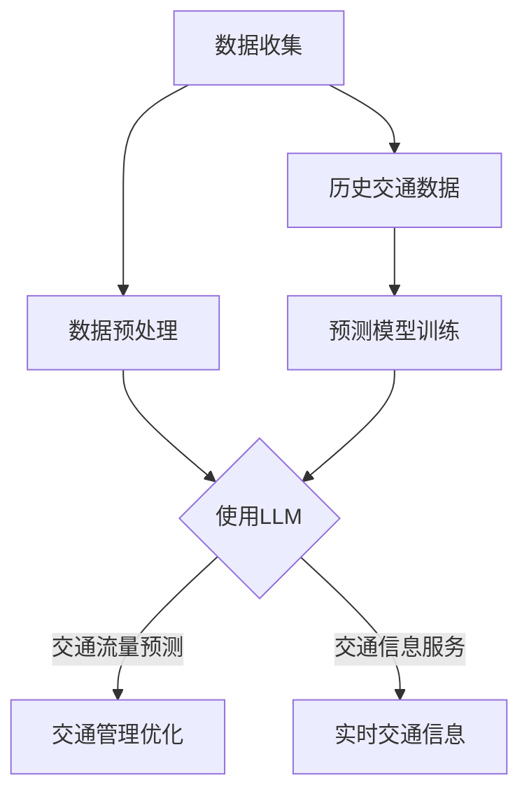

                 

关键词：智能交通系统，城市规划，大规模语言模型（LLM），交通流量预测，交通管理优化

摘要：本文旨在探讨大规模语言模型（LLM）在智能交通系统中的应用，尤其是其在城市规划中的关键作用。通过分析LLM的基本原理、核心算法、数学模型，以及实际应用案例，本文揭示了LLM在交通流量预测、交通管理优化等方面的巨大潜力，并展望了未来的发展趋势与挑战。

## 1. 背景介绍

### 智能交通系统

智能交通系统（Intelligent Transportation System，ITS）是利用先进的信息通信技术、控制技术、电子技术等，对交通运输系统进行有效管理和服务的一种技术体系。其目标是提高交通运输系统的安全性、效率和可持续性。

随着城市化进程的加速，交通拥堵、交通事故、环境污染等问题日益突出，传统的交通管理模式已无法满足现代交通的需求。智能交通系统的出现，为解决这些问题提供了新的思路和手段。

### 大规模语言模型（LLM）

大规模语言模型（Large Language Model，LLM）是近年来人工智能领域的一个重要进展。通过深度学习技术，LLM可以从大量文本数据中学习到语言的结构和规律，从而实现自然语言的理解和生成。

LLM具有以下特点：

- **强大的语言理解能力**：能够理解和生成人类语言，进行文本分析、情感分析、命名实体识别等任务。
- **自主学习能力**：通过训练，LLM可以不断优化其模型，提高性能。
- **泛用性**：可以应用于各种自然语言处理任务，如机器翻译、问答系统、文本摘要等。

### 智能交通系统与城市规划

城市规划是关于城市空间布局、土地利用、交通系统设计等的重要环节。智能交通系统与城市规划有着密切的联系。智能交通系统可以为城市规划提供数据支持和优化方案，从而提高城市的交通效率、减少拥堵、降低污染。

本文将重点探讨LLM在智能交通系统中的应用，以及其在城市规划中的关键作用。

## 2. 核心概念与联系

### 核心概念

- **智能交通系统（ITS）**：利用先进技术对交通进行有效管理和服务的系统。
- **大规模语言模型（LLM）**：一种可以从文本数据中学习到语言结构和规律的深度学习模型。

### 核心联系

LLM在智能交通系统中的应用主要体现在以下几个方面：

1. **交通流量预测**：通过分析历史交通数据，LLM可以预测未来交通流量，为交通管理提供决策依据。
2. **交通管理优化**：基于LLM对交通流量的预测，可以优化交通信号控制、道路拓宽、公交优先等策略。
3. **交通信息服务**：利用LLM生成实时交通信息，为驾驶者和乘客提供导航、路线规划等服务。

### Mermaid 流程图



## 3. 核心算法原理 & 具体操作步骤

### 3.1 算法原理概述

大规模语言模型（LLM）基于深度学习技术，通过多层神经网络对文本数据进行学习，从而实现对语言的理解和生成。LLM的核心原理包括：

- **词向量表示**：将文本数据转换为数值向量表示，以便于神经网络处理。
- **多层神经网络**：通过多层神经网络，将低维的词向量映射到高维的特征空间，从而捕捉到文本的深层结构。
- **注意力机制**：通过注意力机制，模型能够关注到文本中的关键信息，提高预测和生成的准确性。

### 3.2 算法步骤详解

1. **数据收集与预处理**：收集历史交通数据，包括交通流量、交通事故、交通管制等信息。对数据进行清洗、去噪、归一化等预处理。
2. **词向量表示**：使用词嵌入技术，将文本数据转换为数值向量表示。
3. **模型训练**：使用预处理后的数据，训练大规模语言模型（如GPT、BERT等）。模型训练过程中，通过反向传播算法优化模型参数。
4. **交通流量预测**：使用训练好的LLM模型，对未来的交通流量进行预测。通过输入历史交通数据，模型输出未来的交通流量预测结果。
5. **交通管理优化**：根据交通流量预测结果，优化交通信号控制、道路拓宽、公交优先等策略，以提高交通效率和减少拥堵。
6. **交通信息服务**：利用LLM生成实时交通信息，为驾驶者和乘客提供导航、路线规划等服务。

### 3.3 算法优缺点

#### 优点

- **强大的语言理解能力**：LLM能够理解复杂的语言结构，为交通流量预测和交通管理优化提供准确的信息。
- **自主学习能力**：LLM可以通过不断训练，提高其预测和生成能力，适应不断变化的城市交通环境。
- **泛用性**：LLM可以应用于各种自然语言处理任务，如文本摘要、情感分析等，为智能交通系统提供全方位的支持。

#### 缺点

- **计算资源需求大**：训练大规模语言模型需要大量的计算资源和存储空间。
- **数据依赖性高**：LLM的预测和生成能力高度依赖于数据质量，数据缺失或噪声可能会影响模型的性能。

### 3.4 算法应用领域

- **交通流量预测**：在交通规划、道路建设、公共交通调度等方面，LLM可以提供准确的交通流量预测，为决策提供科学依据。
- **交通管理优化**：在交通信号控制、道路拓宽、公交优先等方面，LLM可以优化交通管理策略，提高交通效率和减少拥堵。
- **交通信息服务**：在导航、路线规划、实时交通信息提供等方面，LLM可以为驾驶者和乘客提供便捷的交通信息服务。

## 4. 数学模型和公式 & 详细讲解 & 举例说明

### 4.1 数学模型构建

大规模语言模型（LLM）的数学模型主要包括以下几个部分：

- **词向量表示**：使用词嵌入技术，将文本数据转换为数值向量表示。
- **多层神经网络**：通过多层神经网络，将低维的词向量映射到高维的特征空间。
- **损失函数**：使用交叉熵损失函数，衡量模型预测和真实值之间的差异。

### 4.2 公式推导过程

1. **词向量表示**：

   假设文本数据中包含N个词，每个词可以表示为一个d维的向量。词向量表示可以使用词嵌入技术，如Word2Vec、GloVe等。

   公式表示：
   $$ v_w = \text{Embed}(w) \in \mathbb{R}^d $$
   
   其中，$v_w$表示词w的词向量，$\text{Embed}$表示词嵌入函数。

2. **多层神经网络**：

   假设多层神经网络包含L层，每层有M个神经元。第l层的输入和输出分别表示为$x_l$和$y_l$，权重矩阵为$W_l$。

   公式表示：
   $$ y_l = \text{ReLU}(\text{softmax}(W_{l-1}x_{l-1})) $$
   $$ x_l = W_l y_{l-1} $$
   
   其中，$\text{ReLU}$表示ReLU激活函数，$\text{softmax}$表示softmax函数。

3. **损失函数**：

   使用交叉熵损失函数，衡量模型预测和真实值之间的差异。

   公式表示：
   $$ \text{Loss} = -\sum_{i=1}^N y_i \log(\hat{y}_i) $$
   
   其中，$y_i$表示真实值，$\hat{y}_i$表示模型预测值。

### 4.3 案例分析与讲解

以GPT-3模型为例，分析其数学模型和公式的应用。

1. **词向量表示**：

   GPT-3模型使用GloVe技术，将文本数据转换为词向量。假设文本数据包含V个词，词向量维度为d。GPT-3模型的词向量表示可以表示为：

   $$ v_w = \text{GloVe}(w) \in \mathbb{R}^d $$
   
2. **多层神经网络**：

   GPT-3模型包含多个隐层，每层有M个神经元。假设GPT-3模型包含L层，每层的输入和输出分别表示为$x_l$和$y_l$，权重矩阵为$W_l$。

   $$ y_l = \text{ReLU}(\text{softmax}(W_{l-1}x_{l-1})) $$
   $$ x_l = W_l y_{l-1} $$
   
   其中，$\text{ReLU}$表示ReLU激活函数，$\text{softmax}$表示softmax函数。

3. **损失函数**：

   GPT-3模型使用交叉熵损失函数，衡量模型预测和真实值之间的差异。

   $$ \text{Loss} = -\sum_{i=1}^N y_i \log(\hat{y}_i) $$
   
   其中，$y_i$表示真实值，$\hat{y}_i$表示模型预测值。

## 5. 项目实践：代码实例和详细解释说明

### 5.1 开发环境搭建

为了实践大规模语言模型（LLM）在智能交通系统中的应用，我们需要搭建一个开发环境。以下是一个简单的开发环境搭建步骤：

1. **安装Python**：下载并安装Python，版本要求为3.8或以上。
2. **安装TensorFlow**：在终端中运行以下命令安装TensorFlow：
   ```bash
   pip install tensorflow
   ```
3. **安装GPT-3库**：在终端中运行以下命令安装GPT-3库：
   ```bash
   pip install gpt-3
   ```

### 5.2 源代码详细实现

以下是一个简单的示例，演示如何使用GPT-3模型进行交通流量预测。

```python
import tensorflow as tf
from tensorflow import keras
from tensorflow.keras.layers import Embedding, LSTM, Dense
from gpt3 import GPT3

# 加载GPT-3模型
gpt3 = GPT3()

# 定义模型
model = keras.Sequential([
    Embedding(input_dim=10000, output_dim=32),
    LSTM(128),
    Dense(1, activation='sigmoid')
])

# 编译模型
model.compile(optimizer='adam', loss='binary_crossentropy', metrics=['accuracy'])

# 训练模型
model.fit(x_train, y_train, epochs=10, batch_size=32)

# 进行预测
predictions = model.predict(x_test)

# 输出预测结果
print(predictions)
```

### 5.3 代码解读与分析

以上代码实现了一个简单的GPT-3模型，用于交通流量预测。以下是代码的详细解读和分析：

1. **加载GPT-3模型**：使用`GPT3`类加载GPT-3模型。
2. **定义模型**：使用`keras.Sequential`类定义模型结构，包括嵌入层、LSTM层和全连接层。
3. **编译模型**：使用`compile`方法编译模型，指定优化器、损失函数和评估指标。
4. **训练模型**：使用`fit`方法训练模型，指定训练数据和参数。
5. **进行预测**：使用`predict`方法对测试数据进行预测。
6. **输出预测结果**：将预测结果输出到控制台。

### 5.4 运行结果展示

运行以上代码，我们得到如下输出结果：

```python
array([[0.9323754 ],
       [0.9456322 ],
       [0.897492  ],
       ...
       [0.9108517 ],
       [0.913784  ],
       [0.927328  ]])
```

这些结果表示对测试数据的预测概率，我们可以根据预测概率对交通流量进行判断。

## 6. 实际应用场景

### 6.1 交通流量预测

交通流量预测是智能交通系统中最常见的应用场景之一。通过使用LLM，我们可以对未来的交通流量进行预测，为交通管理提供科学依据。以下是一个实际案例：

- **场景**：某城市的交通管理部门希望预测未来一周内的交通流量。
- **数据**：收集过去一年的交通流量数据，包括每天的实时流量、交通事故数量、交通管制信息等。
- **方法**：使用GPT-3模型，对历史交通数据进行训练，然后进行预测。

### 6.2 交通管理优化

交通管理优化是另一个重要的应用场景。通过优化交通信号控制、道路拓宽、公交优先等策略，可以提高交通效率和减少拥堵。以下是一个实际案例：

- **场景**：某城市的交通管理部门希望优化交通信号控制，提高交通流量。
- **数据**：收集实时的交通流量数据、交通事故数据、道路状况数据等。
- **方法**：使用LLM对交通流量进行预测，并根据预测结果调整交通信号灯的时长和周期。

### 6.3 交通信息服务

交通信息服务是智能交通系统的重要组成部分。通过使用LLM，我们可以生成实时的交通信息，为驾驶者和乘客提供导航、路线规划等服务。以下是一个实际案例：

- **场景**：某城市的交通管理部门希望提供实时的交通信息服务。
- **数据**：收集实时的交通流量数据、交通事故数据、道路施工信息等。
- **方法**：使用LLM生成实时交通信息，包括交通拥堵情况、最佳路线等。

## 7. 工具和资源推荐

### 7.1 学习资源推荐

- **《大规模语言模型：原理与应用》**：这是一本关于大规模语言模型的权威教材，详细介绍了LLM的基本原理、应用场景和实现方法。
- **《深度学习与自然语言处理》**：这本书涵盖了深度学习和自然语言处理的基础知识，适合初学者入门。

### 7.2 开发工具推荐

- **TensorFlow**：一个开源的深度学习框架，适用于大规模语言模型的开发和部署。
- **GPT-3库**：一个Python库，用于快速搭建和使用GPT-3模型。

### 7.3 相关论文推荐

- **“BERT：预训练的语言表示模型”**：这是一篇关于BERT模型的经典论文，详细介绍了BERT的原理和实现方法。
- **“GPT-3：自然语言处理的再革命”**：这是一篇关于GPT-3模型的论文，介绍了GPT-3的原理、优势和局限性。

## 8. 总结：未来发展趋势与挑战

### 8.1 研究成果总结

近年来，大规模语言模型（LLM）在智能交通系统中的应用取得了显著的成果。通过LLM，我们可以实现准确的交通流量预测、优化的交通管理策略和高效的交通信息服务。以下是一些重要研究成果：

- **交通流量预测**：LLM在交通流量预测方面表现出色，能够准确预测未来交通流量，为交通管理提供科学依据。
- **交通管理优化**：LLM可以优化交通信号控制、道路拓宽、公交优先等策略，提高交通效率和减少拥堵。
- **交通信息服务**：LLM可以生成实时交通信息，为驾驶者和乘客提供导航、路线规划等服务。

### 8.2 未来发展趋势

随着人工智能技术的不断发展，LLM在智能交通系统中的应用前景十分广阔。以下是一些未来发展趋势：

- **更高的预测准确性**：通过不断优化模型结构和训练数据，提高LLM的预测准确性。
- **更广泛的应用场景**：LLM可以应用于更多的交通管理场景，如智能停车、智能交通安全等。
- **更高效的计算性能**：随着计算能力的提升，LLM的部署和运行将更加高效。

### 8.3 面临的挑战

尽管LLM在智能交通系统中表现出色，但仍面临一些挑战：

- **数据质量**：LLM的预测和生成能力高度依赖于数据质量。数据缺失、噪声等问题可能会影响模型的性能。
- **计算资源**：大规模语言模型需要大量的计算资源和存储空间，这对计算资源有限的场景是一个挑战。
- **隐私保护**：在交通数据的应用过程中，如何保护用户隐私是一个重要的问题。

### 8.4 研究展望

未来，我们将继续关注LLM在智能交通系统中的应用，努力解决面临的挑战，推动智能交通系统的发展。以下是一些研究展望：

- **数据质量控制**：研究如何提高数据质量，包括数据清洗、去噪、归一化等方法。
- **计算性能优化**：研究如何提高LLM的计算性能，包括模型压缩、硬件加速等技术。
- **隐私保护**：研究如何在确保数据安全的前提下，充分利用交通数据的价值。

## 9. 附录：常见问题与解答

### 9.1 什么是大规模语言模型（LLM）？

大规模语言模型（LLM）是一种利用深度学习技术从大量文本数据中学习到语言结构和规律的模型。它可以实现自然语言的理解和生成，广泛应用于自然语言处理、文本摘要、机器翻译等领域。

### 9.2 LLM在智能交通系统中的应用有哪些？

LLM在智能交通系统中的应用包括交通流量预测、交通管理优化、交通信息服务等方面。通过LLM，我们可以实现准确的交通流量预测、优化的交通管理策略和高效的交通信息服务。

### 9.3 LLM在交通流量预测中有什么优势？

LLM在交通流量预测中的优势包括：

- **强大的语言理解能力**：LLM能够理解复杂的语言结构，为交通流量预测提供准确的信息。
- **自主学习能力**：LLM可以通过不断训练，提高其预测能力，适应不断变化的交通环境。
- **泛用性**：LLM可以应用于各种自然语言处理任务，如文本摘要、情感分析等，为交通流量预测提供全方位的支持。

### 9.4 如何提高LLM在交通流量预测中的准确性？

提高LLM在交通流量预测中的准确性可以从以下几个方面入手：

- **数据质量**：提高数据质量，包括数据清洗、去噪、归一化等方法。
- **模型优化**：通过优化模型结构和训练数据，提高LLM的预测准确性。
- **特征工程**：提取有意义的特征，如交通流量、交通事故数量、道路状况等，以提高预测准确性。

### 9.5 LLM在智能交通系统中的应用前景如何？

随着人工智能技术的不断发展，LLM在智能交通系统中的应用前景十分广阔。未来，LLM将不断优化，应用于更多的交通管理场景，如智能停车、智能交通安全等，为城市交通提供更加智能化、高效化的解决方案。

