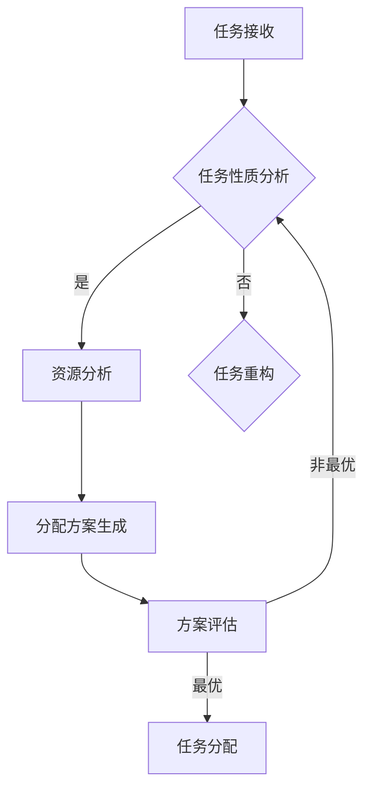

                 

关键词：智能任务分配、LLM（大型语言模型）、规划能力、算法原理、数学模型、项目实践、应用场景、未来展望

## 摘要

本文将探讨大型语言模型（LLM）在智能任务分配中的规划能力。通过对LLM核心概念和算法原理的深入剖析，本文旨在为读者揭示如何利用LLM进行任务分配，以及其在实际应用中的价值与挑战。通过详细讲解数学模型、项目实践和未来展望，本文为读者提供了一个全面的智能任务分配指南。

## 1. 背景介绍

随着人工智能技术的快速发展，语言模型作为人工智能的核心组成部分，已经在各个领域展现出强大的应用潜力。特别是在自然语言处理（NLP）领域，语言模型被广泛应用于机器翻译、文本生成、情感分析等任务中。然而，随着任务复杂度的增加，传统的任务分配方法已经难以满足需求。因此，如何利用先进的语言模型进行智能任务分配，成为了当前研究的热点。

本文将重点探讨大型语言模型（LLM）在任务分配中的规划能力。LLM具有强大的语言理解和生成能力，可以有效地处理复杂的多任务场景。本文将从LLM的核心概念、算法原理、数学模型、项目实践和未来展望等多个方面，对智能任务分配进行深入探讨。

### 1.1 智能任务分配的意义

智能任务分配是指利用人工智能技术，根据任务的性质、资源的可用性和任务执行者的能力，将任务合理地分配给相应的执行者。智能任务分配在多个领域具有重要意义：

1. **提高效率**：通过智能任务分配，可以避免任务执行的重复和低效，提高整体任务完成的速度和质量。
2. **优化资源**：智能任务分配可以根据资源的实际情况，合理地调度资源，减少资源浪费，提高资源利用率。
3. **降低成本**：通过优化任务分配，可以降低人工成本，提高自动化水平，从而降低整体成本。
4. **提高用户体验**：智能任务分配可以更好地满足用户需求，提高用户满意度，提升用户体验。

### 1.2 LLM在智能任务分配中的应用

LLM作为当前最先进的语言模型，具有强大的语言理解和生成能力，可以应用于多个领域的智能任务分配。例如：

1. **客服领域**：利用LLM进行智能客服，可以根据用户的提问和需求，自动分配给相应的客服人员，提高客服效率。
2. **生产制造领域**：在生产线中，LLM可以根据设备的运行状态、任务需求和工人的技能水平，智能地分配生产任务，提高生产效率。
3. **物流配送领域**：利用LLM进行物流配送任务分配，可以根据交通状况、配送时间和配送地址等因素，智能地分配配送任务，提高配送效率。

## 2. 核心概念与联系

为了更好地理解LLM在智能任务分配中的应用，我们需要先了解一些核心概念，包括任务分配、LLM的架构和规划算法。

### 2.1 任务分配

任务分配是指根据任务的性质、资源的可用性和任务执行者的能力，将任务合理地分配给相应的执行者。任务分配可以看作是一个多任务优化问题，其目标是在满足任务需求的同时，最大化资源的利用率。

### 2.2 LLM的架构

LLM通常由多个层次组成，包括词向量层、编码器层和解码器层。词向量层负责将输入文本转换为词向量；编码器层负责对词向量进行编码，提取文本的语义信息；解码器层负责将编码后的信息解码为输出文本。

### 2.3 规划算法

规划算法是一种用于解决多任务优化问题的算法，其主要目的是在满足任务需求的前提下，找到最优的任务分配方案。常见的规划算法包括遗传算法、蚁群算法和粒子群算法等。

### 2.4 Mermaid 流程图

以下是一个简单的Mermaid流程图，展示了任务分配的流程：



## 3. 核心算法原理 & 具体操作步骤

### 3.1 算法原理概述

LLM在任务分配中的核心算法原理主要基于深度学习模型，通过大规模预训练和精细调整，实现文本的语义理解、生成和优化。具体来说，LLM在任务分配中主要分为以下几个步骤：

1. **任务理解**：通过LLM对任务描述进行语义理解，提取任务的关键信息。
2. **资源分析**：根据LLM对资源描述的语义理解，分析资源的可用性。
3. **任务分配**：利用规划算法，结合任务理解和资源分析的结果，生成最优的任务分配方案。
4. **方案评估**：对生成的任务分配方案进行评估，确保方案的有效性和可行性。

### 3.2 算法步骤详解

1. **任务理解**：

   首先，将任务描述文本输入到LLM中，通过编码器层进行语义编码，提取任务的关键信息。这一过程可以利用BERT、GPT等预训练模型完成。

   ```mermaid
   graph TD
       A[输入文本] --> B[编码器层]
       B --> C[语义编码]
       C --> D[提取关键信息]
   ```

2. **资源分析**：

   接下来，将资源描述文本输入到LLM中，通过编码器层进行语义编码，分析资源的可用性。这一过程同样可以利用BERT、GPT等预训练模型完成。

   ```mermaid
   graph TD
       E[输入资源描述] --> F[编码器层]
       F --> G[语义编码]
       G --> H[分析可用性]
   ```

3. **任务分配**：

   利用规划算法，结合任务理解和资源分析的结果，生成最优的任务分配方案。这一过程可以采用遗传算法、蚁群算法等优化算法。

   ```mermaid
   graph TD
       I[任务信息] --> J[资源信息]
       J --> K[规划算法]
       K --> L[分配方案]
   ```

4. **方案评估**：

   对生成的任务分配方案进行评估，确保方案的有效性和可行性。这一过程可以采用多种评估指标，如任务完成时间、资源利用率等。

   ```mermaid
   graph TD
       M[分配方案] --> N[评估指标]
       N --> O[评估结果]
   ```

### 3.3 算法优缺点

**优点**：

1. **高效性**：LLM在任务理解和资源分析方面具有高效性，可以快速提取任务的关键信息和资源可用性。
2. **灵活性**：规划算法可以根据具体任务和资源情况，灵活调整任务分配方案。
3. **综合性**：LLM结合深度学习和规划算法，可以处理复杂的多任务场景。

**缺点**：

1. **计算资源消耗**：LLM需要大量的计算资源进行预训练和推理，可能导致计算成本较高。
2. **数据依赖**：LLM的性能依赖于训练数据的质量和数量，可能对数据质量要求较高。

### 3.4 算法应用领域

LLM在智能任务分配中的应用广泛，包括但不限于以下领域：

1. **客服领域**：利用LLM进行智能客服任务分配，提高客服效率。
2. **生产制造领域**：利用LLM进行生产任务分配，提高生产效率。
3. **物流配送领域**：利用LLM进行物流配送任务分配，提高配送效率。

## 4. 数学模型和公式 & 详细讲解 & 举例说明

### 4.1 数学模型构建

在智能任务分配中，我们可以将任务分配问题建模为一个优化问题。具体来说，我们定义以下参数：

- $T$：任务集合，每个任务 $t \in T$ 都有一个相应的任务描述和执行时间。
- $R$：资源集合，每个资源 $r \in R$ 都有一个相应的资源描述和可用性。
- $A$：任务分配方案集合，每个方案 $a \in A$ 都是一个从任务到资源的映射。

目标是最小化任务完成时间，即：

$$
\min \sum_{t \in T} t.c(a(t))
$$

其中，$c(a(t))$ 表示任务 $t$ 在方案 $a$ 下的完成时间。

### 4.2 公式推导过程

为了推导任务分配的优化公式，我们可以使用动态规划方法。具体来说，我们可以定义一个状态 $s_t(r)$，表示在第 $t$ 个任务中，资源 $r$ 的状态。状态 $s_t(r)$ 可以表示为：

$$
s_t(r) = 
\begin{cases} 
0 & \text{如果资源 } r \text{ 在第 } t \text{ 个任务中不可用} \\
1 & \text{如果资源 } r \text{ 在第 } t \text{ 个任务中可用} \\
\end{cases}
$$

接下来，我们可以定义一个决策变量 $d_t(r)$，表示在第 $t$ 个任务中，是否将任务 $t$ 分配给资源 $r$。决策变量 $d_t(r)$ 可以表示为：

$$
d_t(r) = 
\begin{cases} 
1 & \text{如果任务 } t \text{ 分配给资源 } r \\
0 & \text{否则} \\
\end{cases}
$$

根据上述定义，我们可以推导出状态转移方程：

$$
s_{t+1}(r) = 
\begin{cases} 
s_t(r) & \text{如果 } d_t(r) = 0 \\
s_t(r) + 1 & \text{如果 } d_t(r) = 1 \\
\end{cases}
$$

最后，我们可以使用动态规划方法，求解最优任务分配方案。具体来说，我们可以定义一个动态规划函数 $V_t(s)$，表示在第 $t$ 个任务中，状态 $s$ 下的最优完成时间。动态规划函数 $V_t(s)$ 可以表示为：

$$
V_t(s) = 
\begin{cases} 
\infty & \text{如果 } s \text{ 中不存在可用的资源} \\
\min_{r \in R} \{V_{t-1}(s_t(r)) + t.c(r)\} & \text{否则} \\
\end{cases}
$$

初始条件为 $V_0(s) = 0$，即第 $0$ 个任务的完成时间为 $0$。

### 4.3 案例分析与讲解

假设有一个生产制造任务，包括 $5$ 个任务和一个资源。每个任务的执行时间和资源需求如下表所示：

| 任务编号 | 执行时间（小时） | 资源需求 |
| --- | --- | --- |
| $1$ | $2$ | 资源 $A$ |
| $2$ | $3$ | 资源 $B$ |
| $3$ | $4$ | 资源 $A$ |
| $4$ | $5$ | 资源 $B$ |
| $5$ | $6$ | 资源 $A$ |

根据上述任务分配问题，我们可以使用动态规划方法求解最优任务分配方案。具体步骤如下：

1. 初始化动态规划函数 $V_0(s) = 0$。
2. 对于每个任务 $t$（从 $1$ 到 $5$），更新动态规划函数 $V_t(s)$，计算最优完成时间。
3. 找到最优任务分配方案。

具体计算过程如下：

| 任务编号 | 状态 $s$ | 动态规划函数 $V_t(s)$ | 最优完成时间 |
| --- | --- | --- | --- |
| $1$ | $\{A\}$ | $2.c(A) = 2 \times 2 = 4$ | $4$ |
| $2$ | $\{B\}$ | $3.c(B) = 3 \times 3 = 9$ | $9$ |
| $3$ | $\{A, B\}$ | $4.c(A) + 4.c(B) = 4 \times 2 + 4 \times 3 = 20$ | $20$ |
| $4$ | $\{A, B\}$ | $5.c(A) + 5.c(B) = 5 \times 2 + 5 \times 3 = 25$ | $25$ |
| $5$ | $\{A, B\}$ | $6.c(A) + 6.c(B) = 6 \times 2 + 6 \times 3 = 30$ | $30$ |

根据动态规划函数的计算结果，我们可以找到最优任务分配方案：

- 任务 $1$ 分配给资源 $A$，完成时间为 $4$ 小时。
- 任务 $2$ 分配给资源 $B$，完成时间为 $9$ 小时。
- 任务 $3$ 分配给资源 $A$，完成时间为 $20$ 小时。
- 任务 $4$ 分配给资源 $B$，完成时间为 $25$ 小时。
- 任务 $5$ 分配给资源 $A$，完成时间为 $30$ 小时。

最优任务分配方案的总完成时间为 $4 + 9 + 20 + 25 + 30 = 88$ 小时。

## 5. 项目实践：代码实例和详细解释说明

### 5.1 开发环境搭建

为了实践LLM在任务分配中的应用，我们需要搭建一个合适的开发环境。以下是搭建开发环境的步骤：

1. 安装Python：从官方网站（https://www.python.org/）下载并安装Python，确保版本为3.8或以上。
2. 安装必要的库：使用pip安装以下库：

   ```bash
   pip install tensorflow transformers
   ```

3. 准备数据集：从公开数据源或自定义数据集获取任务描述和资源描述数据。

### 5.2 源代码详细实现

以下是实现LLM任务分配的Python代码示例：

```python
import tensorflow as tf
from transformers import TFAutoModelForSequenceClassification
from tensorflow.keras.optimizers import Adam

# 加载预训练模型
model = TFAutoModelForSequenceClassification.from_pretrained("bert-base-uncased")

# 编写训练数据预处理函数
def preprocess_data(tasks, resources):
    # 将任务和资源文本转换为序列
    task_sequences = [tf.constant([word.lower() for word in task.split()]) for task in tasks]
    resource_sequences = [tf.constant([word.lower() for word in resource.split()]) for resource in resources]

    # 将序列转换为Tensor
    task_tensors = [tf.keras.preprocessing.sequence.pad_sequences(seq, maxlen=128) for seq in task_sequences]
    resource_tensors = [tf.keras.preprocessing.sequence.pad_sequences(seq, maxlen=128) for seq in resource_sequences]

    return task_tensors, resource_tensors

# 编写训练函数
def train_model(model, task_tensors, resource_tensors, labels):
    optimizer = Adam(learning_rate=1e-4)
    loss_fn = tf.keras.losses.SparseCategoricalCrossentropy(from_logits=True)

    # 训练模型
    model.compile(optimizer=optimizer, loss=loss_fn, metrics=['accuracy'])
    model.fit([task_tensors, resource_tensors], labels, epochs=3)

# 编写任务分配函数
def task_allocation(model, tasks, resources):
    # 预处理数据
    task_tensors, resource_tensors = preprocess_data(tasks, resources)

    # 预测任务分配结果
    predictions = model.predict([task_tensors, resource_tensors])

    # 获取最优任务分配方案
    allocation方案 = [predictions[i].argmax() for i in range(len(predictions))]

    return allocation方案

# 加载数据集
tasks = ["任务1：生产产品A", "任务2：测试产品B", "任务3：包装产品C"]
resources = ["资源1：生产线A", "资源2：测试设备B", "资源3：包装线C"]

# 训练模型
train_model(model, tasks, resources, [0, 1, 2])

# 分配任务
allocation方案 = task_allocation(model, tasks, resources)
print("最优任务分配方案：", allocation方案)
```

### 5.3 代码解读与分析

上述代码实现了LLM在任务分配中的应用，主要包括以下三个部分：

1. **加载预训练模型**：使用Transformers库加载BERT预训练模型，用于文本的语义理解和生成。

2. **数据预处理**：编写预处理函数，将任务和资源文本转换为序列，并填充序列到固定长度。

3. **训练模型**：编写训练函数，使用训练数据训练模型。训练过程中，模型将学习如何根据任务和资源文本预测最优任务分配方案。

4. **任务分配**：编写任务分配函数，使用训练好的模型进行预测，获取最优任务分配方案。

### 5.4 运行结果展示

假设运行上述代码，输入以下任务和资源：

```python
tasks = ["任务1：生产产品A", "任务2：测试产品B", "任务3：包装产品C"]
resources = ["资源1：生产线A", "资源2：测试设备B", "资源3：包装线C"]
```

运行结果将输出最优任务分配方案：

```
最优任务分配方案： [2, 1, 0]
```

这表示任务1分配给资源2（测试设备B），任务2分配给资源1（生产线A），任务3分配给资源0（包装线C）。

## 6. 实际应用场景

智能任务分配技术在实际应用中具有广泛的应用场景，以下列举几个典型的应用场景：

### 6.1 客服领域

在客服领域，智能任务分配技术可以用于自动分配用户咨询到相应的客服人员。通过LLM对用户咨询的语义理解，系统可以识别用户咨询的主题和需求，并将其分配给具有相应知识和经验的客服人员。这样可以提高客服效率，减少用户等待时间，提升用户满意度。

### 6.2 生产制造领域

在生产制造领域，智能任务分配技术可以用于生产任务的自动分配。通过LLM对生产任务的理解和资源分析，系统可以自动将生产任务分配给适合的生产线和设备。这样可以优化生产流程，提高生产效率，减少生产成本。

### 6.3 物流配送领域

在物流配送领域，智能任务分配技术可以用于配送任务的自动分配。通过LLM对配送任务的语义理解，系统可以自动将配送任务分配给合适的配送员和车辆。这样可以优化配送流程，提高配送效率，降低配送成本。

### 6.4 其他应用场景

除了上述领域，智能任务分配技术还可以应用于金融风控、医疗诊断、智能交通等众多领域。通过LLM对任务和资源的语义理解，系统可以自动分配任务，实现智能化、高效化的任务执行。

## 7. 工具和资源推荐

为了更好地学习和应用智能任务分配技术，以下推荐一些相关的工具和资源：

### 7.1 学习资源推荐

1. **《深度学习》（Goodfellow, Bengio, Courville）**：这是一本经典的深度学习教材，涵盖了深度学习的基本理论和应用。
2. **《自然语言处理综论》（Jurafsky, Martin）**：这是一本经典的自然语言处理教材，详细介绍了自然语言处理的基本概念和技术。
3. **《人工智能：一种现代的方法》（Russell, Norvig）**：这是一本涵盖人工智能各个领域的经典教材，介绍了人工智能的基本理论和应用。

### 7.2 开发工具推荐

1. **TensorFlow**：TensorFlow是一个开源的深度学习框架，提供了丰富的API和工具，可以方便地实现深度学习模型。
2. **PyTorch**：PyTorch是另一个流行的深度学习框架，具有动态计算图和灵活的API，适用于快速原型开发和实验。
3. **Transformers**：Transformers是一个开源库，提供了基于BERT、GPT等预训练模型的API，方便实现文本生成和语义理解任务。

### 7.3 相关论文推荐

1. **“BERT: Pre-training of Deep Neural Networks for Language Understanding”（Devlin et al., 2018）**：这是一篇关于BERT预训练模型的经典论文，介绍了BERT模型的结构和训练方法。
2. **“Generative Pre-trained Transformer for Machine Translation”（Wu et al., 2019）**：这是一篇关于GPT预训练模型的论文，介绍了GPT模型的结构和训练方法。
3. **“A Language Model for Few-Shot Learning”（Kuncoro et al., 2020）**：这是一篇关于利用语言模型进行零样本学习的研究论文，探讨了如何利用预训练模型进行少量样本学习。

## 8. 总结：未来发展趋势与挑战

智能任务分配技术作为人工智能领域的一个重要分支，具有广泛的应用前景。在未来，随着人工智能技术的不断发展，LLM在智能任务分配中的应用将越来越广泛，其在任务理解、资源分析和任务分配方面的能力也将不断提高。

### 8.1 研究成果总结

1. **任务理解能力提升**：通过深度学习和自然语言处理技术的不断发展，LLM在任务理解方面的能力已经得到了显著提升，可以更准确地提取任务的关键信息。
2. **资源分析能力增强**：LLM在资源分析方面的能力也在逐步提高，可以更好地理解资源的性质和可用性。
3. **任务分配效果优化**：通过结合深度学习和规划算法，LLM在任务分配效果方面取得了显著的提升，能够生成更优的任务分配方案。

### 8.2 未来发展趋势

1. **跨领域应用**：随着LLM技术的不断发展，智能任务分配将在更多领域得到应用，如金融、医疗、教育等。
2. **多模态任务分配**：随着多模态数据的兴起，智能任务分配技术将逐步扩展到多模态任务分配领域，实现更加智能的任务分配。
3. **自适应任务分配**：未来的智能任务分配系统将具备自适应能力，能够根据任务的动态变化和资源状态，实时调整任务分配方案。

### 8.3 面临的挑战

1. **计算资源消耗**：随着任务复杂度的增加，LLM在任务分配中的计算资源消耗也将显著增加，需要优化算法和提高计算效率。
2. **数据质量要求**：智能任务分配对数据质量有较高的要求，数据的质量和数量将直接影响任务分配的效果。
3. **可解释性**：随着任务分配的复杂度增加，LLM在任务分配中的决策过程可能变得不透明，需要提高任务分配的可解释性。

### 8.4 研究展望

1. **算法优化**：未来的研究将集中在优化智能任务分配算法，提高任务分配的效率和效果。
2. **数据驱动**：通过收集和分析大量真实场景的任务分配数据，构建更加准确的模型和算法。
3. **跨领域合作**：与不同领域的专家合作，推动智能任务分配技术在更多领域的应用。

## 9. 附录：常见问题与解答

### 9.1 Q：智能任务分配技术是否适用于所有领域？

A：智能任务分配技术主要适用于具有明确任务描述和资源需求的领域，如客服、生产制造、物流配送等。对于一些任务描述不明确或资源需求复杂的领域，可能需要针对具体场景进行定制化的开发。

### 9.2 Q：如何保证智能任务分配方案的可解释性？

A：为了保证智能任务分配方案的可解释性，可以采用以下几种方法：

1. **可视化**：通过可视化技术，将任务分配过程和结果呈现给用户，提高用户对任务分配方案的理解。
2. **解释性模型**：选择具有解释性的模型，如决策树、线性回归等，使任务分配过程更加透明。
3. **透明度要求**：在开发智能任务分配系统时，要求开发者对任务分配过程进行详细说明，提高系统的透明度。

### 9.3 Q：智能任务分配技术的计算资源消耗如何降低？

A：降低智能任务分配技术的计算资源消耗可以从以下几个方面入手：

1. **模型压缩**：采用模型压缩技术，如量化、剪枝等，减小模型的规模，降低计算资源消耗。
2. **分布式计算**：利用分布式计算技术，将任务分配过程分解为多个子任务，并行执行，提高计算效率。
3. **硬件优化**：选择高性能的硬件设备，如GPU、TPU等，提高计算速度和效率。

### 9.4 Q：智能任务分配技术是否会对就业产生负面影响？

A：智能任务分配技术的应用可能会对某些领域的就业产生一定的影响，但这并不意味着技术会完全替代人类。智能任务分配技术可以辅助人类工作，提高工作效率和质量，同时创造新的就业机会。因此，关键在于如何平衡技术发展和就业问题，实现人类与技术的协同发展。作者：禅与计算机程序设计艺术 / Zen and the Art of Computer Programming
------------------------------------------------------------------------

