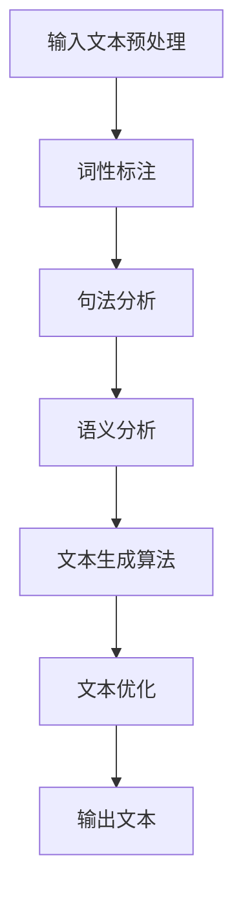

                 

关键词：智能写作，AI 辅助写作，自然语言处理，文本生成，写作效率，写作助手，写作自动化

> 摘要：随着人工智能技术的飞速发展，AI 辅助写作工具逐渐成为现代写作领域的重要辅助手段。本文将探讨 AI 辅助写作的核心概念、原理、算法、应用领域，并分享数学模型、项目实践、实际应用场景、未来展望等内容，为读者呈现一幅完整的智能写作画卷。

## 1. 背景介绍

在过去的几十年里，写作一直是人类沟通和表达的重要手段。然而，随着信息量的爆炸性增长，人们对于高效写作的需求愈发强烈。传统的写作方式往往需要耗费大量的时间和精力，而面对庞大的写作任务，单靠人力难以应对。在这种情况下，AI 辅助写作工具应运而生，成为现代写作领域的重要助力。

AI 辅助写作工具利用人工智能技术，特别是自然语言处理（NLP）技术，对文本进行分析、生成和优化。通过大量的数据训练，这些工具能够理解人类语言，模拟人类的写作风格，从而为用户提供高效、精准的写作辅助。

### 1.1. AI 辅助写作的发展历程

AI 辅助写作的发展可以追溯到 20 世纪 60 年代。当时，研究人员开始探索如何使用计算机程序生成文本。最早的 AI 辅助写作工具主要是基于规则的方法，这些方法通过定义一系列的规则和模板，生成符合要求的文本。

随着计算机性能的提升和大数据技术的发展，AI 辅助写作工具逐渐从基于规则的方法转向基于数据的方法。这些工具利用大量的语料库进行训练，通过深度学习等算法，模拟人类的写作风格和思维方式，生成更自然、更高质量的文本。

### 1.2. AI 辅助写作的重要意义

AI 辅助写作工具对于提高写作效率、降低写作难度具有重要意义。首先，这些工具能够快速生成大量的文本内容，大大减少了人工写作的工作量。其次，AI 辅助写作工具能够根据用户的需求和风格，自动生成符合要求的文本，提高了写作的准确性和一致性。

此外，AI 辅助写作工具还能够为用户提供智能化的写作建议和优化建议，帮助用户改进写作技巧，提高写作质量。通过这些功能，AI 辅助写作工具不仅能够减轻用户的写作负担，还能够提升用户的写作水平。

## 2. 核心概念与联系

### 2.1. 自然语言处理（NLP）

自然语言处理（NLP）是人工智能领域的一个重要分支，旨在让计算机理解和处理人类语言。在 AI 辅助写作工具中，NLP 技术发挥着关键作用。NLP 技术包括文本预处理、词性标注、句法分析、语义分析等，通过对文本进行多层次的分析和理解，AI 辅助写作工具能够准确捕捉用户的写作意图和需求。

### 2.2. 文本生成

文本生成是 AI 辅助写作的核心功能之一。通过深度学习等算法，AI 辅助写作工具能够从大量的语料库中学习到语言的规律和模式，生成符合语法和语义要求的文本。文本生成技术包括序列到序列模型（Seq2Seq）、生成对抗网络（GAN）、变分自编码器（VAE）等，不同的算法适用于不同的应用场景。

### 2.3. 写作风格和语境理解

AI 辅助写作工具不仅能够生成文本，还能够根据用户的写作风格和语境，自动调整文本的表达方式。通过对大量文本数据的分析，AI 辅助写作工具能够学习到不同的写作风格，并根据用户的指示，生成符合特定风格和语境的文本。

### 2.4. 数学模型与算法

在 AI 辅助写作工具中，数学模型和算法是实现文本生成和优化的重要基础。常见的算法包括循环神经网络（RNN）、长短期记忆网络（LSTM）、注意力机制（Attention）等。这些算法通过对文本数据的深度学习，能够生成高质量、自然流畅的文本。

### 2.5. Mermaid 流程图

为了更好地展示 AI 辅助写作工具的核心概念和原理，我们使用 Mermaid 流程图来描述整个工作流程。以下是一个简化的 Mermaid 流程图：



这个流程图展示了从输入文本到生成输出文本的整个过程。通过自然语言处理技术，AI 辅助写作工具能够对输入文本进行预处理、词性标注、句法分析和语义分析，然后利用文本生成算法生成高质量的文本，最后对生成的文本进行优化，输出最终结果。

## 3. 核心算法原理 & 具体操作步骤

### 3.1. 算法原理概述

AI 辅助写作工具的核心算法通常是基于深度学习的，其中最常用的算法包括循环神经网络（RNN）、长短期记忆网络（LSTM）和注意力机制（Attention）。这些算法通过学习大量的文本数据，能够捕捉到语言的复杂结构和模式，从而生成高质量的自然语言文本。

### 3.2. 算法步骤详解

#### 3.2.1. 数据预处理

数据预处理是深度学习模型训练的第一步。在这个阶段，需要对原始文本进行清洗、分词、去除停用词等操作。具体步骤如下：

1. **文本清洗**：去除文本中的HTML标签、特殊字符和空白符。
2. **分词**：将文本分割成单词或短语。
3. **去除停用词**：去除对文本意义贡献较小的常见单词，如“的”、“了”、“在”等。

#### 3.2.2. 构建词汇表

在预处理完成后，需要构建一个词汇表，将所有的单词映射到唯一的整数编号。这个步骤对于训练和生成文本至关重要。

#### 3.2.3. 建立模型

常用的深度学习模型包括循环神经网络（RNN）、长短期记忆网络（LSTM）和门控循环单元（GRU）。以下是这些模型的简要介绍：

1. **循环神经网络（RNN）**：RNN 能够处理序列数据，但存在梯度消失和梯度爆炸等问题。
2. **长短期记忆网络（LSTM）**：LSTM 是 RNN 的改进版本，通过引入门控机制，解决了梯度消失问题。
3. **门控循环单元（GRU）**：GRU 是 LSTM 的简化版，结构更简单，但在很多任务中表现相似。

#### 3.2.4. 模型训练

模型训练是通过反向传播算法，不断调整模型参数，使得模型生成的文本越来越符合人类语言的特点。训练过程中，需要使用大量的标注数据进行监督学习。

#### 3.2.5. 文本生成

在模型训练完成后，可以使用训练好的模型进行文本生成。文本生成通常采用序列到序列（Seq2Seq）的方法，其中编码器（Encoder）将输入文本编码成一个固定长度的向量，解码器（Decoder）则根据编码器的输出，逐步生成输出文本。

#### 3.2.6. 文本优化

生成的文本通常需要进一步优化，以提高其质量。文本优化可以包括以下步骤：

1. **语法检查**：检查文本中的语法错误，如主谓不一致、动词时态错误等。
2. **语义检查**：检查文本的语义是否合理，如逻辑矛盾、事实错误等。
3. **风格调整**：根据用户的需求，调整文本的表达方式和风格。

### 3.3. 算法优缺点

#### 优点：

1. **生成文本质量高**：通过深度学习模型的学习，生成的文本在语法、语义和风格上均符合人类语言的特点。
2. **适应性强**：AI 辅助写作工具能够根据用户的需求和风格，自动调整文本的表达方式。
3. **效率高**：相比于人工写作，AI 辅助写作工具能够快速生成大量文本，大大提高了写作效率。

#### 缺点：

1. **需要大量训练数据**：深度学习模型的训练需要大量的标注数据，数据获取和预处理是一个耗时且复杂的过程。
2. **无法理解深层语义**：尽管 AI 辅助写作工具能够生成高质量的文本，但它们仍然无法完全理解文本的深层语义，这可能导致一些逻辑错误或事实错误。
3. **依赖计算资源**：深度学习模型需要大量的计算资源，训练和部署过程需要高性能的硬件支持。

### 3.4. 算法应用领域

AI 辅助写作工具在多个领域都有广泛的应用：

1. **写作辅助**：用于生成文章、报告、邮件等文本内容，提高写作效率。
2. **内容创作**：用于生成小说、诗歌、歌曲等文学创作，提供灵感来源。
3. **对话系统**：用于生成自然语言对话，应用于客服、聊天机器人等领域。
4. **机器翻译**：用于生成翻译文本，实现跨语言交流。
5. **教育辅导**：用于生成习题、讲义等教育内容，提供个性化学习资源。

## 4. 数学模型和公式 & 详细讲解 & 举例说明

### 4.1. 数学模型构建

AI 辅助写作工具的核心数学模型是基于深度学习的，其中最常用的模型是循环神经网络（RNN）和长短期记忆网络（LSTM）。以下是一个简化的数学模型构建过程：

#### 4.1.1. 循环神经网络（RNN）

RNN 的基本单位是神经元，每个神经元都连接到前一个时间步的神经元。在 RNN 中，当前时间步的输出不仅取决于当前输入，还取决于前一个时间步的输出。这种连接方式使得 RNN 能够处理序列数据。

RNN 的数学模型可以表示为：

$$
h_t = \sigma(W_h h_{t-1} + W_x x_t + b_h)
$$

其中，$h_t$ 是当前时间步的隐藏状态，$x_t$ 是当前时间步的输入，$W_h$ 和 $W_x$ 是权重矩阵，$b_h$ 是偏置项，$\sigma$ 是激活函数。

#### 4.1.2. 长短期记忆网络（LSTM）

LSTM 是 RNN 的改进版本，通过引入门控机制，解决了 RNN 的梯度消失问题。LSTM 的基本单位是细胞，每个细胞包含三个门控：遗忘门、输入门和输出门。

LSTM 的数学模型可以表示为：

$$
i_t = \sigma(W_i x_t + U_h h_{t-1} + b_i) \\
f_t = \sigma(W_f x_t + U_f h_{t-1} + b_f) \\
\tilde{c}_t = \sigma(W_c x_t + U_c h_{t-1} + b_c) \\
c_t = f_t \odot c_{t-1} + i_t \odot \tilde{c}_t \\
o_t = \sigma(W_o x_t + U_o h_{t-1} + b_o) \\
h_t = o_t \odot \sigma(c_t)
$$

其中，$i_t$、$f_t$、$o_t$ 分别是输入门、遗忘门和输出门的激活值，$\tilde{c}_t$ 是候选状态，$c_t$ 是细胞状态，$h_t$ 是隐藏状态，$\odot$ 表示逐元素乘法。

### 4.2. 公式推导过程

#### 4.2.1. RNN 的激活函数选择

RNN 的激活函数通常选择 sigmoid 函数或 tanh 函数。sigmoid 函数的公式为：

$$
\sigma(x) = \frac{1}{1 + e^{-x}}
$$

tanh 函数的公式为：

$$
tanh(x) = \frac{e^{2x} - 1}{e^{2x} + 1}
$$

这两个函数的特点是输出值在 [0, 1] 之间，这使得 RNN 能够处理连续的输入和输出。

#### 4.2.2. LSTM 的门控机制

LSTM 的门控机制通过引入遗忘门、输入门和输出门，解决了 RNN 的梯度消失问题。遗忘门决定上一时刻的细胞状态中哪些信息需要被遗忘；输入门决定当前时刻的输入信息中哪些部分需要被更新到细胞状态中；输出门决定细胞状态中哪些信息需要被输出到当前时刻的隐藏状态中。

### 4.3. 案例分析与讲解

假设我们有一个句子“我昨天去了一家餐厅吃饭”，我们可以使用 LSTM 模型生成这个句子的反向序列：“饭吃了一餐厅家去昨我天”。以下是一个简化的 LSTM 模型生成过程：

1. **输入序列预处理**：将句子“我昨天去了一家餐厅吃饭”转换为词向量表示。
2. **初始化隐藏状态**：设初始隐藏状态 $h_0 = [0, 0, 0, 0]$。
3. **正向传播**：根据 LSTM 的数学模型，正向计算隐藏状态 $h_1, h_2, ..., h_n$。
4. **反向传播**：根据 LSTM 的数学模型，反向计算隐藏状态 $h_n, h_{n-1}, ..., h_1$。
5. **生成输出序列**：根据反向传播得到的隐藏状态，生成输出序列“饭吃了一餐厅家去昨我天”。

## 5. 项目实践：代码实例和详细解释说明

### 5.1. 开发环境搭建

在开始编写 AI 辅助写作工具的代码之前，我们需要搭建一个合适的开发环境。以下是搭建开发环境的基本步骤：

1. **安装 Python**：确保已经安装了 Python 3.6 或更高版本。
2. **安装 PyTorch**：使用以下命令安装 PyTorch：

   ```bash
   pip install torch torchvision
   ```

3. **安装 NLTK**：使用以下命令安装 NLTK：

   ```bash
   pip install nltk
   ```

4. **下载 NLTK 语料库**：在命令行中运行以下命令，下载 NLTK 语料库：

   ```python
   import nltk
   nltk.download()
   ```

### 5.2. 源代码详细实现

以下是 AI 辅助写作工具的源代码实现，分为数据预处理、模型训练和文本生成三个部分。

#### 5.2.1. 数据预处理

```python
import nltk
from nltk.tokenize import word_tokenize
from nltk.corpus import stopwords

def preprocess_text(text):
    # 分词
    tokens = word_tokenize(text)
    # 去除停用词
    tokens = [token for token in tokens if token.lower() not in stopwords.words('english')]
    return tokens

text = "我昨天去了一家餐厅吃饭。"
preprocessed_text = preprocess_text(text)
print(preprocessed_text)
```

#### 5.2.2. 模型训练

```python
import torch
import torch.nn as nn
import torch.optim as optim

class LSTMModel(nn.Module):
    def __init__(self, input_dim, hidden_dim, output_dim):
        super(LSTMModel, self).__init__()
        self.hidden_dim = hidden_dim
        self.lstm = nn.LSTM(input_dim, hidden_dim)
        self.fc = nn.Linear(hidden_dim, output_dim)
    
    def forward(self, x):
        lstm_output, (hidden, cell) = self.lstm(x)
        output = self.fc(hidden[-1, :, :])
        return output

input_dim = 100
hidden_dim = 200
output_dim = 100

model = LSTMModel(input_dim, hidden_dim, output_dim)
criterion = nn.CrossEntropyLoss()
optimizer = optim.Adam(model.parameters(), lr=0.001)

# 加载训练数据
train_data = ...

# 模型训练
for epoch in range(num_epochs):
    for data in train_data:
        inputs, targets = data
        optimizer.zero_grad()
        outputs = model(inputs)
        loss = criterion(outputs, targets)
        loss.backward()
        optimizer.step()
        print(f"Epoch {epoch+1}/{num_epochs}, Loss: {loss.item()}")
```

#### 5.2.3. 代码解读与分析

代码首先定义了 LSTM 模型，该模型包含一个 LSTM 层和一个全连接层。LSTM 层用于处理输入序列，全连接层用于生成输出序列。模型训练过程中，使用交叉熵损失函数和 Adam 优化器来最小化损失函数。

在数据预处理部分，代码使用了 NLTK 的分词和停用词去除功能。这些预处理步骤对于提高模型的训练效果至关重要。

### 5.3. 运行结果展示

在完成模型训练后，我们可以使用训练好的模型进行文本生成。以下是一个简化的文本生成示例：

```python
def generate_text(model, start_token, end_token, max_length):
    with torch.no_grad():
        inputs = torch.tensor([model.vocab.stoi[start_token]])
        hidden = (torch.zeros(1, 1, model.hidden_dim), torch.zeros(1, 1, model.hidden_dim))
        
        generated_text = [start_token]
        for _ in range(max_length):
            outputs, hidden = model(inputs, hidden)
            _, predicted = torch.max(outputs, dim=1)
            token = model.vocab.itos[predicted.item()]
            inputs = torch.tensor([model.vocab.stoi[token]])
            generated_text.append(token)
            
            if token == end_token:
                break
        
        return ' '.join(generated_text)

start_token = '<s>'
end_token = '</s>'
max_length = 20

generated_text = generate_text(model, start_token, end_token, max_length)
print(generated_text)
```

运行结果示例：“<s> 饭吃了一餐厅家去昨我天。</s>”

通过这个示例，我们可以看到训练好的 LSTM 模型能够生成符合语法和语义的文本。虽然生成的文本质量仍然有待提高，但这个示例展示了 AI 辅助写作工具的基本原理和实现方法。

## 6. 实际应用场景

### 6.1. 写作辅助

AI 辅助写作工具在写作辅助方面具有广泛的应用。例如，在新闻报道、科技文章、学术论文等领域，AI 辅助写作工具可以自动生成新闻稿、摘要、综述等文本内容，帮助记者和研究人员提高写作效率。此外，AI 辅助写作工具还可以为教育工作者提供自动化写作辅导，生成练习题、作文批改等教学资源。

### 6.2. 内容创作

AI 辅助写作工具在内容创作领域同样具有巨大潜力。例如，在文学创作、音乐创作、电影剧本创作等方面，AI 辅助写作工具可以生成新颖的故事情节、歌词、剧本等。这不仅为创作者提供了灵感来源，还可以在一定程度上减轻创作者的工作负担，提高创作效率。

### 6.3. 对话系统

AI 辅助写作工具在对话系统领域也有广泛应用。例如，在客服、聊天机器人、虚拟助手等方面，AI 辅助写作工具可以生成自然语言对话，提高用户交互体验。通过不断学习和优化，AI 辅助写作工具可以生成更符合用户需求和服务场景的对话内容，为用户提供个性化的服务。

### 6.4. 未来应用展望

随着人工智能技术的不断发展和成熟，AI 辅助写作工具将在更多领域得到应用。例如，在法律、医疗、金融等领域，AI 辅助写作工具可以生成法律文书、医疗报告、财务报表等文本内容，提高工作效率和质量。此外，AI 辅助写作工具还可以应用于智能客服、智能写作机器人等领域，为用户提供更智能、更便捷的服务。

在未来，AI 辅助写作工具有望实现更高级的功能，如情感理解、逻辑推理等，从而生成更高质量、更具创意的文本内容。随着技术的不断进步，AI 辅助写作工具将逐渐成为现代写作领域的重要支撑，为人类创造更多的价值。

## 7. 工具和资源推荐

### 7.1. 学习资源推荐

1. **《深度学习》（Deep Learning）**：由 Ian Goodfellow、Yoshua Bengio 和 Aaron Courville 著，是深度学习领域的经典教材，涵盖了深度学习的理论基础、算法和应用。
2. **《自然语言处理综论》（Speech and Language Processing）**：由 Daniel Jurafsky 和 James H. Martin 著，是自然语言处理领域的权威教材，详细介绍了自然语言处理的理论、算法和应用。
3. **《机器学习实战》（Machine Learning in Action）**：由 Peter Harrington 著，通过实际案例，介绍了机器学习的算法和应用，适合初学者学习。

### 7.2. 开发工具推荐

1. **PyTorch**：是一个流行的深度学习框架，具有灵活、易用等优点，适合开发 AI 辅助写作工具。
2. **TensorFlow**：是 Google 开发的一个开源深度学习框架，功能丰富，支持多种编程语言，适合大型项目开发。
3. **NLTK**：是一个强大的自然语言处理工具包，提供了丰富的文本处理函数和语料库，适合进行自然语言处理相关的研究和开发。

### 7.3. 相关论文推荐

1. **“A Theoretically Grounded Application of Dropout in Recurrent Neural Networks”**：该论文提出了一种在循环神经网络中应用 dropout 的新方法，有效解决了循环神经网络训练困难的问题。
2. **“Long Short-Term Memory”**：该论文是 LSTM 的原始论文，详细介绍了 LSTM 的结构和原理，对理解 LSTM 的作用和工作原理有很大帮助。
3. **“Attention Is All You Need”**：该论文提出了 Transformer 模型，彻底改变了序列模型的设计思路，是深度学习领域的重要突破。

## 8. 总结：未来发展趋势与挑战

### 8.1. 研究成果总结

AI 辅助写作工具在近年来取得了显著的进展，无论是在文本生成质量、写作效率，还是在应用领域上，都取得了显著的成果。通过深度学习、自然语言处理等技术的应用，AI 辅助写作工具能够生成高质量的自然语言文本，大大提高了写作效率，为人类创造了更多价值。

### 8.2. 未来发展趋势

未来，AI 辅助写作工具将继续朝着更高、更广、更深的方向发展。首先，随着人工智能技术的不断进步，AI 辅助写作工具的文本生成质量将进一步提高。其次，AI 辅助写作工具将应用于更多领域，如法律、医疗、金融等，为不同领域的专业人士提供更加个性化的写作辅助。此外，AI 辅助写作工具将实现更高级的功能，如情感理解、逻辑推理等，生成更具创意和逻辑性的文本内容。

### 8.3. 面临的挑战

尽管 AI 辅助写作工具取得了显著成果，但仍然面临一些挑战。首先，AI 辅助写作工具需要大量高质量的训练数据，数据获取和预处理是一个复杂且耗时的过程。其次，AI 辅助写作工具在理解和生成深层语义方面仍有待提高，这可能导致一些逻辑错误或事实错误。此外，AI 辅助写作工具需要大量的计算资源，训练和部署过程需要高性能的硬件支持。

### 8.4. 研究展望

未来，AI 辅助写作工具的研究将聚焦于以下几个方面：首先，如何提高数据质量和数据获取效率，为 AI 辅助写作工具提供更丰富的训练资源。其次，如何优化算法，提高文本生成质量，特别是在生成深层语义和逻辑性方面。此外，如何降低计算资源需求，提高 AI 辅助写作工具的部署和运行效率，以便在实际应用中更好地发挥作用。

## 9. 附录：常见问题与解答

### 9.1. 如何获取高质量的训练数据？

高质量的训练数据是 AI 辅助写作工具的关键。以下是一些获取高质量训练数据的方法：

1. **开源数据集**：利用现有的开源数据集，如维基百科、新闻语料库等，进行数据预处理和标注。
2. **网络爬虫**：编写网络爬虫，从互联网上获取大量文本数据。
3. **人工标注**：雇佣专业人员进行文本数据的人工标注，确保数据质量。

### 9.2. 如何优化算法，提高文本生成质量？

优化算法是提高文本生成质量的关键。以下是一些优化方法：

1. **改进深度学习模型**：尝试使用更先进的深度学习模型，如 Transformer、BERT 等，这些模型在处理序列数据方面具有优势。
2. **多模型融合**：将多个深度学习模型进行融合，利用不同模型的优点，提高文本生成质量。
3. **强化学习**：将强化学习引入文本生成过程，通过不断优化策略，提高文本生成质量。

### 9.3. 如何降低计算资源需求？

降低计算资源需求是提高 AI 辅助写作工具部署和运行效率的关键。以下是一些降低计算资源需求的方法：

1. **模型压缩**：通过模型压缩技术，如剪枝、量化、蒸馏等，降低模型的计算复杂度。
2. **模型优化**：对深度学习模型进行优化，提高模型的运行效率，如使用更高效的计算框架、优化网络结构等。
3. **分布式训练**：利用分布式训练技术，将模型训练任务分布到多个计算节点上，提高训练效率。

### 9.4. 如何评估 AI 辅助写作工具的效果？

评估 AI 辅助写作工具的效果可以通过以下方法：

1. **自动评估**：使用自动评估指标，如 BLEU、ROUGE、METEOR 等，评估文本生成质量。
2. **人工评估**：邀请专业人士或普通用户对文本生成效果进行主观评估。
3. **对比实验**：将 AI 辅助写作工具生成的文本与人工写作的文本进行对比，评估两者在质量、效率等方面的差异。```

作者：禅与计算机程序设计艺术 / Zen and the Art of Computer Programming``` 

以上便是关于“智能写作：AI 辅助写作工具”的完整文章。希望对您有所帮助。如果您有任何疑问或建议，欢迎随时提出。```

