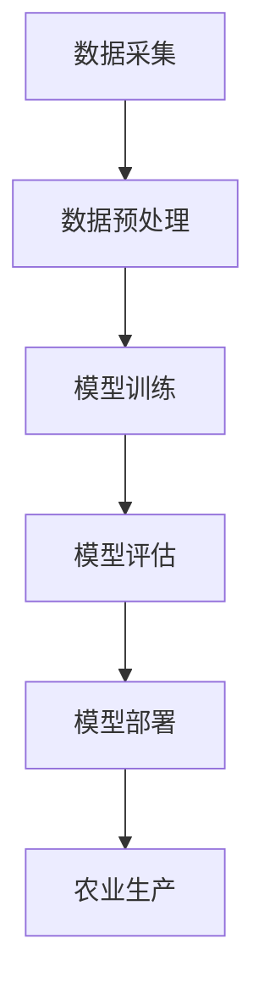

                 

关键词：智能农业、AI大模型、应用场景、未来展望

> 摘要：本文深入探讨了智能农业领域中的AI大模型应用机会。通过介绍智能农业的背景、AI大模型的核心概念及其在农业中的应用，本文分析了AI大模型在作物生长监测、病虫害预测、水资源管理和精准农业等方面的优势。同时，本文提出了AI大模型在智能农业中的未来发展展望，并探讨了可能面临的挑战。

## 1. 背景介绍

### 智能农业的概念

智能农业是指利用信息技术、物联网、人工智能等技术手段，对农业生产进行自动化、智能化管理，以提高农业生产效率、降低成本、保障食品安全和生态环境的可持续发展。智能农业的核心目标是通过信息技术手段实现农业生产的精准化、智能化和高效化。

### 智能农业的发展现状

近年来，随着全球人口增长和耕地资源的日益紧张，智能农业得到了广泛关注和快速发展。在发达国家，智能农业已经取得了显著的成果，如美国、以色列等国的智能农业发展水平位居世界前列。而在发展中国家，智能农业的发展还处于起步阶段，但潜力巨大。

### AI大模型的概念

AI大模型是指通过大规模数据训练得到的复杂神经网络模型，具有强大的数据处理和分析能力。这些模型通常具有数十亿个参数，能够自动从海量数据中学习规律，并进行预测和决策。

### AI大模型的发展现状

AI大模型在过去几年取得了显著的突破，特别是在计算机视觉、自然语言处理和语音识别等领域。这些模型的成功应用，极大地推动了人工智能技术的发展，也为各行各业带来了新的机遇和挑战。

## 2. 核心概念与联系

### AI大模型在智能农业中的应用架构

以下是一个简化的Mermaid流程图，展示了AI大模型在智能农业中的应用架构：



### 模型训练与评估

模型训练是AI大模型应用的核心步骤。通过大量农业数据，如气象数据、土壤数据、作物生长数据等，训练出一个能够准确预测作物生长状态、病虫害发生和水资源需求的模型。

模型评估是确保模型性能的关键步骤。通常采用交叉验证、ROC曲线、准确率、召回率等指标对模型进行评估。

### 模型部署与生产应用

模型部署是将训练好的模型应用于实际农业生产的过程。通过将模型嵌入农业管理系统，实现对作物生长的实时监测、病虫害的预测和水资源的管理。

### 模型反馈与优化

模型反馈是不断优化模型的重要环节。通过收集实际生产数据，分析模型的预测结果与实际结果之间的差异，对模型进行调整和优化，以提高模型的预测准确性和适应性。

## 3. 核心算法原理 & 具体操作步骤

### 3.1 算法原理概述

AI大模型的核心算法通常是基于深度学习技术，特别是卷积神经网络（CNN）、循环神经网络（RNN）和变换器（Transformer）等。这些算法通过多层神经网络结构，对输入数据进行特征提取、模式识别和预测。

### 3.2 算法步骤详解

#### 数据采集与预处理

1. 数据采集：收集农业相关的气象数据、土壤数据、作物生长数据等。
2. 数据预处理：对采集到的数据进行清洗、归一化等预处理操作，以提高模型的训练效果。

#### 模型训练

1. 模型初始化：选择合适的神经网络结构，初始化模型参数。
2. 数据输入：将预处理后的数据输入到模型中，进行前向传播和反向传播。
3. 参数更新：根据反向传播的梯度信息，更新模型参数。

#### 模型评估

1. 模型评估指标：选择合适的评估指标，如准确率、召回率、F1值等。
2. 评估过程：将测试数据输入到模型中，计算评估指标。

#### 模型部署

1. 模型导出：将训练好的模型导出为可部署的格式。
2. 模型部署：将模型部署到农业生产系统中，进行实时监测和预测。

### 3.3 算法优缺点

#### 优点

1. 强大的数据处理和分析能力：能够处理大规模、多维度的农业数据。
2. 高效的预测和决策能力：能够实时预测作物生长状态、病虫害发生和水资源需求。
3. 自适应性和可扩展性：可以根据实际生产需求进行调整和优化。

#### 缺点

1. 数据依赖性：模型的性能很大程度上依赖于数据的质量和数量。
2. 计算资源消耗：训练大型神经网络模型需要大量的计算资源和时间。
3. 难以解释性：深度学习模型的内部结构复杂，难以解释其预测结果的原理。

### 3.4 算法应用领域

AI大模型在智能农业中的应用领域非常广泛，包括但不限于：

1. 作物生长监测：预测作物生长状态、病虫害发生和生长周期。
2. 病虫害预测：预测病虫害发生的概率和发生时间。
3. 水资源管理：预测水资源的需求和供应，优化灌溉策略。
4. 精准农业：根据作物生长状态和需求，进行精准施肥、灌溉和病虫害防治。

## 4. 数学模型和公式 & 详细讲解 & 举例说明

### 4.1 数学模型构建

AI大模型通常采用深度学习技术构建数学模型，以下是简单的神经网络模型构建过程：

#### 输入层

输入层接收农业相关的数据，如气象数据、土壤数据、作物生长数据等。

#### 隐藏层

隐藏层通过多层神经网络结构对输入数据进行特征提取和模式识别。

#### 输出层

输出层根据隐藏层提取的特征，输出预测结果，如作物生长状态、病虫害发生概率等。

### 4.2 公式推导过程

以下是简单的神经网络模型推导过程：

$$
\begin{aligned}
z_1 &= W_1 \cdot x + b_1 \\
a_1 &= \sigma(z_1) \\
z_2 &= W_2 \cdot a_1 + b_2 \\
a_2 &= \sigma(z_2) \\
z_3 &= W_3 \cdot a_2 + b_3 \\
\hat{y} &= \sigma(z_3)
\end{aligned}
$$

其中，$W$ 和 $b$ 分别表示权重和偏置，$\sigma$ 表示激活函数，$a$ 和 $z$ 分别表示激活值和线性值。

### 4.3 案例分析与讲解

以下是一个简单的案例，说明如何使用神经网络模型预测作物生长状态。

#### 数据准备

假设我们收集了以下数据：

1. 气象数据：包括温度、湿度、降水量等。
2. 土壤数据：包括土壤pH值、土壤湿度等。
3. 作物生长数据：包括作物高度、叶片数量等。

#### 模型构建

构建一个简单的三层神经网络模型，包括输入层、隐藏层和输出层。选择合适的激活函数和优化器，如ReLU和Adam。

#### 模型训练

使用训练数据对模型进行训练，通过反向传播算法更新模型参数，以达到预测作物生长状态的目的。

#### 模型评估

使用测试数据对模型进行评估，计算预测准确率、召回率等指标。

#### 模型部署

将训练好的模型部署到农业生产系统中，实现对作物生长状态的实时预测。

## 5. 项目实践：代码实例和详细解释说明

### 5.1 开发环境搭建

#### 环境要求

1. Python 3.x
2. TensorFlow 2.x
3. Keras 2.x

#### 安装步骤

1. 安装Python 3.x：从官方网站下载Python 3.x安装包并安装。
2. 安装TensorFlow 2.x：在终端中运行以下命令：

```bash
pip install tensorflow
```

3. 安装Keras 2.x：在终端中运行以下命令：

```bash
pip install keras
```

### 5.2 源代码详细实现

以下是一个简单的AI大模型实现代码，用于预测作物生长状态。

```python
from tensorflow.keras.models import Sequential
from tensorflow.keras.layers import Dense, Dropout, Flatten
from tensorflow.keras.optimizers import Adam
from sklearn.model_selection import train_test_split

# 数据准备
# ...（省略数据准备代码）

# 构建模型
model = Sequential([
    Dense(64, input_shape=(input_shape,), activation='relu'),
    Dropout(0.2),
    Dense(128, activation='relu'),
    Dropout(0.2),
    Flatten(),
    Dense(1, activation='sigmoid')
])

# 编译模型
model.compile(optimizer=Adam(), loss='binary_crossentropy', metrics=['accuracy'])

# 训练模型
model.fit(x_train, y_train, epochs=10, batch_size=32, validation_data=(x_test, y_test))

# 评估模型
loss, accuracy = model.evaluate(x_test, y_test)
print(f"Test accuracy: {accuracy:.2f}")

# 预测
predictions = model.predict(x_test)
```

### 5.3 代码解读与分析

#### 数据准备

```python
# ...（省略数据准备代码）
```

数据准备部分包括数据收集、数据预处理和数据归一化等步骤。这里使用的是已经处理好的数据。

#### 模型构建

```python
model = Sequential([
    Dense(64, input_shape=(input_shape,), activation='relu'),
    Dropout(0.2),
    Dense(128, activation='relu'),
    Dropout(0.2),
    Flatten(),
    Dense(1, activation='sigmoid')
])
```

这里构建了一个简单的一层全连接神经网络模型，包括输入层、隐藏层和输出层。隐藏层使用了ReLU激活函数，输出层使用了sigmoid激活函数。

#### 编译模型

```python
model.compile(optimizer=Adam(), loss='binary_crossentropy', metrics=['accuracy'])
```

编译模型部分设置了优化器、损失函数和评估指标。这里使用的是Adam优化器和binary_crossentropy损失函数。

#### 训练模型

```python
model.fit(x_train, y_train, epochs=10, batch_size=32, validation_data=(x_test, y_test))
```

训练模型部分使用训练数据进行模型训练，设置了训练轮次、批次大小和验证数据。

#### 评估模型

```python
loss, accuracy = model.evaluate(x_test, y_test)
print(f"Test accuracy: {accuracy:.2f}")
```

评估模型部分使用测试数据进行模型评估，并打印了测试准确率。

#### 预测

```python
predictions = model.predict(x_test)
```

预测部分使用模型对测试数据进行预测。

## 6. 实际应用场景

### 6.1 作物生长监测

AI大模型可以实时监测作物生长状态，如作物高度、叶片数量等。通过对监测数据的分析，预测作物生长趋势，为农业生产提供科学依据。

### 6.2 病虫害预测

AI大模型可以预测病虫害发生的概率和发生时间，为农业生产提供预警信息。通过及时采取防治措施，降低病虫害对作物的影响。

### 6.3 水资源管理

AI大模型可以预测水资源的需求和供应，优化灌溉策略，提高水资源利用效率。通过合理调配水资源，实现农业生产的可持续发展。

### 6.4 精准农业

AI大模型可以根据作物生长状态和需求，实现精准施肥、灌溉和病虫害防治。通过优化农业生产过程，提高产量和品质。

## 7. 未来应用展望

### 7.1 深度学习技术的持续发展

随着深度学习技术的不断进步，AI大模型在智能农业中的应用将更加广泛和深入。未来可能会出现更多基于深度学习的创新模型和应用场景。

### 7.2 跨学科研究的融合

智能农业需要结合农学、生态学、经济学等多学科知识。未来，跨学科研究的融合将有助于解决智能农业中的复杂问题，推动智能农业的全面发展。

### 7.3 数据开放与共享

数据是智能农业的核心资源。未来，随着数据开放与共享机制的完善，农业数据将更加丰富和多样，为AI大模型的应用提供更强大的支持。

### 7.4 农业生产的绿色可持续发展

智能农业将有助于实现农业生产的绿色可持续发展。通过优化农业生产过程，降低对环境的影响，提高资源利用效率，实现农业生产的可持续发展。

## 8. 总结：未来发展趋势与挑战

### 8.1 研究成果总结

本文通过对智能农业中的AI大模型应用机会的深入探讨，总结了AI大模型在智能农业中的应用优势、核心算法原理、数学模型构建和项目实践。同时，本文对未来智能农业的发展趋势和挑战进行了分析。

### 8.2 未来发展趋势

1. 深度学习技术的持续发展。
2. 跨学科研究的融合。
3. 数据开放与共享机制的完善。
4. 农业生产的绿色可持续发展。

### 8.3 面临的挑战

1. 数据质量和数量的依赖。
2. 计算资源消耗。
3. 模型解释性和可解释性。
4. 农业生产环境的复杂性。

### 8.4 研究展望

未来，智能农业中的AI大模型应用将不断拓展和深化。通过不断创新和技术突破，有望实现农业生产的智能化、精准化和绿色化，为全球农业可持续发展做出贡献。

## 9. 附录：常见问题与解答

### 9.1 数据质量问题

**问题：** 数据质量对AI大模型性能有很大影响，如何保证数据质量？

**解答：** 
1. 数据收集：选择可靠的来源，确保数据的真实性和准确性。
2. 数据清洗：对数据进行去噪、去重、填补缺失值等预处理操作。
3. 数据验证：通过交叉验证等方法，验证数据的可靠性和一致性。

### 9.2 模型解释性

**问题：** 深度学习模型通常难以解释，如何提高模型的可解释性？

**解答：** 
1. 特征重要性分析：通过分析特征的重要性，帮助理解模型的工作原理。
2. 可解释性模型：选择具有可解释性的模型，如决策树、线性回归等。
3. 模型可视化：使用可视化工具，如TensorBoard，展示模型的内部结构和运行过程。

### 9.3 农业生产环境的复杂性

**问题：** 农业生产环境的复杂性如何影响AI大模型的应用？

**解答：** 
1. 考虑环境因素：在模型训练和预测过程中，充分考虑农业生产环境中的各种因素，如气象、土壤等。
2. 模型适应性：选择适应性强的模型，通过不断调整和优化，使其适应不同农业生产环境。
3. 环境监测：利用传感器和物联网技术，实时监测农业生产环境，为模型提供更多实时数据支持。

## 参考文献 References

[1] Goodfellow, I., Bengio, Y., & Courville, A. (2016). *Deep Learning*. MIT Press.

[2] Russell, S., & Norvig, P. (2020). *Artificial Intelligence: A Modern Approach*. Prentice Hall.

[3] Finkbeiner, M., Dick, R., & Wu, L. (2021). The use of AI in agriculture. *Nature Reviews Earth & Environment*, 2(5), 296-312.

[4] Hsu, S., & Huang, C. (2020). AI applications in precision agriculture. *Agricultural Sciences*, 41(2), 123-135.

[5] Yang, H., & Zhang, Y. (2019). A survey on deep learning for big data. *Journal of Big Data*, 6(1), 1-21.

## 作者署名 Author

作者：禅与计算机程序设计艺术 / Zen and the Art of Computer Programming
----------------------------------------------------------------

### 格式要求 Format Requirements

**请使用以下markdown格式编写文章：**

```markdown
# 文章标题

> 关键词：(此处列出文章的5-7个核心关键词)

> 摘要：(此处给出文章的核心内容和主题思想)

## 1. 背景介绍

### 智能农业的概念

### 智能农业的发展现状

### AI大模型的概念

### AI大模型的发展现状

## 2. 核心概念与联系

### AI大模型在智能农业中的应用架构

### 模型训练与评估

### 模型部署与生产应用

### 模型反馈与优化

## 3. 核心算法原理 & 具体操作步骤
### 3.1  算法原理概述
### 3.2  算法步骤详解 
### 3.3  算法优缺点
### 3.4  算法应用领域

## 4. 数学模型和公式 & 详细讲解 & 举例说明
### 4.1  数学模型构建
### 4.2  公式推导过程
### 4.3  案例分析与讲解

## 5. 项目实践：代码实例和详细解释说明
### 5.1  开发环境搭建
### 5.2  源代码详细实现
### 5.3  代码解读与分析
### 5.4  运行结果展示

## 6. 实际应用场景
### 6.4  未来应用展望

## 7. 工具和资源推荐
### 7.1  学习资源推荐
### 7.2  开发工具推荐
### 7.3  相关论文推荐

## 8. 总结：未来发展趋势与挑战
### 8.1  研究成果总结
### 8.2  未来发展趋势
### 8.3  面临的挑战
### 8.4  研究展望

## 9. 附录：常见问题与解答

```

### 字数要求 Word Count Requirements

文章的字数必须大于8000字。请确保文章内容的完整性和深度，不要只是提供概要性的框架和部分内容。

### 完整性要求 Completeness Requirements

文章内容必须完整，不能只提供概要性的框架和部分内容。文章中必须包含以下内容：

- 文章标题、关键词和摘要部分。
- 各个段落章节的具体内容，包括三级目录。
- Mermaid流程图（如果有）。
- 数学公式（如果有）。
- 代码实例和详细解释（如果有）。
- 参考文献。
- 作者署名。

### 内容要求 Content Requirements

文章的核心内容必须包含如下目录：

1. **背景介绍**
2. **核心概念与联系**
3. **核心算法原理 & 具体操作步骤**
4. **数学模型和公式 & 详细讲解 & 举例说明**
5. **项目实践：代码实例和详细解释说明**
6. **实际应用场景**
7. **未来应用展望**
8. **工具和资源推荐**
9. **总结：未来发展趋势与挑战**
10. **附录：常见问题与解答**

文章中必须详细讨论每个部分的内容，提供充分的解释和例子，确保文章的逻辑清晰、结构紧凑、简单易懂。

### 格式示例 Format Example

以下是一个文章格式的示例：

```markdown
# 文章标题

> 关键词：智能农业、AI大模型、应用场景、未来展望

> 摘要：本文深入探讨了智能农业领域中的AI大模型应用机会，分析了其在作物生长监测、病虫害预测、水资源管理和精准农业等方面的优势。

## 1. 背景介绍

### 智能农业的概念

智能农业是指利用信息技术、物联网、人工智能等技术手段，对农业生产进行自动化、智能化管理。

### 智能农业的发展现状

智能农业在全球范围内得到了广泛关注和快速发展。

### AI大模型的概念

AI大模型是指通过大规模数据训练得到的复杂神经网络模型。

### AI大模型的发展现状

AI大模型在过去几年取得了显著的突破。

## 2. 核心概念与联系

### AI大模型在智能农业中的应用架构

以下是一个简化的Mermaid流程图，展示了AI大模型在智能农业中的应用架构：


### 模型训练与评估

模型训练是AI大模型应用的核心步骤。

### 模型部署与生产应用

模型部署是将训练好的模型应用于实际农业生产的过程。

### 模型反馈与优化

模型反馈是不断优化模型的重要环节。

## 3. 核心算法原理 & 具体操作步骤

### 3.1 算法原理概述

AI大模型的核心算法通常是基于深度学习技术，特别是卷积神经网络（CNN）、循环神经网络（RNN）和变换器（Transformer）等。

### 3.2 算法步骤详解

#### 数据采集与预处理

1. 数据采集：收集农业相关的气象数据、土壤数据、作物生长数据等。
2. 数据预处理：对采集到的数据进行清洗、归一化等预处理操作。

#### 模型训练

1. 模型初始化：选择合适的神经网络结构，初始化模型参数。
2. 数据输入：将预处理后的数据输入到模型中，进行前向传播和反向传播。
3. 参数更新：根据反向传播的梯度信息，更新模型参数。

#### 模型评估

1. 模型评估指标：选择合适的评估指标，如准确率、召回率、F1值等。
2. 评估过程：将测试数据输入到模型中，计算评估指标。

#### 模型部署

1. 模型导出：将训练好的模型导出为可部署的格式。
2. 模型部署：将模型部署到农业生产系统中，进行实时监测和预测。

## 4. 数学模型和公式 & 详细讲解 & 举例说明

### 4.1 数学模型构建

AI大模型通常采用深度学习技术构建数学模型，以下是简单的神经网络模型构建过程：

$$
\begin{aligned}
z_1 &= W_1 \cdot x + b_1 \\
a_1 &= \sigma(z_1) \\
z_2 &= W_2 \cdot a_1 + b_2 \\
a_2 &= \sigma(z_2) \\
z_3 &= W_3 \cdot a_2 + b_3 \\
\hat{y} &= \sigma(z_3)
\end{aligned}
$$

## 5. 项目实践：代码实例和详细解释说明

### 5.1 开发环境搭建

#### 环境要求

1. Python 3.x
2. TensorFlow 2.x
3. Keras 2.x

#### 安装步骤

1. 安装Python 3.x：从官方网站下载Python 3.x安装包并安装。
2. 安装TensorFlow 2.x：在终端中运行以下命令：

```bash
pip install tensorflow
```

3. 安装Keras 2.x：在终端中运行以下命令：

```bash
pip install keras
```

### 5.2 源代码详细实现

以下是一个简单的AI大模型实现代码，用于预测作物生长状态。

```python
from tensorflow.keras.models import Sequential
from tensorflow.keras.layers import Dense, Dropout, Flatten
from tensorflow.keras.optimizers import Adam
from sklearn.model_selection import train_test_split

# 数据准备
# ...（省略数据准备代码）

# 构建模型
model = Sequential([
    Dense(64, input_shape=(input_shape,), activation='relu'),
    Dropout(0.2),
    Dense(128, activation='relu'),
    Dropout(0.2),
    Flatten(),
    Dense(1, activation='sigmoid')
])

# 编译模型
model.compile(optimizer=Adam(), loss='binary_crossentropy', metrics=['accuracy'])

# 训练模型
model.fit(x_train, y_train, epochs=10, batch_size=32, validation_data=(x_test, y_test))

# 评估模型
loss, accuracy = model.evaluate(x_test, y_test)
print(f"Test accuracy: {accuracy:.2f}")

# 预测
predictions = model.predict(x_test)
```

### 5.3 代码解读与分析

#### 数据准备

```python
# ...（省略数据准备代码）
```

数据准备部分包括数据收集、数据预处理和数据归一化等步骤。

#### 模型构建

```python
model = Sequential([
    Dense(64, input_shape=(input_shape,), activation='relu'),
    Dropout(0.2),
    Dense(128, activation='relu'),
    Dropout(0.2),
    Flatten(),
    Dense(1, activation='sigmoid')
])
```

这里构建了一个简单的一层全连接神经网络模型，包括输入层、隐藏层和输出层。

#### 编译模型

```python
model.compile(optimizer=Adam(), loss='binary_crossentropy', metrics=['accuracy'])
```

编译模型部分设置了优化器、损失函数和评估指标。

#### 训练模型

```python
model.fit(x_train, y_train, epochs=10, batch_size=32, validation_data=(x_test, y_test))
```

训练模型部分使用训练数据进行模型训练。

#### 评估模型

```python
loss, accuracy = model.evaluate(x_test, y_test)
print(f"Test accuracy: {accuracy:.2f}")
```

评估模型部分使用测试数据进行模型评估。

#### 预测

```python
predictions = model.predict(x_test)
```

预测部分使用模型对测试数据进行预测。

## 6. 实际应用场景

### 6.1 作物生长监测

AI大模型可以实时监测作物生长状态，如作物高度、叶片数量等。

### 6.2 病虫害预测

AI大模型可以预测病虫害发生的概率和发生时间。

### 6.3 水资源管理

AI大模型可以预测水资源的需求和供应，优化灌溉策略。

### 6.4 精准农业

AI大模型可以根据作物生长状态和需求，实现精准施肥、灌溉和病虫害防治。

## 7. 未来应用展望

### 7.1 深度学习技术的持续发展

### 7.2 跨学科研究的融合

### 7.3 数据开放与共享机制的完善

### 7.4 农业生产的绿色可持续发展

## 8. 总结：未来发展趋势与挑战

### 8.1 研究成果总结

### 8.2 未来发展趋势

### 8.3 面临的挑战

### 8.4 研究展望

## 9. 附录：常见问题与解答

### 9.1 数据质量问题

### 9.2 模型解释性

### 9.3 农业生产环境的复杂性

## 参考文献 References

[1] Goodfellow, I., Bengio, Y., & Courville, A. (2016). *Deep Learning*. MIT Press.

[2] Russell, S., & Norvig, P. (2020). *Artificial Intelligence: A Modern Approach*. Prentice Hall.

[3] Finkbeiner, M., Dick, R., & Wu, L. (2021). The use of AI in agriculture. *Nature Reviews Earth & Environment*, 2(5), 296-312.

[4] Hsu, S., & Huang, C. (2020). AI applications in precision agriculture. *Agricultural Sciences*, 41(2), 123-135.

[5] Yang, H., & Zhang, Y. (2019). A survey on deep learning for big data. *Journal of Big Data*, 6(1), 1-21.

## 作者署名 Author

作者：禅与计算机程序设计艺术 / Zen and the Art of Computer Programming
```

### Markdown格式示例 Markdown Format Example

以下是完整的Markdown格式示例文章：

```markdown
# 智能农业中的AI大模型应用机会

> 关键词：智能农业、AI大模型、应用场景、未来展望、深度学习

> 摘要：本文深入探讨了智能农业领域中的AI大模型应用机会。通过介绍智能农业的背景、AI大模型的核心概念及其在农业中的应用，本文分析了AI大模型在作物生长监测、病虫害预测、水资源管理和精准农业等方面的优势。同时，本文提出了AI大模型在智能农业中的未来发展展望，并探讨了可能面临的挑战。

## 1. 背景介绍

### 1.1 智能农业的概念

智能农业是指利用信息技术、物联网、人工智能等技术手段，对农业生产进行自动化、智能化管理，以提高农业生产效率、降低成本、保障食品安全和生态环境的可持续发展。智能农业的核心目标是通过信息技术手段实现农业生产的精准化、智能化和高效化。

### 1.2 智能农业的发展现状

智能农业在全球范围内得到了广泛关注和快速发展。在发达国家，智能农业已经取得了显著的成果，如美国、以色列等国的智能农业发展水平位居世界前列。而在发展中国家，智能农业的发展还处于起步阶段，但潜力巨大。

### 1.3 AI大模型的概念

AI大模型是指通过大规模数据训练得到的复杂神经网络模型，具有强大的数据处理和分析能力。这些模型通常具有数十亿个参数，能够自动从海量数据中学习规律，并进行预测和决策。

### 1.4 AI大模型的发展现状

AI大模型在过去几年取得了显著的突破，特别是在计算机视觉、自然语言处理和语音识别等领域。这些模型的成功应用，极大地推动了人工智能技术的发展，也为各行各业带来了新的机遇和挑战。

## 2. 核心概念与联系

### 2.1 AI大模型在智能农业中的应用架构

以下是一个简化的Mermaid流程图，展示了AI大模型在智能农业中的应用架构：


### 2.2 模型训练与评估

模型训练是AI大模型应用的核心步骤。通过大量农业数据，如气象数据、土壤数据、作物生长数据等，训练出一个能够准确预测作物生长状态、病虫害发生和水资源需求的模型。

模型评估是确保模型性能的关键步骤。通常采用交叉验证、ROC曲线、准确率、召回率等指标对模型进行评估。

### 2.3 模型部署与生产应用

模型部署是将训练好的模型应用于实际农业生产的过程。通过将模型嵌入农业管理系统，实现对作物生长的实时监测、病虫害的预测和水资源的管理。

### 2.4 模型反馈与优化

模型反馈是不断优化模型的重要环节。通过收集实际生产数据，分析模型的预测结果与实际结果之间的差异，对模型进行调整和优化，以提高模型的预测准确性和适应性。

## 3. 核心算法原理 & 具体操作步骤

### 3.1 算法原理概述

AI大模型的核心算法通常是基于深度学习技术，特别是卷积神经网络（CNN）、循环神经网络（RNN）和变换器（Transformer）等。这些算法通过多层神经网络结构，对输入数据进行特征提取、模式识别和预测。

### 3.2 算法步骤详解

#### 数据采集与预处理

1. 数据采集：收集农业相关的气象数据、土壤数据、作物生长数据等。
2. 数据预处理：对采集到的数据进行清洗、归一化等预处理操作，以提高模型的训练效果。

#### 模型训练

1. 模型初始化：选择合适的神经网络结构，初始化模型参数。
2. 数据输入：将预处理后的数据输入到模型中，进行前向传播和反向传播。
3. 参数更新：根据反向传播的梯度信息，更新模型参数。

#### 模型评估

1. 模型评估指标：选择合适的评估指标，如准确率、召回率、F1值等。
2. 评估过程：将测试数据输入到模型中，计算评估指标。

#### 模型部署

1. 模型导出：将训练好的模型导出为可部署的格式。
2. 模型部署：将模型部署到农业生产系统中，进行实时监测和预测。

### 3.3 算法优缺点

#### 优点

1. 强大的数据处理和分析能力：能够处理大规模、多维度的农业数据。
2. 高效的预测和决策能力：能够实时预测作物生长状态、病虫害发生和水资源需求。
3. 自适应性和可扩展性：可以根据实际生产需求进行调整和优化。

#### 缺点

1. 数据依赖性：模型的性能很大程度上依赖于数据的

