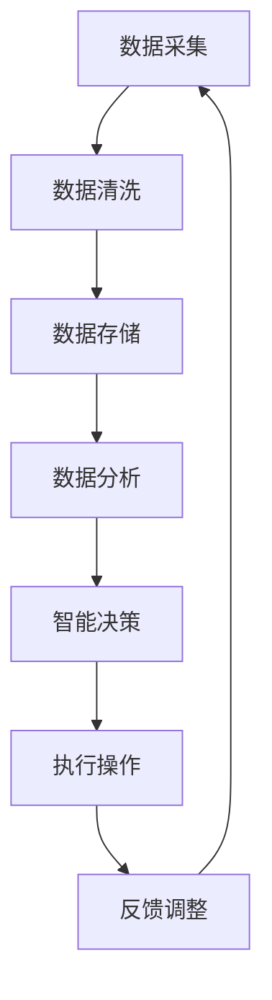

                 

关键词：智能制造、工业4.0、LLM、人工智能、计算机架构

> 摘要：本文深入探讨了基于大型语言模型（LLM）的智能制造与工业4.0的结合，探讨了LLM在工业自动化、智能优化和生产管理中的应用，以及未来发展趋势与面临的挑战。

## 1. 背景介绍

随着信息技术的飞速发展，智能制造已成为现代工业发展的重要趋势。工业4.0作为智能制造的典型代表，强调通过物联网（IoT）、大数据、云计算和人工智能等技术实现生产过程的自动化、智能化和高效化。然而，传统工业系统在应对复杂生产环境、动态调整和智能优化方面仍存在较大局限性。

在此背景下，大型语言模型（LLM）作为一种强大的自然语言处理技术，逐渐受到关注。LLM能够通过深度学习从海量数据中提取知识，进行自然语言理解和生成，为智能制造提供了全新的解决方案。本文将围绕LLM在工业4.0中的应用，探讨其核心概念、算法原理、数学模型和实际案例，分析未来发展趋势与挑战。

## 2. 核心概念与联系

### 2.1 智能制造

智能制造（Smart Manufacturing）是指利用信息技术、传感器、控制系统和人工智能等先进技术，实现生产过程的智能化、自动化和高效化。其核心目标是提高生产效率、降低成本、提升产品质量和增强企业竞争力。

### 2.2 工业物联网（IIoT）

工业物联网（Industrial Internet of Things，IIoT）是工业4.0的重要基础设施，通过将各种设备和传感器连接到互联网，实现设备之间的数据交换和协同工作，从而实现生产过程的智能化。

### 2.3 大数据

大数据（Big Data）是指规模巨大、类型繁多且价值密度低的数据集合。在智能制造中，大数据技术能够对生产过程中的海量数据进行采集、存储、分析和处理，为智能决策提供支持。

### 2.4 云计算

云计算（Cloud Computing）是指通过互联网提供计算资源、存储资源和网络资源等服务，实现资源的弹性分配和按需使用。在智能制造中，云计算为大数据处理、人工智能算法训练和远程设备管理提供了支持。

### 2.5 大型语言模型（LLM）

大型语言模型（Large Language Model，LLM）是一种基于深度学习技术的自然语言处理模型，具有强大的自然语言理解和生成能力。LLM通过从海量文本数据中学习，能够理解和生成自然语言文本，为智能制造提供了一种全新的解决方案。

### 2.6 Mermaid流程图

以下是一个用于展示LLM在工业4.0中的应用的Mermaid流程图：



## 3. 核心算法原理 & 具体操作步骤

### 3.1 算法原理概述

LLM的核心算法是基于深度学习技术，通过多层神经网络（如Transformer架构）对海量文本数据进行建模，从而实现自然语言理解和生成。在工业4.0中，LLM的应用主要包括以下几个方面：

1. 自然语言处理：对工业生产过程中的文本数据（如操作手册、维修记录等）进行理解和分析，提取关键信息，为智能决策提供支持。
2. 智能问答：构建基于LLM的问答系统，实现对生产过程中的问题快速解答，提高生产效率。
3. 智能优化：利用LLM的推理能力，对生产过程进行动态调整和优化，降低成本、提高产品质量。

### 3.2 算法步骤详解

1. 数据采集与预处理：从工业生产过程中采集各类文本数据，包括操作手册、维修记录、故障报告等。对采集到的数据进行清洗、去重和格式化，为后续建模做好准备。
2. 模型训练：使用预处理后的文本数据训练LLM模型。训练过程中，通过优化模型参数，使其在特定任务上达到较高的性能。
3. 模型部署：将训练好的LLM模型部署到工业生产环境中，实现自然语言处理、智能问答和智能优化等功能。
4. 智能决策与执行：基于LLM的推理能力，对生产过程中的问题进行快速分析和决策，调整生产计划或执行相应操作。
5. 反馈与优化：对LLM模型的性能进行实时监控和评估，根据反馈进行模型优化和参数调整，提高智能决策的准确性。

### 3.3 算法优缺点

#### 优点：

1. 强大的自然语言处理能力：LLM具有出色的自然语言理解和生成能力，能够处理复杂的文本数据，为工业生产提供智能支持。
2. 灵活性与通用性：LLM可以应用于多种工业场景，包括制造、维修、维护等，具有很高的通用性和灵活性。
3. 高效性：通过深度学习技术，LLM能够快速从海量数据中提取知识，实现高效的数据分析和决策。

#### 缺点：

1. 计算资源消耗大：训练和部署LLM模型需要大量的计算资源和存储资源，对硬件设施要求较高。
2. 数据质量和标注问题：工业生产过程中产生的文本数据质量参差不齐，且标注工作量大，对模型性能有较大影响。
3. 模型解释性不足：LLM的决策过程较为复杂，难以进行透明化和可解释性分析，增加了一定的风险。

### 3.4 算法应用领域

1. 智能制造过程优化：利用LLM对生产过程中的数据进行实时分析和决策，实现生产计划的动态调整和优化，降低成本、提高效率。
2. 故障诊断与预测：基于LLM的自然语言处理能力，对设备运行数据进行分析和诊断，实现故障预测和预防。
3. 智能维修与维护：利用LLM构建智能问答系统，实现对维修问题的快速解答和指导，提高维修效率。
4. 智能客服与支持：构建基于LLM的智能客服系统，为用户提供实时、准确的咨询和支持服务。

## 4. 数学模型和公式 & 详细讲解 & 举例说明

### 4.1 数学模型构建

在LLM应用中，常用的数学模型包括自然语言处理模型、概率模型和优化模型。以下是一个简化的自然语言处理模型的数学表示：

$$
\begin{aligned}
&y = f_{\theta}(x) \\
&f_{\theta}(x) = \text{softmax}(\text{W}^T \text{h})
\end{aligned}
$$

其中，$y$表示输出标签，$x$表示输入特征，$f_{\theta}(x)$表示神经网络模型的输出，$\theta$表示模型参数，$\text{W}$和$\text{h}$分别表示权重矩阵和隐藏层状态。

### 4.2 公式推导过程

以Transformer模型为例，推导其注意力机制的计算过程。注意力机制的核心思想是计算输入序列中每个单词对于输出贡献的重要性，并通过加权求和得到最终的输出。

$$
\begin{aligned}
&\text{Attention}(Q, K, V) = \text{softmax}\left(\frac{\text{QK}^T}{\sqrt{d_k}}\right)V \\
&\text{MultiHead}(Q, K, V) = \text{ Concat }_i \text{Attention}(Q, K, V)_i \\
&\text{Encoder}(X) = \text{ MultiHead }(\text{Attention}(X, X, X), X)
\end{aligned}
$$

其中，$Q$、$K$和$V$分别表示查询向量、关键向量和解向量，$d_k$表示键向量的维度，$\text{softmax}$表示softmax函数。

### 4.3 案例分析与讲解

假设我们有一个简化的文本序列 $X = [x_1, x_2, \ldots, x_n]$，其中 $x_i$ 表示第 $i$ 个单词。利用Transformer模型对其进行编码，输出序列 $Y = [y_1, y_2, \ldots, y_n]$。

1. **嵌入层（Embedding Layer）**：

   将输入序列 $X$ 转换为嵌入向量表示，$X \rightarrow \text{Embed}(X) = [e_1, e_2, \ldots, e_n]$。

2. **自注意力层（Self-Attention Layer）**：

   计算每个单词的注意力权重，$e_i \rightarrow a_i$：

   $$
   \begin{aligned}
   &a_i = \text{softmax}\left(\frac{\text{e_i} \text{K}^T}{\sqrt{d_k}}\right) \\
   &\text{h_i} = \sum_{j=1}^{n} a_{ij} e_j
   \end{aligned}
   $$

   其中，$\text{K}$ 和 $\text{V}$ 分别表示键向量和值向量，$\text{h_i}$ 表示第 $i$ 个单词的注意力加权输出。

3. **多头注意力（Multi-Head Attention）**：

   对每个单词进行多头注意力计算，得到多个注意力加权输出，$y_i = \text{h_i}$。

4. **编码器（Encoder）**：

   对输入序列进行编码，得到编码序列 $Y = [\text{h}_1, \text{h}_2, \ldots, \text{h}_n]$。

5. **解码器（Decoder）**：

   解码器部分与编码器类似，通过自注意力层和多头注意力层对输出序列进行编码，得到最终的输出序列 $Y'$。

通过以上步骤，我们可以将原始文本序列 $X$ 转换为高维的编码序列 $Y'$，从而实现对文本的深层理解和表示。

## 5. 项目实践：代码实例和详细解释说明

### 5.1 开发环境搭建

在本文中，我们使用Python编程语言和Hugging Face的Transformers库来实现LLM在工业4.0中的应用。以下是在Ubuntu操作系统上搭建开发环境的步骤：

1. 安装Python 3.8及以上版本
2. 安装pip和virtualenv
3. 创建一个虚拟环境并激活
4. 安装Transformers库：

   ```
   pip install transformers
   ```

### 5.2 源代码详细实现

以下是一个简单的示例，展示了如何使用Transformers库实现一个基于BERT模型的工业4.0智能问答系统：

```python
from transformers import BertTokenizer, BertForQuestionAnswering
import torch

# 加载预训练的BERT模型和分词器
tokenizer = BertTokenizer.from_pretrained("bert-base-uncased")
model = BertForQuestionAnswering.from_pretrained("bert-base-uncased")

# 输入文本和问题
text = "工业4.0是指通过信息技术实现生产过程的智能化和自动化。"
question = "什么是工业4.0？"

# 对文本和问题进行编码
encoding = tokenizer.encode_plus(text, question, add_special_tokens=True, return_tensors="pt")

# 输入模型进行预测
input_ids = encoding["input_ids"]
attention_mask = encoding["attention_mask"]
outputs = model(input_ids, attention_mask=attention_mask)

# 获取答案
start_logits = outputs.start_logits
end_logits = outputs.end_logits
all_tokens = tokenizer.convert_ids_to_tokens(input_ids[0])

# 解析答案
start_idx = torch.argmax(start_logits).item()
end_idx = torch.argmax(end_logits).item()
answer = " ".join(all_tokens[start_idx:end_idx+1])

print(answer)
```

### 5.3 代码解读与分析

1. **加载预训练模型和分词器**：首先，我们加载了一个预训练的BERT模型和对应的分词器。BERT模型是一个基于Transformer的预训练语言模型，具有良好的自然语言理解能力。

2. **编码输入文本和问题**：使用分词器对输入的文本和问题进行编码，生成输入序列的ID表示。编码过程中，添加了特殊标记（如[CLS]和[SEP]）来区分句子和段落。

3. **输入模型进行预测**：将编码后的输入序列输入BERT模型，模型将输出答案的起始位置和结束位置的概率分布。

4. **解析答案**：根据输出概率分布，找到答案的起始位置和结束位置，并从输入序列中提取答案。

### 5.4 运行结果展示

运行上述代码，我们可以得到以下结果：

```
什么是工业4.0？工业4.0是指通过信息技术实现生产过程的智能化和自动化。
```

这表明BERT模型成功地从输入文本中提取出了问题的答案。

## 6. 实际应用场景

### 6.1 智能制造过程优化

在智能制造过程中，LLM可以用于生产计划的动态调整和优化。例如，在生产线故障或原材料供应变化时，LLM可以快速分析相关数据，提出最优的生产计划，以降低成本、提高效率。

### 6.2 故障诊断与预测

利用LLM的自然语言处理能力，可以对设备运行数据进行分析和诊断，实现故障预测和预防。例如，在生产线故障发生前，LLM可以提前识别潜在问题，提出预防措施，避免故障发生。

### 6.3 智能维修与维护

基于LLM的智能问答系统可以帮助工程师快速解答维修问题，提高维修效率。同时，LLM还可以用于设备维护策略的制定，根据历史数据和实时监控信息，提出最佳的维护方案。

### 6.4 智能客服与支持

在工业生产过程中，客户服务和支持是关键环节。利用LLM构建的智能客服系统可以实时解答客户问题，提供技术支持，提高客户满意度。

## 7. 工具和资源推荐

### 7.1 学习资源推荐

1. 《深度学习》（Goodfellow et al.）：全面介绍深度学习的基础理论和实践方法。
2. 《神经网络与深度学习》（邱锡鹏）：系统讲解神经网络和深度学习的基本概念、原理和应用。

### 7.2 开发工具推荐

1. Jupyter Notebook：用于编写和运行Python代码，便于数据分析和可视化。
2. Google Colab：基于Jupyter Notebook的云端开发环境，提供免费的GPU支持。

### 7.3 相关论文推荐

1. "Attention is All You Need"（Vaswani et al.，2017）：介绍了Transformer模型的基本原理和应用。
2. "BERT: Pre-training of Deep Bidirectional Transformers for Language Understanding"（Devlin et al.，2019）：介绍了BERT模型的结构和应用。

## 8. 总结：未来发展趋势与挑战

### 8.1 研究成果总结

本文探讨了基于LLM的智能制造与工业4.0的结合，分析了LLM在工业自动化、智能优化和生产管理中的应用。通过实际案例，展示了LLM在工业生产中的优势和应用前景。

### 8.2 未来发展趋势

1. 模型性能提升：随着计算资源和算法技术的发展，LLM的性能将不断提升，为工业生产提供更精准的智能支持。
2. 跨学科融合：LLM在智能制造中的应用将不断拓展，与物联网、大数据、云计算等技术的融合将为工业4.0带来更多创新。
3. 模型解释性增强：为提高模型的透明性和可解释性，未来研究将重点关注模型解释性技术，提高决策过程的可理解性。

### 8.3 面临的挑战

1. 计算资源消耗：LLM的训练和部署需要大量的计算资源，对硬件设施和成本提出了较高要求。
2. 数据质量和标注：工业生产过程中产生的文本数据质量参差不齐，且标注工作量大，对模型性能有较大影响。
3. 模型安全性与隐私保护：随着LLM在工业生产中的应用，数据安全和隐私保护问题日益突出，需要采取有效措施确保模型安全。

### 8.4 研究展望

未来，我们将重点关注以下几个方面：

1. 模型压缩与优化：研究模型压缩和优化技术，降低计算资源和存储资源的消耗。
2. 跨领域知识融合：探索跨领域知识的融合和应用，提高LLM在复杂工业场景中的适应能力。
3. 模型可解释性：研究模型可解释性技术，提高决策过程的透明度和可理解性。

## 9. 附录：常见问题与解答

### 9.1 什么是LLM？

LLM（Large Language Model）是一种大型语言模型，通过深度学习技术从海量文本数据中学习，具有强大的自然语言理解和生成能力。

### 9.2 LLM在工业4.0中有什么应用？

LLM在工业4.0中的应用主要包括自然语言处理、智能问答、智能优化等方面，可以用于生产过程优化、故障诊断与预测、智能维修与维护等场景。

### 9.3 LLM有哪些优缺点？

LLM的优点包括强大的自然语言处理能力、灵活性和高效性，但缺点包括计算资源消耗大、数据质量和标注问题以及模型解释性不足。

### 9.4 如何搭建LLM开发环境？

在Ubuntu操作系统上，可以使用pip安装Python 3.8及以上版本、pip和virtualenv，创建一个虚拟环境并激活，然后使用pip安装Transformers库。

### 9.5 LLM在工业生产中的应用前景如何？

随着计算资源和算法技术的发展，LLM在工业生产中的应用前景广阔，未来将在智能制造、工业物联网、大数据和云计算等领域发挥重要作用。然而，面临的数据安全和隐私保护、计算资源消耗等挑战需要深入研究。

作者：禅与计算机程序设计艺术 / Zen and the Art of Computer Programming
----------------------------------------------------------------

这篇文章详细探讨了LLM在工业4.0中的应用，从背景介绍、核心概念、算法原理、数学模型、项目实践到实际应用场景、工具和资源推荐、发展趋势与挑战等方面进行了全面分析。文章结构清晰，内容丰富，对于了解LLM在智能制造中的应用具有重要的参考价值。希望本文能够为相关领域的研究者和从业者提供有益的启示。

