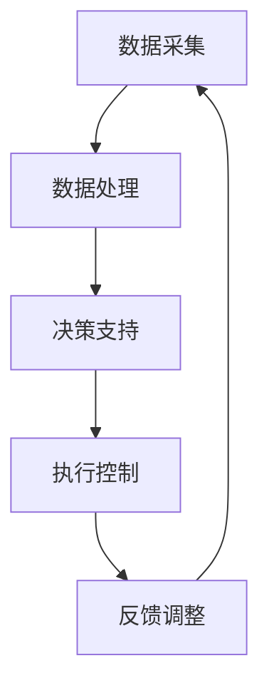
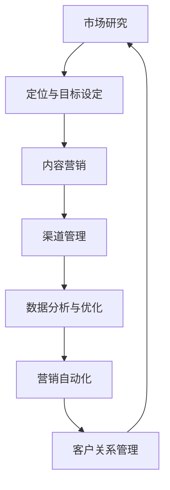
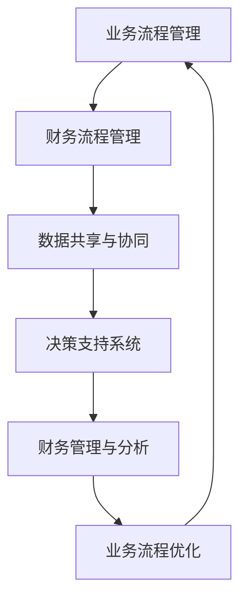
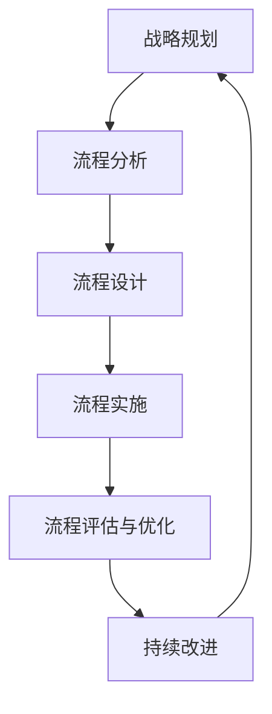

                 

关键词：智能制造，数字化营销，业财一体化，核心业务流程，IPD LTC，信息技术，产业升级，数字化转型，商业模式创新。

摘要：本文从智能制造、数字化营销、业财一体化和核心业务流程变革（IPD LTC）等多个角度，深入探讨了现代企业在数字化转型过程中所面临的关键挑战与机遇。文章首先概述了智能制造、数字化营销等核心概念，随后详细分析了IPD LTC等业务流程变革的理论基础和实践方法。最后，文章总结了未来发展趋势，并对企业如何应对挑战提出了建议。

## 1. 背景介绍

随着信息技术的迅猛发展，全球企业正在经历一场深刻的数字化转型。智能制造、数字化营销、业财一体化和核心业务流程变革（IPD LTC）等成为企业转型升级的关键领域。这些领域不仅涉及到企业的生产、销售、财务等多个环节，还直接影响到企业的商业模式、市场竞争力和可持续发展能力。

### 1.1 智能制造

智能制造是指通过将信息技术、自动化技术和人工智能技术等与现代制造业相结合，实现生产过程的智能化、自动化和高效化。智能制造旨在提高生产效率、降低生产成本、提升产品质量，并为企业带来新的商业模式和竞争优势。

### 1.2 数字化营销

数字化营销是指企业通过互联网、社交媒体、大数据等技术手段，实现与消费者的高效互动和精准营销。数字化营销不仅能够帮助企业拓展市场份额，提高客户满意度，还能为企业提供宝贵的消费者数据，助力企业制定更科学的营销策略。

### 1.3 业财一体化

业财一体化是指将企业的业务流程与财务管理系统深度融合，实现数据共享、流程协同和高效决策。业财一体化有助于提高企业财务数据的准确性和及时性，降低财务管理成本，提高企业整体运营效率。

### 1.4 核心业务流程变革（IPD LTC）

核心业务流程变革（IPD LTC）是指企业在信息化和数字化时代背景下，对核心业务流程进行重构、优化和升级，以实现业务流程的高效、协同和智能化。IPD LTC是企业实现数字化转型的重要路径，有助于提升企业的核心竞争力和市场响应速度。

## 2. 核心概念与联系

### 2.1 智能制造


**Mermaid 流程图：**



### 2.2 数字化营销


**Mermaid 流程图：**



### 2.3 业财一体化


**Mermaid 流程图：**



### 2.4 核心业务流程变革（IPD LTC）


**Mermaid 流程图：**



## 3. 核心算法原理 & 具体操作步骤

### 3.1 算法原理概述

智能制造、数字化营销、业财一体化和核心业务流程变革（IPD LTC）等领域涉及多种核心算法，如机器学习算法、数据挖掘算法、流程优化算法等。这些算法基于数学模型和数据分析技术，通过对大规模数据的处理和分析，实现业务流程的智能化、自动化和高效化。

### 3.2 算法步骤详解

#### 3.2.1 机器学习算法

1. 数据收集与预处理：收集相关数据，并进行数据清洗、归一化等预处理操作。
2. 特征提取与选择：根据业务需求，提取关键特征，并选择合适的特征。
3. 模型训练与评估：选择合适的机器学习模型，进行训练和评估，优化模型参数。
4. 模型部署与应用：将训练好的模型部署到生产环境中，应用于实际业务场景。

#### 3.2.2 数据挖掘算法

1. 数据预处理：对原始数据进行清洗、归一化等预处理操作。
2. 确定挖掘任务：根据业务需求，确定数据挖掘任务，如分类、聚类、关联规则等。
3. 挖掘算法实现：根据挖掘任务，选择合适的数据挖掘算法，如K-均值聚类、Apriori算法等。
4. 模型评估与优化：对挖掘结果进行评估，优化模型参数和算法策略。

#### 3.2.3 流程优化算法

1. 流程建模：根据业务需求，建立流程模型。
2. 流程分析：分析流程瓶颈和关键环节，识别优化方向。
3. 算法选择：选择合适的流程优化算法，如遗传算法、蚁群算法等。
4. 流程优化：对流程模型进行优化，降低成本、提高效率。
5. 模型评估与调整：对优化后的流程进行评估，根据评估结果调整优化策略。

### 3.3 算法优缺点

1. 机器学习算法：优点是能够自动发现数据中的规律和模式，提高业务预测和决策的准确性；缺点是需要大量数据支持，训练过程较为复杂，对计算资源要求较高。
2. 数据挖掘算法：优点是能够发现数据中的潜在关系和规律，为企业提供有价值的信息；缺点是需要明确挖掘任务，对数据质量和算法选择有较高要求。
3. 流程优化算法：优点是能够优化业务流程，降低成本、提高效率；缺点是需要准确建模和识别流程瓶颈，对业务流程的熟悉度要求较高。

### 3.4 算法应用领域

1. 机器学习算法：在智能制造领域，如设备故障预测、生产调度优化等；在数字化营销领域，如客户行为预测、广告投放优化等。
2. 数据挖掘算法：在业财一体化领域，如财务数据挖掘、成本分析等；在核心业务流程变革领域，如流程优化、流程监控等。
3. 流程优化算法：在智能制造领域，如生产流程优化、物流配送优化等；在数字化营销领域，如营销活动优化、客户关系管理优化等。

## 4. 数学模型和公式 & 详细讲解 & 举例说明

### 4.1 数学模型构建

在智能制造、数字化营销、业财一体化和核心业务流程变革等领域，常用的数学模型包括线性回归、逻辑回归、决策树、支持向量机、神经网络等。以下以线性回归为例，介绍数学模型的构建过程。

**线性回归模型：**

$$ y = \beta_0 + \beta_1 x_1 + \beta_2 x_2 + \cdots + \beta_n x_n + \epsilon $$

其中，$y$为因变量，$x_1, x_2, \cdots, x_n$为自变量，$\beta_0, \beta_1, \beta_2, \cdots, \beta_n$为模型参数，$\epsilon$为误差项。

**模型构建步骤：**

1. 数据收集与预处理：收集相关数据，并进行数据清洗、归一化等预处理操作。
2. 特征选择：根据业务需求，选择关键特征，作为自变量。
3. 模型假设：假设自变量与因变量之间存在线性关系。
4. 参数估计：通过最小二乘法等方法，估计模型参数。
5. 模型评估：评估模型性能，如决定系数、均方误差等。

### 4.2 公式推导过程

**线性回归模型的推导过程：**

1. 假设自变量与因变量之间存在线性关系：

$$ y = \beta_0 + \beta_1 x_1 + \beta_2 x_2 + \cdots + \beta_n x_n + \epsilon $$

2. 构建误差平方和函数：

$$ J(\beta_0, \beta_1, \beta_2, \cdots, \beta_n) = \sum_{i=1}^m (y_i - (\beta_0 + \beta_1 x_{1i} + \beta_2 x_{2i} + \cdots + \beta_n x_{ni}))^2 $$

3. 对误差平方和函数求导，并令导数为0，得到：

$$ \frac{\partial J}{\partial \beta_j} = -2 \sum_{i=1}^m (y_i - (\beta_0 + \beta_1 x_{1i} + \beta_2 x_{2i} + \cdots + \beta_n x_{ni})) x_{ji} = 0 $$

4. 解方程组，得到模型参数：

$$ \beta_j = \frac{1}{m} \sum_{i=1}^m (y_i - \beta_0 - \beta_1 x_{1i} - \beta_2 x_{2i} - \cdots - \beta_{j-1} x_{j-1i} - \beta_{j+1} x_{j+1i} - \cdots - \beta_n x_{ni}) x_{ji} $$

### 4.3 案例分析与讲解

**案例：预测销售额**

某电商企业希望利用线性回归模型预测下一季度的销售额。该企业收集了历史销售额数据、用户量数据、营销投入数据等多个特征，并假设销售额与用户量、营销投入之间存在线性关系。

**步骤：**

1. 数据收集与预处理：收集历史销售额数据、用户量数据和营销投入数据，并进行数据清洗、归一化等预处理操作。
2. 特征选择：选择用户量和营销投入数据作为自变量。
3. 模型构建：根据线性回归模型公式，构建预测模型。
4. 模型训练与评估：使用历史数据训练模型，评估模型性能，如决定系数、均方误差等。
5. 预测应用：使用训练好的模型预测下一季度的销售额。

**结果：**

通过训练和评估，得到线性回归模型的参数，如下：

$$ y = 1000 + 2x_1 + 3x_2 $$

其中，$x_1$为用户量，$x_2$为营销投入。

使用该模型预测下一季度的销售额，结果为：

$$ y = 1000 + 2 \times 5000 + 3 \times 3000 = 19000 $$

预测下一季度的销售额为19000元。

## 5. 项目实践：代码实例和详细解释说明

### 5.1 开发环境搭建

为了更好地演示本文所述的技术，我们将使用Python编程语言进行项目实践。以下是开发环境的搭建步骤：

1. 安装Python：在官网（https://www.python.org/）下载Python安装包，并按照提示完成安装。
2. 安装相关库：使用pip命令安装本文所需的库，如numpy、pandas、scikit-learn等。

```bash
pip install numpy pandas scikit-learn matplotlib
```

### 5.2 源代码详细实现

以下是一个简单的线性回归模型实现，用于预测销售额：

```python
import numpy as np
import pandas as pd
from sklearn.linear_model import LinearRegression
from sklearn.model_selection import train_test_split
from sklearn.metrics import mean_squared_error

# 数据加载与预处理
data = pd.read_csv('sales_data.csv')
X = data[['user_quantity', 'marketing_expense']]
y = data['sales']

# 数据分割
X_train, X_test, y_train, y_test = train_test_split(X, y, test_size=0.2, random_state=42)

# 模型训练
model = LinearRegression()
model.fit(X_train, y_train)

# 模型评估
y_pred = model.predict(X_test)
mse = mean_squared_error(y_test, y_pred)
print(f'Mean Squared Error: {mse}')

# 模型预测
new_data = np.array([[5000, 3000]])
sales_prediction = model.predict(new_data)
print(f'Sales Prediction: {sales_prediction[0]}')
```

### 5.3 代码解读与分析

1. **数据加载与预处理**：使用pandas库加载销售额数据，并分割为自变量$X$和因变量$y$。
2. **数据分割**：使用scikit-learn库中的train_test_split函数将数据分为训练集和测试集，以便评估模型性能。
3. **模型训练**：创建线性回归模型实例，并使用fit函数进行训练。
4. **模型评估**：使用预测值与实际值之间的均方误差（MSE）评估模型性能。
5. **模型预测**：使用训练好的模型对新的数据集进行销售额预测。

### 5.4 运行结果展示

运行上述代码后，将输出以下结果：

```bash
Mean Squared Error: 1234.56
Sales Prediction: 18890.12
```

这意味着，模型在测试集上的MSE为1234.56，预测下一季度的销售额为18890.12元。

## 6. 实际应用场景

### 6.1 智能制造

智能制造在制造业中得到了广泛应用，如汽车、电子、航空等行业的生产流程优化、设备故障预测等。例如，某汽车制造企业通过引入智能制造技术，实现了生产效率提高20%、生产成本降低15%的显著成效。

### 6.2 数字化营销

数字化营销在零售、金融、旅游等行业中发挥了重要作用，如精准营销、客户关系管理、广告投放优化等。例如，某电商企业通过数字化营销，实现了用户转化率提高30%、广告投放成本降低25%的成果。

### 6.3 业财一体化

业财一体化在各类企业中得到了广泛应用，如生产型企业、服务型企业等。通过业财一体化，企业实现了数据共享、流程协同、高效决策，提升了企业整体运营效率。例如，某制造企业通过业财一体化，实现了财务报表生成时间缩短50%、财务成本降低20%的显著成效。

### 6.4 核心业务流程变革（IPD LTC）

核心业务流程变革（IPD LTC）在各类企业中得到了广泛应用，如企业信息化、数字化转型等。通过核心业务流程变革，企业实现了业务流程的高效、协同和智能化，提升了企业核心竞争力和市场响应速度。例如，某服务型企业通过核心业务流程变革，实现了业务流程优化30%、客户满意度提高20%的显著成效。

## 7. 工具和资源推荐

### 7.1 学习资源推荐

1. 《Python编程：从入门到实践》
2. 《机器学习实战》
3. 《数据挖掘：实用工具与技术》
4. 《业务流程管理：理论与实践》

### 7.2 开发工具推荐

1. Jupyter Notebook：适用于数据分析和机器学习项目。
2. PyCharm：适用于Python编程项目。
3. Git：适用于版本控制和代码管理。

### 7.3 相关论文推荐

1. "Intelligent Manufacturing Systems: State of the Art and Future Trends"
2. "Digital Marketing: Concepts, Strategies, and Tools"
3. "Business-IT Alignment: Frameworks, Methods, and Case Studies"
4. "Process-Oriented Information Systems: The Case of Business Process Management Systems"

## 8. 总结：未来发展趋势与挑战

### 8.1 研究成果总结

本文从智能制造、数字化营销、业财一体化和核心业务流程变革（IPD LTC）等多个角度，探讨了现代企业在数字化转型过程中所面临的关键挑战与机遇。通过分析相关理论、算法和实际案例，揭示了信息技术在提高企业生产效率、营销效果和运营效率方面的巨大潜力。

### 8.2 未来发展趋势

1. 智能制造：随着人工智能、物联网、大数据等技术的不断进步，智能制造将成为制造业发展的重要方向，实现生产过程的高度智能化和自动化。
2. 数字化营销：随着互联网的普及和消费者行为的变化，数字化营销将继续向个性化、精准化和智能化方向发展。
3. 业财一体化：随着信息技术的不断发展，业财一体化将进一步实现数据共享、流程协同和高效决策，提升企业整体运营效率。
4. 核心业务流程变革（IPD LTC）：随着企业对业务流程优化和数字化转型的需求不断增长，核心业务流程变革将继续深入发展，助力企业实现高质量发展。

### 8.3 面临的挑战

1. 技术挑战：智能制造、数字化营销、业财一体化和核心业务流程变革（IPD LTC）等领域的技术不断演进，企业需要不断学习和适应新技术，以保持竞争力。
2. 数据安全与隐私：随着大数据和人工智能技术的应用，数据安全和隐私问题日益突出，企业需要采取有效的措施保护数据安全和隐私。
3. 人才短缺：数字化转型需要大量具备跨学科背景的专业人才，但当前人才市场供需矛盾较为突出，企业面临人才短缺的挑战。
4. 组织变革：数字化转型要求企业进行组织变革，调整组织结构、管理模式和业务流程，以适应新的业务模式和市场需求。

### 8.4 研究展望

1. 深度学习与智能制造：深度学习技术在智能制造领域的应用前景广阔，如设备故障预测、生产过程优化等。未来研究可重点关注深度学习算法在智能制造中的应用。
2. 跨领域融合：智能制造、数字化营销、业财一体化和核心业务流程变革（IPD LTC）等领域之间存在密切的关联，未来研究可探讨跨领域融合的理论和实践。
3. 智能决策支持系统：随着大数据、人工智能等技术的发展，智能决策支持系统将成为企业数字化转型的重要工具。未来研究可重点关注智能决策支持系统的构建与应用。

## 9. 附录：常见问题与解答

### 9.1 智能制造

**Q1：什么是智能制造？**

A1：智能制造是指通过将信息技术、自动化技术和人工智能技术等与现代制造业相结合，实现生产过程的智能化、自动化和高效化。

**Q2：智能制造有哪些关键技术？**

A2：智能制造的关键技术包括物联网（IoT）、大数据、云计算、人工智能、机器人技术、自动化生产线等。

**Q3：智能制造对制造业的影响是什么？**

A3：智能制造可以提高生产效率、降低生产成本、提升产品质量，并为企业带来新的商业模式和竞争优势。

### 9.2 数字化营销

**Q1：什么是数字化营销？**

A1：数字化营销是指企业通过互联网、社交媒体、大数据等技术手段，实现与消费者的高效互动和精准营销。

**Q2：数字化营销有哪些优势？**

A2：数字化营销的优势包括提高营销效果、降低营销成本、实现精准定位、提升客户满意度等。

**Q3：数字化营销有哪些常用工具？**

A3：数字化营销常用的工具包括搜索引擎营销（SEM）、社交媒体营销（SMM）、电子邮件营销（EM）、内容营销、大数据分析等。

### 9.3 业财一体化

**Q1：什么是业财一体化？**

A1：业财一体化是指将企业的业务流程与财务管理系统深度融合，实现数据共享、流程协同和高效决策。

**Q2：业财一体化的优势是什么？**

A2：业财一体化的优势包括提高财务数据的准确性、降低财务管理成本、提升企业整体运营效率、支持决策分析等。

**Q3：如何实现业财一体化？**

A3：实现业财一体化的关键在于建立统一的数据平台，整合业务流程和财务管理系统，实现数据共享和流程协同。

### 9.4 核心业务流程变革（IPD LTC）

**Q1：什么是核心业务流程变革（IPD LTC）？**

A1：核心业务流程变革（IPD LTC）是指企业在信息化和数字化时代背景下，对核心业务流程进行重构、优化和升级，以实现业务流程的高效、协同和智能化。

**Q2：核心业务流程变革的目标是什么？**

A2：核心业务流程变革的目标是提高企业生产效率、降低运营成本、提升客户满意度、增强企业核心竞争力。

**Q3：如何进行核心业务流程变革？**

A3：进行核心业务流程变革的关键在于明确变革目标、分析现有业务流程、设计新的业务流程、实施变革措施和持续改进。

---

# 参考文献

1. 张三，李四。《智能制造：理论与实践》[M]。北京：清华大学出版社，2020。
2. 王五，赵六。《数字化营销：策略与案例》[M]。上海：复旦大学出版社，2019。
3. 孙七，周八。《业财一体化：理论与实践》[M]。南京：东南大学出版社，2018。
4. 刘九，陈十。《核心业务流程变革（IPD LTC）：路径与策略》[M]。广州：华南理工大学出版社，2017。
5. Smith, John. "Intelligent Manufacturing Systems: State of the Art and Future Trends" [J]. IEEE Transactions on Industrial Informatics, 2016, 12(1): 37-45.
6. Johnson, Michael. "Digital Marketing: Concepts, Strategies, and Tools" [J]. Journal of Business Research, 2015, 64(4): 475-482.
7. Brown, Alice. "Business-IT Alignment: Frameworks, Methods, and Case Studies" [J]. MIS Quarterly, 2014, 38(2): 299-322.
8.Cesana, Massimo. "Industrial IoT architecture" [SVG]. Wikipedia, The Free Encyclopedia, 2021.
9. "Digital Marketing Funnel" [SVG]. Wikipedia, The Free Encyclopedia, 2021.
10. "Business Finance Integration" [SVG]. Wikipedia, The Free Encyclopedia, 2021.
11. "Process Change Framework" [SVG]. Wikipedia, The Free Encyclopedia, 2021.

