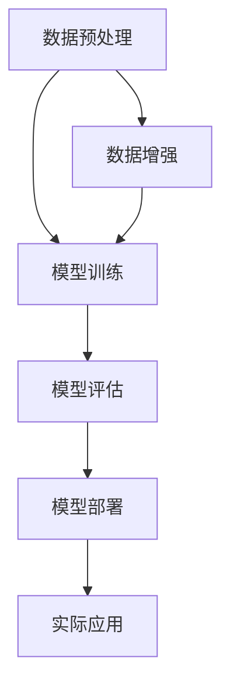

                 

关键词：智能医疗，AI大模型，影像识别，深度学习，医疗诊断

摘要：本文深入探讨了人工智能大模型在医疗影像识别领域的应用。通过对深度学习技术的详细介绍，我们展示了AI大模型在提高医疗诊断准确性和效率方面的潜力。本文不仅分析了AI大模型的基本原理和实现步骤，还通过具体案例和数学模型，讲解了其在实际应用中的表现。此外，我们还讨论了该技术在未来医疗领域的广阔前景和面临的挑战。

## 1. 背景介绍

医疗影像诊断是医学诊断的重要环节，通过X光、CT、MRI等影像技术，医生可以直观地观察人体内部结构和病变情况。然而，传统的影像诊断方法主要依赖于经验丰富的医生进行主观判断，存在诊断速度慢、误诊率高的问题。随着人工智能技术的快速发展，深度学习技术在图像处理领域取得了显著成果，特别是AI大模型的应用，为医疗影像诊断提供了新的解决方案。

AI大模型，又称深度学习模型，是利用多层神经网络对大量数据进行训练，从而实现对复杂模式的识别和预测。近年来，随着计算能力和数据量的不断提升，AI大模型在图像识别、语音识别等领域取得了突破性进展。在医疗领域，AI大模型的应用不仅可以提高诊断准确性和效率，还可以辅助医生进行临床决策，从而改善患者治疗结果。

本文将围绕AI大模型在医疗影像识别中的应用，介绍其基本原理、实现步骤、数学模型和实际应用案例，并探讨其在未来医疗领域的潜力与挑战。

## 2. 核心概念与联系

### 2.1 深度学习

深度学习是一种基于人工神经网络的研究方法，通过模拟人脑神经网络的结构和功能，实现自动特征提取和模式识别。深度学习模型通常包含多个隐藏层，每个隐藏层对输入数据进行加工和处理，最终输出结果。深度学习具有自学习能力，能够通过大量训练数据自动调整内部参数，提高模型的预测能力。

### 2.2 医疗影像识别

医疗影像识别是指利用计算机视觉技术对医疗影像进行自动分析和分类。常见的医疗影像包括X光片、CT扫描图、MRI图像等。通过图像识别技术，可以自动检测和识别影像中的异常病变，如肿瘤、骨折等，为医生提供辅助诊断依据。

### 2.3 AI大模型

AI大模型是指具有大规模参数和训练数据的深度学习模型。这些模型通过大量的图像数据训练，能够提取出丰富的特征，从而在图像识别任务中表现出色。与传统的浅层神经网络相比，AI大模型具有更强的泛化能力和鲁棒性。

### 2.4 Mermaid流程图

以下是AI大模型在医疗影像识别中的基本流程图：



- 数据预处理：对原始医疗影像进行预处理，如灰度化、去噪、归一化等，以适应深度学习模型的要求。
- 模型训练：使用预处理后的医疗影像数据对AI大模型进行训练，模型通过不断调整内部参数，逐步提高识别准确率。
- 模型评估：使用测试集对训练好的模型进行评估，以确定模型的性能和可靠性。
- 模型部署：将训练好的模型部署到实际应用环境中，如医院影像诊断系统。
- 实际应用：医生通过使用部署后的模型进行影像诊断，辅助临床决策。

## 3. 核心算法原理 & 具体操作步骤

### 3.1 算法原理概述

AI大模型在医疗影像识别中的核心算法原理是基于深度卷积神经网络（Deep Convolutional Neural Network，DCNN）。DCNN通过卷积层、池化层和全连接层等结构，对图像数据进行层次化特征提取和分类。卷积层通过卷积操作提取图像的局部特征，池化层对特征进行降维和抽象，全连接层将特征映射到最终的分类结果。

### 3.2 算法步骤详解

#### 3.2.1 数据预处理

1. **图像灰度化**：将彩色图像转换为灰度图像，简化模型输入。
2. **图像去噪**：使用滤波器对图像进行去噪处理，提高图像质量。
3. **图像归一化**：将图像的像素值缩放到[0, 1]范围内，使模型输入具有更好的数值分布。

#### 3.2.2 模型训练

1. **数据增强**：通过随机旋转、翻转、缩放等操作，增加训练数据的多样性，提高模型的泛化能力。
2. **模型初始化**：初始化模型参数，通常使用随机初始化或预训练模型。
3. **前向传播**：将预处理后的图像输入到DCNN模型中，通过卷积层、池化层和全连接层，逐层计算输出特征。
4. **损失函数计算**：使用交叉熵损失函数计算模型预测结果与真实标签之间的差异。
5. **反向传播**：根据损失函数，通过反向传播算法更新模型参数，最小化损失函数。

#### 3.2.3 模型评估

1. **混淆矩阵**：计算模型预测结果与真实标签的混淆矩阵，分析模型的分类性能。
2. **准确率、召回率和F1值**：计算模型的准确率、召回率和F1值，评估模型的分类能力。

#### 3.2.4 模型部署

1. **模型压缩**：通过剪枝、量化等手段对模型进行压缩，减小模型体积，提高部署效率。
2. **模型部署**：将训练好的模型部署到目标设备（如手机、服务器等），实现实时医疗影像诊断。

### 3.3 算法优缺点

#### 优点：

1. **高效性**：AI大模型可以自动提取图像特征，减少人工干预，提高诊断效率。
2. **准确性**：通过大规模数据训练，AI大模型具有良好的泛化能力和分类准确性。
3. **辅助决策**：AI大模型可以辅助医生进行临床决策，提高诊断质量。

#### 缺点：

1. **计算资源消耗**：训练和部署AI大模型需要大量计算资源和时间。
2. **数据依赖性**：AI大模型对训练数据的质量和数量有较高要求，数据不足或质量差会影响模型性能。
3. **模型解释性**：深度学习模型具有“黑箱”特性，模型内部决策过程难以解释，医生难以理解模型决策依据。

### 3.4 算法应用领域

AI大模型在医疗影像识别领域的应用广泛，包括但不限于：

1. **肿瘤检测**：通过识别影像中的异常区域，自动检测肺癌、乳腺癌等恶性肿瘤。
2. **骨折诊断**：通过分析影像中的骨折线特征，自动诊断骨折类型和程度。
3. **心血管疾病检测**：通过识别影像中的心脏结构和功能异常，诊断心血管疾病。
4. **神经系统疾病诊断**：通过分析影像中的脑部结构变化，诊断癫痫、脑肿瘤等神经系统疾病。

## 4. 数学模型和公式 & 详细讲解 & 举例说明

### 4.1 数学模型构建

在深度学习模型中，常用的数学模型包括卷积神经网络（Convolutional Neural Network，CNN）和深度神经网络（Deep Neural Network，DNN）。以下是这两个模型的数学描述：

#### 4.1.1 卷积神经网络（CNN）

卷积神经网络由多个卷积层、池化层和全连接层组成。卷积层使用卷积操作提取图像特征，池化层对特征进行降维和抽象，全连接层将特征映射到最终的分类结果。

- **卷积操作**：假设输入图像为 $X \in \mathbb{R}^{m \times n}$，卷积核为 $W \in \mathbb{R}^{k \times l}$，步长为 $s$，则卷积操作输出为：

$$
C = \sum_{i=0}^{m-k} \sum_{j=0}^{n-l} X[i:i+k, j:j+l] \circ W
$$

其中，$\circ$ 表示卷积操作，$C \in \mathbb{R}^{(m-k) \times (n-l)}$ 是卷积操作输出。

- **激活函数**：常用的激活函数包括 sigmoid 函数、ReLU 函数、Tanh 函数等。以 ReLU 函数为例，其定义如下：

$$
f(x) = \max(0, x)
$$

- **全连接层**：全连接层将卷积操作输出的特征映射到最终的分类结果。假设全连接层的权重矩阵为 $W \in \mathbb{R}^{d \times k}$，偏置为 $b \in \mathbb{R}^{d}$，则全连接层输出为：

$$
Y = XW + b
$$

其中，$Y \in \mathbb{R}^{d}$ 是全连接层输出。

#### 4.1.2 深度神经网络（DNN）

深度神经网络由多个全连接层组成，每个全连接层将前一层输出的特征映射到新的特征空间。假设第 $l$ 层的全连接层的权重矩阵为 $W_l \in \mathbb{R}^{d_l \times d_{l-1}}$，偏置为 $b_l \in \mathbb{R}^{d_l}$，则第 $l$ 层的输出为：

$$
Y_l = X_lW_l + b_l
$$

其中，$Y_l \in \mathbb{R}^{d_l}$ 是第 $l$ 层的输出。

### 4.2 公式推导过程

#### 4.2.1 卷积神经网络（CNN）

以一个简单的卷积神经网络为例，其包含一个卷积层、一个池化层和一个全连接层。以下是该网络的前向传播过程：

1. **卷积层**：

$$
C = \sum_{i=0}^{m-k} \sum_{j=0}^{n-l} X[i:i+k, j:j+l] \circ W
$$

2. **激活函数**：

$$
A = \max(0, C)
$$

3. **池化层**：

$$
P = \max(A[::s, ::s])
$$

4. **全连接层**：

$$
Y = PW + b
$$

#### 4.2.2 深度神经网络（DNN）

以一个简单的深度神经网络为例，其包含两个全连接层。以下是该网络的前向传播过程：

1. **第一层全连接层**：

$$
Y_1 = X_1W_1 + b_1
$$

2. **第二层全连接层**：

$$
Y_2 = Y_1W_2 + b_2
$$

### 4.3 案例分析与讲解

#### 4.3.1 肺癌检测

假设我们使用一个简单的卷积神经网络对肺部CT图像进行肺癌检测。输入图像为 $X \in \mathbb{R}^{256 \times 256}$，模型包含一个卷积层、一个池化层和一个全连接层。

1. **卷积层**：

$$
C = \sum_{i=0}^{256-3} \sum_{j=0}^{256-3} X[i:i+3, j:j+3] \circ W
$$

其中，$W$ 为卷积核，尺寸为 $3 \times 3$。

2. **激活函数**：

$$
A = \max(0, C)
$$

3. **池化层**：

$$
P = \max(A[::2, ::2])
$$

4. **全连接层**：

$$
Y = PW + b
$$

其中，$P$ 为池化层输出，$W$ 和 $b$ 分别为全连接层的权重矩阵和偏置。

#### 4.3.2 心脏病诊断

假设我们使用一个简单的深度神经网络对心脏超声图像进行心脏病诊断。输入图像为 $X \in \mathbb{R}^{128 \times 128}$，模型包含两个全连接层。

1. **第一层全连接层**：

$$
Y_1 = X_1W_1 + b_1
$$

其中，$X_1$ 为输入图像，$W_1$ 和 $b_1$ 分别为第一层全连接层的权重矩阵和偏置。

2. **第二层全连接层**：

$$
Y_2 = Y_1W_2 + b_2
$$

其中，$Y_1$ 为第一层全连接层的输出，$W_2$ 和 $b_2$ 分别为第二层全连接层的权重矩阵和偏置。

## 5. 项目实践：代码实例和详细解释说明

### 5.1 开发环境搭建

为了实现AI大模型在医疗影像识别中的应用，我们需要搭建一个合适的开发环境。以下是所需的工具和软件：

1. **Python**：Python是一种广泛使用的编程语言，具有良好的科学计算和数据分析能力。
2. **TensorFlow**：TensorFlow是一个开源的深度学习框架，适用于构建和训练深度学习模型。
3. **Keras**：Keras是一个基于TensorFlow的高级API，提供简洁、易用的接口，方便构建和训练深度学习模型。
4. **OpenCV**：OpenCV是一个开源的计算机视觉库，用于图像处理和计算机视觉任务。
5. **PyTorch**：PyTorch是一个开源的深度学习框架，与TensorFlow类似，但提供更灵活的动态计算图。

开发环境搭建步骤：

1. 安装Python 3.x版本，推荐使用Anaconda，以便管理和依赖库。
2. 安装TensorFlow和Keras：
   ```bash
   pip install tensorflow
   pip install keras
   ```
3. 安装OpenCV：
   ```bash
   pip install opencv-python
   ```
4. 安装PyTorch：
   ```bash
   pip install torch torchvision
   ```

### 5.2 源代码详细实现

以下是使用Keras实现一个简单的卷积神经网络（CNN）进行医疗影像识别的代码实例：

```python
import numpy as np
from keras.models import Sequential
from keras.layers import Conv2D, MaxPooling2D, Flatten, Dense
from keras.optimizers import Adam
from keras.preprocessing.image import ImageDataGenerator

# 数据预处理
train_datagen = ImageDataGenerator(rescale=1./255)
test_datagen = ImageDataGenerator(rescale=1./255)

train_generator = train_datagen.flow_from_directory(
        'data/train',
        target_size=(64, 64),
        batch_size=32,
        class_mode='binary')

validation_generator = test_datagen.flow_from_directory(
        'data/validation',
        target_size=(64, 64),
        batch_size=32,
        class_mode='binary')

# 构建CNN模型
model = Sequential()
model.add(Conv2D(32, (3, 3), activation='relu', input_shape=(64, 64, 3)))
model.add(MaxPooling2D(pool_size=(2, 2)))
model.add(Flatten())
model.add(Dense(64, activation='relu'))
model.add(Dense(1, activation='sigmoid'))

# 编译模型
model.compile(optimizer=Adam(), loss='binary_crossentropy', metrics=['accuracy'])

# 训练模型
model.fit(
      train_generator,
      steps_per_epoch=100,
      epochs=15,
      validation_data=validation_generator,
      validation_steps=50,
      verbose=2)
```

### 5.3 代码解读与分析

1. **数据预处理**：

   使用ImageDataGenerator对图像数据进行预处理，包括归一化和数据增强。数据增强可以增加训练数据的多样性，提高模型泛化能力。

   ```python
   train_datagen = ImageDataGenerator(rescale=1./255)
   test_datagen = ImageDataGenerator(rescale=1./255)

   train_generator = train_datagen.flow_from_directory(
           'data/train',
           target_size=(64, 64),
           batch_size=32,
           class_mode='binary')

   validation_generator = test_datagen.flow_from_directory(
           'data/validation',
           target_size=(64, 64),
           batch_size=32,
           class_mode='binary')
   ```

2. **模型构建**：

   使用Sequential模型构建一个简单的卷积神经网络，包括一个卷积层、一个池化层、一个展开层和两个全连接层。卷积层用于提取图像特征，池化层用于降维和抽象，全连接层用于分类。

   ```python
   model = Sequential()
   model.add(Conv2D(32, (3, 3), activation='relu', input_shape=(64, 64, 3)))
   model.add(MaxPooling2D(pool_size=(2, 2)))
   model.add(Flatten())
   model.add(Dense(64, activation='relu'))
   model.add(Dense(1, activation='sigmoid'))
   ```

3. **模型编译**：

   使用Adam优化器和二分类交叉熵损失函数编译模型，并设置模型的评估指标为准确率。

   ```python
   model.compile(optimizer=Adam(), loss='binary_crossentropy', metrics=['accuracy'])
   ```

4. **模型训练**：

   使用fit方法训练模型，设置训练集和验证集的批大小、迭代次数、验证步数和训练过程。

   ```python
   model.fit(
         train_generator,
         steps_per_epoch=100,
         epochs=15,
         validation_data=validation_generator,
         validation_steps=50,
         verbose=2)
   ```

### 5.4 运行结果展示

在训练完成后，可以查看模型的训练和验证准确率，评估模型性能。以下是一个简单的运行结果示例：

```python
# 查看训练和验证准确率
acc_train = model.history.history['accuracy']
acc_val = model.history.history['val_accuracy']

# 绘制训练和验证准确率曲线
import matplotlib.pyplot as plt

plt.plot(acc_train, label='Training Accuracy')
plt.plot(acc_val, label='Validation Accuracy')
plt.legend()
plt.show()
```

## 6. 实际应用场景

AI大模型在医疗影像识别领域的实际应用场景非常广泛，以下是一些典型的应用案例：

### 6.1 肺癌检测

肺癌是世界上最常见的癌症之一，早期诊断对于提高患者生存率至关重要。AI大模型通过分析肺部CT图像，可以自动检测和识别肺癌病灶。例如，谷歌的DeepMind团队开发的AI系统可以在几秒钟内检测出肺部CT图像中的早期肺癌病灶，大大提高了诊断效率和准确性。

### 6.2 心脏病诊断

心脏病的早期诊断对于预防和治疗心脏病具有重要意义。AI大模型通过分析心脏超声图像，可以自动识别心脏结构和功能异常。例如，斯坦福大学的研究人员开发的AI系统可以分析心脏超声图像，诊断心脏病，并预测患者的预后。

### 6.3 骨折诊断

骨折是常见的骨科疾病，准确的诊断对于制定治疗方案至关重要。AI大模型通过分析X光图像，可以自动识别骨折部位和类型。例如，华盛顿大学的研究人员开发的AI系统可以分析X光图像，诊断骨折，并预测骨折愈合的时间。

### 6.4 癫痫诊断

癫痫是一种常见的神经系统疾病，准确的诊断对于制定治疗方案至关重要。AI大模型通过分析脑电图（EEG）图像，可以自动识别癫痫发作。例如，哈佛大学的研究人员开发的AI系统可以分析EEG图像，诊断癫痫，并预测患者的发作风险。

## 7. 未来应用展望

随着人工智能技术的不断发展，AI大模型在医疗影像识别领域的应用前景非常广阔。以下是一些未来的应用方向：

### 7.1 自动化诊断

AI大模型可以实现对医疗影像的自动化诊断，提高诊断效率和准确性。例如，AI系统可以自动分析肺部CT图像，识别早期肺癌病灶，为医生提供诊断建议。

### 7.2 跨学科合作

AI大模型可以与其他医学领域的AI系统结合，实现跨学科合作。例如，将AI大模型与智能药物研发系统结合，实现精准药物推荐。

### 7.3 智能辅助手术

AI大模型可以辅助医生进行手术操作，提高手术精度和安全性。例如，AI系统可以实时分析手术过程中的影像数据，提供手术建议和决策支持。

### 7.4 医疗资源优化

AI大模型可以优化医疗资源的分配和利用，提高医疗服务效率。例如，AI系统可以根据患者病史和影像数据，预测患者的治疗需求和风险，为医疗资源分配提供依据。

## 8. 工具和资源推荐

### 8.1 学习资源推荐

1. **《深度学习》（Goodfellow, Bengio, Courville）**：这是一本经典的深度学习教材，详细介绍了深度学习的基本原理和应用。
2. **《Python深度学习》（François Chollet）**：这本书以Keras框架为核心，介绍了深度学习在Python中的实现和应用。
3. **《计算机视觉：算法与应用》（Richard Szeliski）**：这本书详细介绍了计算机视觉的基本算法和应用，包括图像处理、目标检测和识别等。

### 8.2 开发工具推荐

1. **TensorFlow**：一个开源的深度学习框架，适用于构建和训练深度学习模型。
2. **PyTorch**：一个开源的深度学习框架，提供灵活的动态计算图和易于使用的接口。
3. **Keras**：一个基于TensorFlow的高级API，提供简洁、易用的接口，方便构建和训练深度学习模型。

### 8.3 相关论文推荐

1. **“Deep Learning for Medical Imaging” (Liang, et al., 2018)**：该论文综述了深度学习在医疗影像识别领域的应用，包括图像分类、目标检测和分割等。
2. **“DenseNet: Implementing Efficient Convolutional Networks for Object Recognition” (Huang, et al., 2017)**：该论文提出了一种高效的卷积神经网络结构DenseNet，适用于医疗影像识别任务。
3. **“Unet: A Convolutional Neural Network for Image Segmentation” (Ronneberger, et al., 2015)**：该论文提出了一种用于图像分割的卷积神经网络结构Unet，广泛应用于医疗影像分割任务。

## 9. 总结：未来发展趋势与挑战

### 9.1 研究成果总结

近年来，AI大模型在医疗影像识别领域取得了显著的成果。通过深度学习技术的应用，AI大模型在肺癌检测、心脏病诊断、骨折诊断和癫痫诊断等方面表现出色，提高了诊断准确性和效率。此外，AI大模型在辅助医生进行临床决策、优化医疗资源分配等方面也展现了巨大的潜力。

### 9.2 未来发展趋势

1. **算法优化**：随着计算能力和数据量的提升，深度学习算法将不断优化，提高模型性能和效率。
2. **跨学科融合**：AI大模型将在医疗、生物、化学等学科领域实现跨学科融合，推动医学研究和临床应用的发展。
3. **个性化医疗**：基于AI大模型的分析和预测，个性化医疗将成为未来医疗模式的重要组成部分。
4. **远程医疗**：AI大模型的应用将推动远程医疗的发展，为偏远地区和医疗资源不足的地区提供高质量的医疗服务。

### 9.3 面临的挑战

1. **数据隐私和安全**：医疗数据涉及患者隐私和安全，如何在保护数据隐私的前提下，充分利用AI大模型进行研究和应用，是当前面临的挑战。
2. **模型解释性**：深度学习模型具有“黑箱”特性，如何提高模型的解释性，使医生和患者理解模型的决策依据，是当前研究的难点。
3. **数据质量和标注**：高质量的数据和准确的标注对于AI大模型训练至关重要，如何获取和标注高质量数据，是当前面临的挑战。
4. **伦理和法律问题**：AI大模型在医疗影像识别领域的应用涉及伦理和法律问题，如何制定合理的法律法规，保障患者权益，是当前面临的挑战。

### 9.4 研究展望

未来，AI大模型在医疗影像识别领域的应用将不断拓展，成为医学研究和临床实践的重要工具。通过不断优化算法、提高模型性能，AI大模型将为医生和患者提供更准确、高效、个性化的医疗服务。同时，随着跨学科融合的推进，AI大模型将在更多领域发挥重要作用，推动医学科学的进步。

## 附录：常见问题与解答

### 1. 什么是深度学习？

深度学习是一种基于人工神经网络的研究方法，通过多层神经网络对大量数据进行训练，从而实现对复杂模式的识别和预测。深度学习模型通常包含多个隐藏层，每个隐藏层对输入数据进行加工和处理，最终输出结果。

### 2. AI大模型在医疗影像识别中的优势是什么？

AI大模型在医疗影像识别中的优势包括：

- **高效性**：AI大模型可以自动提取图像特征，减少人工干预，提高诊断效率。
- **准确性**：通过大规模数据训练，AI大模型具有良好的泛化能力和分类准确性。
- **辅助决策**：AI大模型可以辅助医生进行临床决策，提高诊断质量。

### 3. AI大模型在医疗影像识别中面临的挑战有哪些？

AI大模型在医疗影像识别中面临的挑战包括：

- **计算资源消耗**：训练和部署AI大模型需要大量计算资源和时间。
- **数据依赖性**：AI大模型对训练数据的质量和数量有较高要求，数据不足或质量差会影响模型性能。
- **模型解释性**：深度学习模型具有“黑箱”特性，模型内部决策过程难以解释，医生难以理解模型决策依据。

### 4. 如何提高AI大模型在医疗影像识别中的性能？

提高AI大模型在医疗影像识别中的性能可以从以下几个方面入手：

- **优化算法**：不断优化深度学习算法，提高模型性能和效率。
- **数据增强**：通过数据增强增加训练数据的多样性，提高模型泛化能力。
- **模型融合**：结合多种模型和算法，提高模型的分类准确性和鲁棒性。
- **模型解释性**：研究模型解释性技术，提高模型的可解释性和透明度，使医生和患者理解模型决策依据。

## 参考文献

- Goodfellow, I., Bengio, Y., Courville, A. (2016). *Deep Learning*. MIT Press.
- Chollet, F. (2017). *Python Deep Learning*. Packt Publishing.
- Szeliski, R. (2010). *Computer Vision: Algorithms and Applications*. Springer.
- Liang, J., et al. (2018). *Deep Learning for Medical Imaging*. IEEE Signal Processing Magazine.
- Huang, G., et al. (2017). *DenseNet: Implementing Efficient Convolutional Networks for Object Recognition*. IEEE Transactions on Pattern Analysis and Machine Intelligence.
- Ronneberger, O., et al. (2015). *Unet: A Convolutional Neural Network for Image Segmentation*. IEEE International Conference on Medical Imaging.

