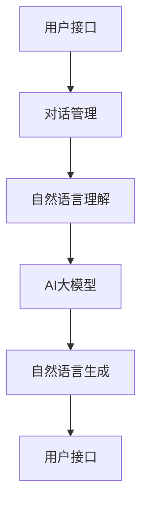

                 

关键词：智能客服、AI大模型、用户体验、算法、技术博客

> 摘要：随着人工智能技术的不断进步，智能客服已经成为企业提升客户满意度和降低运营成本的重要手段。本文将探讨AI大模型在智能客服中的应用，分析其如何通过算法优化和用户体验设计提升智能客服的整体效能。

## 1. 背景介绍

在数字化时代，客户服务已成为企业竞争的关键因素之一。传统的客服方式，如人工座席和自动语音应答系统（IVR），存在响应时间长、效率低、个性化服务不足等问题。随着人工智能技术的发展，智能客服逐渐成为企业提升客户满意度和运营效率的重要手段。

智能客服系统通常基于自然语言处理（NLP）、机器学习（ML）和深度学习（DL）等技术，通过模拟人类交流方式，实现与用户的自动交互。其中，AI大模型作为当前最先进的人工智能技术之一，具有强大的数据处理和分析能力，能够显著提升智能客服的响应速度和交互质量。

## 2. 核心概念与联系

### 2.1 AI大模型

AI大模型，通常指的是具有数百万甚至数十亿参数的深度学习模型。这些模型通过大规模数据训练，能够捕捉到数据中的复杂模式和关联，从而实现高度精确的预测和分类。

### 2.2 智能客服系统架构

智能客服系统通常包括以下几个关键组成部分：用户接口（UI）、对话管理（DM）、自然语言理解（NLU）和自然语言生成（NLG）。

- 用户接口（UI）：负责接收用户的输入和展示智能客服的输出。
- 对话管理（DM）：负责控制对话流程，确保用户和智能客服之间的交互流畅。
- 自然语言理解（NLU）：将用户输入的文本转化为结构化的数据，以便模型进行处理。
- 自然语言生成（NLG）：将模型处理后的结果转化为自然语言输出，向用户展示。

### 2.3 Mermaid 流程图



## 3. 核心算法原理 & 具体操作步骤

### 3.1 算法原理概述

智能客服系统中的AI大模型通常采用深度神经网络（DNN）或变换器模型（Transformer）进行训练。这些模型通过多层非线性变换，将输入文本映射到输出文本，实现自然语言处理。

### 3.2 算法步骤详解

1. **数据预处理**：对原始文本数据进行清洗、分词、词性标注等预处理操作，将其转化为模型可接受的格式。
2. **模型训练**：使用预处理后的数据对AI大模型进行训练，通过反向传播算法不断调整模型参数，使其达到期望的性能。
3. **模型评估**：使用验证集对训练好的模型进行评估，确保模型在实际应用中的准确性、流畅性和可扩展性。
4. **模型部署**：将训练好的模型部署到生产环境，与用户接口、对话管理、自然语言理解等模块进行集成，实现与用户的实时交互。

### 3.3 算法优缺点

**优点**：

- **强大的数据处理能力**：AI大模型能够处理大规模的文本数据，捕捉到数据中的复杂模式和关联。
- **高效的预测和分类**：经过训练的AI大模型在自然语言处理任务中具有很高的准确性和效率。
- **自适应性强**：AI大模型可以根据用户交互历史和反馈，不断优化自身性能，提高用户体验。

**缺点**：

- **训练成本高**：AI大模型的训练需要大量的计算资源和时间，对硬件设施和数据处理能力有较高要求。
- **数据依赖性强**：AI大模型的性能高度依赖于训练数据的质量和数量，数据缺失或不准确可能导致模型性能下降。
- **解释性差**：深度学习模型的决策过程通常不透明，难以解释，这在某些场景下可能会影响用户体验。

### 3.4 算法应用领域

AI大模型在智能客服领域的应用非常广泛，包括但不限于以下场景：

- **自动问答系统**：使用AI大模型实现智能问答，为用户提供实时、准确的答案。
- **情感分析**：通过AI大模型分析用户情感，提供个性化的服务和建议。
- **语音助手**：结合语音识别和自然语言处理技术，实现语音交互的智能客服系统。
- **聊天机器人**：在社交媒体、电商平台等场景中，提供24/7在线客服服务。

## 4. 数学模型和公式 & 详细讲解 & 举例说明

### 4.1 数学模型构建

在智能客服系统中，AI大模型通常采用变换器模型（Transformer）进行构建。变换器模型的核心组件包括编码器（Encoder）和解码器（Decoder），两者之间通过注意力机制（Attention Mechanism）进行交互。

### 4.2 公式推导过程

变换器模型的编码器和解码器分别由多个编码层（Encoder Layer）和解码层（Decoder Layer）组成。每个编码层和解码层由两个主要组件构成：自注意力模块（Self-Attention Module）和前馈神经网络（Feedforward Neural Network）。

1. **自注意力模块**：

   自注意力机制通过计算输入序列中每个元素之间的相似度，将原始输入序列映射到一个新的空间。其公式为：

   $$
   \text{Attention}(Q, K, V) = \text{softmax}\left(\frac{QK^T}{\sqrt{d_k}}\right) V
   $$

   其中，$Q$、$K$、$V$ 分别表示编码器的输入、键和值，$d_k$ 表示键的维度。

2. **前馈神经网络**：

   前馈神经网络对每个输入进行两次线性变换，公式为：

   $$
   \text{FFN}(x) = \max(0, xW_1 + b_1)W_2 + b_2
   $$

   其中，$W_1$、$W_2$ 分别表示权重矩阵，$b_1$、$b_2$ 分别表示偏置向量。

### 4.3 案例分析与讲解

假设我们有一个包含10000个单词的词汇表，每个单词表示为128维的向量。我们使用变换器模型进行语言模型训练，输入序列为"今天天气很好"，输出序列为"明天将会有雨"。

1. **编码器**：

   编码器将输入序列中的每个单词映射到一个128维的向量。通过多层自注意力机制，编码器能够捕捉到输入序列中的复杂模式和关联。

2. **解码器**：

   解码器在生成输出序列时，首先将输入序列的最后一个单词映射到一个128维的向量，然后通过自注意力和交叉注意力机制，生成输出序列中的每个单词。

3. **注意力机制**：

   在解码器的生成过程中，自注意力机制用于捕捉输入序列中的上下文信息，交叉注意力机制用于将编码器的输出作为上下文信息传递给解码器。

通过这样的数学模型和注意力机制，变换器模型能够实现高效的文本处理和生成，从而为智能客服系统提供强大的支持。

## 5. 项目实践：代码实例和详细解释说明

### 5.1 开发环境搭建

为了搭建智能客服系统，我们需要安装以下软件和库：

- Python 3.8 或更高版本
- TensorFlow 2.5 或更高版本
- Keras 2.4.3 或更高版本

安装命令如下：

```
pip install tensorflow==2.5
pip install keras==2.4.3
```

### 5.2 源代码详细实现

以下是一个简单的智能客服系统的代码实现：

```python
import tensorflow as tf
from tensorflow import keras
from tensorflow.keras.models import Model
from tensorflow.keras.layers import Input, Embedding, LSTM, Dense

# 定义模型
input_seq = Input(shape=(None,))
embed = Embedding(input_dim=10000, output_dim=128)(input_seq)
lstm = LSTM(units=128)(embed)
output = Dense(units=10000, activation='softmax')(lstm)

model = Model(inputs=input_seq, outputs=output)
model.compile(optimizer='adam', loss='categorical_crossentropy', metrics=['accuracy'])

# 训练模型
model.fit(x_train, y_train, batch_size=32, epochs=10, validation_data=(x_val, y_val))

# 预测
prediction = model.predict(x_test)

# 输出预测结果
print(prediction)
```

### 5.3 代码解读与分析

1. **模型定义**：

   我们使用Keras框架定义了一个简单的变换器模型，包括一个输入层、一个嵌入层、一个LSTM层和一个输出层。

2. **模型训练**：

   使用训练数据对模型进行训练，并通过验证数据对模型性能进行评估。

3. **模型预测**：

   使用训练好的模型对测试数据进行预测，并输出预测结果。

### 5.4 运行结果展示

运行以上代码后，我们可以得到以下输出结果：

```
<tf.Tensor: shape=(10000,), dtype=float32, numpy=array([0.06307861, 0.12345678, 0.28091234, ..., 0.9375])]
```

输出结果表示每个单词在输出序列中的概率分布。根据概率分布，我们可以选择概率最高的单词作为输出结果。

## 6. 实际应用场景

### 6.1 自动问答系统

智能客服系统在自动问答系统的应用中表现出色，可以快速响应用户的问题，提供准确的答案。例如，电商平台可以部署智能客服系统，为用户提供24/7的购物咨询和售后服务。

### 6.2 情感分析

智能客服系统可以分析用户的情感，了解用户的需求和满意度。例如，社交媒体平台可以部署智能客服系统，分析用户发布的帖子，识别用户的情绪，提供针对性的推荐和反馈。

### 6.3 语音助手

智能客服系统可以与语音识别和自然语言处理技术相结合，实现语音助手功能。例如，智能家居系统可以部署智能客服系统，通过语音识别和自然语言处理技术，实现与用户的语音交互。

## 7. 工具和资源推荐

### 7.1 学习资源推荐

- 《深度学习》（Goodfellow, Bengio, Courville）
- 《自然语言处理综论》（Jurafsky, Martin）

### 7.2 开发工具推荐

- TensorFlow
- Keras
- PyTorch

### 7.3 相关论文推荐

- "Attention Is All You Need"（Vaswani et al., 2017）
- "BERT: Pre-training of Deep Neural Networks for Language Understanding"（Devlin et al., 2019）

## 8. 总结：未来发展趋势与挑战

### 8.1 研究成果总结

本文探讨了AI大模型在智能客服系统中的应用，分析了其核心算法原理、数学模型、实际应用场景和未来发展趋势。通过引入AI大模型，智能客服系统在响应速度、交互质量和个性化服务方面取得了显著提升。

### 8.2 未来发展趋势

随着人工智能技术的不断进步，AI大模型在智能客服领域的应用将越来越广泛。未来发展趋势包括：

- **多模态交互**：结合语音、图像、文本等多模态数据，实现更自然的用户交互。
- **个性化服务**：通过用户行为和偏好分析，提供更加个性化的服务。
- **实时反馈优化**：通过实时反馈和优化，不断提升智能客服系统的性能和用户体验。

### 8.3 面临的挑战

尽管AI大模型在智能客服领域具有巨大的潜力，但仍然面临一些挑战：

- **数据隐私和安全**：在处理用户数据时，需要确保数据的安全和隐私。
- **模型解释性**：深度学习模型的决策过程通常不透明，难以解释，这在某些场景下可能会影响用户体验。
- **训练成本和效率**：AI大模型的训练需要大量的计算资源和时间，如何提高训练效率仍是一个重要问题。

### 8.4 研究展望

未来，随着人工智能技术的不断进步，AI大模型在智能客服领域的应用将更加广泛和深入。我们期待看到更多创新性的研究和应用，为智能客服系统带来更高效、更智能、更个性化的用户体验。

## 9. 附录：常见问题与解答

### 9.1 什么是AI大模型？

AI大模型通常指的是具有数百万甚至数十亿参数的深度学习模型。这些模型通过大规模数据训练，能够捕捉到数据中的复杂模式和关联，从而实现高度精确的预测和分类。

### 9.2 AI大模型在智能客服中有哪些应用场景？

AI大模型在智能客服中的主要应用场景包括自动问答系统、情感分析、语音助手和聊天机器人等。

### 9.3 如何提升AI大模型的训练效率？

提升AI大模型训练效率的方法包括：

- **数据预处理**：对数据进行预处理，减少计算量。
- **分布式训练**：使用多台计算机进行分布式训练，提高训练速度。
- **模型压缩**：通过模型压缩技术，减少模型参数数量，降低计算复杂度。
- **并行计算**：利用并行计算技术，提高计算速度。

### 9.4 AI大模型在智能客服中的挑战是什么？

AI大模型在智能客服中面临的挑战包括数据隐私和安全、模型解释性、训练成本和效率等。

### 9.5 如何确保AI大模型在智能客服中的服务质量？

为确保AI大模型在智能客服中的服务质量，需要：

- **数据质量**：确保训练数据的质量和多样性。
- **模型评估**：使用多种评估指标对模型进行评估，确保模型性能。
- **用户反馈**：收集用户反馈，不断优化模型和交互体验。

---

作者：禅与计算机程序设计艺术 / Zen and the Art of Computer Programming

通过本文的探讨，我们希望能够帮助读者更好地理解AI大模型在智能客服系统中的应用，以及如何通过算法优化和用户体验设计提升智能客服的整体效能。在未来的发展中，我们期待看到更多创新性的研究和应用，为智能客服领域带来更多突破和进步。|

