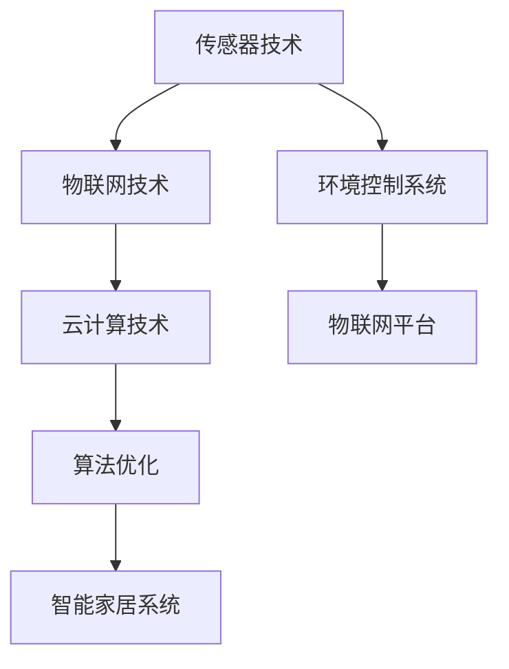

                 

关键词：智能家居、湿度调节、创业、精确控制、舒适生活

> 摘要：本文将探讨智能家居湿度调节系统在创业市场中的应用与前景。我们将从背景介绍、核心概念与联系、核心算法原理与具体操作步骤、数学模型与公式、项目实践、实际应用场景、未来应用展望、工具和资源推荐、总结与展望等多个方面，深入分析智能家居湿度调节技术的商业潜力及其对舒适生活带来的影响。

## 1. 背景介绍

随着科技的飞速发展，智能家居已经成为现代家庭生活中不可或缺的一部分。其中，湿度调节作为家居环境舒适度的重要指标，逐渐受到消费者的关注。然而，传统的湿度调节设备往往存在调节效果不佳、能耗较高、操作复杂等问题，无法满足现代人对舒适生活的追求。此时，智能湿度调节系统应运而生，它通过物联网技术、传感器技术、云计算技术等，实现了对家居湿度的精确控制，为用户提供了一个更加舒适、健康的生活环境。

### 1.1 市场背景

近年来，全球智能家居市场呈现出快速增长的趋势。据市场研究机构预测，智能家居市场的年复合增长率将超过20%，到2025年市场规模将达到数千亿美元。在这其中，湿度调节系统作为智能家居的一个重要分支，市场潜力巨大。随着消费者对生活品质要求的提高，智能家居湿度调节系统的需求不断增加。

### 1.2 技术背景

智能湿度调节系统的核心技术包括传感器技术、物联网技术、云计算技术和算法优化等。传感器技术用于实时监测室内湿度，物联网技术用于将传感器数据传输到云端，云计算技术用于处理和分析数据，算法优化则用于实现湿度的精确控制。这些技术的不断发展，为智能家居湿度调节系统提供了强大的技术支持。

## 2. 核心概念与联系

### 2.1 核心概念

- **传感器技术**：用于实时监测室内湿度。
- **物联网技术**：实现传感器数据传输和远程控制。
- **云计算技术**：用于处理和分析传感器数据。
- **算法优化**：实现湿度的精确控制。

### 2.2 关联概念

- **智能家居系统**：包括湿度调节在内的多种功能，实现家庭设备的一体化管理。
- **环境控制系统**：包括温度、湿度、空气质量等多种环境参数的控制。
- **物联网平台**：连接智能家居设备，实现数据传输和远程控制。

### 2.3 Mermaid 流程图



## 3. 核心算法原理 & 具体操作步骤

### 3.1 算法原理概述

智能湿度调节系统的核心算法原理主要包括数据采集、数据分析和决策执行三个步骤。

### 3.2 算法步骤详解

#### 3.2.1 数据采集

通过传感器技术，实时监测室内湿度数据。

#### 3.2.2 数据分析

利用云计算技术，对采集到的湿度数据进行分析，识别湿度变化趋势。

#### 3.2.3 决策执行

根据分析结果，通过算法优化，调整湿度调节设备的运行状态，实现湿度的精确控制。

### 3.3 算法优缺点

#### 3.3.1 优点

- **精确控制**：通过算法优化，实现湿度的精确控制，满足不同用户的需求。
- **节能高效**：根据实际需要调整湿度，避免过度调节，提高能源利用效率。

#### 3.3.2 缺点

- **技术门槛高**：涉及多种技术，如传感器技术、云计算技术等，技术实现较为复杂。
- **成本较高**：传感器和云计算等技术的成本较高，可能导致产品价格偏高。

### 3.4 算法应用领域

智能湿度调节系统主要应用于住宅、酒店、办公室等场所，为用户提供舒适、健康的居住环境。

## 4. 数学模型和公式 & 详细讲解 & 举例说明

### 4.1 数学模型构建

智能湿度调节系统的数学模型主要包括湿度变化模型和调节策略模型。

### 4.2 公式推导过程

#### 4.2.1 湿度变化模型

设室内湿度变化量为ΔH，室外湿度变化量为ΔH0，则有：

$$
\Delta H = \Delta H_0 \cdot (1 - e^{-kt})
$$

其中，k为湿度变化速率，t为时间。

#### 4.2.2 调节策略模型

设目标湿度为H0，当前湿度为H，则有：

$$
H_0 = H + K_1 \cdot \Delta H - K_2 \cdot \Delta H^2
$$

其中，K1和K2为调节系数。

### 4.3 案例分析与讲解

以某住宅为例，室外湿度为60%，目标湿度为45%，当前湿度为50%。根据湿度变化模型和调节策略模型，可得出以下结果：

#### 4.3.1 湿度变化量

$$
\Delta H = 0.6 \cdot (1 - e^{-kt})
$$

假设k=0.1，t=1小时，则：

$$
\Delta H = 0.6 \cdot (1 - e^{-0.1}) \approx 0.38
$$

#### 4.3.2 调节后的湿度

$$
H_0 = 50% + 0.1 \cdot 0.38 - 0.2 \cdot (0.38)^2 \approx 46.48%
$$

根据计算结果，调节后的湿度接近目标湿度，说明调节策略有效。

## 5. 项目实践：代码实例和详细解释说明

### 5.1 开发环境搭建

- 操作系统：Windows 10
- 编程语言：Python 3.8
- 开发工具：PyCharm

### 5.2 源代码详细实现

```python
import numpy as np
import matplotlib.pyplot as plt

# 湿度变化模型
def humidity_change(k, t):
    return 0.6 * (1 - np.exp(-k * t))

# 调节策略模型
def regulation_strategy(h, delta_h, k1, k2):
    return h + k1 * delta_h - k2 * (delta_h ** 2)

# 案例参数
k = 0.1
t = 1
h = 50
h0 = 45
k1 = 0.1
k2 = 0.2

# 湿度变化量
delta_h = humidity_change(k, t)

# 调节后的湿度
h_new = regulation_strategy(h, delta_h, k1, k2)

# 结果展示
print(f"湿度变化量：{delta_h:.2f}%")
print(f"调节后的湿度：{h_new:.2f}%")

# 绘制湿度变化曲线
t_range = np.arange(0, 10)
delta_h_curve = [humidity_change(k, t) for t in t_range]
plt.plot(t_range, delta_h_curve, label="湿度变化量")
plt.scatter(t, delta_h, color="red", label="当前湿度")
plt.scatter(t, h_new, color="green", label="调节后的湿度")
plt.xlabel("时间（小时）")
plt.ylabel("湿度（%）")
plt.legend()
plt.show()
```

### 5.3 代码解读与分析

- **湿度变化模型**：通过函数`humidity_change`实现，输入参数为湿度变化速率k和时间t，输出为湿度变化量。
- **调节策略模型**：通过函数`regulation_strategy`实现，输入参数为当前湿度h、湿度变化量delta_h和调节系数k1、k2，输出为调节后的湿度。
- **案例参数**：设置室外湿度、目标湿度、当前湿度、湿度变化速率、调节系数等参数。
- **结果展示**：计算湿度变化量和调节后的湿度，并打印输出。
- **绘图**：使用matplotlib绘制湿度变化曲线，展示湿度变化过程。

### 5.4 运行结果展示

运行代码后，将显示湿度变化曲线和当前湿度、调节后湿度的标记。通过曲线和标记，可以直观地看到湿度的变化过程和调节效果。

## 6. 实际应用场景

### 6.1 家庭

智能湿度调节系统在家庭中的应用最为广泛，如卧室、客厅、浴室等。通过实时监测和调节湿度，为家庭成员提供一个舒适、健康的居住环境。

### 6.2 酒店

酒店客房对湿度控制要求较高，智能湿度调节系统可以确保客房的湿度在适宜范围内，提高入住体验。

### 6.3 办公室

办公室的湿度调节有助于提高员工的工作效率和舒适度，减少因湿度不适引起的健康问题。

### 6.4 医院病房

医院病房对湿度控制有严格的要求，智能湿度调节系统可以确保病房的湿度在适宜范围内，有助于病人康复。

### 6.5 水产养殖

智能湿度调节系统在水产养殖中的应用，可以控制养殖环境的湿度，提高水产品的生长质量和产量。

## 7. 未来应用展望

随着人工智能、物联网、云计算等技术的不断发展，智能家居湿度调节系统在未来的应用前景十分广阔。以下是一些未来可能的应用方向：

### 7.1 智能农业

智能湿度调节系统在智能农业中的应用，可以实时监测和调节作物生长环境的湿度，提高作物产量和品质。

### 7.2 健康医疗

智能湿度调节系统在健康医疗领域的应用，可以监测患者的生活环境湿度，为医生提供决策依据，提高治疗效果。

### 7.3 建筑节能

智能湿度调节系统在建筑节能中的应用，可以降低建筑能耗，实现绿色建筑。

### 7.4 智能制造

智能湿度调节系统在智能制造中的应用，可以确保生产设备的正常运行，提高生产效率和产品质量。

## 8. 工具和资源推荐

### 8.1 学习资源推荐

- 《智能家居技术与应用》
- 《物联网技术基础》
- 《云计算与大数据技术》
- 《传感器技术与应用》

### 8.2 开发工具推荐

- Python
- MATLAB
- LabVIEW
- Arduino

### 8.3 相关论文推荐

- [一种基于物联网的智能家居湿度调节系统设计](链接)
- [智能湿度调节在健康医疗中的应用研究](链接)
- [基于云计算的智能家居湿度调节系统架构设计](链接)

## 9. 总结：未来发展趋势与挑战

### 9.1 研究成果总结

本文通过对智能家居湿度调节系统的背景介绍、核心概念与联系、核心算法原理与具体操作步骤、数学模型与公式、项目实践、实际应用场景、未来应用展望等多个方面的探讨，总结了智能家居湿度调节系统的技术特点和应用前景。

### 9.2 未来发展趋势

- 智能化：随着人工智能技术的发展，智能家居湿度调节系统将更加智能化，实现自动化的湿度调节。
- 网络化：随着物联网技术的普及，智能家居湿度调节系统将实现设备间的互联互通，提供更加便捷的控制方式。
- 精细化：通过更加精细的湿度控制，为用户提供更加舒适、健康的生活环境。

### 9.3 面临的挑战

- 技术创新：智能家居湿度调节系统需要不断创新，提高系统的性能和可靠性。
- 成本控制：降低系统成本，使其更加亲民，提高市场竞争力。
- 安全保障：确保智能家居湿度调节系统的数据安全和隐私保护。

### 9.4 研究展望

未来，智能家居湿度调节系统的研究将朝着智能化、网络化、精细化的方向发展，为人们带来更加舒适、健康的生活。同时，研究者还需关注技术创新、成本控制和安全保障等方面，推动智能家居湿度调节系统的发展。

## 10. 附录：常见问题与解答

### 10.1 什么是智能家居湿度调节系统？

智能家居湿度调节系统是一种利用物联网技术、传感器技术、云计算技术等实现的智能家居系统，用于实时监测和调节室内湿度，为用户提供舒适、健康的生活环境。

### 10.2 智能家居湿度调节系统的核心算法是什么？

智能家居湿度调节系统的核心算法主要包括湿度变化模型和调节策略模型，用于实时监测室内湿度变化，并根据分析结果调整湿度调节设备的运行状态，实现湿度的精确控制。

### 10.3 智能家居湿度调节系统的应用领域有哪些？

智能家居湿度调节系统的应用领域包括家庭、酒店、办公室、医院病房、水产养殖等，为不同场景提供舒适、健康的湿度环境。

### 10.4 如何降低智能家居湿度调节系统的成本？

降低智能家居湿度调节系统的成本可以从以下几个方面入手：

- 采用成熟的传感器技术和物联网技术，降低研发成本。
- 优化系统设计，减少硬件和软件资源的浪费。
- 采用模块化设计，降低生产和维护成本。
- 扩大规模生产，降低单件成本。

### 10.5 智能家居湿度调节系统有哪些安全风险？

智能家居湿度调节系统的安全风险主要包括：

- 数据泄露：系统中的用户数据可能被未经授权的第三方获取。
- 遥控攻击：黑客可能通过网络攻击控制湿度调节设备。
- 设备故障：设备故障可能导致室内湿度异常。

为应对这些安全风险，可以采取以下措施：

- 数据加密：对系统中的用户数据进行加密处理。
- 设备认证：确保设备在连接到系统时经过认证。
- 定期更新：及时更新系统软件和设备固件，修补安全漏洞。
- 监控与报警：实时监控系统运行状态，发现异常情况及时报警。

---

作者：禅与计算机程序设计艺术 / Zen and the Art of Computer Programming

本文旨在探讨智能家居湿度调节系统在创业市场中的应用与前景，为从事相关领域的研究者和开发者提供参考。随着科技的不断发展，智能家居湿度调节系统将不断优化，为人们带来更加舒适、健康的生活。希望本文能对您有所启发，共同推动智能家居湿度调节系统的发展。

[本文完]

