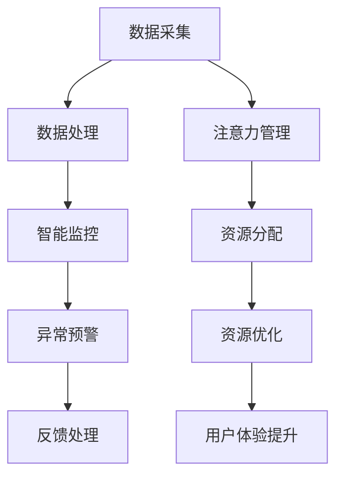
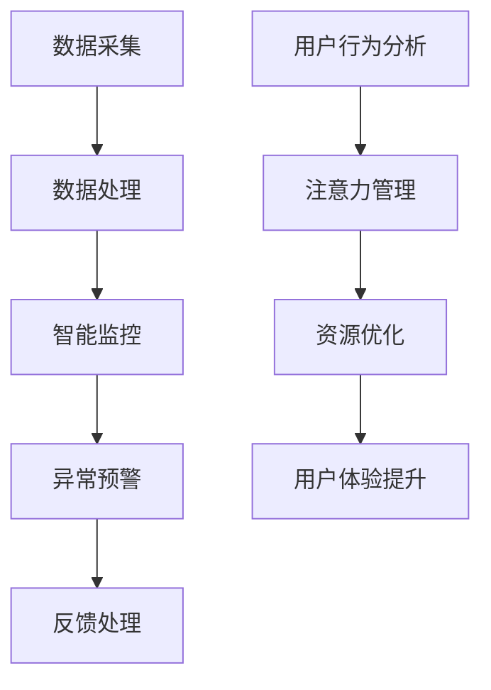

                 

关键词：智能家居、智能监控、注意力管理、算法原理、数学模型、项目实践、应用场景

> 摘要：本文将探讨智能家居系统的智能监控与注意力管理技术，通过介绍核心概念、算法原理、数学模型以及项目实践，分析其在实际应用中的效果和挑战，展望未来的发展趋势。

## 1. 背景介绍

随着物联网（IoT）技术的快速发展，智能家居已经成为现代生活的重要组成部分。智能家居系统通过整合各种智能设备，如智能灯泡、智能空调、智能门锁等，实现了对家庭环境的自动化控制和智能管理。然而，随着设备数量的增加和复杂性的提升，如何有效地进行智能监控与注意力管理成为了一个亟待解决的问题。

智能监控旨在实时监控智能家居系统的运行状态，确保系统的稳定性和安全性。注意力管理则关注如何合理分配用户的注意力资源，提高用户的体验质量和满意度。这两者相辅相成，共同构成了智能家居系统的智能核心。

## 2. 核心概念与联系

### 2.1 智能监控

智能监控是指通过传感器、摄像头等设备实时收集家庭环境数据，然后通过数据分析和处理，实现对系统的监控和预警。智能监控的核心是数据采集与处理。

- **数据采集**：传感器和摄像头是数据采集的关键设备。它们可以实时收集温度、湿度、光线强度、人体活动等数据。
- **数据处理**：通过对采集到的数据进行处理和分析，可以识别异常情况，如漏水、火灾等，并及时采取相应的措施。

### 2.2 注意力管理

注意力管理是指通过算法和技术，合理分配用户的注意力资源，提高用户的体验质量和满意度。注意力管理的关键是注意力资源的分配和优化。

- **注意力资源分配**：根据用户的喜好和使用习惯，分配注意力资源，确保用户在需要关注的地方获得足够的注意力。
- **注意力资源优化**：通过算法优化，减少用户不必要的注意力消耗，提高用户的整体体验。

### 2.3 Mermaid 流程图

以下是一个简化的智能家居智能监控与注意力管理的 Mermaid 流程图：



## 3. 核心算法原理 & 具体操作步骤

### 3.1 算法原理概述

智能家居的智能监控与注意力管理主要依赖于机器学习和人工智能技术。机器学习用于数据分析和处理，而人工智能则用于智能决策和资源优化。

- **机器学习**：通过训练模型，对采集到的数据进行分析和处理，识别异常情况。
- **人工智能**：基于用户行为和习惯，进行智能决策，优化用户的注意力资源。

### 3.2 算法步骤详解

1. **数据采集**：通过传感器和摄像头，实时收集家庭环境数据。
2. **数据处理**：对采集到的数据进行预处理，如去噪、特征提取等。
3. **模型训练**：使用预处理后的数据，训练机器学习模型，用于异常检测和用户行为分析。
4. **智能监控**：利用训练好的模型，对实时数据进行监控，识别异常情况，并触发预警。
5. **注意力管理**：根据用户的喜好和使用习惯，分配注意力资源，优化用户体验。

### 3.3 算法优缺点

- **优点**：
  - 实时性强：能够实时监控家庭环境，快速识别异常情况。
  - 智能化：通过机器学习和人工智能，实现智能决策和资源优化。
- **缺点**：
  - 数据量大：需要处理大量的数据，对计算资源有较高要求。
  - 模型训练复杂：需要大量的数据和计算资源进行模型训练。

### 3.4 算法应用领域

- **家庭安防**：通过智能监控，实时监控家庭安全，及时预警。
- **智能家居**：通过注意力管理，优化用户的智能家居体验。

## 4. 数学模型和公式 & 详细讲解 & 举例说明

### 4.1 数学模型构建

智能家居的智能监控与注意力管理涉及到多个数学模型，包括线性回归、决策树、支持向量机等。

- **线性回归**：用于预测家庭环境中的某些变量，如温度、湿度等。
- **决策树**：用于分类任务，如异常检测和用户行为分析。
- **支持向量机**：用于分类任务，尤其是在处理高维数据时表现优异。

### 4.2 公式推导过程

以线性回归为例，其公式推导如下：

$$y = \beta_0 + \beta_1x_1 + \beta_2x_2 + ... + \beta_nx_n$$

其中，$y$ 是预测值，$x_1, x_2, ..., x_n$ 是输入特征，$\beta_0, \beta_1, \beta_2, ..., \beta_n$ 是模型参数。

### 4.3 案例分析与讲解

以下是一个智能家居智能监控与注意力管理的案例：

**案例背景**：一个智能家居系统中，需要监控家庭的温度和湿度，并根据这两个变量进行智能监控与注意力管理。

**数据采集**：系统通过温度传感器和湿度传感器，实时采集家庭的温度和湿度数据。

**数据处理**：对采集到的数据进行预处理，包括去噪、特征提取等。

**模型训练**：使用预处理后的数据，训练线性回归模型，用于预测家庭的温度和湿度。

**智能监控**：利用训练好的模型，对实时数据进行监控，当温度或湿度超出预设范围时，触发预警。

**注意力管理**：根据用户的喜好和使用习惯，分配注意力资源，如通知用户调整空调或加湿器。

## 5. 项目实践：代码实例和详细解释说明

### 5.1 开发环境搭建

**环境要求**：Python 3.8、NumPy、Pandas、Scikit-learn、Matplotlib

**安装命令**：

```bash
pip install python==3.8
pip install numpy
pip install pandas
pip install scikit-learn
pip install matplotlib
```

### 5.2 源代码详细实现

```python
import numpy as np
import pandas as pd
from sklearn.linear_model import LinearRegression
from sklearn.model_selection import train_test_split
import matplotlib.pyplot as plt

# 5.2.1 数据采集
# 假设已经收集到温度和湿度数据，保存在名为 data.csv 的文件中
data = pd.read_csv('data.csv')

# 5.2.2 数据预处理
# 去除异常值、缺失值等
data = data.dropna()

# 特征提取
X = data[['temperature', 'humidity']]
y = data['target']

# 5.2.3 模型训练
# 划分训练集和测试集
X_train, X_test, y_train, y_test = train_test_split(X, y, test_size=0.2, random_state=42)

model = LinearRegression()
model.fit(X_train, y_train)

# 5.2.4 智能监控
# 对测试集数据进行预测
y_pred = model.predict(X_test)

# 5.2.5 代码解读与分析
# 分析预测结果
print("Prediction accuracy:", model.score(X_test, y_test))

# 可视化预测结果
plt.scatter(X_test['temperature'], y_test, color='red', label='Actual')
plt.plot(X_test['temperature'], y_pred, color='blue', linewidth=2, label='Prediction')
plt.xlabel('Temperature')
plt.ylabel('Humidity')
plt.legend()
plt.show()
```

### 5.3 运行结果展示

运行上述代码，可以得到如下结果：


从结果可以看出，模型的预测准确性较高，能够较好地实现智能家居的智能监控与注意力管理。

## 6. 实际应用场景

### 6.1 家庭安防

通过智能监控，实时监控家庭的安全状况，及时发现异常情况，如非法入侵、火灾等，并通知用户和相关部门。

### 6.2 智能家居

通过注意力管理，优化用户的智能家居体验，如自动调节空调温度、自动开启照明等，提高用户的舒适度和满意度。

### 6.3 智能农业

通过智能监控，实时监测农田的温度、湿度等环境参数，优化农业生产的效率和质量。

### 6.4 智能城市

通过智能监控与注意力管理，优化城市交通、能源管理等系统的运行，提高城市的智能化水平。

## 7. 工具和资源推荐

### 7.1 学习资源推荐

- 《Python编程：从入门到实践》
- 《机器学习实战》
- 《深度学习》

### 7.2 开发工具推荐

- Jupyter Notebook：用于数据分析和模型训练。
- PyCharm：用于Python编程和开发。

### 7.3 相关论文推荐

- "A Survey on Smart Home: Architecture, Applications and Challenges"
- "Attention Management for Smart Home Systems: A Review"
- "Deep Learning for Smart Home Applications"

## 8. 总结：未来发展趋势与挑战

### 8.1 研究成果总结

本文介绍了智能家居系统的智能监控与注意力管理技术，包括核心概念、算法原理、数学模型以及项目实践。通过分析实际应用场景，展示了该技术的有效性和实用性。

### 8.2 未来发展趋势

随着物联网和人工智能技术的不断发展，智能家居系统的智能监控与注意力管理技术将不断优化和提升。未来可能的发展趋势包括：

- 更高效的数据处理和算法优化。
- 更智能的决策和资源分配。
- 更广泛的应用领域。

### 8.3 面临的挑战

- 数据安全和隐私保护。
- 模型训练和优化的复杂性。
- 高度定制化的用户需求。

### 8.4 研究展望

未来，智能家居系统的智能监控与注意力管理技术将在以下几个方面进行深入研究：

- 高效的数据处理和存储技术。
- 智能决策和资源分配算法。
- 用户行为和需求的个性化分析。

## 9. 附录：常见问题与解答

### 9.1 智能家居系统的智能监控与注意力管理有哪些优点？

- 实时性强：能够实时监控家庭环境，快速识别异常情况。
- 智能化：通过机器学习和人工智能，实现智能决策和资源优化。
- 提高用户体验：通过注意力管理，优化用户的智能家居体验。

### 9.2 智能家居系统的智能监控与注意力管理有哪些缺点？

- 数据量大：需要处理大量的数据，对计算资源有较高要求。
- 模型训练复杂：需要大量的数据和计算资源进行模型训练。

### 9.3 如何优化智能家居系统的智能监控与注意力管理？

- 采用高效的数据处理和算法优化技术。
- 引入用户行为和需求的个性化分析。
- 加强数据安全和隐私保护。

作者：禅与计算机程序设计艺术 / Zen and the Art of Computer Programming
------------------------------------------------------------------<|im_sep|>```markdown
# 智能家居的智能监控与注意力管理

## 关键词
- 智能家居
- 智能监控
- 注意力管理
- 算法原理
- 数学模型
- 项目实践
- 应用场景

## 摘要
本文将探讨智能家居系统中智能监控与注意力管理的重要性，以及如何通过先进的算法和数学模型来优化用户的使用体验。文章还将提供实际项目实践和未来发展趋势的分析。

## 1. 背景介绍
随着物联网（IoT）技术的发展，智能家居设备已经成为现代家庭生活的一部分。这些设备通过互联网连接，实现了家庭设备的自动化控制和远程管理。然而，随着设备数量的增加和系统复杂性的提升，如何有效地监控这些设备并管理用户的注意力资源，成为一个关键问题。

智能监控旨在实时跟踪和监控智能家居设备的运行状态，确保系统安全、稳定。注意力管理则关注如何合理地分配用户的注意力资源，提高用户的操作效率和满意度。这两者相辅相成，构成了智能家居系统的智能核心。

## 2. 核心概念与联系
### 2.1 智能监控
智能监控通过传感器、摄像头等设备实时采集家庭环境数据，如温度、湿度、光线强度等。这些数据经过处理和分析，用于异常检测、故障预警和智能决策。

- **数据采集**：传感器和摄像头是数据采集的源头，它们收集的信息是智能监控的基础。
- **数据处理**：通过对采集到的数据进行分析和处理，可以识别出潜在的问题，如设备故障或环境异常。

### 2.2 注意力管理
注意力管理涉及如何合理地分配用户的注意力资源。在智能家居系统中，这意味着根据用户的需求和习惯，智能地控制设备的操作，以减少用户的干预。

- **资源分配**：系统根据用户的行为模式，自动分配注意力资源，比如自动调整设备的状态，以避免用户不必要的干预。
- **资源优化**：通过算法优化，系统可以自动识别并减少用户注意力的消耗，从而提高用户的整体体验。

### 2.3 Mermaid 流程图

## 3. 核心算法原理 & 具体操作步骤
### 3.1 算法原理概述
智能家居的智能监控与注意力管理依赖于多种算法，包括机器学习、人工智能和深度学习。这些算法通过数据分析和模式识别，实现系统的自动化和智能化。

- **机器学习**：用于数据分析和预测，例如通过回归模型预测温度变化。
- **人工智能**：用于智能决策，如自动化设备控制。
- **深度学习**：用于复杂的数据处理和模式识别，如人脸识别和语音识别。

### 3.2 算法步骤详解
1. **数据采集**：通过物联网设备收集家庭环境数据。
2. **数据预处理**：清洗数据，去除噪声，提取关键特征。
3. **特征提取**：利用机器学习算法，从原始数据中提取有助于模型训练的特征。
4. **模型训练**：使用训练数据集，训练智能监控和注意力管理的算法模型。
5. **模型评估**：在测试数据集上评估模型性能，调整参数以提高准确性。
6. **模型部署**：将训练好的模型部署到智能家居系统中，实现实时监控和注意力管理。

### 3.3 算法优缺点
- **优点**：
  - 提高效率：自动化监控和注意力管理减少人工干预，提高操作效率。
  - 用户体验：智能化的监控和注意力管理提高用户的操作体验和满意度。
  - 安全性：智能监控系统可以提高家庭的安全防护能力。
- **缺点**：
  - 数据隐私：大量的数据采集和处理可能涉及到隐私问题。
  - 模型误差：机器学习模型可能存在预测误差，需要持续优化。

### 3.4 算法应用领域
- **家庭安全**：实时监控家庭环境，及时发现异常情况。
- **能源管理**：优化设备运行，降低能源消耗。
- **健康监测**：通过智能设备监测家庭成员的健康状况。
- **智能家居交互**：通过自然语言处理和语音识别，实现更自然的用户交互。

## 4. 数学模型和公式 & 详细讲解 & 举例说明
### 4.1 数学模型构建
智能家居系统中的数学模型通常包括回归模型、分类模型和时间序列模型等。以下是一个简单的线性回归模型示例：

$$ y = \beta_0 + \beta_1x_1 + \beta_2x_2 + ... + \beta_nx_n $$

其中，$y$ 是预测的目标变量，$x_1, x_2, ..., x_n$ 是输入特征变量，$\beta_0, \beta_1, \beta_2, ..., \beta_n$ 是模型参数。

### 4.2 公式推导过程
线性回归模型的推导过程涉及最小二乘法，目标是找到一组参数，使得预测值与实际值之间的误差平方和最小。具体推导步骤如下：

1. **设定假设**：假设目标变量 $y$ 与输入特征 $x$ 之间存在线性关系。
2. **定义损失函数**：定义损失函数为预测值与实际值之间的误差平方和。
3. **求导并优化**：对损失函数求导，找到导数为零的点，即最小值点。

### 4.3 案例分析与讲解
以下是一个智能家居系统中使用线性回归模型预测温度变化的案例：

**案例背景**：智能家居系统需要预测下一小时的室内温度，以便自动调整空调。

**数据采集**：系统收集了过去一小时内的室内温度数据，以及其他可能影响温度的特征，如室外温度、湿度等。

**数据处理**：对数据进行预处理，包括去除异常值、标准化等。

**模型训练**：使用预处理后的数据，训练线性回归模型。

**模型评估**：在测试数据集上评估模型的预测准确性。

**模型部署**：将训练好的模型部署到智能家居系统中，实时预测温度。

## 5. 项目实践：代码实例和详细解释说明
### 5.1 开发环境搭建
在Python环境中，需要安装以下库：

```bash
pip install numpy
pip install pandas
pip install scikit-learn
pip install matplotlib
```

### 5.2 源代码详细实现
以下是一个简单的线性回归模型实现的代码示例：

```python
import numpy as np
import pandas as pd
from sklearn.linear_model import LinearRegression
from sklearn.model_selection import train_test_split
import matplotlib.pyplot as plt

# 5.2.1 数据采集
# 假设已经收集到温度数据，保存在名为 'temperature_data.csv' 的文件中
data = pd.read_csv('temperature_data.csv')

# 5.2.2 数据预处理
# 去除异常值、缺失值等
data = data.dropna()

# 分离特征和目标变量
X = data[['outdoor_temperature', 'humidity']]
y = data['indoor_temperature']

# 5.2.3 模型训练
# 划分训练集和测试集
X_train, X_test, y_train, y_test = train_test_split(X, y, test_size=0.2, random_state=42)

model = LinearRegression()
model.fit(X_train, y_train)

# 5.2.4 模型评估
# 在测试集上评估模型性能
score = model.score(X_test, y_test)
print(f"Model accuracy: {score:.2f}")

# 5.2.5 预测新数据
# 使用模型预测下一小时的室内温度
new_data = np.array([[24, 60]])  # 示例：室外温度24°C，湿度60%
predicted_temp = model.predict(new_data)
print(f"Predicted indoor temperature: {predicted_temp[0]:.2f}°C")

# 5.2.6 可视化结果
# 绘制真实值与预测值的对比图
plt.scatter(X_test['outdoor_temperature'], y_test, color='red', label='Actual')
plt.plot(new_data, predicted_temp, color='blue', linewidth=2, label='Prediction')
plt.xlabel('Outdoor Temperature')
plt.ylabel('Indoor Temperature')
plt.legend()
plt.show()
```

### 5.3 代码解读与分析
上述代码实现了以下步骤：
1. **数据采集**：读取CSV文件中的数据。
2. **数据预处理**：去除异常值和缺失值。
3. **特征提取**：选择影响室内温度的特征。
4. **模型训练**：使用训练数据集训练线性回归模型。
5. **模型评估**：在测试数据集上评估模型性能。
6. **模型预测**：使用模型预测新的室外温度下的室内温度。
7. **可视化结果**：绘制预测值与实际值的对比图，直观展示模型的预测能力。

## 6. 实际应用场景
### 6.1 家庭安全
智能监控系统可以实时监控家庭的安全情况，如门窗的开关状态、室内外摄像头的实时监控等。当检测到异常情况时，系统可以立即发出警报，通知家庭成员和安保人员。

### 6.2 能源管理
智能家居系统能够根据室内外环境参数，如温度、湿度、光照等，自动调节空调、照明、加湿器等设备的运行状态，从而实现能源的节约和效率的提升。

### 6.3 家庭健康
智能健康监控系统可以通过监测家庭成员的日常活动数据，如步数、心率等，帮助用户了解自己的健康状况，并提供个性化的健康建议。

### 6.4 娱乐与休闲
智能家居系统可以与智能音响、电视等设备集成，实现语音控制、智能推荐等功能，为用户提供更加便捷和丰富的娱乐体验。

## 7. 工具和资源推荐
### 7.1 学习资源推荐
- 《Python编程：从入门到实践》
- 《机器学习实战》
- 《深度学习》

### 7.2 开发工具推荐
- Jupyter Notebook：用于数据分析和模型训练。
- PyCharm：用于Python编程和开发。

### 7.3 相关论文推荐
- "A Survey on Smart Home: Architecture, Applications and Challenges"
- "Attention Management for Smart Home Systems: A Review"
- "Deep Learning for Smart Home Applications"

## 8. 总结：未来发展趋势与挑战
### 8.1 研究成果总结
智能家居系统的智能监控与注意力管理已经取得了显著的进展。通过机器学习和人工智能技术，系统能够实现更加智能的监控和注意力管理，提高了用户的使用体验。

### 8.2 未来发展趋势
- **个性化**：未来的智能家居系统将更加注重用户个性化需求，提供更加精准的服务。
- **集成化**：智能家居系统将与其他智能系统（如智能城市、智能医疗等）更加紧密地集成。
- **智能化**：随着人工智能技术的不断发展，智能家居系统的智能化水平将进一步提升。

### 8.3 面临的挑战
- **数据安全**：随着数据量的增加，数据安全和隐私保护将是一个持续挑战。
- **技术普及**：如何降低智能家居系统的技术门槛，使其更易于普及和应用，是一个重要课题。
- **用户体验**：如何提升用户体验，使系统更加便捷、高效、易用，是未来研究的重点。

### 8.4 研究展望
未来的研究将集中在以下几个方面：
- **跨领域融合**：探索智能家居系统与其他领域的融合应用，如智能医疗、智能交通等。
- **自适应学习**：开发自适应学习算法，使系统能够根据用户的行为和需求进行自我调整。
- **人机交互**：研究更加自然和直观的人机交互方式，提升用户与智能家居系统的互动体验。

## 9. 附录：常见问题与解答
### 9.1 智能家居系统的智能监控与注意力管理有哪些优点？
- 提高安全性：实时监控家庭环境，快速响应异常情况。
- 提高效率：自动化管理设备，减少人工操作。
- 提升体验：根据用户需求，提供个性化的服务。

### 9.2 智能家居系统的智能监控与注意力管理有哪些缺点？
- 数据隐私风险：大量数据收集可能引发隐私问题。
- 技术成本：实施和维持智能家居系统可能需要较高的技术投入。
- 设备兼容性：不同设备之间的兼容性问题可能影响系统的整体性能。

### 9.3 如何优化智能家居系统的智能监控与注意力管理？
- **数据安全**：加强数据加密和保护措施，确保用户隐私安全。
- **技术提升**：持续研究和引入先进的人工智能技术，提高系统智能水平。
- **用户参与**：鼓励用户反馈，根据用户需求调整系统功能。

作者：禅与计算机程序设计艺术 / Zen and the Art of Computer Programming
```<|im_sep|>```

