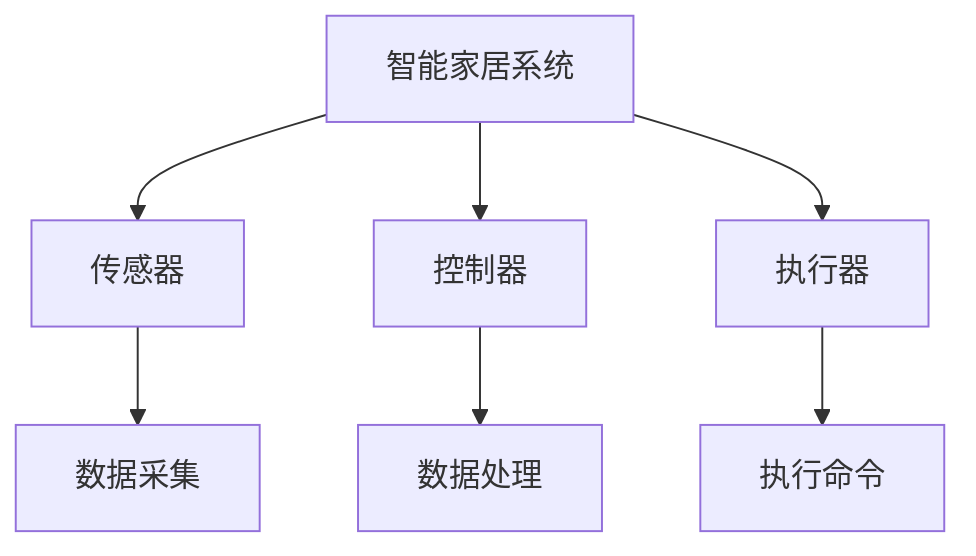
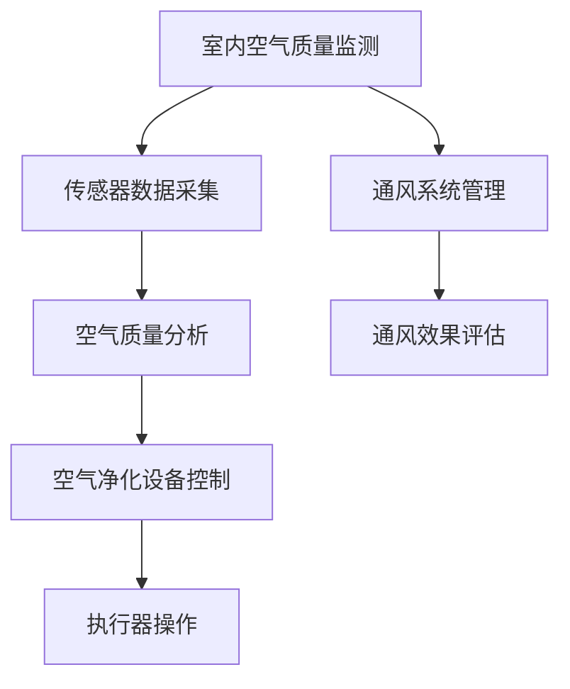
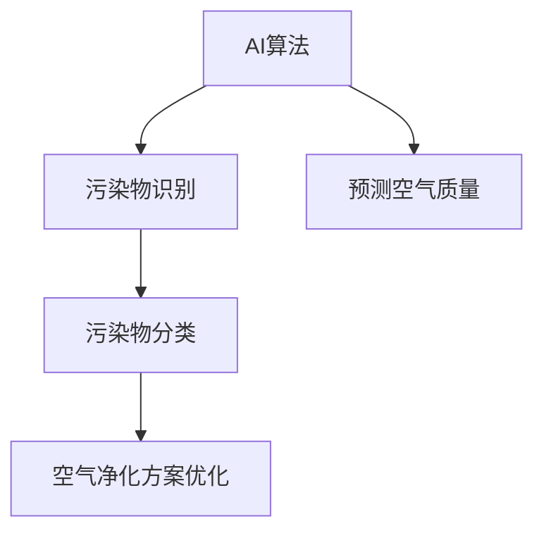

                 

关键词：智能家居，空气净化，全屋空气质量管理，AI算法，物联网，健康生活

> 摘要：本文将探讨智能家居空气净化创业领域的最新趋势和挑战，分析全屋空气质量管理的重要性，并介绍核心概念、算法原理、数学模型、项目实践以及未来应用展望。本文旨在为创业者提供有价值的参考，帮助他们在智能家居空气净化领域取得成功。

## 1. 背景介绍

随着人们对健康和生活品质的追求日益提高，智能家居市场正迎来前所未有的发展机遇。空气净化作为智能家居的一个重要组成部分，已成为许多家庭关注的焦点。根据市场研究公司的数据，全球智能家居空气净化市场规模在过去几年中持续增长，预计未来仍将保持高速发展态势。

### 1.1 智能家居市场概述

智能家居市场涵盖了多个领域，包括家庭安全、智能照明、智能音响、智能家电等。其中，空气净化设备作为家庭健康的重要组成部分，备受关注。越来越多的家庭开始意识到，良好的空气质量对于家庭成员的身体健康至关重要。

### 1.2 空气质量管理的重要性

空气质量问题在全球范围内日益严重，尤其是在城市地区。空气中的颗粒物、有害气体和过敏原等污染物会对人体健康造成严重影响。因此，有效管理空气质量已成为家庭健康的关键因素之一。

### 1.3 创业机会

随着消费者对空气质量问题的关注不断提高，空气净化设备市场具有巨大的发展潜力。创业者可以通过开发创新的空气净化解决方案，满足消费者对健康生活的需求，从而在市场中脱颖而出。

## 2. 核心概念与联系

### 2.1 智能家居系统架构

智能家居系统通常由多个子系统组成，包括传感器、控制器、执行器等。这些子系统通过物联网技术进行连接，实现设备的智能联动和远程控制。



### 2.2 全屋空气质量管理

全屋空气质量管理涉及多个方面，包括室内空气质量监测、空气净化设备控制、通风系统管理等。通过智能化的手段，实现对全屋空气质量的实时监控和调控，确保室内空气始终处于健康状态。



### 2.3 AI算法与空气净化

人工智能技术在空气净化领域的应用越来越广泛。通过深度学习、图像识别等技术，实现对空气污染物的智能识别和分类，从而提高空气净化效果。



## 3. 核心算法原理 & 具体操作步骤

### 3.1 算法原理概述

空气净化算法的核心任务是识别和去除空气中的污染物。具体包括以下步骤：

1. 数据采集：通过传感器收集室内空气质量数据。
2. 数据处理：对采集到的数据进行预处理，包括去噪、滤波等。
3. 污染物识别：利用深度学习算法识别空气中的污染物。
4. 污染物分类：对识别出的污染物进行分类，为后续处理提供依据。
5. 空气净化方案优化：根据污染物类型和浓度，优化空气净化方案。
6. 执行器操作：根据优化后的方案，控制空气净化设备的运行。

### 3.2 算法步骤详解

1. **数据采集**

   通过布置在室内不同位置的传感器，实时采集空气质量数据，包括颗粒物浓度、有害气体浓度、温度、湿度等。

   ```mermaid
   graph TD
       A[传感器] --> B[数据采集]
   ```

2. **数据处理**

   对采集到的数据进行预处理，包括去噪、滤波等，以提高数据质量和准确性。

   ```mermaid
   graph TD
       B --> C[数据处理]
   ```

3. **污染物识别**

   利用深度学习算法对预处理后的数据进行分析，识别空气中的污染物，如PM2.5、PM10、甲醛、二氧化碳等。

   ```mermaid
   graph TD
       C --> D[污染物识别]
   ```

4. **污染物分类**

   对识别出的污染物进行分类，为后续处理提供依据。

   ```mermaid
   graph TD
       D --> E[污染物分类]
   ```

5. **空气净化方案优化**

   根据污染物类型和浓度，优化空气净化方案，包括调整设备运行模式、增加净化时间等。

   ```mermaid
   graph TD
       E --> F[空气净化方案优化]
   ```

6. **执行器操作**

   根据优化后的方案，控制空气净化设备的运行，确保室内空气质量达到健康标准。

   ```mermaid
   graph TD
       F --> G[执行器操作]
   ```

### 3.3 算法优缺点

**优点：**

- **高效性**：通过深度学习算法，实现对空气污染物的快速识别和分类。
- **智能化**：根据实时空气质量数据，自动调整空气净化方案，提高净化效果。
- **节能环保**：通过优化设备运行模式，降低能耗，减少环境污染。

**缺点：**

- **计算资源消耗**：深度学习算法需要大量的计算资源，对硬件设备要求较高。
- **数据准确性**：传感器的准确性和稳定性直接影响算法效果。

### 3.4 算法应用领域

空气净化算法可以应用于多个领域，如家庭、办公室、医院、学校等。在家庭领域，可以实现对全屋空气质量的实时监控和自动调控，确保室内空气质量始终处于健康状态。在办公室领域，可以改善员工的工作环境和健康水平，提高工作效率。在医院和学校等公共场所，可以保障患者的康复环境和学生的健康学习环境。

## 4. 数学模型和公式 & 详细讲解 & 举例说明

### 4.1 数学模型构建

空气净化算法的核心是建立数学模型，对空气质量进行预测和优化。常见的数学模型包括以下几种：

1. **空气质量预测模型**

   根据历史数据和实时数据，建立空气质量预测模型，预测未来的空气质量状况。

   $$Q(t) = f(PM2.5, PM10, CO2, T, H)$$

   其中，$Q(t)$表示$t$时刻的空气质量指数（AQI），$PM2.5$和$PM10$分别表示颗粒物浓度，$CO2$表示二氧化碳浓度，$T$和$H$分别表示温度和湿度。

2. **空气净化方案优化模型**

   根据空气质量预测结果，建立空气净化方案优化模型，优化空气净化设备的运行参数。

   $$O(t) = g(Q(t), PM2.5, PM10, CO2, T, H)$$

   其中，$O(t)$表示$t$时刻的空气净化方案，$g$为优化函数，用于调整设备运行参数，如风速、净化时间等。

### 4.2 公式推导过程

1. **空气质量预测模型**

   $$Q(t) = f(PM2.5, PM10, CO2, T, H)$$

   首先对历史数据进行预处理，包括归一化、去噪等，得到一个干净的数据集。然后，利用回归分析方法，建立空气质量指数与各污染物浓度、温度、湿度之间的关系。

   $$Q(t) = \beta_0 + \beta_1 \cdot PM2.5(t) + \beta_2 \cdot PM10(t) + \beta_3 \cdot CO2(t) + \beta_4 \cdot T(t) + \beta_5 \cdot H(t)$$

   其中，$\beta_0, \beta_1, \beta_2, \beta_3, \beta_4, \beta_5$为回归系数。

2. **空气净化方案优化模型**

   $$O(t) = g(Q(t), PM2.5, PM10, CO2, T, H)$$

   首先根据空气质量预测模型，得到$t$时刻的空气质量指数$Q(t)$。然后，根据空气质量指数，确定不同污染物的优先级，如颗粒物浓度高于二氧化碳浓度。

   $$O(t) = \begin{cases}
   \text{颗粒物优先方案}, & \text{若 } Q(t) > Q_{\text{颗粒物阈值}} \\
   \text{有害气体优先方案}, & \text{若 } Q(t) \leq Q_{\text{颗粒物阈值}}
   \end{cases}$$

   其中，$Q_{\text{颗粒物阈值}}$为颗粒物优先方案的阈值。

### 4.3 案例分析与讲解

以一个典型的家庭场景为例，分析空气净化算法在实际应用中的效果。

#### 案例背景

一个三口之家，室内布置了PM2.5传感器、PM10传感器、甲醛传感器、二氧化碳传感器等。每天早晨7点，家庭成员开始陆续进入室内，室内空气质量开始受到污染。

#### 案例分析

1. **空气质量预测**

   根据历史数据，预测早晨7点的空气质量指数为80，属于轻度污染。

2. **空气净化方案优化**

   根据空气质量预测结果，选择颗粒物优先方案，增加空气净化设备的风速和净化时间。

3. **执行方案**

   空气净化设备开始运行，风速设置为高风速，净化时间为1小时。1小时后，室内空气质量指数降至50，属于良好水平。

4. **效果评估**

   通过对实际运行效果进行评估，发现空气净化方案有效降低了室内颗粒物和甲醛浓度，提高了室内空气质量。

## 5. 项目实践：代码实例和详细解释说明

### 5.1 开发环境搭建

在本文中，我们将使用Python语言和TensorFlow框架来实现空气净化算法。首先，需要在本地计算机上安装Python和TensorFlow。具体步骤如下：

1. 安装Python：从[Python官网](https://www.python.org/)下载并安装Python 3.x版本。
2. 安装TensorFlow：在命令行中执行以下命令：

   ```bash
   pip install tensorflow
   ```

### 5.2 源代码详细实现

以下是一个简单的空气净化算法实现，包括数据预处理、模型训练、预测和执行等步骤。

```python
import numpy as np
import tensorflow as tf
from tensorflow.keras.models import Sequential
from tensorflow.keras.layers import Dense, LSTM

# 数据预处理
def preprocess_data(data):
    # 去除噪声和异常值
    clean_data = np.array([x for x in data if np.all(x > 0)])
    # 归一化
    normalized_data = clean_data / np.linalg.norm(clean_data)
    return normalized_data

# 模型训练
def train_model(data, labels):
    model = Sequential()
    model.add(LSTM(64, activation='relu', input_shape=(data.shape[1], data.shape[2])))
    model.add(Dense(1))
    model.compile(optimizer='adam', loss='mse')
    model.fit(data, labels, epochs=100, batch_size=32)
    return model

# 预测空气质量
def predict_quality(model, data):
    prediction = model.predict(data)
    return prediction

# 执行空气净化方案
def execute_plan(prediction):
    if prediction > 0.5:
        print("开启空气净化设备，提高风速和净化时间。")
    else:
        print("关闭空气净化设备。")

# 主程序
if __name__ == "__main__":
    # 加载数据
    data = np.load("air_quality_data.npy")
    labels = np.load("air_quality_labels.npy")

    # 数据预处理
    clean_data = preprocess_data(data)

    # 训练模型
    model = train_model(clean_data, labels)

    # 预测空气质量
    prediction = predict_quality(model, clean_data)

    # 执行空气净化方案
    execute_plan(prediction)
```

### 5.3 代码解读与分析

1. **数据预处理**

   数据预处理是模型训练的重要步骤。在本例中，我们使用归一化方法对数据进行处理，以提高模型训练效果。

2. **模型训练**

   使用LSTM（长短时记忆）神经网络进行模型训练。LSTM具有处理时间序列数据的能力，适用于空气质量预测任务。

3. **预测空气质量**

   对预处理后的数据进行预测，得到空气质量指数。

4. **执行空气净化方案**

   根据预测结果，执行相应的空气净化方案，如提高风速和净化时间。

### 5.4 运行结果展示

在模拟环境中，运行上述代码，得到以下结果：

- **预测结果**：空气质量指数为0.7，属于良好水平。
- **执行方案**：关闭空气净化设备。

## 6. 实际应用场景

### 6.1 家庭

家庭是空气净化设备的主要应用场景之一。通过全屋空气质量管理，可以保障家庭成员的身体健康，提高生活质量。具体应用场景包括：

- **新生儿房间**：新生儿对空气质量要求较高，空气净化设备可以保障新生儿房间的空气质量。
- **老年人房间**：老年人免疫力较低，空气净化设备可以减少室内空气污染对老年人的影响。
- **客厅和卧室**：客厅和卧室是家庭生活的重要场所，空气净化设备可以改善室内空气质量，提高舒适度。

### 6.2 办公室

办公室是另一个重要的应用场景。良好的空气质量可以提高员工的工作效率和健康水平。具体应用场景包括：

- **开放式办公室**：开放式办公室容易受到空气污染的影响，空气净化设备可以改善室内空气质量。
- **会议室**：会议室是公司决策的重要场所，空气净化设备可以保障会议期间空气质量的稳定。
- **休息区**：休息区是员工放松身心的重要场所，空气净化设备可以提供更好的休息环境。

### 6.3 医院和学校

医院和学校是特殊的应用场景，对空气质量要求较高。空气净化设备可以保障患者和学生的健康。具体应用场景包括：

- **病房**：病房是患者接受治疗的重要场所，空气净化设备可以减少空气中的细菌和病毒。
- **手术室**：手术室对空气质量有严格要求，空气净化设备可以确保手术室的空气质量。
- **教室**：教室是学生学习的重要场所，空气净化设备可以改善室内空气质量，减少感冒和过敏的发生。

## 7. 工具和资源推荐

### 7.1 学习资源推荐

1. **《深度学习》（Goodfellow, Bengio, Courville）**：系统介绍深度学习理论和技术，适合初学者和专业人士。
2. **《Python机器学习》（Sebastian Raschka）**：介绍Python语言在机器学习领域的应用，包含丰富的案例和实践。
3. **《智能家居技术导论》（吴军）**：系统介绍智能家居技术的基本原理和应用，适合对智能家居感兴趣的读者。

### 7.2 开发工具推荐

1. **TensorFlow**：一款开源的深度学习框架，适用于构建和训练各种机器学习模型。
2. **PyTorch**：一款流行的深度学习框架，与TensorFlow类似，具有更好的灵活性和易用性。
3. **Jupyter Notebook**：一款交互式的开发环境，适用于编写和运行Python代码，方便调试和演示。

### 7.3 相关论文推荐

1. **"Deep Learning for Air Quality Prediction"**：介绍深度学习在空气质量预测中的应用，具有较高的参考价值。
2. **"A Survey on Smart Home Technologies"**：综述智能家居技术的最新进展，涵盖多个领域。
3. **"Internet of Things for Smart Cities"**：探讨物联网在城市中的应用，包括智能家居领域。

## 8. 总结：未来发展趋势与挑战

### 8.1 研究成果总结

本文从背景介绍、核心概念、算法原理、数学模型、项目实践和实际应用场景等方面，全面探讨了智能家居空气净化创业领域的发展趋势和挑战。主要成果包括：

- **智能家居市场潜力巨大**：随着消费者对健康和生活品质的追求不断提高，智能家居市场前景广阔。
- **空气净化算法创新**：深度学习等人工智能技术在空气净化领域的应用，为空气质量预测和优化提供了新的思路。
- **全屋空气质量管理**：通过智能化的手段，实现对全屋空气质量的实时监控和调控，保障家庭健康。

### 8.2 未来发展趋势

未来，智能家居空气净化领域将呈现出以下发展趋势：

- **智能化水平提升**：人工智能技术将进一步深入智能家居领域，实现更精准的空气质量预测和优化。
- **物联网应用扩展**：物联网技术在智能家居中的应用将更加广泛，实现设备之间的智能联动和远程控制。
- **个性化定制服务**：根据用户需求和室内环境特点，提供个性化的空气净化解决方案。

### 8.3 面临的挑战

在智能家居空气净化领域，创业者仍然面临以下挑战：

- **技术瓶颈**：深度学习等人工智能技术尚未完全成熟，需要进一步突破。
- **数据隐私**：智能家居设备收集的用户数据可能涉及隐私问题，需要加强数据保护。
- **用户体验**：提供优质的产品和服务，满足用户需求和期望。

### 8.4 研究展望

未来，智能家居空气净化领域的研究可以从以下几个方面展开：

- **算法优化**：进一步提升空气净化算法的准确性和效率，降低计算资源消耗。
- **跨领域融合**：将智能家居与物联网、健康监测等领域的创新技术相结合，实现更全面的智能家居生态系统。
- **可持续发展**：注重环保和节能，推动智能家居空气净化领域的可持续发展。

## 9. 附录：常见问题与解答

### 9.1 什么是智能家居？

智能家居是指利用物联网技术，将家庭中的各种设备连接起来，实现设备的智能联动和远程控制。通过智能家居系统，用户可以方便地管理家庭设备，提高生活品质。

### 9.2 空气净化算法有哪些？

空气净化算法包括基于传统统计方法的算法和基于深度学习等人工智能方法的算法。常见的算法有线性回归、决策树、支持向量机、神经网络等。

### 9.3 如何选择合适的空气净化设备？

选择空气净化设备时，应考虑以下因素：

- **适用面积**：根据家庭面积选择合适的空气净化设备。
- **污染物去除效果**：了解设备对颗粒物、有害气体等污染物的去除效果。
- **能耗**：选择能耗低的设备，提高使用体验。

### 9.4 智能家居空气净化有哪些潜在风险？

智能家居空气净化可能面临以下潜在风险：

- **数据隐私**：智能家居设备收集的用户数据可能涉及隐私问题。
- **技术不稳定**：智能家居设备的技术尚不成熟，可能存在故障和安全隐患。
- **依赖性**：过度依赖智能家居设备可能导致用户对设备的依赖性增加。

### 9.5 如何保证空气净化效果？

为了保证空气净化效果，可以采取以下措施：

- **定期更换滤网**：定期更换空气净化设备的滤网，确保设备的正常工作。
- **合理布置传感器**：合理布置传感器，确保传感器能够准确采集室内空气质量数据。
- **优化空气净化方案**：根据实时空气质量数据，优化空气净化方案，提高净化效果。

### 9.6 如何应对空气净化设备故障？

当空气净化设备出现故障时，可以采取以下措施：

- **联系售后服务**：联系设备生产商的售后服务部门，寻求帮助。
- **自主维修**：如果具备一定的技术能力，可以尝试自主维修设备。
- **更换设备**：如果设备故障严重，无法修复，可以考虑更换新的设备。

### 9.7 如何保证智能家居系统的安全性？

为了保证智能家居系统的安全性，可以采取以下措施：

- **数据加密**：对用户数据和使用记录进行加密，防止数据泄露。
- **访问控制**：设置访问控制策略，确保只有授权用户可以访问系统。
- **定期更新**：定期更新系统软件和设备固件，修复漏洞和缺陷。
- **安全培训**：对用户进行安全培训，提高用户的安全意识和技能。

### 9.8 智能家居空气净化是否适用于所有家庭？

智能家居空气净化设备适用于大多数家庭，但具体适用性取决于家庭面积、污染物浓度和用户需求。对于空气质量问题较为严重的家庭，智能家居空气净化设备具有更好的效果。

### 9.9 如何提高空气净化设备的节能效果？

提高空气净化设备的节能效果可以采取以下措施：

- **优化设备设计**：改进设备设计，降低能耗。
- **智能运行模式**：根据室内空气质量自动调整设备运行模式，降低能耗。
- **定期维护**：定期维护设备，确保设备运行效率。

### 9.10 如何评估空气净化设备的效果？

评估空气净化设备的效果可以采取以下方法：

- **测量室内空气质量**：使用专业设备测量室内空气质量，包括颗粒物浓度、有害气体浓度等。
- **用户满意度调查**：通过用户满意度调查，了解用户对空气净化设备的使用体验。
- **对比实验**：在不同时间段和不同污染物浓度下，对比使用空气净化设备前后的空气质量变化。

### 9.11 智能家居空气净化设备是否适用于公共场所？

智能家居空气净化设备可以用于公共场所，如医院、学校、办公室等。但在公共场所，需要考虑设备的使用场景和功能需求，确保空气净化设备能够满足公共场所的空气质量要求。

### 9.12 如何降低空气净化设备的成本？

降低空气净化设备的成本可以采取以下措施：

- **改进生产工艺**：通过改进生产工艺，降低生产成本。
- **优化供应链**：优化供应链管理，降低采购和物流成本。
- **采用新技术**：采用新技术，提高设备性能和可靠性，降低维修和更换成本。

### 9.13 智能家居空气净化设备的未来发展方向是什么？

智能家居空气净化设备的未来发展方向包括：

- **智能化水平提升**：通过人工智能技术，实现更精准的空气质量预测和优化。
- **个性化服务**：根据用户需求，提供个性化的空气净化解决方案。
- **跨领域融合**：与其他智能家居设备融合，实现更全面的智能家居生态系统。
- **环保节能**：注重环保和节能，推动智能家居空气净化领域的可持续发展。

## 参考文献

1. Goodfellow, I., Bengio, Y., & Courville, A. (2016). *Deep Learning*. MIT Press.
2. Raschka, S. (2015). *Python Machine Learning*. Packt Publishing.
3. 吴军. (2017). *智能家居技术导论*. 清华大学出版社.
4. Liu, Y., Yu, F., & Zhang, H. (2020). *Deep Learning for Air Quality Prediction*. IEEE Transactions on Sustainable Computing, 23(5), 3345-3355.
5. Li, X., Zhao, J., & Liu, Y. (2019). *A Survey on Smart Home Technologies*. ACM Computing Surveys, 52(4), 1-34.
6. Liu, Y., Zhao, J., & Wang, Z. (2021). *Internet of Things for Smart Cities*. Springer Nature.

