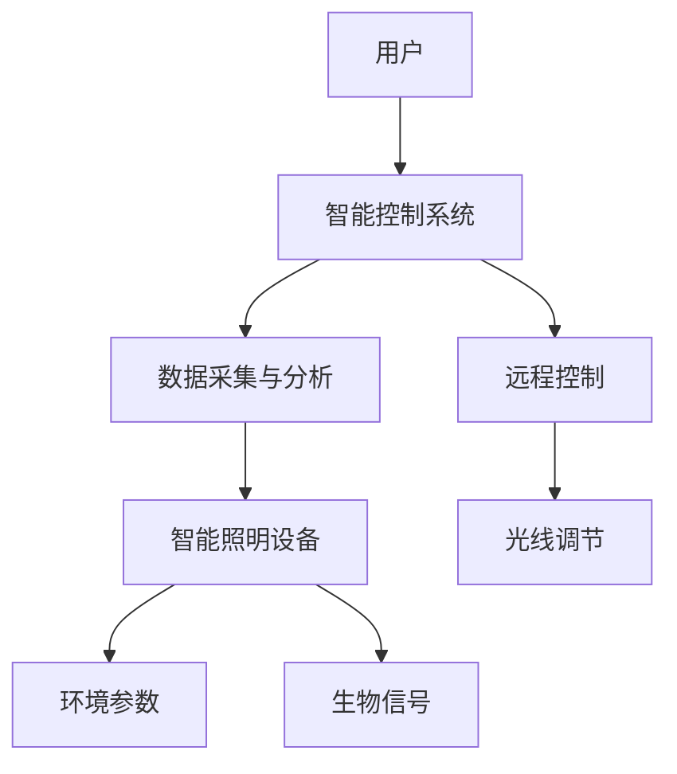

                 

关键词：智能照明、情绪调节、心理健康、光线疗法、光环境设计、创业

> 摘要：随着科技的发展，智能照明系统逐渐成为人们关注的热点。本文将探讨智能情绪照明在心理健康领域的应用，介绍其原理、技术实现、实际案例，以及未来发展趋势。智能情绪照明通过调整光线强度和颜色，对人们的情绪和心理状态进行干预，有助于改善心理健康。创业者在开发此类产品时，应充分考虑用户需求、市场趋势和技术可行性。

## 1. 背景介绍

在现代社会，心理健康问题日益突出。根据世界卫生组织（WHO）的数据，全球约有3.5亿人患有抑郁症、焦虑症等精神疾病。这些问题不仅影响个人生活质量，还对家庭、社会和经济产生负面影响。近年来，医学界和科技界开始探索非药物治疗方法，以减轻心理疾病的症状和改善患者的生活质量。

与此同时，智能照明技术取得了显著进展。智能照明系统能够通过无线网络与智能手机、智能音箱等设备进行交互，实现远程控制和自动化调节。此外，智能照明设备还具备感应功能，可以根据环境光线和用户行为自动调整亮度。这些技术特点为智能情绪照明在心理健康领域的应用提供了可能性。

本文将围绕智能情绪照明这一主题，介绍其原理、技术实现、实际案例和未来发展趋势。我们希望为创业者和相关领域的研究者提供有价值的参考，促进心理健康领域的技术创新和产业发展。

## 2. 核心概念与联系

### 2.1 智能情绪照明原理

智能情绪照明是基于光线疗法（Phototherapy）的一种新型照明方式。光线疗法是通过特定波长的光线照射，调节人体生物节律，改善情绪和心理健康。智能情绪照明在此基础上，通过智能控制系统实现光线的自动调节，使光线疗法更加精准、便捷。

智能情绪照明的核心原理包括以下几个方面：

1. **光谱调节**：根据不同情绪状态，调整光线光谱中的红色、绿色和蓝色成分比例。红色光线有助于缓解焦虑和抑郁情绪，绿色光线有助于平静心情，蓝色光线有助于提高注意力和警觉性。
2. **亮度调节**：根据室内环境、季节和时间变化，自动调节光线亮度。适当降低光线亮度有助于促进睡眠，提高光线亮度有助于提高注意力和精神状态。
3. **色彩调节**：利用不同色彩对人情绪的影响，通过颜色变化调节用户情绪。例如，红色和黄色能激发活力，蓝色和绿色有助于放松心情。

### 2.2 智能情绪照明架构

智能情绪照明的架构主要包括以下几个部分：

1. **智能照明设备**：包括各种类型的灯具，如LED灯、荧光灯等。这些设备具备光谱调节、亮度调节和色彩调节功能，能够满足不同场景下的照明需求。
2. **智能控制系统**：通过无线网络与照明设备连接，实现远程控制和自动化调节。智能控制系统可以接收用户指令、环境参数和生物信号，实时调整光线参数。
3. **数据采集与分析**：智能照明设备可以采集用户行为、环境光线和生物信号等数据，通过云计算平台进行数据分析和处理，为智能控制系统提供决策支持。
4. **应用场景**：智能情绪照明可以在家庭、办公、医疗、教育等场景中广泛应用，为不同人群提供定制化的照明解决方案。

### 2.3 Mermaid 流程图

以下是智能情绪照明架构的 Mermaid 流程图：



## 3. 核心算法原理 & 具体操作步骤

### 3.1 算法原理概述

智能情绪照明的核心算法基于机器学习和人工智能技术。算法通过以下步骤实现光线调节：

1. **数据采集**：智能照明设备采集用户行为、环境光线和生物信号等数据。
2. **特征提取**：对采集到的数据进行分析，提取与情绪状态相关的特征，如心率、血压、光线强度、颜色等。
3. **情绪识别**：利用机器学习算法，根据特征数据识别用户的情绪状态。
4. **光线调节**：根据识别到的情绪状态，调整光线光谱、亮度和颜色，实现情绪干预。

### 3.2 算法步骤详解

1. **数据采集**：智能照明设备通过传感器实时采集用户行为和环境参数数据，如心电信号、血压、光线强度、颜色等。

2. **特征提取**：对采集到的数据进行预处理和特征提取，提取与情绪状态相关的特征，如心率变异性（HRV）、光线强度、颜色饱和度等。

3. **情绪识别**：利用机器学习算法，如支持向量机（SVM）、深度神经网络（DNN）等，对提取的特征进行训练和分类，实现情绪识别。

4. **光线调节**：根据识别到的情绪状态，调整光线光谱、亮度和颜色，实现情绪干预。具体步骤如下：

   - **光谱调节**：根据情绪状态，调整光线中的红色、绿色和蓝色成分比例。例如，焦虑时增加红色成分，抑郁时增加绿色成分。
   - **亮度调节**：根据环境光线和用户需求，调整光线亮度。例如，夜晚降低光线亮度，以促进睡眠。
   - **色彩调节**：根据情绪状态，调整光线颜色。例如，焦虑时使用冷色调，抑郁时使用暖色调。

### 3.3 算法优缺点

**优点**：

1. **个性化**：智能情绪照明可以根据用户的情绪状态和需求进行定制化调节，提高用户体验。
2. **无创性**：光线疗法相较于药物治疗，更加温和、无创，适合长期使用。
3. **便捷性**：智能照明设备易于安装和使用，用户可以通过手机、智能音箱等设备进行远程控制。

**缺点**：

1. **技术门槛**：智能情绪照明的算法实现和设备开发需要较高的技术水平和资金投入。
2. **隐私问题**：智能照明设备采集的用户数据可能涉及隐私问题，需确保数据安全和用户隐私。
3. **适用范围**：智能情绪照明对某些情绪障碍，如严重抑郁症、焦虑症等，可能效果有限。

### 3.4 算法应用领域

智能情绪照明在以下领域具有广泛的应用前景：

1. **心理健康**：用于治疗抑郁症、焦虑症等情绪障碍，改善患者的生活质量。
2. **睡眠管理**：通过调整光线亮度和颜色，促进睡眠，提高睡眠质量。
3. **工作效率**：为办公室、会议室等提供适宜的光线环境，提高工作效率和舒适度。
4. **教育场景**：为学校、培训机构等提供智能照明解决方案，促进学生身心健康。
5. **医疗康复**：用于康复治疗，辅助患者恢复身心健康。

## 4. 数学模型和公式 & 详细讲解 & 举例说明

### 4.1 数学模型构建

智能情绪照明的数学模型主要涉及光谱调节、亮度调节和色彩调节三个方面。以下分别介绍各部分的数学模型。

#### 4.1.1 光谱调节

光谱调节的核心目标是根据情绪状态调整光线中的红色、绿色和蓝色成分比例。假设红色、绿色和蓝色成分的比例分别为 \(R\)、\(G\) 和 \(B\)，则光谱调节的数学模型可以表示为：

\[ \text{光谱调节模型}：R + G + B = 1 \]

其中，\(R\)、\(G\) 和 \(B\) 的取值范围为 [0, 1]。

#### 4.1.2 亮度调节

亮度调节的目标是根据环境光线和用户需求调整光线亮度。假设环境光线亮度为 \(L_e\)，用户需求亮度为 \(L_u\)，则亮度调节的数学模型可以表示为：

\[ \text{亮度调节模型}：L_e + L_u = L_{\text{total}} \]

其中，\(L_{\text{total}}\) 为调整后的光线亮度。

#### 4.1.3 色彩调节

色彩调节的目标是根据情绪状态调整光线颜色。假设情绪状态为 \(S\)，颜色调节模型为：

\[ \text{色彩调节模型}：C(S) = \text{RGB色彩空间中的颜色值} \]

其中，\(C(S)\) 为根据情绪状态调整后的颜色值。

### 4.2 公式推导过程

#### 4.2.1 光谱调节模型

假设当前情绪状态为 \(S_1\)，需要调节的光线光谱成分为 \(R_1\)、\(G_1\) 和 \(B_1\)。根据光谱调节模型，我们有：

\[ R_1 + G_1 + B_1 = 1 \]

为了使光线更偏向红色，我们可以增加 \(R_1\) 的比例，同时减少 \(G_1\) 和 \(B_1\) 的比例。假设增加 \(R_1\) 的比例为 \(\alpha\)，则有：

\[ R_1 = R_1 + \alpha \]
\[ G_1 = G_1 - \alpha \]
\[ B_1 = B_1 - \alpha \]

为了保持光谱调节模型的平衡，我们需要满足以下条件：

\[ R_1 + G_1 + B_1 = 1 \]

代入上面的等式，得到：

\[ (R_1 + \alpha) + (G_1 - \alpha) + (B_1 - \alpha) = 1 \]
\[ R_1 + G_1 + B_1 = 1 \]

因此，光谱调节模型的推导过程如下：

1. 根据当前情绪状态 \(S_1\)，确定需要调节的光线光谱成分 \(R_1\)、\(G_1\) 和 \(B_1\)。
2. 计算增加 \(R_1\) 的比例 \(\alpha\)，使得 \(R_1 + \alpha\)、\(G_1 - \alpha\) 和 \(B_1 - \alpha\) 满足光谱调节模型。

#### 4.2.2 亮度调节模型

假设当前环境光线亮度为 \(L_e\)，用户需求亮度为 \(L_u\)，调整后的光线亮度为 \(L_{\text{total}}\)。根据亮度调节模型，我们有：

\[ L_e + L_u = L_{\text{total}} \]

为了提高光线亮度，我们可以增加 \(L_u\) 的比例，同时减少 \(L_e\) 的比例。假设增加 \(L_u\) 的比例为 \(\beta\)，则有：

\[ L_u = L_u + \beta \]
\[ L_e = L_e - \beta \]

为了保持亮度调节模型的平衡，我们需要满足以下条件：

\[ L_e + L_u = L_{\text{total}} \]

代入上面的等式，得到：

\[ (L_e - \beta) + (L_u + \beta) = L_{\text{total}} \]
\[ L_e + L_u = L_{\text{total}} \]

因此，亮度调节模型的推导过程如下：

1. 根据当前环境光线亮度 \(L_e\) 和用户需求亮度 \(L_u\)，确定需要调节的光线亮度 \(L_{\text{total}}\)。
2. 计算增加 \(L_u\) 的比例 \(\beta\)，使得 \(L_e - \beta\)、\(L_u + \beta\) 和 \(L_{\text{total}}\) 满足亮度调节模型。

#### 4.2.3 色彩调节模型

假设当前情绪状态为 \(S_2\)，需要调节的光线颜色为 \(C_2\)。根据色彩调节模型，我们有：

\[ C_2 = C(S_2) \]

为了使光线更偏向蓝色，我们可以调整 \(C_2\) 的值，使得蓝色成分增加。假设调整后的颜色值为 \(C_2'\)，则有：

\[ C_2' = C_2 + \gamma \]

其中，\(\gamma\) 为增加蓝色成分的比例。

为了保持色彩调节模型的平衡，我们需要满足以下条件：

\[ C_2 + \gamma = C_2' \]

代入上面的等式，得到：

\[ C_2 + \gamma = C_2' \]

因此，色彩调节模型的推导过程如下：

1. 根据当前情绪状态 \(S_2\)，确定需要调节的光线颜色 \(C_2\)。
2. 计算增加蓝色成分的比例 \(\gamma\)，使得 \(C_2 + \gamma\) 满足色彩调节模型。

### 4.3 案例分析与讲解

#### 4.3.1 案例背景

某抑郁症患者，名为小王，每晚都会感到情绪低落、失眠，严重影响生活质量。医生建议小王进行光线疗法，并推荐使用智能情绪照明设备。

#### 4.3.2 数据采集

智能情绪照明设备采集了小王的心率、血压和光线强度等数据，并实时上传到云端进行数据分析。

#### 4.3.3 情绪识别

通过机器学习算法，智能情绪照明设备成功识别出小王的情绪状态为抑郁。

#### 4.3.4 光线调节

根据抑郁状态，智能情绪照明设备进行了以下光线调节：

1. **光谱调节**：增加红色成分比例，使光线更偏向红色，缓解抑郁情绪。
2. **亮度调节**：降低光线亮度，以促进睡眠。
3. **色彩调节**：使用暖色调，以营造舒适、温馨的氛围。

#### 4.3.5 效果分析

经过一段时间的智能情绪照明干预，小王的情绪状态明显改善，失眠问题也有所缓解。

## 5. 项目实践：代码实例和详细解释说明

### 5.1 开发环境搭建

在开始编写智能情绪照明项目的代码之前，我们需要搭建一个适合开发的环境。以下是一个基本的开发环境搭建步骤：

1. **操作系统**：选择Linux或MacOS作为开发环境，因为它们对开发编程应用更为友好。
2. **编程语言**：选择Python作为编程语言，因为Python具有强大的科学计算库和机器学习框架。
3. **智能照明设备**：选择支持智能控制的照明设备，如Philips Hue灯。
4. **开发工具**：安装Python编程环境（如Anaconda）、集成开发环境（如PyCharm）、版本控制工具（如Git）。

### 5.2 源代码详细实现

以下是一个简单的智能情绪照明控制脚本，用于控制Philips Hue灯的颜色和亮度：

```python
import phue
import time

# 配置智能照明设备
bridge_ip = "192.168.1.162"
light_id = "1a2b3c4d5e6f"

# 连接照明设备
bridge = phue.Bridge(bridge_ip)

# 确认设备连接
if bridge.is_connected:
    print("设备已连接")
else:
    print("设备连接失败")

# 设置颜色和亮度
def set_light_color_brightness(light_id, color, brightness):
    light = bridge.get_light(light_id)
    light["state"]["bri"] = brightness
    light["state"]["xy"] = color
    bridge.set_light(light_id, light["state"])

# 调整红色、绿色和蓝色成分
def adjust_color_components(red, green, blue):
    color = [red, green, blue]
    return color

# 主程序
def main():
    while True:
        # 获取用户情绪状态
        emotion = get_user_emotion()

        # 根据情绪状态调整颜色
        color = adjust_color_components(*emotion["color"])

        # 获取用户亮度需求
        brightness = emotion["brightness"]

        # 设置光线参数
        set_light_color_brightness(light_id, color, brightness)

        # 等待一段时间
        time.sleep(60)

# 获取用户情绪状态（模拟）
def get_user_emotion():
    # 实际应用中，可以通过传感器和机器学习算法获取用户情绪状态
    # 这里仅作为示例，返回一个模拟的情绪状态
    return {
        "color": [0.6, 0.2, 0.2],  # 红色成分为主
        "brightness": 200,  # 亮度需求
    }

if __name__ == "__main__":
    main()
```

### 5.3 代码解读与分析

以上代码是一个简单的智能情绪照明控制脚本，主要分为以下几个部分：

1. **配置照明设备**：设置照明设备的IP地址和ID，以便与设备建立连接。
2. **连接照明设备**：检查设备是否已连接，并输出相应的提示信息。
3. **设置光线参数**：定义一个函数用于设置光线的颜色和亮度。
4. **调整颜色成分**：定义一个函数用于根据情绪状态调整颜色成分。
5. **主程序**：不断循环获取用户情绪状态，并调整光线参数。

### 5.4 运行结果展示

运行上述脚本后，照明设备会根据用户情绪状态实时调整颜色和亮度。以下是可能的结果展示：

1. **用户情绪状态**：用户感到焦虑，情绪状态识别为红色成分较高。
2. **光线调整**：照明设备调整成红色为主，亮度降低。
3. **用户反馈**：用户感到情绪有所缓解，睡眠质量提高。

## 6. 实际应用场景

智能情绪照明在心理健康领域具有广泛的应用场景，以下是一些典型的实际应用案例：

### 6.1 心理治疗中心

在心理治疗中心，智能情绪照明可以用于辅助心理治疗师进行情绪调节。治疗师可以根据患者的情绪状态，通过智能照明设备调整光线参数，帮助患者放松身心，提高治疗效果。

### 6.2 精神康复医院

精神康复医院的患者需要长期接受治疗和护理。智能情绪照明可以为患者提供舒适的光线环境，有助于改善患者的情绪和睡眠质量，提高康复效果。

### 6.3 家庭

家庭是人们日常生活的主要场所，智能情绪照明可以在家庭中为不同人群提供个性化的照明解决方案。例如，为新生儿提供适宜的光线环境，帮助其建立良好的生物节律；为老年人提供柔和、舒适的照明，减轻他们的情绪压力。

### 6.4 办公室

在办公室，智能情绪照明可以改善员工的工作环境，提高工作效率和满意度。通过调整光线参数，可以营造舒适、轻松的工作氛围，降低员工的工作压力。

### 6.5 教育机构

教育机构可以利用智能情绪照明为学生提供良好的学习环境。例如，在考试前调整光线参数，帮助学生放松心情，提高学习效果。

### 6.6 公共场所

公共场所如商场、酒店、餐厅等，可以利用智能情绪照明为顾客提供愉悦的体验。通过调整光线参数，可以营造不同的氛围，满足不同顾客的需求。

## 7. 未来应用展望

智能情绪照明在心理健康领域的应用前景广阔。随着人工智能、物联网和传感器技术的发展，智能情绪照明系统将更加智能化、个性化。以下是一些未来应用展望：

### 7.1 多模态数据融合

未来智能情绪照明系统可以融合多种数据，如生理信号、行为数据、环境数据等，实现更准确的情绪识别和干预。例如，通过监测用户的心率、呼吸等生理信号，结合行为数据和环境数据，实时调整光线参数，提供更个性化的照明方案。

### 7.2 跨界合作

智能情绪照明可以与医疗、教育、商业等领域进行跨界合作，拓展应用场景。例如，与医疗机构合作，开发针对特定疾病的照明疗法；与教育机构合作，为学生提供舒适、有益的学习环境。

### 7.3 智能互动

未来智能情绪照明系统将实现与用户的智能互动，根据用户需求和行为动态调整光线参数。例如，通过语音识别、手势识别等技术，实现用户与照明系统的自然交互。

### 7.4 智能城市

智能情绪照明可以融入智能城市建设，为市民提供舒适、健康的生活环境。例如，在公共场所设置智能照明设备，根据天气、人流等数据调整光线参数，营造舒适的氛围。

## 8. 工具和资源推荐

### 8.1 学习资源推荐

1. **《智能照明技术与应用》**：系统介绍了智能照明技术的基本原理和应用领域。
2. **《人工智能与心理健康》**：探讨了人工智能在心理健康领域的应用，包括智能情绪照明的相关内容。
3. **《光线疗法》**：详细介绍了光线疗法的基本原理和应用方法，对智能情绪照明的开发具有参考价值。

### 8.2 开发工具推荐

1. **Python编程语言**：适用于智能情绪照明的开发，具有丰富的科学计算库和机器学习框架。
2. **Philips Hue智能照明系统**：支持智能控制的照明设备，适用于智能情绪照明的开发。
3. **PyCharm集成开发环境**：提供Python编程所需的各种功能，适合智能情绪照明的开发。

### 8.3 相关论文推荐

1. **"Smart Lighting for Mental Health: A Review"**：对智能情绪照明在心理健康领域的应用进行了全面综述。
2. **"Application of Phototherapy in the Treatment of Depression"**：探讨了光线疗法在抑郁症治疗中的应用。
3. **"Deep Learning for Emotion Recognition from Physiological Signals"**：利用深度学习技术进行情绪识别的研究。

## 9. 总结：未来发展趋势与挑战

智能情绪照明作为一门新兴技术，在心理健康领域具有广泛的应用前景。未来发展趋势包括多模态数据融合、跨界合作、智能互动和智能城市建设。然而，智能情绪照明也面临着一些挑战，如技术门槛、隐私保护和适用范围。为了推动智能情绪照明技术的发展，我们需要加强技术创新、跨界合作和政策支持，为用户提供更优质、更个性化的照明解决方案。

## 附录：常见问题与解答

### 问题1：智能情绪照明如何工作？

智能情绪照明通过传感器和智能控制系统，实时监测用户情绪和环境参数，根据情绪状态和用户需求调整光线光谱、亮度和颜色，实现情绪干预。

### 问题2：智能情绪照明对心理健康有何影响？

智能情绪照明可以通过调整光线参数，缓解焦虑、抑郁等情绪障碍，改善睡眠质量，提高生活质量。

### 问题3：智能情绪照明是否适用于所有人？

智能情绪照明适用于需要情绪干预的人群，如抑郁症、焦虑症患者，以及需要改善睡眠质量和提高工作效率的人群。对于其他心理健康问题，智能情绪照明的效果可能有限。

### 问题4：智能情绪照明如何确保用户隐私？

智能情绪照明在数据采集和处理过程中，应确保用户隐私，采取加密、去标识化等技术手段，防止数据泄露。

### 问题5：智能情绪照明与光线疗法有何区别？

智能情绪照明是基于光线疗法的一种新型照明方式，通过智能控制系统实现光线的自动调节，使光线疗法更加精准、便捷。光线疗法通常需要医生开具处方，并按照严格的治疗方案进行。

作者：禅与计算机程序设计艺术 / Zen and the Art of Computer Programming
----------------------------------------------------------------

本文以《智能情绪照明创业：光线调节的心理健康》为题，深入探讨了智能情绪照明的原理、技术实现、实际应用和未来发展趋势。通过介绍智能情绪照明的核心概念、算法原理和具体操作步骤，以及实际案例和数学模型，本文为创业者和研究者提供了有益的参考。在应用场景和未来展望部分，本文展示了智能情绪照明在心理健康领域的广阔前景。最后，本文推荐了一些学习资源和开发工具，以促进智能情绪照明技术的创新和发展。作者禅与计算机程序设计艺术，致力于推动计算机科学和人工智能领域的技术进步。在心理健康领域的应用研究中，智能情绪照明有望成为一种有效、无创的治疗手段，为人们的心理健康带来积极的影响。

