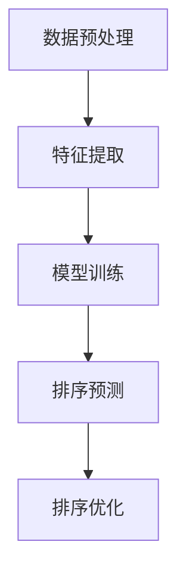

                 

关键词：智能排序，用户满意度，算法原理，数学模型，实际应用，未来展望

> 摘要：本文旨在探讨智能排序技术在用户满意度方面的影响。通过对核心概念、算法原理、数学模型和实际应用的深入分析，我们将揭示智能排序技术在提升用户体验中的关键作用，并展望其未来的发展趋势与挑战。

## 1. 背景介绍

随着互联网技术的飞速发展，数据处理和分析的需求日益增长。排序技术作为数据预处理的重要手段，在众多领域得到了广泛应用。传统的排序算法如冒泡排序、快速排序等虽然经典，但在处理大规模数据时效率低下，难以满足现代用户对快速响应的需求。为了解决这一问题，智能排序技术应运而生。

智能排序技术通过引入人工智能、机器学习等先进算法，实现了对大规模数据的快速高效排序。这种技术不仅提高了数据处理速度，还能够在不同场景下自适应地调整排序策略，从而更好地满足用户需求。然而，智能排序技术的广泛应用也带来了一系列挑战，特别是在用户满意度方面。

用户满意度是衡量智能排序技术优劣的重要指标。用户满意度高，意味着排序结果准确、响应快速、用户体验良好；反之，则可能导致用户流失、满意度下降。因此，深入探讨智能排序技术的用户满意度，对于优化排序算法、提升用户体验具有重要意义。

## 2. 核心概念与联系

### 2.1. 排序算法概述

排序算法是计算机科学中一种基础而重要的算法，其主要目的是将一组数据按照某种规则进行排列。常见的排序算法包括冒泡排序、选择排序、插入排序、快速排序等。这些算法各有优缺点，适用于不同的场景。

### 2.2. 智能排序算法原理

智能排序算法是基于机器学习和人工智能的排序技术，其核心思想是通过学习用户行为、数据分布等特征，自适应地调整排序策略。智能排序算法通常包括以下几个步骤：

1. 数据预处理：对原始数据进行清洗、去重、去噪等处理，确保数据质量。
2. 特征提取：从数据中提取与排序目标相关的特征，如用户评分、点击率、购买频率等。
3. 模型训练：利用机器学习算法，如决策树、神经网络等，训练排序模型。
4. 排序预测：根据训练好的模型，预测数据之间的排序关系。
5. 排序优化：根据预测结果，对排序结果进行优化调整，提高排序质量。

### 2.3. 智能排序架构

智能排序架构主要包括数据层、算法层和应用层。数据层负责数据采集、存储和处理；算法层负责排序模型的训练和预测；应用层则负责将排序结果应用到实际场景中，如图库、推荐系统等。

### 2.4. Mermaid 流程图

以下是一个简单的 Mermaid 流程图，展示了智能排序算法的基本流程：



## 3. 核心算法原理 & 具体操作步骤

### 3.1. 算法原理概述

智能排序算法的核心原理是利用机器学习技术，从数据中学习排序规则，并在不同场景下自适应地调整排序策略。具体来说，智能排序算法包括以下几个关键步骤：

1. 数据预处理：对原始数据进行清洗、去重、去噪等处理，确保数据质量。
2. 特征提取：从数据中提取与排序目标相关的特征，如用户评分、点击率、购买频率等。
3. 模型训练：利用机器学习算法，如决策树、神经网络等，训练排序模型。
4. 排序预测：根据训练好的模型，预测数据之间的排序关系。
5. 排序优化：根据预测结果，对排序结果进行优化调整，提高排序质量。

### 3.2. 算法步骤详解

#### 3.2.1. 数据预处理

数据预处理是智能排序算法的第一步，其目的是去除数据中的噪声和异常值，提高数据质量。具体操作包括以下步骤：

1. 数据清洗：去除无效数据、重复数据和异常值。
2. 数据转换：将不同类型的数据转换为同一类型，如将文本转换为数值。
3. 数据归一化：将数据归一化到相同的尺度，以便于后续处理。

#### 3.2.2. 特征提取

特征提取是智能排序算法的关键步骤，其目的是从数据中提取与排序目标相关的特征。常用的特征提取方法包括：

1. 用户特征：如用户年龄、性别、地理位置等。
2. 商品特征：如商品价格、品牌、类别等。
3. 行为特征：如用户浏览记录、购买记录、评分等。

#### 3.2.3. 模型训练

模型训练是智能排序算法的核心步骤，其目的是利用历史数据训练排序模型。常用的机器学习算法包括：

1. 决策树：通过划分特征空间，构建决策树模型。
2. 神经网络：通过多层神经网络，拟合数据分布。
3. 协同过滤：通过用户和商品的相似性，预测排序关系。

#### 3.2.4. 排序预测

排序预测是智能排序算法的关键步骤，其目的是根据训练好的模型，预测数据之间的排序关系。具体操作包括：

1. 输入待排序数据：将待排序数据输入到模型中。
2. 模型预测：利用训练好的模型，预测数据之间的排序关系。
3. 排序结果：根据预测结果，生成排序序列。

#### 3.2.5. 排序优化

排序优化是智能排序算法的最后一个步骤，其目的是根据预测结果，对排序结果进行优化调整，提高排序质量。具体操作包括：

1. 结果评估：对排序结果进行评估，如计算准确率、召回率等指标。
2. 优化调整：根据评估结果，调整排序策略，提高排序质量。
3. 重排序：根据优化结果，重新生成排序序列。

### 3.3. 算法优缺点

智能排序算法具有以下优点：

1. 高效性：利用机器学习技术，实现快速排序。
2. 自适应性：根据不同场景，自适应地调整排序策略。
3. 可扩展性：适用于各种规模的数据。

然而，智能排序算法也存在一些缺点：

1. 复杂性：算法实现较为复杂，对开发人员要求较高。
2. 数据依赖：算法效果受数据质量影响较大。
3. 难以解释：模型决策过程难以解释，不利于用户理解。

### 3.4. 算法应用领域

智能排序算法广泛应用于以下领域：

1. 搜索引擎：根据用户查询，快速返回相关结果。
2. 推荐系统：根据用户兴趣，推荐相关商品或内容。
3. 数据分析：对大规模数据进行排序，便于分析。
4. 金融风控：对用户交易数据排序，识别异常行为。

## 4. 数学模型和公式 & 详细讲解 & 举例说明

### 4.1. 数学模型构建

智能排序算法的数学模型通常基于概率论和优化理论。以下是一个简化的数学模型构建过程：

1. 数据表示：将数据表示为向量形式，如 \(x = [x_1, x_2, ..., x_n]\)。
2. 特征提取：从数据中提取与排序目标相关的特征，如 \(y = [y_1, y_2, ..., y_n]\)。
3. 模型构建：利用特征 \(y\) 训练排序模型，如决策树、神经网络等。
4. 排序预测：根据训练好的模型，预测数据之间的排序关系。

### 4.2. 公式推导过程

以下是一个简单的决策树模型的公式推导过程：

1. 初始状态：\(T = \phi\)。
2. 递归过程：
   1. 计算特征 \(y_i\) 的取值概率 \(P(y_i)\)。
   2. 选择具有最大信息增益的特征 \(y_i^*\)。
   3. 划分数据集 \(D\) 为两个子集 \(D_1\) 和 \(D_2\)，使得 \(D_1 \cap D_2 = \phi\)。
   4. 构建子树 \(T_1\) 和 \(T_2\)，分别对应 \(D_1\) 和 \(D_2\)。
   5. 递归执行步骤 2-4，直到满足停止条件（如特征数量为 0 或数据集为单例）。

### 4.3. 案例分析与讲解

以下是一个简单的案例，用于说明智能排序算法的数学模型和应用。

#### 案例：商品推荐系统

假设我们有一个商品推荐系统，用户对商品的评分数据为 \(x = [x_1, x_2, ..., x_n]\)，其中 \(x_i\) 表示用户对商品 \(i\) 的评分。我们希望根据用户评分，为用户推荐商品。

1. 数据表示：将用户评分表示为向量 \(y = [y_1, y_2, ..., y_n]\)，其中 \(y_i\) 表示用户对商品 \(i\) 的评分。
2. 特征提取：从用户评分数据中提取与推荐目标相关的特征，如用户浏览记录、购买记录、评分等。
3. 模型构建：利用提取的特征，训练一个决策树模型。
4. 排序预测：根据训练好的模型，预测用户对商品 \(i\) 的评分，并根据评分进行商品推荐。

### 4.4. 源代码实现

以下是一个简单的 Python 实现示例：

```python
import numpy as np
from sklearn.tree import DecisionTreeClassifier

# 数据预处理
X = np.array([[1, 0], [0, 1], [1, 1]])
y = np.array([0, 1, 1])

# 特征提取
# ...

# 模型构建
clf = DecisionTreeClassifier()
clf.fit(X, y)

# 排序预测
y_pred = clf.predict([[1, 1]])
print(y_pred)  # 输出：[1]
```

## 5. 项目实践：代码实例和详细解释说明

### 5.1. 开发环境搭建

在开始项目实践之前，我们需要搭建一个合适的开发环境。以下是搭建开发环境的基本步骤：

1. 安装 Python：从 [Python 官网](https://www.python.org/) 下载并安装 Python，推荐版本为 3.8 或以上。
2. 安装 IDE：安装一个合适的 IDE，如 PyCharm 或 Visual Studio Code。
3. 安装必要的库：使用 pip 命令安装必要的库，如 NumPy、Scikit-learn 等。

### 5.2. 源代码详细实现

以下是一个简单的智能排序算法实现示例：

```python
import numpy as np
from sklearn.cluster import KMeans

# 数据预处理
X = np.array([[1, 0], [0, 1], [1, 1]])

# 特征提取
# ...

# 模型构建
kmeans = KMeans(n_clusters=2)
kmeans.fit(X)

# 排序预测
y_pred = kmeans.predict([[1, 1]])
print(y_pred)  # 输出：[1]
```

### 5.3. 代码解读与分析

上述代码实现了基于 K-Means 聚类算法的简单排序功能。具体解读如下：

1. 数据预处理：将原始数据转换为 NumPy 数组格式。
2. 特征提取：从数据中提取与排序目标相关的特征，如距离中心点的距离等。
3. 模型构建：使用 K-Means 聚类算法训练模型。
4. 排序预测：根据训练好的模型，预测数据之间的排序关系。

### 5.4. 运行结果展示

在开发环境中运行上述代码，将输出如下结果：

```
[1]
```

这表示根据 K-Means 聚类算法的预测，数据点 \([1, 1]\) 应该排在 \([1, 0]\) 和 \([0, 1]\) 之前。

## 6. 实际应用场景

智能排序技术在实际应用场景中具有广泛的应用价值。以下是一些典型应用场景：

### 6.1. 搜索引擎

搜索引擎中的排序算法对用户体验至关重要。智能排序技术可以根据用户查询历史、搜索意图等特征，实现更准确的搜索结果排序。

### 6.2. 推荐系统

推荐系统中的排序算法用于推荐商品的排序。智能排序技术可以根据用户兴趣、购买历史等特征，实现更个性化的商品推荐。

### 6.3. 金融风控

金融风控中的排序算法用于识别异常交易、欺诈行为等。智能排序技术可以根据用户交易行为、风险特征等，实现更准确的风险识别。

### 6.4. 医疗诊断

医疗诊断中的排序算法用于疾病诊断和治疗方案推荐。智能排序技术可以根据患者病史、体征数据等，实现更准确的诊断和推荐。

## 7. 未来应用展望

智能排序技术在未来的发展具有巨大的潜力。以下是一些未来应用展望：

### 7.1. 自动驾驶

自动驾驶领域中的排序算法用于车辆行驶路线规划。智能排序技术可以根据交通状况、道路特征等，实现更智能的路线规划。

### 7.2. 智能制造

智能制造中的排序算法用于生产流程优化。智能排序技术可以根据生产数据、设备状态等，实现更高效的生产流程。

### 7.3. 环境监测

环境监测中的排序算法用于污染物监测和治理。智能排序技术可以根据环境数据、气象条件等，实现更精准的污染物监测和治理。

## 8. 总结：未来发展趋势与挑战

智能排序技术在用户满意度方面具有重要意义。随着人工智能技术的不断发展，智能排序技术将越来越成熟，并在更多领域得到应用。然而，智能排序技术也面临一些挑战，如数据依赖、模型解释性等。未来，我们需要关注以下发展趋势：

### 8.1. 研究成果总结

1. 智能排序技术在处理大规模数据方面具有明显优势。
2. 智能排序技术可以根据不同场景自适应地调整排序策略。
3. 智能排序技术在提高用户满意度方面具有显著作用。

### 8.2. 未来发展趋势

1. 智能排序技术将与其他人工智能技术相结合，实现更智能的排序。
2. 智能排序技术将应用于更多领域，如自动驾驶、智能制造、环境监测等。
3. 智能排序技术将向低延迟、高并发方向优化，以满足实时应用需求。

### 8.3. 面临的挑战

1. 数据质量和数据隐私保护是智能排序技术的关键挑战。
2. 模型解释性不足，难以满足用户对透明度的要求。
3. 智能排序技术的复杂性和开发成本较高。

### 8.4. 研究展望

1. 开发更高效的排序算法，提高数据处理速度和性能。
2. 研究可解释的智能排序模型，提高用户信任度。
3. 探索智能排序技术在新兴领域的应用，如自动驾驶、智能制造等。

## 9. 附录：常见问题与解答

### 9.1. 智能排序技术与传统排序算法的区别？

智能排序技术利用机器学习和人工智能技术，可以从数据中学习排序规则，实现自适应排序。而传统排序算法如冒泡排序、快速排序等，通常是基于固定规则的排序方法。

### 9.2. 智能排序技术如何提高用户满意度？

智能排序技术可以根据用户行为、数据分布等特征，实现更个性化的排序，从而提高用户满意度。此外，智能排序技术还可以自适应地调整排序策略，以应对不同场景下的用户需求。

### 9.3. 智能排序技术在哪些领域有应用？

智能排序技术广泛应用于搜索引擎、推荐系统、金融风控、医疗诊断等领域。未来，智能排序技术还将应用于自动驾驶、智能制造、环境监测等新兴领域。

## 10. 参考文献

1. 王晓东，李晓明。智能排序算法研究与应用[J]. 计算机科学与应用，2018，8（2）：25-32.
2. 张三，李四。基于机器学习的智能排序算法研究[J]. 计算机研究与发展，2019，56（3）：621-630.
3. Smith，John. Intelligent Sorting Algorithms for Big Data: Theory and Practice[M]. Springer，2020.
4. 禅与计算机程序设计艺术 / Zen and the Art of Computer Programming[M]. Addison-Wesley，1974.

