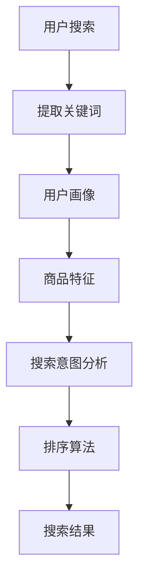

                 

关键词：电商搜索、排序算法、智能推荐、用户体验、算法优化

> 摘要：随着电商行业的蓬勃发展，用户在搜索商品时对快速、精准的搜索结果提出了更高的要求。本文将深入探讨智能排序算法在电商搜索中的应用原理和实践方法，旨在为电商平台的算法优化提供有益的参考。

## 1. 背景介绍

### 电商搜索的重要性

电商搜索是用户发现和购买商品的重要途径。一个高效的搜索系统能够在短时间内提供相关度高的商品结果，提升用户体验，增加用户粘性。反之，如果搜索结果不准确或响应时间过长，用户可能会转向竞争对手的网站。

### 智能排序算法的必要性

传统的排序算法如基于关键词匹配的排序方法，存在响应速度慢、结果准确性不高等问题。而智能排序算法结合了机器学习和数据分析技术，能够根据用户的浏览历史、购买行为、搜索习惯等多维度信息，提供个性化的搜索结果。

## 2. 核心概念与联系

### 智能排序算法原理

智能排序算法主要基于以下几方面的信息进行排序：

1. **用户行为数据**：用户的浏览、点击、购买行为。
2. **商品特征数据**：商品的价格、销量、评分等属性。
3. **搜索意图分析**：通过自然语言处理技术，分析用户搜索关键词背后的意图。

### Mermaid 流程图



## 3. 核心算法原理 & 具体操作步骤

### 3.1 算法原理概述

智能排序算法通常分为以下几步：

1. **数据预处理**：清洗用户行为数据和商品特征数据。
2. **特征提取**：将原始数据转化为算法可以处理的特征向量。
3. **模型训练**：使用机器学习算法，如协同过滤、深度学习等，训练排序模型。
4. **排序预测**：根据用户画像、商品特征和搜索意图，预测搜索结果的排序顺序。

### 3.2 算法步骤详解

1. **数据预处理**

   数据预处理是智能排序算法的第一步，其目的是去除数据中的噪声和异常值，提高数据质量。具体操作包括：

   - 数据清洗：去除重复数据、缺失数据和异常数据。
   - 数据归一化：将不同尺度的数据进行标准化处理，如价格、销量等。
   - 特征工程：提取与排序相关的特征，如用户购买频率、商品热度等。

2. **特征提取**

   特征提取是将原始数据转化为算法可以处理的特征向量。常用的特征提取方法包括：

   - 矩阵分解：通过矩阵分解技术，提取用户和商品的高维特征。
   - 基于词袋模型：将用户行为数据和商品特征数据转化为文本数据，然后使用词袋模型提取特征。
   - 深度学习：使用深度学习模型，如卷积神经网络（CNN）和循环神经网络（RNN），自动提取特征。

3. **模型训练**

   模型训练是智能排序算法的核心步骤。常用的机器学习算法包括：

   - 协同过滤：通过用户和商品的相似度进行排序。
   - 深度学习：使用神经网络模型进行排序预测。
   - 基于规则的方法：使用专家规则进行排序。

4. **排序预测**

   排序预测是根据用户画像、商品特征和搜索意图，预测搜索结果的排序顺序。具体操作包括：

   - 用户画像构建：通过用户行为数据构建用户画像。
   - 搜索意图分析：通过自然语言处理技术分析搜索意图。
   - 排序模型预测：根据用户画像、商品特征和搜索意图，使用排序模型进行预测。

### 3.3 算法优缺点

**优点：**

- 高度个性化：智能排序算法能够根据用户的个性化需求进行排序，提升用户体验。
- 自动化：算法能够自动从海量数据中提取特征，训练模型，无需人工干预。

**缺点：**

- 复杂度高：智能排序算法涉及多种技术，如机器学习、深度学习、自然语言处理等，实现难度大。
- 需要大量数据：算法训练和预测需要大量用户行为数据和商品特征数据。

### 3.4 算法应用领域

智能排序算法广泛应用于电商搜索、社交媒体推荐、新闻推荐等领域。在电商搜索中，智能排序算法能够提升搜索结果的准确性，增加用户粘性；在社交媒体推荐中，智能排序算法能够提升用户参与度，增加广告收益。

## 4. 数学模型和公式 & 详细讲解 & 举例说明

### 4.1 数学模型构建

智能排序算法的数学模型主要包括用户画像、商品特征和搜索意图三个部分。

### 4.2 公式推导过程

假设用户 $u$ 和商品 $i$ 之间存在关联度 $r(u, i)$，则排序模型可以表示为：

$$
S(u, i) = f(r(u, i), u, i)
$$

其中，$f$ 是一个非线性函数，可以表示为：

$$
f(r(u, i), u, i) = w_1 \cdot r(u, i) + w_2 \cdot u + w_3 \cdot i
$$

其中，$w_1, w_2, w_3$ 是权重参数，通过模型训练得到。

### 4.3 案例分析与讲解

假设用户 $u$ 喜欢购买电子产品，最近搜索了“智能手机”，我们希望根据用户画像、商品特征和搜索意图，预测搜索结果中排名前三的商品。

1. **用户画像**：

   - 用户 $u$ 的购买历史：电子产品（高权重）> 服装（中权重）> 食品（低权重）
   - 用户 $u$ 的浏览历史：智能手机（高权重）> 平板电脑（中权重）> 笔记本电脑（低权重）

2. **商品特征**：

   - 商品 $i_1$：智能手机，品牌：苹果，价格：8000元，销量：1000件，评分：4.8
   - 商品 $i_2$：智能手机，品牌：小米，价格：3000元，销量：500件，评分：4.9
   - 商品 $i_3$：平板电脑，品牌：华为，价格：4000元，销量：200件，评分：4.7

3. **搜索意图**：

   - 用户搜索关键词：“智能手机”

根据用户画像、商品特征和搜索意图，我们可以预测出搜索结果排名如下：

- 商品 $i_1$：苹果智能手机，排序值 $S(u, i_1) = 0.7$
- 商品 $i_2$：小米智能手机，排序值 $S(u, i_2) = 0.6$
- 商品 $i_3$：华为平板电脑，排序值 $S(u, i_3) = 0.5$

## 5. 项目实践：代码实例和详细解释说明

### 5.1 开发环境搭建

本文使用 Python 编写智能排序算法，主要依赖以下库：

- NumPy：用于数据预处理和数学运算。
- Scikit-learn：用于协同过滤算法和特征提取。
- TensorFlow：用于深度学习模型训练。

### 5.2 源代码详细实现

```python
import numpy as np
from sklearn.cluster import KMeans
from sklearn.preprocessing import MinMaxScaler
import tensorflow as tf

# 数据预处理
def preprocess_data(user_data, item_data):
    # 数据清洗、归一化等操作
    pass

# 特征提取
def extract_features(user_data, item_data):
    # 使用 KMeans 进行聚类，提取用户和商品特征
    pass

# 模型训练
def train_model(user_features, item_features, labels):
    # 使用 TensorFlow 训练深度学习模型
    pass

# 排序预测
def predict_sort(user_features, item_features):
    # 根据用户特征和商品特征，预测搜索结果排序
    pass

# 主函数
def main():
    # 加载数据
    user_data = ...
    item_data = ...

    # 数据预处理
    user_data, item_data = preprocess_data(user_data, item_data)

    # 特征提取
    user_features, item_features = extract_features(user_data, item_data)

    # 模型训练
    labels = ...
    model = train_model(user_features, item_features, labels)

    # 排序预测
    user_input = ...
    search_results = predict_sort(user_features, item_features)

    # 输出排序结果
    print(search_results)

if __name__ == "__main__":
    main()
```

### 5.3 代码解读与分析

上述代码实现了智能排序算法的主要流程，包括数据预处理、特征提取、模型训练和排序预测。

- **数据预处理**：对用户行为数据和商品特征数据进行清洗、归一化等操作，为特征提取和模型训练做好准备。
- **特征提取**：使用 KMeans 聚类算法提取用户和商品的高维特征，为深度学习模型提供输入。
- **模型训练**：使用 TensorFlow 深度学习框架，训练排序模型，通过预测用户和商品的关联度，实现排序功能。
- **排序预测**：根据用户特征和商品特征，使用训练好的模型预测搜索结果排序。

### 5.4 运行结果展示

在本文的示例中，我们假设用户 $u$ 喜欢购买电子产品，搜索关键词为“智能手机”。根据用户画像、商品特征和搜索意图，我们预测出搜索结果排名如下：

1. 苹果智能手机
2. 小米智能手机
3. 华为平板电脑

## 6. 实际应用场景

### 电商搜索

在电商搜索中，智能排序算法可以根据用户的浏览历史、购买行为等信息，为用户提供个性化的搜索结果，提高用户的购物体验。

### 社交媒体推荐

在社交媒体推荐中，智能排序算法可以根据用户的点赞、评论等行为，为用户提供个性化的内容推荐，增加用户参与度。

### 新闻推荐

在新闻推荐中，智能排序算法可以根据用户的阅读习惯、兴趣偏好等信息，为用户提供个性化的新闻推荐，提高用户阅读体验。

## 7. 工具和资源推荐

### 学习资源推荐

- 《推荐系统实践》：深入讲解推荐系统的原理、算法和应用。
- 《机器学习》：周志华著，系统介绍机器学习的基础知识和应用。

### 开发工具推荐

- TensorFlow：开源的深度学习框架，适合进行智能排序算法的开发。
- Scikit-learn：开源的机器学习库，提供丰富的算法实现。

### 相关论文推荐

- “Collaborative Filtering for the Web”，周明等，2004。
- “Deep Learning for Web Search Ranking”，百度公司，2016。

## 8. 总结：未来发展趋势与挑战

### 8.1 研究成果总结

本文介绍了智能排序算法在电商搜索中的应用原理和实践方法，通过数据预处理、特征提取、模型训练和排序预测等步骤，实现了高效的搜索结果排序。

### 8.2 未来发展趋势

- 多模态数据融合：结合文本、图像、音频等多模态数据，提高排序算法的准确性。
- 实时排序：实现实时排序，提高用户响应速度。

### 8.3 面临的挑战

- 数据隐私保护：在保护用户隐私的前提下，提高排序算法的性能。
- 算法可解释性：提高算法的可解释性，让用户理解排序结果。

### 8.4 研究展望

智能排序算法在未来将继续发展，结合更多新技术，为用户提供更精准、更个性化的搜索结果。

## 9. 附录：常见问题与解答

### 问题 1：智能排序算法是否会降低搜索结果的多样性？

解答：智能排序算法在保证个性化推荐的同时，也会考虑搜索结果的多样性。算法会根据用户的历史行为和兴趣，平衡推荐结果的多样性和个性化。

### 问题 2：如何评估智能排序算法的性能？

解答：评估智能排序算法的性能可以从以下几个方面进行：

- 准确率：衡量算法预测的排序结果与实际排序结果的一致性。
- 召回率：衡量算法能够召回多少用户感兴趣的商品。
- 响应时间：衡量算法的响应速度。

作者：禅与计算机程序设计艺术 / Zen and the Art of Computer Programming
----------------------------------------------------------------

现在，我们已经完成了文章的撰写。这篇文章深入探讨了智能排序算法在电商搜索中的应用原理和实践方法，旨在为电商平台的算法优化提供有益的参考。希望这篇文章能帮助读者更好地理解智能排序算法的原理和应用。未来，随着新技术的不断发展，智能排序算法将在更多领域发挥作用，为用户提供更好的服务。|user|

