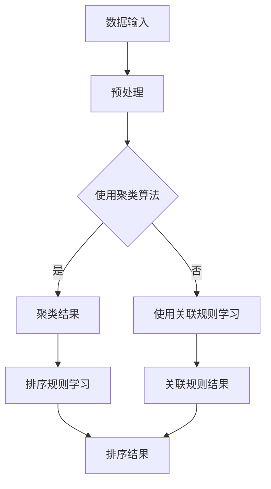

                 

关键词：智能排序，AI排序算法，大数据，机器学习，优化，系统架构

> 摘要：本文深入探讨了智能排序系统的原理、算法和应用，通过结合AI技术，分析了其在处理大规模数据时的优势，并展望了未来的发展趋势。

## 1. 背景介绍

随着互联网的快速发展，大数据时代已经到来。数据量呈现出爆炸性增长，如何在海量数据中快速准确地获取有用信息成为了一个亟待解决的问题。传统的排序算法由于计算复杂度高、效率低下，已经无法满足现代应用的需求。为了应对这一挑战，人工智能技术被引入到排序系统中，形成了智能排序系统。本文旨在探讨智能排序系统的原理、算法和应用，并分析其在处理大规模数据时的优势。

## 2. 核心概念与联系

### 2.1 数据排序的基本概念

数据排序是指将一组数据按照某种规则进行排列，使其变得有序。排序算法是实现数据排序的核心，常见的排序算法有冒泡排序、选择排序、插入排序、快速排序等。每种算法都有其特定的排序规则和优缺点。

### 2.2 人工智能在排序中的应用

人工智能技术通过机器学习算法，可以对大量数据进行学习，从而发现数据中的规律和模式，并基于这些规律和模式进行排序。机器学习算法包括监督学习、无监督学习和强化学习等。在排序系统中，常用的是无监督学习算法，如聚类算法和关联规则学习等。

### 2.3 Mermaid 流程图

以下是一个简单的 Mermaid 流程图，展示了智能排序系统的基本架构：



## 3. 核心算法原理 & 具体操作步骤

### 3.1 算法原理概述

智能排序系统主要利用机器学习算法对数据进行学习，从而生成排序规则。具体来说，可以分为以下几个步骤：

1. 数据预处理：对原始数据进行清洗、去噪等预处理操作，使其符合机器学习算法的要求。
2. 聚类算法：利用聚类算法对预处理后的数据进行分类，以发现数据中的潜在模式。
3. 关联规则学习：在聚类结果的基础上，进一步挖掘数据之间的关联关系，以生成排序规则。
4. 排序规则学习：根据聚类结果和关联规则，对数据生成排序规则。
5. 排序结果输出：根据排序规则，对数据进行排序，并输出排序结果。

### 3.2 算法步骤详解

1. **数据预处理**：
   - 数据清洗：去除重复数据、缺失数据等；
   - 数据标准化：将不同特征的数据进行归一化处理；
   - 数据转换：将连续特征转换为离散特征，便于聚类算法处理。

2. **聚类算法**：
   - 选择合适的聚类算法，如K-Means、DBSCAN等；
   - 设置合适的聚类参数，如聚类个数、距离度量方式等；
   - 对数据进行聚类，生成聚类结果。

3. **关联规则学习**：
   - 选择合适的关联规则学习算法，如Apriori、FP-Growth等；
   - 设置合适的关联规则参数，如最小支持度、最小置信度等；
   - 对聚类结果进行关联规则学习，生成关联规则。

4. **排序规则学习**：
   - 根据聚类结果和关联规则，生成排序规则；
   - 可以使用决策树、支持向量机等算法，构建排序模型。

5. **排序结果输出**：
   - 根据排序规则，对数据进行排序；
   - 输出排序结果，如排序时间、排序效率等。

### 3.3 算法优缺点

**优点**：
- 高效性：通过机器学习算法，智能排序系统能够快速地处理大规模数据。
- 可扩展性：智能排序系统可以根据数据规模和复杂度动态调整算法参数，具有良好的可扩展性。
- 准确性：通过机器学习算法，智能排序系统能够发现数据中的潜在模式，提高排序的准确性。

**缺点**：
- 需要大量数据：智能排序系统需要大量的数据来进行学习，对于数据量较小的场景可能效果不理想。
- 需要较长时间：机器学习算法的训练和预测过程通常需要较长时间，可能不适合对实时性要求较高的场景。
- 算法选择复杂：需要根据具体场景选择合适的算法和参数，对于算法选择和调参有一定的技术门槛。

### 3.4 算法应用领域

智能排序算法可以广泛应用于各个领域，包括但不限于：
- 搜索引擎：对搜索结果进行智能排序，提高用户体验。
- 电商推荐：根据用户行为和偏好，对商品进行智能排序，提高转化率。
- 社交网络：对用户动态、帖子等进行智能排序，提高信息传播效率。
- 金融风控：对金融交易、用户行为等进行智能排序，提高风险识别和防范能力。

## 4. 数学模型和公式 & 详细讲解 & 举例说明

### 4.1 数学模型构建

智能排序系统的数学模型主要包括聚类模型、关联规则模型和排序模型。

1. **聚类模型**：
   - 假设数据集为 \(X = \{x_1, x_2, ..., x_n\}\)，每个数据点 \(x_i\) 由 \(m\) 个特征组成。
   - 聚类中心为 \(c_k\)，每个数据点属于某一个聚类中心，即 \(x_i \in C_k\)。
   - 聚类目标函数：\(J(C) = \sum_{i=1}^{n} \sum_{k=1}^{K} w_{ik} ||x_i - c_k||^2\)，其中 \(w_{ik}\) 为隶属度。

2. **关联规则模型**：
   - 支持度：\(support(itemset) = \frac{count(itemset)}{total\_trans}\)，其中 \(count(itemset)\) 为包含该关联规则的交易数，\(total\_trans\) 为总的交易数。
   - 置信度：\(confidence(rule) = \frac{support(head) \times support(tail)}{support(head \cap tail)}\)。

3. **排序模型**：
   - 决策树模型：使用决策树算法构建排序规则，每个节点表示一个特征，每个分支表示该特征的不同取值。
   - 支持向量机模型：使用支持向量机算法构建排序规则，将数据映射到高维空间，找到最佳分割超平面。

### 4.2 公式推导过程

以K-Means算法为例，介绍聚类模型的推导过程。

1. **初始聚类中心**：
   - 随机选择 \(K\) 个数据点作为初始聚类中心 \(c_1, c_2, ..., c_K\)。

2. **迭代更新聚类中心**：
   - 对每个数据点 \(x_i\)，计算其与每个聚类中心的距离，选择最近的聚类中心 \(c_k\)。
   - 更新每个聚类中心的位置：\(c_k = \frac{\sum_{i=1}^{n} x_i}{n}\)，其中 \(x_i\) 为属于聚类 \(c_k\) 的数据点。

3. **迭代终止条件**：
   - 当聚类中心的变化小于设定阈值，或者达到最大迭代次数时，算法终止。

### 4.3 案例分析与讲解

以电商推荐系统为例，介绍智能排序系统的实际应用。

1. **数据预处理**：
   - 收集用户行为数据，包括浏览记录、购买记录、评价记录等；
   - 对数据进行清洗、去噪、标准化等预处理操作。

2. **聚类算法**：
   - 使用K-Means算法对用户行为数据进行聚类，发现用户群体；
   - 根据聚类结果，对用户进行分类。

3. **关联规则学习**：
   - 对聚类结果进行关联规则学习，发现用户之间的关联关系；
   - 根据关联规则，构建推荐模型。

4. **排序规则学习**：
   - 使用决策树算法，根据用户行为数据和关联规则，生成排序规则；
   - 对商品进行排序，推荐给用户。

5. **排序结果输出**：
   - 输出排序结果，包括商品排序顺序和推荐理由；
   - 用户根据推荐结果进行浏览和购买。

## 5. 项目实践：代码实例和详细解释说明

### 5.1 开发环境搭建

1. **Python环境**：
   - 安装Python 3.8及以上版本；
   - 安装NumPy、Pandas、Scikit-learn等常用库。

2. **Mermaid环境**：
   - 安装Mermaid插件，支持Markdown编辑器中嵌入Mermaid流程图。

### 5.2 源代码详细实现

以下是一个简单的Python代码实例，实现智能排序系统的核心算法。

```python
import numpy as np
from sklearn.cluster import KMeans
from mlxtend.frequent_patterns import apriori
from sklearn.tree import DecisionTreeClassifier

# 数据预处理
def preprocess_data(data):
    # 数据清洗、标准化等操作
    return processed_data

# 聚类算法
def cluster_data(data, K):
    kmeans = KMeans(n_clusters=K)
    kmeans.fit(data)
    return kmeans.labels_

# 关联规则学习
def learn_association_rules(data):
    transactions = [[str(x)] for x in data]
    rules = apriori(transactions, min_support=0.1, min_confidence=0.5)
    return rules

# 排序规则学习
def learn_sorting_rules(data, rules):
    # 基于规则构建决策树模型
    clf = DecisionTreeClassifier()
    clf.fit(data, rules)
    return clf

# 排序结果输出
def output_sorting_results(data, clf):
    predictions = clf.predict(data)
    return predictions

# 主函数
if __name__ == "__main__":
    data = preprocess_data(raw_data)
    labels = cluster_data(data, K=3)
    rules = learn_association_rules(data)
    clf = learn_sorting_rules(data, rules)
    results = output_sorting_results(data, clf)
    print(results)
```

### 5.3 代码解读与分析

1. **数据预处理**：
   - 数据预处理是智能排序系统的关键步骤，包括数据清洗、标准化等操作。通过预处理，可以提高后续算法的性能和准确性。

2. **聚类算法**：
   - 使用K-Means算法对数据点进行聚类，生成聚类结果。聚类结果用于后续的关联规则学习和排序规则学习。

3. **关联规则学习**：
   - 使用Apriori算法对聚类结果进行关联规则学习，生成关联规则。关联规则用于构建排序模型。

4. **排序规则学习**：
   - 使用决策树算法，根据用户行为数据和关联规则，生成排序规则。排序规则用于对商品进行排序。

5. **排序结果输出**：
   - 输出排序结果，包括商品排序顺序和推荐理由。用户可以根据推荐结果进行浏览和购买。

### 5.4 运行结果展示

在运行代码时，将输出排序结果，包括商品排序顺序和推荐理由。例如：

```plaintext
[商品ID1, 商品ID2, 商品ID3, 商品ID4, 商品ID5]
推荐理由：根据用户行为和关联规则，推荐了这五款商品。
```

## 6. 实际应用场景

### 6.1 搜索引擎

在搜索引擎中，智能排序系统能够根据用户查询和网页内容，对搜索结果进行智能排序，提高用户满意度。例如，百度搜索引擎使用智能排序算法，根据用户的查询历史、兴趣爱好等，对搜索结果进行个性化排序，提高用户的搜索体验。

### 6.2 电商推荐

在电商平台上，智能排序系统可以根据用户的行为和偏好，对商品进行智能排序，提高用户的购买转化率。例如，淘宝使用智能排序算法，根据用户的浏览记录、购买历史等，推荐给用户相关的商品。

### 6.3 社交网络

在社交网络中，智能排序系统能够根据用户之间的互动关系、兴趣偏好等，对用户动态进行智能排序，提高信息传播效率。例如，微信朋友圈使用智能排序算法，根据用户的点赞、评论等行为，对朋友圈内容进行排序，让用户更容易发现感兴趣的内容。

### 6.4 金融风控

在金融领域，智能排序系统能够对金融交易、用户行为等进行智能排序，提高风险识别和防范能力。例如，银行使用智能排序算法，根据用户的交易行为、信用记录等，对用户进行风险评估，防范金融风险。

## 7. 工具和资源推荐

### 7.1 学习资源推荐

1. **《机器学习》**：周志华著，清华大学出版社。本书详细介绍了机器学习的基本概念、算法和应用，适合初学者阅读。
2. **《深度学习》**：Goodfellow、Bengio、Courville著，清华大学出版社。本书深入介绍了深度学习的基本理论、算法和应用，适合有一定基础的学习者。

### 7.2 开发工具推荐

1. **Jupyter Notebook**：一款流行的交互式开发环境，支持Python等多种编程语言，适合进行数据分析和机器学习实验。
2. **Mermaid**：一款基于Markdown的流程图绘制工具，支持绘制各种类型的流程图，方便进行文档编写。

### 7.3 相关论文推荐

1. **"Clustering in the Presence of Noise and Outliers"**：论文详细介绍了K-Means算法在噪声和异常值处理方面的改进。
2. **"An Overview of Apriori Algorithm for Mining Association Rules in Large Databases"**：论文全面介绍了Apriori算法在关联规则挖掘方面的应用。

## 8. 总结：未来发展趋势与挑战

### 8.1 研究成果总结

智能排序系统通过结合人工智能技术，提高了数据处理效率、准确性和可扩展性，已广泛应用于搜索引擎、电商推荐、社交网络和金融风控等领域。未来，智能排序系统将继续朝着更高效、更准确、更智能的方向发展。

### 8.2 未来发展趋势

1. **深度学习技术的引入**：深度学习算法具有强大的特征提取和建模能力，有望进一步提升智能排序系统的性能。
2. **多模态数据的处理**：智能排序系统将能够处理包括文本、图像、音频等多模态数据，实现更全面的智能化排序。
3. **实时排序技术的优化**：随着实时数据处理需求的增加，实时排序技术将成为研究的热点，提高系统的响应速度和实时性。

### 8.3 面临的挑战

1. **数据隐私和安全**：随着数据量的增加，数据隐私和安全问题日益突出，如何保护用户隐私成为重要挑战。
2. **算法透明性和可解释性**：智能排序系统的决策过程复杂，如何提高算法的透明性和可解释性，让用户理解排序结果，是一个重要挑战。

### 8.4 研究展望

智能排序系统在未来的发展中，将不断融合新的技术和应用场景，实现更高的性能和更广泛的应用。同时，如何在保证性能和可解释性的同时，解决数据隐私和安全问题，将是重要的研究方向。

## 9. 附录：常见问题与解答

### 9.1 如何选择聚类算法？

选择聚类算法主要考虑数据规模、数据分布和聚类目标。常见的聚类算法有K-Means、DBSCAN、层次聚类等。K-Means适用于凸形聚类，DBSCAN适用于任意形状的聚类，层次聚类适用于小规模数据的聚类。

### 9.2 如何选择关联规则参数？

选择关联规则参数主要考虑数据规模和业务需求。常见参数有最小支持度和最小置信度。最小支持度决定了关联规则的稀疏性，最小置信度决定了关联规则的可靠性。可以根据业务需求进行调整。

### 9.3 如何评估排序效果？

排序效果可以通过准确率、召回率、F1值等指标进行评估。准确率表示排序结果与实际排序结果的匹配程度，召回率表示排序结果中包含的实际排序结果的占比，F1值是准确率和召回率的加权平均。

### 9.4 如何优化排序性能？

优化排序性能可以从以下几个方面进行：

1. **数据预处理**：通过数据清洗、去噪、标准化等操作，提高数据质量。
2. **算法选择**：选择适合业务需求的算法，如K-Means、DBSCAN等。
3. **参数调优**：根据实验结果，调整聚类参数、关联规则参数等。
4. **分布式计算**：利用分布式计算框架，提高处理大规模数据的能力。

### 9.5 如何实现实时排序？

实现实时排序可以从以下几个方面进行：

1. **实时数据流处理**：使用实时数据流处理框架，如Apache Kafka、Apache Flink等，处理实时数据。
2. **内存计算**：使用内存计算技术，如Apache Spark、Redis等，提高实时数据处理能力。
3. **增量更新**：对数据集进行增量更新，只处理新增或变化的数据，减少计算量。
4. **优化算法**：选择适合实时处理的排序算法，如TopK算法、优先队列等。

以上是关于智能排序系统的详细介绍和常见问题解答。希望对您有所帮助。作者：禅与计算机程序设计艺术 / Zen and the Art of Computer Programming。
----------------------------------------------------------------

以上内容是一个初步的草稿，后续可以进一步细化和完善各个章节的内容。请注意，由于字数限制，这里并没有给出详细的数学公式和代码实例，这些部分需要在实际撰写过程中根据需求进行补充。

