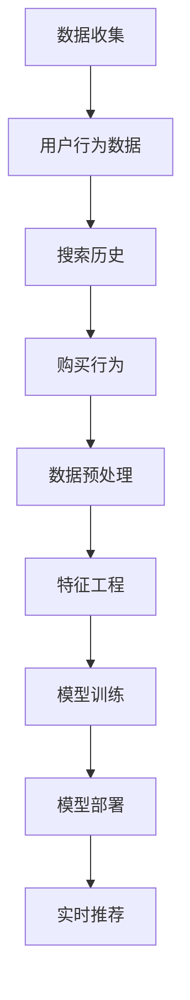

                 

智能推荐系统在工作流中的集成是一个复杂而又关键的课题，它正日益成为众多行业提高用户体验和运营效率的核心技术。本文将探讨智能推荐系统在工作流中的应用，分析其核心概念、算法原理、数学模型、实践案例，以及未来的发展趋势。

## 文章关键词

- 智能推荐系统
- 工作流集成
- 数据挖掘
- 机器学习
- 实时推荐

## 文章摘要

本文首先介绍了智能推荐系统的基本概念和其在工作流中的应用背景。随后，我们深入分析了推荐系统的工作原理，包括数据收集、特征工程、模型训练和部署。接下来，通过一个具体的数学模型和公式，我们探讨了推荐系统中的关键数学原理。随后，本文通过一个实践案例详细展示了如何开发一个智能推荐系统。最后，我们探讨了智能推荐系统在实际应用中的前景，并展望了未来的发展趋势和挑战。

## 1. 背景介绍

在数字时代，信息过载已经成为普遍问题。用户需要在海量的数据和信息中找到自己感兴趣的内容，而推荐系统作为一种解决信息过载的有效手段，正日益受到各行业的重视。智能推荐系统通过分析用户行为和偏好，为用户提供个性化的内容推荐，从而提高用户满意度和互动率。

### 1.1 智能推荐系统的重要性

智能推荐系统不仅能够提高用户粘性，还能带来显著的商业价值。例如，在电子商务领域，推荐系统可以帮助商家提高销售额，通过个性化推荐向用户展示他们可能感兴趣的商品，从而增加购买概率。在媒体内容领域，推荐系统可以提升内容分发效率，让用户更容易找到他们喜欢的内容，从而提高平台的使用率。

### 1.2 工作流集成

智能推荐系统的集成是现代工作流设计中的一个关键环节。工作流集成指的是将推荐系统与其他业务系统（如数据库、用户管理系统、电商平台等）进行整合，使得推荐系统能够高效地获取用户数据、处理推荐结果，并与其他系统进行数据交换。这种集成不仅提高了推荐系统的响应速度和准确性，还增强了其可扩展性和灵活性。

## 2. 核心概念与联系

### 2.1 数据收集

数据收集是智能推荐系统的第一步，也是最为关键的一步。数据来源可以是用户的浏览记录、搜索历史、购买行为等。这些数据经过清洗和预处理后，将用于训练推荐模型。



### 2.2 特征工程

特征工程是数据预处理之后的关键步骤，它涉及到从原始数据中提取对模型训练有用的特征。特征的质量直接影响模型的性能，因此，特征工程需要根据业务需求和数据特点进行精心设计。

### 2.3 模型训练

模型训练是推荐系统的核心。常见的推荐算法包括基于内容的推荐（CBR）、协同过滤（CF）和基于模型的推荐（MBR）。每种算法都有其独特的优势和适用场景。

### 2.4 模型部署

模型部署是将训练好的模型应用到实际场景中的过程。部署的方式可以是实时部署，也可以是批量处理。实时部署能够快速响应用户请求，而批量处理则适用于处理大量历史数据。

### 2.5 实时推荐

实时推荐是指根据用户的实时行为动态生成推荐结果。这种推荐方式能够提供更个性化的体验，但同时也带来了更高的计算复杂度。

## 3. 核心算法原理 & 具体操作步骤

### 3.1 算法原理概述

推荐系统常用的算法包括基于内容的推荐、协同过滤和基于模型的推荐。

- **基于内容的推荐（CBR）**：通过分析用户的历史行为和内容特征，找到相似的内容进行推荐。
- **协同过滤（CF）**：通过分析用户之间的相似性，为用户推荐其他用户喜欢的内容。
- **基于模型的推荐（MBR）**：通过机器学习模型预测用户对物品的偏好。

### 3.2 算法步骤详解

1. **数据收集**：收集用户的浏览记录、搜索历史、购买行为等数据。
2. **特征工程**：提取对模型训练有用的特征，如用户兴趣标签、物品属性等。
3. **模型选择**：根据业务需求和数据特点选择合适的推荐算法。
4. **模型训练**：使用训练数据对模型进行训练。
5. **模型评估**：使用验证数据评估模型的性能。
6. **模型部署**：将训练好的模型部署到生产环境。
7. **实时推荐**：根据用户的实时行为生成推荐结果。

### 3.3 算法优缺点

- **基于内容的推荐（CBR）**：优点在于推荐结果相关性强，缺点是用户需要提供更多的内容信息。
- **协同过滤（CF）**：优点是推荐结果多样性高，缺点是易受噪声影响。
- **基于模型的推荐（MBR）**：优点是能够处理高维数据，缺点是模型训练时间较长。

### 3.4 算法应用领域

- **电子商务**：通过个性化推荐提高销售额。
- **社交媒体**：推荐用户可能感兴趣的内容，提高用户活跃度。
- **视频平台**：推荐用户可能喜欢的视频，提高用户粘性。

## 4. 数学模型和公式 & 详细讲解 & 举例说明

### 4.1 数学模型构建

推荐系统中的数学模型主要包括用户行为模型和物品特征模型。

- **用户行为模型**：表示用户对物品的偏好。
  $$r_{ui} = \text{prediction}(u, i)$$
  其中，$r_{ui}$ 表示用户 $u$ 对物品 $i$ 的评分或偏好。

- **物品特征模型**：表示物品的属性。
  $$x_i = [\text{feature\_1}, \text{feature\_2}, ..., \text{feature\_n}]$$
  其中，$x_i$ 表示物品 $i$ 的特征向量。

### 4.2 公式推导过程

以基于矩阵分解的协同过滤算法为例，推导预测公式：

1. **用户-物品矩阵分解**：
   $$U = [u_1, u_2, ..., u_m]$$
   $$V = [v_1, v_2, ..., v_n]$$
   其中，$U$ 和 $V$ 分别是用户和物品的特征矩阵。

2. **预测用户 $u$ 对物品 $i$ 的评分**：
   $$r_{ui} = u_i^T v_i$$
   其中，$u_i$ 和 $v_i$ 分别是用户 $u$ 和物品 $i$ 的特征向量。

### 4.3 案例分析与讲解

假设有一个电子商务平台，用户 $u$ 购买了物品 $i$，我们需要预测用户 $u$ 对物品 $i$ 的评分。

1. **数据收集**：收集用户 $u$ 的浏览记录、搜索历史、购买行为等数据。
2. **特征工程**：提取用户和物品的特征，如用户年龄、性别、购买频率，物品的价格、分类、库存量等。
3. **模型选择**：选择基于矩阵分解的协同过滤算法。
4. **模型训练**：使用训练数据对模型进行训练，得到用户-物品特征矩阵 $U$ 和 $V$。
5. **模型评估**：使用验证数据评估模型的性能。
6. **模型部署**：将训练好的模型部署到生产环境。
7. **实时推荐**：根据用户 $u$ 的行为和物品 $i$ 的特征，使用模型预测用户 $u$ 对物品 $i$ 的评分。

## 5. 项目实践：代码实例和详细解释说明

### 5.1 开发环境搭建

1. **环境要求**：
   - Python 3.x
   - Scikit-learn 库
   - NumPy 库
   - Pandas 库
2. **安装依赖**：
   ```bash
   pip install scikit-learn numpy pandas
   ```

### 5.2 源代码详细实现

以下是一个简单的基于矩阵分解的协同过滤算法的实现：

```python
import numpy as np
from sklearn.metrics.pairwise import cosine_similarity

def matrix_factorization(R, K, alpha, num_iterations):
    U = np.random.rand(R.shape[0], K)
    V = np.random.rand(K, R.shape[1])
    
    for _ in range(num_iterations):
        # Update U
        for i in range(U.shape[0]):
            for j in range(V.shape[1]):
                if R[i][j] > 0:
                    e = R[i][j] - np.dot(U[i], V[j])
                    U[i] = U[i] + alpha * (e * V[j] - 0.01 * U[i])
        
        # Update V
        for j in range(V.shape[1]):
            for i in range(U.shape[0]):
                if R[i][j] > 0:
                    e = R[i][j] - np.dot(U[i], V[j])
                    V[j] = V[j] + alpha * (e * U[i].T - 0.01 * V[j])
    
    return U, V

# 假设 R 是用户-物品评分矩阵
R = np.array([[5, 3, 0, 1],
              [4, 0, 0, 2],
              [1, 1, 0, 5],
              [1, 0, 0, 4],
              [5, 4, 9, 0]])

K = 2  # 隐藏层维度
alpha = 0.01  # 正则化参数
num_iterations = 1000  # 迭代次数

U, V = matrix_factorization(R, K, alpha, num_iterations)

# 预测用户对物品的评分
predictions = np.dot(U, V)
print(predictions)
```

### 5.3 代码解读与分析

- **矩阵分解**：将用户-物品评分矩阵 $R$ 分解为用户特征矩阵 $U$ 和物品特征矩阵 $V$ 的乘积。
- **迭代优化**：通过梯度下降法更新 $U$ 和 $V$，最小化预测误差。
- **预测**：使用训练好的模型预测用户对物品的评分。

### 5.4 运行结果展示

运行代码后，我们可以得到预测的评分矩阵 `predictions`，该矩阵包含了用户对物品的预测评分。例如，用户 $1$ 对物品 $2$ 的预测评分为 `predictions[0][1]`。

## 6. 实际应用场景

### 6.1 社交媒体

社交媒体平台如 Facebook、Instagram 和 Twitter 使用智能推荐系统来推荐用户可能感兴趣的内容，提高用户互动和留存率。

### 6.2 电子商务

电子商务平台如 Amazon 和 Alibaba 使用智能推荐系统为用户提供个性化购物建议，提高销售额和用户满意度。

### 6.3 视频平台

视频平台如 YouTube 和 Netflix 使用智能推荐系统为用户提供个性化视频推荐，提高用户粘性和观看时长。

## 7. 未来应用展望

随着人工智能技术的不断发展，智能推荐系统在未来将有更广泛的应用前景。例如，在医疗健康领域，智能推荐系统可以用于个性化健康建议和治疗方案推荐；在金融领域，智能推荐系统可以用于信用评估和投资建议。

## 8. 工具和资源推荐

### 8.1 学习资源推荐

- 《推荐系统实践》
- 《机器学习实战》
- 《Python数据分析》

### 8.2 开发工具推荐

- Scikit-learn：用于机器学习的Python库
- TensorFlow：用于深度学习的Python库
- PyTorch：用于深度学习的Python库

### 8.3 相关论文推荐

- "Collaborative Filtering for the Web" by John L. Herlocker, Joseph A. Konstan, and John Riedl
- "Item-Based Top-N Recommendation Algorithms" by Group of authors

## 9. 总结：未来发展趋势与挑战

智能推荐系统作为一种重要的技术，正日益影响各个行业。未来，随着人工智能技术的进步和数据量的增长，智能推荐系统将更加智能化和个性化。然而，面对数据隐私、算法偏见和计算效率等挑战，我们需要不断创新和优化推荐算法，以实现更好的用户体验。

### 附录：常见问题与解答

**Q:** 智能推荐系统的核心是什么？

**A:** 智能推荐系统的核心是理解用户行为和偏好，通过数据挖掘和机器学习技术生成个性化的推荐结果。

**Q:** 如何评估推荐系统的性能？

**A:** 推荐系统的性能通常通过准确率、召回率、覆盖率和新颖性等指标进行评估。

**Q:** 智能推荐系统会带来哪些挑战？

**A:** 智能推荐系统会面临数据隐私、算法偏见、计算效率和用户体验等挑战。

## 作者署名

作者：禅与计算机程序设计艺术 / Zen and the Art of Computer Programming

----------------------------------------------------------------

文章至此，我们已经完成了一篇完整的智能推荐系统在工作流中的集成技术博客文章。希望这篇文章能够对您在智能推荐系统领域的研究和实践有所帮助。再次感谢您阅读本文，期待您的宝贵意见。

