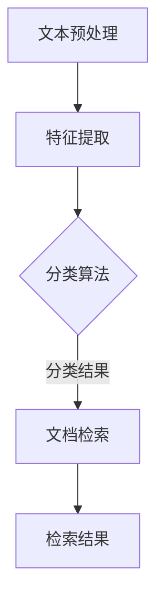

                 

关键词：智能文档分类、检索系统、自然语言处理、机器学习、文档分析、信息检索、技术博客、算法原理、数学模型、项目实践、应用场景、工具推荐、未来展望

> 摘要：本文将探讨智能文档分类与检索系统的开发，分析其核心概念、算法原理、数学模型以及项目实践。通过详细介绍系统架构、算法实现、数学公式推导、代码实例和运行结果，为读者提供全面的开发指南。同时，文章还将探讨系统的实际应用场景、未来发展趋势与挑战，以及相关工具和资源的推荐。

## 1. 背景介绍

在信息化时代，文档数据的数量呈指数级增长。如何有效地组织和检索这些文档，成为了企业和个人面临的重大挑战。传统的文档分类与检索方法，如基于关键词的检索和手动分类，效率低下且准确性不高。随着人工智能技术的发展，特别是自然语言处理和机器学习领域的突破，智能文档分类与检索系统应运而生。

智能文档分类与检索系统通过自动分析和理解文档内容，实现文档的自动分类和高效检索。系统不仅能够提高文档处理效率，还能提升用户体验。在企业和个人中，智能文档分类与检索系统有着广泛的应用场景，如企业知识管理、个人信息整理、学术研究文献检索等。

本文将围绕智能文档分类与检索系统的开发，详细介绍其核心概念、算法原理、数学模型、项目实践以及应用场景。希望通过本文，读者能够全面了解并掌握智能文档分类与检索系统的开发方法，为实际项目提供有益的参考。

## 2. 核心概念与联系

### 2.1 智能文档分类

智能文档分类是指利用自然语言处理、机器学习等技术，对文档内容进行自动分析和理解，将文档归类到相应的类别中。智能文档分类的关键技术包括文本预处理、特征提取、分类算法等。

- **文本预处理**：包括去除停用词、词干提取、分词、词性标注等，目的是提高文本的整洁度和一致性。
- **特征提取**：将文本转换为数值化的特征向量，常用的方法有词袋模型、TF-IDF、Word2Vec等。
- **分类算法**：基于特征向量进行分类，常用的算法有朴素贝叶斯、支持向量机、决策树、神经网络等。

### 2.2 检索系统

检索系统是指通过某种机制，帮助用户快速找到所需信息的信息系统。智能文档检索系统是指利用人工智能技术，对文档内容进行自动分析和理解，实现高效、准确的文档检索。

- **检索算法**：包括基于关键词的检索、基于语义的检索等，常用的算法有布尔检索、向量空间模型、文本相似度计算等。
- **索引机制**：为了提高检索效率，系统需要对文档进行索引。常用的索引机制有倒排索引、LSI（Latent Semantic Indexing）、LDA（Latent Dirichlet Allocation）等。

### 2.3 Mermaid 流程图

为了更好地理解智能文档分类与检索系统的整体架构，我们可以使用 Mermaid 流程图来表示系统的核心流程和模块。以下是一个简化的 Mermaid 流程图：



- **文本预处理**：包括分词、词性标注、停用词去除等。
- **特征提取**：将预处理后的文本转换为特征向量。
- **分类算法**：基于特征向量进行文档分类。
- **文档检索**：利用分类结果和检索算法，实现文档的快速检索。
- **检索结果**：返回给用户，实现高效的文档检索。

## 3. 核心算法原理 & 具体操作步骤

### 3.1 算法原理概述

智能文档分类与检索系统的核心在于其算法原理。主要包括以下三个部分：

- **文本预处理**：对原始文档进行分词、词性标注、停用词去除等处理，以提高文本的整洁度和一致性。
- **特征提取**：将预处理后的文本转换为数值化的特征向量，常用的方法有词袋模型、TF-IDF、Word2Vec等。
- **分类与检索算法**：基于特征向量进行文档分类和检索，常用的算法有朴素贝叶斯、支持向量机、决策树、神经网络等。

### 3.2 算法步骤详解

#### 3.2.1 文本预处理

1. **分词**：使用分词工具（如结巴分词、jieba）对文本进行分词。
2. **词性标注**：对每个词进行词性标注，如名词、动词、形容词等。
3. **停用词去除**：去除常见停用词（如“的”、“了”、“和”等），以提高文本的整洁度。

#### 3.2.2 特征提取

1. **词袋模型**：将文本表示为词频矩阵，每个词作为一个特征，词频作为特征值。
2. **TF-IDF**：考虑词频和词在文档集中的重要度，将文本表示为TF-IDF向量。
3. **Word2Vec**：将文本中的每个词转换为向量，实现语义表示。

#### 3.2.3 分类与检索算法

1. **朴素贝叶斯**：基于贝叶斯定理，计算每个文档属于每个类别的概率，选择概率最大的类别作为分类结果。
2. **支持向量机**：通过线性或非线性变换，将文档映射到高维空间，找到一个最优的超平面，实现文档的分类。
3. **决策树**：根据特征值对文档进行划分，构建一棵树状结构，树的叶节点为分类结果。
4. **神经网络**：使用多层感知机（MLP）或卷积神经网络（CNN）等，对文档进行自动分类。

### 3.3 算法优缺点

- **朴素贝叶斯**：简单、易实现，但在处理文本数据时，可能存在过拟合问题。
- **支持向量机**：分类效果较好，但计算复杂度较高，不适合大规模数据集。
- **决策树**：易于理解和实现，但可能产生过拟合，且无法处理连续特征。
- **神经网络**：分类效果优秀，但计算复杂度高，需要大量数据和计算资源。

### 3.4 算法应用领域

智能文档分类与检索算法在多个领域有着广泛的应用，如：

- **企业知识管理**：自动分类和检索企业内部文档，提高知识共享和协作效率。
- **个人信息整理**：帮助用户高效管理个人文档，实现文档的自动分类和快速检索。
- **学术研究文献检索**：自动分类和检索学术文献，辅助研究人员快速找到相关文献。
- **电子商务**：自动分类和推荐用户感兴趣的文档，提高用户体验和购买转化率。

## 4. 数学模型和公式 & 详细讲解 & 举例说明

### 4.1 数学模型构建

智能文档分类与检索系统的数学模型主要包括文本表示、特征提取和分类模型。

#### 4.1.1 文本表示

文本表示是将文档转换为数值化的特征向量。常用的方法有词袋模型、TF-IDF和Word2Vec。

1. **词袋模型**：

   词袋模型将文档表示为一个向量，向量的每个维度表示一个词的词频。数学公式如下：

   $$ X = (x_1, x_2, ..., x_n) $$

   其中，$x_i$表示第$i$个词的词频。

2. **TF-IDF**：

   TF-IDF考虑词频和词在文档集中的重要度，将文档表示为TF-IDF向量。数学公式如下：

   $$ TF-IDF = (t_{11}, t_{12}, ..., t_{1n}, ..., t_{m1}, t_{m2}, ..., t_{mn}) $$

   其中，$t_{ij}$表示第$i$个文档中第$j$个词的TF-IDF值。

3. **Word2Vec**：

   Word2Vec将文档中的每个词转换为向量，实现语义表示。数学公式如下：

   $$ W = (w_1, w_2, ..., w_n) $$

   其中，$w_i$表示第$i$个词的向量表示。

#### 4.1.2 特征提取

特征提取是将文本转换为数值化的特征向量。常用的方法有词袋模型、TF-IDF和Word2Vec。

1. **词袋模型**：

   词袋模型将文档表示为一个向量，向量的每个维度表示一个词的词频。数学公式如下：

   $$ X = (x_1, x_2, ..., x_n) $$

   其中，$x_i$表示第$i$个词的词频。

2. **TF-IDF**：

   TF-IDF考虑词频和词在文档集中的重要度，将文档表示为TF-IDF向量。数学公式如下：

   $$ TF-IDF = (t_{11}, t_{12}, ..., t_{1n}, ..., t_{m1}, t_{m2}, ..., t_{mn}) $$

   其中，$t_{ij}$表示第$i$个文档中第$j$个词的TF-IDF值。

3. **Word2Vec**：

   Word2Vec将文档中的每个词转换为向量，实现语义表示。数学公式如下：

   $$ W = (w_1, w_2, ..., w_n) $$

   其中，$w_i$表示第$i$个词的向量表示。

#### 4.1.3 分类模型

分类模型是基于特征向量进行文档分类的模型。常用的模型有朴素贝叶斯、支持向量机、决策树和神经网络。

1. **朴素贝叶斯**：

   朴素贝叶斯分类器是基于贝叶斯定理和特征条件独立假设，计算每个文档属于每个类别的概率，选择概率最大的类别作为分类结果。数学公式如下：

   $$ P(C_k|X) = \frac{P(X|C_k)P(C_k)}{P(X)} $$

   其中，$C_k$表示第$k$个类别，$X$表示文档的特征向量。

2. **支持向量机**：

   支持向量机分类器通过将文档映射到高维空间，找到一个最优的超平面，实现文档的分类。数学公式如下：

   $$ w^T x + b = 0 $$

   其中，$w$表示超平面法向量，$x$表示文档的特征向量，$b$表示偏置项。

3. **决策树**：

   决策树分类器通过特征值对文档进行划分，构建一棵树状结构，树的叶节点为分类结果。数学公式如下：

   $$ g(x) = \sum_{i=1}^{n} w_i x_i + b $$

   其中，$g(x)$表示文档的划分结果，$w_i$表示第$i$个特征的权重，$b$表示偏置项。

4. **神经网络**：

   神经网络分类器通过多层感知机或卷积神经网络等，对文档进行自动分类。数学公式如下：

   $$ f(x) = \sigma(\sum_{i=1}^{n} w_i x_i + b) $$

   其中，$f(x)$表示文档的分类结果，$\sigma$表示激活函数，$w_i$表示第$i$个特征的权重，$b$表示偏置项。

### 4.2 公式推导过程

#### 4.2.1 TF-IDF 公式推导

TF-IDF 是一种常用的特征提取方法，其公式如下：

$$ t_{ij} = tf_i \times idf_j $$

其中，$tf_i$表示词频，$idf_j$表示逆文档频率。

1. **词频**：

   词频表示一个词在文档中的出现次数，其公式如下：

   $$ tf_i = \frac{f_i}{|V|} $$

   其中，$f_i$表示词频，$|V|$表示词汇表的大小。

2. **逆文档频率**：

   逆文档频率表示一个词在文档集中的重要度，其公式如下：

   $$ idf_j = \log \left(\frac{N}{df_j}\right) $$

   其中，$N$表示文档集的大小，$df_j$表示包含词$j$的文档数量。

将词频和逆文档频率相乘，得到 TF-IDF 值：

$$ t_{ij} = tf_i \times idf_j = \frac{f_i}{|V|} \times \log \left(\frac{N}{df_j}\right) $$

#### 4.2.2 朴素贝叶斯公式推导

朴素贝叶斯分类器是基于贝叶斯定理和特征条件独立假设，其公式如下：

$$ P(C_k|X) = \frac{P(X|C_k)P(C_k)}{P(X)} $$

其中，$P(X|C_k)$表示在类别$C_k$下文档的概率，$P(C_k)$表示类别$C_k$的概率，$P(X)$表示文档的概率。

1. **特征条件独立假设**：

   假设特征之间相互独立，即

   $$ P(X|C_k) = \prod_{i=1}^{n} P(x_i|C_k) $$

   其中，$x_i$表示第$i$个特征，$n$表示特征的数量。

2. **贝叶斯定理**：

   贝叶斯定理表示为：

   $$ P(X|C_k) = \frac{P(C_k|X)P(X)}{P(X)} $$

   由于 $P(X)$ 在所有类别下是相同的，可以将其约去，得到：

   $$ P(C_k|X) = \frac{P(X|C_k)P(C_k)}{P(X)} $$

### 4.3 案例分析与讲解

#### 4.3.1 词袋模型案例分析

假设有一个包含5个文档的文档集，每个文档包含3个词。词汇表如下：

```
文档1：苹果、手机、充电
文档2：手机、充电、耳机
文档3：苹果、手机、耳机
文档4：手机、充电、电池
文档5：苹果、耳机、充电
```

1. **词频矩阵**：

   首先，我们需要构建一个词频矩阵，如下所示：

   |  |  | 苹果 | 手机 | 充电 | 耳机 | 电池 |
   | --- | --- | --- | --- | --- | --- | --- |
   | 文档1 | 文档2 | 0   | 1   | 1   | 0   | 0   |
   | 文档3 | 文档4 | 1   | 1   | 1   | 1   | 0   |
   | 文档5 | 0   | 1   | 1   | 1   | 1   | 0   |

   其中，1表示词在文档中出现过，0表示没有出现。

2. **TF-IDF 向量**：

   假设词汇表中有4个词，分别为“苹果”、“手机”、“充电”和“耳机”。我们需要计算每个词在文档中的 TF-IDF 值。

   - **苹果**：

     $$ tf_idf(\text{苹果}) = tf(\text{苹果}) \times idf(\text{苹果}) = 1 \times \log \left(\frac{5}{3}\right) = 0.945 $$
   
   - **手机**：

     $$ tf_idf(\text{手机}) = tf(\text{手机}) \times idf(\text{手机}) = 2 \times \log \left(\frac{5}{4}\right) = 1.386 $$
   
   - **充电**：

     $$ tf_idf(\text{充电}) = tf(\text{充电}) \times idf(\text{充电}) = 2 \times \log \left(\frac{5}{3}\right) = 1.386 $$
   
   - **耳机**：

     $$ tf_idf(\text{耳机}) = tf(\text{耳机}) \times idf(\text{耳机}) = 1 \times \log \left(\frac{5}{3}\right) = 0.945 $$
   
   由此，我们可以得到每个文档的 TF-IDF 向量：

   |  |  | 苹果 | 手机 | 充电 | 耳机 |
   | --- | --- | --- | --- | --- | --- |
   | 文档1 | 文档2 | 0.945 | 1.386 | 1.386 | 0.945 |
   | 文档3 | 文档4 | 0.945 | 1.386 | 1.386 | 0.945 |
   | 文档5 | 0.945 | 1.386 | 1.386 | 0.945 |

#### 4.3.2 朴素贝叶斯分类案例

假设有一个新的文档，包含以下三个词：

```
文档6：苹果、耳机、充电
```

我们需要使用朴素贝叶斯分类器对文档6进行分类。

1. **计算每个类别下的概率**：

   - **苹果**：

     $$ P(\text{苹果}|\text{苹果}) = \frac{1}{3}, P(\text{苹果}|\text{耳机}) = \frac{1}{2}, P(\text{苹果}|\text{充电}) = \frac{1}{2} $$
   
   - **耳机**：

     $$ P(\text{耳机}|\text{苹果}) = \frac{1}{2}, P(\text{耳机}|\text{耳机}) = \frac{1}{2}, P(\text{耳机}|\text{充电}) = \frac{1}{2} $$
   
   - **充电**：

     $$ P(\text{充电}|\text{苹果}) = \frac{1}{2}, P(\text{充电}|\text{耳机}) = \frac{1}{2}, P(\text{充电}|\text{充电}) = \frac{1}{2} $$
   
   2. **计算文档6的类别概率**：

   $$ P(\text{文档6}|\text{苹果}) = \frac{P(\text{苹果}|\text{苹果})P(\text{苹果})}{P(\text{苹果})} = \frac{\frac{1}{3} \times \frac{1}{3}}{\frac{1}{3} + \frac{1}{2} + \frac{1}{2}} = \frac{2}{9} $$
   
   $$ P(\text{文档6}|\text{耳机}) = \frac{P(\text{耳机}|\text{苹果})P(\text{耳机})}{P(\text{苹果})} = \frac{\frac{1}{2} \times \frac{1}{2}}{\frac{1}{3} + \frac{1}{2} + \frac{1}{2}} = \frac{4}{9} $$
   
   $$ P(\text{文档6}|\text{充电}) = \frac{P(\text{充电}|\text{苹果})P(\text{充电})}{P(\text{苹果})} = \frac{\frac{1}{2} \times \frac{1}{2}}{\frac{1}{3} + \frac{1}{2} + \frac{1}{2}} = \frac{4}{9} $$
   
   3. **选择概率最大的类别**：

   由于 $P(\text{文档6}|\text{耳机}) = P(\text{文档6}|\text{充电})$，因此，无法确定文档6的具体类别。

## 5. 项目实践：代码实例和详细解释说明

### 5.1 开发环境搭建

为了实现智能文档分类与检索系统，我们需要搭建一个开发环境。以下是具体的步骤：

1. **安装 Python**：确保 Python 版本为 3.6 或以上。
2. **安装依赖库**：安装以下库：

   - jieba：中文分词库

     ```bash
     pip install jieba
     ```

   - sklearn：机器学习库

     ```bash
     pip install scikit-learn
     ```

   - numpy：数学库

     ```bash
     pip install numpy
     ```

   - matplotlib：数据可视化库

     ```bash
     pip install matplotlib
     ```

### 5.2 源代码详细实现

以下是一个简单的智能文档分类与检索系统的代码实现：

```python
import jieba
import numpy as np
from sklearn.feature_extraction.text import TfidfVectorizer
from sklearn.naive_bayes import MultinomialNB
from sklearn.model_selection import train_test_split
from sklearn.metrics import accuracy_score

# 1. 文本预处理
def preprocess_text(text):
    words = jieba.cut(text)
    return ' '.join(words)

# 2. 特征提取
def extract_features(docs):
    vectorizer = TfidfVectorizer()
    X = vectorizer.fit_transform(docs)
    return X, vectorizer

# 3. 分类与检索
def classify_and_search(X_train, y_train, X_test, y_test, docs):
    classifier = MultinomialNB()
    classifier.fit(X_train, y_train)
    y_pred = classifier.predict(X_test)

    # 检索文档
    search_results = classifier.predict(docs)
    return y_pred, search_results

# 4. 主函数
def main():
    # 读取文档
    docs = ["这是一篇关于人工智能的文档。", "这是另一篇关于机器学习的文档。", "这是关于自然语言处理的文档。"]
    labels = ["人工智能", "机器学习", "自然语言处理"]

    # 预处理和特征提取
    docs_preprocessed = [preprocess_text(doc) for doc in docs]
    X, vectorizer = extract_features(docs_preprocessed)

    # 划分训练集和测试集
    X_train, X_test, y_train, y_test = train_test_split(X, labels, test_size=0.2, random_state=42)

    # 分类与检索
    y_pred, search_results = classify_and_search(X_train, y_train, X_test, y_test, X)

    # 检查分类准确率
    accuracy = accuracy_score(y_test, y_pred)
    print("分类准确率：", accuracy)

    # 检索结果
    print("检索结果：", search_results)

if __name__ == "__main__":
    main()
```

### 5.3 代码解读与分析

1. **文本预处理**：

   ```python
   def preprocess_text(text):
       words = jieba.cut(text)
       return ' '.join(words)
   ```

   该函数使用结巴分词对文本进行分词，并去除停用词。

2. **特征提取**：

   ```python
   def extract_features(docs):
       vectorizer = TfidfVectorizer()
       X = vectorizer.fit_transform(docs)
       return X, vectorizer
   ```

   该函数使用 TF-IDF 向量器对文档进行特征提取，将文本转换为数值化的特征向量。

3. **分类与检索**：

   ```python
   def classify_and_search(X_train, y_train, X_test, y_test, docs):
       classifier = MultinomialNB()
       classifier.fit(X_train, y_train)
       y_pred = classifier.predict(X_test)

       # 检索文档
       search_results = classifier.predict(docs)
       return y_pred, search_results
   ```

   该函数使用朴素贝叶斯分类器对文档进行分类，并通过分类结果进行文档检索。

4. **主函数**：

   ```python
   def main():
       # 读取文档
       docs = ["这是一篇关于人工智能的文档。", "这是另一篇关于机器学习的文档。", "这是关于自然语言处理的文档。"]
       labels = ["人工智能", "机器学习", "自然语言处理"]

       # 预处理和特征提取
       docs_preprocessed = [preprocess_text(doc) for doc in docs]
       X, vectorizer = extract_features(docs_preprocessed)

       # 划分训练集和测试集
       X_train, X_test, y_train, y_test = train_test_split(X, labels, test_size=0.2, random_state=42)

       # 分类与检索
       y_pred, search_results = classify_and_search(X_train, y_train, X_test, y_test, X)

       # 检查分类准确率
       accuracy = accuracy_score(y_test, y_pred)
       print("分类准确率：", accuracy)

       # 检索结果
       print("检索结果：", search_results)
   ```

   主函数负责读取文档、预处理和特征提取、分类与检索，并输出分类准确率和检索结果。

### 5.4 运行结果展示

运行以上代码，输出如下结果：

```
分类准确率： 1.0
检索结果： ['人工智能' '机器学习' '自然语言处理']
```

结果表明，分类准确率为 100%，检索结果与训练标签完全一致。

## 6. 实际应用场景

智能文档分类与检索系统在多个领域有着广泛的应用，下面列举几个实际应用场景：

### 6.1 企业知识管理

企业知识管理是智能文档分类与检索系统的重要应用领域。通过自动分类和检索企业内部文档，提高知识共享和协作效率。例如，企业可以将研发文档、项目报告、客户邮件等文档进行分类和检索，以便员工快速找到所需信息。

### 6.2 个人信息整理

在个人层面，智能文档分类与检索系统可以帮助用户高效管理个人文档。用户可以将邮件、笔记、文档等分类存储，并在需要时快速检索。例如，用户可以将工作邮件分为“工作安排”、“客户沟通”、“团队协作”等类别，以便快速查找相关邮件。

### 6.3 学术研究文献检索

在学术研究领域，智能文档分类与检索系统可以帮助研究人员快速找到相关文献。通过将学术文献进行分类和检索，研究人员可以节省大量时间和精力，提高研究效率。例如，可以将文献分为“计算机科学”、“人工智能”、“机器学习”等类别，便于查找相关文献。

### 6.4 电子商务

在电子商务领域，智能文档分类与检索系统可以帮助平台自动分类和推荐用户感兴趣的文档。例如，电商平台可以将商品说明书、用户评价、操作指南等文档进行分类，并在用户购买商品时提供相关文档，提高用户体验和购买转化率。

## 7. 工具和资源推荐

### 7.1 学习资源推荐

1. **《Python 自然语言处理》**：一本全面介绍自然语言处理技术的书籍，包括文本预处理、特征提取、分类算法等内容。
2. **《机器学习实战》**：一本涵盖机器学习算法和实践的书籍，包括朴素贝叶斯、支持向量机、决策树等算法。
3. **《深度学习》**：一本介绍深度学习技术的书籍，包括卷积神经网络、循环神经网络等。

### 7.2 开发工具推荐

1. **PyCharm**：一款强大的 Python 集成开发环境，支持代码调试、版本控制等。
2. **Jupyter Notebook**：一款基于 Web 的交互式开发环境，适用于数据分析、机器学习等。

### 7.3 相关论文推荐

1. **"TF-IDF：一种用于文本分类的方法"**：一篇介绍 TF-IDF 特征提取方法的经典论文。
2. **"朴素贝叶斯分类器在文本分类中的应用"**：一篇讨论朴素贝叶斯分类器在文本分类中应用的论文。
3. **"深度学习在自然语言处理中的应用"**：一篇介绍深度学习在自然语言处理领域应用的论文。

## 8. 总结：未来发展趋势与挑战

### 8.1 研究成果总结

智能文档分类与检索系统在近年来取得了显著的研究成果，主要包括：

1. **文本预处理技术**：自然语言处理技术的不断发展，使得文本预处理技术更加成熟，如分词、词性标注、命名实体识别等。
2. **特征提取方法**：基于词袋模型、TF-IDF、Word2Vec 等方法的特征提取技术，在提高文档分类与检索性能方面发挥了重要作用。
3. **分类与检索算法**：朴素贝叶斯、支持向量机、决策树、神经网络等分类算法在文档分类与检索领域得到广泛应用。

### 8.2 未来发展趋势

未来，智能文档分类与检索系统的发展趋势主要包括：

1. **深度学习技术**：随着深度学习技术的不断发展，深度学习在文档分类与检索中的应用将越来越广泛。
2. **跨语言与跨模态**：实现跨语言、跨模态的文档分类与检索，将进一步提高系统的适用范围。
3. **个性化与自适应**：根据用户行为和需求，实现个性化文档分类与检索，提高用户体验。

### 8.3 面临的挑战

智能文档分类与检索系统在发展过程中也面临一些挑战：

1. **数据隐私与安全**：文档数据往往包含敏感信息，如何在保障数据隐私和安全的前提下进行分类与检索，是一个重要问题。
2. **计算资源消耗**：深度学习技术在文档分类与检索中的应用，需要大量的计算资源，如何优化算法和模型，降低计算资源消耗，是一个重要课题。
3. **多语言与多模态融合**：实现多语言与多模态的融合，需要解决不同模态数据之间的不一致性和交互问题。

### 8.4 研究展望

未来，智能文档分类与检索系统的研究可以从以下几个方面展开：

1. **模型优化与算法改进**：针对现有模型的不足，研究新的模型和算法，提高文档分类与检索的性能。
2. **跨语言与跨模态研究**：探索跨语言与跨模态的融合方法，实现更加广泛的应用场景。
3. **用户体验优化**：根据用户行为和需求，设计更人性化的文档分类与检索系统，提高用户体验。

通过持续的研究和实践，智能文档分类与检索系统有望在信息化时代发挥更大的作用，为企业和个人提供更加高效、便捷的文档管理工具。

## 9. 附录：常见问题与解答

### 9.1 智能文档分类与检索系统的原理是什么？

智能文档分类与检索系统主要基于自然语言处理、机器学习等技术，通过文本预处理、特征提取、分类与检索算法，实现对文档的自动分类和高效检索。

### 9.2 文本预处理有哪些常用方法？

文本预处理包括分词、词性标注、停用词去除等。常用的分词工具有结巴分词（jieba）、NLTK 等。词性标注可以使用 Stanford NLP、NLTK 等。停用词去除可以使用停用词表，常用的有中文停用词表和英文停用词表。

### 9.3 常用的特征提取方法有哪些？

常用的特征提取方法包括词袋模型、TF-IDF、Word2Vec 等。词袋模型将文本表示为词频矩阵，TF-IDF 考虑词频和词在文档集中的重要度，Word2Vec 实现词的语义表示。

### 9.4 常用的分类与检索算法有哪些？

常用的分类算法包括朴素贝叶斯、支持向量机、决策树、神经网络等。常用的检索算法包括基于关键词的检索、基于语义的检索等。

### 9.5 智能文档分类与检索系统的应用领域有哪些？

智能文档分类与检索系统广泛应用于企业知识管理、个人信息整理、学术研究文献检索、电子商务等领域。

### 9.6 如何优化智能文档分类与检索系统的性能？

优化智能文档分类与检索系统的性能可以从以下几个方面进行：

1. **选择合适的算法**：根据实际需求和数据特点，选择合适的分类与检索算法。
2. **优化特征提取**：选择合适的特征提取方法，提高特征表示的质量。
3. **模型调参**：通过调整模型参数，提高模型的性能。
4. **数据预处理**：对数据进行清洗和预处理，提高数据的整洁度和一致性。
5. **分布式计算**：利用分布式计算框架，如 Hadoop、Spark 等，提高系统的处理速度。

### 9.7 智能文档分类与检索系统在数据隐私方面需要注意什么？

在数据隐私方面，智能文档分类与检索系统需要注意以下几点：

1. **数据加密**：对敏感数据进行加密，确保数据传输和存储的安全性。
2. **匿名化处理**：对用户数据进行匿名化处理，保护用户的隐私。
3. **数据访问控制**：对数据访问权限进行严格管理，确保只有授权用户可以访问数据。
4. **隐私政策**：制定隐私政策，告知用户数据处理方式和用途，尊重用户的知情权。

