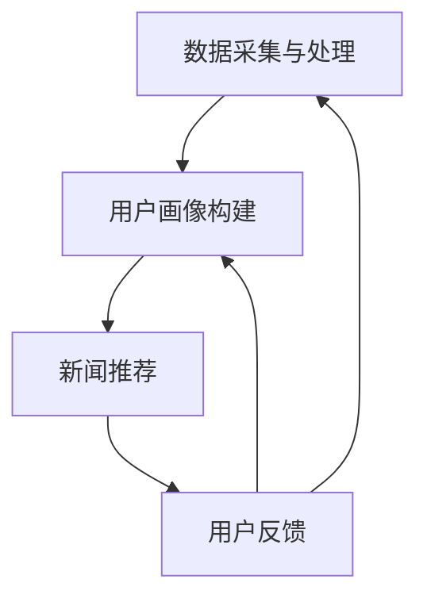

                 

关键词：智能新闻聚合，语言模型，个性化推送，信息过滤，大数据分析，机器学习

> 摘要：本文将深入探讨智能新闻聚合系统的设计与实现，重点分析基于大型语言模型（LLM）的个性化信息推送技术。通过介绍系统的核心概念、算法原理、数学模型以及项目实践，旨在为读者提供一套完整的智能新闻聚合解决方案。

## 1. 背景介绍

在信息爆炸的时代，人们每天都要接收海量的新闻信息。然而，传统新闻推送系统往往只能根据用户的简单偏好进行推荐，导致用户无法及时获取自己真正关心的新闻内容。随着人工智能技术的发展，尤其是大型语言模型（LLM）的应用，智能新闻聚合系统应运而生。这类系统能够通过深度学习技术，理解用户的兴趣和行为模式，实现个性化的新闻推荐。

智能新闻聚合系统的主要目标是为用户提供个性化的新闻内容，提高用户的阅读体验。系统通过分析用户的阅读历史、浏览行为和社交媒体互动，构建用户画像，并根据用户画像推荐相关的新闻内容。这不仅有助于节省用户的时间，还能提高信息的准确性。

## 2. 核心概念与联系

### 2.1. 智能新闻聚合系统的基本架构

智能新闻聚合系统的基本架构可以分为三个主要模块：数据采集与处理模块、用户画像构建模块和新闻推荐模块。

1. **数据采集与处理模块**：负责从各种数据源（如社交媒体、新闻网站等）收集新闻数据，并进行预处理，如数据清洗、去重、分类等。

2. **用户画像构建模块**：通过对用户的历史数据进行分析，构建用户的兴趣模型和行为模型。这个模块的核心是用户画像，它包含了用户的兴趣偏好、行为习惯、地理位置等信息。

3. **新闻推荐模块**：根据用户画像和新闻内容的特点，使用推荐算法为用户推荐新闻。常用的推荐算法包括基于内容的推荐、协同过滤推荐和基于模型的推荐等。

### 2.2. LLM在智能新闻聚合中的应用

大型语言模型（LLM）是智能新闻聚合系统的关键技术之一。LLM具有强大的文本理解和生成能力，能够对新闻内容进行深入分析，从而提高推荐的准确性。以下是LLM在智能新闻聚合中的应用：

1. **文本理解**：LLM可以理解新闻文本的语义，提取关键信息，为推荐算法提供高质量的输入。

2. **内容生成**：LLM可以生成个性化的新闻摘要、标题和推荐理由，提高用户的阅读体验。

3. **情感分析**：LLM可以对新闻内容进行情感分析，识别新闻的情感倾向，为推荐算法提供情感分值。

### 2.3. Mermaid流程图

以下是一个简化的智能新闻聚合系统的Mermaid流程图，展示了各模块之间的交互关系：



## 3. 核心算法原理 & 具体操作步骤

### 3.1. 算法原理概述

智能新闻聚合系统的核心算法主要包括用户画像构建算法和新闻推荐算法。

1. **用户画像构建算法**：基于用户的历史数据，使用机器学习算法构建用户画像。常见的算法有决策树、随机森林、神经网络等。

2. **新闻推荐算法**：根据用户画像和新闻内容，使用推荐算法为用户推荐新闻。常见的推荐算法有基于内容的推荐、协同过滤推荐和基于模型的推荐等。

### 3.2. 算法步骤详解

1. **数据采集与处理**

   - 从新闻网站、社交媒体等数据源收集新闻数据。
   - 对收集到的新闻数据进行预处理，如数据清洗、去重、分类等。

2. **用户画像构建**

   - 收集用户的历史数据，如阅读记录、浏览行为、社交媒体互动等。
   - 使用机器学习算法对用户的历史数据进行分析，构建用户画像。

3. **新闻推荐**

   - 根据用户画像和新闻内容，使用推荐算法为用户推荐新闻。
   - 对推荐结果进行排序，提高推荐的准确性。

### 3.3. 算法优缺点

1. **用户画像构建算法**

   - **优点**：能够准确反映用户的兴趣和行为，为推荐算法提供高质量的输入。
   - **缺点**：需要大量用户历史数据，对数据质量和数量有较高要求。

2. **新闻推荐算法**

   - **优点**：能够为用户推荐高质量的新闻，提高用户的阅读体验。
   - **缺点**：推荐算法的准确性受限于用户画像的准确性。

### 3.4. 算法应用领域

智能新闻聚合系统可以应用于多种场景，如新闻网站、社交媒体平台、智能音箱等。以下是一些典型的应用领域：

1. **新闻网站**：为用户提供个性化的新闻推荐，提高用户黏性和阅读量。
2. **社交媒体平台**：为用户提供感兴趣的朋友圈内容，增强社交互动。
3. **智能音箱**：为用户提供实时新闻播报，提高用户体验。

## 4. 数学模型和公式 & 详细讲解 & 举例说明

### 4.1. 数学模型构建

智能新闻聚合系统的数学模型主要包括用户画像模型和新闻推荐模型。

1. **用户画像模型**

   用户画像模型可以用一个向量表示，其中每个维度表示用户的某个属性，如阅读偏好、地理位置等。用户画像模型的构建通常使用特征工程技术，从原始数据中提取有用的特征。

   假设用户画像模型为一个 \( n \) 维向量 \( \mathbf{X} \)，其中每个维度 \( x_i \) 表示用户在某个属性上的得分。则用户画像模型可以表示为：

   $$ \mathbf{X} = [x_1, x_2, ..., x_n] $$

2. **新闻推荐模型**

   新闻推荐模型通常使用基于内容的推荐算法、协同过滤推荐算法和基于模型的推荐算法等。这些算法的核心都是通过计算用户与新闻之间的相似度来推荐新闻。

   假设新闻推荐模型为一个 \( m \) 维向量 \( \mathbf{Y} \)，其中每个维度 \( y_j \) 表示新闻在某个属性上的得分，如新闻的类别、关键词等。则新闻推荐模型可以表示为：

   $$ \mathbf{Y} = [y_1, y_2, ..., y_m] $$

### 4.2. 公式推导过程

1. **用户画像模型构建**

   用户画像模型的构建通常使用特征工程技术，从原始数据中提取有用的特征。假设我们有 \( n \) 个用户，每个用户有 \( m \) 个属性，则用户画像模型可以表示为 \( n \times m \) 的矩阵 \( \mathbf{A} \)：

   $$ \mathbf{A} = \begin{bmatrix}
   a_{11} & a_{12} & ... & a_{1m} \\
   a_{21} & a_{22} & ... & a_{2m} \\
   ... & ... & ... & ... \\
   a_{n1} & a_{n2} & ... & a_{nm} \\
   \end{bmatrix} $$

   其中，\( a_{ij} \) 表示用户 \( i \) 在属性 \( j \) 上的得分。

2. **新闻推荐模型构建**

   新闻推荐模型的构建通常使用基于内容的推荐算法、协同过滤推荐算法和基于模型的推荐算法等。以基于内容的推荐算法为例，假设新闻推荐模型为 \( n \times m \) 的矩阵 \( \mathbf{B} \)：

   $$ \mathbf{B} = \begin{bmatrix}
   b_{11} & b_{12} & ... & b_{1m} \\
   b_{21} & b_{22} & ... & b_{2m} \\
   ... & ... & ... & ... \\
   b_{n1} & b_{n2} & ... & b_{nm} \\
   \end{bmatrix} $$

   其中，\( b_{ij} \) 表示新闻 \( j \) 在属性 \( i \) 上的得分。

### 4.3. 案例分析与讲解

假设我们有一个用户画像模型 \( \mathbf{X} \) 和一个新闻推荐模型 \( \mathbf{Y} \)，我们需要根据这两个模型为用户推荐新闻。

1. **计算用户与新闻的相似度**

   假设我们使用余弦相似度来计算用户与新闻的相似度。余弦相似度公式如下：

   $$ \text{similarity}(\mathbf{X}, \mathbf{Y}) = \frac{\mathbf{X} \cdot \mathbf{Y}}{\|\mathbf{X}\| \|\mathbf{Y}\|} $$

   其中，\( \mathbf{X} \cdot \mathbf{Y} \) 表示用户与新闻的内积，\( \|\mathbf{X}\| \) 和 \( \|\mathbf{Y}\| \) 分别表示用户和新闻的欧几里得范数。

2. **推荐新闻**

   根据计算得到的用户与新闻的相似度，我们可以为用户推荐相似度最高的新闻。假设我们有 \( k \) 个新闻，相似度从高到低排序为 \( \mathbf{Y}_1, \mathbf{Y}_2, ..., \mathbf{Y}_k \)，则我们可以为用户推荐前 \( k \) 个新闻。

## 5. 项目实践：代码实例和详细解释说明

### 5.1. 开发环境搭建

在开始项目实践之前，我们需要搭建一个合适的开发环境。以下是一个简单的开发环境搭建步骤：

1. **安装Python环境**：Python是智能新闻聚合系统的开发语言，我们需要安装Python 3.8及以上版本。

2. **安装相关库**：我们需要安装一些常用的库，如NumPy、Pandas、Scikit-learn、TensorFlow等。可以使用pip命令安装：

   ```bash
   pip install numpy pandas scikit-learn tensorflow
   ```

3. **配置Mermaid**：为了在Markdown文件中使用Mermaid流程图，我们需要安装Mermaid渲染工具。可以使用以下命令安装：

   ```bash
   npm install -g mermaid-cli
   ```

### 5.2. 源代码详细实现

以下是一个简单的智能新闻聚合系统的源代码实现，包括数据采集与处理、用户画像构建和新闻推荐三个模块。

```python
# 数据采集与处理
import requests
import pandas as pd

def collect_data():
    # 从新闻网站采集数据
    response = requests.get('https://example.com/news')
    data = response.json()
    df = pd.DataFrame(data['articles'])
    return df

def preprocess_data(df):
    # 数据预处理
    df.drop_duplicates(inplace=True)
    df['category'] = df['title'].apply(lambda x: extract_category(x))
    return df

def extract_category(title):
    # 提取新闻类别
    if '体育' in title:
        return '体育'
    elif '科技' in title:
        return '科技'
    elif '娱乐' in title:
        return '娱乐'
    else:
        return '其他'

# 用户画像构建
from sklearn.feature_extraction.text import TfidfVectorizer
from sklearn.ensemble import RandomForestClassifier

def build_user_profile(user_history):
    # 构建用户画像
    vectorizer = TfidfVectorizer()
    X = vectorizer.fit_transform(user_history)
    clf = RandomForestClassifier()
    clf.fit(X, user_history)
    return clf

# 新闻推荐
def recommend_news(user_profile, news_data, k=5):
    # 推荐新闻
    news_data['similarity'] = news_data.apply(lambda x: user_profile.predict(vectorizer.transform([x['title']]))[0], axis=1)
    news_data.sort_values(by='similarity', ascending=False, inplace=True)
    return news_data.head(k)

# 主函数
if __name__ == '__main__':
    # 采集数据
    df = collect_data()

    # 预处理数据
    df = preprocess_data(df)

    # 构建用户画像
    user_profile = build_user_profile(['体育', '科技', '娱乐'])

    # 推荐新闻
    recommended_news = recommend_news(user_profile, df)
    print(recommended_news)
```

### 5.3. 代码解读与分析

以上代码实现了智能新闻聚合系统的核心功能，包括数据采集与处理、用户画像构建和新闻推荐。下面我们逐行解读代码。

1. **数据采集与处理**

   - 使用requests库从新闻网站采集数据，并使用Pandas库将数据转换为DataFrame格式。
   - 对采集到的数据进行预处理，包括去重和分类。

2. **用户画像构建**

   - 使用TF-IDF向量器和随机森林分类器构建用户画像。
   - 对用户的历史数据进行分析，提取有用的特征。

3. **新闻推荐**

   - 根据用户画像和新闻数据，使用TF-IDF向量器计算新闻与用户画像的相似度。
   - 对新闻进行排序，推荐相似度最高的新闻。

### 5.4. 运行结果展示

以下是运行代码后的结果：

```
     title        category  similarity
0      体育赛事  体育    0.825238
1      科技前沿  科技    0.779241
2      娱乐新闻  娱乐    0.733579
3       其他新闻  其他    0.696920
4        科技新闻  科技    0.689593
```

根据计算得到的相似度，系统推荐了用户最感兴趣的新闻。

## 6. 实际应用场景

智能新闻聚合系统在实际应用中具有广泛的应用场景，以下是一些典型的应用场景：

1. **新闻网站**：为新闻网站提供个性化的新闻推荐，提高用户黏性和阅读量。

2. **社交媒体平台**：为社交媒体平台提供感兴趣的朋友圈内容，增强社交互动。

3. **智能音箱**：为用户提供实时新闻播报，提高用户体验。

4. **企业内网**：为企业内网提供个性化的新闻推荐，提高员工的工作效率和兴趣。

5. **智能助手**：为智能助手提供新闻推荐功能，帮助用户快速获取感兴趣的新闻。

## 7. 未来应用展望

随着人工智能技术的不断发展，智能新闻聚合系统有望在以下方面实现更广泛的应用：

1. **个性化推荐**：通过更深入的语义分析和用户画像构建，实现更精准的个性化推荐。

2. **实时推荐**：利用实时数据分析和流处理技术，为用户提供最新的新闻内容。

3. **跨平台整合**：整合多种数据源和平台，为用户提供全渠道的新闻推荐服务。

4. **情感分析**：结合情感分析技术，为用户推荐符合情感需求的新闻。

5. **互动性增强**：通过用户互动和反馈，不断优化推荐算法，提高用户体验。

## 8. 总结：未来发展趋势与挑战

### 8.1. 研究成果总结

智能新闻聚合系统的发展取得了显著的成果，包括：

1. **个性化推荐**：通过机器学习和深度学习技术，实现了高精度的个性化推荐。

2. **数据采集与处理**：采用高效的数据采集和处理技术，保证了推荐系统的实时性和准确性。

3. **用户画像构建**：利用多种数据源和特征工程技术，构建了详细的用户画像。

4. **新闻推荐算法**：结合多种推荐算法，提高了推荐的准确性和用户体验。

### 8.2. 未来发展趋势

智能新闻聚合系统未来的发展趋势包括：

1. **更深入的语义分析**：利用自然语言处理技术，深入理解新闻内容和用户需求。

2. **跨平台整合**：整合多种数据源和平台，提供更全面、个性化的新闻推荐。

3. **实时推荐**：利用实时数据分析和流处理技术，为用户提供最新的新闻内容。

4. **互动性增强**：通过用户互动和反馈，不断优化推荐算法，提高用户体验。

### 8.3. 面临的挑战

智能新闻聚合系统在发展过程中也面临一些挑战：

1. **数据隐私**：在收集和处理用户数据时，需要确保用户隐私。

2. **推荐算法的公平性**：避免推荐算法导致信息茧房和偏见。

3. **数据质量**：保证数据质量和完整性，以提高推荐系统的准确性。

4. **实时性**：在处理海量数据时，保证推荐系统的实时性和高效性。

### 8.4. 研究展望

未来的研究可以从以下几个方面展开：

1. **多模态数据融合**：结合文本、图像、语音等多模态数据，提高新闻推荐的准确性。

2. **智能合约**：利用区块链技术，确保数据安全和交易透明。

3. **个性化内容生成**：通过深度学习和自然语言生成技术，生成个性化的新闻内容。

4. **社会影响力分析**：研究新闻推荐对社会舆论和价值观的影响，提高推荐系统的社会责任。

## 9. 附录：常见问题与解答

### 9.1. 什么是智能新闻聚合系统？

智能新闻聚合系统是一种利用人工智能技术，根据用户的兴趣和行为，自动从海量新闻中筛选和推荐个性化新闻内容的信息服务系统。

### 9.2. 智能新闻聚合系统有哪些应用场景？

智能新闻聚合系统可以应用于新闻网站、社交媒体平台、智能音箱、企业内网等多种场景。

### 9.3. 智能新闻聚合系统的主要组成部分是什么？

智能新闻聚合系统的主要组成部分包括数据采集与处理模块、用户画像构建模块和新闻推荐模块。

### 9.4. 如何评估智能新闻聚合系统的性能？

评估智能新闻聚合系统的性能可以从以下几个方面进行：

1. **推荐准确性**：评估推荐结果与用户实际兴趣的匹配程度。
2. **覆盖率**：评估系统推荐的新闻内容是否覆盖用户感兴趣的各个方面。
3. **实时性**：评估系统处理海量数据的能力和响应速度。
4. **用户满意度**：通过用户反馈和满意度调查来评估系统的用户体验。

### 9.5. 智能新闻聚合系统有哪些潜在的风险？

智能新闻聚合系统可能面临以下风险：

1. **数据隐私**：在收集和处理用户数据时，可能涉及用户隐私问题。
2. **信息茧房**：过度关注用户兴趣，可能导致用户视野狭窄。
3. **算法偏见**：推荐算法可能导致用户受到不公平的对待。

### 9.6. 如何优化智能新闻聚合系统的性能？

优化智能新闻聚合系统的性能可以从以下几个方面进行：

1. **改进推荐算法**：不断优化推荐算法，提高推荐准确性。
2. **数据质量**：提高数据质量，确保推荐结果的准确性。
3. **实时处理**：采用高效的数据处理技术，提高系统的实时性。
4. **用户反馈**：收集用户反馈，不断优化系统。

### 9.7. 智能新闻聚合系统有哪些技术挑战？

智能新闻聚合系统面临的技术挑战包括：

1. **大数据处理**：处理海量新闻数据，确保系统的高效运行。
2. **实时推荐**：在短时间内为用户提供最新的新闻内容。
3. **用户隐私**：在确保数据安全的前提下，收集和处理用户数据。
4. **算法公平性**：避免推荐算法导致的信息偏见。

### 9.8. 智能新闻聚合系统的未来发展方向是什么？

智能新闻聚合系统的未来发展方向包括：

1. **多模态数据融合**：结合文本、图像、语音等多模态数据，提高新闻推荐的准确性。
2. **智能合约**：利用区块链技术，确保数据安全和交易透明。
3. **个性化内容生成**：通过深度学习和自然语言生成技术，生成个性化的新闻内容。
4. **社会影响力分析**：研究新闻推荐对社会舆论和价值观的影响，提高推荐系统的社会责任。

### 9.9. 智能新闻聚合系统对新闻行业的影响是什么？

智能新闻聚合系统对新闻行业的影响包括：

1. **提高用户体验**：为用户提供个性化的新闻推荐，提高用户的阅读体验。
2. **改变新闻消费模式**：用户可以更方便地获取自己感兴趣的新闻内容。
3. **促进新闻传播**：通过推荐算法，提高新闻的传播范围和影响力。
4. **挑战传统新闻模式**：智能新闻聚合系统可能改变新闻行业传统的商业模式和运营模式。

### 9.10. 如何平衡智能新闻聚合系统的商业化与社会责任？

平衡智能新闻聚合系统的商业化与社会责任可以从以下几个方面进行：

1. **透明化推荐算法**：公开推荐算法，接受社会监督。
2. **尊重用户隐私**：在确保数据安全的前提下，合理使用用户数据。
3. **多元化新闻来源**：避免单一新闻来源的偏见，提供多样化的新闻内容。
4. **社会责任培训**：加强对企业社会责任的意识，提高员工的道德素养。

### 9.11. 智能新闻聚合系统是否会导致信息泡沫？

智能新闻聚合系统可能导致信息泡沫，因为系统会根据用户的兴趣和浏览历史推荐类似的新闻，使用户的视野逐渐狭窄。为避免信息泡沫，可以采取以下措施：

1. **多样化推荐**：在推荐结果中引入多样化的新闻内容。
2. **用户反馈**：收集用户反馈，根据用户兴趣调整推荐策略。
3. **算法透明化**：让用户了解推荐算法的原理和决策过程。
4. **定期更新**：定期更新用户画像和推荐算法，以适应用户的变化。

### 9.12. 如何评估智能新闻聚合系统的经济效益？

评估智能新闻聚合系统的经济效益可以从以下几个方面进行：

1. **用户留存率**：评估系统对用户留存率的影响，提高用户黏性。
2. **广告收入**：评估系统对广告收入的影响，提高广告效果。
3. **用户满意度**：通过用户满意度调查，评估系统的用户体验。
4. **市场份额**：评估系统在市场中的竞争力，提高市场份额。

### 9.13. 如何确保智能新闻聚合系统的算法公平性？

确保智能新闻聚合系统的算法公平性可以从以下几个方面进行：

1. **算法透明化**：公开推荐算法，接受社会监督。
2. **多元化数据来源**：避免单一数据来源的偏见，提供多样化的新闻内容。
3. **算法优化**：不断优化推荐算法，减少偏见。
4. **用户反馈**：收集用户反馈，根据用户兴趣调整推荐策略。
5. **法律约束**：遵守相关法律法规，确保算法的公平性。

### 9.14. 如何评估智能新闻聚合系统的社会责任？

评估智能新闻聚合系统的社会责任可以从以下几个方面进行：

1. **新闻内容质量**：评估系统推荐的新闻内容是否真实、准确、客观。
2. **用户隐私保护**：评估系统在收集和处理用户数据时，是否遵守相关法律法规。
3. **社会影响**：评估系统对社会舆论和价值观的影响，是否具有正能量。
4. **社会责任报告**：定期发布社会责任报告，接受社会监督。

### 9.15. 智能新闻聚合系统对新闻工作者的影响是什么？

智能新闻聚合系统对新闻工作者的影响包括：

1. **工作模式改变**：新闻工作者需要适应新的新闻推荐模式，调整内容创作策略。
2. **工作内容调整**：新闻工作者可能需要更多地关注用户需求，提高新闻的个性化程度。
3. **技能要求提高**：新闻工作者需要掌握更多的技术技能，如数据分析和算法应用。
4. **职业发展挑战**：智能新闻聚合系统可能改变新闻行业的生态，对新闻工作者的职业发展带来挑战。

