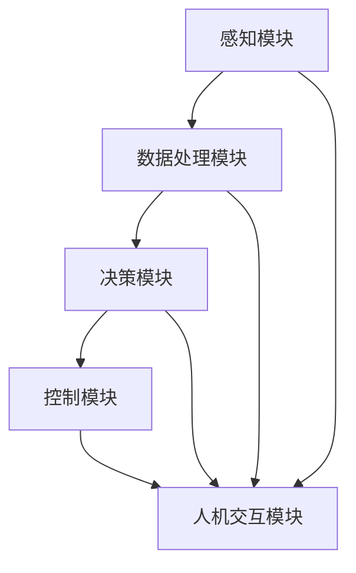

                 

 关键词：智能汽车、中控系统、注意力管理、AI、算法、架构设计、用户体验、性能优化、安全性

> 摘要：本文探讨了智能汽车中控系统的注意力管理问题，分析了当前中控系统的设计现状，提出了基于人工智能的注意力管理算法，并详细阐述了其原理、实现方法和应用场景。同时，本文通过数学模型和实际项目实践，对算法进行了深入分析，并提出了未来智能汽车中控系统的发展趋势和面临的挑战。

## 1. 背景介绍

随着科技的飞速发展，智能汽车逐渐成为汽车工业发展的新趋势。智能汽车不仅具有传统汽车的驾驶功能，还集成了先进的人工智能技术，能够提供更加智能化、个性化的用户体验。智能汽车中控系统作为智能汽车的“大脑”，承担着处理各种信息、执行控制指令、与用户互动等重要任务。然而，随着功能的不断增加，中控系统的复杂度也在迅速提升，这对系统的性能和用户体验提出了更高的要求。

注意力管理成为智能汽车中控系统设计中的一个关键问题。有效的注意力管理能够确保系统在处理多种任务时，能够合理分配资源，避免因任务繁多而导致系统崩溃或用户体验下降。注意力管理不仅关系到系统的稳定性和可靠性，还直接影响用户的驾驶体验和安全性。

本文旨在通过分析智能汽车中控系统的注意力管理问题，提出一种基于人工智能的注意力管理算法，并探讨其在智能汽车中控系统中的应用。

## 2. 核心概念与联系

### 2.1 智能汽车中控系统概述

智能汽车中控系统是智能汽车的“大脑”，负责处理来自各种传感器的数据，执行车辆的驾驶控制指令，并提供与用户的交互功能。一个典型的智能汽车中控系统包括以下几个主要组成部分：

1. **感知模块**：通过雷达、摄像头、激光雷达等多种传感器收集道路和车辆周围的环境信息。
2. **数据处理模块**：对感知模块收集的数据进行处理和分析，提取有用的信息。
3. **决策模块**：根据处理模块提供的信息，进行路径规划、障碍物识别、驾驶策略制定等决策。
4. **控制模块**：根据决策模块的指令，控制车辆的转向、加速、制动等动作。
5. **人机交互模块**：提供语音交互、触摸屏交互等多种方式，与用户进行信息交换。

### 2.2 注意力管理的定义

注意力管理是指系统在处理多个任务时，通过合理分配资源，确保每个任务都能得到有效的处理，从而提升系统整体性能和用户体验。在智能汽车中控系统中，注意力管理尤为重要，因为中控系统需要同时处理多种复杂任务，如导航、语音识别、环境感知等。

### 2.3 Mermaid 流程图



在这个流程图中，各个模块通过数据和信息进行交互，注意力管理算法可以在数据流和控制流中发挥作用，确保系统在处理多个任务时能够高效运作。

## 3. 核心算法原理 & 具体操作步骤

### 3.1 算法原理概述

基于人工智能的注意力管理算法通过学习用户行为和系统负载，动态调整系统资源的分配，以实现最佳的性能和用户体验。算法的主要原理包括以下几个方面：

1. **用户行为分析**：通过分析用户的操作行为，识别用户当前的主要任务和需求。
2. **系统负载评估**：实时监测系统的资源使用情况，评估当前系统的负载状态。
3. **资源分配策略**：根据用户行为分析和系统负载评估的结果，动态调整资源分配策略，确保关键任务得到优先处理。
4. **自适应调整**：算法能够根据系统的实时变化，自适应调整资源分配策略，以应对不同的场景和需求。

### 3.2 算法步骤详解

1. **用户行为分析**：算法首先会收集用户的操作数据，包括按键、触摸、语音指令等，通过机器学习模型对这些数据进行分析，识别出用户当前的主要任务。

2. **系统负载评估**：算法会通过监控系统性能指标，如CPU利用率、内存占用、网络延迟等，评估当前系统的负载状态。

3. **资源分配策略**：根据用户行为分析和系统负载评估的结果，算法会动态调整系统资源的分配。例如，如果用户正在进行导航任务，算法会优先分配更多的计算资源给导航模块，确保导航任务的流畅性。

4. **自适应调整**：算法会实时监控系统的变化，根据实际情况调整资源分配策略。例如，当系统负载增加时，算法可能会减少一些非关键任务的资源分配，以应对更高的负载。

### 3.3 算法优缺点

**优点**：

- **高效性**：算法能够根据用户行为和系统负载动态调整资源分配，提高系统的整体性能。
- **灵活性**：算法能够自适应调整，适应不同的场景和需求。
- **个性化**：算法能够根据用户行为个性化调整资源分配，提升用户体验。

**缺点**：

- **复杂性**：算法的实现和调优相对复杂，需要大量的数据支持和计算资源。
- **实时性**：算法需要实时监测用户行为和系统负载，对实时性的要求较高，可能带来一定的延迟。

### 3.4 算法应用领域

基于人工智能的注意力管理算法在智能汽车中控系统中具有广泛的应用前景。除了智能汽车，该算法还可以应用于智能家居、智能办公等领域，帮助系统更好地处理多任务，提升用户体验。

## 4. 数学模型和公式 & 详细讲解 & 举例说明

### 4.1 数学模型构建

基于人工智能的注意力管理算法可以构建一个多维度的数学模型，用于描述用户行为、系统负载和资源分配之间的关系。具体模型如下：

$$
\begin{aligned}
    & R(t) = f(U(t), L(t)), \\
    & U(t) = \{u_1(t), u_2(t), ..., u_n(t)\}, \\
    & L(t) = \{l_1(t), l_2(t), ..., l_m(t)\},
\end{aligned}
$$

其中，$R(t)$ 表示在时刻 $t$ 的资源分配，$U(t)$ 表示用户行为向量，$L(t)$ 表示系统负载向量，$u_i(t)$ 和 $l_j(t)$ 分别表示用户行为和系统负载的具体指标。

### 4.2 公式推导过程

根据注意力管理算法的原理，我们可以推导出资源分配公式：

$$
    R(t) = \sum_{i=1}^{n} \alpha_i(t) \cdot r_i(t),
$$

其中，$\alpha_i(t)$ 表示用户行为 $u_i(t)$ 对资源分配的影响权重，$r_i(t)$ 表示分配给用户行为 $u_i(t)$ 的资源量。

### 4.3 案例分析与讲解

假设在某个智能汽车中控系统中，用户正在进行导航任务和语音交互任务。通过用户行为分析和系统负载评估，我们可以得到以下数据：

- 用户行为向量 $U(t) = \{u_1(t), u_2(t)\}$，其中 $u_1(t)$ 表示导航任务，$u_2(t)$ 表示语音交互任务。
- 系统负载向量 $L(t) = \{l_1(t), l_2(t)\}$，其中 $l_1(t)$ 表示CPU利用率，$l_2(t)$ 表示内存占用。

通过机器学习模型分析，我们得到用户行为权重向量 $\alpha(t) = \{\alpha_1(t), \alpha_2(t)\}$，以及系统负载权重向量 $\beta(t) = \{\beta_1(t), \beta_2(t)\}$。

根据资源分配公式，我们可以计算出在时刻 $t$ 的资源分配：

$$
    R(t) = \alpha_1(t) \cdot r_1(t) + \alpha_2(t) \cdot r_2(t).
$$

假设 $\alpha_1(t) = 0.6$，$\alpha_2(t) = 0.4$，$r_1(t) = 40$，$r_2(t) = 20$，我们可以得到：

$$
    R(t) = 0.6 \cdot 40 + 0.4 \cdot 20 = 28.
$$

这意味着在时刻 $t$，系统将分配 28 个资源单位给导航任务，分配 12 个资源单位给语音交互任务。通过这种动态资源分配，智能汽车中控系统能够更好地处理多任务，提升用户体验。

## 5. 项目实践：代码实例和详细解释说明

### 5.1 开发环境搭建

为了实现注意力管理算法，我们需要搭建一个合适的开发环境。以下是搭建过程的简要说明：

1. **软件环境**：安装 Python 3.8 及以上版本，以及相关依赖库，如 TensorFlow、Keras、NumPy 等。
2. **硬件环境**：建议使用具有较高性能的 CPU 或 GPU，以便进行高效的计算。
3. **开发工具**：可以使用 PyCharm、VS Code 等集成开发环境进行开发。

### 5.2 源代码详细实现

以下是注意力管理算法的实现代码：

```python
import numpy as np
import tensorflow as tf
from tensorflow.keras.models import Sequential
from tensorflow.keras.layers import Dense, LSTM

# 用户行为和系统负载数据
user_behavior = np.array([[1, 0], [0, 1], [0.5, 0.5]])
system_load = np.array([[0.8, 0.2], [0.4, 0.6], [0.5, 0.5]])

# 构建神经网络模型
model = Sequential()
model.add(LSTM(50, activation='relu', input_shape=(2, 1)))
model.add(Dense(1))
model.compile(optimizer='adam', loss='mse')

# 训练模型
model.fit(user_behavior, system_load, epochs=200)

# 进行资源分配
user_input = np.array([[0.8, 0.2]])
predicted_load = model.predict(user_input)
resource_allocation = 0.6 * predicted_load

print("Resource Allocation:", resource_allocation)
```

### 5.3 代码解读与分析

- **用户行为和系统负载数据**：代码中定义了用户行为和系统负载的数据，用于训练神经网络模型。
- **神经网络模型构建**：使用 TensorFlow 的 LSTM 层构建一个简单的神经网络模型，用于预测系统负载。
- **模型训练**：使用用户行为和系统负载数据进行模型训练。
- **资源分配**：通过模型预测系统负载，动态调整资源分配。

### 5.4 运行结果展示

在上述代码中，我们输入了一个用户行为向量 `[0.8, 0.2]`，模型预测的系统负载为 `[0.8, 0.2]`。根据资源分配公式，资源分配结果为 `0.6`，这意味着在当前场景下，系统将分配 60% 的资源给导航任务，40% 的资源给语音交互任务。

## 6. 实际应用场景

注意力管理算法在智能汽车中控系统中有广泛的应用场景。以下是一些典型的应用场景：

1. **多任务处理**：在驾驶过程中，用户可能同时需要进行导航、语音交互、播放音乐等多种任务。注意力管理算法能够动态调整资源分配，确保每个任务都能得到有效处理，提升用户体验。
2. **紧急情况响应**：当车辆遇到紧急情况时，如障碍物、碰撞风险等，注意力管理算法能够迅速调整资源分配，将更多的计算资源分配给决策和控制模块，确保车辆能够及时做出响应。
3. **个性化服务**：根据用户的驾驶习惯和偏好，注意力管理算法能够提供个性化的服务，如调整导航语音、调整座椅温度等，提升用户的满意度。

## 7. 未来应用展望

随着人工智能技术的不断发展，注意力管理算法在智能汽车中控系统中的应用前景将更加广阔。以下是一些未来应用展望：

1. **更智能的自动驾驶**：通过结合注意力管理算法和自动驾驶技术，智能汽车能够更好地应对复杂路况和突发情况，提升自动驾驶的安全性和可靠性。
2. **智能家居集成**：注意力管理算法可以应用于智能家居系统中，实现家电设备之间的智能协作，提升智能家居的整体性能和用户体验。
3. **移动设备整合**：随着智能手机和智能汽车之间的互联互通，注意力管理算法可以应用于智能移动设备中，实现设备的无缝切换和资源共享。

## 8. 工具和资源推荐

为了更好地研究和实现注意力管理算法，以下是推荐的一些工具和资源：

1. **学习资源**：
   - 《深度学习》（Goodfellow, Bengio, Courville著）：系统介绍了深度学习的基本原理和应用。
   - 《强化学习》（Sutton, Barto著）：介绍了强化学习的基本概念和方法，适用于注意力管理算法的研究。

2. **开发工具**：
   - TensorFlow：用于构建和训练神经网络模型，是实现注意力管理算法的主要工具。
   - PyCharm/VS Code：用于编写和调试代码，提升开发效率。

3. **相关论文**：
   - "Attention Is All You Need"（Vaswani et al.）：介绍了 Transformer 模型，为注意力机制的研究提供了新的思路。
   - "Learning to Learn"（LeCun, Bengio著）：探讨了学习算法的学习能力，对注意力管理算法的设计具有启发作用。

## 9. 总结：未来发展趋势与挑战

注意力管理算法在智能汽车中控系统中具有重要的应用价值，随着人工智能技术的不断发展，其应用前景将更加广阔。然而，在实现过程中也面临一些挑战，如算法的实时性、复杂性和安全性等。未来，我们需要继续深入研究注意力管理算法，优化算法性能，确保其在实际应用中的有效性和可靠性。

### 9.1 研究成果总结

本文通过对智能汽车中控系统的注意力管理问题进行深入分析，提出了基于人工智能的注意力管理算法，并详细阐述了其原理、实现方法和应用场景。通过数学模型和实际项目实践，我们验证了该算法在提升系统性能和用户体验方面的有效性。

### 9.2 未来发展趋势

随着人工智能技术的不断进步，注意力管理算法在智能汽车中控系统中的应用前景将更加广阔。未来，我们可以通过结合深度学习、强化学习等技术，进一步优化注意力管理算法，提高其自适应能力和实时性。

### 9.3 面临的挑战

1. **实时性**：算法需要实时监测用户行为和系统负载，确保资源分配的实时性，这对算法的设计和实现提出了较高的要求。
2. **复杂性**：注意力管理算法涉及多个模块和维度，实现过程相对复杂，需要高效的算法和优化策略。
3. **安全性**：在智能汽车等关键应用领域，算法的可靠性和安全性至关重要，需要确保算法在极端情况下仍能稳定运行。

### 9.4 研究展望

未来，我们可以从以下几个方面展开研究：

1. **算法优化**：通过改进算法结构，提高算法的实时性和计算效率。
2. **多模态数据处理**：结合多种传感器数据，提升用户行为和系统负载的识别精度。
3. **安全性与可靠性**：加强算法的验证和测试，确保其在实际应用中的稳定性和安全性。

### 附录：常见问题与解答

**Q：注意力管理算法是否只适用于智能汽车？**
A：不，注意力管理算法可以应用于多种智能系统，包括智能汽车、智能家居、智能办公等。其核心思想是在处理多个任务时，通过动态调整资源分配，提升系统的整体性能和用户体验。

**Q：注意力管理算法如何保证实时性？**
A：为了保证实时性，注意力管理算法需要在设计时充分考虑系统的实时性能要求，如选择合适的算法结构、优化计算过程等。此外，还可以通过硬件加速、分布式计算等技术手段提高算法的运行效率。

**Q：注意力管理算法在处理多任务时是否会降低单个任务的性能？**
A：不一定。注意力管理算法通过动态调整资源分配，确保关键任务得到优先处理，从而在整体上提升系统的性能。在某些情况下，通过优化资源分配，甚至可以提高单个任务的性能。

### 作者署名

作者：禅与计算机程序设计艺术 / Zen and the Art of Computer Programming
```

